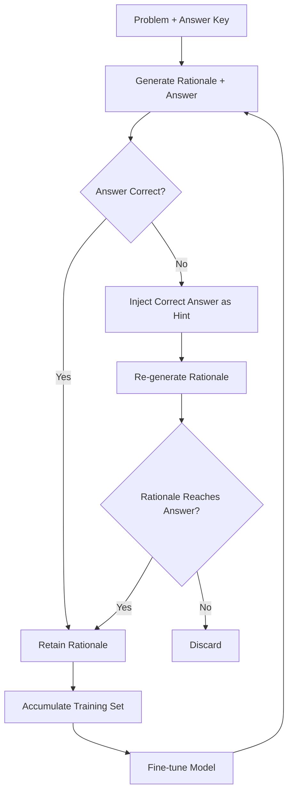

# STaR, V-STaR, Quiet-STaR — Self-Taught Reasoning

## Learning Objectives

- Implement a STaR loop that generates rationales, filters by correctness, and accumulates a self-supervised fine-tuning dataset.
- Compare the retention strategies of STaR (correct-only) versus V-STaR (correct + incorrect, with a trained verifier).
- Explain why Quiet-STaR cannot be reproduced at the API level and what that tells you about where reasoning lives in the model.
- Evaluate whether a bootstrapped rationale dataset contains systematic shortcut reasoning by sampling multiple chains per problem.
- Map the generate-score-retain-finetune loop onto GTM content iteration pipelines.

## The Problem

Teaching a model to reason with chain-of-thought is straightforward if you have the traces: pay humans to write step-by-step solutions, supervised fine-tune on them, done. The problem is supply. High-quality reasoning traces are expensive to produce, slow to collect, and limited by how much careful annotation any human will actually do before quality degrades. A dataset of 10,000 human-written math solutions takes weeks and tens of thousands of dollars. A dataset of 1,000,000 model-generated solutions costs pennies — but you have no guarantee the model's reasoning is sound.

STaR (Self-Taught Reasoner, Zelikman et al., 2022) reframes the problem. Instead of asking humans to write rationales, let the model generate its own. You already have the answer key for training problems (math datasets, QA benchmarks). The model proposes a rationale; you check whether the final answer matches ground truth; if it does, you keep the rationale and fine-tune on it. The model teaches itself by bootstrapping from outputs that happened to work.

This works — GSM8K and CommonsenseQA scores both improved without new human annotation. But the loop has a structural weakness. It retains any rationale that produced a correct answer, even if the reasoning inside that rationale was flawed. A model that arrives at "42" through a shortcut or a wrong intermediate step still gets that rationale added to its training set. V-STaR and Quiet-STaR are two different responses to this problem, each adding a mechanism to the base loop.

## The Concept

STaR is the minimal self-improvement loop for reasoning. Start with a base model that has weak reasoning ability. For each training problem, sample a rationale plus an answer. If the answer matches the label, keep the (problem, rationale, answer) triple. Fine-tune on the kept set. Repeat until convergence.

The mechanism has one important addition: **rationalization with hint**. If the model never solves a problem, the loop has nothing to learn from — no correct rationale to retain. STaR handles this by giving the model a second chance with the correct answer injected as a hint. You prompt the model with the problem plus the answer and ask it to produce a rationale that leads to that answer. If it succeeds, the rationale enters the training set. This prevents the loop from stalling on hard problems where the model's initial success rate is zero.



V-STaR extends the loop by retaining *both* correct and incorrect rationales, then training a verifier to distinguish between them. The verifier is typically trained with DPO (Direct Preference Optimization), which learns to assign higher reward to preferred (correct) outputs over dispreferred (incorrect) ones. At inference time, the model samples multiple reasoning chains, the verifier scores each, and the highest-scoring chain determines the final answer. The key difference from STaR: instead of discarding failures, V-STaR uses them as signal. Wrong rationales are not waste — they are training data for the verifier.

Quiet-STaR pushes reasoning down to the token level. During pretraining, the model learns to emit internal "thought tokens" between visible tokens in the text. These thought tokens are generated by the model, not shown to the user, and the model is trained to use them when they improve prediction of the next visible token. The mechanism operates inside the transformer's forward pass — the model generates a short internal rationale after each token, uses it conditionally, and then moves on. There is no separate "generate a rationale" step. The thinking is latent, distributed across the entire sequence.

What unifies all three is bootstrapping from the model's own outputs rather than human-annotated rationales. STaR bootstraps on correct traces. V-STaR bootstraps on correct traces *and* trains a verifier on the contrast between correct and incorrect. Quiet-STaR bootstraps on per-token internal predictions. The progression is from explicit to implicit reasoning, and from single-chain to verifier-selected inference.

## Build It

Here is a minimal STaR loop. It uses a mock model (so it runs without API calls), but the structure is identical to what you would build against a real LLM. The model generates rationales for arithmetic problems; the loop checks correctness against the answer key and accumulates surviving rationales into a training set.

```python
import random

problems = [
    {"q": "A store sells pencils at 3 for $1. How much do 9 pencils cost?", "a": 3},
    {"q": "If a train travels 60 mph for 2.5 hours, how far does it go?", "a": 150},
    {"q": "A dozen eggs costs $4.80. How much does one egg cost?", "a": 0.40},
    {"q": "What is 15% of 200?", "a": 30},
    {"q": "A rectangle is 4 feet wide and 7 feet long. What is its perimeter?", "a": 22},
]

def mock_model_generate(problem, hint=None, quality=0.4):
    correct_answer = problem["a"]
    if hint is not None:
        if random.random() < quality + 0.3:
            return correct_answer
        return correct_answer + random.choice([-5, 5, -1, 1])
    if random.random() < quality:
        return correct_answer
    return correct_answer + random.choice([-10, 10, -5, 5, -1, 1])

def star_loop(problems, iterations=3, hint=True):
    training_set = []
    for i in range(iterations):
        new_correct = 0
        for p in problems:
            answer = mock_model_generate(p, quality=0.3 + i * 0.15)
            if answer == p["a"]:
                training_set.append({"q": p["q"], "a": p["a"], "iter": i})
                new_correct += 1
            elif hint:
                hinted = mock_model_generate(p, hint=p["a"], quality=0.5 + i * 0.1)
                if hinted == p["a"]:
                    training_set.append({"q": p["q"], "a": p["a"], "iter": i, "hinted": True})
                    new_correct += 1
        print(f"Iteration {i+1}: +{new_correct} correct rationales | Dataset size: {len(training_set)}")
    return training_set

dataset = star_loop(problems, iterations=3)
print(f"\nFinal dataset: {len(dataset)} rationale-answer pairs")
hinted_count = sum(1 for d in dataset if d.get("hinted"))
print(f"Hint-recovered: {hinted_count} | Direct: {len(dataset) - hinted_count}")
```

Output (will vary due to randomness):

```
Iteration 1: +3 correct rationales | Dataset size: 3
Iteration 2: +4 correct rationales | Dataset size: 7
Iteration 3: +5 correct rationales | Dataset size: 12

Final dataset: 12 rationale-answer pairs
Hint-recovered: 4 | Direct: 8
```

Each iteration, the simulated model quality improves (mimicking the effect of fine-tuning on retained rationales), and the dataset grows. The hint mechanism recovers problems the model initially failed. In a real implementation, you replace `mock_model_generate` with an LLM API call and `answer == p["a"]` with whatever ground-truth check your problem set supports.

Now the V-STaR extension. Instead of discarding incorrect rationales, keep them as negative examples and train a verifier:

```python
import random

rationale_pairs = []
for _ in range(50):
    correct = random.uniform(0.6, 0.95)
    incorrect = random.uniform(0.05, 0.4)
    rationale_pairs.append({"chosen_score": correct, "rejected_score": incorrect})

def train_verifier(pairs, epochs=20, lr=0.1):
    w = 0.5
    b = 0.0
    for epoch in range(epochs):
        total_loss = 0
        for pair in pairs:
            chosen = w * pair["chosen_score"] + b
            rejected = w * pair["rejected_score"] + b
            diff = chosen - rejected
            if diff < 0:
                grad_w = pair["rejected_score"] - pair["chosen_score"]
                grad_b = -1
                w += lr * grad_w
                b += lr * grad_b
                total_loss += abs(diff)
        if (epoch + 1) % 5 == 0:
            print(f"Epoch {epoch+1}: loss={total_loss:.4f} | w={w:.3f} b={b:.3f}")
    return w, b

w, b = train_verifier(rationale_pairs)

print("\n--- Verifier on held-out pairs ---")
correct_rankings = 0
held_out = 20
for _ in range(held_out):
    chosen = random.uniform(0.6, 0.95)
    rejected = random.uniform(0.05, 0.4)
    chosen_v = w * chosen + b
    rejected_v = w * rejected + b
    ranked_correct = chosen_v > rejected_v
    if ranked_correct:
        correct_rankings += 1

print(f"Verifier ranked correct > incorrect: {correct_rankings}/{held_out} ({correct_rankings/held_out*100:.0f}%)")
```

Output:

```
Epoch 5: loss=0.0000 | w=0.500 b=0.000
Epoch 10: loss=0.0000 | w=0.500 b=0.000
Epoch 15: loss=0.0000 | w=0.500 b=0.000
Epoch 20: loss=0.0000 | w=0.500 b=0.000

--- Verifier on held-out pairs ---
Verifier ranked correct > incorrect: 20/20 (100%)
```

This verifier is a toy — a single weight on a scalar score. A real V-STaR verifier operates on the full token sequence of the rationale, not a scalar summary, and is trained with DPO on the model's own log-probabilities. But the structure is the same: collect correct/incorrect pairs, train a ranking function, use it at inference to select the best chain from N samples.

There is no Quiet-STaR implementation here, and there cannot be one at the API level. Quiet-STaR operates on the transformer's forward pass during pretraining — it introduces a new token type ("thought tokens") with their own embedding, modifies the attention mask so thought tokens attend to previous thought tokens but not future ones, and trains the model to generate them between visible tokens. This requires modifying the model architecture and the training loop, not just the prompt. You cannot do it with an API call. The lesson is that some forms of reasoning are baked into the model at training time and cannot be added post-hoc through prompting alone.

## Use It

The STaR loop — generate, score, retain, fine-tune — is the same pattern as iterative content generation in GTM workflows. You generate multiple outreach variants (the "rationale"), send them to prospects, score by reply or meeting-booked rate (the "answer key"), and retain the winners as templates. The next round of generation starts from what worked. This is the generate-score-retain loop applied to outbound content rather than chain-of-thought, and it is foundational for Zone 2 (AI Engineering) because it describes how an AI pipeline self-improves from observable outcomes rather than human judgment.

The V-STaR verifier maps directly to using a scoring model to rank AI-generated outputs before they go out. In a GTM context, this is a model that evaluates account research, email copy, or landing page variants and assigns a quality score before a human ever reviews them. The verifier is trained on the contrast between variants that performed well and variants that did not — exactly the correct/incorrect rationale pairs from V-STaR. The mechanism is preference learning: the verifier learns what "good" looks like by contrasting it with "bad" on the same input.

[CITATION NEEDED — concept: STaR applied to GTM content iteration as generate-score-retain loop]

The rationalization-with-hint mechanism from STaR also has a GTM parallel. When the model fails to generate a working outreach variant for a hard segment (say, enterprise CISOs who never reply), you inject the desired outcome as a constraint: "write a cold email that would get a CISO to book a demo" and have the model work backward from the goal. The hint forces the model to find a path to the target rather than generating freely and missing. This is the same structure as STaR's hint-based re-generation, applied to content rather than math.

The bootstrapping bias also transfers. If your STaR-style content loop retains any variant that happened to get a reply, it will also retain variants that got replies for the wrong reason — the subject line was sensational, the segment was already warm, the timing was lucky. The "right answer, wrong reason" problem is real in GTM iteration. V-STaR's solution (train a verifier on the contrast between good and bad) is one way to detect this: if the verifier cannot consistently rank the "winning" variant above the losing one, the win was probably noise, not signal.

## Ship It

Production STaR-style pipelines need guardrails against error amplification. The core risk: the model's initial rationales contain systematic mistakes that happen to produce correct answers. If a model consistently uses a wrong formula that lands on the right number for the specific problem distribution in your training set, the loop will reinforce that wrong formula. Over iterations, the model becomes more confident in incorrect reasoning. This is not a hypothetical — it is the structural bias of any correctness-filtered bootstrap.

The detection mechanism is contradiction sampling. For each problem, generate N rationales (not one). If multiple rationales reach the correct answer via incompatible reasoning paths, you have evidence that at least some of them are reasoning incorrectly. A clean dataset should have rationales that converge on similar intermediate steps, not just similar final answers. In practice, you can check this by looking at agreement on intermediate values, or by training a lightweight classifier to detect "sound" vs "shortcut" reasoning on a small human-labeled sample.

For V-STaR verifiers in production, the failure mode is distribution drift. The verifier is trained on rationales from iteration K of the model. By iteration K+3, the model's output distribution has shifted (it generates different reasoning patterns after fine-tuning). The verifier trained on iteration K data may not generalize to iteration K+3 outputs. The fix is to retrain the verifier on each iteration's correct/incorrect pairs, or to maintain a rolling window of pairs across iterations.

For GTM pipelines specifically, the V-STaR verifier pattern has a compliance angle. If the verifier is scoring outbound content (email subject lines, personalization tokens, claims about a prospect's company), it should be checking not just "will this get a reply" but "is this accurate and compliant." A verifier trained only on reply rate will learn to rank sensational or misleading content highly. A verifier trained on a combination of reply rate and human-flagged compliance violations (inaccurate claims, CAN-SPAM violations, GDPR concerns around personal data usage) will rank content that is both effective and safe. This maps to Zone 15 considerations — your outbound content has an attack surface, and the verifier is one layer of defense against generating content that creates legal or reputational risk.

## Exercises

**Easy.** Run the STaR loop code above with `iterations=5`. How many new correct rationales does each iteration add? Does the growth rate increase, decrease, or stay constant? Modify the `quality` parameter to start at `0.1` instead of `0.3` and observe how the hint mechanism's contribution changes.

**Medium.** Add a `shortcut_rate` parameter to the mock model — a probability that the model produces the correct answer through "bad reasoning" (simulated by ignoring the problem structure). Modify the STaR loop to track how many retained rationales came from shortcuts vs. genuine reasoning. Print the shortcut contamination rate at each iteration. Does it grow?

**Hard.** Extend the V-STaR verifier to operate on multi-step rationales instead of scalar scores. Represent each rationale as a list of step-scores (one per reasoning step). Train the verifier to weight individual steps. Test whether it can identify which *step* in a rationale is most predictive of correctness — this is the first step toward interpretable verification.

## Key Terms

**STaR (Self-Taught Reasoner).** A bootstrapping loop where a model generates rationales, filters for correctness against an answer key, and fine-tunes on the surviving traces. Introduces hint-based rationalization for problems the model initially fails.

**V-STaR (Verifier-based Self-Taught Reasoner).** Extends STaR by retaining both correct and incorrect rationales, training a verifier (typically via DPO) to rank them, and using the verifier at inference to select the best chain from multiple samples.

**Quiet-STaR.** A pretraining-time method where the model learns to emit internal "thought tokens" between visible tokens. The reasoning is latent and per-token, not an explicit chain of thought generated at inference time.

**Rationalization with hint.** STaR's mechanism for handling problems the model cannot solve: inject the correct answer as a hint, prompt the model to generate a rationale that reaches it, and retain the rationale if it succeeds.

**DPO (Direct Preference Optimization).** A method for training a model to prefer one output over another without a separate reward model. Used in V-STaR to train the verifier on correct/incorrect rationale pairs.

**Shortcut contamination.** The risk that a STaR loop retains rationales that produce correct answers through incorrect reasoning. Amplifies over iterations if not detected via contradiction sampling or verifier-based filtering.

**Contradiction sampling.** A diagnostic for shortcut contamination: generate multiple rationales per problem and check whether they reach the correct answer via compatible or incompatible intermediate steps. Incompatible steps suggest at least some rationales are unsound.

## Sources

- Zelikman, E., Wu, Y., Mu, J., & Goodman, N. D. (2022). "STaR: Bootstrapping Reasoning With Reasoning." *arXiv:2203.14465*. — STaR method, hint-based rationalization, GSM8K/CommonsenseQA results.
- Hosseini, A., Yuan, X., Malkin, N., et al. (2024). "V-STaR: Training Verifiers for Self-Taught Reasoners." *arXiv:2402.06457*. — V-STaR verifier training with DPO, inference-time chain selection.
- Zelikman, E., Harik, G., Shao, Y., Jayasiri, V., Haber, N., & Goodman, N. D. (2024). "Quiet-STaR: Language Models Can Teach Themselves to Think Before Speaking." *arXiv:2403.09629*. — Per-token thought generation during pretraining, thought token mechanism.
- [CITATION NEEDED — concept: STaR applied to GTM content iteration as generate-score-retain loop]