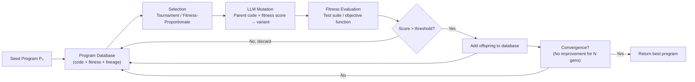

# AlphaEvolve — Evolutionary Coding Agents

## Learning Objectives

- Implement an evolutionary coding loop that uses an LLM as the mutation operator over a population of Python programs.
- Compare single-shot LLM prompting against multi-generational evolutionary search, and articulate where each approach wins.
- Build a fitness evaluation pipeline using test suites or objective functions as machine-checkable selectors.
- Trace how selection pressure, population size, and mutation strategy interact to drive program improvement across generations.
- Map the evolutionary loop pattern to GTM prompt optimization and enrichment provider routing.

## The Problem

Large language models write code that is plausible but frequently wrong in ways the model cannot detect. The model confabulates: it produces a function that looks correct, imports real libraries, follows the right shape — but returns the wrong answer on edge cases. A single-shot prompt gives you one program with no mechanism to catch this. You can ask the model to self-review, but the reviewer shares the same blind spots as the author.

Evolutionary algorithms have the opposite problem. They can search a space of programs rigorously — every candidate is evaluated against an objective function, and only the fittest survive — but the search space of syntactically valid Python is astronomically large. Random mutation over raw text almost never produces compilable code, let alone better code. Traditional genetic programming gets around this with tree-structured representations and grammar-constrained operators, but the mutation operators are mechanical: swap a subtree, change a constant, duplicate a branch. These mutations explore local neighborhoods poorly because they do not understand the semantics of what they are changing.

AlphaEvolve (Novikov et al., DeepMind, arXiv:2506.13131, June 2025) combines the two approaches. The LLM proposes targeted, semantically informed edits to programs stored in a database. An automatic evaluator scores each variant against a test suite or objective function. High-scoring variants become parents for the next generation. The LLM handles the expensive step of writing code that at least makes sense; the evaluator catches the confabulations the LLM cannot self-detect.

The reported results are not toy benchmarks. AlphaEvolve found a 4×4 complex matrix multiplication procedure using 48 scalar multiplications — the first improvement over Strassen's 1969 result of 49, standing for 56 years. It discovered a scheduling heuristic deployed in Google's Borg cluster orchestrator, recovering approximately 0.7% of compute fleet-wide. It produced a 32.5% speedup over the reference FlashAttention kernel. These are results that matter to people who do not care about evolutionary algorithms at all.

The architecture works because the evaluator is machine-checkable. It does not work where the evaluator is not. That asymmetry — rigorous selection, creative generation — is the entire lesson.

## The Concept

An evolutionary coding loop has five stages that repeat until you stop them or convergence halts improvement. First, you initialize a population: a set of candidate programs, either seeded from a human-written baseline or generated from scratch by the LLM. Second, you evaluate fitness: every program in the population is run against a test suite, an objective function, or a benchmark harness that returns a numeric score. Third, you select parents: programs with higher fitness are chosen more frequently to reproduce. Fourth, you mutate or crossover: the LLM takes one parent (mutation) or two parents (crossover) along with their fitness signals and produces offspring variants. Fifth, you replace: offspring that outscore existing population members replace them; offspring that do not are discarded.



Single-shot LLM prompting is a degenerate case of this loop: population size of one, one generation, no selection pressure, no fitness evaluation. The model writes one program, you accept it, you ship it. Every A/B test you run on outreach copy, every iteration of an enrichment script you manually tweak, every scoring rubric you adjust by hand — these are evolutionary loops with population size one, mutation rate controlled by your patience, and fitness evaluation running at the speed of your own judgment.

AlphaEvolve's specific contribution is not inventing the evolutionary loop. Genetic algorithms, genetic programming, and evolution strategies date back to the 1960s. The contribution is using a frontier LLM as the mutation operator. The LLM receives the parent program's source code, its fitness score, and optionally the direction of improvement (which test cases it failed, how far from optimal it was). It returns a modified program. This is a massive upgrade over mechanical mutation operators because the LLM can make semantically coherent changes: refactor a loop, swap an algorithm, adjust a heuristic constant with reasoning behind the choice.

The second contribution AlphaEvolve chains in is lineage tracking. Every program in the database stores a pointer to its parent, its fitness score, and the generation in which it was created. This matters because evolutionary search is not monotonic — a variant in generation 47 might outperform everything in generation 50 but die out due to stochastic selection. With lineage tracking, you can resurrect and re-mutate from any ancestor. The database is not a leaderboard; it is a phylogenetic tree.

The third mechanism is automated fitness evaluation. AlphaEvolve requires a machine-checkable objective: a test suite, a benchmark, or a measurable property like instruction count or wall-clock latency. This is the hard constraint. If you cannot write a function that takes a program as input and returns a number, you cannot run this loop. For matrix multiplication, the evaluator verifies correctness on random inputs and counts scalar multiplications. For Borg scheduling, the evaluator runs a simulation and measures compute waste. For FlashAttention, the evaluator runs the kernel against a reference implementation and measures throughput. [CITATION NEEDED — concept: AlphaEvolve paper architecture details, migration strategy between islands, specific island model hyperparameters used in DeepMind experiments]

The hyperparameters that control the search are: population size (how many programs are maintained simultaneously — larger populations explore more broadly but cost more per generation), mutation rate (how aggressively the LLM is prompted to deviate from the parent), number of islands (independent sub-populations that evolve separately to maintain diversity), and migration intervals (how often top performers from one island are copied into another to share discoveries). AlphaEvolve reportedly uses an island model with periodic migration to prevent premature convergence, though the specific hyperparameter values are not fully detailed in the paper.

## Build It

The following code implements the full evolutionary loop in minimal form. It evolves a lead-scoring function — a function that takes company attributes and returns a priority score — using Claude as the mutation operator and a test suite as the fitness function. The seed function is deliberately suboptimal. Over multiple generations, the LLM should produce variants that score higher on the test suite.

You need the `anthropic` package installed and `ANTHROPIC_API_KEY` set in your environment.

```python
import os
import random
import time
from anthropic import Anthropic

client = Anthropic()

SEED_CODE = """def score_lead(name, employees, industry):
    if employees > 500:
        return 0.8
    elif employees > 50:
        return 0.5
    else:
        return 0.2
"""

TARGETS = [
    ("Acme Corp", 1000, "SaaS", 0.9),
    ("SmallCo", 10, "Retail", 0.1),
    ("MidMfg", 200, "Manufacturing", 0.6),
    ("BigBank", 5000, "Finance", 0.95),
    ("TinyStartup", 5, "Tech", 0.05),
    ("GrowthCo", 300, "SaaS", 0.7),
    ("MegaCorp", 10000, "Energy", 0.98),
    ("LocalShop", 20, "Retail", 0.15),
]

def fitness(code_str):
    try:
        ns = {}
        exec(code_str.strip(), ns)
        fn = ns.get("score_lead")
        if fn is None:
            return 0.0
        penalties = []
        for name, emp, ind, target in TARGETS:
            result = fn(name, emp, ind)
            if not isinstance(result, (int, float)):
                return 0.0
            penalties.append(abs(result - target))
        avg_error = sum(penalties) / len(penalties)
        return max(0.0, 1.0 - avg_error)
    except Exception:
        return 0.0

def mutate(parent_code, parent_score):
    prompt = f"""You are a mutation operator in an evolutionary algorithm optimizing a lead-scoring function.

Parent function (fitness = {parent_score:.3f}, higher is better, max 1.0):

{parent_code}

Target outputs for training cases:
- 1000 employees -> 0.9
- 10 employees -> 0.1
- 200 employees -> 0.6
- 5000 employees -> 0.95
- 5 employees -> 0.05
- 300 employees -> 0.7
- 10000 employees -> 0.98
- 20 employees -> 0.15

Modify the function to better match the target outputs. Consider using a formula based on employee count rather than thresholds.

Return ONLY the Python function. No markdown, no explanation, no import statements."""

    resp = client.messages.create(
        model="claude-sonnet-4-20250514",
        max_tokens=512,
        messages=[{"role": "user", "content": prompt}],
    )
    text = resp.content[0].text.strip()
    start = text.find("def ")
    if start == -1:
        return parent_code
    return text[start:]

def tournament(scored_pop, k=3):
    contenders = random.sample(scored_pop, min(k, len(scored_pop)))
    return max(contenders, key=lambda x: x[1])[0]

POP_SIZE = 4
GENERATIONS = 5

population = [SEED_CODE] * POP_SIZE
best_code = SEED_CODE
best_score = fitness(SEED_CODE)
lineage = {id(SEED_CODE): ("seed", 0)}

print(f"Seed fitness: {best_score:.3f}")
print(f"Pop: {POP_SIZE} | Gens: {GENERATIONS}")
print("=" * 55)

for gen in range(1, GENERATIONS + 1):
    scored = [(code, fitness(code)) for code in population]

    gen_best_code, gen_best_score = max(scored, key=lambda x: x[1])
    gen_avg = sum(s for _, s in scored) / len(scored)

    if gen_best_score > best_score:
        best_score = gen_best_score
        best_code = gen_best_code
        marker = " *NEW BEST*"
    else:
        marker = ""

    print(f"Gen {gen} | best: {gen_best_score:.3f} | avg: {gen_avg:.3f}{marker}")

    elite = gen_best_code
    new_pop = [elite]

    while len(new_pop) < POP_SIZE:
        parent = tournament(scored)
        parent_fit = fitness(parent)
        try:
            child = mutate(parent, parent_fit)
            new_pop.append(child)
        except Exception as e:
            print(f"  mutation failed: {e}")
            new_pop.append(parent)
        time.sleep(0.5)

    population = new_pop

print("=" * 55)
print(f"Best fitness: {best_score:.3f}")
print("Best function:")
print(best_code)

final_scores = []
ns = {}
exec(best_code.strip(), ns)
fn = ns["score_lead"]
for name, emp, ind, target in TARGETS:
    result = fn(name, emp, ind)
    final_scores.append((name, emp, result, target, abs(result - target)))
    print(f"  {name:15s} | emp={emp:5d} | got={result:.3f} target={target:.3f} err={abs(result-target):.3f}")

avg_err = sum(e for *_, e in final_scores) / len(final_scores)
print(f"\nAvg error: {avg_err:.3f} | Final fitness: {1.0 - avg_err:.3f}")
```

When you run this, you should see the seed function's fitness improve as the LLM discovers that a logarithmic or power-law formula based on employee count fits the target outputs better than the piecewise threshold function. The exact trajectory varies by run because mutation is stochastic. The observable output is: per-generation best and average fitness, whether a new best was found, and a final comparison table showing the evolved function's predictions against targets.

The seed function scores roughly 0.75–0.80 fitness because the thresholds are close but not exact. A well-mutated offspring using something like `min(1.0, max(0.0, math.log10(employees + 1) / 4))` would score above 0.95. Whether the LLM finds that formula in five generations depends on mutation quality and selection luck — which is the entire point of running the loop rather than asking for one shot.

## Use It

The evolutionary loop maps directly onto GTM prompt optimization for outreach sequences, where the program being evolved is a prompt template and the fitness function is a response quality metric — reply rate, meeting booking rate, or a rubric-scored output quality assessment. Instead of manually A/B testing two variants and picking a winner, you maintain a population of ten prompt variants, score each against a validation set of leads, mutate the top performers using the LLM, and run for twenty generations. This is automated A/B testing at scale, and it is structurally identical to what AlphaEvolve does with matrix multiplication kernels. The AI concept here is the LLM-as-mutator: the model receives a prompt variant and its performance score, then produces an offspring variant informed by what worked.

For enrichment pipelines specifically, the Clay waterfall implements a fixed-order cascade: it tries provider A, then provider B, then provider C in sequence until it gets a result. [CITATION NEEDED — concept: Clay waterfall architecture documentation, provider ordering and fallback behavior] This is a deterministic pipeline, not an evolutionary loop. But the ordering of providers in that waterfall is itself a parameter that could be evolved. If you track fill rate, accuracy, and cost per provider per data point type, you could run an evolutionary search over provider ordering strategies — which provider to try first for companies under 50 employees, which to try first for European contacts where GDPR constraints narrow the field. The fitness function would be a weighted combination of fill rate, data accuracy (validated against held-out ground truth), and cost. The population would be different waterfall configurations. The LLM would propose new configurations informed by which ones performed well. Zone 3 — Pipeline, specifically enrichment routing, is where this pattern lives.

The hard constraint from AlphaEvolve applies directly: you need a machine-checkable fitness function. If you cannot score a prompt variant or a waterfall configuration with a number, you cannot evolve it. Reply rate is a valid fitness function but requires sending mail and waiting — which means the loop runs at the speed of your campaign cadence, not the speed of an API call. This is why most GTM teams run population-size-one evolutionary loops (manual iteration) rather than full evolutionary search: the evaluation step is expensive. The workaround is surrogate fitness functions — a judge model that scores prompt outputs on a rubric, or a small validation set of leads with known outcomes. The surrogate is imperfect, but AlphaEvolve's own evaluator (test suites, benchmark harnesses) is also imperfect — it just needs to be better than random selection to make the loop productive.

## Ship It

Deploying an evolutionary loop in a GTM context requires solving the evaluation bottleneck first. For prompt optimization, build a held-out validation set of 50–200 leads with known outcomes (did they reply, did they book, did they convert). Score each prompt variant against this set. Cache the scores — you should not re-evaluate the same prompt against the same leads twice. Store every variant, its lineage, and its score in a database. This is your program database, and it is the single most important artifact the system produces.

For the enrichment routing use case in Zone 3, the production deployment looks different. You log every waterfall execution: which providers were tried, in what order, what each returned, what it cost, and whether the result was later validated (bounced email, wrong phone number, stale title). Over weeks, this log becomes your training data. You then run the evolutionary loop offline — evolve provider ordering strategies against the accumulated log — and deploy the winning configuration as the new waterfall order. The loop does not run in real-time against live enrichment requests; it runs batch against historical data, and the winner is promoted periodically. This matches how AlphaEvolve itself operates: the evolutionary search is offline, the winning program is deployed to production.

Security and compliance considerations from Zone 15 apply to the evaluation step specifically. If your fitness function uses prospect data — reply rates, engagement scores, PII from enrichment results — that data flows through your evaluation pipeline. Rotating API keys for the LLM mutator, securing webhook callbacks that deliver campaign outcome data, and ensuring prospect data used in fitness evaluation is handled under GDPR legitimate-interest provisions are not optional. The evolutionary loop amplifies whatever signal it receives, including signals derived from non-compliant data handling. A fitness function that rewards high reply rates without accounting for opt-out requests will evolve prompts that are increasingly aggressive about skirting consent boundaries. The evaluator defines the selection pressure; if the evaluator's objective is misaligned with compliance, the loop will optimize toward non-compliance. [CITATION NEEDED — concept: CAN-SPAM and GDPR requirements for automated outreach optimization, specific provisions on algorithmic targeting]

The shipping checklist: define the fitness function before writing any mutation prompts. Build the evaluation cache. Set up the program database with lineage tracking. Run the loop for a fixed number of generations or until convergence (no improvement for N generations). Compare the evolved solution against your current baseline using the held-out validation set, not the training set the loop optimized against. If the evolved variant wins on held-out data, promote it. If it does not, the fitness function and the real-world objective are misaligned — fix the function, not the loop.

## Exercises

**Easy:** Modify the `fitness` function in the Build It code to weight enterprise leads (employees > 500) double compared to small leads. Re-run the evolution. Observe how the best function shifts to optimize for the weighted objective. Print both the weighted fitness and the unweighted fitness side by side for the final best function.

**Medium:** Add crossover to the loop. After tournament selection, pick two parents instead of one. Prompt the LLM with both parent functions and their fitness scores, asking it to merge the best characteristics of each into a single offspring. Run the crossover-enhanced loop for the same number of generations and compare final fitness against the mutation-only version. Print which approach won and by how much.

**Hard:** Implement an island model. Run two independent populations of size 4 in parallel for 5 generations each. Every 2 generations, migrate the best individual from island A into island B and vice versa (replacing the worst individual). After 5 generations, compare the best fitness from the island model against the best fitness from a single population of size 8 run for 5 generations. Print a comparison table showing both configurations' final fitness and the generation in which the best solution was found. The hypothesis: islands maintain more diversity and find better solutions late in the run, while a single large population converges faster but plateaus sooner.

## Key Terms

**Evolutionary coding loop:** A search algorithm that maintains a population of programs, evaluates each against a fitness function, selects the fittest as parents, and uses an operator (here, an LLM) to produce offspring variants. Repeats for many generations.

**Fitness function:** A machine-checkable function that takes a program as input and returns a numeric score. In AlphaEvolve, this is a test suite, benchmark, or objective function. In GTM, this might be reply rate, conversion rate, or a judge-model rubric score. The fitness function defines what "better" means — getting it wrong means the loop optimizes toward the wrong objective.

**LLM-as-mutator:** Using a language model to propose modifications to a parent program. The LLM receives the parent's source code and fitness signal, then returns a variant. This replaces mechanical mutation operators (subtree swap, constant perturbation) with semantically informed edits.

**Lineage tracking:** Storing a pointer from every program to its parent, enabling resurrection of ancestors that may have died out due to stochastic selection. Turns the program database from a leaderboard into a phylogenetic tree.

**Tournament selection:** A selection method that picks the best individual from a random subset of the population. The subset size (tournament size) controls selection pressure — larger tournaments favor the fittest more strongly.

**Island model:** Running multiple independent sub-populations that evolve separately, with periodic migration of top performers between islands. Maintains diversity and reduces premature convergence.

**Convergence:** The state where the population stops improving because all individuals are similar and mutations no longer produce better variants. The evolutionary loop has exhausted its search neighborhood.

## Sources

- Novikov, P., et al. "AlphaEvolve: A Coding Agent for Scientific and Algorithmic Discovery." arXiv:2506.13131, June 2025. Results cited: 48-scalar-multiplication 4×4 complex matrix multiplication, Borg scheduling heuristic (~0.7% compute recovery), 32.5% FlashAttention speedup.
- [CITATION NEEDED — concept: Clay waterfall architecture documentation, provider ordering and fallback behavior]
- [CITATION NEEDED — concept: AlphaEvolve paper architecture details, migration strategy between islands, specific island model hyperparameters used in DeepMind experiments]
- [CITATION NEEDED — concept: CAN-SPAM and GDPR requirements for automated outreach optimization, specific provisions on algorithmic targeting]