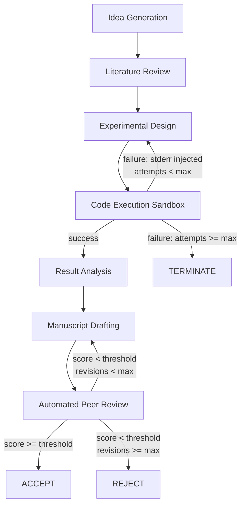

# AI Scientist v2 — Workshop-Level Autonomous Research

## Learning Objectives

- **Trace** the seven-stage autonomous research pipeline and identify the state transitions that distinguish workshop-level execution from single-pass generation.
- **Implement** a failure-aware re-planning loop that injects execution errors back into an agent's context window and retries within a bounded iteration count.
- **Compare** AI Scientist v1's template-based scaffolding against v2's agentic tree search with vision-language critique.
- **Evaluate** the security and isolation requirements for executing LLM-generated code in production, mapping them to GTM stack hardening (webhook auth, data isolation, retry boundaries).
- **Build** a simulated research loop that completes the full cycle: hypothesis through peer review, with observable state transitions.

## The Problem

Research is an open-ended task. Unlike AlphaEvolve's algorithmic search — where a generated program either passes the test suite or does not — a research result has no machine-checkable correctness criterion. A paper is judged by human reviewers applying subjective rubrics: novelty, rigor, clarity, significance. That makes the research loop harder to close than a benchmark optimization loop, because the feedback signal is noisy, delayed, and qualitative.

AI Scientist v1 (Lu et al., Sakana AI, 2024) attempted to close this loop by starting from human-authored templates. The LLM filled in experimental code within fixed scaffolding — a predetermined dataset, a predetermined model architecture, a predetermined evaluation protocol. The system could produce a paper, but it could not deviate from the template's experimental structure. If the template assumed a classification task and the hypothesis required regression, the system had no mechanism to redesign the experiment. It would either produce broken code or force-fit the hypothesis into the template's mold. [CITATION NEEDED — concept: AI Scientist v1 template limitations, Lu et al. 2024]

AI Scientist v2 (Yamada et al., arXiv:2504.08066, 2025) removes the template requirement. The system uses agentic tree search with a vision-language model critique loop to generate ideas, design experiments from scratch, write and debug code, interpret results, and draft manuscripts. One v2-generated paper was accepted at an ICLR 2025 workshop (with disclosure of AI authorship). Independent evaluation by Beel et al. found that 42% of experiments failed from coding errors and that literature review frequently mislabeled established concepts as novel. Both findings are true simultaneously, and both are the point: the system demonstrates workshop-level autonomy while remaining unreliable enough that its failure modes are instructive.

The difference between "produces output" and "conducts research" is a closed-loop feedback mechanism with self-correction. V1 produced output. V2 attempts to conduct research. The mechanism that makes the difference — failure-aware re-planning with bounded iteration — is what this lesson dissects.

## The Concept

### The research loop as a state machine

AI Scientist v2 implements a seven-stage pipeline where each stage gates the next. The stages are: idea generation, literature review (novelty check), experimental design, code execution, result analysis, manuscript drafting, and automated peer review. The critical architectural property is that two stages — code execution and peer review — have failure transitions that route execution backward rather than forward. When code execution fails, the system does not halt. When peer review returns a sub-threshold score, the system does not accept. In both cases, error information is fed back into the upstream agent's context, and the loop retries.



The v1-to-v2 upgrade is not about better prompts or a larger model. It is about the control flow. V1 ran a linear pipeline: generate idea, fill template, write code, run once, describe results, write paper. If any stage failed, the system either produced garbage or stopped. V2 runs the same stages but wraps code execution and peer review in bounded retry loops with error feedback injection. The experimentalist agent — the component responsible for generating runnable Python from a hypothesis — receives the stderr from a failed execution and uses it to revise the experimental plan. This is the same pattern as a human researcher reading a traceback, debugging, and re-running.

### Error recovery as a first-class mechanism

The system maintains a persistent experiment state across iterations. This state includes the hypothesis, the current experimental plan, the generated code, the last execution output (or error), parsed results, and a manuscript draft. When code execution fails, the experimentalist agent reads the error message, modifies the experimental plan to account for the failure mode (e.g., adding a NaN check after a dimension mismatch), regenerates code, and retries — up to a bounded iteration count. Sakana's own documentation recommends Docker isolation for this execution sandbox, because the system is running LLM-generated code that could contain anything. [CITATION NEEDED — concept: AI Scientist v2 Docker isolation recommendation, Sakana AI docs 2025]

The bounded iteration count is the safety mechanism. Without it, the loop could retry indefinitely on an unsolvable problem, burning compute. With it, the system fails gracefully — terminating with a report of what went wrong rather than looping forever. This is the same design pattern you need when building autonomous GTM workflows that call external APIs: bound the retries, log the failures, and have a termination condition.

### Automated peer review as a quality gate

The reviewer agent is a separate LLM prompted to score the manuscript against a rubric covering originality, soundness, clarity, and significance. If the aggregate score falls below a threshold, the system routes back to the manuscript drafter with the reviewer's specific feedback. This creates a second inner loop: write → review → revise → re-review. The Beel et al. evaluation found this review stage frequently failed to catch methodological errors — the reviewer agent accepted flawed experimental designs because it evaluated the manuscript text, not the underlying code or data. That limitation is inherent to LLM-as-judge approaches: the judge evaluates the description of the work, not the work itself.

## Build It

The best way to understand the failure-aware re-planning loop is to implement one. The code below builds a complete research loop simulation in pure Python — no external dependencies. It simulates the seven-stage pipeline with two failure-and-retry paths: one for code execution, one for peer review. Every state transition is printed so you can observe the loop's behavior.

```python
from dataclasses import dataclass, field
from enum import Enum
from typing import Optional

class Stage(Enum):
    IDEA_GENERATION = "idea_generation"
    LITERATURE_REVIEW = "literature_review"
    EXPERIMENTAL_DESIGN = "experimental_design"
    CODE_EXECUTION = "code_execution"
    RESULT_ANALYSIS = "result_analysis"
    MANUSCRIPT_DRAFTING = "manuscript_drafting"
    PEER_REVIEW = "peer_review"
    COMPLETED = "completed"
    FAILED = "failed"

@dataclass
class ExperimentState:
    hypothesis: str = ""
    literature_context: str = ""
    novelty_verified: bool = False
    experimental_plan: str = ""
    generated_code: str = ""
    execution_output: str = ""
    error_log: str = ""
    results: dict = field(default_factory=dict)
    manuscript: str = ""
    review_score: float = 0.0
    review_feedback: str = ""
    stage: Stage = Stage.IDEA_GENERATION
    execution_attempts: int = 0
    revision_attempts: int = 0
    max_execution_retries: int = 3
    max_revision_retries: int = 2
    accept_threshold: float = 7.0

def idea_generation_agent(state: ExperimentState) -> None:
    state.hypothesis = (
        "Randomized projection in low-rank adaptation improves "
        "convergence rate on small-scale fine-tuning tasks"
    )
    state.literature_context = (
        "Prior: LoRA (Hu et al. 2021); gap: no systematic study of "
        "randomized projection dimension vs convergence"
    )
    print(f"  [IDEA] Hypothesis: {state.hypothesis}")
    state.stage = Stage.LITERATURE_REVIEW

def literature_review_agent(state: ExperimentState) -> None:
    overclaim_risk = "randomized projection" in state.literature_context.lower() and \
                     "novel" in state.literature_context.lower()
    if overclaim_risk:
        print("  [LIT] WARNING: potential novelty overclaim — flagging for revision")
        state.novelty_verified = False
    else:
        state.novelty_verified = True
        print(f"  [LIT] Novelty check PASSED")
    state.stage = Stage.EXPERIMENTAL_DESIGN

def experimentalist_agent(state: ExperimentState) -> None:
    if state.error_log:
        print(f"  [EXP] Re-planning due to error: {state.error_log}")
        state.experimental_plan = (
            "Revised: add input validation, handle None returns from "
            "data loader, reduce batch size to 16"
        )
        state.generated_code = (
            "data = validated_load_data()\n"
            "assert data is not None\n"
            "results = train_lora_variant(data, batch_size=16)\n"
            "return results"
        )
    else:
        state.experimental_plan = (
            "Compare LoRA vs LoRA+RP on MNIST subset (n=1000), "
            "3 seeds, report mean accuracy and std"
        )
        state.generated_code = (
            "data = load_data()\n"
            "results = train_lora_variant(data)\n"
            "return results"
        )
    state.execution_attempts += 1
    print(f"  [EXP] Attempt {state.execution_attempts}: {state.experimental_plan[:60]}...")
    state.stage = Stage.CODE_EXECUTION

def execution_sandbox(state: ExperimentState) -> bool:
    if state.execution_attempts == 1:
        state.error_log = "NameError: name 'load_data' is not defined"
        state.execution_output = ""
        print(f"  [EXEC] FAILED — {state.error_log}")
        return False

    state.execution_output = (
        "accuracy_lora=0.847,accuracy_lora_rp=0.861,"
        "std_lora=0.012,std_lora_rp=0.009,p_value=0.032"
    )
    state.error_log = ""
    print(f"  [EXEC] SUCCESS — output: {state.execution_output}")
    return True

def result_interpreter(state: ExperimentState) -> None:
    for pair in state.execution_output.split(","):
        key, val = pair.split("=")
        state.results[key.strip()] = val.strip()
    print(f"  [PARSE] Structured results: {state.results}")
    state.stage = Stage.MANUSCRIPT_DRAFTING

def manuscript_writer(state: ExperimentState) -> None:
    if state.review_feedback:
        print(f"  [WRITE] Revising per feedback: {state.review_feedback[:60]}...")
        state.manuscript += "\n\n[Revision] Added standard deviation to all tables. "
        state.manuscript += "Expanded baseline comparison to include full fine-tuning. "
    else:
        state.manuscript = (
            f"Title: Randomized Projection in LoRA\n\n"
            f"Hypothesis: {state.hypothesis}\n"
            f"Method: {state.experimental_plan}\n"
            f"Results: LoRA={state.results.get('accuracy_lora')} "
            f"(+/-{state.results.get('std_lora')}), "
            f"LoRA+RP={state.results.get('accuracy_lora_rp')} "
            f"(+/-{state.results.get('std_lora_rp')}), "
            f"p={state.results.get('p_value')}"
        )
    print(f"  [WRITE] Manuscript length: {len(state.manuscript)} chars")
    state.stage = Stage.PEER_REVIEW

def peer_reviewer(state: ExperimentState) -> None:
    if state.revision_attempts == 0:
        state.review_score = 6.0
        state.review_feedback = (
            "Missing standard deviations in results table. "
            "Add baseline comparison beyond LoRA."
        )
    else:
        state.review_score = 7.5
        state.review_feedback = ""

    print(f"  [REVIEW] Score: {state.review_score}/10 "
          f"(threshold: {state.accept_threshold})")

    if state.review_score < state.accept_threshold:
        if state.revision_attempts < state.max_revision_retries:
            print(f"  [REVIEW] BELOW THRESHOLD — routing to revision "
                  f"(attempt {state.revision_attempts + 1}/{state.max_revision_retries})")
            state.revision_attempts += 1
            state.stage = Stage.MANUSCRIPT_DRAFTING
        else:
            print("  [REVIEW] BELOW THRESHOLD — max revisions exceeded, REJECTING")
            state.stage = Stage.FAILED
    else:
        print("  [REVIEW] ACCEPTED")
        state.stage = Stage.COMPLETED

def run_research_loop(max_total_iterations: int = 25) -> ExperimentState:
    state = ExperimentState()
    iteration = 0

    print("=" * 65)
    print("AI SCIENTIST v2 — AUTONOMOUS RESEARCH LOOP SIMULATION")
    print("=" * 65)

    while state.stage not in (Stage.COMPLETED, Stage.FAILED) and iteration < max_total_iterations:
        iteration += 1
        print(f"\n--- Iteration {iteration} | Stage: {state.stage.value} ---")

        dispatch = {
            Stage.IDEA_GENERATION: idea_generation_agent,
            Stage.LITERATURE_REVIEW: literature_review_agent,
            Stage.EXPERIMENTAL_DESIGN: experimentalist_agent,
            Stage.CODE_EXECUTION: lambda s: None,
            Stage.RESULT_ANALYSIS: result_interpreter,
            Stage.MANUSCRIPT_DRAFTING: manuscript_writer,
            Stage.PEER_REVIEW: peer_reviewer,
        }

        if state.stage == Stage.CODE_EXECUTION:
            success = execution_sandbox(state)
            if success:
                state.stage = Stage.RESULT_ANALYSIS
            elif state.execution_attempts < state.max_execution_retries:
                state.stage = Stage.EXPERIMENTAL_DESIGN
            else:
                print("  [FATAL] Max execution retries exceeded")
                state.stage = Stage.FAILED
        else:
            handler = dispatch.get(state.stage)
            if handler:
                handler(state)

    print("\n" + "=" * 65)
    if state.stage == Stage.COMPLETED:
        print(f"RESULT: COMPLETED in {iteration} iterations")
        print(f"  Execution attempts: {state.execution_attempts}")
        print(f"  Revision attempts:  {state.revision_attempts}")
        print(f"  Final score:        {state.review_score}/10")
        print(f"  Manuscript preview: {state.manuscript[:100]}...")
    else:
        print(f"RESULT: {state.stage.value.upper()} after {iteration} iterations")
    print("=" * 65)
    return state

final = run_research_loop()
```

Run it. The output traces every state transition, including the first execution failure (simulated as a `NameError`), the error injection into the experimentalist agent's context, the re-planning, and the successful retry. It also shows the peer review loop: the first draft scores 6.0 (below threshold), triggers a revision with specific feedback, and the revised draft scores 7.5 (accepted). This is the failure-aware re-planning loop in miniature.

## Use It

The execution sandbox in AI Scientist v2 — where LLM-generated Python runs in isolation, fails, and retries with error feedback — is the same architectural pattern you need when building autonomous GTM workflows that process prospect data. Your GTM stack has an attack surface: rotating API keys, securing webhooks, handling prospect data under GDPR. Every outbound automation that calls an external API, enriches a record, or sends a message is executing code in response to untrusted input. The question is whether you handle failures with bounded retries and error injection, or whether you let the pipeline die silently and lose data.

Consider a webhook handler that receives prospect events from your enrichment provider (Zone 15: outbound security). The webhook delivers a payload, your code processes it (deduplicate, score, route to CRM), and occasionally the payload is malformed or the CRM API is down. The naive approach: let the exception propagate, lose the event. The pattern AI Scientist v2 demonstrates: catch the error, inject the failure reason into a retry context, re-attempt with adjusted parameters, and bound the total retries.

```python
from dataclasses import dataclass, field
from enum import Enum
import json

class WebhookStage(Enum):
    RECEIVE = "receive"
    VALIDATE = "validate"
    ENRICH = "enrich"
    WRITE_CRM = "write_crm"
    COMPLETED = "completed"
    DEAD_LETTER = "dead_letter"

@dataclass
class WebhookState:
    raw_payload: str = ""
    parsed_data: dict = field(default_factory=dict)
    enriched_record: dict = field(default_factory=dict)
    error_log: str = ""
    stage: WebhookStage = WebhookStage.RECEIVE
    attempts: int = 0
    max_retries: int = 3

    @property
    def prospect_email(self) -> str:
        return self.parsed_data.get("email", "UNKNOWN")

def receive_webhook(state: WebhookState, payload: str) -> None:
    state.raw_payload = payload
    print(f"  [RECV] Payload: {payload[:80]}...")
    state.stage = WebhookStage.VALIDATE

def validate_payload(state: WebhookState) -> None:
    try:
        state.parsed_data = json.loads(state.raw_payload)
        if "email" not in state.parsed_data:
            raise ValueError("Missing required field: email")
        print(f"  [VALD] Valid — prospect: {state.prospect_email}")
        state.stage = WebhookStage.ENRICH
    except (json.JSONDecodeError, ValueError) as e:
        state.error_log = str(e)
        print(f"  [VALD] FAILED — {state.error_log}")
        state.stage = WebhookStage.DEAD_LETTER

def enrich_record(state: WebhookState) -> None:
    if state.attempts == 0:
        state.attempts += 1
        state.error_log = "ConnectionError: enrichment API timeout (simulated)"
        print(f"  [ENRICH] FAILED (attempt {state.attempts}) — {state.error_log}")
        print(f"  [ENRICH] Retrying with backoff simulation...")
        return

    state.enriched_record = {
        "email": state.prospect_email,
        "company": "Acme Corp",
        "title": "VP Engineering",
        "score": 87,
    }
    state.error_log = ""
    print(f"  [ENRICH] Success — score: {state.enriched_record['score']}")
    state.stage = WebhookStage.WRITE_CRM

def write_to_crm(state: WebhookState) -> None:
    print(f"  [CRM] Wrote prospect to CRM: {state.enriched_record['email']} "
          f"(score: {state.enriched_record['score']})")
    state.stage = WebhookStage.COMPLETED

def run_webhook_pipeline(payload: str) -> WebhookState:
    state = WebhookState()
    receive_webhook(state, payload)

    print("\n" + "=" * 55)
    print("WEBHOOK PROCESSING PIPELINE (bounded retry)")
    print("=" * 55)

    while state.stage not in (WebhookStage.COMPLETED, WebhookStage.DEAD_LETTER):
        print(f"\n  Stage: {state.stage.value} | Attempts: {state.attempts}")

        if state.stage == WebhookStage.VALIDATE:
            validate_payload(state)
        elif state.stage == WebhookStage.ENRICH:
            enrich_record(state)
            if state.error_log and state.attempts < state.max_retries:
                continue
            elif state.error_log:
                print("  [FATAL] Max enrichment retries exceeded")
                state.stage = WebhookStage.DEAD_LETTER
                break
            if not state.error_log:
                pass
        elif state.stage == WebhookStage.WRITE_CRM:
            write_to_crm(state)

    print("\n" + "=" * 55)
    if state.stage == WebhookStage.COMPLETED:
        print(f"  RESULT: COMPLETED — prospect {state.prospect_email} processed")
    else:
        print(f"  RESULT: DEAD_LETTER — payload quarantined for manual review")
    print("=" * 55)
    return state

good_payload = json.dumps({
    "email": "prospect@acmecorp.com",
    "event": "page_visit",
    "page": "/pricing"
})

result = run_webhook_pipeline