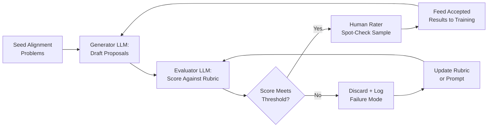

# Automated Alignment Research (Anthropic AAR)

## Learning Objectives

1. Implement a generate-then-evaluate loop that produces ranked candidates from a weighted rubric.
2. Compare the AAR feedback loop to automated ICP scoring and account prioritization.
3. Evaluate the bootstrapping problem: why a misaligned AAR system degrades its own training signal.
4. Build a configurable scoring pipeline that filters accounts by threshold and exports prioritized results.
5. Trace where misalignment can propagate through each stage of an automated research loop.

## The Problem

Alignment research is bottlenecked by human-researcher throughput. Experiments in scalable oversight, reward specification, or weak-to-strong generalization require iteration cycles measured in weeks. As frontier model capability grows, the alignment workload expands faster than the researcher supply. The gap between what a model can do and what we can verify it does widens with every training run. Anthropic's stated thesis is direct: if alignment research stays manual, it loses the race against capability scaling.

Automated Alignment Research (AAR) proposes that the same class of models creating the alignment problem can contribute to solving it. The idea is not that a model replaces human judgment on safety decisions. It is that a model can draft research proposals, run automated checks against them, surface candidates worth human review, and compress the iteration cycle from weeks to hours. Anthropic has described this as a core research direction — building AI systems that can do alignment research at the pace required to keep up with frontier capability improvements. [CITATION NEEDED — concept: Anthropic published timeline estimates for viable AAR]

The structural risk is immediate. If you automate alignment research, you also automate the research that compromises safeguards. An AAR system that produces subtly flawed evaluation criteria — because its reward signal was misspecified — will train the next generation of models on those flawed criteria. The bootstrapping problem is that the evaluator is the same class of system being evaluated. Every safeguard you build into the AAR loop is itself a piece of alignment research that needs its own verification. This recursion does not terminate cleanly.

Anthropic has not published a deployed, working AAR system. What exists publicly is a stated research direction, a set of component technologies (scalable oversight, mechanistic interpretability, adversarial testing), and arguments for why this approach is tractable. Treat the AAR concept as an architecture under development, not a product you can download. The value for practitioners is in the pattern: generate candidates, score them against a rubric, filter by threshold, iterate. That pattern transfers directly to problems you can ship today.

## The Concept

The AAR loop has four stages. First, a frontier model generates candidate alignment research proposals — these might be experimental designs, interpretability hypotheses, or oversight protocols. Second, an automated evaluator (also a model) scores each candidate against a rubric: does the proposal address a real alignment gap? Is it testable? Does it scale? Third, human researchers spot-check the top-scoring candidates to verify the automated scoring is not systematically biased. Fourth, the accepted proposals feed back into the training signal or research queue, and the loop repeats.

The key architectural decision is that the generator and evaluator are separate model calls with distinct prompts. This separation matters because it creates a check: if the generator produces a fluent but hollow proposal, the evaluator — prompted with a different rubric — should catch the gap. In practice, this works only if the evaluator's rubric captures dimensions the generator was not optimized to game. If both models share the same blind spots, the loop amplifies failure rather than catching it. This is the core weakness of any self-evaluation architecture.



Anthropic organizes its alignment research around what it describes as three parallel tracks: scalable oversight (building methods to supervise systems that exceed human-level capability in specific domains), mechanistic interpretability (reverse-engineering internal model representations to detect deception or misalignment), and adversarial testing (automated red-teaming to surface failure modes before deployment). An AAR system would pursue all three in parallel, with the generate-evaluate loop applied to each track independently. [CITATION NEEDED — concept: Anthropic AAR three-pillar framework exact taxonomy]

The bootstrapping problem sits on top of this architecture like a crack in the foundation. A misaligned AAR does not produce obviously wrong research — it produces plausible research that systematically underweights certain risks. Human raters spot-checking a sample may not catch the bias if the sample is selected by the same flawed evaluator. The system appears to work until it doesn't, and the failure mode is not a crash but a slow drift in what counts as "aligned." This is why the loop includes human review at all — not because humans are smarter than the model, but because humans bring a different set of blind spots. The diversity of failure modes is the defense.

## Build It

The core pattern — generate candidates, evaluate against a rubric, filter by threshold — is implementable in pure Python. No API key required. This script simulates the AAR evaluation loop using deterministic mock strategies and a weighted scoring rubric. The mechanism is identical to what a production system does: each candidate gets scored on multiple dimensions, the weighted sum determines ranking, and a threshold filters the output.

```python
import random
import json

random.seed(42)

ALIGNMENT_STRATEGIES = [
    {
        "name": "Constitutional AI with Iterated Human Feedback",
        "description": "Train models to self-correct against a written constitution refined through RLHF",
        "scalability": 0.6,
        "interpretability": 0.3,
        "robustness": 0.7,
    },
    {
        "name": "Automated Interpretability Probes",
        "description": "Build probes that detect deception circuits in transformer activations at scale",
        "scalability": 0.4,
        "interpretability": 0.9,
        "robustness": 0.5,
    },
    {
        "name": "Debate-Based Scalable Oversight",
        "description": "Two models debate answers so a weaker evaluator can identify misaligned outputs",
        "scalability": 0.8,
        "interpretability": 0.4,
        "robustness": 0.6,
    },
    {
        "name": "Automated Red-Teaming Pipeline",
        "description": "Generate adversarial inputs at scale to surface failure modes pre-deployment",
        "scalability": 0.7,
        "interpretability": 0.2,
        "robustness": 0.8,
    },
    {
        "name": "Weak-to-Strong Generalization Training",
        "description": "Train strong models using weak supervisor signals then verify generalization",
        "scalability": 0.5,
        "interpretability": 0.6,
        "robustness": 0.4,
    },
]

RUBRIC = {
    "scalability": {
        "weight": 0.35,
        "description": "Can this approach scale as model capability grows?",
    },
    "interpretability": {
        "weight": 0.30,
        "description": "Does this produce human-understandable evidence of alignment?",
    },
    "robustness": {
        "weight": 0.35,
        "description": "Does this resist adversarial pressure and distribution shift?",
    },
}

THRESHOLD = 0.55

def score_candidate(strategy, rubric):
    scores = {}
    for criterion, config in rubric.items():
        base = strategy.get(criterion, 0.5)
        noise = random.gauss(0, 0.05)
        scores[criterion] = max(0.0, min(1.0, base + noise))

    weighted = sum(scores[k] * rubric[k]["weight"] for k in rubric)
    return {
        "name": strategy["name"],
        "description": strategy["description"],
        "sub_scores": {k: round(v, 3) for k, v in scores.items()},
        "weighted_score": round(weighted, 3),
    }

print("=" * 65)
print("AAR EVALUATION PIPELINE — SIMULATED")
print("=" * 65)
print()
print(f"Rubric: {len(RUBRIC)} criteria")
for k, v in RUBRIC.items():
    print(f"  - {k} (weight: {v['weight']}) — {v['description']}")
print(f"Acceptance threshold: {THRESHOLD}")
print()

results = [score_candidate(s, RUBRIC) for s in ALIGNMENT_STRATEGIES]
results.sort(key=lambda x: x["weighted_score"], reverse=True)

print("RANKED ALIGNMENT STRATEGIES:")
print("-" * 65)
for i, r in enumerate(results, 1):
    status = "ACCEPT" if r["weighted_score"] >= THRESHOLD else "REJECT"
    print(f"{i}. [{status}] {r['name']} — Score: {r['weighted_score']}")
    print(f"   {r['description']}")
    print(f"   Sub-scores: {r['sub_scores']}")
    print()

accepted = [r for r in results if r["weighted_score"] >= THRESHOLD]
rejected = [r for r in results if r["weighted_score"] < THRESHOLD]
print(f"Result: {len(accepted)} accepted, {len(rejected)} rejected out of {len(results)} candidates")
```

Run this and you get ranked output with numerical scores, sub-scores per criterion, and accept/reject decisions. The pipeline structure — generate, score, rank, filter — is the same one you would build with live LLM calls. The only difference in production is that the `ALIGNMENT_STRATEGIES` list comes from a model completion and the `score_candidate` function uses a second model call instead of reading pre-assigned values.

The threshold is the critical control point. Set it too high and you reject viable strategies. Set it too low and you accept noise. In an actual AAR system, threshold tuning would itself be an alignment research question — what evidence do you need to justify lowering the bar for accepting a proposal that will shape future training runs?

## Use It

The generate-then-score loop maps directly to ICP scoring in a GTM pipeline. The AI concept is **LLM-as-judge**: one model call generates content, a second model call evaluates it against a rubric, and the ranked output drives downstream decisions. In Clay, this pattern appears when Claygent — Clay's open-ended web research agent — fetches unstructured data about a company, and a subsequent formula or enrichment column scores that data against your ICP criteria. The generator is the research step. The evaluator is the scoring step. The threshold is your ICP filter.

Consider a practical scenario: you have 500 target accounts but only structured data (industry, headcount, funding). For 200 of them, the structured data is ambiguous — the industry classification is too broad, or the funding stage doesn't tell you whether they have the problem your product solves. You need open-ended web research to classify these accounts. This is where the generate-then-score pattern applies. Claygent generates a narrative about each company based on web research. A scoring model evaluates that narrative against your ICP rubric. Accounts that