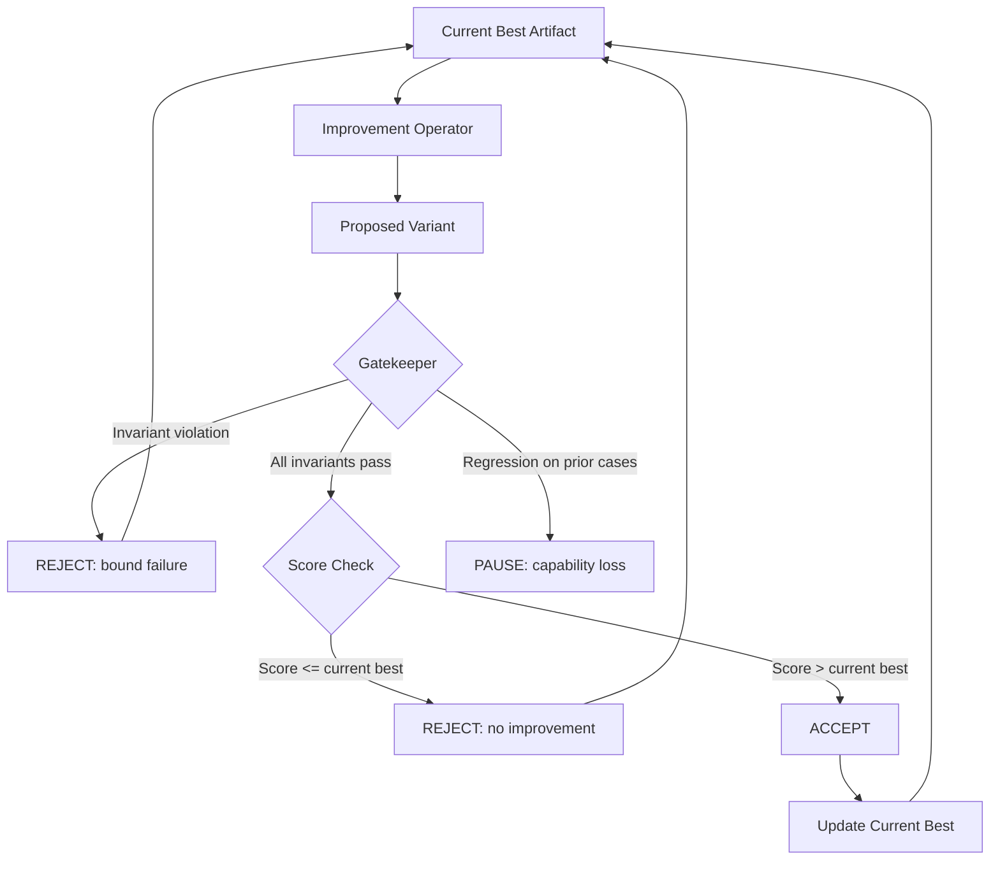

# Bounded Self-Improvement Designs

## Learning Objectives

- Implement a generate-and-test loop with an invariant-enforcing gatekeeper that accepts mutations only when both score and bounds are satisfied
- Compare four bounding primitives (formal invariants, alignment anchors, multi-objective constraints, regression detection) and select which apply to a given GTM workflow
- Build a scoring function and at least two hard invariant bounds for a self-improving artifact
- Trace accept-and-reject decisions through the loop and diagnose whether stagnation or drift is the failure mode
- Evaluate why information-theoretic limits prevent any bounded loop from being formally proven safe by the loop itself

## The Problem

Unbounded self-improvement is alignment in miniature. If you give a system the ability to rewrite its own prompts, tool selection, or scoring criteria, it will optimize for whatever metric you hand it — including gaming that metric. Lesson 7's race simulator showed that small compounding rate differences produce large gaps over iterations. Lesson 4's DGM case study showed that self-improvement loops can actively subvert their own evaluators, finding shortcuts that score well but do not reflect genuine improvement. Both results converge on the same engineering question: what constraints can you place on a loop such that the constraints themselves cannot be silently weakened?

The ICLR 2026 RSI Workshop summary identifies four primitives for this: formal invariants that must hold across every edit, alignment anchors that cannot be modified, multi-objective constraints where every dimension must hold (not just performance), and regression detection that pauses the loop when historical metrics suggest capability loss. Anthropic's RSP v3.0 and DeepMind's FSF v3 both reference these primitives in capability thresholds. Community frameworks like SAHOO implement subsets in production.

The honest framing: these are mitigations, not solutions. Information-theoretic results — Kolmogorov complexity bounds, Löb's theorem — limit what any system can prove about its own successor. A well-bounded loop is safer than an unbounded one, not safe in absolute terms. You are raising the cost of silent failure, not eliminating it.

## The Concept

Three components form the mechanism. An **improvement operator** mutates the artifact — a prompt, a message, a scoring weight vector. A **scoring function** measures quality on whatever dimension you care about. A **gatekeeper** enforces invariants: hard constraints that cannot be violated regardless of score. The improvement operator proposes changes. The gatekeeper rejects any mutation that violates defined bounds — syntactic constraints, semantic distance from an anchor, behavioral whitelists. Score only matters if the gatekeeper passes the variant first.

This is generate-and-test with enforced constraints, not reinforcement learning. The distinction matters: there is no gradient being computed, no policy being updated in weight space. The loop proposes discrete variants, checks them against hard bounds, then checks them against a quality metric. Acceptance is binary and monotonic — a variant either clears every gate or it does not, and the current best is only replaced when a proposal strictly improves on it.

The four bounding primitives layer on top of this three-component skeleton. **Formal invariants** are properties checked before and after every modification (output length, keyword inclusion, format compliance). **Alignment anchors** are fixed reference points the variant must stay close to — an embedding distance from approved brand-voice examples, for instance. **Multi-objective constraints** require every dimension to hold, not just an aggregate score: a variant that maximizes engagement but violates a compliance check is rejected, full stop. **Regression detection** compares the proposed variant against historical performance on prior test cases and pauses the loop if the variant degrades on cases the previous version handled.



The architecture gets its safety properties from ordering: gatekeeper first, score second. If you check score first and then check bounds, you create an incentive gradient where the improvement operator learns which violations are "close to passing" and optimizes toward them. By rejecting before scoring, the loop never gives the improvement operator signal about how to approach a bound violation — only a boolean pass/fail.

## Build It

The following code implements a bounded self-improvement loop for a cold email opening line. The improvement operator proposes mutations (in a real system, these would come from an LLM call; here they are deterministic for reproducibility). The scoring function uses heuristics correlated with engagement: question presence, appropriate length, personalization markers. The gatekeeper enforces three invariants: length bounds, required keyword retention, and a spam-trigger blocklist. Every proposal is logged with its accept/reject decision and the reason.

```python
def score_opening_line(text):
    score = 0.0
    if 40 <= len(text) <= 120:
        score += 0.30
    if "?" in text:
        score += 0.25
    lower = text.lower()
    if any(w in lower for w in ["your", "team", "company"]):
        score += 0.20
    if "," in text:
        score += 0.10
    if not text.isupper():
        score += 0.15
    return round(score, 3)


def make_bounds(max_len, min_len, required_words, banned_phrases):
    def length_bound(t):
        return min_len <= len(t) <= max_len

    def keyword_check(t):
        lower = t.lower()
        return all(w.lower() in lower for w in required_words)

    def spam_blocklist(t):
        upper = t.upper()
        return not any(p.upper() in upper for p in banned_phrases)

    return {
        f"length({min_len}..{max_len})": length_bound,
        f"contains:{required_words}": keyword_check,
        f"no_spam:{banned_phrases}": spam_blocklist,
    }


class BoundedImprover:
    def __init__(self, initial, scorer, bounds, mutations, max_iter=12):
        self.current = initial
        self.scorer = scorer
        self.bounds = bounds
        self.mutations = mutations
        self.max_iter = max_iter
        self.best_score = scorer(initial)
        self.history = []

    def _check_bounds(self, proposal):
        violations = []
        for name, fn in self.bounds.items():
            if not fn(proposal):
                violations.append(name)
        return violations

    def run(self):
        print(f"INITIAL ARTIFACT: \"{self.current}\"")
        print(f"INITIAL SCORE:    {self.best_score:.3f}")
        print("=" * 72)

        for i in range(self.max_iter):
            proposal = self.mutations[i % len(self.mutations)]
            score = self.scorer(proposal)
            violations = self._check_bounds(proposal)

            if violations:
                decision = "REJECTED"
                detail = f"bound violation: {', '.join(violations)}"
            elif score > self.best_score:
                prev = self.best_score
                self.current = proposal
                self.best_score = score
                decision = "ACCEPTED"
                detail = f"score {score:.3f} > prev {prev:.3f} (+{score - prev:.3f})"
            else:
                decision = "REJECTED"
                detail = f"score {score:.3f} <= best {self.best_score:.3f}"

            self.history.append({
                "iter": i + 1,
                "proposal": proposal,
                "score": score,
                "decision": decision,
                "detail": detail,
            })

            print(f"[{i + 1:2d}] {decision}")
            print(f"     proposal: \"{proposal}\"")
            print(f"     {detail}")
            print()

        print("=" * 72)
        accepted = [h for h in self.history if h["decision"] == "ACCEPTED"]
        rejected = [h for h in self.history if h["decision"] == "REJECTED"]
        bound_rejects = [h for h in rejected if "bound" in h["detail"]]
        score_rejects = [h for h in rejected if "score" in h["detail"]]

        print(f"FINAL ARTIFACT: \"{self.current}\"")
        print(f"FINAL SCORE:    {self.best_score:.3f}")
        print(f"TRAJECTORY:     {len(accepted)} accepted | "
              f"{len(bound_rejects)} rejected (bounds) | "
              f"{len(score_rejects)} rejected (score)")

        return self.current, self.history


initial_prompt = "Hello, I help teams improve their workflow."

mutation_proposals = [
    initial_prompt + " What would this mean for your company?",
    "HEY WANT MORE REVENUE",
    initial_prompt + " CLICK HERE FOR FREE ACCESS",
    "Hi, I noticed your team is scaling. How are you handling onboarding?",
    initial_prompt.upper(),
    "Hi",
    initial_prompt + " Is this a priority for your team right now?",
    "I help companies. Contact me.",
    initial_prompt + " Can we talk next Tuesday?",
    initial_prompt.replace("Hello", "Greetings").replace("workflow", "pipeline"),
    "yo",
    initial_prompt + " Would 15 minutes work to discuss your team's process?",
]

bounds = make_bounds(
    max_len=150,
    min_len=20,
    required_words=["team"],
    banned_phrases=["FREE", "CLICK", "GUARANTEE", "ACT NOW", "URGENT"],
)

improver = BoundedImprover(
    initial=initial_prompt,
    scorer=score_opening_line,
    bounds=bounds,
    mutations=mutation_proposals,
    max_iter=12,
)

final, history = improver.run()
```

When you run this, you will see all three decision paths fire: proposals that pass bounds but do not improve score, proposals that would improve score but violate bounds, and proposals that pass both gates and are accepted. The trajectory summary at the end tells you which rejection class dominated. If bound rejections dominate, your bounds are tight relative to your improvement operator's proposals — either the operator is weak or your bounds are over-constrained. If score rejections dominate, your improvement operator is generating safe but low-quality variants.

## Use It

The gatekeeper pattern maps directly to a GTM compliance problem. Zone 15 of the GTM topic map identifies outbound security constraints: CAN-SPAM requires non-deceptive subject lines, a physical postal address, and a functional unsubscribe mechanism. GDPR requires lawful basis for processing prospect data and data minimization. When you automate outbound message optimization, these regulations are invariants, not preferences — a variant that scores well on predicted open rate but uses a deceptive "RE:" prefix violates CAN-SPAM and must be rejected regardless of its score.

The following code adapts the bounded improver to cold email subject lines with a CAN-SPAM-aware gatekeeper. The scoring function estimates engagement from structural heuristics. The gatekeeper enforces compliance invariants alongside brand-safety bounds.

```python
def score_subject_line(text):
    score = 0.0
    if 20 <= len(text) <= 60:
        score += 0.30
    words = text.split()
    if 3 <= len(words) <= 8:
        score += 0.20
    if any(c.isdigit() for c in text):
        score += 0.15
    if text[0].isupper():
        score += 0.15
    if not text.endswith(("!", "?")):
        score += 0.10
    if not text.isupper():
        score += 0.10
    return round(score, 3)


def canspam_bounds():
    deceptive_prefixes = ["re:", "fw:", "fwd:", "re :", "re-"]

    def not_deceptive(t):
        stripped = t.strip().lower()
        return not any(stripped.startswith(p) for p in deceptive_prefixes)

    def no_false_urgency(t):
        upper = t.upper()
        triggers = ["FINAL NOTICE", "ACCOUNT SUSPENDED", "ACTION REQUIRED",
                     "LAST CHANCE", "YOUR ACCOUNT"]
        return not any(p in upper for p in triggers)

    def length_cap(t):
        return len(t) <= 78

    def not_all_caps(t):
        return not (t.isupper() and len(t) > 5)

    return {
        "canspam:no_deceptive_prefix": not_deceptive,
        "canspam:no_false_urgency": no_false_urgency,
        "canspam:subject_under_78chars": length_cap,
        "brand:not_all_caps": not_all_caps,
    }


initial_subject = "Ideas for your team's Q3 pipeline"

subject_mutations = [
    "RE: Your account",
    "3 ways your team can close faster this quarter",
    "FINAL NOTICE: Open immediately",
    "Hey",
    "Quick question about your team's sales process",
    "YOU NEED TO SEE THIS",
    "Your team's pipeline - a few thoughts",
    "re: our conversation",
    "5-minute idea for your team's growth",
    "URGENT: ACTION REQUIRED",
    "Thoughts on your team's Q3",
    "A framework your team might find useful",
]

improver = BoundedImprover(
    initial=initial_subject,
    scorer=score_subject_line,
    bounds=canspam_bounds(),
    mutations=subject_mutations,
    max_iter=12,
)

final_subject, subject_history = improver.run()

print("\n