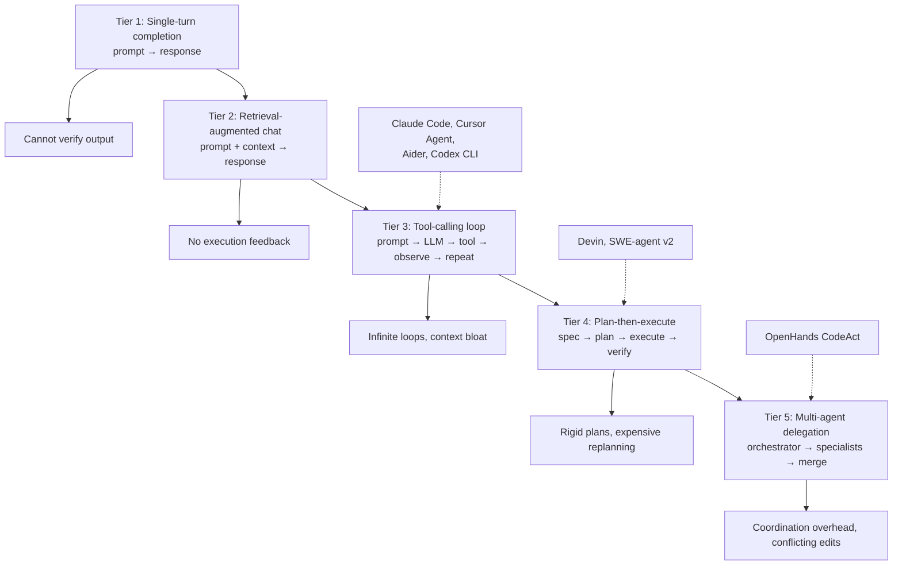

# The Autonomous Coding Agent Landscape (2026)

## Learning Objectives

- Compare coding agent architectures across five control-flow tiers and map commercial tools to their underlying loop design
- Implement a minimal tool-calling agent loop in Python with file-read, file-write, and bash-run tools
- Diagnose three failure modes (infinite loops, context exhaustion, silent test corruption) from agent execution traces
- Configure production guardrails (token budgets, diff-review gates, path traversal prevention) for coding agent deployment
- Evaluate agent-generated code against a GTM schema before execution in an enrichment pipeline

## The Problem

"Which coding agent is best" is the wrong question. The right question is: on a task distribution that matches your work, with the scaffolding you will actually run in production, what end-to-end reliability do you get? The answer depends less on the model and more on the loop wrapped around it.

Between 2022 and 2026 the field learned that scaffolding — the retrieval layer, the planner, the sandbox, the edit-verify cycle, the feedback format — is load-bearing. Claude Sonnet 4.5 inside SWE-agent v1 scored 43.2% on SWE-bench Verified. The same model inside Cline's autonomous scaffold scored 59.8%. Sixteen absolute points of difference from the same weights. The base model is a component; the loop architecture is the product.

The companion problem is benchmark saturation obscures real-world difficulty. SWE-bench Verified is close to saturated at 80.9%, but 161 of its 500 tasks require only a 1–2 line change. When you filter to tasks requiring 10+ lines (SWE-bench Pro), the same frontier models sit at 23–59%. If your work involves multi-file refactors, API integrations, or building new modules from specifications, the Verified leaderboard overpromises and you discover the gap in production.

## The Concept

Coding agents organize into five architectural tiers, each defined by its control flow — not by its model, not by its branding.

**Tier 1 — Single-turn completion.** You send a prompt, the model returns code. No file access, no execution, no iteration. GitHub Copilot's original ghost-text suggestion is this tier. The failure mode is obvious: the model cannot verify its own output.

**Tier 2 — Retrieval-augmented chat.** The model gets relevant code context (open files, embeddings of the codebase) but still cannot execute anything. Cursor's chat mode and Copilot Chat live here. Failure mode: retrieval surfaces stale or irrelevant context, the model hallucinates APIs that don't exist in the project, and there's no feedback loop to catch it.

**Tier 3 — Tool-calling loops.** The model receives tools (file-read, file-write, bash-run), uses them, observes results, and decides the next action. This is the ReAct pattern applied to code. Aider, Cursor Agent Mode, Claude Code, and Codex CLI all implement variants of this loop. The failure modes are richer: infinite loops where the agent tries the same fix repeatedly, context window bloat from accumulated tool outputs, and silent corruption where the agent writes code that passes tests for the wrong reasons.

**Tier 4 — Plan-then-execute.** The model first generates a step-by-step plan (sometimes using a separate planning call), then executes each step with tool access, then verifies against the plan. Devin's architecture follows this pattern, as does SWE-agent's later versions. The failure mode: plans are rigid, and when step 3 fails, the agent either replans from scratch (expensive) or pushes forward with a broken plan (produces broken code).

**Tier 5 — Multi-agent delegation.** An orchestrator agent decomposes the task and delegates subtasks to specialist agents — one for writing tests, one for implementation, one for review. OpenHands implements this with its CodeAct agents, and some Devin workflows delegate to parallel sub-agents. The failure mode: coordination overhead, conflicting file edits between agents, and the orchestrator's decomposition quality becomes the bottleneck.



Within these tiers, there is a second axis: how the model communicates actions. Most frameworks (SWE-agent, Aider, Claude Code) use structured JSON tool calls — the model emits a JSON object with a tool name and arguments, the framework parses it and executes. OpenHands' CodeAct loop takes a different approach: the model writes executable Python or bash directly, and the sandbox runs it. The difference matters because CodeAct allows the model to interleave reasoning, code, and observation in a single response stream, while JSON tool calls enforce explicit round-trips for each action.

```python
import json

json_tool_call = {
    "type": "tool_use",
    "name": "run_python",
    "input": {
        "code": "import os\nfiles = os.listdir('.')\nprint(files)"
    }
}

codeact_block = """obs = []
import os
files = os.listdir('.')
for f in files:
    if f.endswith('.py'):
        obs.append(f)
print(f"Python files: {obs}")
"""

print("=== JSON Tool-Call Format (SWE-agent, Claude Code, most frameworks) ===")
print(json.dumps(json_tool_call, indent=2))
print()
print("=== Code