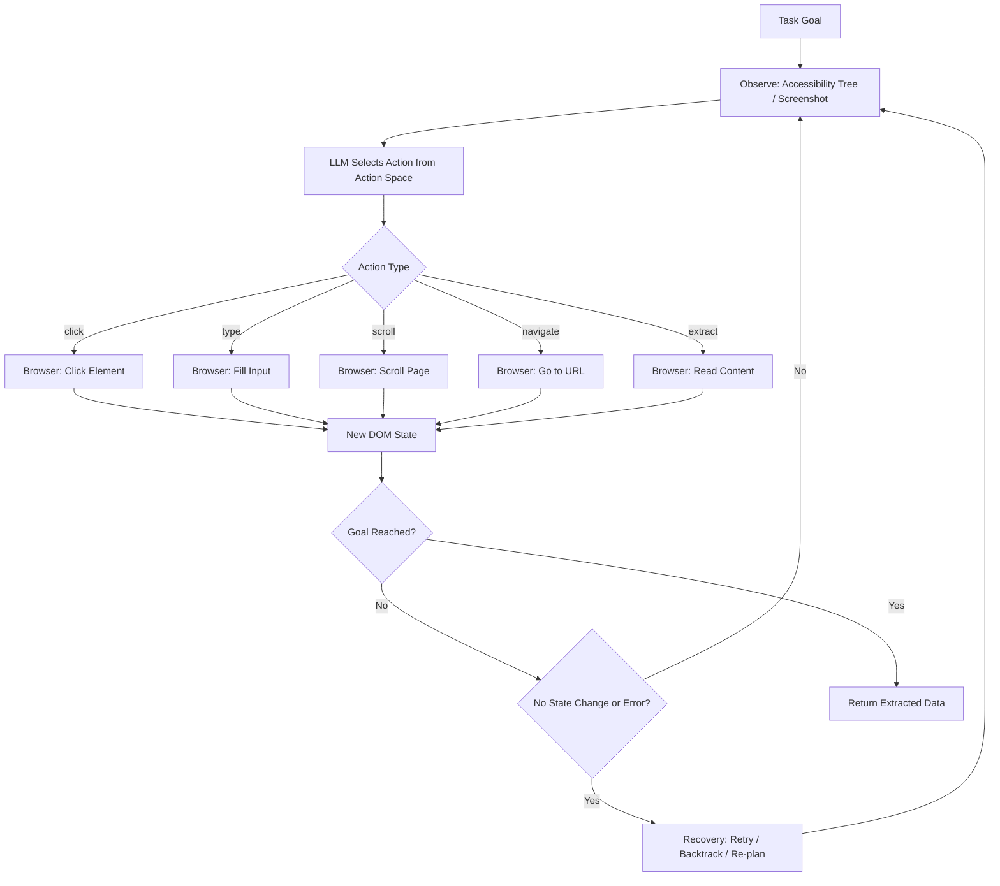

# Browser Agents and Long-Horizon Web Tasks

## Learning Objectives

1. Implement an observe-act loop that selects DOM actions based on page state and executes them through action primitives
2. Compare observation representations (accessibility tree, screenshot, raw HTML) for encoding agent state across long task sequences
3. Detect failed actions and apply recovery patterns (retry, backtrack, re-plan) within the agent loop
4. Evaluate the indirect prompt injection attack surface when browser agents process prospect data from untrusted pages
5. Map browser agent capabilities to GTM enrichment gaps where no API exists

## The Problem

Half the data sources a GTM engineer needs do not expose an API. LinkedIn profiles, company websites with heavy JavaScript rendering, government procurement databases, regulatory filings, job boards — these are pages designed for human eyes behind human interactions. An HTTP GET returns a skeleton HTML shell or a Cloudflare challenge page, not the data. The gap between "call the API" and "get the data" is where browser agents live.

The gap is not just about rendering. Many workflows require multi-step interaction: log in, search, filter results, click into a record, scroll for more data, paginate, export. Each step depends on the state produced by the previous one. A static scraper that fetches a URL gets one snapshot. A browser agent navigates through the same sequence a human would, maintaining session state, cookies, and form context across dozens of actions. This is long-horizon web interaction — and it introduces problems that simple scraping does not: compounding error across steps, context window exhaustion after 50+ observations, and recovery when a page loads differently than expected.

There is also an uncomfortable security dimension. Every page the agent visits is untrusted input. The agent reads that input and then takes consequential actions — clicking buttons, submitting forms, extracting data. If an attacker can embed instructions in the page content that the agent interprets as commands, the agent becomes a pivot point. The 2025–2026 attack corpus — Tainted Memories (Atlas CSRF), HashJack (Cato Networks), and one-click hijacks in Perplexity Comet — demonstrates this is not theoretical. OpenAI's head of preparedness stated publicly that indirect prompt injection into browser agents "is not a bug that can be fully patched." The reading-vs-acting boundary is architecturally fuzzy: every token the model reads could, in principle, be read as an instruction.

## The Concept

A browser agent is a loop. It observes the current DOM state, selects an action from a defined action space, executes that action through a browser automation layer, observes the resulting state, and repeats until the task is complete or the agent determines it is stuck. The simplicity of the loop hides three hard problems: what the agent can do (action space), what the agent sees (state representation), and what happens when things go wrong (recovery).

The action space is the set of primitives the agent can execute. The minimal set is: `click(target)`, `type(target, value)`, `scroll(direction)`, `navigate(url)`, and `extract(selector)`. These compose into higher-level actions — `fill_form(fields)`, `search(query)`, `paginate_and_collect()` — but the agent selects at the primitive level because primitives are what the browser automation layer can execute deterministically. The action space is the contract between the LLM's decision-making and the browser's execution. If the action space is too narrow, the agent cannot accomplish tasks. If it is too broad, the LLM struggles to select correctly.

State representation determines what the agent "sees" at each step. Three approaches dominate, each with tradeoffs:

- **Raw HTML**: Complete information but enormous token cost. A single page can be 50,000+ tokens. After 10 steps, the context window is exhausted.
- **Screenshots**: The agent sees what a human sees — layout, visual hierarchy, dynamically rendered content. But screenshots require a vision model, are expensive to process, and make element targeting imprecise ("click the blue button" is ambiguous).
- **Accessibility tree**: The browser's internal representation of page elements as a hierarchical structure with roles, names, and states. It strips visual styling, preserves semantic structure, and costs roughly 10x fewer tokens than raw HTML. Browser Use and most modern browser agents use this as the primary observation.



Long-horizon tasks — those requiring dozens or hundreds of loops — introduce two additional problems. First, compounding error: if the agent has a 90% per-step success rate, after 50 steps the probability of completing without error is 0.5%. The agent needs recovery, not just execution. Second, context window limits: 50 observations of accessibility trees, each at 2,000 tokens, is 100,000 tokens — close to or exceeding the model's window. The agent must manage memory: what to keep, what to summarize, what to discard. This is typically handled by maintaining a rolling window of recent observations with a compressed summary of earlier steps.

Planning decomposition addresses the error problem by breaking a task into sub-goals. "Research this company" becomes: search for the company → identify the correct result → navigate to the profile → extract overview data → navigate to employees → extract key contacts. Each sub-goal is a shorter loop with a verifiable termination condition. If a sub-goal fails, the agent backtracks to the last known good state rather than restarting the entire task.

The benchmark landscape for browser agents solidified in 2025–2026. BrowseComp measures real-world browsing tasks; ChatGPT's merged agent (July 2025) set SOTA at 68.9%. OSWorld measures desktop GUI tasks; Anthropic's Vercept acquisition moved Claude Sonnet from under 15% to 72.5%. WebArena-Verified (ServiceNow, ICLR 2026) fixed 11.3 percentage points of false-negative rate in the original WebArena and shipped a 258-task Hard subset. These benchmarks define the action spaces and evaluation protocols the field converges on. [CITATION NEEDED — concept: specific browser agent benchmarks and their action space definitions beyond BrowseComp, OSWorld, and WebArena-Verified]

Tools follow the mechanism. Playwright is the browser automation layer — it drives a real Chromium/Firefox/WebKit instance and executes the primitives (click, type, navigate). Browser Use implements the observe-act loop on top of Playwright: it extracts the accessibility tree, passes it to an LLM, receives a structured action, and executes it through Playwright. The LLM is the action selector; Playwright is the action executor.

## Build It

The following code implements a minimal browser agent loop against a simulated DOM state machine. No browser is required — the simulation demonstrates the observe-act architecture, action selection, termination detection, recovery, and context compression. The scenario is a GTM enrichment task: search for a company, navigate to its profile, extract company data, then navigate to employees and extract contact data.

```python
from dataclasses import dataclass, field

@dataclass
class DOMElement:
    id: str
    tag: str
    text: str = ""
    attrs: dict = field(default_factory=dict)

@dataclass
class Action:
    type: str
    target: str = ""
    value: str = ""
    reason: str = ""

class SimulatedBrowser:
    def __init__(self):
        self.pages = self._init_pages()
        self.current = "search"
        self.form_values = {}
        self.action_count = 0

    def _init_pages(self):
        return {
            "search": {
                "url": "https://crm.example.com/search",
                "elements": [
                    DOMElement("search-input", "input", "", {"placeholder": "Search companies"}),
                    DOMElement("search-btn", "button", "Search"),
                ],
                "content": ["Company Search Portal"],
            },
            "results": {
                "url": "https://crm.example.com/search?q=acme+corp",
                "elements": [
                    DOMElement("company-1", "a", "Acme Corp", {"href": "/company/acme"}),
                    DOMElement("company-2", "a", "Acme Industries", {"href": "/company/acme-ind"}),
                    DOMElement("company-3", "a", "Acme Logistics", {"href": "/company/acme-log"}),
                ],
                "content": ["3 results found"],
            },
            "profile": {
                "url": "https://crm.example.com/company/acme",
                "elements": [
                    DOMElement("overview-tab", "a", "Overview"),
                    DOMElement("employees-tab", "a", "Employees (247)"),
                    DOMElement("tech-tab", "a", "Tech Stack"),
                ],
                "content": [
                    "Acme Corp",
                    "Industry: Enterprise SaaS",
                    "Revenue: $45M ARR",
                    "Headquarters: San Francisco, CA",
                    "Founded: 2018",
                ],
            },
            "employees": {
                "url": "https://crm.example.com/company/acme/employees",
                "elements": [
                    DOMElement("emp-1", "a", "Jane Doe - CEO"),
                    DOMElement("emp