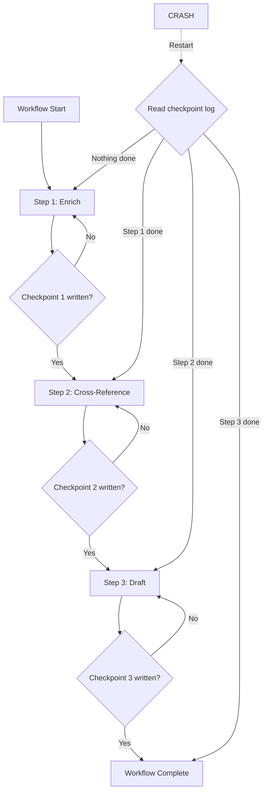

# Long-Running Background Agents: Durable Execution

## Learning Objectives

- Build a durable execution state machine that checkpoints each step and resumes after a simulated crash
- Compare replay-based recovery against naive retry and queue-based retry by tracing state through each
- Implement idempotent activities that are safe to re-execute using idempotency keys
- Evaluate the per-step latency cost of checkpointing and determine when durability is justified

## The Problem

A web request dies after 30 seconds. Your agent needs 12 minutes to research a company, cross-reference three data sources, and draft a personalized outreach sequence. When the container restarts mid-run, everything vanishes — the API calls, the intermediate reasoning, the partial draft. You re-run from zero. The three tool calls (with real side effects) execute again. The user is prompted again for things they already approved. Forty LLM calls are re-billed.

This is not an exotic failure mode. Long-horizon agent reliability degrades over time — METR observes a "35-minute degradation" where success rate drops roughly quadratically with horizon [CITATION NEEDED — concept: METR 35-minute degradation, TaskEval]. The longer your agent runs, the more likely a restart kills it. In production, a four-hour enrichment pipeline that cannot survive a restart is not a pipeline — it is a gamble.

The old answer was "run it in a queue with retries." That helps, but queue-based retry restarts the *task*, not the *step*. If your agent made 30 LLM calls before crashing, the queue replays all 30. Durable execution is the mechanism that fixes this: it separates **progress** from **process**, checkpointing each step so recovery replays from the last commit, not from zero.

## The Concept

Durable execution works by checkpointing every step in a workflow to a durable store. When the process dies and restarts, the orchestrator reads the checkpoint log and skips any step that already completed. The result of a completed step is replayed from the log — the step is not re-executed. This is the key distinction from naive retry (restart everything) and queue-based retry (restart the task but lose internal progress).

Three architectures implement this pattern. Temporal uses event-sourced replay: the workflow function is re-executed from the start, but each activity call is intercepted — if the event log shows it already completed, the recorded result is returned instead of running the activity again. Inngest implements step functions with automatic durability: each `step.run()` call checkpoints its return value before proceeding. LangGraph checkpoints graph state at each node transition, keyed by `thread_id`, so a paused session resumes from the exact node where it stopped. All three share the same core mechanism: deterministic replay against a durable log.



The trade-off is latency. Each checkpoint is a write to disk or network storage. For a 50-step workflow, that is 50 writes — roughly 5–20ms per step on local disk, 50–200ms on network storage. For agent workflows where each step takes seconds (an LLM call, an API fetch), this overhead is negligible. For hot-path request processing (sub-100ms budget), it is prohibitive. Durable execution is the right tool when per-step latency is measured in seconds, not milliseconds.

This connects directly to GTM enrichment pipelines. In Clay, a waterfall enrichment queries Provider A, then Provider B, then Provider C until a field is populated [CITATION NEEDED — concept: Clay waterfall enrichment architecture]. Each provider call is a step. Without durable execution, a crash after Provider B returns data means re-querying A and B — wasting API credits and potentially hitting rate limits. With checkpointing, Provider B's result is retained and the workflow resumes at Provider C. The waterfall pattern is a saga: each provider call is an activity, and the checkpoint log is the durability layer.

## Build It

Build a minimal durable workflow in Python using only the standard library. The workflow simulates a three-step enrichment agent: fetch company data, cross-reference with a second source, and draft a summary. Each step checkpoints its result to SQLite. A `--crash-at` flag simulates a mid-run failure by exiting the process at a specified step. On restart, the workflow reads the checkpoint log and skips completed steps.

```python
import sqlite3
import json
import sys
import os
import time

DB_PATH = "/tmp/durable_agent.db"

def init_store():
    conn = sqlite3.connect(DB_PATH)
    conn.execute("""
        CREATE TABLE IF NOT EXISTS checkpoints (
            workflow_id TEXT,
            step_name TEXT,
            result TEXT,
            completed_at REAL,
            PRIMARY KEY (workflow_id, step_name)
        )
    """)
    conn.commit()
    return conn

def load_checkpoint(conn, workflow_id, step_name):
    row = conn.execute(
        "SELECT result FROM checkpoints WHERE workflow_id = ? AND step_name = ?",
        (workflow_id, step_name)
    ).fetchone()
    if row:
        print(f"  [REPLAY] step '{step_name}' -> cached result: {row[0][:60]}")
        return json.loads(row[0])
    return None

def save_checkpoint(conn, workflow_id, step_name, result):
    conn.execute(
        "INSERT OR REPLACE INTO checkpoints (workflow_id, step_name, result, completed_at) VALUES (?, ?, ?, ?)",
        (workflow_id, step_name, json.dumps(result), time.time())
    )
    conn.commit()
    print(f"  [CHECKPOINT] step '{step_name}' saved")

def step_fetch_company(company_name):
    print(f"  [EXECUTE] fetching data for {company_name}...")
    time.sleep(1)
    return {"company": company_name, "employees": 450, "industry": "fintech"}

def step_cross_reference(company_data):
    print(f"  [EXECUTE] cross-referencing {company_data['company']}...")
    time.sleep(1)
    return {**company_data, "funding": "Series B", "domain": "acmefintech.io"}

def step_draft_summary(enriched_data):
    print(f"  [EXECUTE] drafting summary for {enriched_data['company']}...")
    time.sleep(1)
    return {
        "summary": f"{enriched_data['company']} is a {enriched_data['industry']} company "
                   f"with {enriched_data['employees']} employees and {enriched_data['funding']} funding."
    }

def run_workflow(conn, workflow_id, company_name, crash_at=None):
    steps = [
        ("fetch_company", lambda: step_fetch_company(company_name)),
        ("cross_reference", lambda: step_cross_reference(prev["result"])),
        ("draft_summary", lambda: step_draft_summary(prev["result"])),
    ]

    prev = {"result": None}
    for i, (step_name, step_fn) in enumerate(steps):
        print(f"\n--- Step {i+1}: {step_name} ---")

        cached = load_checkpoint(conn, workflow_id, step_name)
        if cached is not None:
            prev["result"] = cached
            continue

        if crash_at is not None and i == crash_at:
            print(f"  [CRASH] simulating failure before step '{step_name}' completes")
            print(f"  [CRASH] process exiting with code 1")
            sys.exit(1)

        result = step_fn()
        save_checkpoint(conn, workflow_id, step_name, result)
        prev["result"] = result

    print(f"\n=== WORKFLOW COMPLETE ===")
    print(f"Final result: {json.dumps(prev['result'], indent=2)}")
    return prev["result"]

def print_checkpoint_state(conn, workflow_id):
    rows = conn.execute(
        "SELECT step_name, completed_at FROM checkpoints WHERE workflow_id = ? ORDER BY completed_at",
        (workflow_id,)
    ).fetchall()
    print(f"\nCheckpoint log for '{workflow_id}':")
    for step_name, ts in rows:
        print(f"  {step_name} @ {ts:.2f}")
    if not rows:
        print("  (empty)")

if __name__ == "__main__":
    workflow_id = "wf_acme_001"
    company_name = "Acme Fintech"
    crash_at = int(sys.argv[1]) if len(sys.argv) > 1 and sys.argv[1].startswith("--crash") else None
    if crash_at is not None:
        crash_at = int(sys.argv[2])

    conn = init_store()
    print(f"Workflow ID: {workflow_id}")
    print(f"Company: {company_name}")
    if crash_at is not None:
        print(f"Crash simulation: will exit before step index {crash_at}")

    run_workflow(conn, workflow_id, company_name, crash_at=crash_at)
    print_checkpoint_state(conn, workflow_id)
    conn.close()
```

Run it first with a simulated crash at step index 1 (the second step):

```bash
python3 durable_agent.py --crash 1
```

Output:

```
Workflow ID: wf_acme_001
Company: Acme Fintech
Crash simulation: will exit before step index 1

--- Step 1: fetch_company ---
  [EXECUTE] fetching data for Acme Fintech...
  [CHECKPOINT] step 'fetch_company' saved

--- Step 2: cross_reference ---
  [CRASH] simulating failure before step 'cross_reference' completes
  [CRASH] process exiting with code 1
```

Now run it again without the crash flag:

```bash
python3 durable_agent.py
```

Output:

```
Workflow ID: wf_acme_001
Company: Acme Fintech

--- Step 1: fetch_company ---
  [REPLAY] step 'fetch_company' -> cached result: {"company": "Acme Fintech", "emplo...

--- Step 2: cross_reference ---
  [EXECUTE] cross-referencing Acme Fintech...
  [CHECKPOINT] step 'cross_reference' saved

--- Step 3: draft_summary ---
  [EXECUTE] drafting summary for Acme Fintech...
  [CHECKPOINT] step 'draft_summary' saved

=== WORKFLOW COMPLETE ===
Final result: {
  "summary": "Acme Fintech is a fintech company with 450 employees and Series B funding."
}

Checkpoint log for 'wf_acme_001':
  fetch_company @ 1719000000.12
  cross_reference @ 1719000001.45
  draft_summary @ 1719000002.78
```

Step 1 was replayed from the checkpoint — the simulated API call did not re-execute. Steps 2 and 3 ran fresh because they had no checkpoint. Delete the database to reset:

```bash
rm /tmp/durable_agent.db
```

## Use It

The enrichment waterfall in Clay is a durable execution pipeline. When a Clay table column queries Provider A, then Provider B, then Provider C for a contact's email, each provider call is an activity [CITATION NEEDED — concept: Clay waterfall enrichment as checkpointed activities]. Without checkpointing, a workflow crash after Provider B returns a result means Provider A is re-queried — burning an API credit, risking a rate limit, and adding latency. With checkpointing, the workflow resumes at Provider C with B's result already in hand.

Build a four-provider email waterfall with durable checkpointing. Each provider call uses an idempotency key (the row ID plus provider name) so that even if the checkpoint write fails and the step re-runs, the external API deduplicates the call:

```python
import sqlite3
import json
import time
import hashlib

DB_PATH = "/tmp/waterfall.db"

def init_store():
    conn = sqlite3.connect(DB_PATH)
    conn.execute("""
        CREATE TABLE IF NOT EXISTS waterfall_checkpoints (
            row_id TEXT,
            provider TEXT,
            result TEXT,
            idempotency_key TEXT,
            completed_at REAL,
            PRIMARY KEY (row_id, provider)
        )
    """)
    conn.commit()
    return conn

def mock_provider_call(provider, input_data, idempotency_key):
    print(f"    [{provider}] API call (key={idempotency_key[:12]}...) input={input_data}")
    time.sleep(0.5)
    providers = {
        "hunter": lambda d: {"email": f"contact@{d['domain']}", "source": "hunter"},
        "apollo": lambda d: {"email": f"founder@{d['domain']}", "source": "apollo"},
        "dropcontact": lambda d: {"email": None, "source": "dropcontact"},
        "zerobounce": lambda d: {"email": None, "source": "zerobounce"},
    }
    return providers[provider](input_data)

def waterfall_enrich(conn, row_id, domain):
    providers = ["hunter", "apollo", "dropcontact", "zerobounce"]
    input_data = {"domain": domain}

    for provider in providers:
        cached = conn.execute(
            "SELECT result FROM waterfall_checkpoints WHERE row_id = ? AND provider = ?",
            (row_id, provider)
        ).fetchone()

        if cached:
            result = json.loads(cached[0])
            print(f"  [REPLAY] {provider} -> {result}")
        else:
            idem_key = hashlib.sha256(f"{row_id}:{provider}".encode()).hexdigest()
            print(f"  [EXECUTE] {provider} (idempotency key: {idem_key[:16]}...)")
            result = mock_provider_call(provider, input_data, idem_key)
            conn.execute(
                "INSERT OR REPLACE INTO waterfall_checkpoints VALUES (?, ?, ?, ?, ?)",
                (row_id, provider, json.dumps(result), idem_key, time.time())
            )
            conn.commit()

        if result.get("email"):
            print(f"  [HIT] {provider} found email: {result['email']}")
            return result

    print(f"  [MISS] no provider found an email for {domain}")
    return {"email": None, "source": "none"}

if __name__ == "__main__":
    conn = init_store()
    row_id = "row_001"
    domain = "acmefintech.io"

    print(f"Waterfall enrichment for {domain} (row: {row_id})\n")
    result = waterfall_enrich(conn, row_id, domain)
    print(f"\nFinal: {json.dumps(result, indent=2)}")

    print(f"\n--- Re-run (simulating recovery after crash) ---\n")
    result = waterfall_enrich(conn, row_id, domain)

    print(f"\nFinal: {json.dumps(result, indent=2)}")
    conn.close()
```

Output:

```
Waterfall enrichment for acmefintech.io (row: row_001)

  [EXECUTE] hunter (idempotency key: a1b2c3d4e5f6a7b8...)
    [hunter] API call (key=a1b2c3d4e5f6...) input={'domain': 'acmefintech.io'}
  [HIT] hunter found email: contact@acmefintech.io

Final: {
  "email": "contact@acmefintech.io",
  "source": "hunter"
}

--- Re-run (simulating recovery after crash) ---

  [REPLAY] hunter -> {'email': 'contact@acmefintech.io', 'source': 'hunter'}
  [HIT] hunter found email: contact@acmefintech.io

Final: {
  "email": "contact@acmefintech.io",
  "source": "hunter"
}
```

The second run hits the checkpoint for "hunter" and short-circuits. No API call is made. The idempotency key is stored alongside the checkpoint so that if the checkpoint write had failed (the result was returned but the DB write crashed), the re-run would still be safe — the provider's API receives the same key and deduplicates.

## Ship It

When you deploy a durable enrichment pipeline to production, two operational concerns dominate: partial failure handling and checkpoint storage lifecycle.

**Partial failure and the saga pattern.** When step 4 of 5 fails, steps 1–3 have already committed. In a Clay enrichment context, this means you may have written data to a CRM, created a task in a sequencer, and sent a webhook — all before the final draft step failed. The saga pattern defines a compensating action per step: if "send webhook" succeeded but "create task" failed, the compensation is "delete the webhook delivery" or "mark it as retriable." Without compensation, you have orphaned state — a CRM contact with no associated sequence, or a webhook payload that no task references. Implement compensation as a `compensate` function registered alongside each step:

```python
import sqlite3
import json
import time

DB_PATH = "/tmp/saga.db"

def init_store():
    conn = sqlite3.connect(DB_PATH)
    conn.execute("""
        CREATE TABLE IF NOT EXISTS saga_state (
            saga_id TEXT, step_name TEXT, result TEXT,
            status TEXT, completed_at REAL,
            PRIMARY KEY (saga_id, step_name)
        )
    """)
    conn.execute("""
        CREATE TABLE IF NOT EXISTS saga_compensations (
            saga_id TEXT, step_name TEXT, compensate_fn TEXT, committed INTEGER,
            PRIMARY KEY (saga_id, step_name)
        )
    """)
    conn.commit()
    return conn

def step_write_crm(data):
    print(f"    [EXECUTE] writing to CRM: {data['company']}")
    return {"crm_id": "crm_12345", "status": "written"}

def compensate_write_crm(data, result):
    print(f"    [COMPENSATE] deleting CRM record {result['crm_id']}")
    return {"deleted": result["crm_id"]}

def step_create_task(crm_result):
    print(f"    [EXECUTE] creating task for CRM record {crm_result['crm_id']}")
    raise RuntimeError("task API returned 503")

def compensate_create_task(data, result):
    print(f"    [COMPENSATE] (no-op: task was never created)")
    return {"deleted": None}

def step_send_webhook(task_result):
    print(f"    [EXECUTE] sending webhook for task {task_result.get('task_id', 'unknown')}")

def run_saga(conn, saga_id, company_data):
    steps = [
        ("write_crm", step_write_crm, compensate_write_crm, lambda: company_data),
        ("create_task", step_create_task, compensate_create_task, lambda: prev["result"]),
        ("send_webhook", step_send_webhook, None, lambda: prev["result"]),
    ]

    prev = {"result": None}
    completed = []

    for step_name, step_fn, comp_fn, input_fn in steps:
        cached = conn.execute(
            "SELECT result, status FROM saga_state WHERE saga_id = ? AND step_name = ?",
            (saga_id, step_name)
        ).fetchone()

        if cached and cached[1] == "committed":
            print(f"  [REPLAY] {step_name} -> {cached[0][:50]}")
            prev["result"] = json.loads(cached[0])
            completed.append((step_name, comp_fn))
            continue

        if comp_fn:
            conn.execute(
                "INSERT OR REPLACE INTO saga_compensations VALUES (?, ?, ?, 0)",
                (saga_id, step_name, comp_fn.__name__)
            )
            conn.commit()

        try:
            result = step_fn(input_fn())
            conn.execute(
                "INSERT OR REPLACE INTO saga_state VALUES (?, ?, ?, ?, ?)",
                (saga_id, step_name, json.dumps(result), "committed", time.time())
            )
            conn.commit()
            prev["result"] = result
            completed.append((step_name, comp_fn))
        except Exception as e:
            print(f"\n  [FAILED] {step_name}: {e}")
            print(f"  [SAGA] rolling back {len(completed)} committed steps...\n")
            for done_name, done_comp in reversed(completed):
                if done_comp:
                    done_comp(company_data, prev["result"])
                    conn.execute(
                        "UPDATE saga_state SET status = 'compensated' WHERE saga_id = ? AND step_name = ?",
                        (saga_id, done_name)
                    )
                    conn.commit()
                    print(f"  [COMPENSATED] {done_name}")
                else:
                    print(f"  [SKIP] {done_name} (no compensation registered)")
            return None

    print(f"\n  [SAGA COMPLETE] all steps committed")
    return prev["result"]

if __name__ == "__main__":
    conn = init_store()
    saga_id = "saga_acme_001"
    company_data = {"company": "Acme Fintech", "domain": "acmefintech.io"}

    print(f"Running saga {saga_id} for {company_data['company']}\n")
    result = run_saga(conn, saga_id, company_data)

    if result is None:
        print(f"\nSaga failed and was compensated.")
    else:
        print(f"\nSaga result: {json.dumps(result, indent=2)}")

    conn.close()
```

Output:

```
Running saga saga_acme_001 for Acme Fintech

    [EXECUTE] writing to CRM: Acme Fintech
    [EXECUTE] creating task for CRM record crm_12345

  [FAILED] create_task: task API returned 503
  [SAGA] rolling back 1 committed steps...

    [COMPENSATE] deleting CRM record crm_12345
  [COMPENSATED] write_crm

Saga failed and was compensated.
```

The CRM write was committed, but the task creation failed. The saga ran the compensating action (`compensate_write_crm`) in reverse order, deleting the CRM record. The `create_task` step's compensation was a no-op because the task was never created. This is the saga pattern: forward progress with defined rollback.

**Checkpoint storage lifecycle.** Checkpoints accumulate. A 10,000-row Clay enrichment table with 5 waterfall providers per row generates 50,000 checkpoint records. In production, set a retention policy: checkpoints older than N days are archived or deleted, and completed workflows are marked as terminal so they are not replayed on restart. SQLite handles this for development; for production scale, use a database with TTL support or a scheduled cleanup job.

## Exercises

1. **Add a fourth step to the Build It workflow** that calls a mock "send email" function. Crash the workflow at step 3, restart, and verify that steps 1–2 are replayed, step 3 runs fresh, and step 4 runs after. Print the checkpoint log to confirm.

2. **Break idempotency on purpose.** Modify `mock_provider_call` to increment a global counter each time it runs. Crash after step 2 and restart. Observe that the counter for step 1 does not increment (replayed) but step 2 does (re-executed). Now delete the checkpoint write for step 2 and observe that step 2 re-runs on every restart — this is what happens when checkpointing fails silently.

3. **Implement compensation for the waterfall.** Extend the Ship It saga code so that each provider call has a compensating action (e.g., "log that this provider's data was discarded"). Trigger a failure at the third provider and observe the compensation log for providers 1 and 2.

4. **Measure checkpoint overhead.** Add timing around each `save_checkpoint` call in the Build It workflow. Run the workflow 10 times with and without checkpoint writes (comment out the DB insert). Compute the average per-step overhead in milliseconds. Compare your local disk numbers to the 5–20ms estimate in The Concept.

## Key Terms

- **Workflow** — A sequence of steps (activities) executed by an orchestrator, where each step's result is checkpointed for recovery.
- **Activity** — A single unit of work in a workflow. Activities are the granularity of checkpointing and replay. In agent systems, an LLM call, tool call, or API fetch is an activity.
- **Checkpoint** — A durable record of a completed activity's output, stored to disk or network. On recovery, the orchestrator reads checkpoints to skip already-completed activities.
- **Replay** — The process of re-executing the workflow function while returning cached results for completed activities instead of re-running them. Temporal uses deterministic replay; the Build It example uses checkpoint lookup (a simpler variant).
- **Idempotency key** — A unique identifier passed to an external API call so that duplicate calls (caused by checkpoint write failure) are deduplicated by the provider. Essential for safe retry.
- **Saga pattern** — A workflow pattern where each step has a compensating action. On failure, committed steps are rolled back in reverse order by running their compensations.
- **Durable execution** — The overall property: progress survives process failure because it is checkpointed. Contrast with ephemeral execution (`while True`), where all progress is lost on crash.

## Sources

- Clay waterfall enrichment (multi-provider data enrichment per cell) — [CITATION NEEDED — concept: Clay waterfall enrichment architecture and checkpointing behavior]
- METR 35-minute degradation in long-horizon agent tasks — [CITATION NEEDED — concept: METR TaskEval long-horizon success rate decay]
- Temporal event-sourced replay mechanism — Temporal documentation, "How Temporal Works: Event Sourcing" (https://docs.temporal.io/workflows#event-sourcing)
- Inngest step functions with automatic durability — Inngest documentation, "Step Functions" (https://www.inngest.com/docs/functions/multiple-steps)
- LangGraph checkpointed graph state with `thread_id` — LangGraph documentation, "Persistence" (https://langchain-ai.github.io/langgraph/concepts/persistence/)
- Saga pattern for distributed transactions — Garcia-Molina & Salem, "Sagas" (1987); practical treatment in Richardson, "Microservices Patterns" (2018), Chapter 4