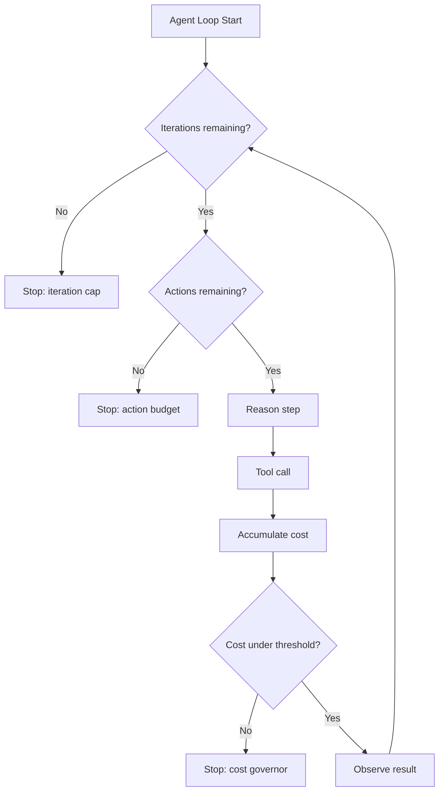

# Action Budgets, Iteration Caps, and Cost Governors

## Learning Objectives

- Implement an action budget that decrements on each tool invocation and terminates the agent loop at zero.
- Build an iteration cap that bounds the number of reasoning cycles an agent may complete.
- Construct a cost governor that accumulates token spend from API responses and terminates when a threshold is breached.
- Compose all three controls so that hitting any ceiling triggers graceful shutdown with partial results.
- Diagnose whether caps are too tight or too loose by analyzing budget consumption logs.

## The Problem

A ReAct chain calls a search tool, gets an empty result, reasons about why it failed, tries a different query, gets another empty result, reasons again — and 47 API calls later has burned $12 in tokens with no useful output. Nobody designed it to fail this way. Nobody designed it to stop either.

The industry term for this failure mode is **Denial of Wallet**: the agent keeps reasoning, keeps tool-calling, keeps billing, and nothing terminates it because nothing was built to terminate it. A chatbot's bad output is a bad reply. An agent's bad loop is an invoice. Microsoft's Agent Governance Toolkit and Anthropic's Claude Code Agent SDK both ship primitives specifically to defend against this class of failure — per-request `max_tokens`, per-task token and dollar budgets, iteration caps, kill switches on budget breach. The primitives exist. The question is whether you wire them in before or after the $4,800 bill arrives.

The fix is not one number. It is a stack of limits at different time scales and granularities. A per-request cap catches a single hallucinated novel. An iteration cap catches a retry loop. A cost governor catches a slow leak that neither of the other two notices. You need all three because they catch failures at different rates and in different ways.

## The Concept

Three independent control surfaces, each targeting a different failure mode.

An **action budget** is a hard ceiling on discrete tool calls. Every time the agent invokes a tool, a counter decrements. When it hits zero, no more tool calls — the agent can still reason, but it cannot act. This prevents the agent from making 200 HTTP requests to a search API in a single task.

An **iteration cap** limits how many loop cycles an agent may complete before being forced to yield. In a ReAct loop (Reason → Act → Observe → Repeat), one iteration is one full pass through that cycle. The iteration cap is the outermost guard: even if the agent has action budget remaining, it cannot start a new cycle if the iteration count is exhausted.

A **cost governor** tracks cumulative spend — tokens consumed, dollars spent, or wall-clock latency — and terminates the process when a threshold is breached. Unlike the other two, it operates on continuous units. The agent might make only three tool calls but still breach a cost governor if each call's context window is enormous.



The composition is disjunctive: hitting *any* ceiling triggers shutdown. The agent does not get to vote.

One subtlety deserves attention: what do you return when a cap fires mid-reasoning? The answer is a **partial result** — the accumulated observations, a status flag indicating which budget was exhausted, and whatever intermediate reasoning exists. A partial result is almost always more useful than a timeout error. The caller can decide whether to retry with a higher budget, switch models, or accept the partial answer. This contract — partial result plus stop reason — is what separates a controlled shutdown from a crash.

The algorithms are trivially simple, which is why the discipline of actually wiring them in is where teams fail. Action budgets: check a counter before each call, decrement after. Iteration caps: wrap the loop in a bounded range, check whether the agent signaled completion after each pass. Cost governors: accumulate usage from each API response, compare against a float threshold before the next call. The ordering matters — check iteration cap first, then action budget, then cost governor, then execute the step. Each guard sees the state *before* the expensive operation.

## Build It

Let me build each control as a standalone, composable component using pure Python stdlib. No framework dependencies — these are patterns you can drop into any agent codebase.

```python
from dataclasses import dataclass, field
from typing import Optional

@dataclass
class BudgetState:
    iterations_used: int = 0
    actions_used: int = 0
    total_tokens: int = 0
    total_cost_usd: float = 0.0
    stop_reason: Optional[str] = None

    @property
    def exhausted(self) -> bool:
        return self.stop_reason is not None

    def summary(self) -> str:
        lines = [
            f"  Iterations: {self.iterations_used}",
            f"  Actions:    {self.actions_used}",
            f"  Tokens:     {self.total_tokens}",
            f"  Cost:       ${self.total_cost_usd:.4f}",
            f"  Stop:       {self.stop_reason or 'completed'}",
        ]
        return "\n".join(lines)
```

Now the three guard functions, each checking one dimension of the budget:

```python
def check_iteration_cap(state: BudgetState, max_iterations: int) -> bool:
    if state.iterations_used >= max_iterations:
        state.stop_reason = "iteration_cap"
        return False
    return True

def check_action_budget(state: BudgetState, max_actions: int) -> bool:
    if state.actions_used >= max_actions:
        state.stop_reason = "action_budget"
        return False
    return True

def check_cost_governor(state: BudgetState, max_tokens: int, max_cost_usd: float) -> bool:
    if state.total_tokens >= max_tokens:
        state.stop_reason = "token_governor"
        return False
    if state.total_cost_usd >= max_cost_usd:
        state.stop_reason = "cost_governor"
        return False
    return True
```

Now a simulated agent loop that wires all three together. The tool is a mock so you can observe the controls firing without spending real tokens:

```python
import random

def mock_tool_call(tool_name: str, query: str) -> dict:
    tokens_consumed = random.randint(500, 2000)
    cost = tokens_consumed * 0.00001
    if "fail" in query:
        return {"result": None, "tokens": tokens_consumed, "cost": cost, "error": "empty results"}
    return {
        "result": f"Found data for: {query}",
        "tokens": tokens_consumed,
        "cost": cost,
    }

def run_agent(task: str, max_iterations: int, max_actions: int, max_tokens: int, max_cost_usd: float):
    state = BudgetState()
    observations = []
    queries = [f"query_{i}" for i in range(20)]
    query_idx = 0

    print(f"Starting task: {task}")
    print(f"  Limits: iterations={max