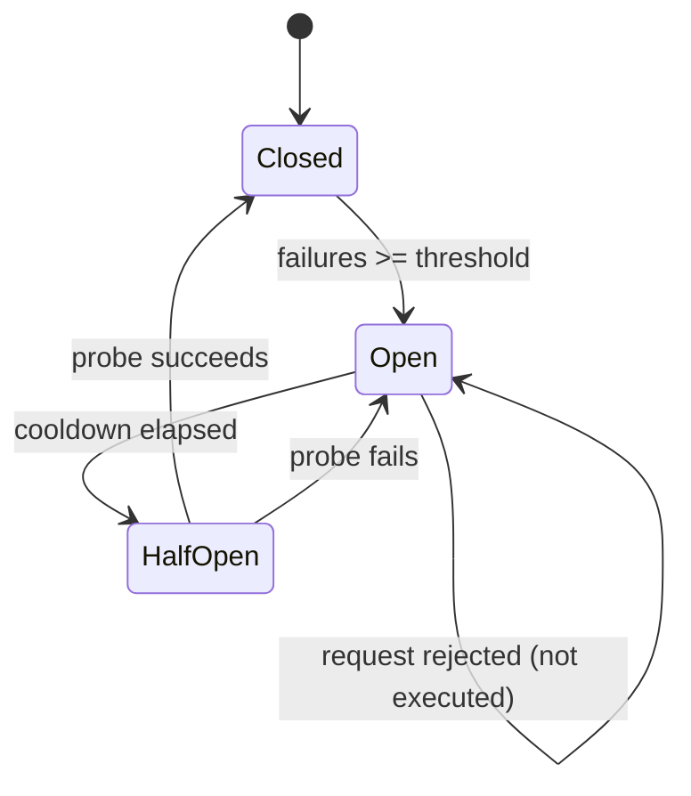

# Kill Switches, Circuit Breakers, and Canary Tokens

## Learning Objectives

- Implement a circuit breaker state machine that tracks consecutive failures, opens at a threshold, and probes recovery after a cooldown
- Build a kill switch that halts an automated process mid-iteration by checking an external flag
- Deploy a canary token that logs unauthorized access with caller metadata
- Compare the three mechanisms by failure mode: immediate halt vs. threshold-based isolation vs. intrusion detection
- Integrate circuit breakers into a Clay-style enrichment waterfall to skip providers whose APIs are erroring

## The Problem

You automated an outreach sequence. It started sending emails with a broken personalization variable — `{{company_name}}` rendered as a raw Jinja tag — to 4,000 prospects. The first bounce arrived six minutes in. You noticed twelve minutes in. By then, 1,800 prospects had received an email addressed to "Dear {{company_name}}." Your sender reputation dropped, two prospects replied to tell you your sequence was broken, and one posted it on LinkedIn.

This is a cascading failure. The root cause was small — a template variable that wasn't populated. The damage was large because there was no mechanism between "the first email sent incorrectly" and "the 1,800th email sent incorrectly." Nothing was watching for the pattern and nothing could stop it quickly.

Cost governors (Lesson 13) bound token spend. They do not bound what the agent does inside the budget. An agent with a $50 velocity limit can still send 4,000 broken emails if each one costs $0.01 in tokens. The expensive action — reputation damage — is often cheap in tokens. You need three additional mechanisms sitting next to the cost layer: a kill switch for immediate halt, a circuit breaker for threshold-based isolation, and a canary token for early breach detection. All three predate autonomous agents — they come from electrical engineering, distributed systems, and classical deception respectively — but the attack surface is larger now because agents act autonomously and at speed.

## The Concept

A **kill switch** is a checked flag evaluated at each iteration of a loop or before each outbound action. The flag lives outside the agent's edit surface — an environment variable, a Redis key, a feature flag, a database row the agent cannot write to. When the flag is tripped, the next check stops the process. No grace period, no gradual wind-down. The mechanism is a conditional: `if kill_switch.engaged: halt`. The hard part is not the conditional — it is ensuring the flag is checked at every iteration and that the agent cannot modify the flag itself.

A **circuit breaker** is a state machine with three states: Closed (normal operation), Open (all requests rejected), and Half-Open (one probe request allowed). The mechanism tracks consecutive failures against a threshold. When the threshold is exceeded, the state transitions to Open and subsequent requests are rejected without execution — the function is never called. After a cooldown period, the breaker allows one probe request (Half-Open). If the probe succeeds, the breaker resets to Closed. If it fails, the breaker returns to Open and the cooldown restarts. This prevents cascading failures: if an enrichment API is down, you stop calling it instead of accumulating timeouts and error responses.



A **canary token** is a tripwire resource whose access proves unauthorized activity. The mechanism embeds a unique, trackable identifier — a URL, a DNS name, an API key, a database record — in a location only accessible through compromise. Think of it as a burglar alarm disguised as a valuable object. If the token is touched, an alert fires. The token has no legitimate business purpose; any access is evidence of intrusion. A decoy ICP list in your CRM, a fake API key in a config file, a DNS record for a subdomain that should never be queried — these are canary tokens. They detect, they do not prevent.

All three mechanisms share a property: they are evaluated outside the normal execution path. A kill switch is checked *before* the action. A circuit breaker wraps the call *around* the action. A canary token fires *after* unauthorized access. The layers compose: a kill switch stops everything, a circuit breaker isolates a failing dependency, and a canary token tells you someone got in.

## Build It

The following script implements all three patterns. Each section prints observable output confirming the mechanism fired.

```python
import time
import random
import json
from datetime import datetime, timedelta
from enum import Enum

class CircuitState(Enum):
    CLOSED = "CLOSED"
    OPEN = "OPEN"
    HALF_OPEN = "HALF_OPEN"

class CircuitBreaker:
    def __init__(self, name, failure_threshold=3, cooldown_seconds=2):
        self.name = name
        self.failure_threshold = failure_threshold
        self.cooldown_seconds = cooldown_seconds
        self.failure_count = 0
        self.state = CircuitState.CLOSED
        self.opened_at = None
        self.calls_blocked = 0

    def _can_attempt(self):
        if self.state == CircuitState.CLOSED:
            return True
        if self.state == CircuitState.OPEN:
            elapsed = datetime.now() - self.opened_at
            if elapsed >= timedelta(seconds=self.cooldown_seconds):
                self.state = CircuitState.HALF_OPEN
                print(f"  [{self.name}] OPEN -> HALF_OPEN (cooldown elapsed, probing)")
                return True
            return False
        return True

    def call(self, func, *args, **kwargs):
        if not self._can_attempt(self):
            self.calls_blocked += 1
            return {"skipped": True, "reason": "circuit_open", "state": self.state.value}
        try:
            result = func(*args, **kwargs)
            if self.state == CircuitState.HALF_OPEN:
                print(f"  [{self.name}] HALF_OPEN -> CLOSED (probe succeeded)")
            self.failure_count = 0
            self.state = CircuitState.CLOSED
            self.opened_at = None
            return result
        except Exception as e:
            self.failure_count += 1
            if self.state == CircuitState.HALF_OPEN:
                print(f"  [{self.name}] HALF_OPEN -> OPEN (probe failed)")
                self.state = CircuitState.OPEN
                self.opened_at = datetime.now()
            elif self.failure_count >= self.failure_threshold:
                print(f"  [{self.name}] CLOSED -> OPEN ({self.failure_count} consecutive failures)")
                self.state = CircuitState.OPEN
                self.opened_at = datetime.now()
            return {"skipped": True, "reason": str(e)}

class KillSwitch:
    def __init__(self):
        self.engaged = False

    def check(self, context=""):
        if self.engaged:
            print(f"  [KILL SWITCH] HALT at {context}")
            return False
        return True

    def trip(self, reason=""):
        self.engaged = True
        print(f"  [KILL SWITCH] ENGAGED — reason: {reason}")

class CanaryToken:
    def __init__(self, token_id, description):
        self.token_id = token_id
        self.description = description
        self.accessed = False
        self.access_log = []

    def access(self, caller_ip="unknown", user_agent="unknown"):
        ts = datetime.now().isoformat()
        entry = {
            "token_id": self.token_id,
            "description": self.description,
            "caller_ip": caller_ip,
            "user_agent": user_agent,
            "timestamp": ts
        }
        self.accessed = True
        self.access_log.append(entry)
        print(f"  [CANARY TOKEN] TRIPPED: {self.token_id}")
        print(f"    Decoy: {self.description}")
        print(f"    Caller IP: {caller_ip}")
        print(f"    User-Agent: {user_agent}")
        print(f"    Timestamp: {ts}")
        return entry

print("=" * 60)
print("CIRCUIT BREAKER DEMO — enrichment provider waterfall")
print("=" * 60)

def flaky_provider(provider_name, success_rate=0.15):
    if random.random() < success_rate:
        return {"provider": provider_name, "status": "ok", "data": {"revenue": "$10M-$50M"}}
    raise ConnectionError(f"{provider_name} returned 503")

breaker = CircuitBreaker("Apollo", failure_threshold=3, cooldown_seconds=2)

for i in range(12):
    print(f"\nAttempt {i+1}:")
    result = breaker.call(flaky_provider, "Apollo", success_rate=0.15)
    print(f"  -> {result}")
    time.sleep(0.35)

print(f"\nCalls blocked while open: {breaker.calls_blocked}")
print(f"Final state: {breaker.state.value}")

print("\n" + "=" * 60)
print("KILL SWITCH DEMO — outreach sequence halt")
print("=" * 60)

kill = KillSwitch()
prospects = [f"prospect_{i:03d}@company.com" for i in range(25)]
sent_count = 0

for i, email in enumerate(prospects):
    if not kill.check(f"step {i}: sending to {email}"):
        break
    print(f"  Sending to {email}")
    sent_count += 1
    if i == 6:
        print("  *** DETECTION: template variable {{company_name}} unresolved ***")
        kill.trip("broken personalization variable detected")

print(f"\nSent: {sent_count} of {len(prospects)} prospects")
print(f"Remaining: {len(prospects) - sent_count} prospects saved from broken email")

print("\n" + "=" * 60)
print("CANARY TOKEN DEMO — decoy CRM record")
print("=" * 60)

decoy = CanaryToken(
    "CT-ICP-F500-001",
    "Q4 Target List — Fortune 500 Security Buyers (DECOY)"
)

print("\nScenario: Decoy record planted in CRM with unique tracking pixel URL")
print("Simulating unauthorized access from external IP...\n")

decoy.access(
    caller_ip="203.0.113.42",
    user_agent="python-requests/2.28.1"
)

print("\n--- ALERT PAYLOAD (would be sent to Slack/security webhook) ---")
print(json.dumps(decoy.access_log, indent=2))
print(f"\nUnauthorized access confirmed: {decoy.accessed}")
```

When you run this script, you will observe three things. The circuit breaker will trip after three consecutive provider failures, block subsequent calls, transition to Half-Open after the cooldown, and either reset or re-open depending on the probe result. The kill switch will halt the outreach loop at step 7, saving the remaining 18 prospects from receiving a broken email. The canary token will log the access with caller metadata that an incident response team would use to trace the intrusion.

## Use It

The enrichment waterfall — a pattern where multiple data providers are queried in sequence until one returns a result — is the canonical GTM application for circuit breakers. Clay implements this waterfall by cycling through providers like Apollo, Clearbit, ZoomInfo, and Hunter in order [CITATION NEEDED — concept: Clay waterfall provider ordering]. If Apollo's API is returning 503s, calling it for every prospect in a 10,000-row table wastes your API credits and adds latency to every enrichment. A circuit breaker wrapping the Apollo call will trip after three failures, skip Apollo for the remaining prospects, and drop straight to Clearbit. When Apollo recovers, the Half-Open probe lets traffic resume without manual intervention. The circuit breaker pays for itself in saved API calls and wall-clock time.

Kill switches apply to automated outreach sequences and any agent-driven campaign that sends outbound traffic. The switch is a single checked flag — a boolean in Redis, a row in a database, a feature flag in LaunchDarkly — that the loop evaluates before each action. The critical design constraint is that the agent or automation tool cannot modify the flag. If the agent can flip it back to `False`, it is not a kill switch; it is a suggestion. In practice, this means the flag lives in a system the agent does not have write access to — a separate database, a feature flag service, or an environment variable set by the operator.

Canary tokens address a different GTM failure mode: data exfiltration. A GTM stack contains valuable proprietary data — ICP definitions, enrichment recipes, messaging playbooks, pricing models, contact databases. If a competitor or a compromised credential accesses this data, you want to know immediately. Embedding a decoy record — a fake contact named something like "Test Internal Account DO NOT CONTACT" with a unique tracking URL — gives you a tripwire. If that URL is ever loaded, the record has been accessed by someone who should not be looking at it. Canarytoken.org (maintained by Thinkst) provides free, hosted canary tokens as DNS records, web bugs, and AWS API keys [CITATION NEEDED — concept: canarytoken.org free hosted tokens and alert types]. In a CRM context, you plant the decoy record with the tracking token in a field that would only be rendered if someone opens the record.

## Ship It

A production safety harness for an automated GTM process needs all three mechanisms layered. Start with the kill switch as the outermost layer — it is the coarsest control but the fastest to execute. The flag should live in a datastore separate from the campaign's execution environment: if your sequence runs in Clay, the kill switch should be a webhook the operator can call, not a field in the Clay table itself. The check should happen before each outbound action, not just at the start of the batch. A batch of 10,000 rows takes time; a failure detected at row 5,000 needs to stop the remaining 5,000 rows, not wait for the batch to finish.

The circuit breaker wraps each external dependency independently. In a Clay waterfall enrichment with four providers, each provider gets its own breaker instance with its own failure threshold and cooldown. Apollo tripping should not block Clearbit. The thresholds should be tuned to the provider's observed reliability — a provider with a 2% baseline error rate should have a higher threshold than one with a 0.1% rate. Monitor the `calls_blocked` counter for each breaker; a provider that is consistently tripped is either misconfigured or genuinely unreliable, and either case warrants switching to a fallback provider permanently.

For canary tokens in a CRM, plant at least two: one decoy contact record and one decoy playbook document. Use unique, trackable identifiers for each — a unique subdomain in a DNS canary, a unique pixel URL in a web canary, or a unique API key in a credential canary. Wire the alert to a channel your team monitors in real time (Slack, PagerDuty). Document the decoy locations so your own team does not trigger false positives during routine data hygiene. Review access logs monthly: if the decoy has never been touched, either your security posture is excellent or your decoy placement is too obvious to be found by an attacker.

```python
import json
from datetime import datetime

class GTMSafetyHarness:
    def __init__(self, config_path="gtm_safety_config.json"):
        self.kill_switch_engaged = False
        self.breakers = {}
        self.canaries = {}
        self.alert_log = []

    def register_breaker(self, provider_name, threshold=3, cooldown=300):
        self.breakers[provider_name] = {
            "threshold": threshold,
            "cooldown": cooldown,
            "failures": 0,
            "state": "CLOSED",
            "opened_at": None,
            "blocked_count": 0
        }

    def register_canary(self, token_id, token_type, location):
        self.canaries[token_id] = {
            "type": token_type,
            "location": location,
            "triggered": False,
            "triggered_at": None
        }

    def check_kill_switch(self):
        return not self.kill_switch_engaged

    def trip_kill_switch(self, reason):
        self.kill_switch_engaged = True
        self._log_alert("KILL_SWITCH", reason)

    def attempt_call(self, provider_name):
        if provider_name not in self.breakers:
            return True
        breaker = self.breakers[provider_name]
        if breaker["state"] == "OPEN":
            if breaker["opened_at"]:
                elapsed = (datetime.now() - breaker["opened_at"]).total_seconds()
                if elapsed >= breaker["cooldown"]:
                    breaker["state"] = "HALF_OPEN"
                    return True
            breaker["blocked_count"] += 1
            return False
        return True

    def record_result(self, provider_name, success):
        breaker = self.breakers[provider_name]
        if success:
            breaker["failures"] = 0
            breaker["state"] = "CLOSED"
        else:
            breaker["failures"] += 1
            if breaker["failures"] >= breaker["threshold"]:
                breaker["state"] = "OPEN"
                breaker["opened_at"] = datetime.now()
                self._log_alert(
                    "CIRCUIT_BREAKER",
                    f"{provider_name} opened after {breaker['failures']} failures"
                )

    def trigger_canary(self, token_id):
        canary = self.canaries.get(token_id)
        if canary and not canary["triggered"]:
            canary["triggered"] = True
            canary["triggered_at"] = datetime.now().isoformat()
            self._log_alert(
                "CANARY_TOKEN",
                f"Decoy {token_id} ({canary['type']}) at {canary['location']} was accessed"
            )

    def _log_alert(self, alert_type, message):
        entry = {
            "type": alert_type,
            "message": message,
            "timestamp": datetime.now().isoformat()
        }
        self.alert_log.append(entry)

    def status_report(self):
        return {
            "kill_switch": self.kill_switch_engaged,
            "breakers": {
                name: {"state": b["state"], "blocked": b["blocked_count"]}
                for name, b in self.breakers.items()
            },
            "canaries": {
                tid: {"triggered": c["triggered"]}
                for tid, c in self.canaries.items()
            },
            "alerts": self.alert_log
        }

harness = GTMSafetyHarness()
harness.register_breaker("apollo", threshold=3, cooldown=300)
harness.register_breaker("clearbit", threshold=5, cooldown=180)
harness.register_canary("CT-001", "dns", "internal-api.decoy.yourdomain.com")
harness.register_canary("CT-002", "web_bug", "https://track.canarytoken.com/abc123/report.gif")

print("=== Initial Status ===")
print(json.dumps(harness.status_report(), indent=2))

harness.record_result("apollo", success=False)
harness.record_result("apollo", success=False)
harness.record_result("apollo", success=False)

can_proceed = harness.attempt_call("apollo")
print(f"\nApollo call allowed after 3 failures: {can_proceed}")

harness.trigger_canary("CT-001")

harness.trip_kill_switch("Kill switch tripped by operator")
can_run = harness.check_kill_switch()
print(f"Process can run: {can_run}")

print("\n=== Final Status ===")
print(json.dumps(harness.status_report(), indent=2))
```

## Exercises

**Exercise 1 (Circuit Breaker + Waterfall):** Extend the `CircuitBreaker` class to support a multi-provider enrichment waterfall. Register three providers (Apollo, Clearbit, ZoomInfo) with different failure thresholds. Simulate 50 enrichment attempts where Apollo fails 60% of the time and the others succeed. Print which providers were skipped on each attempt and the total number of calls saved by the circuit breaker.

**Exercise 2 (Kill Switch + Sequence):** Build a multi-step outreach sequence simulator with four steps: email, wait, follow-up email, LinkedIn touch. Each step calls `kill.check()` before executing. Trip the kill switch during step 2 of prospect 3. Print the sequence state for all prospects — which steps completed, which were skipped. Demonstrate that a prospect mid-step (between email and follow-up) can be cleanly halted without partial state.

**Exercise 3 (Canary Token + Listener):** Implement a canary token as a mock HTTP endpoint using `http.server` from the Python standard library. The endpoint should serve a 1x1 transparent pixel and log the request — IP, timestamp, User-Agent, and Referer header — to stdout. Write a companion function that simulates planting the pixel URL in a decoy CRM record. Run the server, access the URL with `curl`, and verify the alert fires with the expected metadata.

## Key Terms

**Kill switch** — A hard-coded, always-available flag that terminates a running process immediately when checked. The flag must live outside the process's edit surface to be effective.

**Circuit breaker** — A state machine (Closed → Open → Half-Open) that rejects calls to a failing dependency after a threshold of consecutive failures, preventing cascading failures. After a cooldown, a single probe request determines whether the dependency has recovered.

**Canary token** — A tripwire resource (URL, DNS name, API key, database record) embedded in a location accessible only through compromise. Any access triggers an alert. Used for intrusion detection, not prevention.

**Cascading failure** — A failure in one component that propagates to dependent components, amplifying damage. Without a circuit breaker, a failing API causes timeouts and retries across all callers.

**Half-Open state** — The circuit breaker's probing state. Exactly one request is allowed through; its success or failure determines whether the breaker resets to Closed or returns to Open.

**Tripwire** — Any mechanism that detects unauthorized access by being triggered. Canary tokens are a specific implementation of the tripwire pattern.

## Sources

- Circuit breaker pattern: Michael Nygard, *Release It!* (2007), Pragmatic Bookshelf. The original description of the three-state circuit breaker for distributed systems.
- Canary tokens: Thinkst Security, "Canarytokens" (https://canarytokens.org). Free hosted canary tokens supporting DNS, HTTP, AWS API key, and other token types.
- [CITATION NEEDED — concept: Clay waterfall enrichment provider ordering and failover behavior]
- [CITATION NEEDED — concept: CAN-SPAM compliance requirements for automated outreach sequences and kill switch implications]
- [CITATION NEEDED — concept: GDPR Article 32 security of processing — canary tokens and decoy records as detection controls]