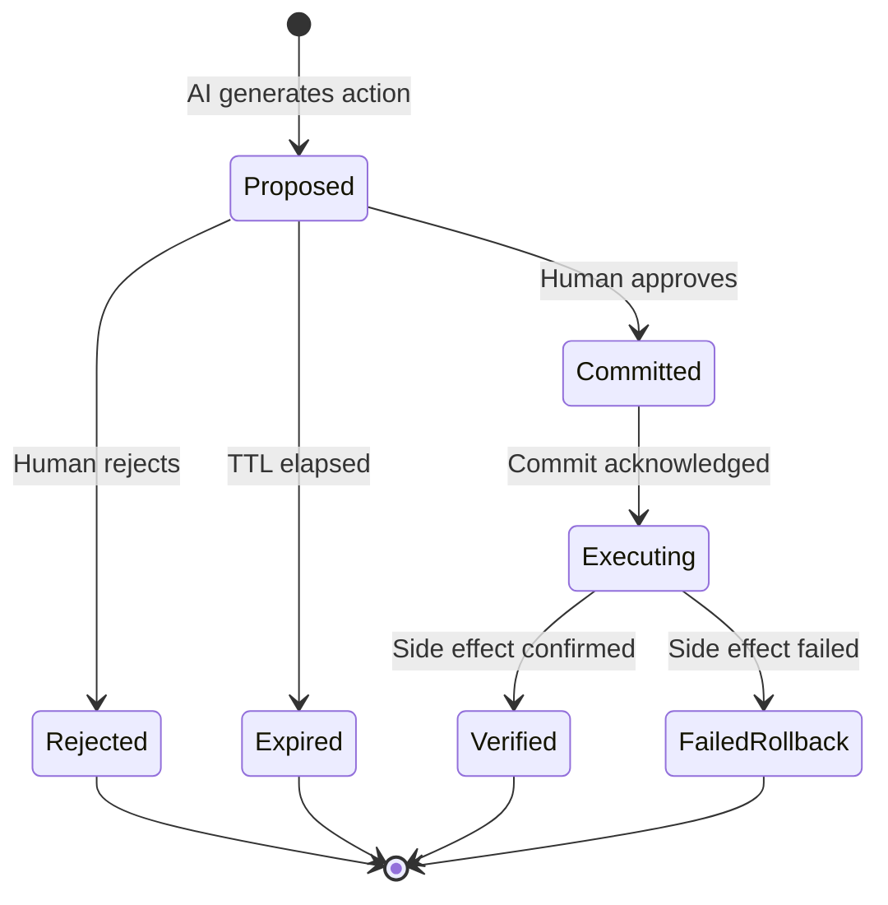

# Human-in-the-Loop: Propose-Then-Commit

## Learning Objectives

- Implement a propose-then-commit state machine with durable storage and idempotency keys.
- Trace the lifecycle of a proposal from creation through review to commit or rejection.
- Compare confidence-thresholded auto-commit against full human review gates.
- Diagnose rubber-stamp approval patterns using approval-rate monitoring and rejection-reason tracking.
- Build a batch review workflow that handles TTL expiry and stale proposal cleanup.

## The Problem

An agent takes an action. The user has to decide: approve or not. If the decision is instant, it is probably not a review. If the decision is structured, it is slow but trustworthy. The engineering question is how to make structured review the path of least resistance — and how to stop unstructured review from creating a false sense of safety.

The 2023-era HITL pattern was synchronous and ephemeral: a prompt appears, the user clicks Approve, the action fires. If the process crashes between approval and execution, the decision is lost. If the user approved without reading, there is no structured record of what they intended to approve. The audit trail shows a long history of "Approved" clicks that nobody can recall. This pattern is heavily rubber-stamped in practice — users approve fast, approvals predict little, and when the agent goes wrong, the approval history is useless for post-mortem analysis.

In a GTM context, the stakes are concrete and financial. An enrichment run overwrites firmographic data on 500 accounts with stale provider results. An automated outreach sequence sends personalized emails to a segment that was supposed to be excluded. An AI scoring model downgrades a pipeline of warm leads because the scoring prompt misinterpreted a signal. In each case, the damage is done before anyone reviews the output. The CRM is the system of record, and once it is mutated, rollback is manual, political, and expensive. Propose-then-commit is the state machine that prevents this — outputs are staged, reviewed, and only then written to the system of record.

## The Concept

Propose-then-commit is a two-phase transaction. Phase one: the AI system writes proposals to a durable staging store with a `proposed` status. Each proposal carries structured metadata — the intent behind the action, the data lineage (which inputs produced this output), the permissions the action will touch, the blast radius (how many records are affected), and an idempotency key so the same proposal cannot be committed twice. Phase two: a human reviewer transitions proposals to either `committed` or `rejected`. The proposal is only executed after a positive commit acknowledgement, and the execution is verified afterward to confirm the side effect actually occurred.



The key design decisions are what gets staged, who reviews, and what happens to stale proposals. Staging everything means maximum safety but maximum latency — every enrichment field update, every lead score change, every email draft sits in a queue until a human touches it. Confidence-thresholded staging is the practical middle ground: outputs above a confidence threshold auto-commit (the system is sure enough), outputs below the threshold enter the review queue (the system is uncertain). The threshold is not a number you set once — it is a parameter you tune against the approval rate. If 95% of queued proposals are approved, your threshold is too low and the review gate is theater. If 5% are approved, your threshold is too high and you are wasting human attention on obvious rejections.

Role-based review gates add another dimension. A junior ops person can approve firmographic enrichment updates. An SDR manager approves personalized outreach drafts. A RevOps lead approves account tier changes. The proposal metadata includes which roles are authorized to commit, and the review interface surfaces only the proposals a given reviewer is cleared to action. This is not just a permissions check — it routes the right proposals to the right reviewer, which reduces review fatigue and the rubber-stamp behavior that comes with it.

Every managed agent SDK ships a version of this pattern. LangGraph's `interrupt()` pauses graph execution and persists state to a checkpoint store (PostgreSQL by default), resuming when the human responds. Microsoft Agent Framework's `RequestInfoEvent` surfaces a structured request to the user and blocks until resolved. Cloudflare's `waitForApproval()` does the same on their durable objects substrate. The API names differ; the shape does not: propose with structured metadata, persist durably, block until human response, execute on commit, verify after execution.

## Build It

The following code implements a complete propose-then-commit state machine in pure Python. It stores proposals in memory with full metadata, supports confidence-thresholded auto-commit, handles TTL-based expiry, and executes committed actions with verification. Every operation prints observable output.

```python
import uuid
import time
from datetime import datetime, timedelta
from enum import Enum
from dataclasses import dataclass, field
from typing import Optional

class ProposalStatus(Enum):
    PROPOSED = "proposed"
    COMMITTED = "committed"
    REJECTED = "rejected"
    EXPIRED = "expired"
    EXECUTED = "executed"
    FAILED = "failed"

@dataclass
class Proposal:
    id: str
    intent: str
    payload: dict
    confidence: float
    proposer: str
    data_lineage: list
    blast_radius: int
    required_role: str
    idempotency_key: str
    created_at: datetime
    ttl_seconds: int
    status: ProposalStatus = ProposalStatus.PROPOSED
    reviewed_by: Optional[str] = None
    reviewed_at: Optional[datetime] = None
    rejection_reason: Optional[str] = None
    execution_result: Optional[str] = None

class ProposalStore:
    def __init__(self, auto_commit_threshold=0.95):
        self._store = {}
        self._idempotency_keys = set()
        self._audit_log = []
        self.auto_commit_threshold = auto_commit_threshold

    def propose(self, intent, payload, confidence, proposer,
                data_lineage, blast_radius, required_role,
                ttl_seconds=3600, idempotency_key=None):
        if idempotency_key is None:
            idempotency_key = str(uuid.uuid4())

        if idempotency_key in self._idempotency_keys:
            print(f"DUPLICATE: Idempotency key '{idempotency_key}' already exists. Proposal rejected.")
            return None

        if confidence >= self.auto_commit_threshold:
            status = ProposalStatus.COMMITTED
            print(f"AUTO-COMMIT: Confidence {confidence:.2f} >= threshold {self.auto_commit_threshold}")
        else:
            status = ProposalStatus.PROPOSED
            print(f"STAGED: Confidence {confidence:.2f} < threshold {self.auto_commit_threshold}. Awaiting review.")

        proposal = Proposal(
            id=str(uuid.uuid4())[:8],
            intent=intent,
            payload=payload,
            confidence=confidence,
            proposer=proposer,
            data_lineage=data_lineage,
            blast_radius=blast_radius,
            required_role=required_role,
            idempotency_key=idempotency_key,
            created_at=datetime.now(),
            ttl_seconds=ttl_seconds,
            status=status
        )

        self._store[proposal.id] = proposal
        self._idempotency_keys.add(idempotency_key)
        self._log("PROPOSE", proposal.id, proposer, f"intent={intent}, confidence={confidence:.2f}")
        return proposal

    def list_pending(self, role=None):
        self._expire_stale()
        pending = [p for p in self._store.values()
                   if p.status == ProposalStatus.PROPOSED]
        if role:
            pending = [p for p in pending if p.required_role == role]
        return pending

    def review(self, proposal_id, reviewer, role, decision,
               rejection_reason=None):
        proposal = self._store.get(proposal_id)
        if proposal is None:
            print(f"ERROR: Proposal {proposal_id} not found.")
            return False

        if proposal.status != ProposalStatus.PROPOSED:
            print(f"ERROR: Proposal {proposal_id} is already {proposal.status.value}.")
            return False

        if role != proposal.required_role:
            print(f"FORBIDDEN: Role '{role}' cannot review. Required: '{proposal.required_role}'")
            return False

        self._expire_stale()
        if proposal.status == ProposalStatus.EXPIRED:
            print(f"EXPIRED: Proposal {proposal_id} expired before review.")
            return False

        proposal.reviewed_by = reviewer
        proposal.reviewed_at = datetime.now()

        if decision == "approve":
            proposal.status = ProposalStatus.COMMITTED
            self._log("APPROVE", proposal.id, reviewer, f"intent={proposal.intent}")
            print(f"APPROVED: Proposal {proposal_id} by {reviewer}")
        elif decision == "reject":
            proposal.status = ProposalStatus.REJECTED
            proposal.rejection_reason = rejection_reason or "unspecified"
            self._log("REJECT", proposal.id, reviewer,
                      f"reason={proposal.rejection_reason}")
            print(f"REJECTED: Proposal {proposal_id} by {reviewer}. Reason: {proposal.rejection_reason}")
        return True

    def commit(self, proposal_id, executor_fn):
        proposal = self._store.get(proposal_id)
        if proposal is None:
            print(f"ERROR: Proposal {proposal_id} not found.")
            return False

        if proposal.status != ProposalStatus.COMMITTED:
            print(f"ERROR: Proposal {proposal_id} status is '{proposal.status.value}', not 'committed'.")
            return False

        try:
            result = executor_fn(proposal)
            proposal.status = ProposalStatus.EXECUTED
            proposal.execution_result = result
            self._log("EXECUTE", proposal.id, "system", f"result={result}")
            print(f"EXECUTED: Proposal {proposal_id}. Result: {result}")
            return True
        except Exception as e:
            proposal.status = ProposalStatus.FAILED
            proposal.execution_result = str(e)
            self._log("EXECUTE_FAIL", proposal.id, "system", f"error={e}")
            print(f"FAILED: Proposal {proposal_id}. Error: {e}")
            return False

    def _expire_stale(self):
        now = datetime.now()
        for proposal in self._store.values():
            if proposal.status == ProposalStatus.PROPOSED:
                age = (now - proposal.created_at).total_seconds()
                if age > proposal.ttl_seconds:
                    proposal.status = ProposalStatus.EXPIRED
                    self._log("EXPIRE", proposal.id, "system",
                              f"age={age:.0f}s, ttl={proposal.ttl_seconds}s")
                    print(f"EXPIRED: Proposal {proposal.id} (age {age:.0f}s > TTL {proposal.ttl_seconds}s)")

    def batch_review(self, proposal_ids, reviewer, role, decision,
                     rejection_reason=None):
        results = []
        for pid in proposal_ids:
            r = self.review(pid, reviewer, role, decision, rejection_reason)
            results.append((pid, r))
        approved = sum(1 for _, r in results if r) if decision == "approve" else 0
        rejected = sum(1 for _, r in results if r) if decision == "reject" else 0
        print(f"BATCH: {len(results)} proposals processed. "
              f"Approved: {approved}, Rejected: {rejected}")
        return results

    def stats(self):
        self._expire_stale()
        counts = {}
        for p in self._store.values():
            counts[p.status.value] = counts.get(p.status.value, 0) + 1

        reviewed = [p for p in self._store.values()
                    if p.status in (ProposalStatus.COMMITTED, ProposalStatus.EXECUTED,
                                    ProposalStatus.REJECTED)]
        approved_count = sum(1 for p in reviewed
                            if p.status in (ProposalStatus.COMMITTED, ProposalStatus.EXECUTED))
        total_reviewed = len(reviewed)
        approval_rate = approved_count / total_reviewed if total_reviewed > 0 else 0

        print(f"\n{'='*60}")
        print(f"PROPOSAL STORE STATS")
        print(f"{'='*60}")
        for status, count in sorted(counts.items()):
            print(f"  {status:15s}: {count}")
        print(f"  {'approval_rate':15s}: {approval_rate:.1%} ({approved_count}/{total_reviewed})")
        print(f"  {'total_audit_log':15s}: {len(self._audit_log)} events")
        print(f"{'='*60}\n")

    def print_audit_log(self):
        print(f"\n{'='*60}")
        print(f"AUDIT LOG")
        print(f"{'='*60}")
        for entry in self._audit_log:
            ts = entry['timestamp'].strftime('%H:%M:%S')
            print(f"  [{ts}] {entry['action']:12s} id={entry['proposal_id']} "
                  f"actor={entry['actor']} detail={entry['detail']}")
        print(f"{'='*60}\n")

    def _log(self, action, proposal_id, actor, detail):
        self._audit_log.append({
            'timestamp': datetime.now(),
            'action': action,
            'proposal_id': proposal_id,
            'actor': actor,
            'detail': detail
        })


def crm_writeback(proposal):
    intent = proposal.intent
    payload = proposal.payload
    print(f"  -> CRM WRITEBACK: {intent}")
    for key, value in payload.items():
        print(f"     {key}: {value}")
    return f"CRM updated successfully"


store = ProposalStore(auto_commit_threshold=0.95)

p1 = store.propose(
    intent="Upgrade Acme Corp to Enterprise tier",
    payload={"account": "Acme Corp", "field": "tier", "old_value": "Mid-Market", "new_value": "Enterprise"},
    confidence=0.72,
    proposer="enrichment-agent-v2",
    data_lineage=["clearbit:firmographics", "linkedin:headcount", "crunchbase:funding"],
    blast_radius=1,
    required_role="revops_lead",
    idempotency_key="acme-tier-upgrade-2026-01"
)

p2 = store.propose(
    intent="Update 47 accounts with new industry classification",
    payload={"filter": "industry=old_label", "field": "industry", "new_value": "SaaS / B2B"},
    confidence=0.88,
    proposer="enrichment-agent-v2",
    data_lineage=["clearbit:industry", "manual_review:sampled_10_percent"],
    blast_radius=47,
    required_role="revops_lead",
    idempotency_key="bulk-industry-update-2026-01"
)

p3 = store.propose(
    intent="Auto-fill technographic stack for Globex Inc",
    payload={"account": "Globex Inc", "field": "tech_stack", "value": ["Salesforce", "Marketo", "Snowflake"]},
    confidence=0.97,
    proposer="enrichment-agent-v2",
    data_lineage=["builtwith:technographics"],
    blast_radius=1,
    required_role="ops_analyst",
)

dup = store.propose(
    intent="Upgrade Acme Corp to Enterprise tier",
    payload={"account": "Acme Corp", "field": "tier", "old_value": "Mid-Market", "new_value": "Enterprise"},
    confidence=0.72,
    proposer="enrichment-agent-v2",
    data_lineage=["clearbit:firmographics", "linkedin:headcount"],
    blast_radius=1,
    required_role="revops_lead",
    idempotency_key="acme-tier-upgrade-2026-01"
)

print(f"\n--- PENDING PROPOSALS (revops_lead) ---")
for p in store.list_pending(role="revops_lead"):
    print(f"  [{p.id}] conf={p.confidence:.2f} blast={p.blast_radius} intent={p.intent}")

store.review(p1.id, reviewer="sarah@corp.com", role="revops_lead", decision="approve")
store.review(p2.id, reviewer="sarah@corp.com", role="revops_lead", decision="reject",
             rejection_reason="manual spot check found 3/10 misclassified")

store.commit(p1.id, crm_writeback)

p4 = store.propose(
    intent="Draft outreach email to Globex Inc VP of Engineering",
    payload={"to": "vp.eng@globex.com", "subject": "Infrastructure cost analysis",
             "body": "Hi {{first_name}}, noticed your team scaled to 200+ engineers..."},
    confidence=0.64,
    proposer="outreach-agent-v1",
    data_lineage=["linkedin:role", "crunchbase:funding_round", "g2:reviews"],
    blast_radius=1,
    required_role="sdr_manager",
    ttl_seconds=2,
)

print(f"\n--- Waiting 3 seconds for TTL expiry ---")
time.sleep(3)

store.review(p4.id, reviewer="tom@corp.com", role="sdr_manager", decision="approve")

batch_ids = [
    store.propose(
        intent=f"Update phone for Account {i}",
        payload={"account_id": f"ACC-{i:03d}", "field": "phone", "value": f"+1-555-01{i:02d}"},
        confidence=0.80 + i * 0.001,
        proposer="enrichment-agent-v2",
        data_lineage=["zoominfo:contact"],
        blast_radius=1,
        required_role="ops_analyst",
    ).id
    for i in range(5)
]

store.batch_review(batch_ids, reviewer="alex@corp.com", role="ops_analyst",
                   decision="approve")

store.stats()
store.print_audit_log()
```

Running this produces terminal output showing every state transition: the auto-commit for the high-confidence technographic proposal, the duplicate rejection via idempotency key, the approval and successful CRM writeback for Acme Corp, the rejection of the bulk industry update with a documented reason, the TTL expiry of the outreach email draft, and the batch approval of five phone updates. The stats block shows the approval rate, which is the metric you use to detect rubber-stamping.

## Use It

In GTM, the Clay waterfall enriches records by querying multiple data providers sequentially — Clearbit, then LinkedIn, then Crunchbase, filling gaps left by earlier providers. When AI is layered on top of this waterfall — scoring accounts, drafting personalization, routing leads — the outputs are proposals until a human approves them. The propose-then-commit pattern is the approval layer between Clay's enrichment waterfall and your CRM write-back. Without it, the enrichment pipeline writes directly to Salesforce or HubSpot, and any AI-driven transformation of that data lands in production without review.

The GTM scenario is concrete. An enrichment run processes 2,000 accounts through the waterfall. For each account, an AI model proposes a tier upgrade based on firmographic signals — headcount growth, funding round, technographic signals. A confidence score is attached. Accounts above 0.95 confidence auto-commit (the signals are overwhelming). Accounts between 0.70 and 0.95 enter the review queue with role-based routing: tier changes require a RevOps lead. The RevOps lead opens the queue, sees proposals with full data lineage (which providers contributed which signals, what the old tier was, what the new tier would be), and makes a batch decision. Committed proposals sync to CRM via webhook. Rejected proposals feed back into the model — if the rejection reason is "headcount signal was stale," the prompt engineering or the data freshness check needs updating.

The security dimension matters here. Outbound webhook authentication to Salesforce or HubSpot requires rotating API keys. Proposal payloads contain prospect data — names, emails, firmographics — which falls under GDPR if the prospects are in the EU. The staging store must treat proposal payloads as regulated data: encrypted at rest, access-controlled by role, and purged after expiry. A committed proposal that writes personal data to CRM is a data processing event under GDPR, and the audit log is your compliance record. The proposal's `required_role` field is not just a UX convenience — it is an access control that determines who can authorize a data processing action.

[CITATION NEEDED — concept: Clay proposal review queue UI or integration pattern for human approval of enrichment results before CRM write-back]

[CITATION NEEDED — concept: Clay waterfall enrichment provider sequence and write-back configuration]

## Ship It

Production deployment requires four components beyond the state machine itself. First, durable storage. The in-memory store in the build example is for learning. Production needs PostgreSQL or equivalent — LangGraph's checkpointing uses a Postgres table with the proposal ID, serialized state, and timestamp. If the review service restarts, pending proposals must survive. The idempotency key must be a database unique constraint, not just a set in memory.

Second, audit logging that satisfies compliance requirements. Every state transition is logged: who proposed, who reviewed, what was committed, what was rejected, and why. The log is append-only and timestamped. For GDPR-regulated data, the log itself may need retention limits — you cannot keep prospect data in audit logs indefinitely. The practical pattern is to log the proposal ID and metadata but redact PII from the audit entry after a retention window.

Third, batch review workflows. Reviewing proposals one at a time does not scale — a RevOps lead facing 200 pending tier upgrades needs a queue view with filtering, sorting by confidence, and bulk approve/reject. The `batch_review` method in the build example demonstrates the primitive. In production, this is a UI that groups proposals by type (all tier upgrades together, all industry reclassifications together), shows the blast radius prominently, and requires an explicit checklist confirmation before batch commit. The checklist is the anti-rubber-stamp mechanism: instead of one "Approve" button, the reviewer must acknowledge "I have reviewed 47 industry reclassifications and confirmed the sample audit" before the batch commits.

Fourth, monitoring and feedback loops. The approval rate is your primary signal. If 95% of proposals are approved, either your model is very good (raise the auto-commit threshold and remove humans from the loop for those cases) or your review process is theater (the reviewers are not actually reviewing). Track rejection reasons as structured data — not free text. "Headcount signal stale," "industry misclassified," "personalization tone too aggressive" are actionable categories that feed back into prompt engineering and data quality checks. If 40% of rejections cite stale data, the fix is upstream data freshness, not better review tooling.

Latency impact is real and must be measured. A review gate adds wall-clock time between enrichment and CRM update. For SLA-bound workflows (e.g., "new MQL must be enriched and routed within 5 minutes"), the review gate may be incompatible. The solution is tiered routing: high-confidence proposals auto-commit and meet the SLA; low-confidence proposals enter the review queue and miss the SLA but are flagged for follow-up. This is the confidence-thresholded auto-commit from the build example, applied to a production SLA constraint.

```python
import json
from datetime import datetime, timedelta

class ProductionMonitor:
    def __init__(self):
        self.rejections = []
        self.approval_latencies = []
        self.hourly_counts = {}

    def record_review(self, proposal, decision, review_latency_seconds):
        hour_key = datetime.now().strftime('%Y-%m-%d %H:00')
        if hour_key not in self.hourly_counts:
            self.hourly_counts[hour_key] = {'approved': 0, 'rejected': 0, 'auto_committed': 0}

        if proposal.status.value == 'committed' and proposal.reviewed_by is None:
            self.hourly_counts[hour_key]['auto_committed'] += 1
            return

        if decision == 'approve':
            self.hourly_counts[hour_key]['approved'] += 1
            self.approval_latencies.append(review_latency_seconds)
        elif decision == 'reject':
            self.hourly_counts[hour_key]['rejected'] += 1
            self.rejections.append({
                'proposal_id': proposal.id,
                'intent': proposal.intent,
                'reason': proposal.rejection_reason,
                'confidence': proposal.confidence,
                'timestamp': datetime.now().isoformat()
            })

    def rubber_stamp_check(self, min_reviews=20, rubber_stamp_threshold=0.90):
        total = sum(h['approved'] + h['rejected'] for h in self.hourly_counts.values())
        if total < min_reviews:
            print(f"RUBBER-STAMP CHECK: Insufficient data ({total} reviews, need {min_reviews}). Cannot assess.")
            return None

        approved = sum(h['approved'] for h in self.hourly_counts.values())
        rate = approved / total
        verdict = "RUBBER-STAMP LIKELY" if rate > rubber_stamp_threshold else "HEALTHY"
        print(f"RUBBER-STAMP CHECK: Approval rate {rate:.1%} over {total} reviews → {verdict}")
        if rate > rubber_stamp_threshold:
            print(f"  ACTION: Raise auto-commit threshold or tighten review checklist.")
        return rate

    def rejection_breakdown(self):
        if not self.rejections:
            print("REJECTION BREAKDOWN: No rejections recorded.")
            return {}

        reasons = {}
        for r in self.rejections:
            category = r['reason'].split(':')[0] if ':' in r['reason'] else r['reason']
            reasons[category] = reasons.get(category, 0) + 1

        total = len(self.rejections)
        print(f"\nREJECTION BREAKDOWN ({total} total):")
        for reason, count in sorted(reasons.items(), key=lambda x: -x[1]):
            print(f"  {reason:40s}: {count:4d} ({count/total:.0%})")
        top = max(reasons, key=reasons.get)
        print(f"  TOP REJECTION DRIVER: '{top}' → investigate upstream fix")
        return reasons

    def latency_report(self):
        if not self.approval_latencies:
            print("LATENCY: No manual review latencies recorded.")
            return
        latencies = sorted(self.approval_latencies)
        p50 = latencies[len(latencies)//2]
        p95 = latencies[int(len(latencies)*0.95)]
        avg = sum(latencies)/len(latencies)
        print(f"\nMANUAL REVIEW LATENCY:")
        print(f"  avg: {avg:.0f}s  p50: {p50:.0f}s  p95: {p95:.0f}s  count: {len(latencies)}")
        if p95 > 3600:
            print(f"  WARNING: p95 exceeds 1 hour. Review queue may be understaffed.")

    def full_report(self):
        print(f"\n{'='*60}")
        print(f"PRODUCTION HITL MONITORING REPORT")
        print(f"{'='*60}")
        for hour, counts in sorted(self.hourly_counts.items()):
            total = counts['approved'] + counts['rejected']
            auto = counts['auto_committed']
            print(f"  {hour}: manual={total} (approved={counts['approved']}, "
                  f"rejected={counts['rejected']}) auto_committed={auto}")
        self.rubber_stamp_check()
        self.rejection_breakdown()
        self.latency_report()
        print(f"{'='*60}\n")


monitor = ProductionMonitor()

class FakeProposal:
    def __init__(self, pid, intent, confidence, status, reviewed_by, rejection_reason=None):
        self.id = pid
        self.intent = intent
        self.confidence = confidence
        self.status = type('S', (), {'value': status})()
        self.reviewed_by = reviewed_by
        self.rejection_reason = rejection_reason

rejection_categories = [
    "stale_data:headcount_signal",
    "stale_data:funding_round",
    "misclassification:industry",
    "misclassification:industry",
    "tone:too_aggressive",
    "stale_data:headcount_signal",
    "wrong_segment:excluded_list",
    "misclassification:industry",
    "stale_data:headcount_signal",
    "tone:too_aggressive",
]

for i in range(40):
    p = FakeProposal(f"p{i:03d}", f"Update account {i}", 0.80 + i*0.001,
                     "committed", "reviewer@corp.com")
    monitor.record_review(p, "approve", review_latency_seconds=120 + i*5)

for j, reason in enumerate(rejection_categories):
    p = FakeProposal(f"r{j:03d}", f"Update account {j+40}",
                     0.70 + j*0.01, "rejected", "reviewer@corp.com",
                     rejection_reason=reason)
    monitor.record_review(p, "reject", review_latency_seconds=300 + j*10)

for k in range(15):
    p = FakeProposal(f"a{k:03d}", f"Auto-fill field {k}", 0.97,
                     "committed", None)
    monitor.record_review(p, "approve", review_latency_seconds=0)

monitor.full_report()
```

This monitoring code simulates 50 manual reviews (40 approved, 10 rejected) plus 15 auto-commits and produces a report showing the approval rate, rejection reason breakdown, and latency percentiles. The rubber-stamp check flags whether the approval rate is suspiciously high. The rejection breakdown identifies the top upstream fix — in this case, stale data signals, which means the enrichment provider data freshness is the problem, not the review process.

## Exercises

1. **Add a rollback mechanism.** Extend the `ProposalStore` class so that executed proposals can be rolled back. Store the pre-execution state in the proposal metadata (for CRM updates, the old field value). Implement a `rollback(proposal_id, executor_fn)` method that reverses the action and transitions the proposal to a `ROLLED_BACK` status. Test it by committing a CRM update, then rolling it back, and printing the before/after state.

2. **Implement escalation for stale proposals.** When a proposal expires (TTL elapsed), it should not silently disappear. Modify the `_expire_stale` method to escalate expired proposals to a notification queue. Write a `get_escalations()` method that returns expired proposals grouped by `required_role`. Print a summary showing how many proposals expired without review per role.

3. **Build a confidence threshold tuner.** Write a function that takes a list of historical proposals (with confidence scores and ground-truth approval/rejection labels) and computes the optimal auto-commit threshold. The objective: minimize the number of proposals sent to human review while keeping the false-auto-commit rate (proposals that were auto-committed but would have been rejected) below 1%. Print the recommended threshold and the resulting workload reduction.

4. **Implement a challenge-and-response checklist.** Modify the `review` method so that approving a proposal with `blast_radius > 10` requires a structured checklist response. The reviewer must answer three questions (e.g., "I sampled 5 records: Y/N", "The blast radius is correct: Y/N", "The data lineage includes at least 2 sources: Y/N"). If any answer is "N", the approval is blocked. Print the checklist interaction for a high-blast-radius proposal.

## Key Terms

**Propose-then-commit** — A two-phase HITL pattern where AI-generated actions are persisted to a durable store with `proposed` status and only executed after a human transitions them to `committed`.

**Idempotency key** — A unique identifier attached to a proposal that prevents the same action from being proposed or committed twice, even across retries or system restarts.

**Blast radius** — The number of records or entities affected by a single proposal. Used to route high-impact proposals to senior reviewers and to gate batch approvals behind checklists.

**Rubber-stamp approval** — A degenerate review pattern where the approval rate approaches 100%, indicating that reviewers are not actually evaluating proposals. Detected via approval-rate monitoring.

**Confidence-thresholded auto-commit** — A routing strategy where proposals above a confidence score bypass human review and commit automatically, while proposals below the threshold enter the review queue.

**Data lineage** — The structured record of which inputs and data sources produced a given AI output. Attached to every proposal so reviewers can trace how a suggestion was derived.

**TTL (time-to-live)** — The maximum duration a proposal can remain in `proposed` status before expiring. Prevents stale proposals from being committed after the underlying data has changed.

**Audit log** — An append-only record of every state transition in the proposal lifecycle: who proposed, who reviewed, what was committed or rejected, and when. Used for compliance and post-mortem analysis.

## Sources

- LangGraph `interrupt()` and checkpointing: LangGraph documentation describes `interrupt()` as a mechanism to pause graph execution and persist state to a checkpoint store, resuming on human response. The PostgreSQL checkpointing backend is documented in the LangGraph persistence guides. [Search pointer: LangGraph interrupt human-in-the-loop checkpointing documentation]

- Microsoft Agent Framework `RequestInfoEvent`: Documented as a structured event type that surfaces a request to the user and blocks agent execution until resolved. [Search pointer: Microsoft Agent Framework RequestInfoEvent human-in-the-loop]

- Cloudflare `waitForApproval()`: Documented as an approval mechanism on Cloudflare's durable objects substrate for agent workflows. [Search pointer: Cloudflare agents waitForApproval durable objects]

- [CITATION NEEDED — concept: Clay proposal review queue UI or integration pattern for human approval of enrichment results before CRM write-back]

- [CITATION NEEDED — concept: Clay waterfall enrichment provider sequence and write-back configuration]

- GDPR data processing requirements for audit logging and retention: The pattern of logging data processing events with role-based access controls and retention limits aligns with GDPR Article 30 (records of processing activities). [Search pointer: GDPR Article 30 records of processing activities audit requirements]

- CAN-SPAM and outbound outreach compliance: Propose-then-commit for email drafts provides an audit trail of who approved outreach content before sending. [Search pointer: CAN-SPAM Act compliance audit trail commercial email]