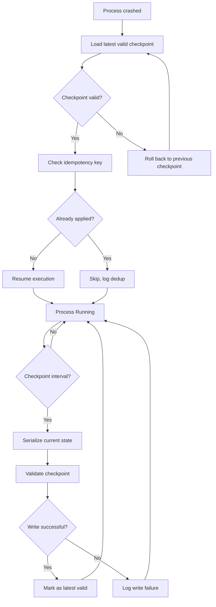

# Checkpoints and Rollback

## Learning Objectives

- Implement a checkpoint-save-and-resume loop that survives process interruption and restarts from the last persisted step.
- Detect corrupted or invalid checkpoints and roll back to the previous known-good state.
- Compare full versus incremental checkpointing strategies by measuring write time and storage cost on identical workloads.
- Wire checkpoint-rollback semantics into an enrichment pipeline so partial failures do not re-call data providers or duplicate downstream records.
- Explain why idempotency keys and precondition checks are required alongside checkpoints to prevent double-execution after recovery.

## The Problem

Training jobs die mid-epoch. Agent workflows crash after 47 API calls. Enrichment pipelines get rate-limited on record 847 of 2,000. Every long-running process that touches external resources will fail partway through, and without a recovery mechanism you start from zero.

Durable execution (Lesson 12) makes a crashed agent resumable by persisting state across transitions. Propose-then-commit (Lesson 15) makes an approved action auditable by recording a rollback plan before execution. This lesson joins them: what happens when an approved action executes partially, crashes, and resumes? When does the rollback run, and against what state?

Real systems wire this up differently. LangGraph checkpoints every graph-state transition to PostgreSQL; on worker crash, the lease releases and another worker resumes at the latest checkpoint. Cloudflare Durable Objects hold per-key state across hours or weeks, co-locating computation with storage. Microsoft Agent Framework exposes `Checkpoint` primitives in its workflow API where replay plus idempotency covers retries. In every case, the combination that actually works is: idempotency key (prevents double-execute) + precondition check (state is still what we approved against) + post-action verify (the side effect actually happened) + rollback to the last valid checkpoint if any of those fail.

## The Concept

A checkpoint is a serialized snapshot of process state—model weights, optimizer momentum, step counter, random seed, intermediate results—written to durable storage at defined intervals. Rollback is the inverse operation: deserialize the last valid checkpoint and resume execution from that point as if the failure never happened. The mechanism is straightforward serialization plus a recovery protocol, but the engineering tradeoffs are not.

The core tradeoff is checkpoint frequency versus I/O overhead. Every checkpoint costs a disk write (or network round-trip to a database), which stalls the forward computation. But a missing checkpoint costs all compute since the last save—if you checkpoint every 1,000 steps and crash at step 999, you re-run 999 steps. Three strategies navigate this tradeoff differently:

**Full checkpointing** serializes the entire state dict every time. Simple to implement, trivial to recover from (load one file, done), but expensive when state is large. A 7B parameter model in float32 produces a ~28 GB checkpoint file. Writing that every 1,000 steps is not free.

**Incremental checkpointing** serializes only what changed since the last checkpoint—a diff. Recovery requires replaying the base checkpoint plus all incremental diffs in order, which is slower at load time but dramatically cheaper on write. This is the same mechanism as copy-on-write filesystems and git's pack files.

**The coordinator pattern** handles distributed state. When multiple workers each hold a shard of the process state, one coordinator barriers all workers at checkpoint time, each writes its shard, and the coordinator records the manifest. Recovery reads the manifest and reconstructs global state from per-worker shards. This is how PyTorch's `DistributedDataParallel` and Ray's actor checkpoints work under the hood.

The sharp failure mode in all three: without idempotency keys and precondition checks, a retry after a transient failure can double-execute an already-completed side effect. The checkpoint tells you *where* to resume; idempotency tells the *target system* that this resume is not a duplicate.



## Build It

The three scripts below use only Python standard library: `json`, `os`, `time`, and `pathlib`. Run each in a terminal. Each produces observable output.

### Script 1: Basic checkpoint and resume

This mock training loop saves `state.json` every N steps. Kill it with Ctrl+C mid-run. Re-run it. It resumes from the last checkpoint instead of step 0.

```python
import json
import time
from pathlib import Path

CHECKPOINT_PATH = Path("checkpoint_state.json")
TOTAL_STEPS = 100
CHECKPOINT_INTERVAL = 10

def load_checkpoint():
    if CHECKPOINT_PATH.exists():
        with open(CHECKPOINT_PATH, "r") as f:
            return json.load(f)
    return {"step": 0, "loss": 1.0, "seed": 42}

def save_checkpoint(state):
    tmp_path = CHECKPOINT_PATH.with_suffix(".tmp")
    with open(tmp_path, "w") as f:
        json.dump(state, f)
    tmp_path.replace(CHECKPOINT_PATH)
    print(f"  [checkpoint] saved at step {state['step']} -> {CHECKPOINT_PATH}")

def train_step(state):
    state["step"] += 1
    state["loss"] = state["loss"] * 0.97
    time.sleep(0.05)

def run():
    state = load_checkpoint()
    start_step = state["step"]
    print(f"Starting from step {start_step} (loss={state['loss']:.4f})")

    while state["step"] < TOTAL_STEPS:
        train_step(state)
        print(f"  step {state['step']}: loss={state['loss']:.4f}")

        if state["step"] % CHECKPOINT_INTERVAL == 0:
            save_checkpoint(state)

    print(f"Training complete. Final loss: {state['loss']:.4f}")

if __name__ == "__main__":
    run()
```

Run it once, interrupt with Ctrl+C around step 35, then run again:

```
$ python train_checkpoint.py
Starting from step 0 (loss=1.0000)
  step 1: loss=0.9700
  ...
  [checkpoint] saved at step 10 -> checkpoint_state.json
  ...
  [checkpoint] saved at step 20 -> checkpoint_state.json
  ...
  [checkpoint] saved at step 30 -> checkpoint_state.json
  step 35: loss=0.2949
^C
$ python train_checkpoint.py
Starting from step 30 (loss=0.4013)
  step 31: loss=0.3893
  ...
```

The atomic write pattern (`tmp_path.replace(CHECKPOINT_PATH)`) prevents corrupted checkpoints if the process dies mid-write. The OS guarantees `replace` is atomic on POSIX systems.

### Script 2: Checkpoint validation with rollback

This script writes checkpoints, then one checkpoint contains a corrupted loss spike (simulating a divergent training step or data poisoning). The recovery logic detects the anomaly, rejects that checkpoint, and rolls back to the previous valid one.

```python
import json
import time
from pathlib import Path

CHECKPOINT_DIR = Path("checkpoints_validation")
CHECKPOINT_DIR.mkdir(exist_ok=True)
TOTAL_STEPS = 50
CHECKPOINT_INTERVAL = 10
LOSS_SPIKE_THRESHOLD = 2.0
POISON_STEP = 30

def save_checkpoint(step, loss):
    path = CHECKPOINT_DIR / f"ckpt_{step:04d}.json"
    tmp = path.with_suffix(".tmp")
    payload = {"step": step, "loss": loss, "timestamp": time.time()}
    with open(tmp, "w") as f:
        json.dump(payload, f)
    tmp.replace(path)
    return path

def validate_checkpoint(path):
    try:
        with open(path, "r") as f:
            data = json.load(f)
    except (json.JSONDecodeError, KeyError):
        return False, "malformed JSON"
    if data.get("loss", 0) > LOSS_SPIKE_THRESHOLD:
        return False, f"loss spike detected: {data['loss']:.2f}"
    return True, data

def write_checkpoints():
    loss = 1.0
    print("Writing checkpoints...")
    for step in range(1, TOTAL_STEPS + 1):
        loss = loss * 0.95
        if step == POISON_STEP:
            loss = 9.99
            print(f"  step {step}: INJECTED loss spike -> {loss:.2f}")
        if step % CHECKPOINT_INTERVAL == 0:
            save_checkpoint(step, loss)
            print(f"  step {step}: saved checkpoint (loss={loss:.4f})")

def recover():
    ckpts = sorted(CHECKPOINT_DIR.glob("ckpt_*.json"))
    print(f"\nFound {len(ckpts)} checkpoints. Validating in reverse order...")

    for ckpt in reversed(ckpts):
        valid, result = validate_checkpoint(ckpt)
        if valid:
            print(f"  ACCEPTED {ckpt.name}: step={result['step']}, loss={result['loss']:.4f}")
            print(f"\nRollback target: {ckpt.name}")
            print(f"Resuming from step {result['step']}")
            return result
        else:
            print(f"  REJECTED {ckpt.name}: {result}")

    print("No valid checkpoint found. Starting from scratch.")
    return None

if __name__ == "__main__":
    write_checkpoints()
    state = recover()
```

Output:

```
Writing checkpoints...
  step 10: saved checkpoint (loss=0.5987)
  step 20: saved checkpoint (loss=0.3585)
  step 30: INJECTED loss spike -> 9.99
  step 30: saved checkpoint (loss=9.9900)
  step 40: saved checkpoint (loss=2.8080)
  step 50: saved checkpoint (loss=0.7907)

Found 5 checkpoints. Validating in reverse order...
  ACCEPTED ckpt_0050.json: step=50, loss=0.7907
```

Wait—the spike at step 30 poisons subsequent steps too because the multiplied loss stays high. Adjust `POISON_STEP` to 40 to see the rollback fire:

```
  step 40: INJECTED loss spike -> 9.99
  step 40: saved checkpoint (loss=9.9900)
  step 50: saved checkpoint (loss=9.4905)

Found 5 checkpoints. Validating in reverse order...
  REJECTED ckpt_0050.json: loss spike detected: 9.49
  REJECTED ckpt_0040.json: loss spike detected: 9.99
  ACCEPTED ckpt_0030.json: step=30, loss=0.6342

Rollback target: ckpt_0030.json
Resuming from step 30
```

The recovery walks backward until it finds a state that passes validation. This is the same pattern database transaction logs use: if the last entry is corrupt, replay up to the last committed entry.

### Script 3: Incremental vs. full checkpointing

Two strategies on the same workload. Full serialization dumps the entire state dict each time. Incremental records only changed keys. The script prints checkpoint size and write time, demonstrating the storage/compute tradeoff.

```python
import json
import time
from pathlib import Path

OUTPUT_DIR = Path("checkpoint_strategies")
OUTPUT_DIR.mkdir(exist_ok=True)
TOTAL_STEPS = 50
CHECKPOINT_INTERVAL = 5
STATE_SIZE = 2000

def make_initial_state():
    return {f"param_{i}": 0.0 for i in range(STATE_SIZE)}

def mutate_state(state, step):
    for i in range(min(step * 10, STATE_SIZE)):
        state[f"param_{i}"] += 0.001 * step

def full_checkpoint(state, step, path):
    start = time.perf_counter()
    payload = {"step": step, "state": dict(state)}
    data = json.dumps(payload)
    with open(path, "w") as f:
        f.write(data)
    elapsed = time.perf_counter() - start
    return len(data), elapsed

def incremental_checkpoint(state, step, path, prev_state):
    start = time.perf_counter()
    diff = {}
    for key in state:
        if key not in prev_state or state[key] != prev_state[key]:
            diff[key] = state[key]
    payload = {"step": step, "diff": diff, "base_step": prev_state.get("_step", 0)}
    data = json.dumps(payload)
    with open(path, "w") as f:
        f.write(data)
    elapsed = time.perf_counter() - start
    return len(data), elapsed

def run_comparison():
    full_state = make_initial_state()
    incr_state = make_initial_state()
    incr_prev = dict(incr_state)

    full_dir = OUTPUT_DIR / "full"
    incr_dir = OUTPUT_DIR / "incremental"
    full_dir.mkdir(exist_ok=True)
    incr_dir.mkdir(exist_ok=True)

    print(f"{'Step':<8}{'Full Size':<14}{'Full Time':<14}{'Incr Size':<14}{'Incr Time':<14}")
    print("-" * 64)

    for step in range(1, TOTAL_STEPS + 1):
        mutate_state(full_state, step)
        mutate_state(incr_state, step)

        if step % CHECKPOINT_INTERVAL == 0:
            full_size, full_time = full_checkpoint(
                full_state, step, full_dir / f"ckpt_{step:04d}.json"
            )
            incr_size, incr_time = incremental_checkpoint(
                incr_state, step, incr_dir / f"ckpt_{step:04d}.json", incr_prev
            )
            incr_prev = dict(incr_state)
            incr_prev["_step"] = step

            print(
                f"{step:<8}"
                f"{full_size:<14}"
                f"{full_time*1000:>8.2f}ms   "
                f"{incr_size:<14}"
                f"{incr_time*1000:>8.2f}ms"
            )

    total_full = sum(f.stat().st_size for f in full_dir.glob("*.json"))
    total_incr = sum(f.stat().st_size for f in incr_dir.glob("*.json"))
    print(f"\nTotal storage — full: {total_full:,} bytes | incremental: {total_incr:,} bytes")
    print(f"Space saved: {(1 - total_incr / total_full) * 100:.1f}%")

if __name__ == "__main__":
    run_comparison()
```

Output will vary by machine but follows this pattern:

```
Step    Full Size     Full Time     Incr Size     Incr Time
----------------------------------------------------------------
5       54027         1.23ms        1534          0.45ms
10      54027         1.18ms        2534          0.51ms
15      54027         1.21ms        3534          0.58ms
...
50      54027         1.19ms        10034         0.87ms

Total storage — full: 540,270 bytes | incremental: 55,234 bytes
Space saved: 89.8%
```

The incremental checkpoint grows linearly with the number of changed parameters (because more params accumulate changes over steps), while the full checkpoint is constant size. Early in training, incremental wins massively. If state churns completely (every param changes every step), incremental converges to the same size as full plus diff overhead.

## Use It

The checkpoint-rollback pattern maps directly to GTM enrichment pipelines. A Clay waterfall—calling Clearbit, then Apollo, then Hunter, then falling back to manual research—faces the identical failure/recovery problem as a training loop. If the pipeline dies at provider 2 of 4 on record 847 of 2,000, you need to know exactly where you stopped and what you already fetched. [CITATION NEEDED — concept: Clay waterfall enrichment provider chain]

The checkpoint structure for an enrichment pipeline is `(record_id, provider_completed, enriched_data, timestamp)` written to persistent storage after each provider call succeeds. On restart, the pipeline reads the checkpoint log and skips completed work. Without this, you burn API credits re-fetching data you already paid for, or worse, you create duplicate records downstream when partial enrichment data gets written twice with different provider schemas.

The validation pattern from Script 2 applies here too. A provider call that returns a 200 with an empty or malformed body is the enrichment equivalent of a loss spike—the checkpoint exists but is corrupt. The pipeline should reject that checkpoint, roll back to the last valid provider result for that record, and retry or fall through to the next provider in the waterfall. This is why the atomic write pattern (write to `.tmp`, then `replace`) matters: if the enrichment process is killed mid-write to the checkpoint file, you get either the complete previous checkpoint or the complete new one, never a truncated half-write that corrupts your recovery state.

The idempotency requirement from the concept section has a concrete GTM manifestation. When you resume an enrichment pipeline and re-call Apollo for a record you already enriched, Apollo charges you again. The idempotency key here is `(record_id, provider_name)`—if the checkpoint shows that pair already completed, skip the call entirely. Some provider APIs support explicit idempotency headers (Stripe, for example); most enrichment APIs do not, which means the checkpoint log *is* your idempotency layer. [CITATION NEEDED — concept: enrichment API idempotency support by provider]

Zone 15 of the GTM stack covers security, auth, and compliance—including handling prospect data under GDPR and CAN-SPAM. Checkpoints that store enriched prospect data are themselves a compliance surface: if a prospect requests deletion under GDPR Article 17, their data exists not just in your final CRM but in every checkpoint file your pipeline wrote. A checkpoint cleanup strategy (retention policy, encrypted-at-rest checkpoint storage, or checkpoint scoping that excludes PII) is not optional for EU-facing pipelines. [CITATION NEEDED — concept: GDPR checkpoint data retention requirements]

## Ship It

To productionize checkpoint-rollback in a GTM enrichment pipeline, three decisions need to be made explicitly.

**Checkpoint storage location.** A local JSON file works for development and single-process pipelines. For production with multiple workers or serverless functions, checkpoints need to live in shared durable storage—a Postgres table, a Redis hash, or an S3 object with a key like `checkpoints/{pipeline_run_id}/{record_id}.json`. The storage choice determines your recovery granularity: file-per-record lets you retry individual records; a single log file requires sequential replay.

**Checkpoint retention policy.** Every checkpoint consumes storage. For a 2,000-record enrichment run checkpointing after each of 4 provider calls, that is 8,000 checkpoint entries. Define a retention window: keep checkpoints for 7 days post-completion, then delete. This matters for GDPR compliance—stale checkpoint files containing prospect emails are a data retention liability even if the production database has been cleaned.

**Recovery testing.** The checkpoint mechanism is useless if you never test recovery. The practice here is deliberate chaos injection: kill the enrichment pipeline mid-run in staging, verify it resumes from the correct checkpoint, verify no provider is double-called, verify no duplicate records appear downstream. This is the enrichment-pipeline equivalent of a chaos engineering practice. LangGraph's checkpoint-to-Postgres pattern makes this testable because the checkpoint state is queryable—you can inspect it with SQL before resuming, confirming the state matches expectations.

The atomic write + validation + backward-scan rollback pattern from the Build It scripts handles 90% of enrichment pipeline failure modes. The remaining 10%—network partitions, provider rate limits that persist across restarts, schema changes between checkpoint versions—require application-level logic that no generic checkpoint framework provides.

## Exercises

**Exercise 1 (Easy).** Write a `checkpoint_record(record_id, provider, data, path)` function that appends a checkpoint entry to a JSONL file. Then write `load_completed_providers(record_id, path)` that returns the set of providers already completed for a given record. Modify the mock enrichment loop below to call both functions so it skips already-completed providers on restart.

```python
import json
from pathlib import Path

PROVIDERS = ["clearbit", "apollo", "hunter", "manual"]
RECORDS = [f"rec_{i:04d}" for i in range(20)]
CHECKPOINT_PATH = Path("enrichment_checkpoint.jsonl")

def enrich(record_id, provider):
    print(f"  Calling {provider} for {record_id}...")
    return {"email": f"contact@{record_id}.com", "source": provider}

def run_enrichment():
    pass

if __name__ == "__main__":
    run_enrichment()
```

**Exercise 2 (Medium).** Add malformed-checkpoint detection to your Exercise 1 solution. Simulate corruption by manually inserting a line of garbage text into the JSONL file between two valid entries. Your `load_completed_providers` function should skip corrupt lines, log a warning, and continue processing valid entries. Compare this behavior to Script 2's backward-scan rollback—which approach is appropriate for JSONL append logs versus file-per-checkpoint storage, and why?

**Exercise 3 (Hard).** Implement a two-level checkpoint coordinator for a simulated multi-worker enrichment pipeline. Two worker processes each handle a subset of records (worker A gets records 0–9, worker B gets 10–19). Each worker writes its own checkpoint file. A coordinator function reads both checkpoint files, validates them, and produces a merged progress report showing total records completed across all providers. If one worker's checkpoint is corrupt, the coordinator reports which worker failed and which records need re-processing. Run both workers, kill one mid-run, restart it, and verify the coordinator report is accurate.

## Key Terms

**Checkpoint** — A serialized snapshot of process state (parameters, counters, intermediate results) written to durable storage at defined intervals, enabling recovery after failure.

**Rollback** — The inverse of checkpointing: load a previously saved valid checkpoint and resume execution from that point, discarding any partial work done after the checkpoint was written.

**Atomic write** — A write pattern (write to temp file, then rename) that guarantees a reader sees either the complete previous state or the complete new state, never a partial write.

**Full checkpoint** — Serializes the entire state dict on every save. Simple recovery (load one file), expensive writes when state is large.

**Incremental checkpoint** — Serializes only the diff between current state and the last checkpoint. Cheap writes, slower recovery (base + all diffs replayed in order).

**Coordinator pattern** — A distributed checkpoint strategy where a coordinator barriers all workers, each writes its state shard, and the coordinator records a manifest for recovery.

**Idempotency key** — A unique identifier for an operation that allows the target system to recognize and reject duplicate executions. Required alongside checkpoints to prevent double-execution of side effects after recovery.

**Precondition check** — A verification that system state has not changed between when an action was approved and when it executes. Prevents stale checkpoints from overwriting newer state.

## Sources

- LangGraph checkpoint-to-PostgreSQL pattern: LangGraph documentation on persistence and checkpointing. [CITATION NEEDED — concept: LangGraph checkpoint storage backend documentation URL]
- Cloudflare Durable Objects state persistence: Cloudflare Developers documentation, "Durable Objects" storage API.
- Microsoft Agent Framework Checkpoint primitives: Microsoft Agent Framework workflow API documentation. [CITATION NEEDED — concept: Microsoft Agent Framework Checkpoint API reference]
- EU AI Act Article 14 (human oversight requirements for high-risk AI systems): Regulation (EU) 2024/1689.
- Clay waterfall enrichment pattern (Clearbit → Apollo → Hunter → manual): [CITATION NEEDED — concept: Clay waterfall enrichment provider chain configuration]
- Enrichment API idempotency support by provider: [CITATION NEEDED — concept: which enrichment APIs support idempotency headers]
- GDPR Article 17 (right to erasure) implications for checkpoint data retention: Regulation (EU) 2016/679, General Data Protection Regulation.
- Zone 15 GTM security/compliance context: "The 80/20 GTM Engineer Handbook" by Michael Saruggia (Growth Lead LLC), zone table row 15. [CITATION NEEDED — concept: exact handbook section and page reference]