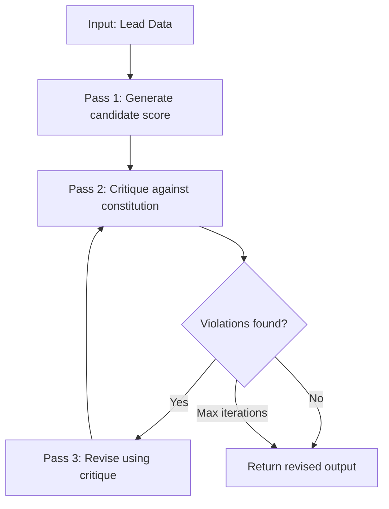

# Constitutional AI and Rule Overrides

## Learning Objectives

- Implement a three-pass constitutional AI loop (generate, critique, revise) in Python using any LLM API.
- Encode domain rules as structured constitutional rules with conditions, constraints, and priority levels.
- Build a priority-based rule override system that deterministically resolves conflicts between competing rules.
- Trace the self-correction loop across multiple iterations until violations reach zero or a max iteration count is hit.
- Apply the CAI pattern to ICP scoring and outbound compliance (CAN-SPAM, GDPR) in a GTM enrichment pipeline.

## The Problem

You asked an LLM to score a lead and it returned "10/10" for a company that sells ice to Eskimos. The model isn't broken — you didn't tell it what "good" means, and you didn't give it a mechanism to check its own work. Every prompt without an explicit evaluation loop is a coin flip wearing a system prompt.

This problem compounds at scale. You're scoring thousands of companies through an enrichment pipeline. Each one hits the model with a slightly different input shape — different industry labels, different data completeness, different edge cases your ICP document never anticipated. A single-shot prompt has no self-correction. It generates, it returns, and whatever it returns is what your sales team calls tomorrow.

Constitutional AI fixes this by forcing the model through a critique step before the output reaches production. The model generates a candidate answer, evaluates that candidate against a written set of rules, and revises based on what it finds. The rules are yours — you write them, you order them by priority, and you decide which ones can override others. The model's job is to apply them honestly, not to invent its own judgment.

## The Concept

Constitutional AI (CAI) is a self-correction loop: generate a candidate response, critique that response against a fixed set of rules, then revise the response based on the critique. Anthropic developed the technique for safety alignment — the original 2022 paper (Bai et al.) trained models to be harmless via self-critique and reinforcement learning from AI feedback (RLAIF) against a constitution. The 2026 Claude Constitution extends this to a 79-page document with a four-tier priority hierarchy: safety first, then ethics, then organizational guidelines, then helpfulness.

The mechanism is portable. You do not need Anthropic's 79-page safety constitution to use CAI — any structured set of rules can serve as the constitution. In a GTM context, your ICP definition is a constitution. Your CAN-SPAM compliance checklist is a constitution. Your lead routing logic is a constitution. The pattern is the same: write rules, let the model check its output against them, use the revised version.

Rule overrides are the escape hatch within this system. Not all rules are equal — some are hard prohibitions that never yield (like "do not contact someone on a DNC list"), and others are soft defaults that can be superseded by higher-priority conditions (like "prefer companies over 50 employees, unless they're Fortune 500"). Priority ordering makes conflict resolution deterministic rather than relying on the model's fuzzy judgment about which rule matters more.



The diagram shows the loop as it runs in practice. The critique pass is the key mechanism — the model receives both its candidate output and the full rule set, then produces a structured critique identifying which rules were violated and how. The revision pass consumes that critique and produces a corrected output. If you let the loop repeat, the model re-critiques its own revision until it finds zero violations or hits a iteration cap you set.

## Build It

Here is a complete CAI loop in Python. It uses OpenAI's API but the pattern works with any chat-completion endpoint. The code defines constitutional rules as data structures, runs the three-pass loop, and prints every intermediate step so you can see the self-correction happening.

```python
import json
from openai import OpenAI

client = OpenAI()

CONSTITUTION = [
    {
        "id": "R1",
        "priority": 1,
        "condition": "company is on the Fortune 500 list",
        "constraint": "score must be at least 8 regardless of other criteria",
        "override": True,
    },
    {
        "id": "R2",
        "priority": 2,
        "condition": "employee_count < 10",
        "constraint": "score must not exceed 4 unless overridden by a priority-1 rule",
        "override": False,
    },
    {
        "id": "R3",
        "priority": 3,
        "condition": "industry is in target list [saas, fintech, cybersecurity, devtools]",
        "constraint": "score should reflect industry fit on a 1-10 scale",
        "override": False,
    },
    {
        "id": "R4",
        "priority": 2,
        "condition": "revenue < 1_000_000",
        "constraint": "score must not exceed 5 unless overridden by a priority-1 rule",
        "override": False,
    },
]

COMPANY = {
    "name": "Acme Corp",
    "industry": "saas",
    "employee_count": 8,
    "revenue": 800000,
    "fortune_500": False,
}

SYSTEM_PROMPT = "You are a lead scoring assistant. Score companies 1-10 based on ICP fit."

def call_llm(messages, temperature=0.3):
    resp = client.chat.completions.create(
        model="gpt-4o",
        messages=messages,
        temperature=temperature,
    )
    return resp.choices[0].message.content

def generate_candidate(company):
    messages = [
        {"role": "system", "content": SYSTEM_PROMPT},
        {"role": "user", "content": f"Score this company 1-10. Return JSON with 'score' and 'reasoning'.\n\n{json.dumps(company, indent=2)}"},
    ]
    return call_llm(messages, temperature=0.5)

def critique_candidate(candidate, company, constitution):
    rules_text = json.dumps(constitution, indent=2)
    messages = [
        {"role": "system", "content": "You are a rule evaluator. Check the candidate against the constitution. For each rule, state whether it was violated and why."},
        {"role": "user", "content": f"Company:\n{json.dumps(company, indent=2)}\n\nConstitution:\n{rules_text}\n\nCandidate:\n{candidate}\n\nReturn JSON with 'violations' (list of rule IDs violated) and 'critique' (explanation)."},
    ]
    return call_llm(messages, temperature=0.0)

def revise_candidate(candidate, critique, company, constitution):
    rules_text = json.dumps(constitution, indent=2)
    messages = [
        {"role": "system", "content": SYSTEM_PROMPT},
        {"role": "user", "content": f"Company:\n{json.dumps(company, indent=2)}\n\nConstitution:\n{rules_text}\n\nOriginal candidate:\n{candidate}\n\nCritique:\n{critique}\n\nRevise the candidate to fix all violations. Return JSON with 'score' and 'reasoning'."},
    ]
    return call_llm(messages, temperature=0.1)

candidate = generate_candidate(COMPANY)
print("=== PASS 1: CANDIDATE ===")
print(candidate)

critique = critique_candidate(candidate, COMPANY, CONSTITUTION)
print("\n=== PASS 2: CRITIQUE ===")
print(critique)

revised = revise_candidate(candidate, critique, COMPANY, CONSTITUTION)
print("\n=== PASS 3: REVISED ===")
print(revised)
```

Run this and you'll see three distinct outputs. The candidate pass typically produces a score based on surface signals (SaaS industry = good). The critique pass identifies that R2 (employee_count < 10) and R4 (revenue < 1M) were both violated — the original score exceeded the ceiling those rules impose. The revision adjusts the score downward and explains why, citing the specific rules.

Now let's add the priority override system. This is deterministic Python — no model judgment involved in conflict resolution. The override resolver runs before the LLM critique, so the model knows which rules are suppressed:

```python
def resolve_overrides(constitution, company):
    active_rules = list(constitution)
    triggered_overrides = []
    for rule in constitution:
        if rule.get("override") and rule_applies(rule, company):
            for other in active_rules:
                if other["id"] != rule["id"] and other["priority"] > rule["priority"]:
                    triggered_overrides.append(
                        f"{rule['id']} (priority {rule['priority']}) suppresses {other['id']} (priority {other['priority']})"
                    )
    active_ids = {r["id"] for r in active_rules} - {
        t.split("suppresses ")[1].split(" ")[0] for t in triggered_overrides
    }
    active_rules = [r for r in active_rules if r["id"] in active_ids]
    return active_rules, triggered_overrides

def rule_applies(rule, company):
    if rule["id"] == "R1":
        return company.get("fortune_500", False)
    if rule["id"] == "R2":
        return company["employee_count"] < 10
    if rule["id"] == "R3":
        return company["industry"] in ["saas", "fintech", "cybersecurity", "devtools"]
    if rule["id"] == "R4":
        return company["revenue"] < 1_000_000
    return False

FORTUNE_500_COMPANY = {
    "name": "MegaCorp",
    "industry": "manufacturing",
    "employee_count": 5,
    "revenue": 500000,
    "fortune_500": True,
}

active, overrides = resolve_overrides(CONSTITUTION, FORTUNE_500_COMPANY)
print(f"Active rules: {[r['id'] for r in active]}")
print(f"Overrides triggered: {overrides}")
```

When you run this with the Fortune 500 company, R1 (priority 1) triggers and suppresses R2 and R4 (both priority 2). The model receives only the active rules — R1 and R3 — in its critique pass. The override is resolved in code, not left to the model to infer. This is the difference between deterministic rule resolution and prompt-time wishful thinking.

## Use It

The CAI loop maps directly to ICP scoring in a Clay enrichment waterfall. When you write a lead scoring formula in Clay, you're encoding rules — "if industry is SaaS and employee count > 50, score 8." Constitutional AI gives you a mechanism to enforce those rules at inference time rather than trusting a single-shot prompt to respect them. The constitution is your ICP definition document, translated into structured rules with priorities.

In practice, you build this as an enrichment column in Clay that calls an AI endpoint (via Clay's HTTP API integration or a webhook to your own service). The endpoint runs the three-pass loop: the candidate pass generates a score, the critique pass checks it against your ICP rules, and the revision pass returns the corrected score. The result that lands in Clay is the revised output, not the raw candidate. Rule overrides handle the tier exceptions that every ICP document has — "Fortune 500 companies bypass employee count requirements" is a priority-1 override suppressing a priority-2 constraint.

The same pattern applies to outbound compliance, which sits in Zone 15 of the GTM stack alongside webhook auth and data handling [CITATION NEEDED — concept: Zone 15 mapping to outbound compliance enforcement via CAI]. CAN-SPAM requires a physical address in every commercial email. GDPR requires a lawful basis for processing prospect data. These are not suggestions — they are hard constraints with legal consequences. Encoding them as priority-1 constitutional rules with `override: False` means the critique pass will flag any candidate email copy that omits the postal address, and the revision pass will add it before the content reaches your sequencer. The constitution makes compliance a structural property of the generation pipeline, not a manual review step someone forgets to do on a Friday afternoon.

Here's a compliance-focused constitution in production shape:

```python
COMPLIANCE_CONSTITUTION = [
    {
        "id": "C1",
        "priority": 1,
        "condition": "always",
        "constraint": "email must include a valid physical mailing address",
        "override": False,
    },
    {
        "id": "C2",
        "priority": 1,
        "condition": "recipient domain is .eu or prospect is in EU/UK",
        "constraint": "email must reference GDPR lawful basis and include opt-out mechanism",
        "override": False,
    },
    {
        "id": "C3",
        "priority": 2,
        "condition": "always",
        "constraint": "subject line must not contain misleading claims about the sender identity",
        "override": False,
    },
    {
        "id": "C4",
        "priority": 3,
        "condition": "send_time is between 9am and 5pm recipient local",
        "constraint": "prefer concise subject lines under 50 characters",
        "override": True,
    },
]

EMAIL_DRAFT = {
    "subject": "URGENT: Your account requires immediate verification",
    "body": "Hi {first_name}, I noticed you might be interested in our platform. Want to chat next week?",
    "recipient": "sjobs@apple.eu",
    "has_address": False,
    "has_opt_out": False,
}

def check_compliance(email, constitution):
    violations = []
    for rule in constitution:
        if rule["id"] == "C1" and not email["has_address"]:
            violations.append(("C1", "No physical mailing address found in email body"))
        if rule["id"] == "C2" and ".eu" in email["recipient"]:
            if not email["has_opt_out"]:
                violations.append(("C2", "EU recipient but no opt-out mechanism present"))
            violations.append(("C2", "EU recipient but no GDPR lawful basis referenced"))
        if rule["id"] == "C3" and "URGENT" in email["subject"].upper():
            violations.append(("C3", "Subject line uses urgency framing that may mislead about sender identity"))
    return violations

violations = check_compliance(EMAIL_DRAFT, COMPLIANCE_CONSTITUTION)
print(f"Compliance violations found: {len(violations)}")
for rule_id, reason in violations:
    print(f"  [{rule_id}] {reason}")
```

This prints three violations: missing address, missing GDPR basis/opt-out, and misleading subject line. In a full CAI pipeline, these violations feed into the revision prompt and the model rewrites the email to fix all three before it reaches your sequencing tool.

## Ship It

Shipping a CAI loop into production means deciding where it runs, how fast it runs, and what happens when it fails. Three LLM calls per company is expensive — at 10,000 enriched rows per week, you're making 30,000 API calls for scoring alone. The practical answer is selective invocation: run the candidate pass on every row, run the critique pass only when the candidate score crosses a threshold that warrants verification, and run the revision pass only when the critique finds violations. Most rows pass the candidate pass cleanly and never enter the loop.

The override resolver — the deterministic Python function — should run as a pre-filter before any LLM call. If a company triggers a priority-1 override (Fortune 500, strategic account list, executive referral), you can assign the score directly without calling the model at all. This is the cheapest and fastest path: hard rules resolved in code, soft rules resolved through the CAI loop. In Clay, this maps to a conditional formula column that checks override conditions first, then routes to the AI enrichment column only for rows that need model evaluation.

For compliance, the CAI loop should run as a webhook interceptor between your copy generation step and your sequencer (Smartlead, Salesloft, whatever you use). The sequencer sends a draft email to your webhook; your service runs the compliance constitution against it; if violations are found, the revision pass rewrites and returns the clean version; if no violations, the original passes through untouched. This adds latency — typically 3-8 seconds for the full three-pass loop — so you batch it rather than running it per-email at send time. Generate copy in bulk, run the compliance CAI loop in batch, then push cleaned copy to the sequencer.

The failure mode to watch for is critique degradation. The critique pass uses temperature 0.0 because it needs to be deterministic, but even at zero temperature, models occasionally hallucinate rule violations that don't exist or miss violations that do. You handle this with a violation log: every time the critique pass flags a violation, log the rule ID, the input, the candidate, and the critique text. Review the log weekly. If the critique is flagging R2 on companies with 500 employees, your rule condition encoding is wrong and the model is confused. If it's missing R4 violations on sub-$1M revenue companies, you may need to make the rule constraint more explicit in the prompt. The constitution is a living document — you revise it based on what the log tells you about the model's actual behavior.

## Exercises

**Easy:** Write a 3-rule constitution for ICP scoring (industry fit, company size, revenue). Run the CAI loop on three sample companies — one that passes cleanly, one that violates one rule, and one that violates two. Print the candidate, critique, and revised output for each. Verify that the revision pass fixed the violations the critique identified.

**Medium:** Add priority levels and an override rule to your constitution. Create a company profile that violates two priority-2 rules but triggers a priority-1 override (e.g., strategic account). Run the override resolver to show which rules are suppressed, then run the CAI loop with only the active rules. Print the override decisions and the final score. Confirm that the priority-1 override produces a higher score than the same company would get without the override.

**Hard:** Implement a multi-pass CAI loop that re-critiques its own revision until zero violations remain or 3 iterations elapse. For each iteration, print the candidate, the violations found, and the revised output. Test it with a company that initially violates 3 rules. Track whether the violation count decreases monotonically across iterations or whether the revision sometimes introduces new violations while fixing old ones. Print a final summary table showing iteration number, violation count, and which rules were violated.

## Key Terms

**Constitutional AI (CAI):** A self-correction pattern where an LLM generates a candidate response, critiques it against a fixed set of rules, and revises it based on the critique. Originally from Anthropic (Bai et al., 2022) for safety alignment; portable to any domain.

**Constitution:** The structured set of rules the model evaluates its output against. Each rule has a condition (when it applies), a constraint (what it requires), and a priority (ordering for conflict resolution).

**Rule Override:** A rule with elevated priority that suppresses lower-priority rules when triggered. Resolved deterministically in code before the LLM critique pass — the model never sees suppressed rules.

**Critique Pass:** The second step in the CAI loop. The model receives its candidate output plus the active constitution and produces a structured list of violations with explanations.

**Revision Pass:** The third step in the CAI loop. The model rewrites the candidate to fix all identified violations, producing the output that reaches production.

**Priority Hierarchy:** A numbered ordering of rules where lower numbers win conflicts. Anthropic's 2026 Constitution uses four tiers (safety, ethics, guidelines, helpfulness). A GTM constitution might use three (legal compliance, ICP fit, optimization).

## Sources

- Bai, Y. et al. (2022). "Constitutional AI: Harmlessness from AI Feedback." Anthropic. — Original CAI paper establishing the generate-critique-revise loop with RLAIF training.
- Anthropic (2026). "Claude Constitution." CC0 licensed, 79 pages. — Four-tier priority hierarchy, reason-based alignment, hardcoded prohibitions vs. soft-coded defaults.
- Anthropic (2023). "Collective Constitutional AI: Aligning a Language Model with Public Input." — Participatory experiment showing ~50% divergence between public-sourced and corporate principles.
- [CITATION NEEDED — concept: Zone 15 GTM cluster mapping to outbound security/compliance enforcement via constitutional AI]
- Saruggia, M. (2025). "The 80/20 GTM Engineer Handbook." Growth Lead LLC. — GTM stack zones, enrichment waterfalls, multichannel execution foundations.