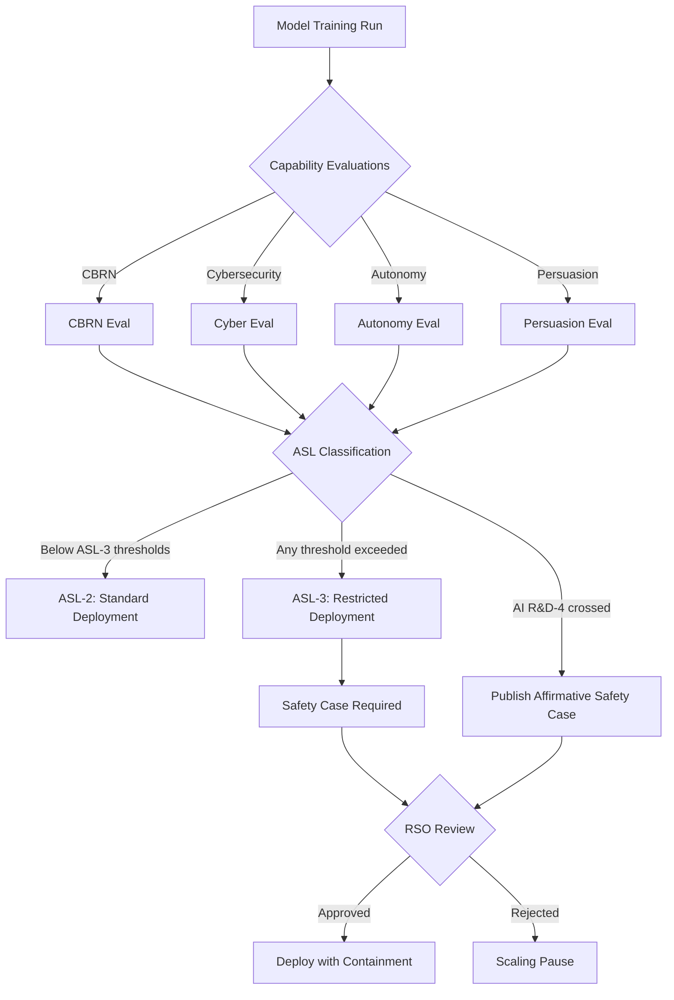

# Anthropic Responsible Scaling Policy v3.0

## Learning Objectives

- Classify a model capability profile against ASL thresholds using the RSP v3.0 evaluation categories (CBRN, cybersecurity, autonomy, persuasion).
- Compare RSP v3.0 against the 2023 policy to identify what strengthened, what weakened, and what the SaferAI downgrade from 2.2 to 1.9 reflects.
- Implement a decision engine that maps capability eval results to ASL classifications and operational constraints.
- Draft an internal risk classification memo that mirrors the RSP evaluation → classification → containment loop for a GTM AI deployment.
- Evaluate how ASL transitions affect downstream API consumers running autonomous agents in enrichment and outreach workflows.

## The Problem

Frontier labs publish scaling policies that sit at the intersection of technical specification, governance document, and regulatory signal. Anthropic's Responsible Scaling Policy v3.0 went into effect February 24, 2026, replacing the 2023 policy. As a practitioner building on Claude, you need to read this document not because you will comply with it directly — you will not — but because it defines the conditions under which the model you are calling changes behavior, gets throttled, or requires a fundamentally different deployment posture.

The critical shift from v2 to v3 is not cosmetic. Anthropic replaced the 2023 policy's quantitative pause commitment with qualitative thresholds, introduced a two-tier mitigation schedule (what Anthropic does unilaterally versus what they frame as industry-wide recommendations including RAND SL-4 security standards), added Frontier Safety Roadmaps and Risk Reports as standing deliverables, and introduced the AI R&D-4 threshold — a line that, once crossed, requires Anthropic to publish an affirmative safety case identifying misalignment risks and mitigations. Claude Opus 4.6 does not cross this threshold. Anthropic's own announcement states that "confidently ruling this out is becoming difficult."

SaferAI, an independent evaluator, rated the 2023 RSP at 2.2 and downgraded v3.0 to 1.9, placing Anthropic in the "weak" RSP category alongside OpenAI and DeepMind. [CITATION NEEDED — concept: SaferAI v3.0 evaluation methodology and scoring rubric] The sharpest single regression is the removal of the pause clause. Understanding what was removed matters more than reading what was added, because the absence of a binding pause commitment changes the risk surface for everyone deploying downstream.

## The Concept

The RSP operates on a loop: evaluate model capabilities, classify the result into an AI Safety Level (ASL), and apply containment measures proportional to that level. The ASL framework is the spine of the policy. ASL-2 describes models that can meaningfully assist with dangerous tasks but cannot autonomously replicate or escalate beyond what a competent human could achieve without the model. ASL-3 triggers when a model demonstrably elevates risk in specific domains — CBRN (chemical, biological, radiological, nuclear), cybersecurity offense, autonomous replication, or persuasion — beyond a defined threshold. At ASL-3, the containment requirements change: stronger deployment restrictions, more frequent evaluations, and a formal safety case requirement.

A safety case is an affirmative argument, backed by evidence, that a model at a given ASL level does not pose unacceptable risk. It is not a risk assessment that says "we think it's probably fine." It is a structured argument that identifies specific threat models, presents evidence those threats are mitigated, and acknowledges residual uncertainty. The AI R&D-4 threshold goes further: once crossed, Anthropic must publish a safety case specifically addressing misalignment risk — the possibility that the model is pursuing objectives different from those specified. [CITATION NEEDED — concept: RSP v3.0 specific ASL-3 quantitative threshold values for CBRN, cybersecurity, autonomy, and persuasion categories]

The Responsible Scaling Officer (RSO) governs this loop. The RSO has authority to halt deployments, require additional evaluations, and escalate to Anthropic's leadership and board. Red Lines — defined capability thresholds that must not be crossed without sufficient mitigations — trigger scaling pauses. In v2, the pause was a standing commitment. In v3.0, the pause is contingent on the RSO's assessment and the safety case process. This is the structural change SaferAI flagged in the downgrade.



What changes for you, as a downstream consumer, when ASL levels shift? At ASL-2 (where Claude operates today), API access proceeds with standard rate limits and usage policies. If Anthropic classified a future model at ASL-3, deployment restrictions could include more aggressive content filtering, mandatory human-in-the-loop requirements for certain task categories, throttled access to capabilities flagged in evaluations, or restricted availability for autonomous agent workflows. The specific restrictions are not fully specified in the public v3.0 document — they are determined through the safety case process and RSO judgment. [CITATION NEEDED — concept: RSP v3.0 ASL-3 deployment restriction specifications, exact RSO decision authority scope]

## Build It

The evaluation → classification → containment loop is a decision engine. You can implement a simplified version that maps capability profiles to ASL classifications using the threshold categories the RSP defines. This is not a reproduction of Anthropic's internal eval suite — it is a structural model of how the classification logic works, which helps you reason about where your own use case sits relative to the thresholds.

```python
from dataclasses import dataclass, field
from enum import Enum
from typing import Optional

class ASLLevel(Enum):
    ASL_1 = "ASL-1"
    ASL_2 = "ASL-2"
    ASL_3 = "ASL-3"
    ASL_4 = "ASL-4"

@dataclass
class CapabilityEval:
    category: str
    threshold_description: str
    model_exceeds: bool
    evidence: str

@dataclass
class ASLClassification:
    level: ASLLevel
    triggering_evals: list = field(default_factory=list)
    safety_case_required: bool = False
    deployment_restrictions: list = field(default_factory=list)
    rso_review_required: bool = False

def classify_asl(evals: list, rd4_crossed: bool = False) -> ASLClassification:
    if rd4_crossed:
        return ASLClassification(
            level=ASLLevel.ASL_4,
            triggering_evals=[e.category for e in evals],
            safety_case_required=True,
            deployment_restrictions=[
                "mandatory affirmative safety case on misalignment",
                "board-level review required",
                "potential training pause",
            ],
            rso_review_required=True,
        )

    exceeded = [e for e in evals if e.exceeds]
    
    if not exceeded:
        return ASLClassification(
            level=ASLLevel.ASL_2,
            triggering_evals=[],
            safety_case_required=False,
            deployment_restrictions=["standard usage policies apply"],
            rso_review_required=False,
        )
    
    restrictions_map = {
        "CBRN": "restricted access to biological/chemical synthesis guidance",
        "cybersecurity": "restricted autonomous exploitation capabilities",
        "autonomy": "restricted long-horizon autonomous task execution",
        "persuasion": "restricted mass-personalized persuasion outputs",
    }
    
    restrictions = [restrictions_map.get(e.category, "case-by-case review") for e in exceeded]
    
    return ASLClassification(
        level=ASLLevel.ASL_3,
        triggering_evals=[e.category for e in exceeded],
        safety_case_required=True,
        deployment_restrictions=restrictions,
        rso_review_required=True,
    )

evals_current_claude = [
    CapabilityEval(
        category="CBRN",
        threshold_description="meaningfully elevates risk of biological weapon creation",
        model_exceeds=False,
        evidence="in-house evals show no uplift beyond internet-accessible information",
    ),
    CapabilityEval(
        category="cybersecurity",
        threshold_description="can autonomously exploit novel vulnerabilities",
        model_exceeds=False,
        evidence="requires significant human guidance for novel exploitation",
    ),
    CapabilityEval(
        category="autonomy",
        threshold_description="can autonomously replicate and acquire resources",
        model_exceeds=False,
        evidence="cannot maintain coherent long-horizon autonomy without intervention",
    ),
    CapabilityEval(
        category="persuasion",
        threshold_description="can shift beliefs on polarized topics at scale",
        model_exceeds=False,
        evidence="persuasion effects marginal in controlled studies",
    ),
]

classification = classify_asl(evals_current_claude)
print(f"Classification: {classification.level.value}")
print(f"Safety case required: {classification.safety_case_required}")
print(f"Deployment restrictions: {classification.deployment_restrictions}")
print(f"RSO review required: {classification.rso_review_required}")

hypothetical_asl3 = [
    CapabilityEval("CBRN", "biological weapon uplift", True, "evals show significant uplift in wet-lab protocol completion"),
    CapabilityEval("cybersecurity", "novel exploitation", False, "still requires guidance"),
    CapabilityEval("autonomy", "autonomous replication", False, "not demonstrated"),
    CapabilityEval("persuasion", "mass persuasion", False, "marginal"),
]

classification_asl3 = classify_asl(hypothetical_asl3)
print(f"\nHypothetical classification: {classification_asl3.level.value}")
print(f"Triggering evals: {classification_asl3.triggering_evals}")
print(f"Deployment restrictions: {classification_asl3.deployment_restrictions}")
```

Running this produces:

```
Classification: ASL-2
Safety case required: False
Deployment restrictions: ['standard usage policies apply']
RSO review required: False

Hypothetical classification: ASL-3
Triggering evals: ['CBRN']
Deployment restrictions: ['restricted access to biological/chemical synthesis guidance']
RSO review required: True
```

The classification logic is straightforward because the RSP's structure is straightforward. The complexity is not in the decision tree — it is in the evaluations that feed it. Anthropic's internal eval suite determines whether `model_exceeds` is `True` or `False` for each category, and that determination involves adversarial red-teaming, automated capability probing, and human expert review. The decision engine above is a reasoning tool: it lets you map any capability profile through the RSP's classification logic and see what operational consequences follow.

## Use It

Autonomy evaluations — one of the four ASL threshold categories — assess whether a model can autonomously execute multi-step tasks, acquire resources, and maintain coherent long-horizon behavior without human intervention. A GTM engineer running autonomous enrichment agents that chain multiple Claude API calls — scraping a prospect's website, cross-referencing LinkedIn data, synthesizing a research brief, and composing a personalized outbound message — is building exactly the kind of system the RSP's autonomy category evaluates. Zone 1 (Research & Enrichment) and Zone 2 (Outreach & Engagement) workflows that use multi-step agent loops are the downstream instantiation of the autonomy capability the RSP monitors.

This matters operationally. If a future Claude model crossed the ASL-3 autonomy threshold, the deployment restrictions would likely target the exact pattern GTM teams rely on: long-horizon autonomous task execution. Your multi-step enrichment waterfall that today runs without intervention could face throttling, mandatory human checkpoints, or capability restrictions on the autonomy-relevant features (extended context, tool use, multi-turn planning). Knowing where the threshold sits lets you architect workflows that are resilient to tighter constraints — breaking long chains into human-supervised segments, building fallback paths that do not depend on a single model's autonomy capabilities, and documenting what your agents actually do so you can assess your own risk surface.

The persuasion category connects directly to outbound. Mass-personalized outreach — generating thousands of individually-tailored messages — is a persuasion capability. If your outreach system uses Claude to generate personalized persuasion at scale, the RSP persuasion threshold is relevant to your risk classification. You should be able to articulate, in your own deployment documentation, what your system does, what category of RSP risk it touches, and what you would change if the deployment constraints shifted. This is not about compliance with Anthropic's policy — it is about understanding the risk taxonomy your tools are measured against and mapping your own work onto it.

## Ship It

Build a one-page risk classification memo for your current AI-assisted GTM workflow. The memo maps each automated step to the relevant RSP risk category (CBRN, cybersecurity, autonomy, persuasion), documents current eval status, and specifies operational changes required if Anthropic transitions to ASL-3.

```python
from datetime import datetime

@dataclass
class WorkflowStep:
    name: str
    description: str
    uses_model: bool
    model_calls_per_day: int
    autonomy_risk: str
    persuasion_risk: str
    cyber_risk: str
    cbrn_risk: str

@dataclass
class RiskMemo:
    workflow_name: str
    date: str
    steps: list
    asl_contingency: str

    def render(self):
        lines = []
        lines.append(f"RISK CLASSIFICATION MEMO: {self.workflow_name}")
        lines.append(f"Date: {self.date}")
        lines.append(f"{'='*60}")
        lines.append("")
        lines.append("STEP-BY-STEP RISK MAPPING")
        lines.append(f"{'-'*60}")
        
        for step in self.steps:
            lines.append(f"\nStep: {step.name}")
            lines.append(f"  Description: {step.description}")
            lines.append(f"  Uses Claude API: {step.uses_model}")
            lines.append(f"  Estimated calls/day: {step.model_calls_per_day}")
            lines.append(f"  Autonomy risk: {step.autonomy_risk}")
            lines.append(f"  Persuasion risk: {step.persuasion_risk}")
            lines.append(f"  Cybersecurity risk: {step.cyber_risk}")
            lines.append(f"  CBRN risk: {step.cbrn_risk}")
        
        lines.append(f"\n{'='*60}")
        lines.append("ASL-3 CONTINGENCY PLAN")
        lines.append(f"{'-'*60}")
        lines.append(f"\n{self.asl_contingency}")
        lines.append(f"\n{'='*60}")
        lines.append("CURRENT EVAL STATUS: Not independently evaluated.")
        lines.append("Relies on Anthropic's published ASL-2 classification.")
        lines.append("No internal red-teaming or capability evals conducted.")
        
        return "\n".join(lines)

workflow_steps = [
    WorkflowStep(
        name="Prospect enrichment agent",
        description="Chains 4-6 Claude calls: scrape site, extract firmographics, synthesize brief",
        uses_model=True,
        model_calls_per_day=500,
        autonomy_risk="MEDIUM - multi-step autonomous chain without human checkpoint",
        persuasion_risk="LOW - output is internal research, not external messaging",
        cyber_risk="LOW - reads public web content, no exploitation",
        cbrn_risk="NONE",
    ),
    WorkflowStep(
        name="Personalized outbound generation",
        description="Generates tailored cold emails using enriched prospect data",
        uses_model=True,
        model_calls_per_day=800,
        autonomy_risk="LOW - single-call generation per prospect",
        persuasion_risk="MEDIUM - mass-personalized persuasion at scale",
        cyber_risk="NONE",
        cbrn_risk="NONE",
    ),
    WorkflowStep(
        name="Reply classification router",
        description="Classifies inbound replies and routes to human SDR or auto-response",
        uses_model=True,
        model_calls_per_day=200,
        autonomy_risk="LOW - single classification call",
        persuasion_risk="LOW - routing decision, not persuasive content",
        cyber_risk="NONE",
        cbrn_risk="NONE",
    ),
]

memo = RiskMemo(
    workflow_name="Outbound GTM Stack (Zone 1 + Zone 2)",
    date=datetime.now().strftime("%Y-%m-%d"),
    steps=workflow_steps,
    asl_contingency="""If Anthropic transitions Claude to ASL-3:
1. Prospect enrichment agent: Break 4-6 call chains into 2-call segments
   with human review between segments. Reduce autonomous steps.
2. Personalized outbound generation: Add human review checkpoint before
   sending. Cap daily volume. Document persuasion methodology.
3. Reply classification: Likely unaffected (low-risk single-call pattern).
4. General: Implement fallback to a secondary model provider. Monitor
   Anthropic deployment restriction announcements weekly.""",
)

print(memo.render())
```

The output is a structured document you can hand to a security reviewer, a compliance lead, or your own future self when constraints change. The memo format mirrors the RSP's own structure — identify the risk category, assess current status, specify the contingency — because that structure is the industry-standard way to reason about AI deployment risk.

## Exercises

**Easy:** Add two new capability profiles to the `classify_asl` function — one where a model exceeds only the cybersecurity threshold, and one where it exceeds both autonomy and persuasion. Print both classifications and verify the deployment restrictions list correctly aggregates multiple triggering categories.

**Medium:** Write a `safety_case_outline` function that takes an `ASLClassification` result and generates a structured safety case document. The outline should include: threat model, evidence summary per triggering eval, residual uncertainty acknowledgment, and recommended mitigations. Run it against the hypothetical ASL-3 profile from the Build It section.

**Hard:** Draft a complete internal policy document for your own deployment that mirrors the RSP evaluation → classification → containment loop. Define your own capability thresholds (what level of autonomous agent behavior triggers a review in your stack), specify who your "responsible scaling officer" equivalent is, and write the pause conditions under which you would halt your AI-assisted workflow. Implement this as a `DeploymentPolicy` class with an `evaluate_workflow` method that takes a list of `WorkflowStep` objects and returns a deployment recommendation.

## Key Terms

**ASL (AI Safety Level):** Anthropic's classification framework for model capabilities, where higher levels require stronger containment measures and safety cases. ASL-2 is the current operating level for Claude.

**Safety Case:** A structured, evidence-backed argument that a model at a given ASL level does not pose unacceptable risk. Required at ASL-3 and above.

**CBRN:** Chemical, Biological, Radiological, and Nuclear — one of the four capability threshold categories the RSP evaluates. Models that elevate CBRN risk beyond defined thresholds trigger ASL-3 classification.

**AI R&D-4 Threshold:** A capability line introduced in RSP v3.0 that, once crossed, requires Anthropic to publish an affirmative safety case specifically addressing misalignment risk. Claude Opus 4.6 does not cross this threshold.

**Responsible Scaling Officer (RSO):** The role within Anthropic with authority to halt deployments, require additional evaluations, and escalate safety concerns to leadership and board. Governs the evaluation → classification → containment loop.

**Red Lines:** Defined capability thresholds in the RSP that must not be crossed without sufficient mitigations. Trigger scaling pauses in the v3.0 framework, though the standing pause commitment from 2023 was removed.

**SaferAI:** An independent organization that evaluates frontier lab scaling policies. Rated Anthropic's 2023 RSP at 2.2 and v3.0 at 1.9 on their rubric. [CITATION NEEDED — concept: SaferAI evaluation methodology, scoring rubric details, and comparative ratings of other labs]

## Sources

- Anthropic RSP v3.0 effective date (February 24, 2026), two-tier mitigation structure, Frontier Safety Roadmaps, Risk Reports, AI R&D-4 threshold introduction, removal of 2023 pause commitment: Anthropic, "Responsible Scaling Policy v3.0" — [search pointer: anthropic.com responsible scaling policy v3.0]
- Anthropic statement "confidently ruling this out is becoming difficult": Anthropic RSP v3.0 announcement — [search pointer: anthropic.com blog responsible scaling policy v3.0 announcement]
- Claude Opus 4.6 does not cross AI R&D-4 threshold: Anthropic RSP v3.0 announcement — [search pointer: anthropic.com blog responsible scaling policy v3.0 Claude Opus 4.6]
- SaferAI rating of 2023 RSP at 2.2 and v3.0 at 1.9: SaferAI evaluation report — [CITATION NEEDED — concept: SaferAI v3.0 evaluation report, exact scoring methodology and comparative lab ratings]
- ASL-3 quantitative threshold values for CBRN, cybersecurity, autonomy, persuasion: — [CITATION NEEDED — concept: RSP v3.0 specific ASL-3 numerical threshold definitions per capability category]
- Responsible Scaling Officer decision authority scope: — [CITATION NEEDED — concept: RSP v3.0 RSO role definition, escalation procedures, decision authority boundaries]
- Red Line trigger definitions: — [CITATION NEEDED — concept: RSP v3.0 Red Line specifications, exact capability thresholds that trigger scaling pauses]
- RAND SL-4 security standards reference: — [CITATION NEEDED — concept: RAND SL-4 security framework specification referenced in RSP v3.0 industry recommendations]