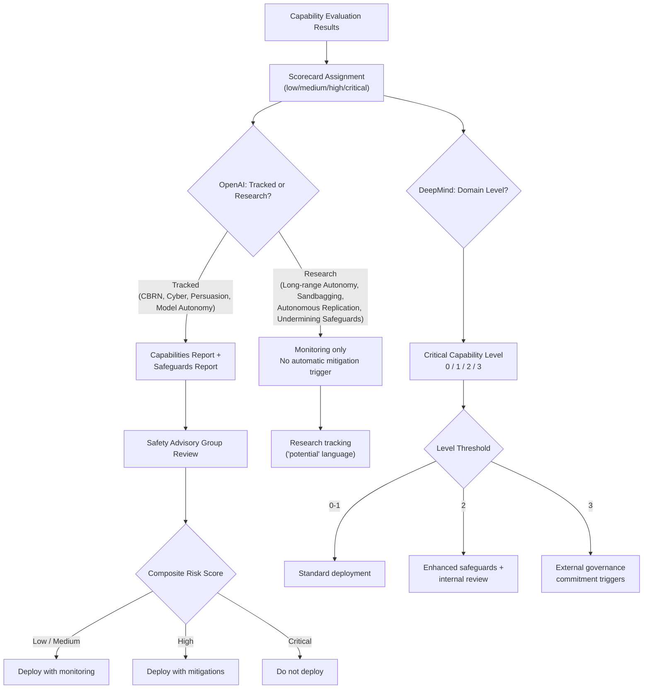

# OpenAI Preparedness Framework and DeepMind Frontier Safety Framework

## Learning Objectives

1. Compare the governance mechanisms shared by OpenAI's Preparedness Framework v2 and DeepMind's Frontier Safety Framework v3, identifying where they converge and diverge in category structure and escalation triggers.
2. Implement a risk scorecard that aggregates per-category capability evaluations into a composite risk level using the four-level taxonomy both frameworks share.
3. Build a threshold function that maps evaluation results to DeepMind's Critical Capability Levels and outputs the required safety governance tier.
4. Map framework risk categories to fields common in enterprise AI vendor security questionnaires.
5. Evaluate where the two frameworks disagree on required governance actions for identical evaluation results.

## The Problem

Two of the three organizations capable of training frontier models — OpenAI and Google DeepMind — published their internal safety governance structures within months of each other. Anthropic published its Responsible Scaling Policy first (covered in Lesson 19), and OpenAI and DeepMind followed with frameworks that address the same core question: when should a frontier lab gate or pause a model release based on measured capabilities? These are not marketing documents. They encode specific, testable claims about how to measure and contain model risk, and those claims have mechanical structure you can inspect.

The three documents converge on a small set of risk categories — cyber, CBRN (chemical, biological, radiological, nuclear), persuasion, and autonomy — and they diverge in ways that matter for anyone building or buying AI systems. OpenAI's Preparedness Framework v2 (April 2025) splits its categories into "Tracked" (which trigger mandatory mitigations) and "Research" (which do not). DeepMind's Frontier Safety Framework v3 (September 2025, with Tracked Capability Levels added April 17, 2026) folds autonomy into its ML R&D and Cyber domains rather than naming it as a standalone category, and ties its capability levels to an externally committed Responsible Scaling Policy.

You will evaluate those structures on their mechanics. When a framework says a capability "triggers" a mitigation, what does that mean operationally? When it says a category is "Research" only, what is actually binding? The answer is less dramatic than the press releases suggest, and more useful for practitioners who need to reason about model risk in production.

## The Concept

Both frameworks share four mechanisms despite using different vocabulary. First, they define **capability evaluation thresholds** — measurable performance levels on specific tests (cyber offensive tasks, biological knowledge retrieval, autonomous task completion) that trigger governance actions when crossed. Second, they maintain **risk categorization taxonomies** that sort capabilities into named buckets: CBRN, cybersecurity, persuasion, and autonomy appear across all three labs' frameworks. Third, they use **scorecard-based tracking** with defined score levels — typically a four-point scale of low, medium, high, and critical — that aggregates per-category evaluations into a composite assessment. Fourth, they specify **escalation protocols** that bind engineering teams to deployment decisions based on those scores, preventing ad-hoc ship-or-hold judgments.

The frameworks diverge on two axes. OpenAI's Preparedness Framework v2 distinguishes Tracked Categories — which include CBRN, Cybersecurity, Persuasion, and Model Autonomy — from Research Categories, which include Long-range Autonomy, Sandbagging, Autonomous Replication and Adaptation, and Undermining Safeguards. Tracked Categories produce both a Capabilities Report and a Safeguards Report reviewed by the Safety Advisory Group. Research Categories do not automatically trigger mitigations; the policy language is explicitly "potential," meaning the team monitors but does not bind deployment decisions to those findings. This is a meaningful distinction: a model that shows early signs of sandbagging (selectively performing worse on evals it suspects are evals) falls under Research, not Tracked, so the governance machinery does not automatically engage.

DeepMind's FSF v3 takes a different structural approach. Rather than splitting categories by mandatory-vs-optional tracking, it folds autonomy into its ML R&D and Cyber domains — defining ML R&D autonomy level 1 as the ability to "fully automate the AI R&D pipeline at competitive cost vs human + AI tools." It also explicitly addresses deceptive alignment through automated monitoring for what it calls instrumental-reasoning misuse, though the framework itself acknowledges this monitoring "will not remain sufficient long-term" if instrumental reasoning capabilities strengthen. DeepMind ties its capability levels to an external Responsible Scaling Policy commitment, whereas OpenAI's Safety Advisory Group operates as an internal escalation body.



The diagram shows the parallel decision pipelines. Both frameworks start from the same input — capability evaluation results — and both produce a governance decision. The paths diverge at the categorization step: OpenAI sorts into Tracked vs Research, while DeepMind assigns domain-specific capability levels. The binding force also differs: OpenAI's Safety Advisory Group can recommend but the framework's commitment to act is internal, while DeepMind's levels are tied to externally published Responsible Scaling Policy thresholds that the company has committed to in public filings and government dialogues.

One honest caveat for both: the evaluation methodology itself is not fully specified in either document. Both frameworks describe *what* to measure (categories and thresholds) without fully describing *how* to measure it (specific eval suites, pass/fail criteria, statistical confidence). A practitioner reading these documents should treat the scorecard structure as real and the specific threshold calibrations as works in progress.

## Build It

The mechanical core of both frameworks is a function that takes capability evaluation results and produces a governance decision. You will build that function in two stages: first an OpenAI-style risk scorecard with category aggregation, then a DeepMind-style capability-level classifier with threshold-based safety tier assignment.

```python
from enum import Enum
from dataclasses import dataclass, field
from typing import Dict, List, Optional

class RiskLevel(Enum):
    LOW = 1
    MEDIUM = 2
    HIGH = 3
    CRITICAL = 4

OPENAI_TRACKED_CATEGORIES = [
    "CBRN",
    "Cybersecurity",
    "Persuasion",
    "Model Autonomy",
]

OPENAI_RESEARCH_CATEGORIES = [
    "Long-range Autonomy",
    "Sandbagging",
    "Autonomous Replication and Adaptation",
    "Undermining Safeguards",
]

DEEPMIND_DOMAINS = [
    "ML R&D",
    "Cyber Offense",
    "CBRN Knowledge",
    "Persuasion and Deception",
]

@dataclass
class OpenAIScorecard:
    model_name: str
    tracked_scores: Dict[str, RiskLevel] = field(default_factory=dict)
    research_scores: Dict[str, RiskLevel] = field(default_factory=dict)

    def add_tracked(self, category: str, level: RiskLevel):
        if category not in OPENAI_TRACKED_CATEGORIES:
            raise ValueError(f"Unknown tracked category: {category}")
        self.tracked_scores[category] = level

    def add_research(self, category: str, level: RiskLevel):
        if category not in OPENAI_RESEARCH_CATEGORIES:
            raise ValueError(f"Unknown research category: {category}")
        self.research_scores[category] = level

    def composite_tracked_score(self) -> RiskLevel:
        if not self.tracked_scores:
            return RiskLevel.LOW
        return max(self.tracked_scores.values(), key=lambda r: r.value)

    def triggers_mitigation(self, category: str) -> bool:
        return category in self.tracked_scores

    def summary(self) -> str:
        lines = [f"=== OpenAI Preparedness Scorecard: {self.model_name} ==="]
        lines.append("\n  TRACKED CATEGORIES (trigger mitigations):")
        for cat in OPENAI_TRACKED_CATEGORIES:
            level = self.tracked_scores.get(cat, RiskLevel.LOW)
            lines.append(f"    {cat:.<40} {level.name}")
        lines.append(f"\n  COMPOSITE TRACKED SCORE: {self.composite_tracked_score().name}")
        lines.append("\n  RESEARCH CATEGORIES (no automatic trigger):")
        for cat in OPENAI_RESEARCH_CATEGORIES:
            level = self.research_scores.get(cat)
            label = level.name if level else "not evaluated"
            lines.append(f"    {cat:.<40} {label}")
        return "\n".join(lines)


scorecard = OpenAIScorecard(model_name="frontier-model-v1")
scorecard.add_tracked("CBRN", RiskLevel.MEDIUM)
scorecard.add_tracked("Cybersecurity", RiskLevel.LOW)
scorecard.add_tracked("Persuasion", RiskLevel.MEDIUM)
scorecard.add_tracked("Model Autonomy", RiskLevel.LOW)
scorecard.add_research("Sandbagging", RiskLevel.MEDIUM)
scorecard.add_research("Long-range Autonomy", RiskLevel.HIGH)

print(scorecard.summary())
print()

scorecard.tracked_scores["CBRN"] = RiskLevel.CRITICAL
print("--- After CBRN eval upgrades from MEDIUM to CRITICAL ---")
print(scorecard.summary())
```

Run that and you will see the composite score shift from MEDIUM to CRITICAL when a single category changes. That shift is the mechanism: the composite is a max-function, not an average, which means one critical category dominates the governance decision regardless of how benign the other categories are.

Now implement DeepMind's capability-level classification as a separate threshold function:

```python
class DeepMindCapabilityLevel(Enum):
    LEVEL_0 = 0
    LEVEL_1 = 1
    LEVEL_2 = 2
    LEVEL_3 = 3

LEVEL_DESCRIPTIONS = {
    DeepMindCapabilityLevel.LEVEL_0: "Standard deployment, no additional safety requirements",
    DeepMindCapabilityLevel.LEVEL_1: "Enhanced evaluation, standard safeguards sufficient",
    DeepMindCapabilityLevel.LEVEL_2: "Requires enhanced safeguards and internal governance review",
    DeepMindCapabilityLevel.LEVEL_3: "Triggers external RSP commitments and critical governance",
}

def classify_deepmind_level(domain_evals: Dict[str, RiskLevel]) -> DeepMindCapabilityLevel:
    if not domain_evals:
        return DeepMindCapabilityLevel.LEVEL_0
    
    max_risk = max(domain_evals.values(), key=lambda r: r.value)
    
    if max_risk == RiskLevel.CRITICAL:
        return DeepMindCapabilityLevel.LEVEL_3
    elif max_risk == RiskLevel.HIGH:
        return DeepMindCapabilityLevel.LEVEL_2
    elif max_risk == RiskLevel.MEDIUM:
        return DeepMindCapabilityLevel.LEVEL_1
    else:
        return DeepMindCapabilityLevel.LEVEL_0

deepmind_evals = {
    "ML R&D": RiskLevel.MEDIUM,
    "Cyber Offense": RiskLevel.LOW,
    "CBRN Knowledge": RiskLevel.LOW,
    "Persuasion and Deception": RiskLevel.MEDIUM,
}

level = classify_deepmind_level(deepmind_evals)
print(f"DeepMind Capability Level: {level.name}")
print(f"Required Action: {LEVEL_DESCRIPTIONS[level]}")
print()

deepmind_evals["ML R&D"] = RiskLevel.HIGH
level = classify_deepmind_level(deepmind_evals)
print("After ML R&D eval upgrades to HIGH:")
print(f"DeepMind Capability Level: {level.name}")
print(f"Required Action: {LEVEL_DESCRIPTIONS[level]}")
```

Both functions share the same aggregation logic — max across categories — but the frameworks label the output differently. OpenAI produces a risk level that routes to an internal Safety Advisory Group. DeepMind produces a capability level that triggers external RSP commitments. The code makes the structural similarity visible: the math is identical, the governance wrapper is not.

## Use It

Both frameworks define the vocabulary and risk categories that enterprise buyers reference when they evaluate AI-powered tools in procurement due diligence. The capability evaluation thresholds that OpenAI and DeepMind use internally — CBRN, cybersecurity, persuasion, autonomy — surface in simplified form in the vendor security questionnaires that any practitioner shipping a model-based product will encounter. When a prospect's security team asks whether your AI system can operate without human oversight, they are asking about the autonomy category. When they ask whether your system can generate content designed to manipulate behavior, they are asking about persuasion. The frameworks give you a structured way to answer.

The four-level risk taxonomy (low/medium/high/critical) maps to the tiered risk assessments that enterprise security reviews expect. If you can classify your product's actual capabilities against these categories and produce a scorecard, you have a document that speaks the same language as the buyer's security team. This is not about compliance theater — it is about answering the question "what can your model actually do, and what are you doing about it?" in a format that both sides can evaluate mechanically.

```python
VENDOR_QUESTIONNAIRE_MAPPING = {
    "CBRN": {
        "question_fields": [
            "Does the system provide actionable instructions for synthesis of harmful biological or chemical agents?",
            "Does the system provide step-by-step guidance for weapons fabrication?",
        ],
        "framework_category": "CBRN (both OpenAI Tracked + DeepMind domain)",
        "acceptable_threshold": RiskLevel.LOW,
    },
    "Cybersecurity": {
        "question_fields": [
            "Can the system identify or exploit software vulnerabilities autonomously?",
            "Does the system provide offensive security tooling beyond standard defensive guidance?",
        ],
        "framework_category": "Cybersecurity (OpenAI Tracked) / Cyber Offense (DeepMind)",
        "acceptable_threshold": RiskLevel.LOW,
    },
    "Persuasion": {
        "question_fields": [
            "Does the system generate personalized content designed to change user beliefs or behavior?",
            "Can the system conduct autonomous influence operations at scale?",
        ],
        "framework_category": "Persuasion (OpenAI Tracked) / Persuasion and Deception (DeepMind)",
        "acceptable_threshold": RiskLevel.MEDIUM,
    },
    "Model Autonomy": {
        "question_fields": [
            "Can the system execute multi-step tasks without human confirmation of each step?",
            "Does the system have the ability to create accounts, make purchases, or modify external systems?",
        ],
        "framework_category": "Model Autonomy (OpenAI Tracked) / ML R&D autonomy (DeepMind)",
        "acceptable_threshold": RiskLevel.MEDIUM,
    },
}

def generate_vendor_report(scorecard: OpenAIScorecard) -> str:
    lines = ["=== Enterprise Vendor Security Report ==="]
    lines.append(f"Product: {scorecard.model_name}")
    lines.append(f"Framework basis: OpenAI Preparedness Framework v2 taxonomy\n")
    
    for category, mapping in VENDOR_QUESTIONNAIRE_MAPPING.items():
        eval_level = scorecard.tracked_scores.get(category, RiskLevel.LOW)
        threshold = mapping["acceptable_threshold"]
        status = "PASS" if eval_level.value <= threshold.value else "REVIEW REQUIRED"
        
        lines.append(f"  {category}")
        lines.append(f"    Eval result: {eval_level.name}")
        lines.append(f"    Enterprise threshold: {threshold.name}")
        lines.append(f"    Status: {status}")
        lines.append(f"    Buyer questions:")
        for q in mapping["question_fields"]:
            lines.append(f"      - {q}")
        lines.append("")
    
    return "\n".join(lines)

scorecard2 = OpenAIScorecard(model_name="gtm-copilot-v2")
scorecard2.add_tracked("CBRN", RiskLevel.LOW)
scorecard2.add_tracked("Cybersecurity", RiskLevel.LOW)
scorecard2.add_tracked("Persuasion", RiskLevel.MEDIUM)
scorecard2.add_tracked("Model Autonomy", RiskLevel.HIGH)

print(generate_vendor_report(scorecard2))
```

The Model Autonomy score of HIGH triggers "REVIEW REQUIRED" because it exceeds the enterprise threshold of MEDIUM. That is the same mechanism the lab frameworks use — a threshold breach changes the governance posture — applied to a buyer-seller context instead of an internal deployment decision. When your GTM stack includes AI tools that take autonomous actions (sending emails, updating CRM records, enriching data), the autonomy category is where a