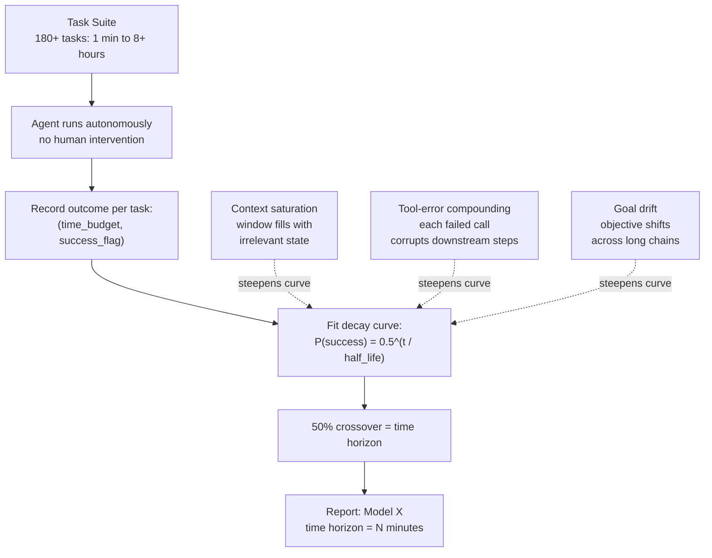

# METR Time Horizons and External Capability Evaluation

## Learning Objectives

- Compute a time horizon half-life from synthetic task-completion data using exponential decay curve fitting
- Compare internal evaluation metrics (loss, perplexity, benchmark accuracy) against external task-completion evaluation in real tool-using environments
- Simulate the three failure modes that collapse agent time horizons: context saturation, tool-error compounding, and goal drift
- Instrument a GTM outbound agent with time horizon logging to determine the maximum autonomous run length before human review is required
- Interpret a published time horizon as an upper bound on deployment capability, not a deployment prediction

## The Problem

An agent that drafts a single cold email flawlessly and then falls apart on its tenth sequential research-and-write task is not reliable for production GTM workflows. The question is not whether the model can perform a task — it is how long the model can sustain coherent, multi-step task execution before the probability of success drops below a usable threshold. Scaling policies, deployment decisions, and human-in-the-loop checkpoint placement all depend on this number, yet most teams do not measure it.

Internal metrics — training loss, perplexity, benchmark accuracy on static question sets — do not answer this question. A model can have low perplexity and still fail at a 20-minute autonomous research task because it loses track of the objective at step 12, calls a tool with the wrong arguments at step 15, and produces a syntactically valid but semantically wrong deliverable at step 20. Internal metrics measure token-level quality. Autonomous agent success depends on trajectory-level quality, which degrades through mechanisms that token-level metrics cannot detect.

METR (Model Evaluation & Threat Research, formerly ARC Evals) is the 501(c)(3) evaluation organization that has produced the most widely cited attempt at this measurement. Their Time Horizon methodology compresses agent capability into a single scalar: the amount of time an expert human would spend on a task at which the agent succeeds 50% of the time. This number — the time horizon — is the headline artifact from METR's evaluations of frontier models, including pre-release access to GPT-class systems under NDA with labs. The methodology is not perfect, and METR has documented the gap between evaluation conditions and real deployment conditions. But it is the best available external measurement framework for answering: how long can this agent work before it fails?

## The Concept

A time horizon curve plots task-success probability against autonomous execution time. The curve typically follows an exponential decay: short tasks succeed at high rates, long tasks succeed at progressively lower rates, and there is a characteristic half-life at which success probability crosses 50%. METR's published methodology fits a logistic curve to success probability as a function of log(expert human completion time) rather than linear time, but the core mechanism is the same — task success decays as a function of sustained work duration, and the decay rate is the capability signal.

Three failure modes drive the decay, and each has a distinct signature. Context window saturation occurs when the agent's working memory fills with accumulated tool outputs, intermediate reasoning, and stale context from earlier steps. The agent does not run out of tokens in a single call — it runs out of useful attention budget across a long trajectory, causing it to reference outdated information or repeat already-completed steps. Tool-error compounding is multiplicative: if each tool call has an independent 2% error rate, a 20-step task has a 33% cumulative probability of at least one critical tool failure,