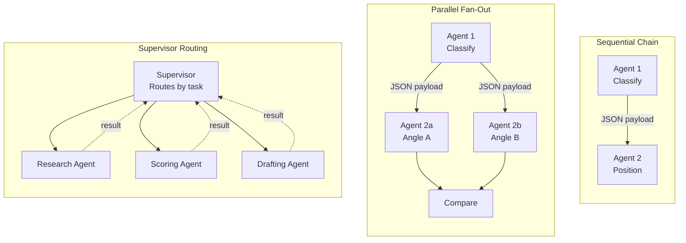

# Why Multi-Agent?

## Learning Objectives

1. Compare single-agent versus multi-agent execution on a task with three distinct responsibility boundaries, measuring where each approach succeeds and fails.
2. Diagram the flow of a sequential multi-agent chain and identify the exact state that must pass between agents at each boundary.
3. Evaluate when multi-agent architecture adds overhead rather than value, using latency budgets and failure-mode analysis.
4. Implement a two-agent sequential chain where Agent 1 produces structured JSON that Agent 2 consumes without modification.

## The Problem

You built a single agent. It reads files, calls APIs, reasons about results. Then you point it at a real task: research a company, classify its industry, score buying intent, and draft personalized outreach — all in one prompt. The agent chokes. Not because the LLM is dumb, but because you have asked one reasoning loop to hold four jobs simultaneously.

The failure shows up in three places. First, **context rot**: by the time the agent reaches the outreach-drafting step, it has forgotten the specific details it found during research 40 tool calls ago. The context window is full of intermediate noise. Second, **role confusion**: the system prompt says "you are a researcher and a copywriter and an analyst," and the model produces research-quality outreach and outreach-quality research — neither good. Third, **sequential bottleneck**: everything runs in one loop, one step at a time, even when the research and scoring steps are independent and could run concurrently.

These are not hypothetical failures. Write a prompt that asks for company research, ICP scoring, and email drafting in a single call. Run it ten times on the same input. You will see inconsistent structure in the output, sections that contradict each other (the research says "enterprise fintech" but the email pitches SMB features), and a total wall-clock time that compounds because the model must reason through every step sequentially within a single response. The single-agent ceiling is a structural problem, not a prompt-engineering problem.

## The Concept

Three mechanisms distinguish multi-agent architecture from "just calling the API three times":

**Task decomposition** splits work along responsibility boundaries, not arbitrary token counts. A responsibility boundary exists when one step's output format, success criteria, and reasoning style differ fundamentally from the next. Research produces structured findings; outreach produces persuasive prose. Splitting there is not stylistic preference — it is the point where a single system prompt stops serving both jobs well.

**Agent autonomy** means each agent owns its prompt, its tool set, and its stop condition. Agent 1 terminates when it has produced a valid JSON classification. Agent 2 terminates when it has generated a positioning sentence. Neither agent knows about the other's internal reasoning. The only thing they share is the handoff payload — a structured data contract at the boundary.

**Orchestration topology** defines how agents connect. The three primary patterns:



Each pattern trades differently. Sequential chains minimize complexity but maximize latency — every agent waits for the previous one. Parallel fan-out reduces wall-clock time but requires a merge step that can produce conflicting outputs. Supervisor routing adds flexibility but introduces a single point of failure: if the supervisor misroutes, the wrong agent runs.

Underneath all three patterns, each individual agent runs the same primitive: a ReAct loop (Reason → Act → Observe → repeat until stop condition). Multi-agent architecture does not replace this loop. It sits above it, defining which loops run, in what order, and what data passes between them. The orchestration layer is the only new thing; the agents themselves are the same ReAct loops you built in single-agent work.

The decision to go multi-agent is a tradeoff analysis, not a default. Multi-agent adds boundary contracts you must design, latency you must budget for, and failure modes that propagate across agents. Use it when the responsibility boundaries are real and the single-agent ceiling is concrete — not when a longer prompt would solve the problem.

## Build It

Build a two-agent sequential chain with no framework — direct function calls, explicit state passing, observable output at every boundary. Agent 1 classifies a company's industry into structured JSON. Agent 2 consumes that JSON and generates a positioning angle. The chain exposes the handoff payload so you can see the contract between agents.

```python
import json

def mock_llm(system_prompt, user_prompt):
    if "classification agent" in system_prompt.lower():
        if "stripe" in user_prompt.lower():
            return json.dumps({
                "company": "Stripe",
                "industry": "Fintech / Payment Infrastructure",
                "segment": "B2B Platform",
                "company_size": "Enterprise"
            })
        if "notion" in user_prompt.lower():
            return json.dumps({
                "company": "Notion",
                "industry": "Productivity / Collaboration Software",
                "segment": "B2B SaaS",
                "company_size": "Mid-Market"
            })
        return '{"company": "Unknown", "industry": "Unknown", "segment": "Unknown", "company_size": "Unknown"}'

    if "positioning agent" in system_prompt.lower():
        data = json.loads(user_prompt)
        return f"For {data['company']} ({data['industry']}): pitch {data['segment']} teams on reducing infrastructure maintenance overhead."

    return ""


AGENT1_PROMPT = """You are an industry classification agent. Given a company description, output ONLY a JSON object with keys: company, industry, segment, company_size. No prose."""

AGENT2_PROMPT = """You are a positioning agent. Given a JSON industry classification, output a one-sentence positioning angle for outbound outreach."""


def agent_1_classify(description):
    raw = mock_llm(AGENT1_PROMPT, description)
    print(f"[Agent 1 raw output]")
    print(raw)
    print()
    try:
        parsed = json.loads(raw)
        return parsed, None
    except json.JSONDecodeError as e:
        return None, f"Malformed JSON at boundary: {e}"


def agent_2_position(classification_json):
    raw = mock_llm(AGENT2_PROMPT, json.dumps(classification_json))
    print(f"[Agent 2 raw output]")
    print(raw)
    print()
    return raw


def run_two_agent_chain(description):
    print("=" * 60)
    print(f"INPUT: {description}")
    print("=" * 60)
    print()

    classification, error = agent_1_classify(description)
    if error:
        print(f"CHAIN BROKEN AT BOUNDARY: {error}")
        print("Agent 2 never runs. Failure is isolated to Agent 1's output contract.")
        print()
        return None

    print("[Handoff payload passed to Agent 2]")
    print(json.dumps(classification, indent=2))
    print()

    positioning = agent_2_position(classification)

    print("[Final output]")
    print(positioning)
    print()
    return positioning


run_two_agent_chain("Stripe is a technology company that builds economic infrastructure for the internet.")
run_two_agent_chain("Notion is an all-in-one workspace for notes, docs, and project management.")

print("=" * 60)
print("FAILURE CASE: Agent 1 returns malformed JSON")
print("=" * 60)
print()

malformed_output = '{"company": "Stripe", "industry": "Fintech'
print(f"[Agent 1 raw output]")
print(malformed_output)
print()

try:
    json.loads(malformed_output)
except json.JSONDecodeError as e:
    print(f"CHAIN BROKEN AT BOUNDARY: Malformed JSON at boundary: {e}")
    print("Agent 2 never executes. The handoff contract is violated.")
```

Run this and you see three things. First, the happy path: Agent 1 produces clean JSON, the handoff payload is visible, Agent 2 consumes it and produces a positioning sentence. Second, the same chain works for a different company — the contract holds because the JSON schema is the interface, not free text. Third, the failure case: Agent 1 returns truncated JSON, and the chain breaks immediately at the boundary. Agent 2 never runs.

That last point is the teachable moment. The failure is isolated, diagnosable, and fixable. You know exactly which agent failed, what it produced, and where the contract broke. In a single-agent monolith doing all four jobs, the same failure manifests as subtly wrong output that you cannot trace to a specific step.

## Use It

Task decomposition — the multi-agent pattern of splitting work along responsibility boundaries — is the mechanism behind enrichment waterfalls in GTM tooling. Clay implements a waterfall where each step is an agent that owns one data source lookup and passes a structured company record forward. The first agent checks source A. If a field is missing, the second agent fills the gap from source B. The third resolves conflicts or fills remaining gaps. [CITATION NEEDED — concept: Clay waterfall enrichment step architecture and state-passing mechanism]

Build a minimal enrichment waterfall with three agents, each simulating a different data provider. The company record is a dictionary that grows as each agent fills missing fields:

```python
import json
import copy