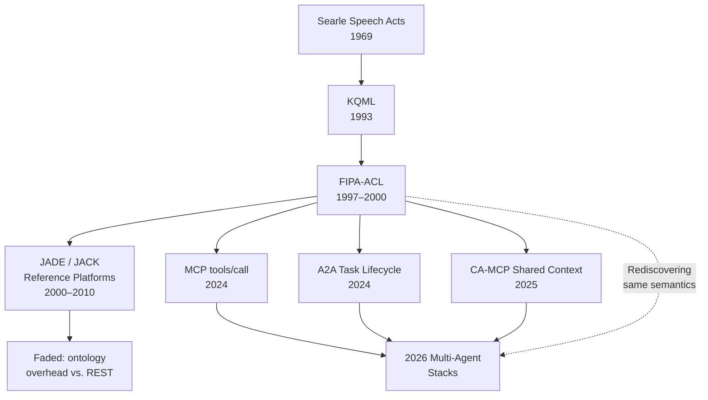

# Heritage of FIPA-ACL and Speech Acts

## Learning Objectives

1. Classify FIPA-ACL performatives into their Searlean speech-act category (assertive, directive, commissive, declarative, expressive).
2. Parse and construct valid FIPA-ACL message envelopes containing sender, receiver, performative, content, language, and ontology fields.
3. Trace a Contract Net negotiation through its full performative sequence from `cfp` through `accept-proposal` to `inform-done`.
4. Implement a conversation-state validator that accepts valid `request → agree → inform-done` sequences and rejects out-of-order messages.
5. Compare raw JSON message exchange against ACL-style performative semantics in the context of multi-agent GTM workflow orchestration.

## The Problem

You have been writing prompts that treat LLMs as text-in, text-out boxes. That works when a single model answers a single question. It breaks the moment two agents need to coordinate—negotiating over a task, delegating work, confirming completion, or rejecting a proposal. The failure mode is silent: Agent A sends JSON to Agent B. Agent B interprets it as a suggestion. Agent A intended it as a commitment. The pipeline stalls, and debugging reveals that nobody agreed on what the message *meant*, only what it *said*.

This is not a new problem. In 1962, J.L. Austin pointed out that human language works the same way: utterances do not merely describe the world, they *act on* it. When you say "I promise to call you back," you are not describing a future call—you are creating an obligation. John Searle formalized this into five categories of speech acts in 1969: assertives (claiming truth), directives (requesting action), commissives (committing to future action), declarations (changing institutional state), and expressives (revearing psychological state). Every coordinated system that uses language—human or machine—needs this layer of intent above the layer of content.

The 2026 agent-protocol landscape is rediscovering this layer under new names. MCP defines `tools/call` with a response schema. A2A defines task lifecycle states. CA-MCP defines shared context stores. Each spec announces itself as foundational. The honest read is that most of them are walking a decision tree that the Foundation for Intelligent Physical Agents (FIPA) mapped out in 1997 and ratified in 2000: twenty performatives, two content languages, interaction protocols for contract-net and subscribe-notify. The effort faded around 2010 because the ontology overhead was too heavy for the web era and REST won. But the LLM-driven revival of multi-agent systems is quietly reimplementing the same semantics—JSON contracts stand in for performatives, natural language stands in for ontologies—without the formal guarantees that made the original spec useful.

## The Concept

A speech act has three layers: the locution (what was said), the illocution (what was intended), and the perlocution (what effect it had). When Agent A sends `{"action": "enrich", "company": "Acme"}` to Agent B, the locution is the JSON payload. The illocution is ambiguous: is this a request? A command? A proposal? A notification of work already done? The perlocution—whether Agent B actually enriches anything—depends entirely on resolving that ambiguity. FIPA-ACL solved this by making the illocution explicit through a field called the *performative*: a controlled vocabulary of communicative acts that leaves no room for interpretation.

A FIPA-ACL message is an envelope with mandatory and optional fields. The mandatory fields are `sender`, `receiver`, `performative`, and `content`. The optional fields include `language` (how to interpret the content, e.g., FIPA-SL0), `ontology` (the vocabulary the content refers to), `conversation-id` (to thread messages into conversations), `reply-with` and `in-reply-to` (for request-response correlation), and `protocol` (which interaction protocol governs the conversation). The performative is drawn from a fixed set: `inform`, `request`, `query-ref`, `propose`, `accept-proposal`, `reject-proposal`, `agree`, `refuse`, `confirm`, `disconfirm`, `cfp`, `subscribe`, `cancel`, and others. Each performative has defined preconditions and postconditions—what must be true for the sender to legitimately issue it, and what the receiver is entitled to infer.



The interaction protocols are where performative sequencing becomes conversation management. The FIPA-Request protocol defines a strict sequence: the initiator sends `request`, the participant responds with `agree` or `refuse`, and if agreeing, follows with `inform-done` or `failure`. The Contract Net Protocol is richer: the initiator broadcasts a `cfp` (call for proposals), participants respond with `propose` or `refuse`, the initiator selects winners with `accept-proposal` and rejects the rest with `reject-proposal`, and winners eventually report `inform-done` or `failure`. Each state transition has defined legal next-states. A message that violates the sequence is not just unexpected—it is semantically invalid, like a chess player moving a pawn backward.

```python
PERFORMATIVES = {
    "inform":         {"searle": "assertive",  "commits_speaker": False, "expects_action": False},
    "confirm":        {"searle": "assertive",  "commits_speaker": False, "expects_action": False},
    "disconfirm":     {"searle": "assertive",  "commits_speaker": False, "expects_action": False},
    "request":        {"searle": "directive",  "commits_speaker": False, "expects_action": True},
    "query-ref":      {"searle": "directive",  "commits_speaker": False, "expects_action": True},
    "propose":        {"searle": "commissive", "commits_speaker": True,  "expects_action": False},
    "agree":          {"searle": "commissive", "commits_speaker": True,  "expects_action": False},
    "accept-proposal":{"searle": "commissive", "commits_speaker": True,  "expects_action": False},
    "refuse":         {"searle": "commissive", "commits_speaker": True,  "expects_action": False},
    "reject-proposal":{"searle": "assertive",  "commits_speaker": False, "expects_action": False},
    "cfp":            {"searle": "directive",  "commits_speaker": False, "expects_action": True},
    "subscribe":      {"searle": "directive",  "commits_speaker": False, "expects_action": True},
    "cancel":         {"searle": "directive",  "commits_speaker": False, "expects_action": True},
    "not-understood": {"searle": "assertive",  "commits_speaker": False, "expects_action": False},
    "failure":        {"searle": "assertive",  "commits_speaker": False, "expects_action": False},
}

categories = {}
for perf, meta in PERFORMATIVES.items():
    cat = meta["searle"]
    categories.setdefault(cat, []).append(perf)

for cat, perfs in sorted(categories.items()):
    print(f"{cat:15s} → {', '.join(perfs)}")

print()
print(f"Total performatives: {len(PERFORMATIVES)}")
print(f"Categories: {len(categories)}")
```

Running this prints the full classification. Note that `reject-proposal` is assertive, not commissive—the sender is making a claim about the proposal's acceptability, not committing to anything. `refuse` is commissive because the sender is committing *not* to perform the requested action, which is itself a binding declaration. These distinctions matter when you build validators: an agent that sends `agree` followed by `refuse` has contradicted itself at the semantic level, even if both messages are individually well-formed.

## Build It

A FIPA-ACL message is a dictionary with required fields and optional envelope metadata. Building a parser means enforcing the required fields, validating the performative against the controlled vocabulary, and making the speech-act classification available for downstream logic. This is the same envelope structure that every modern agent protocol reimplements—MCP wraps it inside JSON-RPC, A2A wraps it inside HTTP task objects—but FIPA-ACL names the semantics explicitly instead of burying them in prose documentation.

```python
import json

VALID_PERFORMATIVES = {
    "accept-proposal", "agree", "cancel", "cfp", "confirm",
    "disconfirm", "failure", "inform", "not-understood",
    "propose", "query-if", "query-ref", "refuse",
    "reject-proposal", "request", "request-when", "subscribe",
}

REQUIRED_FIELDS = {"sender", "receiver", "performative", "content"}
OPTIONAL_FIELDS = {
    "language", "ontology", "conversation-id",
    "reply-with", "in-reply-to", "protocol", "reply-by",
}

SEARLE_MAP = {
    "assertive":  {"inform", "confirm", "disconfirm",
                   "reject-proposal", "not-understood", "failure"},
    "directive":  {"request", "query-ref", "query-if", "cfp",
                   "subscribe", "cancel", "request-when"},
    "commissive": {"propose", "agree", "accept-proposal", "refuse"},
}

def classify_performative(performative):
    for category, perfs in SEARLE_MAP.items():
        if performative in perfs:
            return category
    return "unclassified"

def parse_acl_message(raw):
    if isinstance(raw, str):
        msg = json.loads(raw)
    else:
        msg = raw

    missing = REQUIRED_FIELDS - set(msg.keys())
    if missing:
        raise ValueError(f"Missing required fields: {missing}")

    unknown = set(msg.keys()) - REQUIRED_FIELDS - OPTIONAL_FIELDS
    if unknown:
        raise ValueError(f"Unknown fields: {unknown}")

    perf = msg["performative"]
    if perf not in VALID_PERFORMATIVES:
        raise ValueError(f"Invalid performative: {perf}")

    return {
        "valid": True,
        "sender": msg["sender"],
        "receiver": msg["receiver"],
        "performative": perf,
        "speech_act": classify_performative(perf),
        "content": msg["content"],
        "conversation_id": msg.get("conversation-id", "unassigned"),
        "protocol": msg.get("protocol", "none"),
    }

message = {
    "sender": "agent://enrichment-orchestrator",
    "receiver": "agent://apollo-provider",
    "performative": "request",
    "content": {"action": "lookup_email", "domain": "acme.com"},
    "language": "FIPA-SL0",
    "ontology": "gtm-enrichment-v1",
    "conversation-id": "conv-001",
    "protocol": "fipa-request",
    "reply-by": "2026-01-15T12:00:00Z",
}

parsed = parse_acl_message(message)
print(json.dumps(parsed, indent=2))
```

This produces a validated, classified message envelope. The parser rejects messages with unknown fields—not because unknown fields are inherently harmful, but because in a multi-agent system, silent acceptance of unexpected data is how conversations drift into undefined states. The speech-act classification is now machine-readable: downstream code can branch on `"directive"` versus `"commissive"` without re-parsing the performative string.

## Use It

The performative semantics in FIPA-ACL map directly onto how multi-agent orchestration works in GTM enrichment pipelines. When your enrichment waterfall runs—calling Apollo, then ZoomInfo, then Hunter in sequence—each stage is performing a speech act. The orchestrator issues a `request` ("look up this email"), the provider responds with `agree` ("I will process this") or `refuse` ("domain not found"), and the result comes back as `inform` ("the email is jane@acme.com") or `failure` ("rate limit exceeded"). Zone 16 of the GTM curriculum frames the enrichment waterfall as a distributed system with parallel requests, rate-limit backpressure, and idempotent retries. The performative layer is what makes that distributed system *legible*: each transition has a name, each name implies a state change, and each state change is auditable.

The conversation-state validator is where this becomes operational. A FIPA-Request protocol has a strict state machine: `request` must come first, `agree` or `refuse` must follow, and `inform`/`failure` terminates the conversation. If your enrichment orchestrator receives an `inform` before it has sent a `request`, something is wrong—either a bug, a stale message from a previous run, or a malicious injection. The validator catches this at the semantic level, not the syntactic level. Raw JSON validation would pass: the JSON is well-formed. But the *conversation* is illegal.

```python
VALID_TRANSITIONS = {
    "START":           {"request", "cfp", "subscribe", "query-ref"},
    "request":         {"agree", "refuse", "not-understood", "failure"},
    "agree":           {"inform", "failure", "cancel"},
    "refuse":          set(),
    "inform":          set(),
    "failure":         set(),
    "not-understood":  set(),
    "cancel":          set(),
    "cfp":             {"propose", "refuse", "not-understood"},
    "propose":         {"accept-proposal", "reject-proposal"},
    "accept-proposal": {"inform", "failure", "cancel"},
    "reject-proposal": set(),
}

class ConversationValidator:
    def __init__(self, conversation_id):
        self.conversation_id = conversation_id
        self.state = "START"
        self.trace = []

    def process(self, performative):
        entry = {
            "received": performative,
            "current_state": self.state,
            "valid": False,
            "new_state": self.state,
            "error": None,
        }

        legal_next = VALID_TRANSITIONS.get(self.state, set())
        if performative in legal_next:
            entry["valid"] = True
            entry["new_state"] = performative
            self.state = performative
        else:
            entry["error"] = (
                f"Illegal transition: '{performative}' not valid "
                f"after '{self.state}'. Expected one of: {legal_next or 'TERMINAL'}"
            )

        self.trace.append(entry)
        return entry

    def summary(self):
        valid_count = sum(1 for t in self.trace if t["valid"])
        return {
            "conversation_id": self.conversation_id,
            "total_messages": len(self.trace),
            "valid_messages": valid_count,
            "invalid_messages": len(self.trace) - valid_count,
            "final_state": self.state,
            "completed": self.state in {"inform", "failure", "refuse",
                                        "not-understood", "reject-proposal"},
        }


print("=== Valid FIPA-Request Conversation ===")
conv = ConversationValidator("conv-valid-001")
for perf in ["request", "agree", "inform"]:
    result = conv.process(perf)
    status = "✓" if result["valid"] else "✗"
    print(f"  {status} {perf:20s} state: {result['new_state']}")

print(f"\n  Summary: {conv.summary()}")

print("\n=== Invalid Conversation (out of order) ===")
conv2 = ConversationValidator("conv-invalid-002")
for perf in ["inform", "request", "agree"]:
    result = conv2.process(perf)
    status = "✓" if result["valid"] else "✗"
    print(f"  {status} {perf:20s} {result.get('error', '')}")

print(f"\n  Summary: {conv2.summary()}")

print("\n=== Contract Net Proposal Cycle ===")
conv3 = ConversationValidator("conv-cnp-003")
for perf in ["cfp", "propose", "accept-proposal", "inform"]:
    result = conv3.process(perf)
    status = "✓" if result["valid"] else "✗"
    print(f"  {status} {perf:20s} state: {result['new_state']}")

print(f"\n  Summary: {conv3.summary()}")
```

This validator treats the enrichment waterfall exactly as what it is: a distributed protocol where message ordering is a correctness invariant. Clay's waterfall stages pass decisions downstream—each stage either enriches (an `inform`) or signals failure (a `failure`), and the next stage activates based on that result. The performative model makes the handoff explicit. When Apollo returns no email, that is a `failure` performative in the FIPA-Request conversation, and the orchestrator's state machine transitions to calling ZoomInfo. The protocol is the same one FIPA specified in 2000; the names are different, and the ontology is lighter, but the state machine is identical. [CITATION NEEDED — concept: FIPA Contract Net Protocol state machine specification]

## Ship It

The three-agent Contract Net negotiation is the canonical test of whether your performative model holds under real coordination pressure. In a GTM enrichment scenario, the initiator is your orchestrator, and the participants are competing enrichment providers. The orchestrator broadcasts a `cfp` ("who can enrich this account?"), each provider responds with a `propose` ("I can, with coverage X and cost Y"), the orchestrator selects based on its criteria, and the winner delivers results. The loser receives a `reject-proposal` and drops out. This is a negotiation, not a function call—and the protocol enforces the rules of engagement.

```python
import json

PERFORMATIVES = {
    "inform": "assertive", "confirm": "assertive",
    "disconfirm": "assertive", "reject-proposal": "assertive",
    "not-understood": "assertive", "failure": "assertive",
    "request": "directive", "query-ref": "directive",
    "query-if": "directive", "cfp": "directive",
    "subscribe": "directive", "cancel": "directive",
    "request-when": "directive",
    "propose": "commissive", "agree": "commissive",
    "accept-proposal": "commissive", "refuse": "commissive",
}

def make_acl_msg(sender, receiver, performative, content,
                 conv_id, protocol="fipa-contract-net"):
    return {
        "sender": sender,
        "receiver": receiver,
        "performative": performative,
        "speech_act": PERFORMATIVES.get(performative, "unknown"),
        "content": content,
        "conversation-id": conv_id,
        "protocol": protocol,
    }

def contract_net_simulation(account, providers):
    conv_id = f"cnp-{account['id']}"
    trace = []
    initiator = "agent://orchestrator"

    cfp = make_acl_msg(
        initiator, [p["id"] for p in providers],
        "cfp",
        {"task": "enrich_account", "account": account},
        conv_id,
    )
    trace.append(("INITIATOR → ALL", cfp))

    proposals = []
    for provider in providers:
        if provider["coverage"] >= account["needed_coverage"]:
            proposal = make_acl_msg(
                provider["id"], initiator,
                "propose",
                {"cost": provider["cost"], "coverage": provider["coverage"],
                 "eta_minutes": provider["eta"]},
                conv_id,
            )
            proposals.append((provider, proposal))
            trace.append((f"{provider['id']} → INITIATOR", proposal))
        else:
            refuse = make_acl_msg(
                provider["id"], initiator,
                "refuse",
                {"reason": "insufficient_coverage"},
                conv_id,
            )
            trace.append((f"{provider['id']} → INITIATOR", refuse))

    if not proposals:
        trace.append(("INITIATOR", make_acl_msg(
            initiator, initiator, "failure",
            {"reason": "no_proposals_received"}, conv_id)))
        return trace

    winner = min(proposals, key=lambda x: x[1]["content"]["cost"])
    for provider, proposal in proposals:
        if provider["id"] == winner[0]["id"]:
            accept = make_acl_msg(
                initiator, provider["id"],
                "accept-proposal",
                {"accepted_cost": proposal["content"]["cost"]},
                conv_id,
            )
            trace.append(("INITIATOR → WINNER", accept))
        else:
            reject = make_acl_msg(
                initiator, provider["id"],
                "reject-proposal",
                {"reason": "higher_cost"},
                conv_id,
            )
            trace.append(("INITIATOR → LOSER", reject))

    result = make_acl_msg(
        winner[0]["id"], initiator,
        "inform",
        {"enriched_data": {"email": f"jane@{account['domain']}",
                            "phone": "+1-555-0100"},
         "cost": winner[1]["content"]["cost"]},
        conv_id,
    )
    trace.append((f"{winner[0]['id']} → INITIATOR", result))

    return trace


account = {
    "id": "acme-001",
    "domain": "acme.com",
    "needed_coverage": 0.8,
}

providers = [
    {"id": "agent://apollo",    "coverage": 0.92, "cost": 0.10, "eta": 2},
    {"id": "agent://zoominfo",  "coverage": 0.88, "cost": 0.15, "eta": 5},
    {"id": "agent://hunter",    "coverage": 0.65, "cost": 0.02, "eta": 1},
]

trace = contract_net_simulation(account, providers)

print("Contract Net Negotiation Trace")
print("=" * 70)
for i, (direction, msg) in enumerate(trace):
    print(f"\n[Turn {i + 1}] {direction}")
    print(f"  Performative:  {msg['performative']}")
    print(f"  Speech Act:    {msg['speech_act']}")
    print(f"  Content:       {json.dumps(msg['content'])}")

valid_sequence = ["cfp", "propose", "accept-proposal", "inform"]
actual_sequence = [msg["performative"]
                   for _, msg in trace
                   if msg["performative"] in valid_sequence]

print(f"\n{'=' * 70}")
print(f"Winner-side sequence: {' → '.join(actual_sequence)}")
print(f"Protocol valid: {actual_sequence == valid_sequence}")
print(f"Provider rejected (low coverage): agent://hunter")
print(f"Loser notified: {'yes' if any(m['performative'] == 'reject-proposal' for _, m in trace) else 'no'}")
```

The output shows a complete negotiation with four speech-act types flowing across three agents. Hunter refuses because its coverage is below the threshold—this is a `refuse` (commissive), not a `reject-proposal` (assertive), because Hunter is declining to enter the negotiation at all. Apollo wins on cost. ZoomInfo receives a `reject-proposal` and exits. The winner-side sequence `cfp → propose → accept-proposal → inform` is the canonical Contract Net happy path. This is the same protocol pattern your enrichment waterfall follows when it queries multiple providers and selects the best result—the difference is that FIPA-ACL names every step, so the audit trail is unambiguous.

## Exercises

**Easy.** Construct five FIPA-ACL messages using different performatives (`inform`, `request`, `propose`, `agree`, `reject-proposal`). For each message, print the performative, the Searlean speech-act category, and whether the sender is making a commitment. Use the `parse_acl_message` and `classify_performative` functions from the Build It section.

**Medium.** Build a `ContractNetValidator` class that accepts a sequence of performatives from a single conversation and validates them against the Contract Net Protocol state machine. It must accept `cfp → propose → accept-proposal → inform` and `cfp → propose → reject-proposal` as valid, and reject `cfp → accept-proposal` (missing proposal) and `cfp → propose → inform` (missing acceptance). Print the validation trace and a pass/fail summary.

**Hard.** Extend the three-agent Contract Net simulation to support multiple rounds. After the first winner delivers `inform`, if the enriched data fails a quality check (simulate this with a threshold on a `confidence` field), the initiator sends a new `cfp` to the remaining losers. Track the full multi-round negotiation in a single conversation with incrementing `round` fields. Print the complete trace with round markers and a final cost summary showing total spend across all rounds.

## Key Terms

**Speech Act** — An utterance that performs an action rather than merely describing the world. Classified by Searle (1969) into assertives, directives, commissives, declarations, and expressives.

**Performative** — A controlled-vocabulary verb that specifies the illocutionary force of a message. In FIPA-ACL, twenty performatives (`inform`, `request`, `propose`, etc.) define what a message *does*, distinct from what it *contains*.

**FIPA-ACL** — The Agent Communication Language ratified by the Foundation for Intelligent Physical Agents in 1997–2000. Defines message envelope structure, performatives, content languages (FIPA-SL0/SL1), and interaction protocols.

**Contract Net Protocol** — A FIPA interaction protocol where an initiator broadcasts a call for proposals, participants respond with proposals or refusals, and the initiator selects winners via accept/reject messages. The canonical pattern for task allocation in multi-agent systems.

**FIPA-Request Protocol** — A simpler interaction protocol: initiator sends `request`, participant responds with `agree` or `refuse`, followed by `inform-done` or `failure`. The minimal valid conversation for task delegation.

**Illocutionary Force** — The intended action behind an utterance, as distinct from its literal content (locution) or its effect on the hearer (perlocution). The performative field in FIPA-ACL makes illocutionary force machine-readable.

**Ontology** — In FIPA-ACL, a shared vocabulary that defines the terms used in message content. Modern agent systems typically replace formal ontologies with natural-language schema descriptions or JSON-LD contexts.

## Sources

- Austin, J.L. *How to Do Things with Words*. Harvard University Press, 1962. — Origin of speech act theory; utterances as actions.
- Searle, John. *Speech Acts: An Essay in the Philosophy of Language*. Cambridge University Press, 1969. — Five-category classification of speech acts (assertives, directives, commissives, declarations, expressives).
- FIPA. *FIPA ACL Message Structure Specification*. SC00061G, 2002. — Defines the message envelope: sender, receiver, performative, content, language, ontology, conversation-id, protocol fields.
- FIPA. *FIPA Contract Net Interaction Protocol Specification*. SC00029H, 2002. — Defines the cfp → propose → accept-proposal/reject-proposal → inform/failure state machine. [CITATION NEEDED — concept: FIPA Contract Net Protocol state machine specification, verify against current IEEE FIPA archive]
- Labrou, Finin, and Peng. "Agent Communication Languages: The Current Landscape." *IEEE Intelligent Systems*, 1999. — Surveys KQML and FIPA-ACL in the context of 1990s multi-agent systems.
- Zone 16, GTM Engineering Curriculum: "Your enrichment waterfall is a distributed system — parallel requests, rate limit backpressure, idempotent retries." The performative model maps directly onto waterfall stage transitions.