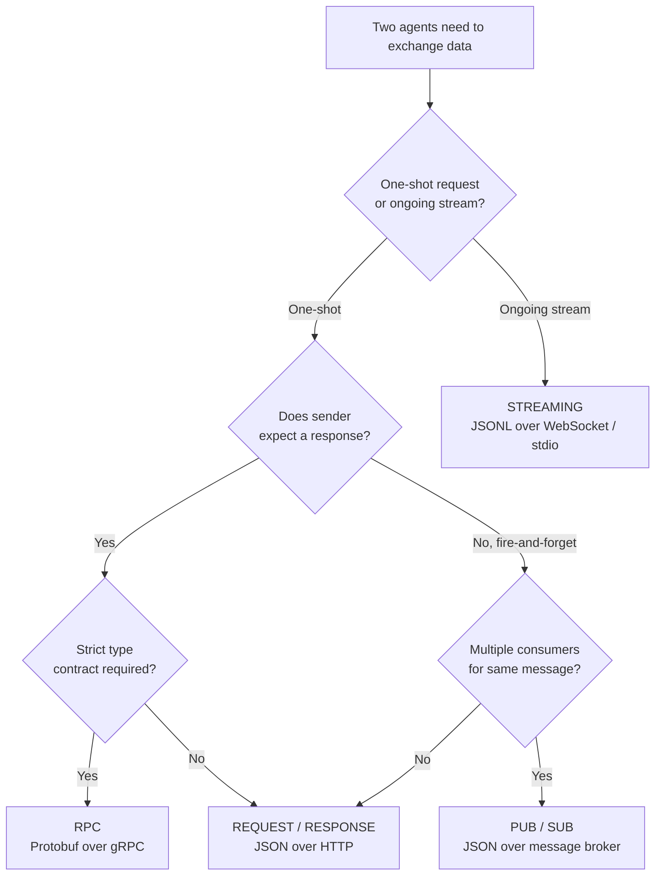

# Communication Protocols

> Agents that can't speak the same language aren't a team. They're strangers shouting into the void.

**Type:** Build
**Languages:** Python (stdlib only)
**Prerequisites:** Phase 14 (Agent Engineering), Lesson 16.01 (Why Multi-Agent)
**Time:** ~120 minutes

---

## Learning Objectives

- Implement request/response, streaming, and pub/sub communication between agents using JSON and JSONL wire formats
- Compare MCP, A2A, ACP, and ANP by the coordination problem each protocol solves at the transport layer
- Build a working multi-agent pipeline where agents exchange structured messages with schema validation over defined protocols
- Evaluate coupling trade-offs across protocol primitives and select the appropriate pattern for a given integration
- Map Clay enrichment waterfall step-chaining to request/response protocol semantics

---

## The Problem

You split your system into multiple agents. A researcher, a coder, a reviewer. They're great at their individual jobs. But now you need them to actually talk to each other.

Your first attempt is obvious: pass strings around. The researcher returns a blob of text, the coder parses it however it can. It works until the coder misinterprets a research summary, or two agents deadlock waiting for each other, or you need agents built by different teams to collaborate. Suddenly "just pass strings" falls apart.

This is the communication protocol problem. Without a shared contract for how agents exchange information, multi-agent systems are fragile, unauditable, and impossible to scale beyond a handful of agents you personally wrote. The reasoning center holds; the seams are where everything breaks. A model that produces perfect analysis but delivers it in an unstructured blob to a consumer that expects a different shape is a demo, not a product.

The AI ecosystem has responded with protocol standards — MCP for tool access, A2A for agent-to-agent delegation, ACP for enterprise auditability, ANP for decentralized identity and trust. But underneath all four sit the same four wire-level primitives: request/response, streaming, pub/sub, and RPC. This lesson covers those primitives directly so you can evaluate any agent protocol by what it actually does at the transport layer, not by the marketing around it.

---

## The Concept

Every agent communication pattern reduces to four primitives. Each primitive makes a different assumption about coupling — how tightly the sender and receiver must agree on message format, timing, and state.

**Request/response** is the tightest coupling. The sender issues a request and blocks until the receiver returns a response. Both sides agree on a schema: the request shape and the response shape. HTTP carrying JSON is the dominant implementation. MCP uses this primitive — an agent sends a tool invocation request, the MCP server returns a structured result. A2A uses it too — one agent posts a task to another's task endpoint and receives a task result. The advantage is simplicity and debuggability: every exchange has a clear beginning and end, and you can log the full round-trip. The cost is that the sender cannot proceed until the receiver finishes.

**Streaming** loosens the timing constraint. The sender (or receiver) emits a sequence of messages over a persistent connection, and the other side processes them incrementally. The wire format changes: instead of one JSON document, you send JSONL — one JSON object per line. This matters because JSON is not append-safe. A JSON parser needs the closing brace before it can return a value. JSONL lets the consumer parse each line independently as it arrives, which is why every streaming LLM API (OpenAI, Anthropic, Google) uses server-sent events or chunked transfer encoding with newline-delimited JSON. Agent-to-agent token streaming follows the same pattern over WebSocket or stdio.

**Pub/sub** decouples senders from receivers entirely. A publisher writes messages to a topic without knowing who will read them. Subscribers register interest in topics and receive messages asynchronously. The coupling is at its loosest — the sender and receiver never interact directly — but the coordination cost is at its highest. You need a message broker to manage subscriptions, handle consumer crashes, and guarantee delivery semantics (at-least-once, exactly-once). This is the primitive underneath ANP's decentralized discovery pattern, where agents announce capabilities to a network without point-to-point connections.

**RPC** (remote procedure call) sits between request/response and something more structured. Like request/response, it's synchronous. But the contract is stronger: the caller invokes a function as if it were local, and the serialization format enforces types. Protocol Buffers (protobuf) compile to code in both the client and server languages, so a type mismatch is caught at compile time, not at runtime. gRPC is the standard transport. RPC trades flexibility for safety — if you control both ends and the schema is stable, the type guarantees are worth the rigidity.



The coupling trade-off is the governing constraint. Tighter coupling (request/response, RPC) enables richer interaction — you get immediate feedback, typed errors, and predictable control flow. But it increases coordination cost: both sides must be available simultaneously, must agree on the schema, and must evolve the schema in lockstep. Looser coupling (streaming, pub/sub) lets components operate independently and survive each other's failures, but you lose the immediate feedback loop and take on the complexity of asynchronous error handling, message ordering, and idempotency.

Now map the agent protocols onto these primitives. MCP is request/response over JSON — an agent sends a `tools/call` request with a method name and arguments, the server returns a result or error. The spec defines a JSON-RPC 2.0 envelope, which is request/response with a standardized error format. A2A extends this: an agent discovers another agent's "card" (a JSON document listing capabilities and endpoint URLs), then delegates work via HTTP POST to the agent's task endpoint. The task lifecycle — submitted, working, completed, failed — is a request/response chain where the client polls or subscribes for status updates. ACP wraps these exchanges with audit logging and policy enforcement — it's a cross-cutting concern, not a different transport. ANP sits furthest out, using pub/sub for agent discovery and request/response for trust verification once a peer is found.

The serialization format follows from the primitive, not the other way around. JSON for request/response because it's human-readable and every language has a parser. JSONL for streaming because line-delimited parsing is incremental and stateless. Protobuf for RPC because the compiled schema catches type errors before runtime. You don't choose JSON because it's "better" — you choose it because the request/response primitive doesn't need streaming or compile-time types, and JSON's lack of strictness is acceptable when the schema is documented and validated at the application layer.

---

## Build It

### Script 1: Request/Response over HTTP (JSON)

This script runs an agent server in a background thread and sends a request from a client agent. The server receives a JSON payload describing a task, processes it, and returns a structured JSON response. Both sides agree on the schema implicitly — the client sends `agent` and `query` fields, the server returns `agent`, `received_query`, `result`, and `sources`.

```python
import http.server
import json
import threading
import urllib.request

class AgentHandler(http.server.BaseHTTPRequestHandler):
    def do_POST(self):
        content_length = int(self.headers['Content-Length'])
        body = self.rfile.read(content_length)
        payload = json.loads(body)

        response = {
            "agent": "researcher",
            "received_query": payload.get("query"),
            "result": f"Found 3 sources for: {payload.get('query')}",
            "sources": ["src-a.example", "src-b.example", "src-c.example"]