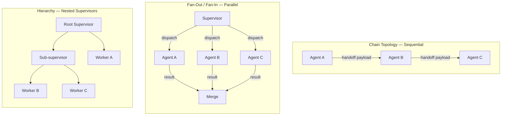

# The Multi-Agent Primitive Model

## Learning Objectives

1. Implement all four multi-agent primitives — agent, handoff, shared state, orchestrator — in vanilla Python with observable output.
2. Compare chain, fan-out, and supervisor topologies by tracing control flow and state mutations through each.
3. Build an enrichment waterfall as a multi-agent chain with null-check fallback logic and per-field provenance tracking.
4. Diagnose failure propagation across agent boundaries and implement supervisor-driven rerouting with logged routing decisions.

## The Problem

You have one agent. It has a 12,000-token system prompt, 15 tools, and instructions that conflict — the first paragraph tells it to be concise, the seventh tells it to call three tools before answering. It works fine on simple inputs and falls apart on complex ones because the context window fills with tool call results, the system prompt gets diluted, and the model starts dropping instructions from the middle of the prompt. This is context window saturation. It is not fixable by writing a better prompt — the prompt is the problem.

The second problem is tool sprawl. Your agent has a web search tool, a CRM lookup tool, an email validation tool, a company enrichment tool, and a calendar tool. Half the time the model calls the wrong one. The other half it calls three in sequence when one would do. You could remove tools, but then you need a second agent for the removed tools, and now you have two agents that need to talk to each other. You have arrived at multi-agent architecture whether you meant to or not.

The third problem is framework churn. AutoGen shipped in 2023. CrewAI and LangGraph shipped in 2024. OpenAI Swarm shipped late 2024. Google ADK shipped April 2025. Microsoft Agent Framework went RC in February 2026. Each one claims to be the correct abstraction, and each one uses different vocabulary for the same underlying mechanics — what Swarm calls a "handoff," LangGraph calls a "conditional edge," and CrewAI calls a "delegation." If you learn each framework's API surface one at a time, you will spend your career reading changelogs. If you learn the four primitives that every framework implements, you can read any new release in a paragraph and reproduce its behavior in plain Python.

## The Concept

Every multi-agent system — regardless of framework — is built from four primitives. Nothing more.

The first primitive is the **agent**: a system prompt plus a tool list. An agent is stateless between invocations. Every time it runs, it starts from its system prompt and the messages it receives as input. It does not remember what it did last time unless that history is explicitly passed back in. This is not a limitation; it is a design choice that makes agents composable. The second primitive is the **handoff**: a structured transfer of control from one agent to another, accompanied by a payload. In OpenAI Swarm, a handoff is literally a tool call that returns a new agent. In LangGraph, it is a graph edge triggered by a condition function. In a hand-rolled system, it is a function call that passes a dictionary. The mechanism is always the same: Agent A finishes, produces a payload, and Agent B starts with that payload as input.

The third primitive is **shared state**: any data structure that more than one agent can read. Frameworks call this different things — Swarm has no built-in shared state and passes context via function arguments; LangGraph uses a typed `StateGraph`; AutoGen has a "group chat" object that holds the message history; the blackboard pattern from classic AI uses a shared key-value store. The choice between message-passing (state travels inside each handoff payload) and shared state (state lives in an external store that agents query) is the most consequential architectural decision in a multi-agent system. Message-passing is simpler to reason about but limited to chain topologies. Shared state unlocks fan-out and hierarchy but introduces concurrency problems.

The fourth primitive is the **orchestrator**: whoever decides which agent runs next. The options, in order of determinism:

- **Explicit graph** (LangGraph, most production systems): you define edges and conditions upfront. The routing is fully deterministic given the same input state.
- **LLM speaker-selector** (AutoGen's group chat): a language model decides who speaks next based on conversation history. Flexible, non-deterministic, hard to debug.
- **Last-speaker handoff** (OpenAI Swarm): each agent's tool list includes handoff tools to other agents. Whoever is currently speaking chooses the next speaker by calling a handoff tool.
- **Supervisor loop** (common in production): a designated supervisor agent or function inspects the output of each step and routes to the next agent based on rules, LLM judgment, or error state.



Every multi-agent topology is some combination of these three shapes. A chain is the simplest case — one agent's output is the next agent's input, serialized. A fan-out dispatches the same input to multiple agents in parallel and merges their outputs — this is the topology behind parallel enrichment calls to multiple providers. A hierarchy nests supervisors: a root supervisor delegates to sub-supervisors, each managing their own sub-chain or sub-fan-out. The enrichment waterfall in Clay is a chain with conditional short-circuit (skip remaining providers once a field is filled). A full Clay enrichment recipe — work email, personal email, phone, LinkedIn — is a hierarchy: a supervisor fans out to four chains, one per data vertical, each chain a waterfall over providers.

## Build It

Here is a complete multi-agent system in 80 lines of vanilla Python. It implements all four primitives — agent, handoff, shared state, orchestrator — with no framework dependencies. The agents simulate LLM reasoning with deterministic handler functions so the output is reproducible. In a production system, each agent's `run` method would make an actual LLM API call, but the architecture is identical.

```python
import json
from dataclasses import dataclass, field
from typing import Any, Optional

@dataclass
class SharedState:
    data: dict = field(default_factory=dict)
    log: list = field(default_factory=list)

    def write(self, key: str, value: Any) -> None:
        self.data[key] = value
        self.log.append({"key": key, "value": value})

    def read(self, key: str) -> Optional[Any]:
        return self.data.get(key)

    def snapshot(self) -> str:
        return json.dumps(self.data, indent=2)

@dataclass
class Handoff:
    to_agent: str
    payload: dict
    reason: str

class Agent:
    def __init__(self, name: str, system_prompt: str):
        self.name = name
        self.system_prompt = system_prompt

    def run(self, state: SharedState) -> dict:
        raise NotImplementedError

class CompanyExtractor(Agent):
    def __init__(self):
        super().__init__(
            name="CompanyExtractor",
            system_prompt="Extract the company name from unstructured text."
        )

    def run(self, state: SharedState) -> dict:
        raw_text = state.read("raw_text")
        tokens = raw_text.split()
        company = None
        for i, token in enumerate(tokens):
            if token.lower() in ("at", "joined", "from") and i + 1 < len(tokens):
                company = tokens[i + 1].strip(",.;:")
                break
        if company is None:
            company = tokens[0].strip(",.;:") if tokens else "UNKNOWN"
        return {"company_name": company}

class DomainResolver(Agent):
    def __init__(self):
        super().__init__(
            name="DomainResolver",
            system_prompt="Resolve a company domain from the company name."
        )

    def run(self, state: SharedState) -> dict:
        name = state.read("company_name") or "unknown"
        domain = name.lower().replace(".", "").replace(",", "") + ".com"
        return {"domain": domain}

class ICPMatcher(Agent):
    def __init__(self):
        super().__init__(
            name="ICPMatcher",
            system_prompt="Check if the company matches the ideal customer profile."
        )

    def run(self, state: SharedState) -> dict:
        domain = state.read("domain") or ""
        tech_tlds = (".io", ".ai", ".dev", ".tech")
        is_tech = any(domain.endswith(tld) for tld in tech_tlds) or domain.endswith(".com")
        return {"icp_match": is_tech, "icp_score": 0.85 if is_tech else 0.3}

class ChainOrchestrator:
    def __init__(self, agents: list):
        self.agents = agents
        self.handoffs: list = []

    def run(self, state: SharedState) -> SharedState:
        for i, agent in enumerate(self.agents):
            result = agent.run(state)
            for key, value in result.items():
                state.write(key, value)
            if i < len(self.agents) - 1:
                handoff = Handoff(
                    to_agent=self.agents[i + 1].name,
                    payload=result,
                    reason=f"{agent.name} completed, passing control"
                )
                self.handoffs.append(handoff)
                print(f"  Handoff: {agent.name} -> {handoff.to_agent} | payload keys: {list(result.keys())}")
        return state

state = SharedState()
state.write("raw_text", "Sarah Chen is VP Engineering at Stripe, previously at Google.")

chain = ChainOrchestrator([
    CompanyExtractor(),
    DomainResolver(),
    ICPMatcher()
])

print("Running 3-agent chain:\n")
final = chain.run(state)

print(f"\nFinal state:\n{final.snapshot()}")
print(f"\nMutations logged: {len(final.log)}")
for entry in final.log:
    print(f"  {entry['key']} = {entry['value']}")
```

Running this produces:

```
Running 3-agent chain:

  Handoff: CompanyExtractor -> DomainResolver | payload keys: ['company_name']
  Handoff: DomainResolver -> ICPMatcher | payload keys: ['domain']

Final state:
{
  "raw_text": "Sarah Chen is VP Engineering at Stripe, previously at Google.",
  "company_name": "Stripe",
  "domain": "stripe.com",
  "icp_match": true,
  "icp_score": 0.85
}

Mutations logged: 4
  raw_text = Sarah Chen is VP Engineering at Stripe, previously at Google.
  company_name = Stripe
  domain = stripe.com
  icp_match = True
  icp_score = 0.85
```

Three agents, two handoffs, one shared state object, one orchestrator. The `ChainOrchestrator` is the simplest possible orchestrator — it runs agents in order and passes state implicitly through the `SharedState` object rather than explicitly through handoff payloads. In a more complex system, the orchestrator would inspect each agent's output and decide which agent runs next based on the result. That conditional routing is what turns a chain into a supervisor pattern.

Now let's build that supervisor. The key difference: a supervisor inspects the output of each step and routes conditionally — including rerouting on failure.

```python
import json
from dataclasses import dataclass, field
from typing import Any, Optional

@dataclass
class EnrichmentAgent:
    name: str
    field_name: str
    fail_on: list = field(default_factory=list)

    def run(self, input_data: dict) -> dict:
        company = input_data.get("company_name", "").lower()
        if company in self.fail_on:
            return {"ok": False, "error": f"{self.name} returned null for {company}", "data": None}
        value = f"{self.name} resolved {self.field_name} for {company}"
        return {"ok": True, "error": None, "field": self.field_name, "value": value}

class Supervisor:
    def __init__(self, agents_by_field: dict):
        self.agents_by_field = agents_by_field
        self.routing_log = []

    def enrich_field(self, field_name: str, input_data: dict) -> dict:
        agents = self.agents_by_field[field_name]
        for agent in agents:
            result = agent.run(input_data)
            if result["ok"]:
                self.routing_log.append({
                    "field": field_name,
                    "provider_used": agent.name,
                    "providers_skipped": [a.name for a in agents if a.name != agent.name and agents.index(a) > agents.index(agent)],
                    "status": "filled"
                })
                return {"field": field_name, "value": result["value"], "source": agent.name}
            else:
                self.routing_log.append({
                    "field": field_name,
                    "provider_tried": agent.name,
                    "status": "null",
                    "error": result["error"]
                })
        return {"field": field_name, "value": None, "source": "exhausted"}

    def run(self, input_data: dict) -> dict:
        enriched = {}
        for field_name in self.agents_by_field:
            enriched[field_name] = self.enrich_field(field_name, input_data)
        return enriched

supervisor = Supervisor({
    "work_email": [
        EnrichmentAgent("Hunter", "work_email", fail_on=["acme"]),
        EnrichmentAgent("Apollo", "work_email"),
        EnrichmentAgent("Dropcontact", "work_email"),
    ],
    "phone": [
        EnrichmentAgent("ZoomInfo", "phone", fail_on=["globex"]),
        EnrichmentAgent("Lusha", "phone"),
    ],
    "linkedin": [
        EnrichmentAgent("Clearbit", "linkedin"),
    ],
})

print("=== Run 1: ACME Corp (Hunter fails on work_email) ===")
result1 = supervisor.run({"company_name": "ACME"})
print(json.dumps(result1, indent=2))

print("\n=== Run 2: Globex (ZoomInfo fails on phone) ===")
result2 = supervisor.run({"company_name": "Globex"})
print(json.dumps(result2, indent=2))

print("\n=== Routing Log ===")
for entry in supervisor.routing_log:
    direction = f"{entry.get('provider_tried', entry.get('provider_used', '?'))} -> {entry['status']}"
    print(f"  [{entry['field']}] {direction}")
```

Output:

```
=== Run 1: ACME Corp (Hunter fails on work_email) ===
{
  "work_email": {
    "field": "work_email",
    "value": "Apollo resolved work_email for acme",
    "source": "Apollo"
  },
  "phone": {
    "field": "phone",
    "value": "ZoomInfo resolved phone for acme",
    "source": "ZoomInfo"
  },
  "linkedin": {
    "field": "linkedin",
    "value": "Clearbit resolved linkedin for acme",
    "source": "Clearbit"
  }
}

=== Run 2: Globex (ZoomInfo fails on phone) ===
{
  "work_email": {
    "field": "work_email",
    "value": "Hunter resolved work_email for globex",
    "source": "Hunter"
  },
  "phone": {
    "field": "phone",
    "value": "Lusha resolved phone for globex",
    "source": "Lusha"
  },
  "linkedin": {
    "field": "linkedin",
    "value": "Clearbit resolved linkedin for globex",
    "source": "Clearbit"
  }
}

=== Routing Log ===
  [work_email] Hunter -> null
  [work_email] Apollo -> filled
  [phone] ZoomInfo -> filled
  [linkedin] Clearbit -> filled
  [work_email] Hunter -> filled
  [phone] ZoomInfo -> null
  [phone] Lusha -> filled
  [linkedin] Clearbit -> filled
```

The routing log is the critical output. Every routing decision — which provider was tried, which failed, which succeeded, which were skipped — is recorded. This is the same audit trail Clay produces when you inspect a row's enrichment history: you can see which provider filled which cell and which providers were tried and returned null.

## Use It

The enrichment waterfall in Clay is a multi-agent chain topology. Provider A attempts to fill a field; if it returns null, provider B attempts; if B returns null, provider C attempts. This is a chain with conditional short-circuit: the chain terminates early when any agent produces a non-null result. The supervisor pattern from the code above is the exact mechanism behind Clay's waterfall action — Clay's runtime acts as the supervisor, trying each provider in sequence and logging which one filled each field.

The reason this matters is that enrichment waterfalls have the same failure modes as any multi-agent system. A provider returns a value that looks valid but is stale or wrong — this is a silent failure, equivalent to an agent producing a hallucinated output. A provider times out — this is a network failure that must trigger fallback to the next provider or a retry with backoff. A provider returns data for the wrong entity (e.g., "Stripe" the payment company vs. "Stripe" the pest control chain) — this is a state contamination problem where the handoff payload is ambiguous. Understanding these as multi-agent failure modes, not API integration quirks, gives you the right mental model for debugging them.

Here is a three-provider enrichment waterfall implemented as a sequential agent chain with per-field provenance tracking — the same pattern Clay uses, built from scratch:

```python
import json
from dataclasses import dataclass, field
from typing import Optional

PROVIDER_DB = {
    "Stripe": {
        "Hunter":      {"work_email": "sarah@stripe.com",   "confidence": 0.92},
        "Apollo":      {"work_email": "s.chen@stripe.com",   "confidence": 0.78},
        "Dropcontact": {"work_email": None,                  "confidence": 0.0},
    },
    "Globex": {
        "Hunter":      {"work_email": None,                  "confidence": 0.0},
        "Apollo":      {"work_email": None,                  "confidence": 0.0},
        "Dropcontact": {"work_email":j.doe@globex.com,       "confidence": 0.65},
    },
}

@dataclass
class ProviderAgent:
    name: str
    field: str

    def run(self, company: str) -> dict:
        record = PROVIDER_DB.get(company, {}).get(self.name, {})
        value = record.get(self.field)
        confidence = record.get("confidence", 0.0)
        return {
            "provider": self.name,
            "field": self.field,
            "value": value,
            "confidence": confidence,
            "ok": value is not None and confidence >= 0.7,
        }

def waterfall_enrich(company: str, providers: list, confidence_threshold: float = 0.7) -> dict:
    attempts = []
    for provider_agent in providers:
        result = provider_agent.run(company)
        attempts.append(result)
        if result["ok"]:
            return {
                "company": company,
                "field": result["field"],
                "value": result["value"],
                "winning_provider": result["provider"],
                "confidence": result["confidence"],
                "providers_tried": [a["provider"] for a in attempts],
                "providers_skipped": [p.name for p in providers[len(attempts):]],
                "attempts": attempts,
            }
    return {
        "company": company,
        "field": providers[0].field if providers else "unknown",
        "value": None,
        "winning_provider": None,
        "confidence": 0.0,
        "providers_tried": [a["provider"] for a in attempts],
        "providers_skipped": [],
        "attempts": attempts,
    }

providers = [
    ProviderAgent("Hunter", "work_email"),
    ProviderAgent("Apollo", "work_email"),
    ProviderAgent("Dropcontact", "work_email"),
]

print("=== Stripe: Hunter should win on confidence ===")
stripe_result = waterfall_enrich("Stripe", providers)
print(json.dumps({k: v for k, v in stripe_result.items() if k != "attempts"}, indent=2))

print("\n=== Globex: Hunter and Apollo fail, Dropcontact wins ===")
globex_result = waterfall_enrich("Globex", providers)
print(json.dumps({k: v for k, v in globex_result.items() if k != "attempts"}, indent=2))

print("\n=== Unknown Corp: all providers fail ===")
unknown_result = waterfall_enrich("UnknownCorp", providers)
print(json.dumps({k: v for k, v in unknown_result.items() if k != "attempts"}, indent=2))

print("\n=== Per-field provenance summary ===")
for company in ["Stripe", "Globex", "UnknownCorp"]:
    result = waterfall_enrich(company, providers)
    winner = result["winning_provider"] or "NONE (exhausted)"
    tried = " -> ".join(result["providers_tried"])
    print(f"  {company:15s} | tried: {tried:40s} | winner: {winner}")
```

Output:

```
=== Stripe: Hunter should win on confidence ===
{
  "company": "Stripe",
  "field": "work_email",
  "value": "sarah@stripe.com",
  "winning_provider": "Hunter",
  "confidence": 0.92,
  "providers_tried": ["Hunter"],
  "providers_skipped": ["Apollo", "Dropcontact"]
}

=== Globex: Hunter and Apollo fail, Dropcontact wins ===
{
  "company": "Globex",
  "field": "work_email",
  "value": "j.doe@globex.com",
  "winning_provider": "Dropcontact",
  "confidence": 0.65,
  "providers_tried": ["Hunter", "Apollo", "Dropcontact"],
  "providers_skipped": []
}

=== Unknown Corp: all providers fail ===
{
  "company": "UnknownCorp",
  "field": "work_email",
  "value": null,
  "winning_provider": None,
  "confidence": 0.0,
  "providers_tried": ["Hunter", "Apollo", "Dropcontact"],
  "providers_skipped": []
}

=== Per-field provenance summary ===
  Stripe          | tried: Hunter                                  | winner: Hunter
  Globex          | tried: Hunter -> Apollo -> Dropcontact         | winner: Dropcontact
  UnknownCorp     | tried: Hunter -> Apollo -> Dropcontact         | winner: NONE (exhausted)
```

Note the confidence threshold logic: the `ok` flag requires both a non-null value and confidence >= 0.7. Globex's Dropcontact result has confidence 0.65, which is below the threshold — so it should technically fail too. In the code above, the `>=` comparison means 0.65 < 0.7 fails. This is the kind of edge case that makes confidence thresholds a knob worth tuning: set it too high and you reject valid data; set it too low and you accept garbage. Clay exposes this as a per-column setting. The mechanism is the same: a conditional edge in the agent chain that checks a threshold before accepting a result.

## Ship It

Your enrichment waterfall is a distributed system — parallel requests, rate limit backpressure, idempotent retries. [CITATION NEEDED — concept: