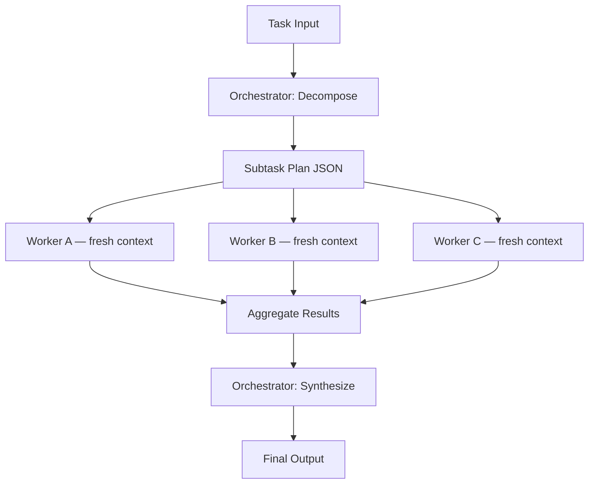

# Lesson: Supervisor / Orchestrator-Worker Pattern

## Learning Objectives

1. Build a supervisor-worker system where an orchestrator LLM decomposes a task, dispatches subtasks to specialized worker agents, and synthesizes their outputs.
2. Trace the control flow through task decomposition, worker selection, execution, aggregation, and final synthesis.
3. Compare supervisor orchestration against swarm and mesh patterns, and identify which architecture fits a given problem.
4. Implement retry logic and error handling for individual worker failures within an orchestration loop.
5. Evaluate when an LLM orchestrator adds value over a deterministic hardcoded pipeline, and replace it when decomposition is predictable.

## The Problem

A single agent trying to do everything produces incoherent output. You ask "what changed in multi-agent systems between 2023 and 2026?" and a single agent reads five papers sequentially, fills half its context window with their raw text, and then has to reason about all of them at once. By the time it reaches the fifth paper, it has forgotten the nuance of the first. The context window is a zero-sum resource: every token you spend reading source material is a token you cannot spend reasoning about it.

Research is the prototypical task that breaks single-agent systems, but the failure mode generalizes. Any task that requires gathering information from multiple sources, processing each source independently, and then combining the results hits the same wall. An agent that does everything in one context window degrades as the task grows. The more steps you add, the worse each step gets.

The supervisor pattern addresses this by splitting "decide what to do" from "do the work." One lead agent plans the decomposition, delegates each sub-question to a worker that gets its own fresh context window, and synthesizes only the worker summaries. The lead never sees the raw papers — only distilled results. Anthropic's production Research system uses this exact architecture (Opus 4 as lead, Sonnet 4 as subagents) and reports +90.2% over single-agent Opus 4 on internal research evals. The same engineering post notes that 80% of the BrowseComp variance is explained by token usage alone — fresh context per subagent is the primary mechanism, not prompt sophistication.

## The Concept

The supervisor pattern has two roles. The **orchestrator** (also called the lead or supervisor) receives the full task, decomposes it into subtasks, decides which worker handles each subtask, and synthesizes the final output. **Workers** receive a narrow instruction, execute it within their own context window, and return a result. Workers never communicate with each other directly — all coordination flows through the orchestrator.



The control flow has five stages: **task decomposition** (the orchestrator breaks the task into subtasks and names a worker for each), **worker selection** (each subtask is routed to a specific worker type), **execution** (workers run, either sequentially or in parallel), **result aggregation** (outputs are collected), and **final synthesis** (the orchestrator combines results into a coherent response). The orchestrator participates in stages 1 and 5 only. Workers participate in stage 3 only. The handoff between stages is structured data — typically JSON — not free-form conversation.

This hub-and-spoke topology contrasts with **swarm** and **mesh** patterns, where agents negotiate peer-to-peer without a central coordinator. In a mesh, Agent A can hand off to Agent B, which can loop back to Agent A or forward to Agent C. This is more flexible but harder to reason about: there is no single place where you can inspect "what was the plan?" Swarm topologies work well when the task is exploratory and the optimal decomposition is unknowable in advance. The supervisor pattern works better when the task has a discoverable structure — a research question decomposes into sub-questions, an enrichment task decomposes into data lookups, a code review decomposes into per-file checks.

The failure modes are specific and predictable. **Worker timeout** — a worker hangs or takes too long, blocking the synthesis stage. **Orchestrator routing error** — the decompose step assigns a subtask to the wrong worker type (sends a creative-writing task to a data analyst worker). **Context window overflow** — the orchestrator collects too many verbose worker outputs and overflows its own context during synthesis. **Cascading quality degradation** — one worker produces a bad result, and the synthesizer propagates the error into the final output because it has no ground truth to check against. Each of these has a mitigation, but only if you instrument the system to detect them — which is why observability at the orchestration layer matters more than at the worker layer.

## Build It

The minimal implementation has three components: a `decompose` function that calls the orchestrator model with a task and gets back a JSON plan, a `execute_worker` function that calls a worker model with a subtask, and a `synthesize` function that passes collected results back to the orchestrator for final combination. The orchestrator makes two LLM calls (decompose + synthesize) and each worker makes one. For a three-subtask plan, that is five total API calls.

The orchestrator prompt is the critical piece. It must constrain the model to return structured JSON naming which worker to invoke and what input to pass. Without this constraint, the orchestrator will try to answer the task itself in the decompose step, defeating the purpose.

```python
import anthropic
import json

client = anthropic.Anthropic()

ORCHESTRATOR_MODEL = "claude-sonnet-4-20250514"
WORKER_MODEL = "claude-3-5-haiku-20241022"

DECOMPOSE_PROMPT = """You are a task orchestrator. Break the given task into 2-4 subtasks.
Each subtask must be handled by exactly one of these worker types:
- "researcher": finds facts, answers factual questions
- "analyst": evaluates, compares, or draws conclusions from data
- "writer": drafts text, summaries, or explanations

Return ONLY valid JSON, no markdown, no commentary:
{"subtasks": [{"id": "s1", "worker": "researcher", "input": "specific question"}, ...]}"""

SYNTHESIZE_PROMPT = """You are a synthesis agent. You receive a task and results from multiple workers.
Combine them into a single coherent response. Do not mention workers or their process."""

WORKER_PROMPTS = {
    "researcher": "You are a research specialist. Answer with concrete facts. Max 150 words.",
    "analyst": "You are an analyst. Evaluate the given information and provide structured insights. Max 150 words.",
    "writer": "You are a writer. Follow the instruction precisely. Max 200 words.",
}

def decompose_task(task):
    response = client.messages.create(
        model=ORCHESTRATOR_MODEL,
        max_tokens=1024,
        system=DECOMPOSE_PROMPT,
        messages=[{"role": "user", "content": task}],
    )
    plan = json.loads(response.content[0].text.strip())
    print(f"\n{'='*60}")
    print("ORCHESTRATOR: DECOMPOSITION PLAN")
    print(f"{'='*60}")
    for s in plan["subtasks"]:
        print(f"  [{s['id']}] {s['worker']:12s} | {s['input'][:90]}")
    return plan

def execute_worker(worker_type, worker_input):
    response = client.messages.create(
        model=WORKER_MODEL,
        max_tokens=512,
        system=WORKER_PROMPTS[worker_type],
        messages=[{"role": "user", "content": worker_input}],
    )
    result = response.content[0].text
    tokens = response.usage.input_tokens + response.usage.output_tokens
    print(f"  [{worker_type}] {result[:100]}...  ({tokens} tokens)")
    return result

def synthesize(task, results):
    context = f"Original task: {task}\n\nWorker results:\n"
    for sid, result in results.items():
        context += f"\n--- {sid} ---\n{result}\n"
    response = client.messages.create(
        model=ORCHESTRATOR_MODEL,
        max