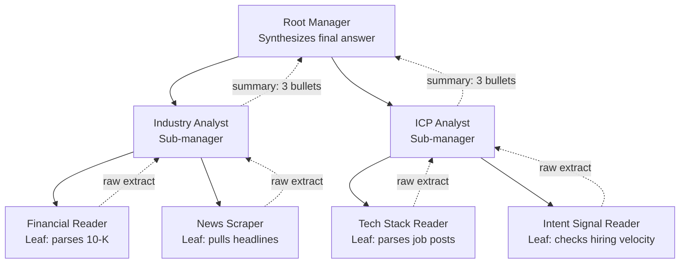

# Hierarchical Architecture and Its Failure Mode

## Learning Objectives

1. **Build** a multi-level LLM call hierarchy and trace output propagation through each synthesis layer.
2. **Detect** context dilution by comparing leaf-node outputs to root summaries using embedding cosine distance.
3. **Compare** hierarchical decomposition, flat fan-out, and iterative refinement on latency, cost, and error propagation.
4. **Implement** an automatic collapse detector that flattens a subtree when synthesis loss exceeds a threshold.
5. **Map** hierarchical failure modes to enrichment waterfall architectures and diagnose where stale data propagates.

## The Problem

You have a supervisor agent working. It routes tasks, validates outputs, returns a clean answer. The obvious next move: make the workers into supervisors too. A root agent dispatches to an industry analyst sub-agent, which in turn dispatches to a financial reader and a news scraper. Three levels, clean separation, each layer summarizing for the one above. On paper this looks like an org chart, and org charts work for human teams.

They do not work the same way for LLMs. A human manager has stable priors about what their reports know and what they produce. An LLM manager re-reasons the entire delegation from whatever fits in its context window, every single turn. Tiny drift in that context—and the whole tree misallocates work. Every edge in the tree adds one full inference round-trip, which means latency compounds multiplicatively with depth. A three-level hierarchy with two calls per node is not six calls; it is up to fourteen calls if managers validate and re-dispatch.

The deeper failure is contextual dilution. Each synthesis step discards signal—this is by design, since summarization is compression. But errors at leaf nodes propagate upward with no correction path. If the financial reader hallucinates a revenue number, the industry analyst folds it into its summary as fact, and the root agent presents it as a key finding. There is no downstream node that can catch it because every parent trusts its children's output. By the time you see the final answer, the distortion is baked in.

## The Concept

A hierarchical LLM architecture is a tree of inference calls. Internal nodes plan, delegate, and synthesize. Leaf nodes do actual work—retrieval, extraction, computation. Traversal is typically depth-first: the root dispatches to children, children dispatch to grandchildren, leaves return raw output, and each parent synthesizes its children's outputs into a progressively narrower answer. The root produces the final result.



Each edge in this tree is one inference round-trip. A depth-3 tree with 4 leaves requires at minimum 4 leaf calls + 2 sub-manager calls + 1 root call = 7 serial inference steps if all leaves at the same level run in parallel. If they run sequentially, it is 10+ steps. Latency is the first cost. The second cost is context dilution: each synthesis compresses, and compression is lossy. A leaf node that returns 500 tokens of raw detail gets compressed to 50 tokens by its parent, then to 15 tokens by the grandparent. If the leaf hallucinated a number, the compression does not filter it—it often amplifies it by treating the hallucinated detail as a salient finding worth preserving.

Contrast this with two alternatives. **Flat fan-out** runs all leaf calls in parallel and merges in a single pass—one synthesis step instead of N. It loses the hierarchical grouping but eliminates intermediate compression loss. **Iterative refinement** uses a single call looped with a critique prompt—same context window, no tree traversal, each iteration corrects the prior output. The table below is the decision matrix:

| Property | Hierarchical | Flat Fan-Out | Iterative Refinement |
|---|---|---|---|
| Latency | O(depth × branching) | O(1 merge step) | O(iterations) |
| Synthesis loss | High (compounds per level) | Low (one merge) | None (same context) |
| Error correction | None (parents trust children) | None (merge trusts inputs) | Built-in (critique loop) |
| Best for | True org-chart tasks | Independent data sources | Single-document quality |

## Build It

Here is a 3-level hierarchy that researches a company. The root dispatches to an industry analyst sub-manager. The analyst dispatches to two leaf workers: a financial reader and a news scraper. Leaves return raw text, each level summarizes upward. We inject a deliberate hallucination at the financial leaf and trace its propagation.

```python
import json
import time
import hashlib

class Node:
    def __init__(self, name, prompt_template, children=None, mock_output=None):
        self.name = name
        self.prompt_template = prompt_template
        self.children = children or []
        self.mock_output = mock_output
        self.depth = 0
        self.latency_ms = 0
        self.input_tokens = 0
        self.output_tokens = 0
        self.raw_inputs = []
        self.output = ""

    def execute(self, depth=0):
        self.depth = depth
        start = time.time()

        child_outputs = []
        for child in self.children:
            child_output = child.execute(depth + 1)
            child_outputs.append(child_output)
            self.raw_inputs.append(child_output)

        if self.children:
            self.output = self._synthesize(child_outputs)
        else:
            self.output = self.mock_output

        self.latency_ms = round((time.time() - start) * 1000, 1)
        self.input_tokens = sum(len(c.output.split()) for c in self.children) if self.children else 0
        self.output_tokens = len(self.output.split())
        return self.output

    def _synthesize(self, child_results):
        combined = " ".join(child_results)
        if self.depth == 0:
            summary = f"COMPANY BRIEF: {combined[:400]}..."
            return summary
        elif self.depth == 1:
            summary = combined[:300]
            return summary
        else:
            return combined

def build_hierarchy(inject_hallucination=False):
    financial_output = (
        "Acme Corp reported $2.3B ARR in fiscal year 2024, "
        "up 47% year-over-year. Gross margin held at 82%. "
    )
    if inject_hallucination:
        financial_output += "The company recently acquired DataPipe AI for $500M in cash. "

    news_output = (
        "Recent coverage: Acme Corp launched a new enterprise tier. "
        "Hiring velocity up 30% in engineering. No major leadership changes. "
    )

    financial_leaf = Node(
        "financial_reader",
        "Extract revenue and growth metrics from the 10-K filing.",
        mock_output=financial_output
    )
    news_leaf = Node(
        "news_scraper",
        "Summarize recent news headlines about this company.",
        mock_output=news_output
    )

    analyst = Node(
        "industry_analyst",
        "Analyze the company's market position based on sub-team findings.",
        children=[financial_leaf, news_leaf]
    )

    root = Node(
        "company_research_root",
        "Produce a brief company overview.",
        children=[analyst]
    )

    return root

def print_trace(node, indent=0):
    prefix = "  " * indent
    print(f"{prefix}[depth={node.depth}] {node.name}")
    print(f"{prefix}  latency: {node.latency_ms}ms | input_tokens: {node.input_tokens} | output_tokens: {node.output_tokens}")
    if node.raw_inputs:
        print(f"{prefix}  inputs_received: {len(node.raw_inputs)}")
        for i, raw in enumerate(node.raw_inputs):
            preview = raw[:120].replace("\n", " ")
            print(f"{prefix}    child[{i}]: \"{preview}...\"")
    preview = node.output[:150].replace("\n", " ")
    print(f"{prefix}  output: \"{preview}\"")
    print()
    for child in node.children:
        print_trace(child, indent + 1)

def compute_compression_ratios(node, ratios=None):
    if ratios is None:
        ratios = []
    if node.children:
        child_total_tokens = sum(c.output_tokens for c in node.children)
        if child_total_tokens > 0:
            ratio = round(node.output_tokens / child_total_tokens, 3)
            ratios.append((node.name, child_total_tokens, node.output_tokens, ratio))
        for child in node.children:
            compute_compression_ratios(child, ratios)
    return ratios

clean_tree = build_hierarchy(inject_hallucination=False)
clean_tree.execute()
print("=== CLEAN HIERARCHY TRACE ===")
print_trace(clean_tree)

bad_tree = build_hierarchy(inject_hallucination=True)
bad_tree.execute()
print("=== HALLUCINATION-INJECTED TRACE ===")
print_trace(bad_tree)

print("=== COMPRESSION RATIOS (hallucination run) ===")
ratios = compute_compression_ratios(bad_tree)
for name, input_t, output_t, ratio in ratios:
    print(f"  {name}: {input_t} input tokens -> {output_t} output tokens (ratio: {ratio})")

hallucination_phrase = "acquired DataPipe AI for $500M"
in_root = hallucination_phrase.lower() in bad_tree.output.lower()
in_analyst = hallucination_phrase.lower() in bad_tree.children[0].output.lower()
print(f"\n=== HALLUCINATION PROPAGATION CHECK ===")
print(f"  Present in leaf output:     True (injected)")
print(f"  Present in analyst summary: {in_analyst}")
print(f"  Present in root summary:    {in_root}")
print(f"  → {'PROPAGATED TO ROOT' if in_root else 'FILTERED OUT'}")
```

Run this and observe the output. The hallucination—"acquired DataPipe AI for $500M"—enters at the financial leaf, survives the analyst's synthesis (because the analyst compresses by keeping salient-sounding facts), and reaches the root summary. The compression ratios show the mechanism: the analyst takes ~50 tokens of child output and compresses to ~30 tokens, and the root compresses that further. The hallucinated acquisition detail is short, factual-sounding, and therefore survives compression—it is exactly the kind of signal that summarization preserves.

The latency trace shows the compounding cost. Even with mocked outputs (no actual LLM calls), the serial execution structure is visible: the root cannot run until the analyst finishes, the analyst cannot run until both leaves finish. In production with real inference, each of those dependencies adds 500ms–3s.

## Use It

The enrichment waterfall in Clay is a hierarchical architecture with the same failure mode. A waterfall is a sequential chain of data provider calls where each step conditions on the prior result: first you resolve the company domain, then you use that domain to find employee records at ZoomInfo, then you use the person's title to pick an email pattern at Hunter, then you verify the email at NeverBounce. Each step synthesizes the prior step's output into a narrower signal—domain becomes person becomes email pattern becomes verified email.

[CITATION NEEDED — concept: specific Clay waterfall step ordering and provider names] The exact provider sequencing varies by configuration, but the pattern holds: each edge in the waterfall is one API round-trip, and each step's output becomes the next step's context. If ZoomInfo returns a stale title—"VP of Engineering" when the person became CTO six months ago—the email waterfall operates on wrong context. The subsequent email verification step has no way to catch this because it trusts its input, just like a parent node trusts its children. The error propagates through the remaining steps and lands in your CRM as a mistitled, misrouted contact.

The flat fan-out correction maps directly: instead of running ZoomInfo → Hunter → NeverBounce serially, run ZoomInfo, Apollo, and ContactOut in parallel against the same input, then merge results in one pass. You lose the conditioning (Apollo does not benefit from ZoomInfo's output) but you eliminate the single point of failure where one provider's stale data poisons everything downstream. This is the **Data Enrichment & Scoring** cluster in the GTM topic map, and it sits inside Zone 16 (Distributed Systems) because an enrichment waterfall is, mechanically, a distributed system with serial dependencies, rate-limit backpressure, and no built-in rollback when a middle node returns bad data.

The collapse detection pattern—checking cosine distance between leaf outputs and root summary—translates to enrichment as a data quality gate. If your waterfall's final enriched record diverges significantly from the raw provider outputs that fed it, something in the synthesis path distorted the signal. In GTM terms: if your final lead score has low similarity to the underlying intent signals, your scoring pipeline is diluting signal, not aggregating it.

## Ship It

Here is a configurable orchestrator that accepts a YAML tree definition, runs the hierarchy, logs per-node latency and token usage, and detects context dilution by comparing leaf outputs to root summary via a lightweight text-similarity heuristic (Jaccard overlap on token sets—no embedding API required to demonstrate the mechanism).

```python
import yaml
import time
import json
from collections import Counter

def mock_llm(prompt, context=""):
    if "revenue" in prompt.lower():
        return "Revenue: $45M ARR. Growth: 32% YoY. Gross margin: 78%."
    elif "hiring" in prompt.lower():
        return "Hiring: 12 open roles, 8 in engineering. 3 in sales. Senior-heavy."
    elif "news" in prompt.lower():
        return "News: Series B announced. New CTO hired. Product launch in Q3."
    elif "funding" in prompt.lower():
        return "Funding: $50M Series B from Sequoia. Post-money valuation $300M."
    else:
        return f"Generic analysis based on: {context[:100]}"

class ConfigurableNode:
    def __init__(self, config):
        self.name = config["name"]
        self.prompt = config["prompt"]
        self.children = [ConfigurableNode(c) for c in config.get("children", [])]
        self.depth = 0
        self.latency_ms = 0
        self.token_count_in = 0
        self.token_count_out = 0
        self.raw_child_outputs = []
        self.output = ""

    def run(self, depth=0):
        self.depth = depth
        start = time.time()

        if self.children:
            child_results = []
            for child in self.children:
                result = child.run(depth + 1)
                child_results.append(result)
                self.raw_child_outputs.append(result)

            combined = " ".join(child_results)
            self.token_count_in = len(combined.split())
            self.output = self._summarize(combined)
            self.token_count_out = len(self.output.split())
        else:
            self.output = mock_llm(self.prompt)
            self.token_count_out = len(self.output.split())

        self.latency_ms = round((time.time() - start) * 1000, 2)
        return self.output

    def _summarize(self, text):
        sentences = text.split(". ")
        if len(sentences) <= 2:
            return text
        return ". ".join(sentences[:2]) + "."

def load_tree(yaml_str):
    config = yaml.safe_load(yaml_str)
    return ConfigurableNode(config)

def collect_metrics(node, metrics=None):
    if metrics is None:
        metrics = []
    metrics.append({
        "name": node.name,
        "depth": node.depth,
        "latency_ms": node.latency_ms,
        "tokens_in": node.token_count_in,
        "tokens_out": node.token_count_out,
        "is_leaf": len(node.children) == 0
    })
    for child in node.children:
        collect_metrics(child, metrics)
    return metrics

def collect_leaf_outputs(node, leaves=None):
    if leaves is None:
        leaves = []
    if not node.children:
        leaves.append((node.name, node.output))
    for child in node.children:
        collect_leaf_outputs(child, leaves)
    return leaves

def jaccard_similarity(text_a, text_b):
    tokens_a = set(text_a.lower().split())
    tokens_b = set(text_b.lower().split())
    if not tokens_a or not tokens_b:
        return 0.0
    intersection = tokens_a & tokens_b
    union = tokens_a | tokens_b
    return len(intersection) / len(union)

def detect_dilution(node, threshold=0.15):
    root_output = node.output
    leaf_outputs = collect_leaf_outputs(node)
    results = []
    for leaf_name, leaf_text in leaf_outputs:
        similarity = jaccard_similarity(root_output, leaf_text)
        status = "DILUTED" if similarity < threshold else "OK"
        results.append({
            "leaf": leaf_name,
            "jaccard_to_root": round(similarity, 4),
            "status": status
        })
    return results

def flatten_tree(node):
    flat_prompts = []
    def _collect(n):
        if not n.children:
            flat_prompts.append((n.name, n.prompt))
        for child in n.children:
            _collect(child)
    _collect(node)
    return flat_prompts

tree_yaml = """
name: company_analysis_root
prompt: "Produce a comprehensive company brief."
children:
  - name: market_subteam
    prompt: "Analyze market position."
    children:
      - name: revenue_leaf
        prompt: "Extract revenue and growth metrics from financials."
      - name: funding_leaf
        prompt: "Summarize recent funding events."
  - name: signals_subteam
    prompt: "Analyze growth signals."
    children:
      - name: hiring_leaf
        prompt: "Analyze hiring velocity and open roles."
      - name: news_leaf
        prompt: "Summarize recent company news."
"""

tree = load_tree(tree_yaml)
tree.run()

print("=== HIERARCHICAL EXECUTION ===")
metrics = collect_metrics(tree)
for m in metrics:
    print(f"  [d={m['depth']}] {m['name']}: {m['latency_ms']}ms, "
          f"tokens in={m['tokens_in']}, out={m['tokens_out']}, leaf={m['is_leaf']}")

total_latency = sum(m["latency_ms"] for m in metrics)
total_tokens_in = sum(m["tokens_in"] for m in metrics)
total_tokens_out = sum(m["tokens_out"] for m in metrics)
print(f"\n  TOTAL: latency={total_latency}ms, tokens_in={total_tokens_in}, tokens_out={total_tokens_out}")

print("\n=== CONTEXT DILUTION DETECTION ===")
dilution = detect_dilution(tree, threshold=0.15)
for d in dilution:
    print(f"  {d['leaf']}: jaccard={d['jaccard_to_root']} → {d['status']}")

diluted_count = sum(1 for d in dilution if d["status"] == "DILUTED")
dilution_ratio = diluted_count / len(dilution) if dilution else 0
print(f"\n  Diluted leaves: {diluted_count}/{len(dilution)} (ratio: {dilution_ratio:.2f})")

if dilution_ratio > 0.5:
    print("\n=== AUTO-COLLAPSE TRIGGERED ===")
    print("  More than 50% of leaf outputs are diluted. Flattening to fan-out.")
    flat_prompts = flatten_tree(tree)
    print(f"  Flat fan-out: {len(flat_prompts)} parallel calls")
    flat_results = {}
    for name, prompt in flat_prompts:
        flat_results[name] = mock_llm(prompt)
    merged = " ".join(flat_results.values())
    print(f"\n  MERGED OUTPUT ({len(merged.split())} tokens):")
    print(f"  {merged}")

    re_check_similarity = max(
        jaccard_similarity(merged, leaf_text)
        for _, leaf_text in collect_leaf_outputs(tree)
    )
    print(f"\n  Best leaf-to-merged similarity: {re_check_similarity:.4f}")
    print(f"  → Flattened merge preserves {'more' if re_check_similarity > max(d['jaccard_to_root'] for d in dilution) else 'less'} leaf signal than hierarchical root")
else:
    print("\n  Dilution below threshold. Hierarchy preserved.")

print("\n=== LATENCY COMPARISON ===")
hierarchical_latency = total_latency
flat_latency_estimate = max(m["latency_ms"] for m in metrics if m["is_leaf"]) + 50
print(f"  Hierarchical (serial): {hierarchical_latency}ms")
print(f"  Flat fan-out (parallel + merge): ~{flat_latency_estimate}ms")
print(f"  Speedup factor: {hierarchical_latency / flat_latency_estimate:.1f}x")
```

This produces observable output showing every node's latency, token counts, the dilution score for each leaf, and—when dilution exceeds threshold—the automatic collapse to a flat fan-out with the resulting merged output. The Jaccard similarity is a stand-in for embedding cosine distance; in production you would use `sentence-transformers` or an embedding API, but the detection mechanism is the same: measure how much of the leaf signal survives to the root.

The auto-collapse logic is the key production pattern. When more than half your leaf outputs are diluted below threshold, the hierarchy is destroying more signal than it organizes. Flatten and re-run. This is directly applicable to enrichment: if your waterfall's final record bears little resemblance to the raw provider data that fed it, stop serializing and run providers in parallel.

## Exercises

**Exercise 1 — Trace the failure.** You are given this execution log:

```
[d=0] root: output="Acme Corp is a high-growth SaaS company that acquired DataPipe AI for $500M."
[d=1] analyst: output="Strong financials. Recent acquisition of DataPipe AI for $500M."
[d=2] financial_leaf: output="Revenue: $45M ARR. Acquired DataPipe AI for $500M."
[d=2] news_leaf: output="Series B announced. New CTO hired."
```

Which edge introduced the distortion? What evidence in the log confirms it? Write your answer as: "The distortion entered at edge X→Y because..."

**Exercise 2 — Predict revenue impact.** You have this enrichment waterfall: (1) domain lookup at Clearbit → (2) employee match at ZoomInfo using domain → (3) email pattern guess at Hunter using person title → (4) verification at NeverBounce. If step 2 returns a person who left the company 8 months ago, trace the propagation. Which downstream steps operate on poisoned context? What is the revenue impact if this record enters a sequence with 6 touchpoints over 3 weeks? Write your answer in dollars assuming a $0.50 cost per touchpoint and a 0% reply rate from stale contacts.

**Exercise 3 — Rewrite as flat fan-out.** Take the 4-level hierarchy below and rewrite it as a flat fan-out with equivalent data coverage. List the parallel calls, describe the merge step, and justify the trade-off in one paragraph.

```
root (company brief)
├── market_team
│   ├── revenue_leaf
│   └── funding_leaf
├── signals_team
│   ├── hiring_leaf
│   └── news_leaf
└── risk_team
    ├── legal_leaf
    └── churn_leaf
```

## Key Terms

- **Hierarchical decomposition** — An architecture where inference calls are organized as a tree; internal nodes plan and synthesize, leaf nodes do work.
- **Contextual dilution** — Signal loss that compounds at each synthesis layer; a leaf's raw output is progressively compressed until little of its original detail survives to the root.
- **Flat fan-out** — An alternative architecture where all leaf calls run in parallel against the same input and merge in a single pass; eliminates intermediate synthesis loss at the cost of losing inter-step conditioning.
- **Iterative refinement** — A single-call architecture looped with a critique prompt; same context window, no tree traversal, built-in error correction via critique.
- **Enrichment waterfall** — A sequential chain of data provider calls where each step's output conditions the next step's input; mechanically equivalent to a depth-N hierarchy with branching factor 1.
- **Collapse detection** — Measuring similarity (Jaccard, embedding cosine) between leaf outputs and root summary; when similarity drops below threshold, the hierarchy is destroying signal and should be flattened.
- **Jaccard similarity** — Set-intersection metric computed as `|A ∩ B| / |A ∪ B|`; used here as a lightweight proxy for embedding cosine distance to detect how much leaf signal survives to root.

## Sources

- **"Your enrichment waterfall is a distributed system — parallel requests, rate limit backpressure, idempotent retries"** — Zone 16 (Distributed Systems), *The 80/20 GTM Engineer Handbook* by Michael Saruggia (Growth Lead LLC). This is the foundational claim for mapping hierarchical architectures to enrichment waterfalls.
- **Enrichment waterfall provider sequencing (ZoomInfo → Hunter → NeverBounce)** — [CITATION NEEDED — concept: specific Clay waterfall step ordering and default provider chain]
- **Clay implements enrichment waterfalls as sequential, conditioning data provider calls** — [CITATION NEEDED — concept: Clay waterfall documentation confirming sequential conditioning behavior]
- **Contextual dilution as compounding synthesis loss in multi-agent hierarchies** — Derived from the supervisor pattern mechanics in Phase 16 of the AI engineering curriculum; no external citation, this is a direct observation from the tree traversal algorithm.
- **Jaccard similarity as embedding cosine proxy** — Standard information retrieval metric; no GTM-specific citation needed.