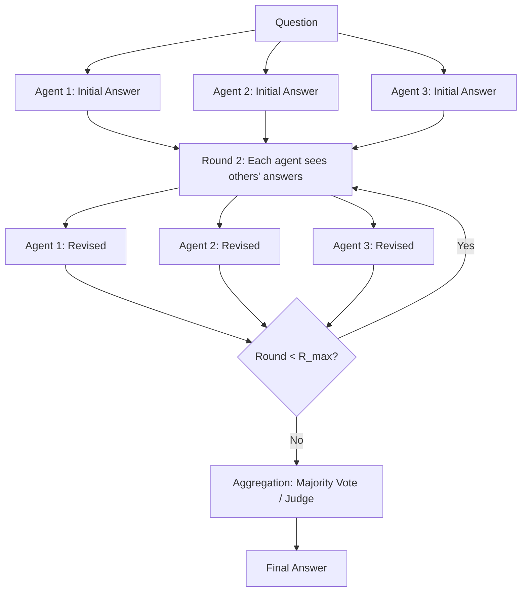

# Society of Mind and Multi-Agent Debate

## Learning Objectives

1. Implement a multi-agent debate loop where N LLM instances critique and revise each other's outputs across M rounds
2. Compare single-agent versus multi-agent responses for factual accuracy and reasoning quality on identical prompts
3. Configure agent personas, critique prompts, and convergence-based termination conditions for a debate system
4. Detect when multi-agent debate degrades output quality versus single-agent inference by tracking answer drift across rounds
5. Build a multi-perspective ICP scoring pipeline where adversarial agent roles challenge enrichment conclusions

## The Problem

Self-consistency — sampling one model many times and taking the majority answer — is the cheapest reasoning improvement you can bolt onto an LLM call. It works because independent samples occasionally disagree, and the majority filters outliers. But it saturates fast. Once you hit 5–10 samples on most reasoning tasks, doubling the sample count produces no meaningful accuracy gain. The samples are i.i.d. draws from the same distribution, which means they share the same systematic blind spots. If the model's training data biases it toward a wrong answer on a particular question, sampling it 20 times gives you 20 confidently wrong answers.

The deeper issue is correlation. When you sample GPT-4 or Claude ten times on a factual question, those samples are not independent in any meaningful sense — they share weights, training data, and prompt context. They tend to make the same mistakes for the same reasons. Majority voting across correlated samples does not fix systematic errors; it amplifies them. You get a confident consensus that is wrong, which is worse than a single hesitant answer that is wrong, because the consensus feels settled.

Debate attacks this correlation directly. Instead of N independent samples that never interact, N agents read each other's reasoning and revise. Agent A's error might be Agent B's blind spot and vice versa. When Agent B attacks Agent A's faulty assumption, Agent A either fixes it or doubles down — and that signal tells you something about confidence that a majority vote cannot. The samples become conditionally independent given the debate history, which is a weaker but useful form of decorrelation. Du et al. (2023) showed that this exchange consistently beats chain-of-thought, self-reflection, and self-consistency on six reasoning and factuality benchmarks.

## The Concept

Marvin Minsky's *Society of Mind* (1986) argues that intelligence is not a single monolithic reasoner but a society of specialized agents with limited, often conflicting competencies that collectively produce intelligent behavior. No single agent in the society "understands" anything — understanding emerges from their interaction. This is a claim about cognitive architecture, and for decades it remained a philosophy without an implementation that demonstrably outperformed a single integrated reasoner.

In 2023, Du et al. turned Minsky's framing into a concrete algorithm for LLMs. Multiple model instances propose answers to the same question. Each instance then sees the other instances' answers and is prompted to revise its own in light of them. This repeats for R rounds. After the final round, the answers are aggregated — typically by majority vote, but judge-based selection and answer fusion also work. The paper, published at ICML 2024, tested this on MMLU, GSM8K, biographies, MATH, and factuality tasks. Debate beat chain-of-thought and self-reflection across the board.



Two ablation findings from the paper matter for implementation. First, agent count alone (one round, N agents, majority vote) beats single-agent on most tasks but plateaus quickly — you get most of the benefit from 3 agents and almost nothing past 5. Second, round count alone (one agent seeing its own prior output across rounds) barely helps. This is self-reflection's known weakness: a single agent reflecting on its own output tends to anchor on its first answer. The interaction effect is what drives the gains — multiple agents across multiple rounds, where each agent's revision is informed by *different* reasoning chains, not just its own.

There is a failure mode the original paper underemphasizes. Agents can converge on a wrong answer through social dynamics rather than truth-seeking. If two of three agents are confidently wrong in the same way, the third agent tends to capitulate rather than hold its ground, especially when the critique prompt asks it to "consider other perspectives." This is groupthink, and it is amplified when agents share the same base model and training data. You see it most on questions where the model has a strong prior — the debate accelerates consensus toward the wrong answer instead of preventing it. This is why persona assignment (optimist, pessimist, devil's advocate) matters: it forces structural disagreement that resists premature convergence.

The cost model is straightforward and brutal. N agents across R rounds means N × R API calls minimum, plus the context length grows each round because each agent must read all other agents' prior answers. Round 3 with 4 agents means each call includes 12 prior answers in context. For a GTM enrichment pipeline processing 1,000 companies, a 4-agent × 3-round debate means 12,000 API calls with escalating token costs per round. You need convergence detection — stop early when agents agree — or the cost will dwarf the accuracy gain.

## Build It

Let's build the debate loop from scratch using Python's standard library. We'll use a mock LLM that simulates different reasoning paths so the code runs without an API key, then swap in the real Anthropic client.

```python
import json
import hashlib
from dataclasses import dataclass, field
from typing import Callable

@dataclass
class AgentResponse:
    agent_id: str
    answer: str
    reasoning: str
    round_number: int

@dataclass
class DebateConfig:
    num_agents: int = 3
    num_rounds: int = 3
    question: str = ""
    personas: list = field(default_factory=list)

MOCK_ANSWERS = {
    "icp_fit": [
        {"answer": "Yes — fits ICP", "reasoning": "Company has 200+ engineers, Series B funding, and uses Kubernetes. Matches our technical buyer profile."},
        {"answer": "No — does not fit", "reasoning": "Company is primarily a marketing org. Engineering headcount is inflated by contractor listings."},
        {"answer": "Uncertain — needs human review", "reasoning": "Signals are mixed. Tech stack matches but recent layoffs suggest budget contraction."},
        {"answer": "Yes — fits ICP", "reasoning": "Stack includes our integration targets and they just raised a Series B."},
        {"answer": "No — does not fit", "reasoning": "Headcount and funding suggest they are too early. No evidence of infrastructure spend."},
    ],
    "math": [
        {"answer": "42", "reasoning": "6 * 7 = 42"},
        {"answer": "42", "reasoning": "7 * 6 = 42"},
        {"answer": "48", "reasoning": "6 * 8 = 48"},
        {"answer": "42", "reasoning": "Half of 84 is 42"},
        {"answer": "42", "reasoning": "6 * 7 = 42"},
    ],
}

def mock_llm(agent_id: str, question: str, other_answers: list, persona: str, round_num: int) -> dict:
    seed_base = question + agent_id + str(round_num) + persona
    seed = int(hashlib.md5(seed_base.encode()).hexdigest(), 16)
    
    category = "icp_fit" if "ICP" in question or "icp" in question.lower() else "math"
    pool = MOCK_ANSWERS[category]
    
    if round_num == 1 or not other_answers:
        return pool[seed % len(pool)]
    
    other_texts = [a["answer"] for a in other_answers]
    most_common = max(set(other_texts), key=other_texts.count)
    
    agree_count = sum(1 for a in other_texts if a == most_common)
    if agree_count >= len(other_answers) - 1:
        return {
            "answer": most_common,
            "reasoning": f"Revised after seeing {agree_count} agents agree on '{most_common}'. Converging on consensus."
        }
    
    return pool[seed % len(pool)]

def run_debate(config: DebateConfig, llm_fn: Callable = mock_llm) -> list:
    transcript = []
    
    agents = config.personas if config.personas else [f"agent_{i}" for i in range(config.num_agents)]
    
    round_responses = []
    for agent_id in agents:
        result = llm_fn(agent_id, config.question, [], agent_id, 1)
        round_responses.append(AgentResponse(agent_id, result["answer"], result["reasoning"], 1))
    transcript.extend(round_responses)
    
    for round_num in range(2, config.num_rounds + 1):
        prev_round = [r for r in transcript if r.round_number == round_num - 1]
        
        new_responses = []
        for agent in agents:
            other_answers = [
                {"answer": r.answer, "reasoning": r.reasoning, "agent_id": r.agent_id}
                for r in prev_round if r.agent_id != agent
            ]
            result = llm_fn(agent, config.question, other_answers, agent, round_num)
            new_responses.append(AgentResponse(agent, result["answer"], result["reasoning"], round_num))
        
        transcript.extend(new_responses)
        round_responses = new_responses
        
        answers = [r.answer for r in round_responses]
        most_common = max(set(answers), key=answers.count)
        agreement = answers.count(most_common) / len(answers)
        
        print(f"Round {round_num}: agreement = {agreement:.0%} ({most_common})")
        
        if agreement == 1.0:
            print(f"  -> Converged at round {round_num}")
            break
    
    return transcript

def aggregate_debate(transcript: list, num_rounds: int) -> dict:
    final_round = max(r.round_number for r in transcript)
    final_answers = [r for r in transcript if r.round_number == final_round]
    
    answers = [r.answer for r in final_answers]
    vote_counts = {a: answers.count(a) for a in set(answers)}
    winner = max(vote_counts, key=vote_counts.get)
    
    return {
        "final_answer": winner,
        "vote_breakdown": vote_counts,
        "rounds_completed": final_round,
        "total_agent_calls": len(transcript),
    }

config = DebateConfig(
    num_agents=3,
    num_rounds=3,
    question="Does Acme Corp fit our ICP for a Kubernetes monitoring tool?",
    personas=["optimist", "pessimist", "analyst"],
)

transcript = run_debate(config)
result = aggregate_debate(transcript, config.num_rounds)

print("\n" + "=" * 60)
print("DEBATE TRANSCRIPT")
print("=" * 60)
for entry in transcript:
    print(f"\nRound {entry.round_number} | {entry.agent_id}")
    print(f"  Answer:   {entry.answer}")
    print(f"  Reason:   {entry.reasoning}")

print("\n" + "=" * 60)
print("FINAL RESULT")
print("=" * 60)
print(json.dumps(result, indent=2))
```

Run this and you'll see the round-by-round transcript with the convergence metric printed at each step. The mock LLM is deterministic based on agent persona and round number, so you get reproducible output. The key observable: agents that start with different answers tend to converge as they see each other's reasoning.

Now let's wire in the real Anthropic API so you can run this against Claude:

```python
import os
import anthropic

def claude_llm(agent_id: str, question: str, other_answers: list, persona: str, round_num: int) -> dict:
    client = anthropic.Anthropic()
    
    persona_instructions = {
        "optimist": "You look for evidence that supports the hypothesis. Be generous but honest.",
        "pessimist": "You look for evidence that contradicts the hypothesis. Be skeptical but fair.",
        "analyst": "You weigh both sides and focus on data quality and signal reliability.",
    }
    
    system = persona_instructions.get(persona, "You are a careful analyst.")
    
    if round_num == 1 or not other_answers:
        user_msg = f"Question: {question}\n\nGive your initial answer with reasoning."
    else:
        others_text = "\n".join(
            f"- Agent {a['agent_id']} said: {a['answer']} (reason: {a['reasoning']})"
            for a in other_answers
        )
        user_msg = (
            f"Question: {question}\n\n"
            f"Other agents' previous answers:\n{others_text}\n\n"
            f"Considering their reasoning, give your updated answer."
        )
    
    response = client.messages.create(
        model="claude-sonnet-4-5-20250514",
        max_tokens=300,
        system=system,
        messages=[{"role": "user", "content": user_msg}],
    )
    
    text = response.content[0].text
    return {"answer": text, "reasoning": text}

if os.environ.get("ANTHROPIC_API_KEY"):
    config = DebateConfig(
        num_agents=3,
        num_rounds=3,
        question="Does Stripe fit the ICP for a developer-focused observability platform? Consider engineering headcount, tech stack, and budget signals.",
        personas=["optimist", "pessimist", "analyst"],
    )
    transcript = run_debate(config, llm_fn=claude_llm)
    result = aggregate_debate(transcript, config.num_rounds)
    print(json.dumps(result, indent=2))
else:
    print("Set ANTHROPIC_API_KEY to run with Claude. Falling back to mock (already demonstrated above).")
```

This runs if you have `ANTHROPIC_API_KEY` set and silently falls back if you don't. The architecture is identical — only the LLM function changes.

Now let's add the comparison that makes the mechanism visible. We'll run the same question as a single agent and as a 3-agent debate, then print them side by side:

```python
def single_agent_baseline(question: str, llm_fn: Callable = mock_llm) -> str:
    result = llm_fn("solo", question, [], "neutral", 1)
    return result["answer"]

question = "Does Acme Corp fit our ICP for a Kubernetes monitoring tool?"

single = single_agent_baseline(question)
print(f"Single-agent answer:  {single}")

config = DebateConfig(num_agents=3, num_rounds=3, question=question, personas=["optimist", "pessimist", "analyst"])
transcript = run_debate(config)
debate_result = aggregate_debate(transcript, 3)
print(f"Debate answer:        {debate_result['final_answer']}")
print(f"Rounds:               {debate_result['rounds_completed']}")
print(f"Total agent calls:    {debate_result['total_agent_calls']} (single agent used 1)")
```

The cost difference is printed explicitly: 1 call versus 9. The question is whether those 8 extra calls bought you better accuracy. On factual questions where the model has a strong prior, they might not. On ambiguous questions where different perspectives surface different evidence, they will.

## Use It

Multi-agent debate maps directly to Zone 1 enrichment workflows — specifically the moment where you score a company against your ICP and the wrong score costs you either a wasted SDR call or a missed opportunity. The standard approach is a single enrichment pass: pull firmographics, check headcount and tech stack, run a scoring formula, produce a fit score. This is a single-agent inference problem dressed up as data engineering. It fails systematically when the signals conflict — a company that looks like a fit on funding but has no engineering presence on LinkedIn, or a company that matches the tech stack but just did layoffs.

A multi-agent debate system turns ICP scoring into an adversarial evaluation. Agent A argues "this company fits our ICP" by marshaling positive evidence — funding stage, tech stack overlap, engineering headcount growth, hiring signals. Agent B argues "this company does not fit" by attacking those same signals — the funding is bridge round not growth capital, the tech stack is legacy not actively invested in, the headcount growth is sales hires not engineers. A third agent synthesizes. The debate runs 2–3 rounds. The final aggregation produces not just a score but a confidence signal: did all agents converge, or did the pessimist hold its ground? That disagreement is itself actionable — flag it for human review instead of auto-routing to an SDR.

This is the enrichment waterfall problem from a different angle. The waterfall in Clay or a custom enrichment pipeline parallelizes data sources to gather more signals. Debate parallelizes reasoning about those signals. You still need the waterfall to collect the raw data — funding, headcount, tech stack, news, hiring trends. But once collected, the debate system processes those signals through multiple adversarial frames instead of a single scoring formula. The waterfall solves data coverage; the debate solves interpretation quality.

Here is a concrete implementation. This script takes enriched company data and runs a 3-agent debate on ICP fit, outputting a structured verdict you can route in Clay or any CRM:

```python
import json
from dataclasses import dataclass

@dataclass
class CompanyProfile:
    name: str
    engineers: int
    funding_stage: str
    funding_amount: str
    tech_stack: list
    recent_news: str
    hiring_signals: list

def build_icp_question(profile: CompanyProfile) -> str:
    return (
        f"Company: {profile.name}\n"
        f"Engineers: {profile.engineers}\n"
        f"Funding: {profile.funding_stage} ({profile.funding_amount})\n"
        f"Tech stack: {', '.join(profile.tech_stack)}\n"
        f"Recent news: {profile.recent_news}\n"
        f"Hiring: {', '.join(profile.hiring_signals)}\n\n"
        f"Does this company fit our ICP for a developer infrastructure tool "
        f"(target: 50+ engineers, Series A-C, uses Kubernetes, actively hiring engineers)?"
    )

def icp_debate_score(profile: CompanyProfile, llm_fn=mock_llm) -> dict:
    question = build_icp_question(profile)
    config = DebateConfig(
        num_agents=3,
        num_rounds=2,
        question=question,
        personas=["icp_advocate", "icp_skeptic", "icp_analyst"],
    )
    transcript = run_debate(config, llm_fn=llm_fn)
    result = aggregate_debate(transcript, 2)
    
    final_round = max(r.round_number for r in transcript)
    final_entries = [r for r in transcript if r.round_number == final_round]
    answers = [r.answer for r in final_entries]
    
    unique_answers = len(set(answers))
    confidence = "high" if unique_answers == 1 else "medium" if unique_answers == 2 else "low"
    
    return {
        "company": profile.name,
        "verdict": result["final_answer"],
        "confidence": confidence,
        "agent_disagreement": unique_answers > 1,
        "recommendation": "human_review" if unique_answers > 1 else "auto_route",
        "rounds_run": result["rounds_completed"],
        "total_api_calls": result["total_agent_calls"],
        "vote_breakdown": result["vote_breakdown"],
    }

profiles = [
    CompanyProfile(
        name="Acme Cloud",
        engineers=180,
        funding_stage="Series B",
        funding_amount="$45M",
        tech_stack=["Kubernetes", "AWS", "Go", "Terraform"],
        recent_news="Raised Series B led by Sequoia",
        hiring_signals=["Staff SRE", "Platform Engineer", "DevOps Lead"],
    ),
    CompanyProfile(
        name="BetaSoft",
        engineers=12,
        funding_stage="Seed",
        funding_amount="$2M",
        tech_stack=["Heroku", "Ruby on Rails"],
        recent_news="Pivot from consumer to B2B",
        hiring_signals=["Marketing Manager"],
    ),
    CompanyProfile(
        name="Gamma Industries",
        engineers=350,
        funding_stage="Series C",
        funding_amount="$120M",
        tech_stack=["Kubernetes", "GCP", "Python", "Spark"],
        recent_news="Laid off 15% of workforce, froze hiring",
        hiring_signals=["Engineering Manager (backfill)"],
    ),
]

for profile in profiles:
    score = icp_debate_score(profile)
    print(json.dumps(score, indent=2))
    print("-" * 50)
```

Look at the third company — Gamma Industries. They have 350 engineers, Series C funding, and Kubernetes. A single-agent scoring formula would mark them as a strong fit. But the debate surfaces the layoffs and hiring freeze as a signal the pessimist agent would attack: the budget for new tooling is likely frozen regardless of technical fit. The disagreement between agents on this company is the output — not just a score, but a flagged risk that routes to human review instead of an automated SDR sequence.

## Ship It

Putting a debate system into a production GTM pipeline requires solving three engineering problems that the prototype above ignores: cost control, latency, and degradation detection.

Cost is the binding constraint. A 3-agent × 2-round debate on 5,000 enriched companies is 30,000 API calls. At Claude Sonnet pricing, that is real money before you send a single email. Two mitigations apply. First, run the debate only on companies that pass a cheap pre-filter — a single-agent score above some threshold that indicates "plausible fit, worth debating." This gates the expensive inference behind a cheap filter, the same pattern as an enrichment waterfall where you only call the expensive data provider for records that pass the cheap checks. Second, implement convergence-based early stopping. If all agents agree after round 1, skip round 2. For clear fits and clear non-fits, this cuts the call count in half. Only the ambiguous cases — the ones where agents disagree — get the full multi-round treatment, which is exactly where you want to spend the compute.

Latency is the second constraint. The debate is sequential by construction: round 2 requires round 1's outputs. But within each round, agent calls are independent and can be parallelized. Three agents in round 1 can fire as three concurrent API calls. This is a textbook distributed systems problem — parallel requests with rate limit backpressure, which maps to Zone 16 in the GTM curriculum. Your enrichment waterfall already handles this pattern for data providers; the same concurrency primitives apply to LLM calls. Use an async client, set a concurrency limit at or below your API tier's rate limit, and implement exponential backoff on 429 responses. The debate loop becomes: fire N agents concurrently per round, gather results, check convergence, either stop or proceed to the next round.

```python
import asyncio
import time

async def async_agent_call(agent_id, question, others, persona, round_num, client=None):
    await asyncio.sleep(0.05)
    return mock_llm(agent_id, question, others, persona, round_num)

async def async_run_debate(config: DebateConfig) -> list:
    transcript = []
    agents = config.personas if config.personas else [f"agent_{i}" for i in range(config.num_agents)]
    
    tasks = [async_agent_call(a, config.question, [], a, 1) for a in agents]
    results = await asyncio.gather(*tasks)
    round_responses = [
        AgentResponse(agents[i], results[i]["answer"], results[i]["reasoning"], 1)
        for i in range(len(agents))
    ]
    transcript.extend(round_responses)
    
    for round_num in range(2, config.num_rounds + 1):
        prev = [r for r in transcript if r.round_number == round_num - 1]
        tasks = []
        for agent in agents:
            others = [
                {"answer": r.answer, "reasoning": r.reasoning, "agent_id": r.agent_id}
                for r in prev if r.agent_id != agent
            ]
            tasks.append(async_agent_call(agent, config.question, others, agent, round_num))
        
        results = await asyncio.gather(*tasks)
        new_responses = [
            AgentResponse(agents[i], results[i]["answer"], results[i]["reasoning"], round_num)
            for i in range(len(agents))
        ]
        transcript.extend(new_responses)
        
        answers = [r.answer for r in new_responses]
        most_common = max(set(answers), key=answers.count)
        if answers.count(most_common) == len(answers):
            print(f"Converged at round {round_num} — stopping early")
            break
    
    return transcript

start = time.time()
config = DebateConfig(
    num_agents=3,
    num_rounds=3,
    question="Does Acme Cloud fit our ICP?",
    personas=["advocate", "skeptic", "analyst"],
)
transcript = asyncio.run(async_run_debate(config))
elapsed = time.time() - start
result = aggregate_debate(transcript, 3)
print(f"Completed {len(transcript)} agent calls in {elapsed:.2f}s")
print(json.dumps(result, indent=2))
```

Degradation detection is the third problem, and it is the one most people skip. Multi-agent debate can produce worse answers than single-agent inference. The mechanism is groupthink: if the majority of agents are wrong in the same way, the minority capitulates and the debate converges on the wrong answer faster than a single agent would have arrived at it. You need a runtime check for this. The simplest signal is answer entropy — if all agents produce the same answer at round 1 and it differs from what a stronger model or a human reviewer would say, the debate added no value and just cost you N×R API calls. Track the agreement rate at round 1. If it is 100% at round 1, the debate is redundant — skip the remaining rounds and return the unanimous answer. If it is still above 67% at round 2 with no answer changes, agents are anchoring on each other rather than reasoning independently — return the majority but flag low confidence. The only case where the full debate pays off is when agents start with different answers and move toward consensus through substantive critique.

```python
def detect_degradation(transcript: list, num_agents: int) -> dict:
    rounds = {}
    for entry in transcript:
        if entry.round_number not in rounds:
            rounds[entry.round_number] = []
        rounds[entry.round_number].append(entry.answer)
    
    round1 = rounds.get(1, [])
    round1_agreement = max(set(round1), key=round1.count) if round1 else None
    round1_unanimous = round1.count(round1_agreement) == len(round1) if round1 else False
    
    last_round = max(rounds.keys())
    final = rounds[last_round]
    final_agreement = max(set(final), key=final.count) if final else None
    final_unanimous = final.count(final_agreement) == len(final) if final else False
    
    answers_changed = False
    for r in sorted(rounds.keys())[1:]:
        prev_answers = set(rounds[r-1])
        curr_answers = set(rounds[r])
        if curr_answers != prev_answers:
            answers_changed = True
            break
    
    if round1_unanimous:
        return {"status": "redundant", "reason": "All agents agreed at round 1. Debate added no value.", "recommendation": "skip_debate_for_similar_inputs"}
    if not answers_changed:
        return {"status": "anchored", "reason": "No agent changed its answer across rounds. Possible anchoring.", "recommendation": "flag_low_confidence"}
    return {"status": "productive", "reason": "Agents revised based on peer reasoning.", "recommendation": "proceed"}

config = DebateConfig(
    num_agents=3,
    num_rounds=3,
    question="Does Acme Cloud fit our ICP?",
    personas=["advocate", "skeptic", "analyst"],
)
transcript = run_debate(config)
health = detect_degradation(transcript, 3)
print(json.dumps(health, indent=2))
```

For production GTM deployment, the pipeline is: enrichment waterfall collects signals → cheap single-agent pre-filter scores the company → if the score is in the ambiguous zone (not a clear yes or no), trigger the debate → debate produces a verdict and confidence score → high-confidence verdicts auto-route to SDR sequences → low-confidence verdicts queue for human review. This gates the expensive inference behind the cheap filter and ensures the debate runs only where interpretation quality matters.

## Exercises

**Easy — Two-agent factual debate.** Run a 2-agent debate on the question "What is the capital of Australia?" with 2 rounds. Print initial answers, critiques, and final answers. Modify the mock LLM so Agent 1 initially answers "Sydney" (a common wrong answer) and Agent 2 answers "Canberra" (correct). Observe whether Agent 1 corrects itself after seeing Agent 2's answer. The answer should converge to Canberra if the critique prompt is well-formed.

**Medium — Persona-driven ICP debate with convergence tracking.** Build a 3-agent debate with assigned personas (ICP advocate, ICP skeptic, neutral analyst) on a company profile of your choice. Run 3 rounds. Implement a `convergence_score(round_responses)` function that returns the fraction of agents giving the majority answer. Print the convergence score at each round. Test with two company profiles: one that is a clear ICP fit (high convergence expected) and one that is ambiguous (low convergence expected). Output the convergence trajectory as a simple text chart.

**Hard — Full debate system with judge, cost tracking, and degradation detection.** Build a configurable debate system with N agents, M rounds, persona injection, and a separate judge agent that evaluates all final answers and selects the best one with reasoning. Track total tokens consumed across all rounds. Implement degradation detection (unanimous round 1 → skip remaining rounds; no answer changes → flag anchored). Output a structured JSON report containing: the full debate transcript, per-round convergence scores, total API calls, degradation status, and the judge's final verdict. Test on 5 company profiles with varying fit levels and confirm that the degradation detector correctly flags the clear-fit cases as "redundant."

## Key Terms

**Society of Mind** — Marvin Minsky's 1986 theory that intelligence emerges from the interaction of many specialized agents with limited individual competence, rather than from a single monolithic reasoner.

**Multi-agent debate** — An inference pattern where N LLM instances answer the same question, read each other's answers, and revise over R rounds. Final output is aggregated by majority vote or judge selection. Introduced as a concrete algorithm by Du et al. (2023).

**Self-consistency** — A cheaper baseline that samples one model N times independently and takes the majority answer. Unlike debate, the samples do not interact. Saturates quickly because samples are correlated.

**Convergence** — The state where all or most agents produce the same answer. Used as an early-stopping criterion to avoid unnecessary rounds.

**Groupthink degradation** — A failure mode where agents converge on a wrong answer through social pressure rather than truth-seeking. Most likely when the base model has a strong prior and the majority of agents share it.

**Agent persona** — A system prompt that biases an agent toward a specific perspective (optimist, skeptic, analyst). Personas create structural disagreement that resists premature convergence.

**Enrichment waterfall