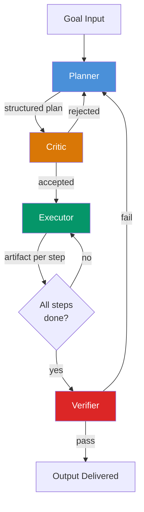

# Role Specialization — Planner, Critic, Executor, Verifier

## Learning Objectives

1. **Implement** a four-role decomposition pipeline (Planner, Critic, Executor, Verifier) in Python with distinct system prompts and logged stage outputs.
2. **Trace** pipeline failures to specific role breakdowns — distinguish a Planner gap (missing steps) from a Verifier gap (false approval) from a Critic gap (no rejection criteria).
3. **Compare** full four-role pipelines against subset configurations (Planner+Executor only) and predict where each fails.
4. **Configure** role-specific system prompts that enforce distinct responsibilities, tool access, and success criteria per stage.
5. **Design** role assignments for a novel multi-step GTM task, including which roles to skip and under what latency/cost constraints.

## The Problem

A single LLM call asked to "research this account and write a summary" is doing four jobs at once: deciding what to research, executing the research, judging whether the results are good enough, and validating that the output meets the original goal. Each of these jobs has different success criteria. The planner needs breadth — "what are all the things we should check?" The executor needs depth — "go fetch this specific data point." The critic needs adversarial reasoning — "is this source trustworthy?" The verifier needs deterministic checks — "do we have at least 3 of 5 required fields?" When you smash these into one prompt, the model optimizes for none of them.

This is why generic multi-agent systems also fail. Three copies of "you are a helpful research assistant" in a group chat produce three flavors of the same mediocre research. You can add more agents, add more rounds of conversation, and still not cross the quality threshold — because every agent is doing the same job with slightly different randomization.

The fix is not more agents. It is *different* agents with *different* tools and *different* success criteria. MetaGPT formalized this as Standardized Operating Procedures encoded into role-specific prompts — Product Manager, Architect, Project Manager, Engineer, QA Engineer — following the principle that code structure mirrors team SOPs. ChatDev chained designer, programmer, reviewer, and tester through a structured "chat chain" where agents explicitly request missing details from each other, reducing hallucination through communicative cross-checking.

The verifier role turns out to be load-bearing. Cemri et al. (MAST, arXiv:2503.13657) showed that every multi-agent failure they studied could be traced to missing or broken verification — not to a bad executor or a weak planner, but to the absence of a role whose only job is to run deterministic checks and reject. PwC reported a 7× accuracy gain (10% → 70%) from adding structured validation loops in CrewAI, which is essentially injecting a Verifier role into pipelines that previously had none.

## The Concept

### The four canonical roles

**Planner.** Reads the goal, produces a step list or spec. Its only job is decomposition: break "research this account" into ordered, atomic steps ("find tech stack," "find funding stage," "find recent hiring signals"). Tools: knowledge retrieval, documentation, prior plans. Output: a structured plan — typically a list of steps with dependencies and success criteria per step. The Planner does not execute anything. It does not have access to the enrichment API or the code compiler. This restriction is the point: the Planner optimizes for completeness of the plan, not for feasibility of any single step.

**Critic.** Reads the plan before execution begins. Its job is adversarial review: "will this plan actually achieve the goal? Are there missing steps? Are the success criteria testable? Is the ordering wrong?" Tools: read-only access to the plan and the original goal. Output: accept/reject with specific reasons. The Critic is optional for low-stakes tasks (where a bad plan wastes seconds) and mandatory for high-stakes tasks (where a bad plan wastes hundreds of API calls or writes bad data to a CRM).

**Executor.** Reads one plan step at a time, produces the artifact for that step. Tools: the actual work tools — code compiler, shell, API client, web scraper, database connection. Output: the artifact (code, research findings, enriched data). The Executor has no access to the original goal. It only sees its current step. This isolation prevents the Executor from "improvising" — going off-script because it thinks it knows better than the plan.

**Verifier.** Reads the final artifact and runs a deterministic check against the original goal. Tools: test runner, type checker, schema validator, completeness threshold. Output: pass/fail with specific gaps. The Verifier is not an LLM making a judgment call — or if it is, that LLM has a narrow, deterministic checklist. "Does the output contain the company's funding stage? Yes/no." Not "is the output good?"

### The pipeline flow



The Critic-to-Planner feedback loop is the most important structural decision. When the Critic rejects a plan, the Planner re-plans with the Critic's feedback appended to context. This loop must have a max-retry limit — otherwise a broken Planner and a strict Critic will loop forever, burning tokens.

The Verifier-to-Planner feedback loop is similar but triggers on the *output*, not the plan. If the Verifier finds the execution is incomplete (missing required fields, failed schema validation), it sends the Planner back to re-plan — possibly adding steps the original plan missed.

### When to use subset configurations

Not every task needs all four roles. The decision framework is:

| Configuration | Use When | Risk |
|---|---|---|
| Planner + Executor | Low-stakes, idempotent, fast (e.g., draft an email subject line) | No quality gate; bad output ships |
| Planner + Executor + Verifier | Medium-stakes, structured output (e.g., enrich a lead record) | No plan review; wasted execution if plan is flawed |
| Full four-role | High-stakes, expensive to undo, regulated (e.g., write to CRM, send outbound) | Token cost ×4, latency ×4 |

The cost math is straightforward: each role is a separate LLM call. A four-role pipeline for a single task costs roughly 4× a single-call pipeline. If you are processing 10,000 accounts, that is 40,000 API calls instead of 10,000. The question is whether the quality gate prevents enough bad outputs to justify the cost. For enrichment waterfalls writing to a CRM — where bad data propagates and is expensive to clean — the answer is almost always yes.

## Build It

Here is a four-role pipeline in Python. It uses a mock LLM function so it runs without API keys — but the prompt structure, stage isolation, and logging are identical to what you would build with real API calls. Swap the `mock_llm` function for an actual API call and the pipeline works in production.

```python
import json
import time

PLANNER_PROMPT = """You are the PLANNER. Your only job is to decompose a goal into ordered, atomic steps.

Rules:
- Output ONLY a JSON list of step objects.
- Each step has: "step_id" (int), "action" (string), "success_criteria" (string).
- Do not execute anything. Do not add commentary. Output the JSON list only.

Goal: {goal}

Plan:"""

CRITIC_PROMPT = """You are the CRITIC. Your job is to review a plan before execution.

Rules:
- Check: Are there missing steps? Are success criteria testable? Is ordering correct?
- Output ONLY a JSON object: {{"approved": true/false, "reason": "..."}}
- If rejecting, name the specific gap.

Goal: {goal}
Plan: {plan}

Critique:"""

EXECUTOR_PROMPT = """You are the EXECUTOR. You execute exactly ONE step from a plan.

Rules:
- You see only this step. You do not see the original goal.
- Output ONLY a JSON object: {{"step_id": int, "result": "..."}}
- Be specific and factual.

Step: {step}

Result:"""

VERIFIER_PROMPT = """You are the VERIFIER. Your job is to check the final output against the original goal.

Rules:
- Check each step's success_criteria against its result.
- Output ONLY a JSON object: {{"passed": true/false, "gaps": ["...", "..."]}}

Goal: {goal}
Results: {results}

Verdict:"""

def mock_llm(prompt, role):
    responses = {
        "planner": json.dumps([
            {"step_id": 1, "action": "identify company domain", "success_criteria": "domain URL found"},
            {"step_id": 2, "action": "find funding stage from public sources", "success_criteria": "funding stage stated"},
            {"step_id": 3, "action": "identify current CRO or VP of Sales", "success_criteria": "name and title found"},
        ]),
        "critic_approve": json.dumps({"approved": True, "reason": "Steps are ordered correctly and criteria are testable."}),
        "critic_reject": json.dumps({"approved": False, "reason": "Missing step: no check for recent leadership changes."}),
        "executor_1": json.dumps({"step_id": 1, "result": "Company domain: acme.io"}),
        "executor_2": json.dumps({"step_id": 2, "result": "Funding stage: Series B, raised $32M in March 2024"}),
        "executor_3": json.dumps({"step_id": 3, "result": "CRO: Jane Smith, started January 2025"}),
        "verifier_pass": json.dumps({"passed": True, "gaps": []}),
    }
    return responses.get(role, "{}")

def run_pipeline(goal, critic_mode="approve", verbose=True):
    log = {}

    if verbose:
        print(f"\n{'='*60}")
        print(f"GOAL: {goal}")
        print(f"{'='*60}")

    print("\n[PLANNER] Decomposing goal...")
    plan = json.loads(mock_llm(PLANNER_PROMPT.format(goal=goal), "planner"))
    log["plan"] = plan
    for step in plan:
        print(f"  Step {step['step_id']}: {step['action']}")
        print(f"    Criteria: {step['success_criteria']}")

    print("\n[CRITIC] Reviewing plan...")
    critique = json.loads(mock_llm(
        CRITIC_PROMPT.format(goal=goal, plan=json.dumps(plan)),
        f"critic_{critic_mode}"
    ))
    log["critique"] = critique
    print(f"  Approved: {critique['approved']}")
    print(f"  Reason: {critique['reason']}")

    if not critique["approved"]:
        print("\n[PIPELINE] Plan rejected. In production, this triggers re-planning.")
        print("  (For this demo, continuing with original plan.)")

    results = []
    for step in plan:
        print(f"\n[EXECUTOR] Running step {step['step_id']}...")
        result = json.loads(mock_llm(
            EXECUTOR_PROMPT.format(step=json.dumps(step)),
            f"executor_{step['step_id']}"
        ))
        results.append(result)
        log[f"exec_step_{step['step_id']}"] = result
        print(f"  Result: {result['result']}")

    print("\n[VERIFIER] Checking output against goal...")
    verdict = json.loads(mock_llm(
        VERIFIER_PROMPT.format(goal=goal, results=json.dumps(results)),
        "verifier_pass"
    ))
    log["verifier_verdict"] = verdict
    print(f"  Passed: {verdict['passed']}")
    if verdict["gaps"]:
        print(f"  Gaps: {verdict['gaps']}")
    else:
        print(f"  Gaps: none")

    print(f"\n{'='*60}")
    print("PIPELINE COMPLETE")
    print(f"{'='*60}\n")

    return log

goal = "Research Acme Corp for outbound: find domain, funding stage, and current CRO."
run_pipeline(goal, critic_mode="approve")

print("\n--- Now with Critic rejection ---\n")
run_pipeline(goal, critic_mode="reject")
```

Run this and you will see four distinct stages with their inputs, outputs, and the accept/reject decisions logged. The Critic rejection path demonstrates what happens when the pipeline catches a plan-level flaw before any execution begins — saving three API calls worth of wasted work.

The important structural detail: each role's prompt is isolated. The Executor prompt does not mention the original goal. The Verifier prompt does not mention the plan steps — only the results and the goal. This isolation is what prevents role bleed, where an Executor starts "helping" by going off-plan because it inferred the broader objective.

## Use It

Role specialization is the decomposition pattern behind enrichment waterfalls in GTM tooling. Clay implements a waterfall — a sequential pipeline where each stage has a specific responsibility: one stage plans which data enrichment providers to query and in what order, one stage executes the lookups, and validation logic confirms minimum data completeness before the record is written. [CITATION NEEDED — concept: Clay agent role separation in enrichment waterfall] The same four-role structure applies.

Consider a GTM scenario from the handbook context: a company is scaling its outbound program and has posted two new engineering roles in the past 30 days. You want to research this account for an SDR outreach sequence. Here is how the four roles decompose that task:

The **Planner** reads the goal ("research this account for outbound") and produces steps: (1) identify the company's domain and verify it is the correct entity, (2) find funding stage and recent investment activity, (3) identify the buying committee — specifically whether they have a CRO, VP of Sales, or VP of Marketing, (4) detect job posting signals (the two new engineering roles suggest scaling), (5) check for job-change signals on LinkedIn (an executive who recently joined from a target company is a high-priority contact). Each step has success criteria: "domain verified," "funding stage found with date," "at least one decision-maker name with title."

The **Critic** reviews this plan before any enrichment API is called. It catches gaps: "Step 3 does not account for contacts who recently changed jobs to a relevant role at a different company — this is a primary data source per our GTM playbook." It rejects. The Planner re-plans with a step 6: "check LinkedIn for executives who changed roles in the last 90 days." This rejection saves the team from missing the highest-priority signal.

The **Executor** runs each step in isolation. Step 2 queries the enrichment API for funding data. Step 3 queries the org chart API. Step 4 scrapes the careers page. Each step returns its artifact without knowledge of the other steps' results.

The **Verifier** checks the assembled record against the success criteria. "Domain verified? Yes. Funding stage? Series B, $32M, March 2024. Decision-maker? Jane Smith, CRO, started January 2025. Job-change signal? None detected." If the Verifier finds a gap — say, no decision-maker was found — it rejects, and the pipeline either re-plans or flags the record for manual review before it reaches the CRM.

This maps directly to the distributed systems framing from Zone 16: your enrichment waterfall is a distributed system with parallel requests, rate limit backpressure, and idempotent retries. Role specialization is the *logical* decomposition; the waterfall is the *physical* implementation. The Planner decides which providers to call and in what order. The Executor makes the API calls (potentially in parallel). The Verifier checks whether the combined results meet the completeness threshold. The Critic exists at configuration time — when you design the waterfall ordering and decide whether to add a provider to the chain.

## Ship It

Production pipelines with four roles accumulate cost and latency linearly. Each role is a separate API call, and if you are processing thousands of records, the math matters. A four-role pipeline on 5,000 accounts is 20,000 API calls. At even $0.01 per call (a low estimate for a decent model), that is $200 per run. Run it daily and you are at $6,000/month just for the LLM calls — before enrichment provider costs.

Latency compounds because the roles are sequential. The Executor cannot start until the Critic approves. The Verifier cannot run until all Executor steps finish. A pipeline that takes 3 seconds per role with 3 execution steps takes roughly 3+3+9+3 = 18 seconds end-to-end. For a batch of 1,000 records processed sequentially, that is 5 hours. Parallelism helps, but rate limits constrain how many concurrent pipelines you can run.

The practical decision is when to skip roles. Here is a heuristic grounded in the distributed systems framing from Zone 16:

```python
import time
from dataclasses import dataclass, field
from typing import Callable

@dataclass
class StageTimer:
    timings: dict = field(default_factory=dict)

    def time_stage(self, name: str, fn: Callable, *args, **kwargs):
        start = time.monotonic()
        result = fn(*args, **kwargs)
        elapsed = time.monotonic() - start
        self.timings[name] = elapsed
        return result

def should_skip_critic(stakes_score, latency_budget_ms, avg_critic_ms=3000):
    if stakes_score < 3:
        return True, "low stakes: skipping critic"
    if avg_critic_ms > latency_budget_ms * 0.4:
        return True, f"latency budget: critic would consume {avg_critic_ms}/{latency_budget_ms}ms"
    return False, "running critic"

def should_skip_verifier(stakes_score, latency_budget_ms, avg_verifier_ms=2000, schema_validated=False):
    if schema_validated and stakes_score < 4:
        return True, "schema-validated output at medium stakes: skipping LLM verifier"
    if avg_verifier_ms > latency_budget_ms * 0.3:
        return True, f"latency budget: verifier would consume {avg_verifier_ms}/{latency_budget_ms}ms"
    return False, "running verifier"

def run_pipeline_with_budget(goal, stakes_score, latency_budget_ms, timer=None):
    if timer is None:
        timer = StageTimer()

    skip_c, reason_c = should_skip_critic(stakes_score, latency_budget_ms)
    skip_v, reason_v = should_skip_verifier(stakes_score, latency_budget_ms)

    print(f"\nPipeline config for: {goal}")
    print(f"  Stakes: {stakes_score}/5, Budget: {latency_budget_ms}ms")
    print(f"  Critic: {'SKIP' if skip_c else 'RUN'} ({reason_c})")
    print(f"  Verifier: {'SKIP' if skip_v else 'RUN'} ({reason_v})")

    return {"skip_critic": skip_c, "skip_verifier": skip_v}

run_pipeline_with_budget("Draft email subject line", stakes_score=1, latency_budget_ms=5000)
run_pipeline_with_budget("Enrich lead record", stakes_score=3, latency_budget_ms=5000)
run_pipeline_with_budget("Write to CRM + trigger sequence", stakes_score=5, latency_budget_ms=15000)
```

Run this and you will see the pipeline configuration change based on stakes and latency budget. The low-stakes task skips both Critic and Verifier. The medium-stakes task runs the Critic but skips the Verifier (because the output is schema-validated). The high-stakes task runs all four roles because the cost of bad data in the CRM exceeds the cost of the extra API calls.

Monitoring matters because each role fails differently. Track per-stage failure rates independently: Planner failure (produces incomplete plans), Critic failure (approves bad plans or rejects good ones), Executor failure (API errors, rate limits, missing data), Verifier failure (false approvals or false rejections). A high Critic rejection rate means your Planner prompt is weak — fix the Planner, not the Critic. A high Verifier rejection rate means your Executor is producing incomplete artifacts — fix the Executor or add more enrichment sources.

Fallback behavior when the Verifier rejects: do not silently drop the record. Write it to a quarantine queue with the rejection reason. In the GTM context, a Verifier rejection on an enrichment record means "this account does not have enough data for confident outreach." A human SDR can review quarantined records and decide whether to proceed with incomplete data or skip the account. This is the idempotent retry pattern from distributed systems — failed records go to a dead-letter queue, not back into the main pipeline.

## Exercises

**Easy.** Run the pipeline from Build It on a different goal: "Write a cold email to Jane Smith, CRO at Acme Corp, referencing their Series B and recent engineering hires." Read each stage's output. Confirm that the Planner produces steps, the Critic reviews them, the Executor produces artifacts, and the Verifier checks completeness.

**Medium.** Modify the `CRITIC_PROMPT` to catch a specific failure mode: missing decision-maker identification. Run the pipeline and observe whether the Critic now rejects plans that lack a step for finding the CRO/VP of Sales. Compare the output with and without your Critic modification.

**Hard.** Add a retry loop to the pipeline: when the Critic rejects, send the rejection reason back to the Planner and re-plan. Implement a `max_retries=3` limit. After 3 rejections, escalate to a human (print "ESCALATE: Planner could not satisfy Critic after 3 attempts"). Test with a Critic that always rejects to confirm the escalation triggers.

**Diagnostic.** Given the following stage outputs from a failing pipeline, identify which role broke:
```
Plan: [{"step_id": 1, "action": "find domain", "success_criteria": "domain found"}]
Critique: {"approved": true, "reason": "looks fine"}
Executor step 1: {"step_id": 1, "result": "Could not find domain for this company"}
Verifier: {"passed": true, "gaps": []}
```
Answer: The Critic approved a plan with only one step (missing funding, decision-maker, signals). The Verifier passed despite the Executor returning a failure result. Both roles are broken — the Critic for weak plan review, and the Verifier for not checking whether results actually met success criteria.

## Key Terms

**Role specialization** — Decomposing a multi-step task into discrete roles (Planner, Critic, Executor, Verifier), each with its own system prompt, tool access, and success criteria. Contrasts with homogeneous multi-agent systems where all agents share the same role.

**Planner** — The role responsible for decomposing a goal into ordered, atomic steps with per-step success criteria. Has no execution tools. Optimizes for plan completeness.

**Critic** — The role responsible for reviewing a plan before execution. Adversarial by design. Outputs accept/reject with specific reasons. Optional for low-stakes tasks.

**Executor** — The role responsible for producing artifacts one step at a time. Has access to work tools (APIs, compilers, databases). Does not see the original goal — only the current step.

**Verifier** — The role responsible for deterministic checking of final output against the original goal. Outputs pass/fail with specific gaps. Not a judgment call — a checklist.

**Role bleed** — Failure mode where an Executor infers the broader goal and deviates from its assigned step. Prevented by prompt isolation (Executor prompt does not mention the original goal).

**Enrichment waterfall** — The physical implementation of role specialization in GTM tooling. Sequential pipeline of data providers where the Planner decides ordering, the Executor makes API calls, and validation logic confirms completeness before writing to CRM.

**Dead-letter queue** — The fallback destination for records that fail Verifier checks. In GTM context, quarantined records awaiting human review rather than being silently dropped or written to CRM with incomplete data.

## Sources

- MetaGPT role decomposition and SOP encoding: arXiv:2308.00352
- ChatDev chat chain and communicative dehallucination: arXiv:2307.07924
- Cemri et al. (MAST) on verification as the root cause of multi-agent failures: arXiv:2503.13657
- PwC 7× accuracy gain from structured validation loops in CrewAI: [CITATION NEEDED — concept: PwC CrewAI accuracy benchmark source]
- Clay enrichment waterfall as role specialization pattern: [CITATION NEEDED — concept: Clay agent role separation in enrichment waterfall]
- Zone 16 distributed systems framing for enrichment waterfalls: Living GTM topic map, Zone 16 row