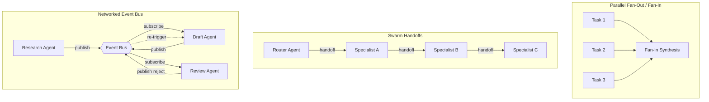

# Parallel / Swarm / Networked Architectures

## Learning Objectives

- **Implement** a parallel fan-out/fan-in pattern that distributes N independent research tasks across concurrent agents and synthesizes results.
- **Trace** control flow through a swarm handoff protocol where agents transfer execution to specialists via serialized context.
- **Build** a networked pipeline using a shared event bus where agents subscribe, produce, and react to messages without a central orchestrator.
- **Compare** the coordination overhead, scalability ceiling, and failure modes of parallel, swarm, and networked architectures.
- **Diagnose** common distributed-agent failures: race conditions on shared state, deadlocks in cyclic handoffs, and divergent results across parallel branches.

## The Problem

A single LLM call is a single-threaded worker. It takes one input, produces one output, and moves on. That model works when you need to draft one email or summarize one document. The moment your scope expands—research 200 accounts, enrich 50 contacts, draft personalized outreach for each, and fact-check every claim—serial execution collapses. A single agent processing one task at a time through a stack of 200 companies at 5 seconds each burns nearly 17 minutes. If one call hangs, everything behind it waits.

You can throw a supervisor at the problem. A supervisor agent plans the work, dispatches subtasks to workers, and collects results. That works for a handful of workers. But scale to dozens or hundreds of concurrent tasks, and the supervisor itself becomes the bottleneck. Every routing decision, every result check, every retry evaluation funnels through one agent. The planning step serializes what should be parallel. If the supervisor is slow to decide which worker gets the next task, your workers sit idle burning wall-clock time.

Parallel, swarm, and networked architectures solve this by distributing cognitive work across multiple agents that run concurrently. The critical design question is how they coordinate. Some don't coordinate at all—they just run in parallel and merge at the end. Some coordinate via handoffs, where one agent passes control (and context) to another like a baton. Others coordinate through shared message channels, where agents publish events and react to each other asynchronously. The pattern you choose determines your throughput ceiling, your latency profile, and your failure modes.

## The Concept

Three architectural patterns address the coordination problem differently. Understanding the mechanism behind each tells you when to use which.

**Parallel fan-out/fan-in** is the simplest. You have N independent tasks. You launch N agents simultaneously, each with no awareness of the others. When all N complete, a synthesis step merges the results. This is map-reduce applied to LLM calls. There is no coordination during execution—only at the merge. Each agent operates in isolation, processes its slice, and returns. The fan-in step must handle contradictions, duplicates, and format mismatches across the N results. This pattern is trivially parallelizable and has no coordination overhead, but it cannot handle tasks where Agent B's work depends on Agent A's output.

**Swarm architecture** introduces coordination via handoffs. An agent receives a task, evaluates it, and either handles it directly or transfers control to another agent that is better suited. OpenAI's Swarm framework (now productionized as the Agents SDK) implements this: a router agent evaluates input, wraps its context into a transfer message, and hands off to a specialist. The specialist may hand off again. There is no centralized orchestrator directing traffic. Control is passed agent-to-agent like a baton. The handoff protocol serializes the current agent's context—the conversation history, any extracted parameters, the task state—into a message the receiving agent picks up. This means handoffs are sequential: the system is concurrent across parallel tasks but serial within a single task's handoff chain.

**Networked architectures** remove the baton entirely. Agents communicate through shared channels—a message queue, an event stream, a shared memory store. Each agent subscribes to events it cares about, processes them, and emits its own events in response. A research agent publishes findings to a queue. A drafting agent consumes those findings and publishes a draft. A review agent consumes the draft and publishes an approval or rejection. No agent tells another what to do. The coordination is emergent from the channel semantics. This is the actor model applied to LLM agents: independent processes communicating via asynchronous messages.



The tradeoffs are explicit. Parallel is simplest to implement and debug—you can reason about each agent in isolation—but agents cannot coordinate mid-task, and the fan-in merge step becomes a bottleneck if N is large. Swarm enables coordination through handoffs, but each handoff is a serial step that adds latency, and a handoff chain of depth 5 means 5 sequential LLM calls before resolution. Networked is the most flexible—it supports cyclic flows, dynamic participant counts, and reactive behavior—but it introduces distributed systems problems: deadlocks if two agents wait on each other's events, race conditions if two agents write to shared state simultaneously, and divergent state if agents process events out of order.

The convergence problem appears in all three. When parallel branches produce contradictory results—one agent says the company uses Salesforce, another says HubSpot—something has to reconcile. Options include last-write-wins (whoever finishes last wins), voting (majority rules across N agents), or a designated judge agent that receives all results and picks the authoritative answer. The choice depends on how much the downstream task depends on correctness. A prospecting list can tolerate last-write-wins. A compliance check cannot.

## Build It

We will build all three patterns using raw async Python and the OpenAI client. No framework abstractions—the coordination mechanisms are explicit in the code so you can see exactly how work is distributed and collected.

First, the shared setup:

```python
import asyncio
import os
import json
from openai import AsyncOpenAI

client = AsyncOpenAI(api_key=os.environ.get("OPENAI_API_KEY"))

MODEL = "gpt-4o-mini"

async def llm(prompt: str, system: str = "You are a helpful assistant.") -> str:
    resp = await client.chat.completions.create(
        model=MODEL,
        messages=[
            {"role": "system", "content": system},
            {"role": "user", "content": prompt},
        ],
        temperature=0.3,
    )
    return resp.choices[0].message.content or ""
```

### Pattern 1: Parallel Fan-Out / Fan-In

Fan-out launches N agents concurrently. Each processes independently. Fan-in collects all results and synthesizes.

```python
async def research_company(name: str) -> dict:
    prompt = f"""Research the company {name}. Return JSON with keys:
    - name: company name
    - product: one-sentence product description
    - icp: ideal customer profile in one sentence
    - signal: one buying signal worth investigating"""
    raw = await llm(prompt, system="You are a B2B research analyst. Be concise and specific.")
    try:
        return json.loads(raw)
    except json.JSONDecodeError:
        return {"name": name, "product": "parse error", "icp": "unknown", "signal": "none"}

async def synthesize_report(results: list[dict]) -> str:
    data = json.dumps(results, indent=2)
    prompt = f"""Here are research summaries for multiple companies:
{data}

Write a 3-paragraph market briefing that identifies:
1. Common patterns across these companies
2. The strongest buying signals
3. Recommended outreach priority (rank top 3)"""
    return await llm(prompt, system="You are a GTM strategist.")

async def fan_out_fan_in():
    companies = ["Clay", "Apollo.io", "ZoomInfo", "Outreach", "Salesloft"]

    results = await asyncio.gather(*[research_company(c) for c in companies])

    print("=== INDIVIDUAL RESULTS ===")
    for r in results:
        print(json.dumps(r, indent=2))

    report = await synthesize_report(results)
    print("\n=== SYNTHESIZED BRIEFING ===")
    print(report)

asyncio.run(fan_out_fan_in())
```

The five `research_company` calls execute concurrently via `asyncio.gather`. None of them knows about the others. The total wall-clock time is approximately the slowest single call, not the sum of all five. The synthesis step runs only after all five return—that is the fan-in.

### Pattern 2: Swarm with Handoffs

A triage agent classifies an inbound request and hands off to a specialist. The specialist resolves or escalates.

```python
async def triage_agent(message: str) -> dict:
    prompt = f"""Classify this inbound support message into exactly one category: billing, technical, or general.
Return JSON: {{"category": "...", "reason": "...", "transferred_to": "..."}}
Message: {message}"""
    raw = await llm(prompt, system="You are a triage router. Classify and transfer.")
    result = json.loads(raw)
    result["transferred_to"] = result["category"] + "_agent"
    return result

async def billing_agent(context: dict) -> dict:
    prompt = f"""A customer sent this message: {context['message']}
Triage reason: {context['triage']['reason']}
Resolve this billing inquiry. Return JSON: {{"resolved": true/false, "response": "...", "escalated": false}}"""
    raw = await llm(prompt, system="You are a billing specialist.")
    return {"agent": "billing", **json.loads(raw)}

async def technical_agent(context: dict) -> dict:
    prompt = f"""A customer sent this message: {context['message']}
Triage reason: {context['triage']['reason']}
Resolve this technical inquiry. Return JSON: {{"resolved": true/false, "response": "...", "escalated": false}}"""
    raw = await llm(prompt, system="You are a technical support specialist.")
    return {"agent": "technical", **json.loads(raw)}

async def general_agent(context: dict) -> dict:
    prompt = f"""A customer sent this message: {context['message']}
Resolve this general inquiry. Return JSON: {{"resolved": true/false, "response": "...", "escalated": false}}"""
    raw = await llm(prompt, system="You are a general support agent.")
    return {"agent": "general", **json.loads(raw)}

SPECIALISTS = {
    "billing": billing_agent,
    "technical": technical_agent,
    "general": general_agent,
}

async def swarm_route(message: str) -> dict:
    triage = await triage_agent(message)
    specialist = SPECIALISTS.get(triage["category"], general_agent)
    context = {"message": message, "triage": triage}
    result = await specialist(context)
    print(f"[SWARM] Triage -> {triage['category']} -> {'resolved' if result.get('resolved') else 'escalated'}")
    return {"triage": triage, "resolution": result}

result = asyncio.run(swarm_route("I was charged twice for my subscription this month."))
print(json.dumps(result, indent=2))
```

The triage agent produces a classification and a transfer target. Control passes to the specialist, which receives the full context (original message plus triage reasoning) in the handoff. The specialist either resolves or escalates. There is no orchestrator—the triage agent decides who goes next, and the specialist runs autonomously.

### Pattern 3: Networked Pipeline via Event Bus

Agents communicate through a shared async queue. No direct calls between agents.

```python
import asyncio
from collections import defaultdict

class EventBus:
    def __init__(self):
        self.subscribers = defaultdict(list)

    def subscribe(self, topic: str, handler):
        self.subscribers[topic].append(handler)

    async def publish(self, topic: str, data: dict):
        for handler in self.subscribers[topic]:
            await handler(data)

async def research_agent(business: str, bus: EventBus):
    findings = await llm(
        f"Research {business}. List 3 key facts relevant for B2B sales outreach.",
        system="You are a research analyst."
    )
    await bus.publish("research.complete", {"business": business, "findings": findings})

async def draft_agent(event: dict, bus: EventBus):
    draft = await llm(
        f"Write a cold outreach email to {event['business']} based on these findings:\n{event['findings']}",
        system="You are an SDR. Keep it under 100 words."
    )
    await bus.publish("draft.complete", {"business": event["business"], "draft": draft})

async def review_agent(event: dict, bus: EventBus):
    review = await llm(
        f"Review this cold email for quality and compliance. Return JSON: {{"approved": true/false, "feedback": "..."}}\nEmail:\n{event['draft']}",
        system="You are a QA reviewer for outbound sales."
    )
    result = json.loads(review)
    await bus.publish("review.complete", {
        "business": event["business"],
        "draft": event["draft"],
        "approved": result.get("approved", False),
        "feedback": result.get("feedback", "")
    })

async def run_networked_pipeline(businesses: list[str]):
    bus = EventBus()

    bus.subscribe("research.complete", lambda e: draft_agent(e, bus))
    bus.subscribe("draft.complete", lambda e: review_agent(e, bus))

    approved_count = 0
    rejected_count = 0

    async def track_results(event: dict):
        nonlocal approved_count, rejected_count
        if event["approved"]:
            approved_count += 1
            print(f"[APPROVED] {event['business']}")
            print(f"  Draft: {event['draft'][:100]}...")
        else:
            rejected_count += 1
            print(f"[REJECTED] {event['business']} — {event['feedback'][:80]}")

    bus.subscribe("review.complete", track_results)

    await asyncio.gather(*[research_agent(b, bus) for b in businesses])

    await asyncio.sleep(0.5)
    print(f"\nPipeline complete: {approved_count} approved, {rejected_count} rejected")

asyncio.run(run_networked_pipeline(["Notion", "Linear", "Figma"]))
```

No agent calls another agent directly. The research agent publishes to `research.complete`. The draft agent subscribes to that topic, processes, and publishes to `draft.complete`. The review agent subscribes to that, processes, and publishes to `review.complete`. The pipeline is defined entirely by subscriptions. Adding a new agent—say, a compliance checker—means subscribing to the right topic. No existing agent changes.

## Use It

Your enrichment waterfall is a distributed system. When Clay executes a waterfall across 5 data providers for 1,000 rows, it fans out parallel requests, applies rate-limit backpressure when a provider throttles, retries failed lookups with exponential backoff, and reconciles conflicts when two providers return different phone numbers for the same contact. That is a parallel fan-out/fan-in architecture with a convergence strategy (typically: provider priority determines which value wins). The same pattern you built in Pattern 1—launch N concurrent tasks, collect results, merge—is what makes enrichment waterfalls work at scale. The synthesis step in the fan-in is where Clay applies merge rules: take the first non-empty value from provider 1, fall back to provider 2, and so on down the waterfall.

The handoff pattern from Pattern 2 maps directly to multi-step GTM workflows. Consider an inbound lead: a triage agent classifies it (SQL vs. SQO vs. unfit), hands off to a scoring agent that appends firmographics, which hands off to a routing agent that assigns to the right AE based on territory. Each handoff carries the accumulated context forward. The latency cost is real—three sequential LLM calls—but the alternative (one mega-prompt that does everything) tends to produce worse results because the model has to juggle classification, enrichment, and routing logic in a single generation.

The networked event bus pattern fits living GTM systems where work flows continuously rather than in batches. Domain warmup runs in parallel with email sending—25 warmup emails per day per inbox while active campaigns send to prospects [CITATION NEEDED — concept: email warmup concurrency schedules]. A networked architecture lets the warmup agent publish "reputation score updated" events that the sending agent subscribes to, automatically throttling send volume when reputation dips. No orchestrator polls and decides—the agents react to shared state through the bus.

Rate limits are the backpressure mechanism that makes or breaks these systems in production. Your fan-out of 200 concurrent OpenAI API calls will hit rate limits. The naive fix—retry immediately—makes it worse because every retried call adds to the load. The correct fix is exponential backoff with jitter: each failed request waits `base_delay * 2^attempt + random(0, 1)` seconds before retrying. This distributes retries over time, reducing peak load on the API. In practice, you also want a concurrency semaphore that caps simultaneous in-flight requests to stay under your tokens-per-minute and requests-per-minute limits:

```python
import asyncio
import random

async def rate_limited_call(prompt: str, semaphore: asyncio.Semaphore, max_retries: int = 5) -> str:
    for attempt in range(max_retries):
        async with semaphore:
            try:
                return await llm(prompt)
            except Exception as e:
                if attempt == max_retries - 1:
                    return f"FAILED after {max_retries} retries: {e}"
                delay = (2 ** attempt) + random.uniform(0, 1)
                print(f"  [RETRY {attempt+1}] backing off {delay:.1f}s")
                await asyncio.sleep(delay)

async def rate_limited_fan_out(prompts: list[str], max_concurrent: int = 5):
    semaphore = asyncio.Semaphore(max_concurrent)
    results = await asyncio.gather(*[rate_limited_call(p, semaphore) for p in prompts])
    for i, r in enumerate(results):
        print(f"[{i}] {r[:80]}...")
    return results

prompts = [f"Summarize the business model of company #{i} in one sentence." for i in range(20)]
asyncio.run(rate_limited_fan_out(prompts, max_concurrent=3))
```

The semaphore caps concurrency at 3 simultaneous calls. When the API returns a 429 (rate limit exceeded), the backoff kicks in. The jitter prevents thundering herd: without it, all retried requests would fire at the exact same offset and hammer the API in synchronized bursts.

## Ship It

Before deploying any of these patterns to production, you need three things: observability, idempotency, and a convergence strategy.

Observability means every agent logs its inputs, outputs, and timing. In a fan-out of 200 concurrent calls, one agent hanging silently for 60 seconds is invisible without per-agent logging. At minimum, log the agent name, start timestamp, end timestamp, token usage, and a success/failure flag. Wrap each agent call in structured logging:

```python
import time
import logging

logging.basicConfig(level=logging.INFO, format="%(asctime)s %(levelname)s %(message)s")
logger = logging.getLogger("agent")

async def observed_call(agent_name: str, prompt: str) -> str:
    start = time.monotonic()
    logger.info(f"[{agent_name}] START")
    try:
        result = await llm(prompt)
        elapsed = time.monotonic() - start
        logger.info(f"[{agent_name}] SUCCESS in {elapsed:.2f}s | output_len={len(result)}")
        return result
    except Exception as e:
        elapsed = time.monotonic() - start
        logger.error(f"[{agent_name}] FAILED in {elapsed:.2f}s | error={e}")
        raise

async def ship_demo():
    tasks = [f"Summarize company {name}" for name in ["Stripe", "Plaid", "Ramp"]]
    results = await asyncio.gather(*[observed_call("research", t) for t in tasks])
    for r in results:
        print(r[:80])

asyncio.run(ship_demo())
```

Idempotency means re-running an agent produces the same result without duplicating side effects. If your research agent writes to a database and the pipeline crashes mid-run, a retry should not create duplicate records. Use a deterministic task ID (e.g., `f"research:{company_name}:{date}"`) as a cache key. Before executing, check if the result already exists. This pattern is critical for enrichment waterfalls: if you enrich 1,000 contacts and the process dies at row 800, you should resume from row 800, not restart from row 1.

For convergence strategy, pick one explicitly. Do not leave it implicit. If two enrichment providers return different email addresses for the same contact, your code should have a documented rule: priority-based (provider 1 wins over provider 2), confidence-based (the provider with higher match score wins), or recency-based (most recently fetched value wins). Write the rule in a comment next to the merge logic. When a sales rep asks why the email bounced, you can trace it back to which provider supplied it and why that provider was chosen.

For the handoff and networked patterns, set a maximum depth or cycle count. A swarm handoff chain of depth 10 means 10 sequential LLM calls—potentially 30+ seconds of latency. A networked pipeline where the review agent rejects and re-triggers the draft agent in a loop will burn tokens indefinitely. Hard-cap both: `max_handoffs = 5` in the swarm, `max_cycles = 3` in the networked pipeline. When the cap is hit, fall back to a human or a default response.

## Exercises

1. **Extend the fan-out to handle failures gracefully.** Modify `fan_out_fan_in` so that if any individual `research_company` call fails (raise an exception), the pipeline continues with the remaining results and logs which companies failed. Hint: `asyncio.gather` has a `return_exceptions` parameter. Print a summary of successes and failures at the end.

2. **Add a second handoff to the swarm.** Modify the swarm so the billing agent can escalate to a `manager_agent` when it cannot resolve the issue. The manager agent should receive the full context (original message, triage reasoning, billing agent's attempted resolution) and produce a final response. Verify the handoff chain by printing each transfer.

3. **Add a rejection loop to the networked pipeline.** Modify the event bus pipeline so that when `review_agent` rejects a draft, it re-publishes to `draft.complete` with the feedback attached, causing the draft agent to revise. Cap the revision cycle at 3 attempts. After 3 rejections, publish to a `draft.failed` topic instead. Print the final status for each business.

4. **Benchmark parallel vs. serial.** Write a script that runs the same 10 research tasks both serially (one `for` loop with `await`) and in parallel (via `asyncio.gather`). Time both with `time.monotonic()`. Print the speedup ratio. Then reduce the concurrency semaphore to 1 and re-run the "parallel" version. Confirm that with concurrency capped at 1, the parallel version takes the same time as the serial version.

5. **Implement a convergence judge.** Run the same research task 3 times in parallel for the same company. Write a `judge_agent` that receives all 3 results and picks the most accurate one (or merges them into a single canonical result). Print all 3 original results and the judge's final decision. Observe how much the 3 results vary—this tells you the temperature/variance cost of your parallel architecture.

## Key Terms

- **Fan-out / fan-in**: A pattern where N independent tasks are launched concurrently (fan-out), processed in isolation, then collected and merged (fan-in). The merge step is called convergence.
- **Handoff protocol**: A mechanism where one agent wraps its context—the conversation history, extracted parameters, task state—into a transfer message that another agent receives and continues from. Used in swarm architectures.
- **Event bus**: A shared communication channel where agents publish messages to topics and subscribe to topics they care about. Decouples producers from consumers. No agent calls another directly.
- **Convergence strategy**: The rule for reconciling contradictory results across parallel branches. Options include priority-based (first provider wins), voting (majority across N agents), or judge-based (a designated agent picks the answer).
- **Backpressure**: A mechanism for handling rate limits by capping concurrency (semaphore) and retrying failed requests with exponential backoff and jitter. Prevents thundering herd on rate-limited APIs.
- **Idempotency**: The property that re-executing a task produces the same result without duplicating side effects. Critical for resumable pipelines—enabling crash recovery without duplicate database writes.
- **Swarm architecture**: A coordination pattern where agents hand off control to each other based on capability, with no centralized orchestrator. Control is passed agent-to-agent via serialized context.
- **Actor model**: A computational model where independent processes communicate exclusively through asynchronous message passing. Networked LLM architectures apply this pattern: each agent is an actor that receives messages, processes them, and sends new messages.

## Sources

- Zone 16 row, GTM Zone Table: "Your enrichment waterfall is a distributed system — parallel requests, rate limit backpressure, idempotent retries" — `stages/00-b-gtm-content-mapping/output/gtm-topic-map.md`
- Handbook context on warmup concurrency: "Warmup runs in parallel with sending — 25 warmup emails per day per" — `[CITATION NEEDED — concept: email warmup concurrency schedules and send-volume coordination]`
- OpenAI Agents SDK handoff protocol documentation — `https://openai.github.io/openai-agents-python/handoffs/`
- OpenAI Swarm (experimental framework, now superseded by Agents SDK) — `https://github.com/openai/swarm`
- LangGraph "Swarm Architecture" multi-agent pattern — `https://langchain-ai.github.io/langgraph/concepts/multi_agent/`
- Matrix framework (arXiv:2511.21686): serialized messages through distributed queues to eliminate orchestrator bottleneck — `https://arxiv.org/abs/2511.21686`
- Exponential backoff with jitter pattern (AWS Architecture Blog) — `https://aws.amazon.com/blogs/architecture/exponential-backoff-and-jitter/`