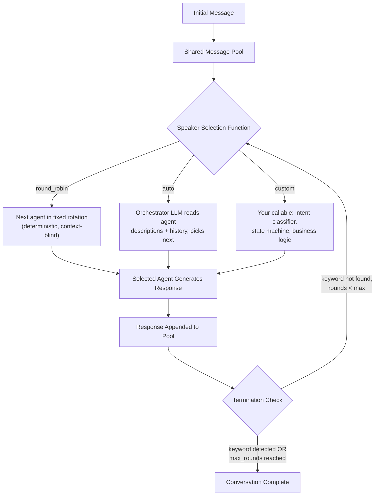

# Group Chat and Speaker Selection

## Learning Objectives

- Implement round-robin, auto (LLM-based), and custom speaker selection methods in a multi-agent group chat
- Compare the routing accuracy, latency, and cost tradeoffs of each selection method
- Configure termination conditions (max rounds, keyword detection, custom stop functions) to prevent infinite conversation loops
- Trace message flow through a group chat to diagnose routing failures and stuck conversations
- Map speaker selection logic to GTM pipeline routing between enrichment, personalization, and QA agents

## The Problem

You have three agents: a researcher who enriches leads, a writer who drafts outreach, and a critic who validates quality before sending. In a static graph framework like LangGraph, you hardcode every edge — researcher → writer → critic → done. That works when the flow is predictable. It breaks the moment the critic rejects the draft and you need to route back to the writer, or the researcher surfaces a signal that requires a second research pass before the writer can start.

The edge explosion is real. Five agents with bidirectional handoffs produce up to 20 directed edges. Add a sixth agent and you're at 30. Each edge is a conditional that you maintain, test, and debug. And none of them adapt — if the conversation context changes, your static graph still routes the same way.

What you actually want is simpler: every agent sees every message in a shared pool, and some function picks who speaks next based on the current state of that pool. No hardcoded edges. No graph topology to maintain. The routing logic lives in one function — the speaker selector — and you can swap that function without touching the agents. This is the group chat pattern, and speaker selection is the algorithm at its core.

## The Concept

A group chat is a shared message bus. N agents and one orchestrator share a single conversation history. At each turn, the orchestrator invokes a speaker selection function that returns the name of the next agent to speak. That agent reads the full message history, generates a response, and the response is appended to the shared pool. The cycle repeats until a termination condition fires.

AutoGen's `GroupChat` and `GroupChatManager` implement this pattern directly. `GroupChat` holds the state — agent list, message history, selection policy, termination config. `GroupChatManager` is itself an agent that acts as the orchestrator: it receives messages from user proxies, runs the selection function, and delegates to the chosen agent. The fork AG2 preserves these semantics from AutoGen v0.2. AutoGen v0.4 rewrote the architecture into an event-driven actor model, but the `GroupChat` primitive survives in both AG2 and Microsoft Agent Framework (the successor that merged AutoGen with Semantic Kernel in early 2026).



Three selection mechanisms exist, and the tradeoff is always determinism versus adaptivity:

**Round-robin** cycles through agents in fixed order. Agent A speaks, then B, then C, then A again. It is deterministic, costs zero LLM tokens for selection, and adds zero latency. It is also context-blind: if the topic has shifted to legal review but it is the coder's turn, the coder speaks anyway. Use round-robin when the conversation follows a predictable sequence — research, draft, review, done — and you do not need conditional branching.

**Auto** delegates selection to an LLM. The orchestrator constructs a system prompt containing each agent's name and description, appends the conversation history, and asks the model to output the name of the next speaker. This adapts to context — if the last message contains research findings, the LLM routes to the writer. The cost is one additional LLM call per turn (the selection call) and added latency. The risk is non-determinism: the same conversation may route differently on repeated runs, and a weak model may misroute. AutoGen's `auto` method works this way; you influence routing quality by writing precise agent descriptions.

**Custom** is a callable you write. It receives the list of agents and the message history, and returns an agent name (or `None` to terminate). This is where you put intent classifiers, state machines, confidence thresholds, or any arbitrary logic. Custom selection is deterministic if your logic is deterministic, costs zero LLM tokens, and can encode domain-specific routing rules that no LLM would infer from descriptions alone. The tradeoff is that you own the complexity — a custom selector with fifty conditionals is just a static graph in disguise.

Termination is the other half of the protocol. Without it, agents loop forever. Three mechanisms: `max_round` caps the total turns regardless of content. Keyword detection scans each message for a termination string (like `"APPROVED"` or `"TERMINATE"`) and stops the conversation. Custom stop functions evaluate arbitrary conditions — for example, checking whether a JSON response contains a confidence score above 0.9. You can combine them: max_round as a safety net, keyword as the primary signal, and a custom function for edge cases.

## Build It

The following code builds a group chat from scratch in pure Python — no framework, no API keys, no external dependencies. It implements all three selection methods and demonstrates termination on keyword detection. The agent responses are simulated with simple functions so you can see the routing logic without an LLM. After this, the AutoGen equivalent is a one-to-one mapping: `GroupChat` replaces the class, `GroupChatManager` replaces the run loop, and `speaker_selection_method` replaces the select function.

```python
from dataclasses import dataclass, field
from typing import Callable, Optional

@dataclass
class Message:
    sender: str
    content: str
    def __str__(self):
        return f"[{self.sender}]: {self.content}"

@dataclass
class Agent:
    name: str
    description: str
    respond_fn: Callable[[str], str]
    def respond(self, context: str) -> str:
        return self.respond_fn(context)

class GroupChat:
    def __init__(self, agents, selection_method="round_robin",
                 max_rounds=10, terminate_keyword=None):
        self.agents = agents
        self.agent_map = {a.name: a for a in agents}
        self.selection_method = selection_method
        self.max_rounds = max_rounds
        self.terminate_keyword = terminate_keyword
        self.messages: list[Message] = []
        self.round_counter = 0
        self.selection_log: list[dict] = []

    def _select_round_robin(self):
        idx = self.round_counter % len(self.agents)
        speaker = self.agents[idx]
        reasoning = f"Rotation index {idx}