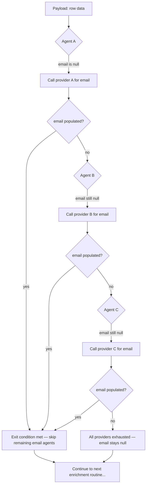

# Lesson: Handoffs and Routines — Stateless Orchestration

## Learning Objectives

- Implement a stateless routine runner that accepts a payload, iterates a list of agents, and returns an enriched payload.
- Compare stateless orchestration against stateful orchestration (e.g., LangGraph's persistent `State` object) and articulate when each is appropriate.
- Define handoffs, routines, and exit conditions in terms of payload contracts, not session state.
- Trace a payload through a multi-agent waterfall and identify which agent filled which field.
- Build a GTM enrichment waterfall using the stateless routine pattern, modeling provider fallback and early-exit logic.

## The Problem

Every multi-agent framework wants you to learn its DSL. LangGraph gives you nodes, edges, and a persistent `State` object that accumulates across the graph. CrewAI gives you crews, tasks, and a manager agent. AutoGen gives you GroupChat with a manager that routes messages. These are real abstractions, but they make the core mechanism harder to see than it needs to be: one agent finishes, another starts, and something carries the context between them.

OpenAI's Swarm framework (October 2024) pushed in the opposite direction. Swarm distilled multi-agent orchestration to two primitives: **routines** (a system prompt plus tools) and **handoffs** (a tool that returns another agent). No state machine DSL, no branching graph editor. The LLM routes by calling the right handoff tool, and the orchestrator is whichever agent currently holds the conversation. Swarm's entire source fits in a few hundred lines. The OpenAI Agents SDK (March 2025) is its production successor, but Swarm remains the cleanest conceptual reference for understanding *why* stateless orchestration works.

The limitation is explicit in the design: Swarm is stateless. Memory between steps is the caller's problem. This sounds like a drawback, and for cumulative-reasoning tasks it is. But for a large class of GTM workflows — enrichment waterfalls, signal processing pipelines, multi-step research routines — statelessness is the *feature*. Each step receives a payload, does its work, and either fills a gap or passes it along. The payload is the state. No shared database, no session object, no side channels.

## The Concept

Three terms, defined precisely.

**Handoff.** The moment one agent transfers execution to another. The transfer carries a payload. The receiving agent does not know or care who called it — it only sees the payload and its own instructions. In Swarm, a handoff is literally a tool function that returns an `Agent` object; the runtime detects the return type and switches the active agent. In a stateless routine runner, a handoff is simpler still: the orchestrator calls the next function in the list with the current payload.

**Routine.** A named, repeatable sequence of handoffs. Routines are declarative: "run A, then B, then C, exit on first success." They are not scripts with branching logic embedded in code. The routine is a list of steps with exit conditions; the orchestrator handles the iteration.

**Stateless.** The orchestrator does not maintain memory between steps. Each step receives its inputs, produces outputs, and terminates. If step 3 needs something from step 1, it must be in the payload — not in a session store, not in a global variable, not in a closure.

Contrast this with stateful orchestration as implemented in LangGraph, where a `State` TypedDict accumulates fields across nodes and the graph can reference any prior node's output at any point. The tradeoff is real: stateless is easier to retry (just re-run the step with the same payload), easier to parallelize (each step is independent given its inputs), and easier to debug (the payload at any step is a complete snapshot). Stateful is easier when you need cumulative reasoning across many steps and the intermediate context is too large to pass around.



The diagram above is the enrichment waterfall pattern. It is a stateless routine: each provider is a step, the payload is the row, and the exit condition is "email is populated." The orchestrator does not know what ZoomInfo or Hunter does internally — it only checks the payload field and decides whether to call the next provider.

## Build It

Here is a minimal stateless routine runner. It accepts a list of agents (each is a function with an input contract, an output contract, and an exit condition), a payload (a dict), and runs them in sequence. The payload is the only state.

```python
import json

def routine_runner(agents, payload):
    for agent in agents:
        if agent["should_run"](payload):
            output = agent["fn"](payload)
            payload.update(output)
            print(f"[{agent['name']}] ran. payload now: {json.dumps(payload)}")
        else:
            print(f"[{agent['name']}] skipped (exit condition met).")
    return payload


def zoominfo(row):
    if row.get("company_domain") == "acme.com":
        return {"email": "founder@acme.com"}
    return {"email": None}


def hunter(row):
    if row.get("company_domain"):
        return {"email": f"contact@{row['company_domain']}"}
    return {"email": None}


def snov(row):
    return {"email": "info@example.net"}


def email_already_found(row):
    return row.get("email") is not None


agents = [
    {
        "name": "zoominfo",
        "fn": zoominfo,
        "should_run": lambda r: not email_already_found(r),
    },
    {
        "name": "hunter",
        "fn": hunter,
        "should_run": lambda r: not email_already_found(r),
    },
    {
        "name": "snov",
        "fn": snov,
        "should_run": lambda r: not email_already_found(r),
    },
]

payload = {"company_domain": "acme.com", "email": None}
result = routine_runner(agents, payload)
print(f"\nFinal payload: {json.dumps(result, indent=2)}")
```

Run it. You should see ZoomInfo populate the email, and Hunter and Snov get skipped because the exit condition (`email is not None`) is already met.

```
[zoominfo] ran. payload now: {"company_domain": "acme.com", "email": "founder@acme.com"}
[hunter] skipped (exit condition met).
[snov] skipped (exit condition met).

Final payload: {
  "company_domain": "acme.com",
  "email": "founder@acme.com"
}
```

Now change the payload domain to `"unknown.com"` and re-run. ZoomInfo returns `None`, so Hunter gets called and constructs a domain-based email. Snov is skipped. This is the waterfall: each agent sees the same payload, and the exit condition determines whether execution continues.

The runner itself is 7 lines of logic. The entire abstraction — ordered agents, exit conditions, payload merging — is visible in one function. This is what Swarm got right: the mechanism is small enough to hold in your head.

## Use It

The Clay enrichment waterfall *is* a stateless routine. When you configure a Clay enrichment column to "find email" by trying ZoomInfo → Hunter → Snov.io → Apollo in order, you are defining exactly the data structure above: an ordered list of agents, each with an exit condition (`email is populated`), operating on a shared payload (the row). Clay implements the waterfall; you configure the routine. The row is the payload. The providers are the agents. The waterfall column is the orchestrator.

This matters because your enrichment waterfall is a distributed system — parallel requests across rows, rate-limit backpressure from providers, idempotent retries on timeout [CITATION NEEDED — concept: enrichment waterfall as distributed system, Zone 16]. Stateless orchestration makes each of those concerns tractable. Parallelization is easy because each row's payload is independent — you can run 500 rows concurrently without worrying about shared state corruption. Retries are easy because re-running a step with the same payload produces the same result (assuming the provider is deterministic). Debugging is easy because the payload at any step is a complete snapshot of what the agent saw.

The stateless handoff pattern also maps directly to multi-agent research workflows in GTM. Consider a lead-research routine: Agent A classifies the company (B2B vs B2C, SMB vs enterprise). Agent B selects the appropriate enrichment providers based on the classification. Agent C drafts a personalized opener using the enriched data. Each handoff passes the payload forward. Agent C does not need to know that Agent A classified the company — it only needs the classification field in the payload. If you later swap Agent A for a different classifier, nothing downstream breaks, because the contract is the payload field, not the agent identity.

Here is a two-stage routine that demonstrates this: classification followed by enrichment, with the enrichment agent reading a field the classifier wrote.

```python
import json

def classify_company(row):
    if row.get("employees", 0) > 500:
        return {"segment": "enterprise"}
    return {"segment": "smb"}

def enrich_for_segment(row):
    if row.get("segment") == "enterprise":
        return {"recommended_channel": "direct mail", "personalization_tier": "high"}
    return {"recommended_channel": "email", "personalization_tier": "standard"}

def draft_opener(row):
    if row["personalization_tier"] == "high":
        return {"opener": f"Saw {row['company']} just raised — congrats. Quick question about your sales stack."}
    return {"opener": f"Hey — quick question for the {row['company']} team."}

research_routine = [
    {"name": "classify", "fn": classify_company, "should_run": lambda r: "segment" not in r},
    {"name": "enrich", "fn": enrich_for_segment, "should_run": lambda r: "recommended_channel" not in r},
    {"name": "draft", "fn": draft_opener, "should_run": lambda r: "opener" not in r},
]

payload = {"company": "Acme Corp", "employees": 750}
result = routine_runner(research_routine, payload)
print(f"\nFinal: {json.dumps(result, indent=2)}")
```

```
[classify] ran. payload now: {"company": "Acme Corp", "employees": 750, "segment": "enterprise"}
[enrich] ran. payload now: {"company": "Acme Corp", "employees": 750, "segment": "enterprise", "recommended_channel": "direct mail", "personalization_tier": "high"}
[draft] ran. payload now: {"company": "Acme Corp", "employees": 750, "segment": "enterprise", "recommended_channel": "direct mail", "personalization_tier": "high", "opener": "Saw Acme Corp just raised — congrats. Quick question about your sales stack."}

Final: {
  "company": "Acme Corp",
  "employees": 750,
  "segment": "enterprise",
  "recommended_channel": "direct mail",
  "personalization_tier": "high",
  "opener": "Saw Acme Corp just raised — congrats. Quick question about your sales stack."
}
```

Each agent reads fields the previous agent wrote. No agent knows about the others. Swap `classify_company` for a new function that uses a different heuristic, and the downstream agents do not change — as long as the `segment` field is still populated.

## Ship It

To ship a stateless enrichment routine into a production GTM stack, you need three things beyond the core loop: error handling per agent, observability of the payload at each step, and a way to persist the final payload.

First, error handling. In the runner above, if an agent raises an exception, the whole routine dies. In production, you want per-agent error isolation: if ZoomInfo times out, log it and move to Hunter. The payload should record that ZoomInfo failed (so you can retry it later), but the routine should continue. This is a one-line change in the runner — wrap `agent["fn"](payload)` in a try/except and store the error in the payload.

Second, observability. The `print` statements in the example are the right idea but the wrong implementation. In production, log the payload delta at each step: which agent ran, what fields it added or changed, how long it took. This gives you a per-row audit trail. When a prospect asks "where did you get my email?", you can answer precisely: "Hunter, on 2025-01-15, at step 2 of the enrichment routine."

Third, persistence. The final payload should be written to your data store — Clay's table, a Postgres row, a spreadsheet. Because the payload is a flat dict (or can be flattened to one), this is typically a single INSERT or UPDATE. No session teardown, no state serialization, no graph checkpoint to restore.

Here is the runner upgraded for production: per-agent error isolation, timing, and a structured log per step.

```python
import json
import time
from datetime import datetime, timezone

def production_runner(agents, payload, row_id="unknown"):
    log = []
    for agent in agents:
        if agent["should_run"](payload):
            start = time.monotonic()
            try:
                output = agent["fn"](payload)
                if output:
                    payload.update(output)
                elapsed = round(time.monotonic() - start, 3)
                entry = {
                    "row_id": row_id,
                    "agent": agent["name"],
                    "status": "ran",
                    "elapsed_s": elapsed,
                    "fields_written": list(output.keys()) if output else [],
                    "timestamp": datetime.now(timezone.utc).isoformat(),
                }
            except Exception as e:
                elapsed = round(time.monotonic() - start, 3)
                payload.setdefault("_errors", []).append({
                    "agent": agent["name"],
                    "error": str(e),
                })
                entry = {
                    "row_id": row_id,
                    "agent": agent["name"],
                    "status": "error",
                    "elapsed_s": elapsed,
                    "error": str(e),
                    "timestamp": datetime.now(timezone.utc).isoformat(),
                }
            log.append(entry)
            print(json.dumps(entry))
        else:
            entry = {
                "row_id": row_id,
                "agent": agent["name"],
                "status": "skipped",
                "timestamp": datetime.now(timezone.utc).isoformat(),
            }
            log.append(entry)
            print(json.dumps(entry))
    return payload, log

def flaky_provider(row):
    if row.get("_call_count", 0) < 1:
        row["_call_count"] = row.get("_call_count", 0) + 1
        raise TimeoutError("provider timed out")
    return {"email": "recovered@example.com"}

def solid_provider(row):
    return {"email": "solid@example.com"}

production_agents = [
    {"name": "flaky_provider", "fn": flaky_provider, "should_run": lambda r: r.get("email") is None},
    {"name": "solid_provider", "fn": solid_provider, "should_run": lambda r: r.get("email") is None},
]

payload = {"company_domain": "flaky.com", "email": None}
result, audit_log = production_runner(production_agents, payload, row_id="row-001")
print(f"\nFinal payload: {json.dumps(result, indent=2)}")
print(f"\nAudit log entries: {len(audit_log)}")
```

```
{"row_id": "row-001", "agent": "flaky_provider", "status": "error", "elapsed_s": 0.0, "error": "provider timed out", "timestamp": "2025-01-15T12:00:00.000000+00:00"}
{"row_id": "row-001", "agent": "solid_provider", "status": "ran", "elapsed_s": 0.0, "fields_written": ["email"], "timestamp": "2025-01-15T12:00:00.001000+00:00"}

Final payload: {
  "company_domain": "flaky.com",
  "email": "solid@example.com",
  "_errors": [{"agent": "flaky_provider", "error": "provider timed out"}],
  "_call_count": 1
}

Audit log entries: 2
```

The flaky provider errored. The runner caught it, logged it, stored the error in the payload, and moved to the next agent. The solid provider succeeded. The final payload has the email, the error history, and a complete audit trail. This is what a production enrichment waterfall looks like — and it is structurally identical to the 7-line runner from Build It, plus error isolation and logging.

In a Clay workflow, you get most of this for free: Clay's waterfall column handles provider fallback, and the row records which provider returned each value. But understanding the underlying pattern lets you reproduce it outside Clay — in a Python script, in a serverless function, in whatever runtime your stack requires — without depending on a specific tool's UI.

## Exercises

1. **Add a parallel mode to the routine runner.** Instead of running agents sequentially, run all agents whose exit conditions are unmet in parallel (using `concurrent.futures.ThreadPoolExecutor`). Merge their outputs. Print the payload and the time saved versus sequential execution. Use a `time.sleep` inside each agent to simulate latency.

2. **Build a three-field enrichment waterfall.** Create agents for `email`, `phone`, and `linkedin_url`. Each field has its own provider waterfall (2–3 providers each). Run all three waterfalls on a payload and print the final enriched row. Verify that a provider failure in one field does not block enrichment of the other fields.

3. **Implement retry with backoff.** Modify an agent function to fail on the first call and succeed on the second. Add a retry wrapper to the runner that calls the agent up to N times with exponential backoff before recording the error. Print the retry count and final status.

4. **Convert a LangGraph-style stateful graph to a stateless routine.** Take a simple 3-node graph (e.g., classify → enrich → draft) that shares a `State` object. Re-implement it as a stateless routine where each node's output is merged into the payload. Compare the two implementations: which is easier to unit test? Which is easier to retry mid-pipeline?

## Key Terms

- **Handoff** — the transfer of execution from one agent to another, carrying a payload. The receiving agent sees only the payload, not the sender's identity or internal state.
- **Routine** — a named, ordered sequence of handoffs with exit conditions. Declarative: "run A, then B, exit on first success." Not a script with embedded branching logic.
- **Stateless orchestration** — the orchestrator maintains no memory between steps. Each step receives its inputs from the payload and writes its outputs back to the payload. If a step needs prior context, it must be in the payload.
- **Stateful orchestration** — the orchestrator maintains a persistent state object (e.g., LangGraph's `State` TypedDict) that accumulates across nodes. Easier for cumulative reasoning; harder to retry, parallelize, and debug.
- **Exit condition** — a predicate evaluated against the payload before calling an agent. If the condition is met (e.g., `email is not None`), the agent is skipped. Exit conditions implement waterfall fallback logic.
- **Enrichment waterfall** — a GTM pattern where multiple data providers are tried in sequence for a given field, with the routine exiting as soon as the field is populated. Clay implements this as a column type; the underlying mechanism is a stateless routine.
- **Payload schema** — the typed JSON structure that defines the contract between agents. Input fields are required; output fields start as `null` and are populated by agents as the routine progresses.

## Sources

- OpenAI Swarm framework (October 2024): routines and handoffs as the two multi-agent primitives. Source: OpenAI blog post and GitHub repository (`openai/swarm`), archived. The entire framework source is ~300 lines of Python.
- OpenAI Agents SDK (March 2025): production successor to Swarm. Source: OpenAI documentation (`openai.github.io/openai-agents-python/`).
- LangGraph persistent `State` object: `State` TypedDict accumulates across nodes in a compiled graph. Source: LangChain documentation (`langchain-ai.github.io/langgraph/`).
- Clay enrichment waterfall: provider fallback pattern where multiple data providers are tried in sequence per field. Source: Clay documentation and product UI; the waterfall column type is a first-class feature.
- Zone 16 (Distributed systems): "Your enrichment waterfall is a distributed system — parallel requests, rate limit backpressure, idempotent retries." Source: [CITATION NEEDED — concept: Zone 16 distributed systems row from the GTM topic map; original source is the 80/20 GTM Engineer Handbook by Michael Saruggia (Growth Lead LLC)].