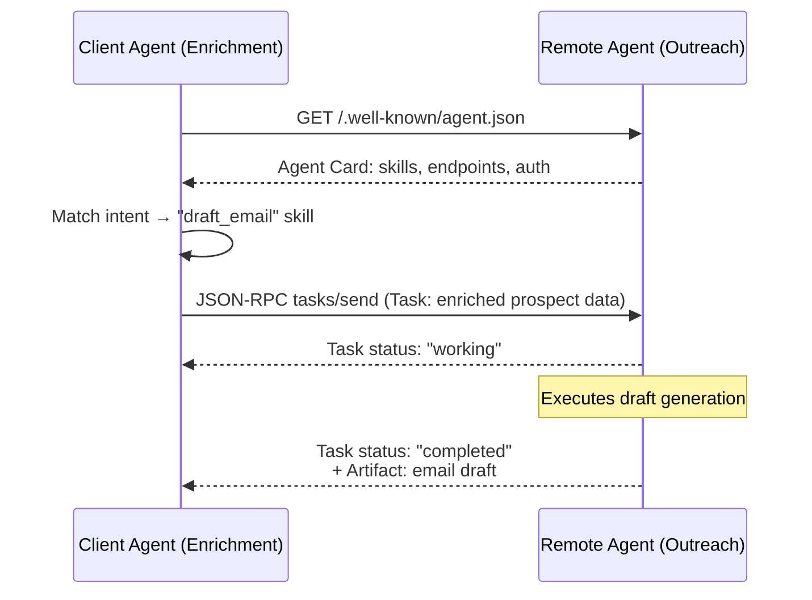

# A2A — The Agent-to-Agent Protocol

## Learning Objectives

1. Fetch and parse an Agent Card from a `/.well-known/agent.json` endpoint and extract its declared skills.
2. Implement a minimal Remote Agent that accepts JSON-RPC 2.0 `tasks/send` requests and returns artifacts.
3. Trace a Task object through its lifecycle states: `submitted → working → completed | failed | canceled`.
4. Wire a Client Agent to a Remote Agent to build a multi-step enrichment-to-outreach GTM workflow.
5. Compare A2A's peer-to-peer delegation model against MCP's vertical tool-calling.

## The Problem

Your enrichment agent has scraped a prospect's LinkedIn, enriched their company with firmographics, and detected a hiring signal. Now it needs to hand that packaged data to an outreach agent that drafts the email. How does Agent A call Agent B?

The default answer in most GTM stacks today is bespoke glue. You write a custom webhook in Make or n8n. You define a JSON payload shape that exists in no documentation outside a Slack thread. The outreach agent's input schema lives in the enrichment agent's code as a hardcoded dictionary. When the outreach agent's prompt changes and it starts expecting a `pain_points` array instead of a `signals` array, the integration breaks silently — the enrichment agent sends the old shape, the outreach agent generates garbage, and nobody notices until a prospect replies asking why your email mentions "undefined."

A2A (Agent-to-Agent) is Google's open protocol, announced April 2025, that replaces this glue with a standard wire contract. Instead of every agent pair defining its own integration, agents publish an Agent Card — a discoverable manifest of what they do, what inputs they accept, and how to authenticate. Tasks flow between agents using JSON-RPC 2.0 over HTTP, with typed artifacts as outputs. The protocol is the horizontal complement to MCP: where MCP connects an agent vertically to its tools (APIs, databases, functions), A2A connects agents horizontally to each other. In a GTM context, this means your enrichment waterfall — already a distributed system with parallel requests, rate-limit backpressure, and idempotent retries — gains a standard handoff contract between stages instead of per-pair webhook definitions.

## The Concept

A2A defines three roles. The **Client Agent** initiates a task — it has a goal and delegates part of the work. The **Remote Agent** executes that task — it owns a capability and produces artifacts. Between them sits the **Agent Card**, a JSON document served at `/.well-known/agent.json` that advertises the Remote Agent's name, skills, endpoints, supported input/output modalities, and auth requirements. Discovery is just an HTTP GET. No registry, no broker, no central orchestrator — a Client Agent that knows the Remote Agent's base URL can discover everything else by reading the card.

The **Task** is the unit of work. It is an asynchronous, stateful object identified by a string ID. A Client Agent creates a Task by calling the JSON-RPC method `tasks/send` with a message containing structured parts (text, JSON, or eventually images/audio/video). The Remote Agent accepts the Task, transitions it through lifecycle states, and returns a result containing **Artifacts** — typed outputs that can be text, structured data, or other modalities. The lifecycle is strict: `submitted → working → completed | failed | canceled`. A Client Agent can poll status with `tasks/get`, cancel with `tasks/cancel`, or subscribe to streaming updates with `tasks/sendSubscribe` for long-running operations.

What makes this different from a plain REST API is the contract around capability discovery and task semantics. The Agent Card is not documentation — it is machine-readable input to the Client Agent's routing logic. When an enrichment agent needs to produce an outreach draft, it does not hardcode the outreach agent's endpoint. It fetches the Agent Card, checks whether a skill like `draft_email` exists, verifies it accepts the modalities the enrichment agent produces, and then constructs the Task payload. If the outreach agent later adds a `draft_linkedin` skill, the enrichment agent can discover it without a code change.



A critical design choice: A2A tasks are **opaque to the transport**. The protocol does not specify how the Remote Agent produces its result — it could call an LLM, query a database, invoke another agent, or run deterministic logic. The Client Agent sends a Task and gets back Artifacts. This opacity is what makes the protocol composable: a GTM pipeline can chain an enrichment agent → scoring agent → outreach agent → scheduling agent, where each link sees only the previous link's artifacts, not its internal implementation.

## Build It

Build a minimal Remote Agent from Python stdlib — no frameworks, no dependencies. The agent serves an Agent Card at the well-known URI and accepts `tasks/send` requests over JSON-RPC 2.0. Then act as a Client Agent: discover the card, send a task, and print the returned artifact.

```python
import json
import threading
import urllib.request
from http.server import HTTPServer, BaseHTTPRequestHandler

AGENT_CARD = {
    "name": "prospect-summary-agent",
    "description": "Summarizes enriched prospect data into an outreach-ready brief",
    "url": "http://localhost:9090",
    "version": "1.0.0",
    "capabilities": {"streaming": False, "pushNotifications": False},
    "defaultInputModes": ["text"],
    "defaultOutputModes": ["text", "structured"],
    "skills": [
        {
            "id": "summarize_prospect",
            "name": "Summarize Prospect",
            "description": "Takes enriched prospect JSON and returns a concise summary card",
            "tags": ["enrichment", "summary"],
            "inputModes": ["text"],
            "outputModes": ["text", "structured"]
        }
    ]
}

class RemoteAgentHandler(BaseHTTPRequestHandler):
    def do_GET(self):
        if self.path == "/.well-known/agent.json":
            self._json(200, AGENT_CARD)
        else:
            self._json(404, {"error": "not found"})

    def do_POST(self):
        raw = self.rfile.read(int(self.headers.get("Content-Length", 0)))
        body = json.loads(raw)
        method = body.get("method")
        if method == "tasks/send":
            self._handle_send(body)
        elif method == "tasks/get":
            self._handle_get(body)
        elif method == "tasks/cancel":
            self._handle_cancel(body)
        else:
            self._json(400, {"jsonrpc": "2.0", "id": body.get("id"), "error": {"code": -32601, "message": "method not found"}})

    def _handle_send(self, rpc):
        params = rpc["params"]
        task_id = params["id"]
        parts = params["message"]["parts"]
        input_text = parts[0]["text"]
        prospect = json.loads(input_text)
        summary = self._build_summary(prospect)
        self._json(200, {
            "jsonrpc": "2.0",
            "id": rpc["id"],
            "result": {
                "id": task_id,
                "status": {"state": "completed"},
                "artifacts": [{
                    "index": 0,
                    "parts": [{"type": "text", "text": summary}],
                    "lastChunk": True
                }]
            }
        })

    def _build_summary(self, prospect):
        name = prospect.get("name", "Unknown")
        company = prospect.get("company", "Unknown")
        title = prospect.get("title", "Unknown")
        signals = prospect.get("signals", [])
        signal_str = "; ".join(signals) if signals else "no signals detected"
        return f"BRIEF — {name}, {title} at {company}. Triggers: {signal_str}."

    def _handle_get(self, rpc):
        self._json(200, {
            "jsonrpc": "2.0", "id": rpc["id"],
            "result": {"id": rpc["params"]["id"], "status": {"state": "completed"}}
        })

    def _handle_cancel(self, rpc):
        self._json(200, {
            "jsonrpc": "2.0", "id": rpc["id"],
            "result": {"id": rpc["params"]["id"], "status": {"state": "canceled"}}
        })

    def _json(self, code, body):
        self.send_response(code)
        self.send_header("Content-Type", "application/json")
        self.end_headers()
        self.wfile.write(json.dumps(body).encode())

    def log_message(self, *args):
        pass

server = HTTPServer(("localhost", 9090), RemoteAgentHandler)
t = threading.Thread(target=server.serve_forever, daemon=True)
t.start()

BASE = "http://localhost:9090"

def discover(url):
    with urllib.request.urlopen(f"{url}/.well-known/agent.json") as r:
        return json.loads(r.read())

def send_task(url, task_id, content):
    rpc = {
        "jsonrpc": "2.0", "method": "tasks/send", "id": "rpc-001",
        "params": {
            "id": task_id,
            "message": {"role": "user", "parts": [{"type": "text", "text": content}]}
        }
    }
    req = urllib.request.Request(
        url, data=json.dumps(rpc).encode(),
        headers={"Content-Type": "application/json"}
    )
    with urllib.request.urlopen(req) as r:
        return json.loads(r.read())

card = discover(BASE)
print(f"=== DISCOVERED REMOTE AGENT ===")
print(f"Name:  {card['name']}")
print(f"Skills: {[s['name'] for s in card['skills']]}")
print(f"Capabilities: {card['capabilities']}")

prospect_data = json.dumps({
    "name": "Sarah Chen",
    "title": "VP Engineering",
    "company": "Acme Corp",
    "signals": ["hiring 5 backend engineers", "raised Series B in Q1", "open-sourced new framework"]
})

result = send_task(BASE, "task-001", prospect_data)
task = result["result"]
print(f"\n=== TASK RESULT ===")
print(f"Task ID: {task['id']}")
print(f"State:   {task['status']['state']}")
print(f"Artifact: {task['artifacts'][0]['parts'][0]['text']}")

cancel = {
    "jsonrpc": "2.0", "method": "tasks/cancel", "id": "rpc-002",
    "params": {"id": "task-001"}
}
req = urllib.request.Request(BASE, data=json.dumps(cancel).encode(), headers={"Content-Type": "application/json"})
with urllib.request.urlopen(req) as r:
    cancel_result = json.loads(r.read())
print(f"\n=== CANCEL TEST ===")
print(f"Task {cancel_result['result']['id']}: {cancel_result['result']['status']['state']}")

server.shutdown()
```

Run this and you see the full lifecycle: discovery via Agent Card, task submission via JSON-RPC, artifact retrieval, and cancellation. The Remote Agent never reveals how it built the summary — it accepted opaque input text, produced opaque output text, and the Client Agent consumed the artifact without knowing whether an LLM, a template, or a lookup table generated it.

## Use It

A2A's peer-to-peer Task delegation replaces the manual handoff between enrichment and outreach steps in a GTM waterfall. In a Clay-style enrichment pipeline, each row flows through a sequence of providers: data enrichment → signal detection → copy generation → channel selection. Today, those steps are coordinated by a human-defined waterfall config that hardcodes the order, the schema mapping, and the error handling. With A2A, each step becomes an agent that advertises its capability via an Agent Card. The enrichment agent, acting as Client, discovers the outreach agent's `draft_email` skill, packages enriched prospect data into a Task, and delegates.

This is the distributed-systems reality of an enrichment waterfall — parallel requests, rate-limit backpressure, idempotent retries — now with a standard inter-agent contract instead of bespoke webhook glue. The Agent Card's `capabilities` field tells the Client Agent whether the Remote Agent supports streaming (useful for long-running LLM generation) and push notifications (useful when the Remote Agent's task takes minutes, not milliseconds). The Task lifecycle's `failed` state gives the Client Agent a deterministic signal to retry or fall back — the same pattern as an enrichment provider failing in a Clay waterfall and the next provider picking up the row.

Wire two agents together: an enrichment agent that produces a prospect brief, and an outreach agent that consumes that brief as a Task artifact and returns a drafted email.

```python
import json
import threading
import urllib.request
from http.server import HTTPServer, BaseHTTPRequestHandler

ENRICHMENT_CARD = {
    "name": "enrichment-agent",
    "url": "http://localhost:9091",
    "version": "1.0.0",
    "capabilities": {"streaming": False, "pushNotifications": False},
    "skills": [{"id": "enrich_prospect", "name": "Enrich Prospect", "description": "Enrich a domain into a prospect brief", "tags": ["enrichment"]}]
}

OUTREACH_CARD = {
    "name": "outreach-agent",
    "url": "http://localhost:9092",
    "version": "1.0.0",
    "capabilities": {"streaming": False, "pushNotifications": False},
    "skills": [{"id": "draft_email", "name": "Draft Email", "description": "Draft a cold email from a prospect brief", "tags": ["outreach", "email"]}]
}

def make_handler(card, processor):
    class Handler(BaseHTTPRequestHandler):
        def do_GET(self):
            if self.path == "/.well-known/agent.json":
                self._json(200, card)
            else:
                self._json(404, {})

        def do_POST(self):
            raw = self.rfile.read(int(self.headers.get("Content-Length", 0)))
            body = json.loads(raw)
            if body.get("method") != "tasks/send":
                self._json(400, {"error": "unsupported"})
                return
            params = body["params"]
            input_text = params["message"]["parts"][0]["text"]
            output = processor(input_text)
            self._json(200, {
                "jsonrpc": "2.0", "id": body["id"],
                "result": {
                    "id": params["id"],
                    "status": {"state": "completed"},
                    "artifacts": [{"index": 0, "parts": [{"type": "text", "text": output}], "lastChunk": True}]
                }
            })

        def _json(self, code, body):
            self.send_response(code)
            self.send_header("Content-Type", "application/json")
            self.end_headers()
            self.wfile.write(json.dumps(body).encode())

        def log_message(self, *a): pass
    return Handler

def enrich_processor(input_text):
    data = json.loads(input_text)
    domain = data.get("domain", "unknown.com")
    return json.dumps({
        "name": "Marcus Webb",
        "title": "Head of Growth",
        "company": domain.replace(".com", "").title(),
        "signals": ["hiring SDRs", "Series A 4 months ago", "published hiring roadmap on blog"]
    })

def outreach_processor(input_text):
    brief = json.loads(input_text)
    name = brief.get("name", "there")
    company = brief.get("company", "your company")
    signals = brief.get("signals", [])
    top_signal = signals[0] if signals else "your growth trajectory"
    return f"Subject: {top_signal}\n\nHi {name},\n\nSaw that {company} is {top_signal}. We helped a similar Series A team add 40% more pipeline in one quarter using automated enrichment waterfalls.\n\nWorth comparing notes? I can send a 2-page breakdown.\n\n—