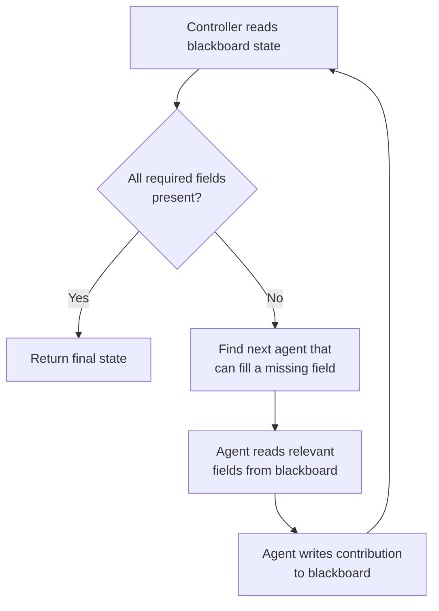

# Shared Memory and Blackboard Patterns

## Learning Objectives

- Implement a thread-safe shared memory store and demonstrate race conditions with and without locking
- Build a blackboard controller that dispatches to specialist agents based on state inspection
- Compare shared memory and blackboard topologies by collision risk, control flow, and read/write semantics
- Detect and mitigate memory poisoning in a multi-agent shared state system using provenance tracking and confidence thresholds
- Map the blackboard pattern onto an enrichment waterfall pipeline with multiple providers filling distinct fields

## The Problem

You have three agents that each know something different about a prospect. One agent found the tech stack by scraping the company website. Another pulled firmographics from an enrichment API. A third detected intent signals from job postings. Each agent produced a useful result in isolation, but nobody can see the other agents' work. The firmographics agent does not know what tech stack was detected, so it cannot use that signal to refine its own query. The intent agent cannot read the company's industry classification to filter which job postings matter. You have three outputs sitting in three silos, and stitching them together after the fact is exactly the integration problem you were trying to avoid by building agents in the first place.

The naive solution is message-passing: each agent sends its output to the next agent in a chain. This works for a linear pipeline — agent A produces, agent B consumes A's output and produces, agent C consumes B's output. But it breaks the moment an agent needs to read output from an agent it was not chained to. If agent C needs to read what agent A produced, but A already sent its output to B and moved on, you need to either re-run A, cache A's output somewhere globally, or restructure your pipeline. All three of those "solutions" are reinventing shared state with worse ergonomics.

The second naive solution is a global log — every agent writes to a shared list, and every agent reads the whole list before acting. This works until the log grows to hundreds of entries and agents spend more tokens reading history than doing work. It also creates a subtle but serious failure mode: when one agent hallucinates a fact and writes it to the log, every downstream agent that reads that "fact" treats it as verified ground truth. By the time a human reviews the output and notices the error, the reasoning chain is five steps deep, and the root cause is the third message ever written. This is **memory poisoning**, and it is the second-most-documented failure family in the MAST taxonomy of multi-agent system failures (Cemri et al., 2025). It is structural — any shared-state design without provenance tracking and a verification gate will exhibit it eventually.

## The Concept

There are two primary topologies for sharing state across agents. The first is **shared memory**: a common data store (a dictionary, a database, a key-value cache) that every agent can read from and write to. There is no central controller. Each agent decides for itself when to read, what to read, and what to write. The store is unstructured — it does not enforce a schema or a write order. The advantage is simplicity: any agent can write any key at any time. The disadvantage is collision risk. If two agents write to the same key concurrently, one write overwrites the other. In Python, dictionary writes are not atomic across a read-modify-write cycle, so `store["count"] = store.get("count", 0) + 1` executed by two threads simultaneously can lose an increment. The fix is either a mutex (lock the store during writes) or an eventually-consistent model (accept that writes may conflict and reconcile later). Shared memory is a *data structure*. It solves the storage problem but not the coordination problem.

The second topology is the **blackboard pattern**: a structured shared workspace paired with a controller. The controller inspects the blackboard's current state and decides which agent to activate next. Agents are specialists — each one knows how to fill a specific set of fields and checks whether those fields are already present before acting. When activated, an agent reads whatever it needs from the blackboard, writes its contribution, and hands control back to the controller. The controller then re-inspects the state and picks the next agent. This loop continues until all required fields are filled or no agent can make further progress. The blackboard pattern was introduced in 1973 by the Hearsay-II speech recognition system, where multiple "knowledge sources" (acoustic, lexical, syntactic, semantic) each contributed partial hypotheses to a shared blackboard and a controller sequenced their activation (Erman et al., 1980). The pattern has not changed in fifty years because the problem it solves — coordinating multiple specialists with overlapping dependencies — has not changed either.



The key distinction: shared memory is a data structure. Blackboard is a control flow mechanism built on top of a shared data structure. You can implement a blackboard using a shared memory store — the store holds the state, and the controller adds the orchestration layer. But you can also use shared memory without a controller (every agent writes whenever it wants), and you can implement a blackboard without shared memory in the strict sense (the controller could pass state explicitly between agents). In practice, the two patterns coexist: the blackboard's workspace is a shared memory store, and the controller is what prevents the write-ordering and dependency problems that raw shared memory creates.

This distinction matters for a specific engineering reason: in a shared-memory-only system, an agent that depends on another agent's output must poll — repeatedly checking whether the field it needs has appeared yet. Polling wastes cycles and introduces race conditions (the field might appear between the check and the read). In a blackboard system, the controller guarantees ordering: agent B is not activated until agent A has written the fields B depends on. The controller encodes the dependency graph directly, eliminating polling.

## Build It

We will build both patterns from Python stdlib. No external libraries, no API calls, no browser. Every example prints to terminal and can be run directly.

First, shared memory. The simplest possible shared store is a Python dictionary. When writes happen from a single thread, there are no problems. When writes happen concurrently from multiple threads, the read-modify-write cycle is not atomic — a context switch between the read and the write loses data. Here is a demonstration that makes the race condition observable:

```python
import threading
import time

shared_store = {}

def unsafe_increment(key, iterations=100):
    for _ in range(iterations):
        current = shared_store.get(key, 0)
        time.sleep(0.00001)
        shared_store[key] = current + 1

shared_store["enrichment_count"] = 0

threads = [
    threading.Thread(target=unsafe_increment, args=("enrichment_count",))
    for _ in range(5)
]

for t in threads:
    t.start()
for t in threads:
    t.join()

print("=== Shared Memory: Race Condition ===")
print(f"Expected: {5 * 100}")
print(f"Actual:   {shared_store['enrichment_count']}")
print(f"Lost writes: {5 * 100 - shared_store['enrichment_count']}")
```

Run this and you will see the actual count is lower than 500. The `time.sleep` forces a context switch between the read and the write, making the race deterministic enough to observe. The fix is a mutex — Python's `threading.Lock` provides exclusive access during the critical section:

```python
import threading
import time

shared_store = {}
lock = threading.Lock()

def