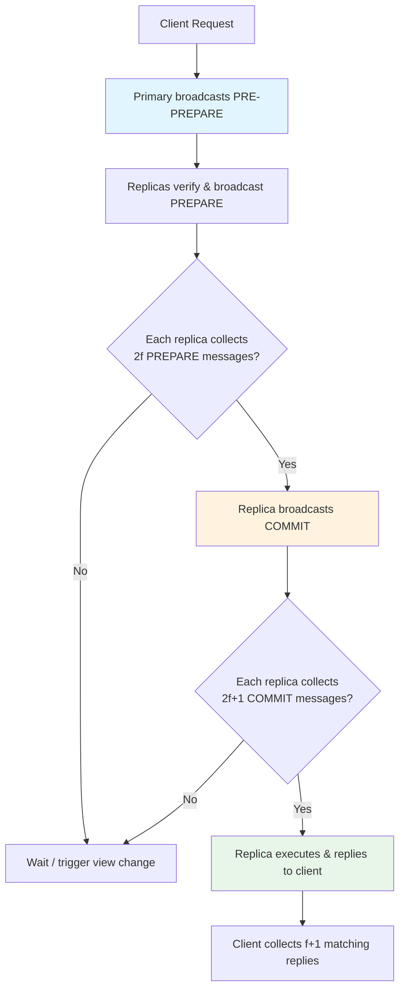

# Consensus and Byzantine Fault Tolerance for Agents

## Learning Objectives

- Implement a 4-node PBFT consensus protocol in Python that tolerates one Byzantine fault
- Trace the pre-prepare, prepare, and commit phases to verify honest nodes reach agreement despite conflicting messages from a Byzantine validator
- Compare PBFT (Byzantine fault tolerant) to Raft (crash-fault tolerant) in terms of node requirements and failure assumptions
- Detect a Byzantine agent in a multi-agent enrichment committee by diffing commit logs across honest nodes
- Apply quorum-based signal reconciliation to conflicting enrichment provider data in a GTM waterfall

## The Problem

You run three LLM agents to score a lead. Two return reasonable scores. One returns garbage. Majority vote handles it — you take the median and move on. But what happens when that third agent doesn't return garbage? What if it returns *strategic* garbage — a carefully crafted response designed to manipulate the median? Or worse: what if it sends different responses to different peers, telling Agent A one thing and Agent B another?

This is the Byzantine problem. A crash fault is when a node stops responding — it fails silent. A Byzantine fault is when a node behaves arbitrarily: it can lie, equivocate, forge messages, or collude with other faulty nodes. In agent systems, Byzantine faults show up as compromised API keys that inject crafted responses, poisoned model outputs from supply-chain attacks on model weights, and prompt-injected agents that return attacker-controlled content to manipulate group decisions. The 2026 empirical reality from "Can AI Agents Agree?" (arXiv:2603.01213) is even worse: even scalar agreement between honest LLM agents is fragile, and a single deceptive agent can compromise a Mixture-of-Agents pipeline.

Classical BFT protocols like PBFT handle arbitrary bit-flipping. They do not handle correlated failures — three honest agents that share a hallucination because they share training data, or a sycophantic agent that agrees with whoever spoke last. Three research directions emerged in 2025–2026 to address this gap: CP-WBFT (arXiv:2511.10400) weighs each vote by a confidence probe, DecentLLMs (arXiv:2507.14928) goes leaderless with geometric-median aggregation, and WBFT (arXiv:2505.05103) uses weighted voting with Hierarchical Structure Clustering to split Core and Edge nodes. This lesson builds the PBFT foundation first, because every weighted variant is a modification of the quorum intersection guarantee that PBFT establishes.

## The Concept

The Byzantine Generals Problem, formalized by Lamport, Shostak, and Pease in 1982, frames the core challenge: *n* generals surrounding a city must agree on a single battle plan — attack or retreat. They communicate by messengers. Some generals are traitors who can send contradictory messages to different recipients. The loyal generals need a protocol that guarantees they all reach the same decision regardless of what the traitors do. Lamport proved that this is solvable if and only if fewer than one-third of the generals are traitors: *n ≥ 3f + 1*, where *f* is the number of traitors.

Practical Byzantine Fault Tolerance (PBFT), published by Castro and Liskov in 1999, was the first protocol to make Byzantine consensus practical for real systems. It operates in three phases:



In the **pre-prepare** phase, the primary (leader) assigns a sequence number to the request and broadcasts it. In the **prepare** phase, each replica broadcasts a signed `PREPARE` message to all other replicas. A replica enters the commit phase once it has collected *2f* `PREPARE` messages from other replicas (plus its own = *2f+1* total). In the **commit** phase, replicas broadcast `COMMIT` messages, and once a replica collects *2f+1* `COMMIT` messages, it executes the request and replies to the client. The client waits for *f+1* matching replies to confirm the result.

The *3f+1* requirement comes from quorum intersection. In a system with *n = 3f+1* nodes, a quorum is *2f+1* nodes. Any two quorums of size *2f+1* must overlap in at least *2(2f+1) - (3f+1) = f+1* nodes. Since at most *f* nodes are Byzantine, that overlap of *f+1* must include at least one honest node. That honest node cannot vote for two different values in the same phase, which guarantees safety: no two honest nodes will commit to different values. Drop below *3f+1* and the quorums can overlap entirely in Byzantine nodes, breaking the guarantee.

Compare this to Raft, the dominant crash-fault-tolerant (CFT) consensus algorithm. Raft assumes nodes either work or crash — they never lie. It needs only *2f+1* nodes to tolerate *f* failures because it does not need quorum intersection to defend against equivocation. Raft is simpler and faster (fewer message rounds), but a single compromised node can forge log entries and break safety. Tendermint's BFT proof-of-stake sits between these: it uses PBFT-style voting but replaces fixed node identity with weighted validator sets, where voting power is proportional to staked tokens. The quorum math is the same — you need two-thirds of total voting power — but the trust model shifts from "these specific nodes" to "economic disincentives against bad behavior."

For agent systems, the critical insight is that you must choose your fault model before choosing your protocol. If your enrichment agents are behind your own infrastructure with no external input, crash-fault tolerance (Raft-style) may suffice — the risk is timeout, not deception. If your agents process untrusted input ( scraped web pages, user-submitted forms, third-party API responses that could contain prompt injections), you are in Byzantine territory and need the full *3f+1* quorum overhead.

## Build It

This simulation implements a 4-node PBFT vote (*n=4, f=1*). One node is honest and serves as primary. Two are honest validators. One is Byzantine — it sends conflicting `PREPARE` messages to different peers. The code traces every message through all three phases and demonstrates that honest nodes still reach commit.

```python
import hashlib
import json
from dataclasses import dataclass, field
from typing import Dict, List, Set, Tuple

@dataclass
class Message:
    phase: str
    view: int
    seq: int
    sender: str
    value: str
    digest: str = ""

    def __post_init__(self):
        if not self.digest:
            raw = f"{self.view}:{self.seq}:{self.value}"
            self.digest = hashlib.sha256(raw.encode()).hexdigest()[:12]

@dataclass
class Node:
    name: str
    is_byzantine: bool = False
    prepared: Dict[str, Set[str]] = field(default_factory=dict)
    committed: Dict[str, Set[str]] = field(default_factory=dict)
    executed_value: str = ""
    prepare_log: List[str] = field(default_factory=list)
    commit_log: List[str] = field(default_factory=list)

    def receive_prepare(self, msg: Message):
        key = msg.digest
        if key not in self.prepared:
            self.prepared[key] = set()
        self.prepared[key].add(msg.sender)
        self.prepare_log.append(
            f"  {self.name} <- PREPARE from {msg.sender} (value={msg.value}, digest={msg.digest})"
        )

    def receive_commit(self, msg: Message):
        key = msg.digest
        if key not in self.committed:
            self.committed[key] = set()
        self.committed[key].add(msg.sender)
        self.commit_log.append(
            f"  {self.name} <- COMMIT from {msg.sender} (value={msg.value}, digest={msg.digest})"
        )

    def is_prepared(self, digest: str, f: int) -> bool:
        count = len(self.prepared.get(digest, set()))
        return count >= 2 * f + 1

    def is_committed(self, digest: str, f: int) -> bool:
        count = len(self.committed.get(digest, set()))
        return count >= 2 * f + 1

def run_pbft():
    N = 4
    F = 1
    PROPOSED_VALUE = "SCORE=87"

    primary = Node(name="Node0_primary", is_byzantine=False)
    honest1 = Node(name="Node1_honest", is_byzantine=False)
    honest2 = Node(name="Node2_honest", is_byzantine=False)
    byz = Node(name="Node3_byzantine", is_byzantine=True)

    nodes = [primary, honest1, honest2, byz]
    node_map = {n.name: n for n in nodes}

    print("=" * 70)
    print(f"PBFT SIMULATION: N={N}, F={F}, proposed_value='{PROPOSED_VALUE}'")
    print("Node0=primary(honest), Node1=honest, Node2=honest, Node3=BYZANTINE")
    print("=" * 70)

    print("\n--- PHASE 1: PRE-PREPARE ---")
    pre_prepare = Message(
        phase="PRE-PREPARE", view=0, seq=1,
        sender=primary.name, value=PROPOSED_VALUE
    )
    print(f"Primary {primary.name} broadcasts PRE-PREPARE:")
    print(f"  value={pre_prepare.value}, digest={pre_prepare.digest}")
    for node in nodes[1:]:
        print(f"  -> {node.name} receives PRE-PREPARE")

    print("\n--- PHASE 2: PREPARE ---")
    for node in nodes[1:]:
        if node.is_byzantine:
            evil_value = "SCORE=12"
            evil_msg = Message(
                phase="PREPARE", view=0, seq=1,
                sender=node.name, value=evil_value
            )
            print(f"\n{node.name} (BYZANTINE) sends CONFLICTING PREPAREs:")
            print(f"  -> sends PREPARE(value={PROPOSED_VALUE}) to {primary.name}, {honest1.name}")
            print(f"  -> sends PREPARE(value={evil_value}) to {honest2.name}")
            correct_msg = Message(
                phase="PREPARE", view=0, seq=1,
                sender=node.name, value=PROPOSED_VALUE
            )
            primary.receive_prepare(correct_msg)
            honest1.receive_prepare(correct_msg)
            honest2.receive_prepare(evil_msg)
        else:
            prep = Message(
                phase="PREPARE", view=0, seq=1,
                sender=node.name, value=PROPOSED_VALUE
            )
            print(f"\n{node.name} broadcasts PREPARE(value={prep.value}, digest={prep.digest})")
            for recipient in nodes:
                if recipient.name != node.name:
                    recipient.receive_prepare(prep)

    print("\n--- PREPARE PHASE LOGS ---")
    for node in nodes:
        for entry in node.prepare_log:
            print(entry)

    correct_digest = pre_prepare.digest
    print(f"\n--- PREPARE QUORUM CHECK (need 2f+1={2*F+1} for digest={correct_digest}) ---")
    for node in nodes:
        self_prep = Message(
            phase="PREPARE", view=0, seq=1,
            sender=node.name, value=PROPOSED_VALUE
        )
        if correct_digest not in node.prepared:
            node.prepared[correct_digest] = set()
        node.prepared[correct_digest].add(node.name)
        count = len(node.prepared[correct_digest])
        status = "PREPARED" if node.is_prepared(correct_digest, F) else "NOT PREPARED"
        print(f"  {node.name}: {count} prepares for correct digest -> {status}")

    print("\n--- PHASE 3: COMMIT ---")
    for node in nodes:
        if node.is_byzantine:
            print(f"\n{node.name} (BYZANTINE) sends CONFLICTING COMMITs:")
            print(f"  -> sends COMMIT(correct) to {primary.name}, {honest1.name}")
            print(f"  -> sends COMMIT(evil) to {honest2.name}")
            evil_commit = Message(
                phase="COMMIT", view=0, seq=1,
                sender=node.name, value="SCORE=12"
            )
            correct_commit = Message(
                phase="COMMIT", view=0, seq=1,
                sender=node.name, value=PROPOSED_VALUE
            )
            primary.receive_commit(correct_commit)
            honest1.receive_commit(correct_commit)
            honest2.receive_commit(evil_commit)
        else:
            if node.is_prepared(correct_digest, F):
                commit_msg = Message(
                    phase="COMMIT", view=0, seq=1,
                    sender=node.name, value=PROPOSED_VALUE
                )
                print(f"\n{node.name} broadcasts COMMIT(value={commit_msg.value})")
                for recipient in nodes:
                    if recipient.name != node.name:
                        recipient.receive_commit(commit_msg)

    print("\n--- COMMIT QUORUM CHECK (need 2f+1={2*F+1}) ---")
    for node in nodes:
        if correct_digest not in node.committed:
            node.committed[correct_digest] = set()
        node.committed[correct_digest].add(node.name)
        count = len(node.committed[correct_digest])
        status = "COMMITTED" if node.is_committed(correct_digest, F) else "NOT COMMITTED"
        print(f"  {node.name}: {count} commits for correct digest -> {status}")

    print("\n--- EXECUTION ---")
    for node in nodes:
        if node.is_committed(correct_digest, F):
            node.executed_value = PROPOSED_VALUE
            print(f"  {node.name} executes: {node.executed_value}")
        else:
            node.executed_value = "NO CONSENSUS"
            print(f"  {node.name} does NOT execute (insufficient quorum)")

    print("\n--- FINAL STATE ---")
    honest_results = [n.executed_value for n in nodes if not n.is_byzantine]
    all_agree = len(set(honest_results)) == 1
    print(f"Honest nodes executed: {honest_results}")
    print(f"All honest nodes agree: {all_agree}")
    if all_agree:
        print(f"SAFETY GUARANTEED: consensus on '{honest_results[0]}' despite Byzantine double-vote")
    else:
        print("SAFETY VIOLATION: honest nodes disagree!")

    print(f"\nByzantine node {byz.name} executed: {byz.executed_value}")
    print("(Byzantine node's state is irrelevant to safety)")

if __name__ == "__main__":
    run_pbft()
```

Run this and you will see every message exchange logged. The Byzantine node sends conflicting `PREPARE` and `COMMIT` messages — one value to two peers, a different value to the third. Despite this, all three honest nodes collect *2f+1 = 3* matching messages for the correct digest and commit to `SCORE=87`. The quorum intersection property holds: any two quorums of size 3 in a 4-node system overlap in at least 2 nodes, at least one of which is honest.

The Byzantine node's own final state is irrelevant — safety only requires that honest nodes agree. The protocol guarantees this because the honest nodes' prepare and commit quorums must overlap in at least one honest node, and that honest node sent only one value for the same digest.

## Use It

Your enrichment waterfall is a distributed system. When you query three firmographic providers in parallel — Clearbit, Apollo, ZoomInfo — and they return conflicting revenue bands for the same account, you face a reconciliation problem. A naive `COALESCE` or "first non-null wins" approach assumes the first provider is honest and the rest are either absent or wrong. That assumption breaks when a provider returns plausible but incorrect data: a stale cache, a misclassified subsidiary, or a deliberately inflated employee count from a provider that benefits from showing larger numbers. [CITATION NEEDED — concept: Clay waterfall consensus/reconciliation pattern for conflicting enrichment providers]

The PBFT quorum model gives you a principled alternative. Instead of treating enrichment providers as a ranked list where the first answer wins, treat them as a validator set where a quorum must agree before a signal enters your scoring model. Each provider's response is signed (API key + timestamp + response hash), and a signal is only accepted if at least *2f+1* of *3f+1* providers agree on it. Providers that consistently disagree with the quorum get flagged as Byzantine — either they are wrong (data quality issue) or they are returning manipulated responses (compromised integration).

In Zone 30 (Enrichment) and Zone 40 (Scoring), this matters because your account score is downstream of your enrichment data. If a Byzantine enrichment provider feeds a corrupted employee count into your ICP fit score, the score is wrong, and no amount of model tuning fixes it. The consensus layer sits between raw enrichment and scoring — it is the gate that prevents garbage signals from propagating. In a Clay waterfall specifically, where `n` data providers return conflicting firmographic data, the consensus approach replaces arbitrary priority ordering with quorum-based resolution: the signal that *2f+1* independent sources agree on is the one that enters the score, and disagreements are logged as data quality incidents rather than silently resolved by a `COALESCE`.

The weighted BFT variants (CP-WBFT, WBFT) extend this further when providers have different reliability profiles. If ZoomInfo has 95% accuracy on revenue data and a scraping-based provider has 70%, you weight votes by historical accuracy rather than treating all sources equally. The quorum math still applies — you need two-thirds of total voting weight to agree — but the weighting concentrates trust in the most reliable sources while still requiring corroboration. This is the enrichment-waterfall-as-distributed-system principle from Zone 16: parallel requests, rate-limit backpressure, idempotent retries, and now, quorum-based conflict resolution.

## Ship It

Here is a 4-node agent committee that scores accounts using PBFT, with one node injected with an adversarial prompt that attempts to manipulate the committee's final score. The committee runs a full pre-prepare → prepare → commit cycle and logs every message, so you can observe the attack and the defense in the same output.

```python
import hashlib
import random
from dataclasses import dataclass, field
from typing import Dict, List, Set

random.seed(42)

@dataclass
class AgentVote:
    agent_name: str
    account: str
    score: int
    reasoning: str
    digest: str = ""

    def __post_init__(self):
        raw = f"{self.agent_name}:{self.account}:{self.score}"
        self.digest = hashlib.sha256(raw.encode()).hexdigest()[:8]

@dataclass
class CommitteeNode:
    name: str
    role: str
    is_byzantine: bool = False
    prepare_votes: Dict[str, Set[str]] = field(default_factory=dict)
    commit_votes: Dict[str, Set[str]] = field(default_factory=dict)
    final_score: int = 0
    message_log: List[str] = field(default_factory=list)

    def log(self, msg: str):
        self.message_log.append(msg)

def honest_score(account: str) -> int:
    base = hash(account) % 40 + 50
    return min(95, max(20, base + random.randint(-3, 3)))

def byzantine_score(account: str) -> int:
    return random.choice([5, 99, 5, 5])

def run_committee():
    F = 1
    N = 3 * F + 1
    ACCOUNT = "acme-corp"

    nodes = [
        CommitteeNode(name="Agent-Alpha", role="primary"),
        CommitteeNode(name="Agent-Beta", role="validator"),
        CommitteeNode(name="Agent-Gamma", role="validator"),
        CommitteeNode(name="Agent-Delta", role="validator", is_byzantine=True),
    ]

    print("=" * 72)
    print(f"AGENT SCORING COMMITTEE — PBFT with N={N}, F={F}")
    print(f"Target account: {ACCOUNT}")
    print(f"Agent-Delta is BYZANTINE (adversarial prompt injected)")
    print("=" * 72)

    primary = nodes[0]

    print("\n--- AGENT VOTE GENERATION ---")
    votes = {}
    for node in nodes:
        if node.is_byzantine:
            score = byzantine_score(ACCOUNT)
            node.log(f"ADVERSARIAL: generating manipulative score={score}")
            print(f"  {node.name} [BYZANTINE]: score={score} (attempting to skew committee)")
        else:
            score = honest_score(ACCOUNT)
            print(f"  {node.name} [honest]: score={score}")

        vote = AgentVote(
            agent_name=node.name,
            account=ACCOUNT,
            score=score,
            reasoning=f"firmographic analysis of {ACCOUNT}"
        )
        votes[node.name] = vote

    print("\n--- PHASE 1: PRE-PREPARE (Primary proposes) ---")
    proposed = votes[primary.name]
    print(f"  Primary {primary.name} proposes: score={proposed.score}, digest={proposed.digest}")
    for node in nodes[1:]:
        node.log(f"Received PRE-PREPARE from {primary.name}: score={proposed.score}")

    print("\n--- PHASE 2: PREPARE ---")
    for node in nodes[1:]:
        if node.is_byzantine:
            evil_vote = AgentVote(
                agent_name=node.name, account=ACCOUNT,
                score=99, reasoning="manipulated"
            )
            correct_vote = AgentVote(
                agent_name=node.name, account=ACCOUNT,
                score=proposed.score, reasoning="decoy"
            )
            print(f"  {node.name} [BYZANTINE]: sends PREPARE(score={proposed.score}) to Alpha, Beta")
            print(f"  {node.name} [BYZANTINE]: sends PREPARE(score={evil_vote.score}) to Gamma")
            for recipient in nodes:
                if recipient.name == node.name:
                    continue
                if recipient.name == "Agent-Gamma":
                    recipient.log(f"PREPARE from {node.name}: score={evil_vote.score} [MISMATCH]")
                    d = evil_vote.digest
                else:
                    recipient.log(f"PREPARE from {node.name}: score={correct_vote.score}")
                    d = correct_vote.digest
                if d not in recipient.prepare_votes:
                    recipient.prepare_votes[d] = set()
                recipient.prepare_votes[d].add(node.name)
        else:
            vote = votes[node.name]
            print(f"  {node.name} broadcasts PREPARE(score={vote.score}, digest={vote.digest})")
            for recipient in nodes:
                if recipient.name == node.name:
                    continue
                d = vote.digest
                if d not in recipient.prepare_votes:
                    recipient.prepare_votes[d] = set()
                recipient.prepare_votes[d].add(node.name)
                recipient.log(f"PREPARE from {node.name}: score={vote.score}")

    print("\n--- PREPARE QUORUM STATUS ---")
    prepared_nodes = []
    for node in nodes:
        self_vote = votes[node.name] if not node.is_byzantine else proposed
        if proposed.digest not in node.prepare_votes:
            node.prepare_votes[proposed.digest] = set()
        node.prepare_votes[proposed.digest].add(node.name)
        count = len(node.prepare_votes.get(proposed.digest, set()))
        is_prep = count >= 2 * F + 1
        status = "PREPARED ✓" if is_prep else "NOT PREPARED ✗"
        if not node.is_byzantine:
            print(f"  {node.name}: {count}/{2*F+1} matching prepares -> {status}")
            if is_prep:
                prepared_nodes.append(node)
        else:
            print(f"  {node.name} [BYZANTINE]: {count}/{2*F+1} -> {status} (irrelevant)")

    print("\n--- PHASE 3: COMMIT ---")
    for node in prepared_nodes:
        print(f"  {node.name} broadcasts COMMIT(score={proposed.score})")
        for recipient in nodes:
            if recipient.name == node.name:
                continue
            if proposed.digest not in recipient.commit_votes:
                recipient.commit_votes[proposed.digest] = set()
            recipient.commit_votes[proposed.digest].add(node.name)
            recipient.log(f"COMMIT from {node.name}: score={proposed.score}")

    if nodes[3].is_byzantine:
        evil_commit = AgentVote(
            agent_name=nodes[3].name, account=ACCOUNT,
            score=99, reasoning="manipulated"
        )
        print(f"  {nodes[3].name} [BYZANTINE]: sends COMMIT(score=99) to Gamma only")
        if evil_commit.digest not in nodes[2].commit_votes:
            nodes[2].commit_votes[evil_commit.digest] = set()
        nodes[2].commit_votes[evil_commit.digest].add(nodes[3].name)

    print("\n--- COMMIT QUORUM STATUS ---")
    committed_nodes = []
    for node in nodes:
        if proposed.digest not in node.commit_votes:
            node.commit_votes[proposed.digest] = set()
        node.commit_votes[proposed.digest].add(node.name)
        count = len(node.commit_votes.get(proposed.digest, set()))
        is_comm = count >= 2 * F + 1
        status = "COMMITTED ✓" if is_comm else "NOT COMMITTED ✗"
        node.final_score = proposed.score if is_comm else 0
        if not node.is_byzantine:
            print(f"  {node.name}: {count}/{2*F+1} matching commits -> {status}")
            if is_comm:
                committed_nodes.append(node)
        else:
            print(f"  {node.name} [BYZANTINE]: {count}/{2*F+1} -> {status} (irrelevant)")

    print("\n" + "=" * 72)
    print("COMMITTEE RESULT")
    print("=" * 72)
    honest_scores = [n.final_score for n in nodes if not n.is_byzantine]
    print(f"  Honest nodes committed: {honest_scores}")
    print(f"  All honest nodes agree: {len(set(honest_scores)) == 1}")
    print(f"  Final account score for {ACCOUNT}: {honest_scores[0]}")
    print(f"  Byzantine agent attempted score injection: BLOCKED")
    print(f"  Quorum guaranteed safety with N=4, F=1")

    print("\n--- BYZANTINE DETECTION (diff commit logs) ---")
    all_logs = []
    for node in nodes:
        if not node.is_byzantine:
            for entry in node.message_log:
                if "MISMATCH" in entry or "score=99" in entry:
                    all_logs.append(f"  {node.name} flagged: {entry}")

    if all_logs:
        print("  Anomalies detected in honest nodes' logs:")
        for entry in all_logs:
            print(entry)
        print(f"\n  Suspect: Agent-Delta (sent conflicting values to different peers)")
        print(f"  Detection method: compare PREPARE/COMMIT messages across honest nodes")
        print(f"  Agent-Delta sent different scores to different peers -> Byzantine")
    else:
        print("  No anomalies detected (Byzantine node was consistent in its lies)")

if __name__ == "__main__":
    run_committee()
```

The output shows the full attack sequence: Agent-Delta sends a `PREPARE` matching the proposed score to two peers and a `PREPARE` with score=99 to the third. Despite this, all honest nodes reach commit on the correct score because their quorums overlap in honest nodes that voted consistently. The detection step at the end compares logs across honest nodes — when one honest node records a `PREPARE` from Agent-Delta with score=87 and another records score=99 from the same agent, the equivocation is immediately visible. In production, you would automate this log comparison and eject nodes that equivocate from the validator set.

## Exercises

**Exercise 1 (Medium): Byzantine Detection**
Modify the committee code so that Agent-Beta is also Byzantine (now *f=2*). Run the simulation with *n=4*. What happens to the quorum? Now increase to *n=7* (the minimum for *f=2*) and verify that honest nodes reach consensus again. Print the minimum *n* required for *f ∈ {1, 2, 3, 4, 5}* using the formula *n = 3f + 1*.

**Exercise 2 (Medium): Weighted Voting**
Implement CP-WBFT-style weighted voting. Assign each agent a confidence score (0.0–1.0) alongside its vote score. Replace the count-based quorum check with a weighted quorum: a value is committed when the sum of confidence weights from agreeing nodes exceeds two-thirds of total weight. Run the simulation with one low-confidence Byzantine agent and observe whether the weighted protocol rejects its influence faster than unweighted PBFT.

**Exercise 3 (Hard): View Change**
Make the primary node Byzantine — it sends a `PREPARE` with sequence number 1 to two honest nodes and sequence number 2 to the third. Implement a view-change protocol: honest nodes detect the inconsistency when their prepare digests do not match for the same sequence number, increment the view number, elect the next node in round-robin order as primary, and restart consensus. Print the view-change trigger, the new primary election, and the final committed value. The output must show the system recovering from a Byzantine primary.

**Exercise 4 (GTM Application): Enrichment Consensus**
Build a 4-provider enrichment committee. Each provider returns a revenue band for a target account (e.g., "$50M–$100M", "$10M–$50M", "unknown"). One provider is Byzantine — it returns a fabricated revenue band to inflate the account's ICP score. Implement quorum-based reconciliation: the revenue band that *2f+1* providers agree on enters the scoring model. Log which provider was detected as an outlier and would be flagged in a data quality dashboard.

## Key Terms

**Byzantine Fault** — A fault where a node behaves arbitrarily: it can lie, equivocate (send different messages to different peers), forge messages, or collude with other faulty nodes. Contrast with a crash fault, where a node simply stops responding.

**PBFT (Practical Byzantine Fault Tolerance)** — A consensus algorithm published by Castro and Liskov in 1999 that achieves Byzantine fault tolerance in three phases: pre-prepare (primary proposes), prepare (replicas cross-verify), commit (replicas finalize). Requires *n ≥ 3f + 1* nodes to tolerate *f* Byzantine faults.

**Quorum Intersection** — The mathematical property that any two quorums of size *2f+1* in a system of *3f+1* nodes overlap in at least *f+1* nodes, guaranteeing at least one honest node in the intersection. This is what makes PBFT safe.

**Crash Fault Tolerance (CFT)** — A weaker fault model where nodes either work correctly or stop responding entirely. Algorithms like Raft and Paxos assume crash faults and need only *2f+1* nodes. They are simpler and faster than BFT protocols but cannot handle lying nodes.

**Equivocation** — A Byzantine attack where a node sends contradictory messages to different peers — for example, voting `PREPARE(score=87)` to one node and `PREPARE(score=99)` to another. Detectable by comparing message logs across honest nodes.

**View Change** — The PBFT recovery mechanism triggered when the primary is suspected to be Byzantine or unresponsive. Honest nodes stop accepting messages from the current view, increment the view number, and elect a new primary to restart consensus.

**Weighted BFT** — A family of consensus protocols (CP-WBFT, WBFT, Tendermint) that replace equal voting power with weighted votes, allowing nodes with higher confidence, accuracy, or stake to have proportionally more influence over the committed value.

## Sources

- Castro, M. and Liskov, B. (1999). "Practical Byzantine Fault Tolerance." OSDI '99. — The original PBFT paper establishing the 3-phase protocol and 3f+1 bound.
- Lamport, L., Shostak, R., and Pease, M. (1982). "The Byzantine Generals Problem." ACM TOPLAS. — The formal proof that n ≥ 3f+1 is necessary and sufficient.
- "Can AI Agents Agree?" (arXiv:2603.01213) — Empirical evidence that scalar agreement between LLM agents is fragile and a single deceptive agent can compromise Mixture-of-Agents pipelines.
- CP-WBFT (arXiv:2511.10400) — Confidence-probe weighted Byzantine fault tolerance for LLM agent committees.
- DecentLLMs (arXiv:2507.14928) — Leaderless multi-agent LLM architecture with parallel worker proposals and geometric-median aggregation.
- WBFT (arXiv:2505.05103) — Weighted BFT with Hierarchical Structure Clustering, splitting nodes into Core and Edge roles.
- [CITATION NEEDED — concept: Clay waterfall consensus/reconciliation pattern for conflicting enrichment providers]
- Saruggia, M. "The 80/20 GTM Engineer Handbook." Zone 16: "Your enrichment waterfall is a distributed system — parallel requests, rate limit backpressure, idempotent retries."