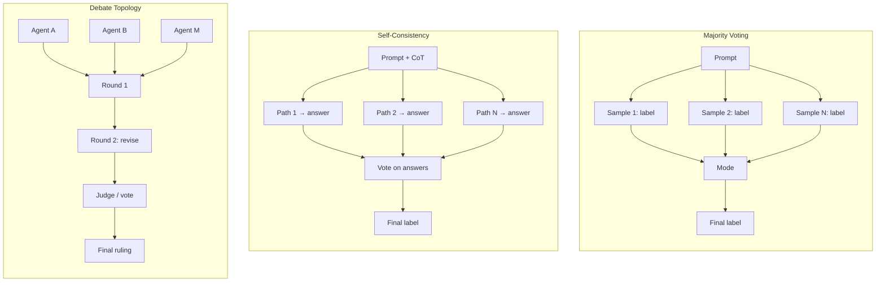

# Voting, Self-Consistency, and Debate Topology

## Learning Objectives

1. Implement majority voting, self-consistency, and multi-agent debate as three distinct aggregation strategies over noisy LLM completions.
2. Compare the three methods on vote distribution, token cost, and agreement rate using a shared classification task.
3. Detect three failure modes — tied votes, answer extraction errors, and premature consensus — from vote distribution signatures.
4. Apply self-consistency with a configurable confidence threshold to ICP qualification, mapping the aggregation mechanism to enrichment waterfall cross-validation.

## The Problem

Single-shot LLM outputs drift on repeat calls. Run the same classification prompt twice — "is this company enterprise or SMB?" — and you will get different answers. At temperature 0, the drift is smaller but not zero. At temperature 0.7, which is what most production systems use, the drift is substantial. When classification accuracy matters — whether a company fits your ICP, whether a support ticket is escalation-worthy, whether a lead should be routed to sales — one completion is a coin flip you are wrapping in confident prose.

The naive fix is a bigger prompt. That rarely works. The prompt was not the problem — the sampling was. A longer, more detailed prompt constrains the output space, but the model still samples from a distribution over that space. You have not changed the fundamental issue: one sample is one draw from a distribution, and you need the mode.

The real fix is aggregation. Draw N samples, extract the answer from each, and vote. The question is how to draw those samples, what to vote on, and whether the samples should talk to each other first. Those choices produce three different mechanisms — majority voting, self-consistency, and debate topology — that trade token cost for reliability in different ways and fail differently.

Debate adds two more structural choices on top: who talks to whom (topology), and how many rounds they argue before voting. Du et al. (arXiv:2305.14325) showed that debate can improve accuracy, but the same paper showed it can degrade it — both the number of rounds and the number of agents matter independently. Teams that bolt "run 5 agents and vote" onto a task often regress versus a single agent. The failures are not random. They track topology and heterogeneity. [CITATION NEEDED — concept: debate topology convergence bounds relative to agent count and round count]

## The Concept

Three patterns extract a stable answer from multiple LLM samples. They differ in what they sample, what they vote on, and whether the samples interact.

**Majority voting** is the simplest. You run the same prompt N times at temperature > 0, collect N labels, and take the mode. No chain-of-thought, no reasoning extraction — just the final answer from each call, counted. The assumption is that the correct answer is the most probable output, so sampling N times and taking the most frequent one gets you closer to the true mode than any single draw. Wang et al. 2022 ("Self-Consistency Improves Chain of Thought Reasoning") showed that this assumption holds better when the samples include reasoning, which leads to the second pattern.

**Self-consistency** modifies majority voting in one specific way: each of the N samples is a chain-of-thought reasoning path, not a bare label. You still take the mode of the final answers, but the insight is that correct reasoning paths converge on the same answer while incorrect reasoning paths diverge. On GSM8K (grade-school math), Wang et al. reported that self-consistency with N=40 samples at temperature 0.7 substantially outperformed a single greedy decode. The mechanism is that CoT exposes the reasoning, and wrong reasoning produces more variable answers than right reasoning — so voting filters for the stable answer.

**Debate topology** adds interaction. M agents generate initial answers, then argue in rounds. After each round, agents see other agents' arguments and revise. A judge (or final vote) produces the output. The topology — who talks to whom — shapes whether the system converges on the correct answer or collapses into groupthink.

The three topologies that matter for debate are star, pairwise, and tournament. In a star topology, all agents argue directly to a single judge — no agent-to-agent communication. In pairwise, two debaters present opposing answers and the judge picks. In a tournament, agents are bracketed into elimination rounds where winners advance. MultiAgentBench (arXiv:2503.01935, ACL 2025) evaluated star, chain, tree, and graph coordination structures and found graph topology performed best for