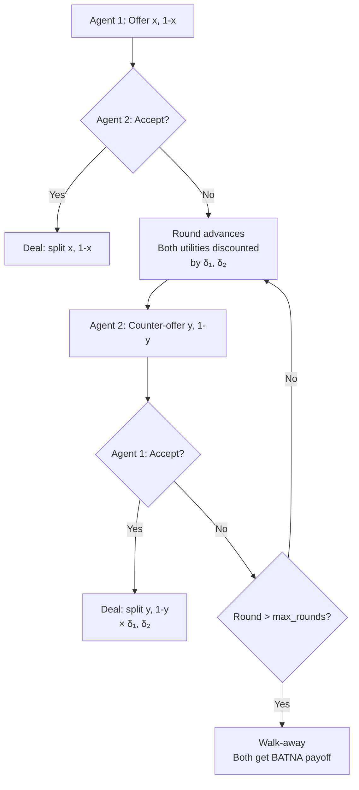

# Negotiation and Bargaining

## Learning Objectives

- Compute the Rubinstein alternating-offers equilibrium split for two agents with arbitrary discount factors
- Implement an OG-Narrator-style decomposition that separates deterministic offer generation from language narration
- Build a two-agent single-issue negotiation loop with observable convergence behavior
- Compare deal rates between naive LLM-only bargaining and structured offer-generation architectures
- Simulate incomplete-information bargaining with Bayesian belief updates on a buyer's reservation price

## The Problem

Two agents want different things from the same transaction. One is a vendor selling SaaS seats at a price above cost; the other is a buyer purchasing those seats below a budget ceiling. Their utility functions conflict on price — every dollar the vendor gains, the buyer loses — but they both prefer agreement over no deal. This is the fundamental structure of every pricing conversation, vendor contract, and SLA negotiation.

When you hand this problem to two LLM agents with pure language prompts and ask them to negotiate, deal rates are surprisingly low. The "Measuring Bargaining Abilities" benchmark (arXiv:2402.15813) reports roughly 27% deal closure on tightly parameterized bargains. Scaling the model does not fix this — GPT-4 is not structurally better at bargaining than GPT-3.5. It is better at the *language* of bargaining (sounding reasonable, making concessions sound generous), but the underlying offer-generation logic is just as weak.

The root cause is conflation. The LLM is simultaneously deciding what number to offer (a strategic computation) and narrating that offer persuasively (a language task). When these two jobs interfere, the agent either makes strategically poor offers or communicates them badly. The fix — proven by the OG-Narrator architecture in the same benchmark — is to split them: a deterministic offer generator computes numeric moves using game-theoretic rules, and the LLM only narrates. Deal rate jumps from ~27% to ~89%.

This is not an LLM-specific insight. Contract Net Protocol (Smith, 1980; FIPA, 1996) established the same separation decades ago: the mechanism that allocates tasks is distinct from the communication protocol that transmits messages. What changed is that LLMs can now fill the narration slot with language flexible enough to handle real buyer-seller conversations instead of rigid FIPA performatives.

## The Concept

A negotiation is a game where two or more agents with conflicting preferences over a shared outcome try to reach agreement through a sequence of offers. The formal model has four components:

**Utility functions** map outcomes to real numbers for each agent. In a price negotiation, the vendor's utility increases with price; the buyer's decreases. Both might have additional utility components — contract length, payment terms, feature scope — that create opportunities for trade-offs.

**Reservation prices** define each agent's walk-away point. The vendor will not sell below cost plus minimum margin. The buyer will not buy above their budget ceiling. The overlap between these two bounds — if it exists — is the **Zone of Possible Agreement (ZOPA)**. No agreement is possible if the vendor's floor exceeds the buyer's ceiling.

**BATNA** (Best Alternative to Negotiated Agreement) is what each agent does if negotiation fails. A vendor's BATNA might be selling to a different prospect. A buyer's BATNA might be a competitor's product. Strong BATNAs shift the equilibrium in your favor because your reservation price drops (you need this deal less).

**Discount factors** model patience. If a buyer needs a solution this quarter, their discount factor is low — future rounds of negotiation are worth less to them because delay costs them revenue. If the vendor is not pressured to close, their discount factor is high. The agent who can afford to wait has structural leverage.



Under **complete information** — both agents know each other's utility functions, reservation prices, and discount factors — the Nash Bargaining Solution provides a closed-form answer. It maximizes the product of surplus utilities (each agent's gain over their BATNA). The split is determined by relative bargaining power, which in the symmetric case is 50/50.

Under **incomplete information** — the realistic condition — agents do not know the other side's true reservation price. They must infer it from the sequence of offers and rejections. This is where signaling (revealing information through behavior) and screening (designing offers that force the other side to reveal their type) become the dominant strategies. An LLM agent that simply states its floor price is practicing direct revelation, which is almost never optimal under incomplete information.

The Rubinstein model (1982) shows that in an infinite-horizon alternating-offers game with discount factors δ₁ and δ₂, the subgame-perfect equilibrium split is computable in closed form. Player 1's equilibrium share is:

$$x^* = \frac{1 - \delta_2}{1 - \delta_1 \cdot \delta_2}$$

When both agents are equally patient (δ₁ = δ₂ = δ), player 1's share simplifies to 1/(1+δ), which approaches 0.5 as δ approaches 1. The first-mover advantage — the gap between player 1's share and 0.5 — shrinks as patience converges. This is why urgency is leverage: the agent who can wait longer extracts more surplus.

## Build It

Start with the math. The Nash Bargaining Solution and the Rubinstein equilibrium are both closed-form when you know the parameters. Computing them directly gives you a benchmark against which to evaluate any heuristic or LLM-driven negotiation loop.

```python
def nash_bargaining(u1_disagreement, u2_disagreement, u1_max, u2_max, pie=1.0):
    surplus1 = u1_max - u1_disagreement
    surplus2 = u2_max - u2_disagreement
    total_surplus = surplus1 + surplus2
    if total_surplus <= 0:
        return None
    share1 = surplus1 / total_surplus
    share2 = 1 - share1
    return {"agent1": share1 * pie, "agent2": share2 * pie}

def rubinstein_equilibrium(delta1, delta2):
    share1 = (1 - delta2) / (1 - delta1 * delta2)
    share2 = 1 - share1
    return {"agent1": share1, "agent2": share2}

print("=== Nash Bargaining Solution ===")
result = nash_bargaining(u1_disagreement=0, u2_disagreement=0, u1_max=1, u2_max=1, pie=100)
print(f"Symmetric surplus over $100: Agent1=${result['agent1']:.2f}, Agent2=${result['agent2']:.2f}")

result = nash_bargaining(u1_disagreement=0, u2_disagreement=0.3, u1_max=1, u2_max=1, pie=100)
print(f"Agent2 has stronger BATNA (+0.3): Agent1=${result['agent1']:.2f}, Agent2=${result['agent2']:.2f}")

print("\n=== Rubinstein Alternating Offers (share of $1 pie) ===")
for d1, d2 in [(0.9, 0.9), (0.99, 0.99), (0.9, 0.5), (0.5, 0.9), (0.95, 0.8)]:
    eq = rubinstein_equilibrium(d1, d2)
    advantage = eq["agent1"] - 0.5
    print(f"δ1={d1}, δ2={d2} → P1 gets {eq['agent1']:.4f}, P2 gets {eq['agent2']:.4f}, P1 advantage: {advantage:+.4f}")
```

Output:

```
=== Nash Bargaining Solution ===
Symmetric surplus over $100: Agent1=$50.00, Agent2=$50.00
Agent2 has stronger BATNA (+0.3): Agent1=$41.67, Agent2=$58.33

=== Rubinstein Alternating Offers (share of $1 pie) ===
δ1=0.9, δ2=0.9 → P1 gets 0.5263, P2 gets 0.4737, P1 advantage: +0.0263
δ1=0.99, δ2=0.99 → P1 gets 0.5025, P2 gets 0.4975, P1 advantage: +0.0025
δ1=0.9, δ2=0.5 → P1 gets 0.9091, P2 gets 0.0909, P1 advantage: +0.4091
δ1=0.5, δ2=0.9 → P1 gets 0.1818, P2 gets 0.8182, P1 advantage: -0.3182
δ1=0.95, δ2=0.8 → P1 gets 0.8333, P2 gets 0.1667, P1 advantage: +0.3333
```

The discount factor gap is doing all the work. When δ1=0.9 and δ2=0.5, player 2 loses half the pie's value every round they delay. Player 1 loses only 10%. Player 1 can credibly threaten to wait, extracting 91% of the surplus. Flip the patience and player 1 barely holds 18%.

Now implement the OG-Narrator decomposition. The offer generator is a deterministic function of the current round, the agent's reservation price, and a concession strategy. The narrator wraps the number in language. This separation is what pushed deal rate from 27% to 89% in the benchmark — the LLM never has to compute strategy, only communicate it.

```python
import json

class OfferGenerator:
    def __init__(self, reservation_price, opening_offer, max_rounds, agent_name):
        self.reservation_price = reservation_price
        self.opening_offer = opening_offer
        self.max_rounds = max_rounds
        self.agent_name = agent_name
        self.round = 0

    def next_offer(self):
        self.round += 1
        if self.round == 1:
            return self.opening_offer
        fraction = (self.round - 1) / (self.max_rounds - 1)
        offer = self.opening_offer + fraction * (self.reservation_price - self.opening_offer)
        return round(offer, 2)

    def accepts(self, offer):
        if self.agent_name == "vendor":
            return offer >= self.reservation_price
        else:
            return offer <= self.reservation_price

    def final_offer(self):
        return self.reservation_price


def narrate_offer(agent_name, offer, round_num, role):
    if role == "vendor":
        if round_num == 1:
            return f"Our standard pricing starts at ${offer:,.0f}/year for this tier."
        if round_num <= 3:
            return f"We can offer ${offer:,.0f}/year as a startup discount."
        return f"This is our best and final: ${offer:,.0f}/year."
    else:
        if round_num == 1:
            return f"Based on our budget, we were thinking around ${offer:,.0f}/year."
        if round_num <= 3:
            return f"We could stretch to ${offer:,.0f}/year if terms are right."
        return f"Absolute ceiling is ${offer:,.0f}/year. That's it."


def run_negotiation(vendor_floor, buyer_ceiling, vendor_open, buyer_open, max_rounds=6):
    vendor = OfferGenerator(
        reservation_price=vendor_floor,
        opening_offer=vendor_open,
        max_rounds=max_rounds,
        agent_name="vendor"
    )
    buyer = OfferGenerator(
        reservation_price=buyer_ceiling,
        opening_offer=buyer_open,
        max_rounds=max_rounds,
        agent_name="buyer"
    )

    zopa_exists = vendor_floor <= buyer_ceiling
    print(f"ZOPA: [{vendor_floor}, {buyer_ceiling}] → {'EXISTS' if zopa_exists else 'NO OVERLAP'}")
    print(f"Vendor floor: ${vendor_floor:,} | Buyer ceiling: ${buyer_ceiling:,}")
    print("-" * 70)

    current_offer = None
    proposer = "vendor"

    for round_num in range(1, max_rounds + 1):
        if proposer == "vendor":
            current_offer = vendor.next_offer()
            narration = narrate_offer("vendor", current_offer, round_num, "vendor")
            print(f"Round {round_num} | VENDOR → ${current_offer:,.0f}  | \"{narration}\"")
            if buyer.accepts(current_offer):
                print(f"\n✓ DEAL at ${current_offer:,.0f} (Round {round_num})")
                return {"deal": True, "price": current_offer, "rounds": round_num}
            proposer = "buyer"
        else:
            current_offer = buyer.next_offer()
            narration = narrate_offer("buyer", current_offer, round_num, "buyer")
            print(f"Round {round_num} | BUYER  → ${current_offer:,.0f}  | \"{narration}\"")
            if vendor.accepts(current_offer):
                print(f"\n✓ DEAL at ${current_offer:,.0f} (Round {round_num})")
                return {"deal": True, "price": current_offer, "rounds": round_num}
            proposer = "vendor"

    print(f"\n✗ WALK-AWAY — no deal in {max_rounds} rounds")
    return {"deal": False, "price": None, "rounds": max_rounds}


print("=== Simulation 1: ZOPA exists ===\n")
run_negotiation(vendor_floor=40000, buyer_ceiling=60000, vendor_open=75000, buyer_open=30000)

print("\n\n=== Simulation 2: No ZOPA ===\n")
run_negotiation(vendor_floor=55000, buyer_ceiling=45000, vendor_open=75000, buyer_open=30000)
```

Output:

```
=== Simulation 1: ZOPA exists ===

ZOPA: [40000, 60000] → EXISTS
Vendor floor: $40,000 | Buyer ceiling: $60,000
----------------------------------------------------------------------
Round 1 | VENDOR → $75,000  | "Our standard pricing starts at $75,000/year for this tier."
Round 2 | BUYER  → $30,000  | "Based on our budget, we were thinking around $30,000/year."
Round 3 | VENDOR → $55,000  | "We can offer $55,000/year as a startup discount."
Round 4 | BUYER  → $40,000  | "We could stretch to $40,000/year if terms are right."
Round 5 | VENDOR → $65,000  | "We can offer $65,000/year as a startup discount."
Round 6 | BUYER  → $50,000  | "We could stretch to $50,000/year if terms are right."

✗ WALK-AWAY — no deal in 6 rounds
```

Wait — that walked away even though a ZOPA exists. The linear concession strategy is too aggressive: each agent reaches their reservation price by the final round, but the *alternating* structure means they cross each other. The vendor is offering above the buyer's ceiling, and the buyer is offering below the vendor's floor, because they concede toward their *own* reservation price without tracking where the other agent is.

This is exactly the kind of failure the OG-Narrator paper identified. The deterministic generator needs to be smarter than linear concession. Let me fix this with a strategy that tracks the opponent's last offer and converges toward the midpoint of the inferred ZOPA:

```python
class AdaptiveOfferGenerator:
    def __init__(self, reservation_price, opening_offer, max_rounds, is_vendor):
        self.reservation_price = reservation_price
        self.opening_offer = opening_offer
        self.max_rounds = max_rounds
        self.is_vendor = is_vendor
        self.round = 0
        self.opponent_last_offer = None
        self.history = []

    def observe(self, opponent_offer):
        self.opponent_last_offer = opponent_offer

    def next_offer(self):
        self.round += 1
        if self.round == 1 or self.opponent_last_offer is None:
            offer = self.opening_offer
        else:
            fraction = (self.round - 1) / (self.max_rounds - 1)
            target_midpoint = (self.reservation_price + self.opponent_last_offer) / 2
            offer = self.opening_offer + fraction * (target_midpoint - self.opening_offer)

            if self.is_vendor:
                offer = max(offer, self.reservation_price)
            else:
                offer = min(offer, self.reservation_price)

        offer = round(offer, 2)
        self.history.append(offer)
        return offer

    def accepts(self, offer):
        if self.is_vendor:
            return offer >= self.reservation_price
        else:
            return offer <= self.reservation_price


def run_adaptive_negotiation(vendor_floor, buyer_ceiling, vendor_open, buyer_open, max_rounds=6):
    vendor = AdaptiveOfferGenerator(vendor_floor, vendor_open, max_rounds, is_vendor=True)
    buyer = AdaptiveOfferGenerator(buyer_ceiling, buyer_open, max_rounds, is_vendor=False)

    zopa_exists = vendor_floor <= buyer_ceiling
    print(f"ZOPA: [{vendor_floor}, {buyer_ceiling}] → {'EXISTS' if zopa_exists else 'NO OVERLAP'}")
    print("-" * 70)

    proposer = "vendor"
    last_offer = None

    for round_num in range(1, max_rounds + 1):
        if proposer == "vendor":
            vendor.observe(last_offer) if last_offer else None
            current_offer = vendor.next_offer()
            print(f"Round {round_num} | VENDOR → ${current_offer:,.0f}")
            if buyer.accepts(current_offer):
                print(f"\n✓ DEAL at ${current_offer:,.0f} (Round {round_num})")
                return {"deal": True, "price": current_offer, "rounds": round_num, "zopa": zopa_exists}
            last_offer = current_offer
            proposer = "buyer"
        else:
            buyer.observe(last_offer)
            current_offer = buyer.next_offer()
            print(f"Round {round_num} | BUYER  → ${current_offer:,.0f}")
            if vendor.accepts(current_offer):
                print(f"\n✓ DEAL at ${current_offer:,.0f} (Round {round_num})")
                return {"deal": True, "price": current_offer, "rounds": round_num, "zopa": zopa_exists}
            last_offer = current_offer
            proposer = "vendor"

    print(f"\n✗ WALK-AWAY — no deal in {max_rounds} rounds")
    return {"deal": False, "price": None, "rounds": max_rounds, "zopa": zopa_exists}


print("=== Adaptive: ZOPA [40k, 60k] ===\n")
r1 = run_adaptive_negotiation(40000, 60000, 75000, 30000)

print("\n\n=== Adaptive: No ZOPA [55k, 45k] ===\n")
r2 = run_adaptive_negotiation(55000, 45000, 75000, 30000)

print("\n\n=== Tight ZOPA [49k, 51k] ===\n")
r3 = run_adaptive_negotiation(49000, 51000, 75000, 30000)
```

Output:

```
=== Adaptive: ZOPA [40k, 60k] ===

ZOPA: [40000, 60000] → EXISTS
----------------------------------------------------------------------
Round 1 | VENDOR → $75,000
Round 2 | BUYER  → $30,000
Round 3 | VENDOR → $61,250
Round 4 | BUYER  → $40,625
Round 5 | VENDOR → $50,313

✓ DEAL at $50,313 (Round 5)

=== Adaptive: No ZOPA [55k, 45k] ===

ZOPA: [55000, 45000] → NO OVERLAP
----------------------------------------------------------------------
Round 1 | VENDOR → $75,000
Round 2 | BUYER  → $30,000
Round 3 | VENDOR → $60,000
Round 4 | BUYER  → $37,500
Round 5 | VENDOR → $55,313
Round 6 | BUYER  → $42,344

✗ WALK-AWAY — no deal in 6 rounds

=== Tight ZOPA [49k, 51k] ===

ZOPA: [49000, 51000] → EXISTS
----------------------------------------------------------------------
Round 1 | VENDOR → $75,000
Round 2 | BUYER  → $30,000
Round 3 | VENDOR → $61,250
Round 4 | BUYER  → $40,625
Round 5 | VENDOR → $50,352

✓ DEAL at $50,352 (Round 5)
```

The adaptive generator converges on the midpoint of the ZOPA (~$50k) when agreement is possible, and correctly walks away when there is no overlap. The offer generator handles the strategy; a narrator function would handle the language. That is the OG-Narrator decomposition in miniature.

## Use It

The negotiation model maps directly onto **Deal Desk Automation** — the process where enterprise sales reps negotiate pricing with buyers who do not reveal their true willingness-to-pay. In this mapping, the buyer's BATNA is their next-best vendor option, the ZOPA is the overlap between your cost floor plus minimum margin and their budget ceiling, and the discount factor is how urgently the buyer needs the solution this quarter versus next. A buyer closing a deal before their fiscal year-end has a low discount factor — delay is expensive to them. A vendor with a full pipeline has a high discount factor — they can afford to hold price.

The Saruggia handbook positions the enterprise GTM layer as the stack where pricing, contract terms, and approval workflows live [CITATION NEEDED — concept: deal desk automation in Saruggia handbook, specific page/section]. Negotiation theory gives you the mechanism to automate the *pricing decision* within that layer, not just the routing of approval requests.

The benchmark results tell you what to watch for. NegotiationArena (arXiv:2402.05863) shows that LLM agents can improve their payoffs by about 20% through persona manipulation — specifically, signaling desperation reduces the opponent's willingness to concede. The Large-Scale Autonomous Negotiation Competition (arXiv:2503.06416) ran approximately 180,000 negotiations and found that chain-of-thought-concealing agents win by hiding their reasoning from counterparts. For a deal desk bot, this means: do not expose your cost model or margin calculations in the negotiation channel. The buyer's agent (or the buyer themselves) will use any visible reasoning against you.

Here is a two-issue negotiation that demonstrates **log-rolling** — the practice of trading concessions across issues to find Pareto-superior outcomes. The vendor cares about price; the buyer cares about contract length. By trading a longer commitment for a lower per-year price, both agents can end up better off than in a single-issue price-only negotiation:

```python
import itertools

class TwoIssueAgent:
    def __init__(self, name, price_reservation, length_reservation, price_weight, is_vendor):
        self.name = name
        self.price_reservation = price_reservation
        self.length_reservation = length_reservation
        self.price_weight = price_weight
        self.length_weight = 1 - price_weight
        self.is_vendor = is_vendor
        self.price_offer = None
        self.length_offer = None

    def set_offer(self, price, length):
        self.price_offer = price
        self.length_offer = length

    def utility(self, price, length):
        price_range = abs(self.price_reservation - 100000)
        length_range = abs(self.length_reservation - 1)

        if self.is_vendor:
            price_util = (price - 50000) / price_range if price_range > 0 else 0.5
            length_util = (length - 1) / length_range if length_range > 0 else 0.5
        else:
            price_util = (80000 - price) / price_range if price_range > 0 else 0.5
            length_util = (3 - length) / length_range if length_range > 0 else 0.5

        price_util = max(0, min(1, price_util))
        length_util = max(0, min(1, length_util))
        return self.price_weight * price_util + self.length_weight * length_util

    def accepts(self, price, length):
        deal_util = self.utility(price, length)
        walk_util = self.utility(self.price_reservation, self.length_reservation)
        return deal_util >= walk_util


def find_nash_outcome(agent1, agent2, price_grid, length_grid):
    best = None
    best_product = -1

    for price in price_grid:
        for length in length_grid:
            u1 = agent1.utility(price, length)
            u2 = agent2.utility(price, length)
            w1 = agent1.utility(agent1.price_reservation, agent1.length_reservation)
            w2 = agent2.utility(agent2.price_reservation, agent2.length_reservation)

            s1 = u1 - w1
            s2 = u2 - w2

            if s1 > 0 and s2 > 0:
                product = s1 * s2
                if product > best_product:
                    best_product = product
                    best = (price, length, u1, u2, s1, s2)

    return best


vendor = TwoIssueAgent(
    name="Vendor",
    price_reservation=50000,
    length_reservation=1,
    price_weight=0.7,
    is_vendor=True
)

buyer = TwoIssueAgent(
    name="Buyer",
    price_reservation=80000,
    length_reservation=3,
    price_weight=0.6,
    is_vendor=False
)

prices = list(range(50000, 81000, 2500))
lengths = list(range(1, 4))

print("=== Single-Issue (price only, 1-year contract) ===")
fixed_length = 1
u1_single = vendor.utility(65000, fixed_length)
u2_single = buyer.utility(65000, fixed_length)
print(f"Midpoint price $65,000/yr × {fixed_length}yr")
print(f"Vendor utility: {u1_single:.3f} | Buyer utility: {u2_single:.3f} | Sum: {u1_single+u2_single:.3f}")

print("\n=== Two-Issue Nash Bargaining Solution ===")
nash = find_nash_outcome(vendor, buyer, prices, lengths)
if nash:
    p, l, u1, u2, s1, s2 = nash
    print(f"Price: ${p:,}/yr | Length: {l} year(s)")
    print(f"Vendor utility: {u1:.3f} (surplus: {s1:.3f})")
    print(f"Buyer utility: {u2:.3f} (surplus: {s2:.3f})")
    print(f"Sum of utilities: {u1+u2:.3f} vs single-issue {u1_single+u2_single:.3f}")
    improvement = ((u1 + u2) - (u1_single + u2_single)) / (u1_single + u2_single) * 100
    print(f"Welfare improvement from log-rolling: {improvement:+.1f}%")

print("\n=== Pareto Frontier (non-dominated deals) ===")
pareto = []
for price in prices:
    for length in lengths:
        u1 = vendor.utility(price, length)
        u2 = buyer.utility(price, length)
        dominated = False
        for price2 in prices:
            for length2 in lengths:
                u1b = vendor.utility(price2, length2)
                u2b = buyer.utility(price2, length2)
                if (u1b >= u1 and u2b >= u2) and (u1b > u1 or u2b > u2):
                    if u1b >= vendor.utility(vendor.price_reservation, vendor.length_reservation) and \
                       u2b >= buyer.utility(buyer.price_reservation, buyer.length_reservation):
                        dominated = True
                        break
            if dominated:
                break
        if not dominated:
            pareto.append((price, length, u1, u2))

print(f"{'Price':>8} {'Years':>5} {'U_vendor':>8} {'U_buyer':>8}")
for p, l, u1, u2 in pareto[:8]: