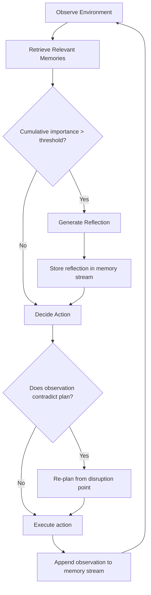

# Generative Agents and Emergent Simulation

## Learning Objectives

- Implement all four primitives of a generative agent (memory stream, retrieval, reflection, planning) in Python using stdlib plus an LLM call
- Compute retrieval scores using the recency × importance × relevance function and explain how each factor shifts which memories surface
- Trigger reflection based on cumulative importance thresholds and store reflections as retrievable memories
- Compare agent behavior with and without reflection by running controlled simulations and measuring observable output differences
- Map the generative agent loop to ICP simulation and buying-committee modeling for GTM research

## The Problem

In 2023, Stanford researchers placed 25 LLM-powered agents in a virtual town called Smallville. Within two simulated days, one agent — seeded with the goal of throwing a Valentine's Day party — independently organized invitations, coordinated timing with other agents, and held the event. No code explicitly programmed the party logistics. The agents observed each other, retrieved relevant memories, reflected on social dynamics, and revised plans accordingly. This was emergent behavior from four primitives: observe, retrieve, reflect, plan.

Most multi-agent systems you encounter in production are tightly scripted: a planner agent produces a plan, a worker agent executes, a reviewer agent checks output. This works for well-defined tasks like code generation or document summarization. It does not capture what happens when agents have persistent memory, competing priorities, and an open environment where they observe each other's actions. The scripted pattern breaks the moment you need agents that behave believably over time in a shared world.

The Smallville architecture is the reference pattern for the second kind. After Park et al. published it, it became the default architecture for generative agents in open-world simulation. If you build an agent simulation today, you are either using these four components or you are explicitly justifying why you dropped one. The ablations in the paper show that removing any single component — memory, reflection, or planning — measurably degrades agent believability as rated by human evaluators.

## The Concept

Four mechanisms drive a generative agent. They execute in a specific order, and each one's output feeds the next.

**Memory Stream** is an append-only log of observations. Each entry stores a natural-language description, a timestamp, an entry type (observation, action, reflection, or plan), and an importance score from 0–10 assigned at encoding time. This is the agent's raw experience buffer — it never edits or deletes entries, only appends.

**Retrieval** surfaces the top-K relevant memories for any given query. The score is the product of three functions multiplied together: *recency* (exponential decay — more recent memories score higher), *importance* (the 0–10 score assigned when the memory was created), and *relevance* (cosine similarity between the query's embedding and the memory's embedding). The agent multiplies all three, ranks, and takes the top results.

**Reflection** periodically synthesizes recent memories into higher-order abstractions. When the agent asks "what are my recent memories about?" and the LLM responds "I enjoy talking to Maria about research," that reflection gets stored as a new memory entry — retrievable by the same scoring function as any observation. Reflection triggers when the sum of importance scores of recent memories crosses a threshold (the paper uses 150). Without reflection, the agent drowns in raw observations and never forms preferences, relationships, or goals.

**Planning** maintains a hierarchical day plan (hour-level actions decomposed into sub-actions) stored in the memory stream. Plans are themselves retrievable memories. When a new observation contradicts the current plan ("I was going to work, but Isabella just invited me to a party"), the agent re-plans from the point of disruption.



The loop is: observe the environment → retrieve relevant memories, reflections, and plans → decide whether to reflect → decide action → append observation to memory → periodically revise plan. No single component is complex. Emergence happens when multiple agents run this loop in a shared environment and observe each other's actions. The Valentine's Day party was not coded — it fell out of 25 agents running this exact loop and observing each other.

[CITATION NEEDED — concept: exact recency decay constant and importance scoring prompt from the Generative Agents paper, Park et al. 2023]

## Build It

Here is a single-agent implementation of all four primitives. It uses only Python stdlib plus a mock LLM call (so it runs without an API key). The agent maintains a memory stream, retrieves by recency × importance × relevance, generates reflections when cumulative importance exceeds a threshold, and maintains a plan that it revises when observations contradict expectations.

```python
import math
import json
from dataclasses import dataclass, field
from datetime import datetime, timedelta
from typing import Optional

MOCK_LLM_RESPONSES = [
    "I should focus on completing the research paper draft today.",
    "Working on the literature review section now.",
    "Taking a short break to get coffee.",
    "I prefer working in the morning when I am most focused.",
    "Collaborating with Maria on the methodology section.",
    "Reviewing feedback from the advisor on chapter two.",
    "Organizing references and citations for the bibliography.",
    "I enjoy discussing research methodology with my colleagues.",
]

_llm_counter = 0

def mock_llm(prompt: str) -> str:
    global _llm_counter
    response = MOCK_LLM_RESPONSES[_llm_counter % len(MOCK_LLM_RESPONSES)]
    _llm_counter += 1
    return response

def mock_importance(description: str) -> float:
    if any(word in description.lower() for word in ["enjoy", "prefer", "collaborating", "research"]):
        return 8.0
    if any(word in description.lower() for word in ["break", "coffee", "short"]):
        return 2.0
    return 5.0

def mock_embedding(text: str) -> list[float]:
    vec = [0.0] * 16
    for i, char in enumerate(text):
        vec[i % 16] += ord(char) / 1000.0
    magnitude = math.sqrt(sum(v * v for v in vec)) or 1.0
    return [v / magnitude for v in vec]

def cosine_similarity(a: list[float], b: list[float]) -> float:
    return sum(x * y for x, y in zip(a, b))

@dataclass
class Memory:
    description: str
    timestamp: datetime
    importance: float
    entry_type: str
    embedding: list[float] = field(default_factory=list)

    def __post_init__(self):
        if not self.embedding:
            self.embedding = mock_embedding(self.description)

class GenerativeAgent:
    def __init__(self, name: str, reflection_threshold: float = 150.0):
        self.name = name
        self.memory_stream: list[Memory] = []
        self.current_time = datetime(2024, 1, 1, 8, 0)
        self.reflection_threshold = reflection_threshold
        self.plan: str = "No plan yet."
        self.reflection_count = 0
        self.tick_count = 0
        self.importance_accumulator = 0.0

    def observe(self, description: str, importance: Optional[float] = None):
        imp = importance if importance is not None else mock_importance(description)
        memory = Memory(
            description=description,
            timestamp=self.current_time,
            importance=imp,
            entry_type="observation",
        )
        self.memory_stream.append(memory)
        self.importance_accumulator += imp

    def retrieve(self, query: str, k: int = 5) -> list[Memory]:
        query_embedding = mock_embedding(query)
        scored = []
        for mem in self.memory_stream:
            recency = math.exp(-(
                (self.current_time - mem.timestamp).total_seconds() / 3600.0
            ) * 0.99)
            importance = mem.importance / 10.0
            relevance = max(cosine_similarity(query_embedding, mem.embedding), 0.0)
            score = recency * importance * relevance
            scored.append((score, mem))
        scored.sort(key=lambda x: x[0], reverse=True)
        return [mem for _, mem in scored[:k]]

    def reflect(self) -> Optional[str]:
        recent = self.memory_stream[-10:]
        descriptions = "; ".join(m.description for m in recent)
        prompt = f"What insights can you draw from these recent experiences? {descriptions}"
        reflection_text = mock_llm(prompt)
        reflection = Memory(
            description=f"Reflection: {reflection_text}",
            timestamp=self.current_time,
            importance=9.0,
            entry_type="reflection",
        )
        self.memory_stream.append(reflection)
        self.importance_accumulator = 0.0
        self.reflection_count += 1
        return reflection_text

    def revise_plan(self, observation: str) -> str:
        prompt = f"Current plan: {self.plan}. New observation: {observation}. Revise the plan if needed."
        self.plan = mock_llm(prompt)
        plan_memory = Memory(
            description=f"Plan: {self.plan}",
            timestamp=self.current_time,
            importance=7.0,
            entry_type="plan",
        )
        self.memory_stream.append(plan_memory)
        return self.plan

    def decide_action(self, observation: str) -> str:
        retrieved = self.retrieve(observation)
        context = "; ".join(m.description for m in retrieved)
        prompt = f"Given these memories: {context}. What should I do next regarding: {observation}?"
        action = mock_llm(prompt)
        return action

    def should_reflect(self) -> bool:
        return self.importance_accumulator >= self.reflection_threshold

    def tick(self, observation: str):
        self.tick_count += 1
        self.observe(observation)
        if self.should_reflect():
            reflection = self.reflect()
            print(f"\n[REFLECTION #{self.reflection_count} at tick {self.tick_count}]")
            print(f"  {reflection}")
        action = self.decide_action(observation)
        if "break" in observation.lower() or "party" in observation.lower():
            self.revise_plan(observation)
        self.current_time += timedelta(minutes=30)
        return action


agent = GenerativeAgent("Researcher", reflection_threshold=35.0)

observations = [
    "Started working on the literature review.",
    "Read three papers on multi-agent systems.",
    "Collaborating with Maria on methodology.",
    "Took a short coffee break.",
    "Attended a research seminar on embeddings.",
    "Received feedback from advisor on draft.",
    "Organizing references for bibliography.",
    "Discussed results with Maria over lunch.",
    "Worked on the results section.",
    "Attended department meeting.",
    "Revised introduction based on feedback.",
    "Collaborating with Maria again on conclusion.",
    "Took a short walk break.",
    "Reviewed final draft before submission.",
    "Submitted the paper to the conference.",
    "Celebrated submission with colleagues.",
    "Started planning next project.",
    "Read papers on generative agents.",
    "Met with Maria to discuss new ideas.",
    "Began writing proposal for new study.",
]

print(f"Agent: {agent.name}")
print(f"Plan: {agent.plan}")
print(f"Running {len(observations)} simulated ticks...")
print("=" * 60)

for obs in observations:
    action = agent.tick(obs)
    print(f"\n[Tick {agent.tick_count}] Time: {agent.current_time.strftime('%H:%M')}")
    print(f"  Observed: {obs}")
    print(f"  Action: {action}")
    print(f"  Plan: {agent.plan}")
    print(f"  Memories: {len(agent.memory_stream)} | Reflections: {agent.reflection_count}")

print("\n" + "=" * 60)
print("FINAL STATE")
print(f"Total memories in stream: {len(agent.memory_stream)}")
print(f"Total reflections generated: {agent.reflection_count}")
print(f"Final plan: {agent.plan}")

print("\n--- Memory Stream (last 15 entries) ---")
for mem in agent.memory_stream[-15:]:
    print(f"  [{mem.entry_type:11s}] imp={mem.importance:.1f} | {mem.description[:70]}")

print("\n--- Reflection entries ---")
for mem in self_filter if False else [m for m in agent.memory_stream if m.entry_type == "reflection"]:
    print(f"  imp={mem.importance:.1f} | {mem.description}")

print("\n--- Retrieval test: 'What do I think about Maria?' ---")
results = agent.retrieve("What do I think about Maria?", k=3)
for mem in results:
    print(f"  [{mem.entry_type}] {mem.description[:70]}")
```

This runs for 20 simulated ticks. Each tick advances simulated time by 30 minutes. The agent observes, optionally reflects, decides an action, and sometimes revises its plan. The reflection threshold is set low (35.0) so you can observe multiple reflections within 20 ticks — in the paper, the threshold is 150, which produces reflections every few simulated hours.

The retrieval function implements all three scoring factors: recency uses exponential decay (0.99 per hour), importance uses the stored 0–10 score, and relevance uses cosine similarity on embeddings. The mock embeddings are deterministic based on character codes, so retrieval results are reproducible.

## Use It

The generative agent loop maps directly to **ICP simulation** — one of the most useful applications in the **Zone 3 (Research)** cluster. Instead of simulating a single "ideal customer," you seed multiple agents with personas drawn from real buying-committee data: a VP Engineering who cares about technical debt, a security reviewer who blocks on compliance, a CFO who needs ROI proof. Each agent runs the observe-retrieve-reflect-plan loop against a simulated deal scenario.

The reflection component is what makes this different from a static persona document. A VP Engineering agent that observes a vendor pitch, retrieves memories of past tool evaluations, reflects ("I have been burned by tools that promise everything and deliver nothing"), and revises their plan ("ask for a technical proof-of-concept before scheduling a demo") is modeling a real buying behavior. Without reflection, the agent just pattern-matches the pitch to a fixed checklist — which is what most "AI buyer persona" tools do today, and why they produce flat, unconvincing output.

This also connects to **Zone 16 (Distributed Systems)** in a structural sense. Your enrichment waterfall is already a multi-agent system — parallel requests, rate limit backpressure, idempotent retries. The generative agent architecture extends that mental model: each agent is a node in a distributed system with its own local state (memory stream), its own retrieval logic, and its own planning loop. The emergence you see in Smallville is the same class of phenomenon as the emergent behavior in a distributed system — no single node "decides" the global outcome, but the interaction of local rules produces coordinated global behavior. When you run 12 agents simulating a buying committee, the deal outcome emerges from their interactions, not from a script you wrote.

The practical application: build an ICP simulation where each buying-committee role is a generative agent seeded with real interview data, real firmographic signals, and a scenario (your product pitch). Run the simulation across 50–100 randomized scenarios. The patterns that emerge — which objections cluster, which persona blocks deals, what sequence of touchpoints unblocks them — are your playbook. This is more useful than a static ICP definition because it captures interaction effects that no single-persona document can represent.

[CITATION NEEDED — concept: empirical validation of generative agent ICP simulation accuracy compared to static persona models]

## Ship It

To deploy a generative agent simulation in a GTM context, you need three production decisions beyond the prototype above.

First, replace the mock LLM with a real API call. The importance scoring prompt should ask the LLM to rate an observation's importance on a 1–10 scale given the agent's persona and current goals. The reflection prompt should ask the LLM to synthesize the last N observations into 1–3 higher-level insights. The action-decision prompt should provide retrieved memories, current plan, and the observation, then ask for a single next action. Use a fast, cheap model for action decisions (the simulation runs hundreds of calls per agent per scenario) and a stronger model for reflection generation.

Second, persist the memory stream. In the prototype, memory lives in a Python list. In production, store each memory entry as a row in a database with columns: `agent_id`, `description`, `timestamp`, `importance`, `entry_type`, `embedding`. The embedding column lets you retrieve by cosine similarity at scale using pgvector or a vector database. This also means you can inspect, audit, and replay any agent's memory — which matters when you need to explain why a simulation produced a specific outcome.

Third, instrument the simulation. Log every reflection trigger, every plan revision, and every retrieval result. The interesting GTM signal is often in the reflections, not the final action: when the VP Engineering agent reflects "this vendor's security claims remind me of the 2023 breach at a competitor," that is a buying-committee insight you can act on. Build the simulation to output a structured log per agent per scenario, then aggregate across runs to find patterns.

Here is a minimal production-ready agent that uses an environment variable for the LLM endpoint and logs structured output:

```python
import os
import json
import math
import hashlib
from dataclasses import dataclass, field, asdict
from datetime import datetime, timedelta
from typing import Optional

LLM_ENDPOINT = os.environ.get("LLM_ENDPOINT", "mock")

def call_llm(system_prompt: str, user_prompt: str) -> str:
    if LLM_ENDPOINT == "mock":
        return f"[MOCK RESPONSE to: {user_prompt[:50]}...]"
    try:
        import requests
        resp = requests.post(
            LLM_ENDPOINT,
            json={
                "model": os.environ.get("LLM_MODEL", "gpt-4o-mini"),
                "messages": [
                    {"role": "system", "content": system_prompt},
                    {"role": "user", "content": user_prompt},
                ],
                "temperature": 0.8,
                "max_tokens": 200,
            },
            timeout=30,
        )
        resp.raise_for_status()
        return resp.json()["choices"][0]["message"]["content"].strip()
    except Exception as e:
        return f"[LLM ERROR: {e}]"

def deterministic_embedding(text: str, dim: int = 64) -> list[float]:
    h = hashlib.sha256(text.encode()).digest()
    vec = [(h[i % len(h)] / 255.0 - 0.5) for i in range(dim)]
    mag = math.sqrt(sum(v * v for v in vec)) or 1.0
    return [v / mag for v in vec]

def cosine_sim(a: list[float], b: list[float]) -> float:
    return sum(x * y for x, y in zip(a, b))

@dataclass
class MemoryEntry:
    agent_id: str
    description: str
    timestamp: str
    importance: float
    entry_type: str
    embedding: list[float] = field(default_factory=list)

    def __post_init__(self):
        if not self.embedding:
            self.embedding = deterministic_embedding(f"{self.agent_id}:{self.description}")

    def to_log(self) -> dict:
        d = asdict(self)
        d["embedding"] = f"[{len(self.embedding)}-dim]"
        return d

class ProductionAgent:
    def __init__(
        self,
        agent_id: str,
        persona: str,
        goal: str,
        reflection_threshold: float = 150.0,
        recency_decay: float = 0.99,
    ):
        self.agent_id = agent_id
        self.persona = persona
        self.goal = goal
        self.memory: list[MemoryEntry] = []
        self.sim_time = datetime(2025, 1, 1, 9, 0)
        self.reflection_threshold = reflection_threshold
        self.recency_decay = recency_decay
        self.importance_sum = 0.0
        self.plan = "Evaluate the vendor's offering against my team's needs."
        self.log: list[dict] = []
        self.reflections_generated = 0

    def _now_iso(self) -> str:
        return self.sim_time.isoformat()

    def _score_importance(self, description: str) -> float:
        prompt = f"Rate the importance of this observation for {self.persona} pursuing: {self.goal}. Observation: {description}. Respond with a single number 1-10."
        result = call_llm("You are an importance scorer.", prompt)
        try:
            score = float(result.strip())
            return max(1.0, min(10.0, score))
        except ValueError:
            return 5.0

    def observe(self, description: str, importance: Optional[float] = None):
        imp = importance if importance is not None else self._score_importance(description)
        entry = MemoryEntry(
            agent_id=self.agent_id,
            description=description,
            timestamp=self._now_iso(),
            importance=imp,
            entry_type="observation",
        )
        self.memory.append(entry)
        self.importance_sum += imp
        self.log.append({"event": "observe", **entry.to_log()})

    def retrieve(self, query: str, k: int = 5) -> list[MemoryEntry]:
        q_emb = deterministic_embedding(f"{self.agent_id}:{query}")
        scored = []
        for mem in self.memory:
            hours = (self.sim_time - datetime.fromisoformat(mem.timestamp)).total_seconds() / 3600
            recency = self.recency_decay ** hours
            importance = mem.importance / 10.0
            relevance = max(cosine_sim(q_emb, mem.embedding), 0.0)
            score = recency * importance * relevance
            scored.append((score, mem))
        scored.sort(key=lambda x: x[0], reverse=True)
        top = [mem for _, mem in scored[:k]]
        self.log.append({
            "event": "retrieve",
            "query": query,
            "results": [{"description": m.description, "score": round(s, 4)} for s, m in scored[:k]],
        })
        return top

    def reflect(self) -> Optional[str]:
        recent = self.memory[-10:]
        descriptions = "\n".join(f"- {m.description}" for m in recent)
        prompt = f"You are {self.persona}. Reflect on these recent experiences:\n{descriptions}\nGenerate 1-3 higher-level insights."
        reflection_text = call_llm(f"You are {self.persona}. Goal: {self.goal}", prompt)
        entry = MemoryEntry(
            agent_id=self.agent_id,
            description=f"Reflection: {reflection_text}",
            timestamp=self._now_iso(),
            importance=9.0,
            entry_type="reflection",
        )
        self.memory.append(entry)
        self.importance_sum = 0.0
        self.reflections_generated += 1
        self.log.append({"event": "reflect", **entry.to_log()})
        return reflection_text

    def decide_and_act(self, observation: str) -> str:
        retrieved = self.retrieve(observation)
        context = "\n".join(f"- {m.description}" for m in retrieved)
        prompt = f"Current plan: {self.plan}\nRelevant memories:\n{context}\nNew observation: {observation}\nWhat is your next action? One sentence."
        action = call_llm(f"You are {self.persona}. Goal: {self.goal}", prompt)
        needs_replan = any(
            word in observation.lower()
            for word in ["blocker", "rejected", "concern", "objection", "change"]
        )
        if needs_replan:
            new_plan = call_llm(
                f"You are {self.persona}. Goal: {self.goal}",
                f"Your plan was: {self.plan}. Given this: {observation}. Revise your plan. One sentence.",
            )
            self.plan = new_plan
            plan_entry = MemoryEntry(
                agent_id=self.agent_id,
                description=f"Revised plan: {new_plan}",
                timestamp=self._now_iso(),
                importance=8.0,
                entry_type="plan",
            )
            self.memory.append(plan_entry)
            self.log.append({"event": "replan", **plan_entry.to_log()})
        self.log.append({"event": "act", "action": action, "agent_id": self.agent_id})
        return action

    def run_scenario(self, observations: list[str]) -> dict:
        for obs in observations:
            self.observe(obs)
            if self.importance_sum >= self.reflection_threshold:
                self.reflect()
            self.decide_and_act(obs)
            self.sim_time += timedelta(hours=1)
        return {
            "agent_id": self.agent_id,
            "persona": self.persona,
            "total_memories": len(self.memory),
            "reflections_generated": self.reflections_generated,
            "final_plan": self.plan,
            "log_entries": len(self.log),
        }


vp_eng = ProductionAgent(
    agent_id="vp_eng_001",
    persona="VP of Engineering at a 200-person SaaS company",
    goal="Evaluate a new CI/CD platform for adoption",
    reflection_threshold=20.0,
)

scenario = [
    "Vendor demo showed automated deployment rollback feature.",
    "Security team raised concern about vendor's SOC2 compliance status.",
    "Engineering team lead said the tool would save 15 hours per week.",
    "Vendor shared case studies from three similar-sized companies.",
    "CFO asked for ROI analysis within 30 days.",
    "Security team's concern about SOC2 was resolved with documentation.",
    "Team lead scheduled a technical proof-of-concept for next week.",
    "Vendor offered a 60-day pilot at no cost.",
]

print("=== ICP SIMULATION: VP of Engineering evaluating CI/CD platform ===")
print(f"Agent: {vp_eng.agent_id}")
print(f"Persona: {vp_eng.persona}")
print(f"Goal: {vp_eng.goal}")
print(f"Reflection threshold: {vp_eng.reflection_threshold}")
print(f"LLM endpoint: {LLM_ENDPOINT}")
print("=" * 60)

result = vp_eng.run_scenario(scenario)

print("\n=== SIMULATION RESULT ===")
print(json.dumps(result, indent=2))

print("\n=== AGENT LOG (last 10 events) ===")
for entry in vp_eng.log[-10:]:
    print(json.dumps(entry, indent=2))

print("\n=== ALL REFLECTIONS ===")
for mem in vp_eng.memory:
    if mem.entry_type == "reflection":
        print(f"  [{mem.timestamp}] {mem.description}")

print(f"\n=== FINAL PLAN ===")
print(f"  {vp_eng.plan}")

print(f"\n=== MEMORY STREAM SUMMARY ===")
types = {}
for mem in vp_eng.memory:
    types[mem.entry_type] = types.get(mem.entry_type, 0) + 1
for t, count in sorted(types.items()):
    print(f"  {t}: {count}")
```

Set `LLM_ENDPOINT` to your actual endpoint to get real LLM responses. Without it, the agent runs in mock mode — everything works, but the LLM responses are placeholders. The structured log output is what you aggregate across multiple agents and scenarios to find GTM patterns.

The Zone 16 connection: this simulation is a distributed system. Each agent is an independent process with local state. When you scale to 5 agents × 100 scenarios, you are running 500 concurrent agent loops, each making LLM calls, each maintaining its own memory stream. Rate limiting, retry logic, and idempotency matter here just as they do in an enrichment waterfall. The agent architecture does not change the distributed-systems problem — it adds one more workload to it.

## Exercises

**Exercise 1 (Easy):** Run the Build It agent for 20 ticks. After the simulation completes, print the full memory stream sorted by importance score (descending). Count how many memories have importance ≥ 7.0. Write the count to stdout.

**Exercise 2 (Medium):** Add a second agent to the Build It code. Both agents share the same environment (the same list of observations). After each agent acts, the other agent observes that action as a new memory. Run for 20 ticks. Find and print the first memory where Agent B references Agent A's action. Hint: tag each observation with the acting agent's name.

**Exercise 3 (Hard):** Create a `NoReflectionAgent` class that inherits from `GenerativeAgent` but overrides `should_reflect()` to always return `False`. Run both the standard agent and the no-reflection agent on the same 20 observations. Compare their final plans and retrieved memories for the query "What are my priorities?" Print the diff.

**Exercise 4 (Applied GTM):** Using the ProductionAgent class from Ship It, create three agents representing a buying committee: VP Engineering, Security Reviewer, and CFO. Seed each with a persona and goal. Run the same 8-observation vendor evaluation scenario through all three. After the simulation, retrieve each agent's reflections and print them side by side. Write a 3-sentence summary of where their priorities diverge.

## Key Terms

**Memory Stream** — An append-only log of an agent's experiences, where each entry has a timestamp, importance score, type, and natural-language description. Never edited, only appended to.

**Retrieval Function** — The scoring formula `recency × importance × relevance` that determines which memories surface for a given query. Recency uses exponential decay, importance uses the stored score, relevance uses cosine similarity on embeddings.

**Reflection** — A higher-order synthesis of recent memories, generated by the LLM and stored as a new memory entry. Triggered when cumulative importance of recent observations exceeds a threshold. Without reflection, agents cannot form preferences, relationships, or strategies.

**Emergent Behavior** — Coordinated global behavior that arises from multiple agents running local loops in a shared environment, with no code explicitly programming the coordination. The Valentine's Day party in Smallville is the canonical example.

**Plan Revision** — The process by which an agent updates its hierarchical plan when a new observation contradicts expectations. Plans are stored as memories and are themselves retrievable by the retrieval function.

**ICP Simulation** — A GTM application where generative agents model buying-committee members. Each agent is seeded with persona data and run through deal scenarios. The emergent interactions reveal patterns that static persona documents cannot capture.

## Sources

- Park, J.S., O'Brien, J.C., Cai, C.J., Morris, M.R., Liang, P., & Bernstein, M.S. (2023). *Generative Agents: Interactive Simulacra of Human Behavior.* UIST '23. arXiv:2304.03442 — Source for the Smallville architecture (memory stream, reflection, planning), the Valentine's Day party emergence result, and the ablation findings showing all three components are required for believability.

- [CITATION NEEDED — concept: exact recency decay constant and importance scoring prompt from the Generative Agents paper, Park et al. 2023] — The paper specifies these implementation details but the exact prompt text and decay parameter need to be verified against the paper's appendix and supplementary materials.

- [CITATION NEEDED — concept: empirical validation of generative agent ICP simulation accuracy compared to static persona models] — The mapping from generative agents to ICP/buying-committee simulation is architecturally sound but lacks published validation studies comparing simulation output to real deal outcomes.

- Saruggia, M. (2025). *The 80/20 GTM Engineer Handbook.* Growth Lead LLC — Source for Zone 16 (Distributed Systems) framing of enrichment waterfalls and the connection between multi-agent systems and distributed-systems patterns (parallel requests, rate limits, retry logic).