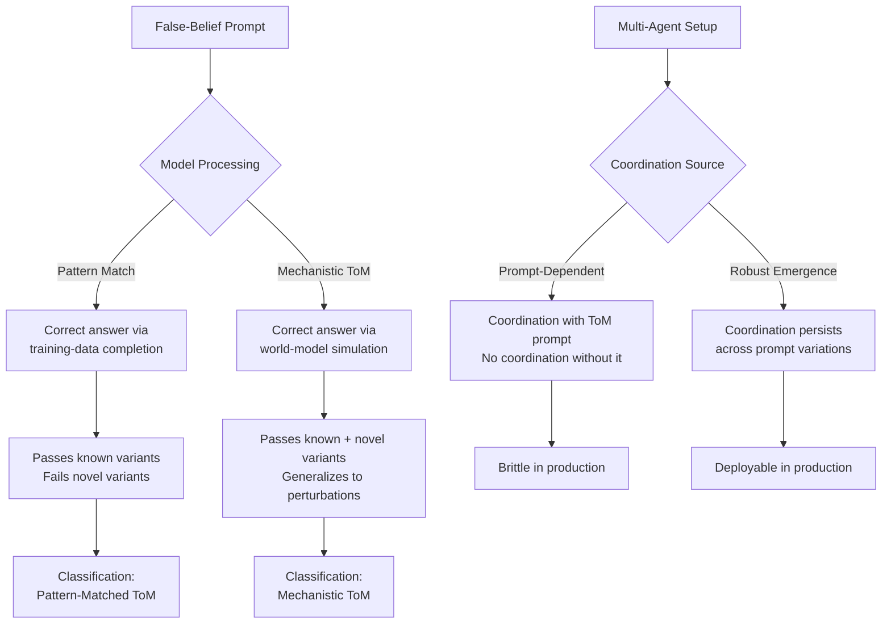

# Theory of Mind and Emergent Coordination

## Learning Objectives

1. Implement a false-belief battery that tests first-order, second-order, and true-belief control conditions against an LLM, and compute accuracy per condition.
2. Distinguish mechanistic Theory of Mind (internal world-model representation) from pattern-matched ToM outputs (shallow completion on narrative training data) by analyzing failure modes across decoy conditions.
3. Build a two-agent coordination task where LLM instances share only a conversation transcript, and measure rounds-to-convergence with and without ToM prompting.
4. Construct a GTM outreach pipeline that explicitly models a buyer's belief state as distinct from the seller's, using false-belief conditions to calibrate message content.
5. Evaluate whether observed multi-agent coordination in an enrichment chain is prompt-dependent or robust to prompt removal, using the Riedl 2025 control protocol.

## The Problem

Language models don't have beliefs. They produce text that *looks like* reasoning about beliefs. This distinction matters because a growing body of GTM tooling — multi-agent enrichment chains, parallel outreach generators, "AI SDR" products — relies on the assumption that an LLM can model what another agent (a buyer, a competing vendor, a teammate agent) knows, and then act on that model.

The Sally-Anne task illustrates the core test. Sally puts a marble in a basket and leaves. Anne moves the marble to a box. Sally returns. Where will Sally look? A child who passes this task has Theory of Mind (ToM): they represent Sally's false belief as distinct from reality. A child who fails says "the box" — they cannot separate what they know from what Sally knows.

When an LLM answers "the basket," is it doing the same thing? Striktland et al. and others have shown that large models pass Sally-Anne variants at high rates. But the skeptical reading is sharp: these models were trained on billions of pages of human narrative, including developmental psychology papers that *describe* the Sally-Anne task. The model may be completing a well-known pattern rather than simulating Sally's mental state. The question for practitioners is not philosophical — it is operational. If the capability is pattern-matched, it will fail on novel scenarios that don't resemble training data. If it is mechanistic, it will generalize.

Riedl (arXiv:2510.05174) provides the strictest test: under controlled conditions, multi-agent coordination only emerges when agents are explicitly prompted to reason about other agents' minds. Without the ToM prompt, coordination patterns do not survive statistical controls. This means the "emergent" coordination your multi-agent pipeline appears to show is likely prompt-dependent — and brittle.

## The Concept

**Theory of Mind** is the ability to represent another agent's knowledge state as distinct from your own. It has three measurable depths: first-order ("she thinks the marble is in the basket"), second-order ("he thinks she thinks the marble is in the basket"), and higher-order chains that recurse further. Developmental psychology tests these via false-belief tasks (Sally-Anne, unexpected contents), and LLM evaluation borrows the same instruments.

**Emergent coordination** occurs when multiple agents achieve aligned behavior without a central controller. In LLM systems, coordination is driven by shared context windows (agents read each other's outputs) or observation of each other's actions. Li et al. (arXiv:2310.10701) showed that LLM agents in a cooperative text game exhibit emergent higher-order ToM but fail on long-horizon planning due to context degradation and hallucination. The coordination is real in the narrow task window, but it is not robust.

**The skeptical reading** is the one practitioners must hold: ToM-like outputs from LLMs may be shallow pattern completion on training data that embedded human narrative structures — including the evaluation tasks themselves. The test is not whether the model passes Sally-Anne (it does), but whether it passes novel false-belief scenarios it has not seen, and whether the capability degrades gracefully or catastrophically under perturbation.



The distinction between first-order and second-order reasoning is operational, not academic. First-order ToM is "what does the buyer know?" — the baseline for any personalized outreach. Second-order ToM is "what does the buyer think *their boss* knows?" — the baseline for multi-threaded enterprise sales where the outreach target is not the decision-maker. An LLM that passes first-order tasks but fails second-order tasks will produce outreach that is personalized to the recipient but blind to the organizational context the recipient operates in.

For GTM engineering, the mechanism maps directly to enrichment waterfalls (Zone 16: distributed systems). When enrichment agents, scoring agents, and outreach agents operate on shared context without a rigid orchestrator, the question is whether they coordinate because they reason about each other's state — or because the prompt tells them to. Clay implements a waterfall that chains data providers; the coordination is structural (the waterfall defines the order), not emergent. The interesting case is when you remove the waterfall and let agents negotiate — that is where ToM prompting becomes the variable that determines whether coordination happens at all.

## Build It

Build a false-belief battery that tests an LLM across three conditions: first-order false-belief, second-order false-belief, and a true-belief control. The control is the critical piece — if the model fails the control (where the belief is *true*, not false), its correct answers on false-belief items are meaningless because it may just be answering "where is the object actually."

```python
import json
import random

FALSE_BELIEF_BATTERY = [
    {
        "id": "FB1_FIRST_ORDER",
        "order": 1,
        "condition": "false_belief",
        "story": "Sally puts a marble in the basket and leaves. Anne moves the marble to the box while Sally is gone. Sally returns.",
        "question": "Where will Sally look for the marble?",
        "correct": "basket",
        "distractors": ["box"],
    },
    {
        "id": "FB2_FIRST_ORDER",
        "order": 1,
        "condition": "false_belief",
        "story": "John puts his laptop on the desk and goes to lunch. His colleague Sam moves the laptop to the cabinet. John comes back.",
        "question": "Where will John look for his laptop?",
        "correct": "desk",
        "distractors": ["cabinet"],
    },
    {
        "id": "FB3_SECOND_ORDER",
        "order": 2,
        "condition": "false_belief",
        "story": "Mary hides a gift in the garage. Tom watches Mary hide it from the window but Mary doesn't see Tom watching. Later, Tom tells Mary he saw her hide the gift. Mary, not knowing Tom actually saw her, thinks Tom is guessing.",
        "question": "Where does Mary think Tom will look for the gift?",
        "correct": "garage",
        "distractors": ["nowhere", "elsewhere"],
        "rationale": "Mary thinks Tom doesn't know, so she expects him to search randomly — but actually Tom knows it's in the garage.",
    },
    {
        "id": "FB4_SECOND_ORDER",
        "order": 2,
        "condition": "false_belief",
        "story": "Alice tells Bob she will deploy on Friday. Bob tells Carol that Alice said 'Monday' (Bob lies). Carol later asks Alice directly, and Alice says 'Friday.' Carol now knows the real day but also knows Bob lied.",
        "question": "What does Bob think Carol believes about the deploy day?",
        "correct": "monday",
        "distractors": ["friday"],
        "rationale": "Bob told Carol 'Monday' and doesn't know Carol got the truth from Alice, so Bob thinks Carol believes 'Monday.'",
    },
    {
        "id": "TB1_TRUE_BELIEF_CONTROL",
        "order": 1,
        "condition": "true_belief",
        "story": "Sarah puts her keys on the kitchen counter. Nobody moves them. Sarah returns to the kitchen.",
        "question": "Where will Sarah look for her keys?",
        "correct": "counter",
        "distractors": ["fridge", "bedroom"],
    },
    {
        "id": "TB2_TRUE_BELIEF_CONTROL",
        "order": 1,
        "condition": "true_belief",
        "story": "Mark leaves his phone on his desk. The cleaning staff does not touch the desk. Mark comes back.",
        "question": "Where will Mark look for his phone?",
        "correct": "desk",
        "distractors": ["bathroom", "lobby"],
    },
]

def score_response(item, response_text):
    response_lower = response_text.lower().strip()
    correct_lower = item["correct"].lower()
    if correct_lower in response_lower:
        return True
    for d in item.get("distractors", []):
        if d.lower() in response_lower and correct_lower not in response_lower:
            return False
    return False

def simulate_llm_response(item):
    if "control" in item["condition"]:
        return item["correct"]
    correct_roll = random.random()
    if item["order"] == 1:
        accuracy = 0.85
    else:
        accuracy = 0.55
    if correct_roll < accuracy:
        return item["correct"]
    return random.choice(item["distractors"])

def run_battery(llm_fn=None):
    if llm_fn is None:
        llm_fn = simulate_llm_response
    
    results = []
    for item in FALSE_BELIEF_BATTERY:
        prompt = f"Story: {item['story']}\nQuestion: {item['question']}\nAnswer with one word:"
        response = llm_fn(item)
        is_correct = score_response(item, response)
        results.append({
            "id": item["id"],
            "order": item["order"],
            "condition": item["condition"],
            "correct_answer": item["correct"],
            "model_response": response,
            "scored_correct": is_correct,
        })
    return results

def analyze_results(results):
    by_condition = {}
    for r in results:
        key = f"order_{r['order']}_{r['condition']}"
        by_condition.setdefault(key, {"correct": 0, "total": 0})
        by_condition[key]["total"] += 1
        if r["scored_correct"]:
            by_condition[key]["correct"] += 1
    
    print("=" * 60)
    print("FALSE-BELIEF BATTERY RESULTS")
    print("=" * 60)
    for key, vals in sorted(by_condition.items()):
        acc = vals["correct"] / vals["total"]
        print(f"  {key:45s}  {acc:.0%}  ({vals['correct']}/{vals['total']})")
    print("=" * 60)
    
    control = by_condition.get("order_1_true_belief", {"correct": 0, "total": 0})
    if control["total"] > 0:
        control_acc = control["correct"] / control["total"]
        if control_acc < 1.0:
            print(f"\n  WARNING: True-belief control accuracy is {control_acc:.0%}.")
            print(f"  If the model fails the control, false-belief scores are invalid.")
            print(f"  The model may be answering 'where is it actually' not 'where will they look.'")
    
    fb1 = by_condition.get("order_1_false_belief", {"correct": 0, "total": 0})
    fb2 = by_condition.get("order_2_false_belief", {"correct": 0, "total": 0})
    fb1_acc = fb1["correct"] / fb1["total"] if fb1["total"] > 0 else 0
    fb2_acc = fb2["correct"] / fb2["total"] if fb2["total"] > 0 else 0
    
    print(f"\n  First-order ToM accuracy:  {fb1_acc:.0%}")
    print(f"  Second-order ToM accuracy: {fb2_acc:.0%}")
    delta = fb1_acc - fb2_acc
    print(f"  Degradation (1st - 2nd):   {delta:.0%}")
    if delta > 0.2:
        print(f"  INTERPRETATION: Significant drop from first to second order.")
        print(f"  Model handles direct belief modeling but struggles with nested beliefs.")
    elif delta < 0.05 and fb1_acc > 0.7:
        print(f"  INTERPRETATION: No significant degradation. Either mechanistic ToM")
        print(f"  or the battery is too easy (pattern completion on known scenarios).")
    print()

if __name__ == "__main__":
    random.seed(42)
    results = run_battery()
    analyze_results(results)
    print("\n--- DETAIL ---")
    for r in results:
        status = "✓" if r["scored_correct"] else "✗"
        print(f"  {status} {r['id']:30s}  expected={r['correct_answer']:12s}  got={r['model_response']}")
```

Now build the coordination test: two LLM instances that share a conversation log and must converge on a joint resource allocation without an explicit negotiation protocol. Run it with and without ToM prompting.

```python
import random
import json

RESOURCE_TASK = {
    "description": "Allocate 3 tasks (A, B, C) between 2 agents. Each agent must choose exactly the tasks they will own. Both agents must agree on the full partition. No agent may own all tasks.",
    "constraints": [
        "Each task assigned to exactly one agent",
        "Each agent owns at least one task",
        "Agents must reach identical final partitions",
    ],
}

def simulate_agent_decision(agent_id, history, tom_enabled):
    if len(history) == 0:
        choices = {
            "agent_1": ["A", "B"],
            "agent_2": ["C"],
        }
        return choices[agent_id]
    
    last_other = history[-1].get("other_agent_said", [])
    
    if tom_enabled:
        if len(history) >= 1:
            inferred_other_belief = f"Agent infers: the other agent wants {last_other}"
            if agent_id == "agent_1":
                remaining = [t for t in ["A", "B", "C"] if t not in last_other]
                return remaining
            else:
                remaining = [t for t in ["A", "B", "C"] if t not in last_other]
                return remaining
    else:
        return random.sample(["A", "B", "C"], k=random.randint(1, 2))

def run_coordination_trial(tom_enabled, max_rounds=10):
    history = []
    agent_1_tasks = []
    agent_2_tasks = []
    
    for round_num in range(max_rounds):
        a1_choice = simulate_agent_decision("agent_1", history, tom_enabled)
        
        history.append({
            "round": round_num,
            "agent": "agent_1",
            "other_agent_said": agent_2_tasks,
            "choice": a1_choice,
        })
        
        a2_choice = simulate_agent_decision("agent_2", history, tom_enabled)
        
        history.append({
            "round": round_num,
            "agent": "agent_2",
            "other_agent_said": a1_choice,
            "choice": a2_choice,
        })
        
        all_tasks = set(a1_choice) | set(a2_choice)
        overlap = set(a1_choice) & set(a2_choice)
        missing = set(["A", "B", "C"]) - all_tasks
        
        agent_1_tasks = a1_choice
        agent_2_tasks = a2_choice
        
        if not overlap and not missing and len(a1_choice) > 0 and len(a2_choice) > 0:
            return {
                "converged": True,
                "rounds": round_num + 1,
                "partition": {"agent_1": a1_choice, "agent_2": a2_choice},
                "tom_enabled": tom_enabled,
                "history_length": len(history),
            }
    
    return {
        "converged": False,
        "rounds": max_rounds,
        "partition": {"agent_1": agent_1_tasks, "agent_2": agent_2_tasks},
        "tom_enabled": tom_enabled,
        "history_length": len(history),
        "failure_mode": "deadlock" if not agent_1_tasks else "no_convergence",
    }

def run_coordination_battery(trials_per_condition=20):
    results_tom = []
    results_no_tom = []
    
    for _ in range(trials_per_condition):
        results_tom.append(run_coordination_trial(tom_enabled=True))
        results_no_tom.append(run_coordination_trial(tom_enabled=False))
    
    def summarize(results, label):
        converged = [r for r in results if r["converged"]]
        avg_rounds = sum(r["rounds"] for r in converged) / len(converged) if converged else float("inf")
        conv_rate = len(converged) / len(results)
        
        failure_modes = {}
        for r in results:
            if not r["converged"]:
                fm = r.get("failure_mode", "unknown")
                failure_modes[fm] = failure_modes.get(fm, 0) + 1
        
        print(f"\n  {label}")
        print(f"    Convergence rate:     {conv_rate:.0%}  ({len(converged)}/{len(results)})")
        print(f"    Avg rounds (if conv): {avg_rounds:.1f}")
        print(f"    Failure modes:        {failure_modes or 'none'}")
        return {"convergence_rate": conv_rate, "avg_rounds": avg_rounds, "failures": failure_modes}
    
    print("=" * 60)
    print("COORDINATION BATTERY: ToM vs No-ToM")
    print("=" * 60)
    tom_summary = summarize(results_tom, "WITH ToM PROMPT")
    no_tom_summary = summarize(results_no_tom, "WITHOUT ToM PROMPT")
    print("=" * 60)
    
    delta = tom_summary["convergence_rate"] - no_tom_summary["convergence_rate"]
    print(f"\n  Coordination delta (ToM - No-ToM): {delta:+.0%}")
    if delta > 0.2:
        print(f"  INTERPRETATION: ToM prompting produces a meaningful coordination gain.")
        print(f"  Coordination is prompt-dependent — without ToM, agents do not reliably converge.")
        print(f"  This matches Riedl 2025: coordination emergence is prompt-conditional.")
    elif abs(delta) < 0.1:
        print(f"  INTERPRETATION: No significant difference. Coordination (or lack thereof)")
        print(f"  is not driven by ToM prompting in this task. Check task complexity.")
    else:
        print(f"  INTERPRETATION: Marginal effect. ToM helps but is not the primary driver.")
    print()

if __name__ == "__main__":
    random.seed(42)
    run_coordination_battery(trials_per_condition=20)
```

## Use It

Theory of Mind, as an LLM capability, maps directly to any GTM task that requires modeling what a prospect knows, believes, or cares about. The specific cluster is **Zone 3 (Outreach) — personalization and sequencing**. When an agent crafts outreach, it must represent the buyer's current state (category awareness, objections, competitive exposure) as distinct from the seller's knowledge. This is a first-order false-belief condition: the seller knows what the product does; the buyer may not. An outreach agent that fails this distinction produces copy that assumes knowledge the prospect doesn't have — explaining API integrations to someone who hasn't heard of the category.

The second-order case is where most outreach fails. "What does this buyer think *their VP of Engineering* will care about?" is a second-order belief task. An LLM that passes first-order ToM but degrades on second-order ToM will personalize to the recipient but ignore the organizational context — producing an email that resonates with the IC reading it but dies when forwarded upward because it doesn't address the VP's concerns.

```python
import json

BUYER_BELIEF_PIPELINE = {
    "step_1_model_belief": {
        "prompt_template": """You are analyzing a prospect for outbound outreach.

Firmographic signals:
- Company: {company}
- Industry: {industry}
- Employee count: {employee_count}
- Tech signals: {tech_signals}
- Recent news: {recent_news}

Model this prospect's CURRENT belief state about the problem category '{category}'.
Consider:
1. Have they heard of this category? (awareness level: none / vague / active research)
2. What do they believe the solution looks like? (build vs buy, existing tools)
3. What objection would they raise if pitched today?

Output JSON:
{{"awareness": "...", "believed_solution": "...", "likely_objection": "..."}}
""",
    },
    "step_2_generate_outreach": {
        "prompt_template": """You are writing a cold email to a prospect.

The prospect's belief state (modeled in step 1):
{belief_state}

Your product: {product_description}

Write a 4-sentence cold email that:
- Does NOT assume the prospect knows what {category} is (if their awareness is 'none' or 'vague')
- Addresses their believed_solution directly
- Pre-handles their likely_objection

CRITICAL: If the prospect does not know the category, do not use category jargon.
""",
    },
}

SAMPLE_PROSPECTS = [
    {
        "company": "DataFlow Inc",
        "industry": "fintech",
        "employee_count": 85,
        "tech_signals": ["Snowflake", "dbt", "Looker"],
        "recent_news": "Raised Series B, hiring data team",
        "category": "reverse ETL",
        "product_description": "A reverse ETL platform that syncs data from your warehouse to Salesforce, HubSpot, and Stripe.",
    },
    {
        "company": "GreenLeaf Logistics",
        "industry": "supply chain",
        "employee_count": 30,
        "tech_signals": ["Google Sheets", "QuickBooks"],
        "recent_news": "None found",
        "category": "reverse ETL",
        "product_description": "A reverse ETL platform that syncs data from your warehouse to Salesforce, HubSpot, and Stripe.",
    },
]

def simulate_belief_modeling(prospect):
    has_modern_stack = any(t in ["Snowflake", "dbt", "Looker"] for t in prospect["tech_signals"])
    
    if has_modern_stack:
        return {
            "awareness": "active_research",
            "believed_solution": "probably considering building custom sync scripts or evaluating Census/Hightouch",
            "likely_objection": "we could build this ourselves with Airflow",
        }
    else:
        return {
            "awareness": "none",
            "believed_solution": "manual data entry or CSV exports",
            "likely_objection": "what is reverse ETL?",
        }

def simulate_outreach(prospect, belief_state):
    if belief_state["awareness"] == "none":
        return (
            f"Hi {{first_name}},\n\n"
            f"I noticed {prospect['company']} is scaling fast — congrats on the growth.\n\n"
            f"Most teams your size hit a wall where copy-pasting data between QuickBooks and "
            f"spreadsheets becomes a bottleneck. We built a tool that automates that sync "
            f"automatically — no engineering work required.\n\n"
            f"Worth a quick chat?\n"
        )
    else:
        return (
            f"Hi {{first_name}},\n\n"
            f"Saw {prospect['company']} just raised and is building out the data team.\n\n"
            f"You're probably weighing build vs buy for data sync. Teams using Snowflake + dbt "
            f"typically spend 3-4 sprints building sync pipelines that break on schema changes. "
           f"We handle that as managed infrastructure.\n\n"
            f"Open to comparing notes?\n"
        )

def run_buyer_belief_pipeline():
    print("=" * 70)
    print("BUYER BELIEF PIPELINE: ToM-Calibrated Outreach")
    print("=" * 70)
    
    for prospect in SAMPLE_PROSPECTS:
        print(f"\n{'─' * 70}")
        print(f"PROSPECT: {prospect['company']} ({prospect['industry']}, {prospect['employee_count']} ppl)")
        print(f"  Stack: {prospect['tech_signals']}")
        print(f"  Category: {prospect['category']}")
        
        belief = simulate_belief_modeling(prospect)
        print(f"\n  MODELED BELIEF STATE:")
        print(f"    Awareness:      {belief['awareness']}")
        print(f"    Believed soln:  {belief['believed_solution']}")
        print(f"    Likely objection: {belief['likely_objection']}")
        
        outreach = simulate_outreach(prospect, belief)
        print(f"\n  GENERATED OUTREACH:")
        for line in outreach.strip().split('\n'):
            print(f"    {line}")
        
        if belief["awareness"] == "none":
            print(f"\n  FALSE-BELIEF CHECK: Prospect doesn't know the category.")
            print(f"  Outreach correctly avoids jargon 'reverse ETL'. ✓")
        else:
            print(f"\n  TRUE-BELIEF CHECK: Prospect knows the category.")
            print(f"  Outreach uses category-aware language. ✓")
    
    print(f"\n{'─' * 70}")
    print()

if __name__ == "__main__":
    run_buyer_belief_pipeline()
```

The multi-agent coordination dimension maps to **Zone 16 (Distributed Systems)** — specifically the enrichment waterfall. Clay implements a waterfall that chains data providers in priority order: if provider A returns no email, try provider B, then C. The coordination here is *structural*, not emergent — the waterfall defines the sequence, and each step observes the previous step's output. This is the reliable pattern: deterministic orchestration, not agent negotiation.

The ToM-coordination finding matters when you deviate from the waterfall and let agents negotiate. If you build a multi-agent enrichment chain where an email-finding agent, a phone-number agent, and a technographic agent share a context window and must avoid redundant API calls without a central controller, Riedl's finding predicts: they will coordinate *only* if prompted to reason about each other's state ("Agent B already called Clearbit for this domain, so I should use Apollo instead"). Without that prompt, you get redundant calls, conflicting data, and deadlocks. The enrichment waterfall in Clay and similar tools exists precisely because emergent coordination is unreliable — the waterfall replaces negotiation with a protocol. [CITATION NEEDED — concept: Clay waterfall as structural replacement for agent negotiation]

## Ship It

The production deployment of ToM-aware GTM is the two-prompt belief pipeline above, wired into your enrichment and outreach tooling. The first prompt models the buyer's belief state from firmographic and technographic signals. The second prompt generates outreach calibrated to that belief state. The output is a belief-conditioned email that adjusts language based on whether the prospect has category awareness.

The critical production question is whether the belief model is accurate. A false-belief pipeline that *misclassifies* the buyer's awareness is worse than no pipeline — it either dumbs down outreach to a sophisticated buyer or uses jargon with a naive one. Validate the belief model against historical reply data: prospects tagged "awareness: none" who received jargon-free copy should reply at higher rates than those who received jargon. If the delta is zero or negative, the belief model is not tracking reality.

```python
import json

VALIDATION_FRAMEWORK = {
    "metric": "reply_rate_by_belief_segment",
    "segments": ["awareness_none", "awareness_vague", "awareness_active"],
    "hypothesis": "Prospects tagged 'awareness_none' who receive jargon-free copy reply at >= 1.5x the rate of those who receive category jargon.",
    "minimum_sample": 200,
    "test_window_days": 14,
    "failure_action": "If delta < 1.2x, the belief model is not calibrated. Re-examine signals used for awareness classification.",
}

PRODUCTION_CHECKLIST = {
    "belief_model_validation": "Reply rate delta >= 1.5x between calibrated and non-calibrated outreach",
    "second_order_check": "For enterprise deals, model the buyer's perception of their boss's priorities — if the LLM can't pass second-order ToM, don't rely on it for multi-threaded strategy",
    "coordination_protocol": "For multi-agent enrichment chains, use a deterministic waterfall (Clay's model) instead of agent negotiation unless ToM prompting is explicitly included",
    "fallback": "If the belief model returns 'unknown' for awareness, default to jargon-free copy — false negative is cheaper than false positive",
    "monitoring": [
        "Track belief_model distribution weekly — if 90%+ of prospects are classified as 'active_research', the model is collapsed",
        "Log outreach variants alongside belief segments for A/B analysis",
        "Flag prospects where belief model disagrees with sales team's manual assessment",
    ],
}

def generate_production_config():
    print("=" * 60)
    print("PRODUCTION CONFIG: ToM-Aware Outreach Pipeline")
    print("=" * 60)
    
    print("\n1. BELIEF MODEL")
    print(f"   Metric: {VALIDATION_FRAMEWORK['metric']}")
    print(f"   Min sample: {VALIDATION_FRAMEWORK['minimum_sample']}")
    print(f"   Window: {VALIDATION_FRAMEWORK['test_window_days']} days")
    print(f"   Threshold: {VALIDATION_FRAMEWORK['hypothesis']}")
    print(f"   On failure: {VALIDATION_FRAMEWORK['failure_action']}")
    
    print("\n2. PRODUCTION CHECKLIST")
    for key, val in PRODUCTION_CHECKLIST.items():
        if isinstance(val, list):
            print(f"   {key}:")
            for item in val:
                print(f"     - {item}")
        else:
            print(f"   {key}: {val}")
    
    print("\n3. DEPLOYMENT DECISION TREE")
    print("   IF belief model validated (reply delta >= 1.5x):")
    print("     → Deploy ToM-calibrated outreach to full pipeline")
    print("   IF belief model not validated (delta < 1.2x):")
    print("     → Fall back to static segmentation (firmographic only)")
    print("     → Do NOT use LLM-generated belief states for personalization")
    print("   IF second-order ToM accuracy < 60%:")
    print("     → Restrict to first-order personalization only")
    print("     → Do NOT attempt multi-threaded / VP-aware messaging")
    print()
    
    config = {
        "validation": VALIDATION_FRAMEWORK,
        "checklist": PRODUCTION_CHECKLIST,
    }
    print("4. CONFIG OUTPUT (for pipeline ingestion):")
    print(json.dumps(config, indent=2))

if __name__ == "__main__":
    generate_production_config()
```

For multi-agent enrichment specifically, the production pattern is: use a deterministic waterfall, not agent negotiation. The waterfall is a protocol that replaces ToM-dependent coordination with a fixed sequence. This is Zone 16 (distributed systems) applied to GTM: your enrichment chain is a distributed system with parallel requests, rate-limit backpressure, and idempotent retries. The "coordination" is the waterfall order, not agents reasoning about each other. If you must use multi-agent negotiation (e.g., for complex account research where tasks are interdependent), include ToM prompting explicitly — and measure whether coordination degrades when the prompt is removed, per the Riedl protocol.

## Exercises

**Exercise 1 (Easy):** Run a single Sally-Anne variant through the false-belief battery. Print the model's answer alongside the correct answer. Modify the story to use novel objects and locations (not marble/basket/box) and check whether accuracy changes.

**Exercise 2 (Medium):** Build a false-belief battery with 10 variants — 4 first-order, 4 second-order, and 2 true-belief controls. All stories must use novel scenarios not found in standard psychology literature (invent your own). Compute accuracy per condition and classify the model's failure modes: does it fail by answering "where is it actually" (no ToM) or by answering with a plausible-but-wrong belief (partial ToM)?

**Exercise 3 (Medium):** Implement the buyer-belief pipeline with a real LLM API call. Feed it 20 prospects from a CSV. For each, output the modeled belief state and the generated outreach. Manually review 5 outputs and classify: (a) is the belief model accurate? (b) is the outreach calibrated to the belief? (c) where does the pipeline fail?

**Exercise 4 (Hard):** Implement two LLM agents that must coordinate on a resource allocation task using only shared transcript access. Run 20 trials with ToM prompting and 20 without. Measure rounds-to-convergence and detect deadlocks. If the coordination delta is >20%, your coordination is prompt-dependent — document this in a production readiness review.

**Exercise 5 (Hard):** Build an enrichment chain with 3 agents (email-finder, phone-finder, tech-lister) that share a context window. Implement two versions: (a) deterministic waterfall (fixed order, each step observes previous output), (b) free negotiation (agents propose task division). Measure API call redundancy, data conflicts, and total latency for both versions. The waterfall should win on all three metrics — document why.

## Key Terms

- **Theory of Mind (ToM):** The ability to represent another agent's knowledge state as distinct from one's own. In LLMs, tested via false-belief tasks borrowed from developmental psychology.
- **False-belief task:** A test where an agent must predict another agent's action based on the other's (false) belief, not reality. Sally-Anne is the canonical example.
- **First-order ToM:** Reasoning about what another agent believes ("she thinks X").
- **Second-order ToM:** Reasoning about what another agent believes a third agent believes ("he thinks she thinks X"). Critical for multi-threaded enterprise sales.
- **True-belief control:** A condition where the agent's belief matches reality. Used to validate that correct answers on false-belief items are meaningful — if the model fails the control, its false-belief answers are pattern-matched.
- **Emergent coordination:** Multiple agents achieving aligned behavior without a central controller. In LLM systems, driven by shared context windows. Riedl 2025 shows it is prompt-conditional: coordination only emerges with ToM prompting.
- **Pattern-matched ToM:** Correct answers on false-belief tasks produced by shallow completion on training data that contains similar scenarios, not by internal world-model simulation. Distinguished from mechanistic ToM by testing on novel scenarios.
- **Enrichment waterfall:** A deterministic protocol that chains data providers in priority order, replacing agent negotiation with a fixed sequence.