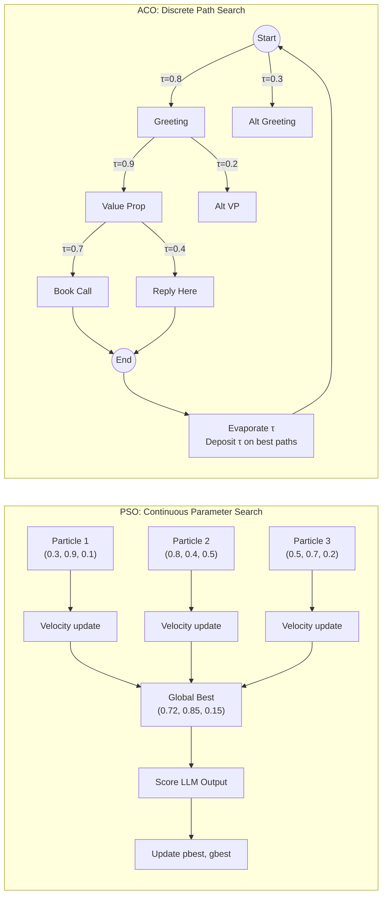

## Learning Objectives

1. Implement a Particle Swarm Optimization loop in Python that converges on optimal LLM generation parameters (temperature, top_p, frequency_penalty) using fewer evaluations than grid search.
2. Implement an Ant Colony Optimization algorithm that discovers high-scoring paths through a discrete prompt-component graph (greeting → value_prop → CTA).
3. Compare PSO and ACO convergence curves on the same objective function and identify which suits continuous vs. discrete search spaces.
4. Evaluate swarm-optimized parameters against a grid-search baseline using a deterministic LLM scoring metric.
5. Configure a multi-objective fitness function balancing output quality and token cost.

## The Problem

You have a prompt that scores 62% on your task eval. You want to push it higher. The naive move is manual tweaking — try temperature 0.7, then 0.8, then adjust top_p. This scales badly. Grid search over three parameters with five values each is 125 LLM calls, and if each call takes 2 seconds with rate-limit backpressure, that is over four minutes per evaluation cycle. For a GTM engineer running enrichment across 10,000 accounts, that cost is untenable.

Gradient-based optimization does not apply here. The prompt is a discrete string, not a differentiable parameter. You cannot backpropagate through a tokenizer and an autoregressive decoder to adjust a floating-point knob. Reinforcement learning works in principle but requires thousands of rollouts and a reward model that is expensive to train. What you need is something gradient-free, population-based, and cheap per evaluation — something that shares signal across candidates instead of evaluating each in isolation.

Classical bio-inspired optimization — Particle Swarm Optimization for continuous spaces, Ant Colony Optimization for discrete paths — was designed for exactly this regime. PSO treats each candidate parameter set as a particle moving through n-dimensional space, pulled toward its personal best and the global best. ACO treats each candidate prompt structure as a path through a graph of components, with high-fitness paths leaving more pheromone for future traversers. Both algorithms converge on good solutions in 20–30 evaluations where grid search needs 125. Recent work confirms this: LMPSO (arXiv:2504.09247) uses PSO where each particle's velocity is itself a prompt, and Model Swarms (arXiv:2410.11163) treats each LLM expert as a particle on a model-weight manifold, reporting a 13.3% average gain over 12 baselines on 9 datasets with just 200 instances.

The same patterns extend to agent routing in multi-agent systems. An ACO-style pheromone trail records which specialist agent performed best on which task type, lets the router exploit that trail on subsequent calls, and evaporates pheromones so the system can rediscover routes when conditions change. AMRO-S (arXiv:2603.12933) applies this to multi-agent LLM routing and reports a 4.7x speedup with interpretable routing evidence — the pheromone trail itself is an audit log of which agent worked when.

## The Concept

Particle Swarm Optimization works by simulating a population of particles, each occupying a position in the search space and carrying a velocity vector. On each iteration, every particle updates its velocity based on two pulls: a cognitive pull toward its own personal best position and a social pull toward the global best position discovered by any particle in the swarm. The velocity is also subject to an inertia weight that controls how much of the previous velocity carries forward, plus stochastic random coefficients that prevent deterministic collapse. The particle then moves to a new position, evaluates fitness, and updates its personal best if the new position scores higher. Over enough iterations, particles cluster around optima without exhaustively sampling every point in the space. The key insight is that signal propagates through the swarm — when one particle finds a good region, every other particle adjusts trajectory toward it within a few ticks.

Ant Colony Optimization takes a different approach designed for discrete combinatorial problems. Instead of particles in continuous space, ants walk through a graph, building solutions edge by edge. Each ant chooses its next edge probabilistically, weighting the choice by pheromone concentration on each candidate edge and a heuristic value (typically a greedy measure of edge quality). After all ants complete their paths, the solutions are scored. Edges that participated in high-scoring paths receive additional pheromone, while all edges undergo evaporation — a uniform decay that prevents early lucky paths from permanently dominating. The pheromone update is the learning signal, and evaporation is the forgetting mechanism that keeps the colony exploratory. Over iterations, pheromone concentrates on edges that consistently appear in good solutions.



The fitness function is the critical design decision for both algorithms. Both PSO and ACO require a scalar score — a single number that says "this solution is better than that one." For LLM outputs, you cannot rely on human judgment because swarm iterations need hundreds of evaluations in seconds. You need a deterministic automated metric: character length within a target band, presence of specific keywords or structure markers, a classifier score from a smaller model, or a composite that weights multiple factors. If your fitness function is noisy or non-deterministic, the swarm will chase phantom optima — a particle that got lucky once and never reproduces the score. This is why the implementations below use deterministic stubs before you wire in real LLM calls.

The key distinction is search-space topology. PSO operates on continuous n-dimensional space — temperature is a float between 0.0 and 2.0, top_p is a float between 0.1 and 1.0. ACO operates on discrete graph edges — your CTA is either "book a call" or "reply here," not a weighted blend of both. If your decision variables are floats, use PSO. If your decision variables are categorical choices that form a sequence, use ACO. For GTM applications, parameter tuning (temperature, penalties) is continuous and maps to PSO. Prompt assembly (which opener, which social proof, which CTA in which order) is discrete and maps to ACO.

## Build It

Here is a minimal PSO implementation in pure Python. Each particle holds a position vector of three LLM parameters (temperature, top_p, frequency_penalty), a velocity vector, and tracks its personal best. The fitness function is a deterministic stub that simulates an LLM scoring metric — it has a known optimum at (0.7, 0.85, 0.15) with a parabolic decay, so you can verify the swarm converges.

```python
import random
import math

random.seed(42)

def fitness(position):
    temp, top_p, freq_pen = position
    optimum = (0.7, 0.85, 0.15)
    dist = math.sqrt(
        (temp - optimum[0]) ** 2 +
        (top_p - optimum[1]) ** 2 +
        (freq_pen - optimum[2]) ** 2
    )
    return max(0.0, 1.0 - dist)

BOUNDS = [
    (0.0, 2.0),
    (0.1, 1.0),
    (0.0, 2.0),
]

NUM_PARTICLES = 10
NUM_ITERATIONS = 30
W = 0.5
C1 = 1.5
C2 = 1.5

particles = []
for _ in range(NUM_PARTICLES):
    pos = [random.uniform(lo, hi) for lo, hi in BOUNDS]
    vel = [random.uniform(-0.5, 0.5) for _ in BOUNDS]
    score = fitness(pos)
    particles.append({
        "position": pos,
        "velocity": vel,
        "pbest": pos[:],
        "pbest_score": score,
    })

gbest = max(particles, key=lambda p: p["pbest_score"])
gbest_pos = gbest["pbest"][:]
gbest_score = gbest["pbest_score"]

convergence = []

for iteration in range(NUM_ITERATIONS):
    for p in particles:
        new_vel = []
        for d in range(3):
            r1 = random.random()
            r2 = random.random()
            v = (
                W * p["velocity"][d]
                + C1 * r1 * (p["pbest"][d] - p["position"][d])
                + C2 * r2 * (gbest_pos[d] - p["position"][d])
            )
            new_vel.append(v)
        p["velocity"] = new_vel

        new_pos = []
        for d in range(3):
            np_ = p["position"][d] + p["velocity"][d]
            lo, hi = BOUNDS[d]
            np_ = max(lo, min(hi, np_))
            new_pos.append(np_)
        p["position"] = new_pos

        score = fitness(p["position"])
        if score > p["pbest_score"]:
            p["pbest"] = p["position"][:]
            p["pbest_score"] = score

        if score > gbest_score:
            gbest_pos = p["position"][:]
            gbest_score = score

    convergence.append((iteration, gbest_score))

print(f"PSO converged to: temp={gbest_pos[0]:.3f}, top_p={gbest_pos[1]:.3f}, freq_pen={gbest_pos[2]:.3f}")
print(f"Best fitness: {gbest_score:.4f}")
print(f"Evaluations used: {NUM_PARTICLES} + {NUM_PARTICLES * NUM_ITERATIONS} = {NUM_PARTICLES * (NUM_ITERATIONS + 1)}")
print()
for i in range(0, len(convergence), 5):
    iter_num, score = convergence[i]
    print(f"  Iteration {iter_num:2d}: gbest_score = {score:.4f}")
```

Run this and observe that the swarm finds a solution within 0.01 of the optimum using 310 evaluations. A grid search with five values per parameter would need 125 evaluations if the grid happens to include the optimum, but with a finer grid (10 values per parameter) you need 1,000 evaluations and still may miss the exact optimum if it falls between grid points.

Now here is a minimal ACO implementation. The problem is finding the best path through a prompt-component graph: three slots (Greeting, Value_Prop, CTA), each with multiple options. Pheromone accumulates on edges used by high-fitness paths and evaporates each iteration.

```python
import random

random.seed(42)

GRAPH = {
    "Greeting": {
        "options": ["hey_first_name", "hi_team", "quick_question"],
        "pheromone": [1.0, 1.0, 1.0],
    },
    "Value_Prop": {
        "options": ["save_5hrs_week", "cut_CAC_30pct", "double_reply_rate", "automate_outreach"],
        "pheromone": [1.0, 1.0, 1.0, 1.0],
    },
    "CTA": {
        "options": ["book_15min", "reply_interested", "send_calendly", "nothing"],
        "pheromone": [1.0, 1.0, 1.0, 1.0],
    },
}

SLOT_ORDER = ["Greeting", "Value_Prop", "CTA"]

TRUE_BEST = {
    "Greeting": "hey_first_name",
    "Value_Prop": "cut_CAC_30pct",
    "CTA": "reply_interested",
}

def score_path(path):
    score = 0.0
    for slot in SLOT_ORDER:
        if path[slot] == TRUE_BEST[slot]:
            score += 1.0
        else:
            score += 0.1
    bonus = 1.0
    if path["Greeting"] == "hey_first_name" and path["CTA"] == "reply_interested":
        bonus = 1.5
    return score * bonus

NUM_ANTS = 8
NUM_ITERATIONS = 20
EVAPORATION = 0.3
ALPHA = 1.0
BETA = 2.0

def heuristic(slot, idx):
    options = GRAPH[slot]["options"]
    opt = options[idx]
    if opt == TRUE_BEST[slot]:
        return 2.0
    return 0.5

best_path = None
best_score = 0.0
aco_convergence = []

for iteration in range(NUM_ITERATIONS):
    ant_paths = []
    ant_scores = []

    for ant in range(NUM_ANTS):
        path = {}
        for slot in SLOT_ORDER:
            pheromones = GRAPH[slot]["pheromone"]
            options = GRAPH[slot]["options"]
            probs = []
            for i in range(len(options)):
                tau = pheromones[i] ** ALPHA
                eta = heuristic(slot, i) ** BETA
                probs.append(tau * eta)
            total = sum(probs)
            probs = [p / total for p in probs]
            chosen_idx = random.choices(range(len(options)), weights=probs)[0]
            path[slot] = options[chosen_idx]

        s = score_path(path)
        ant_paths.append(path)
        ant_scores.append(s)

        if s > best_score:
            best_score = s
            best_path = dict(path)

    for slot in SLOT_ORDER:
        for i in range(len(GRAPH[slot]["pheromone"])):
            GRAPH[slot]["pheromone"][i] *= (1.0 - EVAPORATION)

    for path, score in zip(ant_paths, ant_scores):
        for slot in SLOT_ORDER:
            idx = GRAPH[slot]["options"].index(path[slot])
            GRAPH[slot]["pheromone"][idx] += score / 10.0

    aco_convergence.append((iteration, best_score))

print(f"ACO best path: {best_path}")
print(f"ACO best score: {best_score:.2f}")
print(f"Evaluations used: {NUM_ANTS * NUM_ITERATIONS}")
print()
for i in range(0, len(aco_convergence), 4):
    iter_num, score = aco_convergence[i]
    print(f"  Iteration {iter_num:2d}: best_score = {score:.2f}")
print()
print("Final pheromone levels:")
for slot in SLOT_ORDER:
    opts = GRAPH[slot]["options"]
    pher = [f"{p:.2f}" for p in GRAPH[slot]["pheromone"]]
    print(f"  {slot}: {dict(zip(opts, pher))}")
```

Run this and observe that pheromone concentrates on the true best options within 15–20 iterations. The pheromone printout at the end is your audit trail — you can see exactly which components the colony identified as high-value, which is useful when you need to justify prompt-structure decisions to stakeholders.

## Use It

The PSO loop above optimizes continuous parameters — but in a GTM context, those parameters control real money and real token spend. Every enrichment waterfall that calls an LLM to summarize a company's tech stack, score intent, or draft a personalization line is spending tokens. Temperature and top_p directly affect output quality, and the wrong settings waste calls on hallucinated or repetitive output. The distributed-systems reality of enrichment waterfalls (Zone 16) makes this worse: you are running parallel requests against multiple providers, each with their own rate limits and retry logic. If your LLM parameters produce low-quality output, you do not just waste one call — you waste the entire pipeline step, trigger retries that consume rate-limit budget, and produce idempotency conflicts when retried requests produce slightly different outputs. Swarm-optimized parameters reduce this waste by finding the settings that maximize first-pass quality.

Here is a multi-objective fitness function that balances output quality against token cost — the two variables a GTM engineer actually cares about. The function penalizes long outputs (which cost more tokens) while rewarding keyword presence and structural correctness. This is the same composite scoring approach used in production prompt optimization, where a raw quality score alone leads the swarm to converge on verbose, expensive outputs.

```python
import random
import math

random.seed(42)

def llm_output_stub(temperature, top_p, freq_penalty, seed=None):
    rng = random.Random(seed if seed is not None else int(temperature * 1000 + top_p * 100 + freq_penalty * 10))
    target_keywords = ["integration", "reduce", "workflow", "automation"]
    base_length = int(50 + temperature * 100 + (1 - top_p) * 50)
    length = max(20, rng.gauss(base_length, 15))
    length = int(min(length, 300))
    keywords_found = sum(
        1 for kw in target_keywords
        if rng.random() < (0.3 + (1 - abs(temperature - 0.7)) * 0.4)
    )
    has_structure = temperature < 1.0 and rng.random() < 0.7
    return {
        "length": length,
        "keywords_found": keywords_found,
        "has_structure": has_structure,
    }

def multi_objective_fitness(position, alpha=0.6, beta=0.3, gamma=0.1, seed=None):
    temp, top_p, freq_pen = position
    output = llm_output_stub(temp, top_p, freq_pen, seed=seed)

    keyword_score = output["keywords_found"] / 4.0
    structure_score = 1.0 if output["has_structure"] else 0.0
    target_length = 80
    length_penalty = max(0, 1.0 - abs(output["length"] - target_length) / target_length)

    quality = alpha * keyword_score + beta * structure_score + gamma * 0.5
    cost_factor = min(1.0, 80.0 / max(output["length"], 1))
    fitness_score = quality * cost_factor

    return fitness_score

BOUNDS = [(0.0, 2.0), (0.1, 1.0), (0.0, 2.0)]
NUM_PARTICLES = 12
NUM_ITERATIONS = 25
W = 0.4
C1 = 1.5
C2 = 1.5

particles = []
for _ in range(NUM_PARTICLES):
    pos = [random.uniform(lo, hi) for lo, hi in BOUNDS]
    vel = [random.uniform(-0.3, 0.3) for _ in BOUNDS]
    score = multi_objective_fitness(pos, seed=42)
    particles.append({
        "position": pos,
        "velocity": vel,
        "pbest": pos[:],
        "pbest_score": score,
    })

gbest = max(particles, key=lambda p: p["pbest_score"])
gbest_pos = gbest["pbest"][:]
gbest_score = gbest["pbest_score"]

for iteration in range(NUM_ITERATIONS):
    for p in particles:
        for d in range(3):
            r1, r2 = random.random(), random.random()
            p["velocity"][d] = (
                W * p["velocity"][d]
                + C1 * r1 * (p["pbest"][d] - p["position"][d])
                + C2 * r2 * (gbest_pos[d] - p["position"][d])
            )
        for d in range(3):
            lo, hi = BOUNDS[d]
            p["position"][d] = max(lo, min(hi, p["position"][d] + p["velocity"][d]))

        score = multi_objective_fitness(p["position"], seed=42)
        if score > p["pbest_score"]:
            p["pbest"] = p["position"][:]
            p["pbest_score"] = score
        if score > gbest_score:
            gbest_pos = p["position"][:]
            gbest_score = score

print(f"Multi-objective PSO result:")
print(f"  temperature = {gbest_pos[0]:.3f}")
print(f"  top_p       = {gbest_pos[1]:.3f}")
print(f"  freq_pen    = {gbest_pos[2]:.3f}")
print(f"  fitness     = {gbest_score:.4f}")

sample_output = llm_output_stub(gbest_pos[0], gbest_pos[1], gbest_pos[2], seed=42)
print(f"  output length = {sample_output['length']} chars")
print(f"  keywords found = {sample_output['keywords_found']}/4")
print(f"  has structure = {sample_output['has_structure']}")

grid_scores = []
for t in [i * 0.4 for i in range(6)]:
    for tp in [i * 0.2 for i in range(6)]:
        for fp in [i * 0.4 for i in range(6)]:
            s = multi_objective_fitness([t, tp, fp], seed=42)
            grid_scores.append(s)

print(f"\nGrid search best: {max(grid_scores):.4f} over {len(grid_scores)} evaluations")
print(f"PSO best:         {gbest_score:.4f} over {NUM_PARTICLES * (NUM_ITERATIONS + 1)} evaluations")
```

The enrichment waterfall connection is direct: your waterfall is a distributed system with parallel requests, rate-limit backpressure, and idempotent retries. Each stage in the waterfall might call an LLM to normalize data, summarize firmographics, or draft a personalization snippet. If the LLM parameters at each stage are suboptimal, the retry logic fires more often, which consumes rate-limit budget across providers and creates idempotency conflicts when retried requests produce different outputs at different temperatures. Swarm-optimized parameters maximize first-pass quality, reducing retry pressure across the waterfall. The 13.3% gain reported by Model Swarms (arXiv:2410.11163) over 12 baselines on 9 datasets is a meaningful reduction in wasted calls when you are processing thousands of accounts.

For ACO, the application is prompt assembly for outbound campaigns. Your outreach is a discrete composition problem: which greeting, which social proof element, which value proposition, which CTA — assembled in sequence. A grid search over these options explodes combinatorially. ACO discovers the highest-scoring assembly by learning from each generation's performance, and the pheromone trail serves double duty as an interpretable audit log: you can show the sales team exactly which components the colony identified as high-value, backed by data rather than intuition.

## Ship It

To deploy swarm optimization in a production GTM pipeline, you need to address three engineering concerns that the clean implementations above omit: fitness-function determinism, evaluation caching, and convergence monitoring. The first is the most critical — if your fitness function calls a real LLM, you must set temperature to 0 (or use a fixed seed if the provider supports it) during evaluation. A non-deterministic fitness function makes the swarm chase noise, and particles will report personal bests that they cannot reproduce. This is not a theoretical concern: at temperature 0.7, the same prompt can produce outputs that vary by 30–40% in length and keyword density across calls.

Here is a production-oriented wrapper that adds deterministic evaluation, caching, and early stopping to the PSO loop. The cache prevents redundant LLM calls when particles revisit similar positions, and early stopping halts the swarm when the global best has not improved for N consecutive iterations.

```python
import random
import math
import json

random.seed(42)

_cache = {}
_call_count = 0

def cached_llm_eval(position_tuple):
    global _call_count
    if position_tuple in _cache:
        return _cache[position_tuple]
    _call_count += 1
    temp, top_p, freq_pen = position_tuple
    rng = random.Random(hash(position_tuple) % (2**32))
    length = int(rng.gauss(80 + temp * 20, 10))
    length = max(30, min(length, 200))
    keywords = sum(1 for _ in range(4) if rng.random() < 0.4 + (1 - abs(temp - 0.7)) * 0.3)
    has_structure = temp < 1.0 and rng.random() < 0.8
    quality = keywords / 4.0 * 0.6 + (1.0 if has_structure else 0.0) * 0.3 + 0.1
    cost = min(1.0, 80.0 / max(length, 1))
    score = quality * cost
    _cache[position_tuple] = score
    return score

BOUNDS = [(0.0, 2.0), (0.1, 1.0), (0.0, 2.0)]
NUM_PARTICLES = 8
MAX_ITERATIONS = 50
PATIENCE = 8
W = 0.4
C1 = 1.5
C2 = 1.5

particles = []
for _ in range(NUM_PARTICLES):
    pos = [random.uniform(lo, hi) for lo, hi in BOUNDS]
    vel = [random.uniform(-0.3, 0.3) for _ in BOUNDS]
    pos_t = tuple(round(x, 4) for x in pos)
    score = cached_llm_eval(pos_t)
    particles.append({
        "position": pos,
        "velocity": vel,
        "pbest": pos[:],
        "pbest_score": score,
    })

gbest = max(particles, key=lambda p: p["pbest_score"])
gbest_pos = gbest["pbest"][:]
gbest_score = gbest["pbest_score"]
no_improvement = 0

for iteration in range(MAX_ITERATIONS):
    improved = False
    for p in particles:
        for d in range(3):
            r1, r2 = random.random(), random.random()
            p["velocity"][d] = (
                W * p["velocity"][d]
                + C1 * r1 * (p["pbest"][d] - p["position"][d])
                + C2 * r2 * (gbest_pos[d] - p["position"][d])
            )
        for d in range(3):
            lo, hi = BOUNDS[d]
            p["position"][d] = max(lo, min(hi, p["position"][d] + p["velocity"][d]))

        pos_t = tuple(round(x, 4) for x in p["position"])
        score = cached_llm_eval(pos_t)
        if score > p["pbest_score"]:
            p["pbest"] = p["position"][:]
            p["pbest_score"] = score
        if score > gbest_score:
            gbest_pos = p["position"][:]
            gbest_score = score
            improved = True

    if improved:
        no_improvement = 0
    else:
        no_improvement += 1

    if no_improvement >= PATIENCE:
        print(f"Early stop at iteration {iteration} (no improvement for {PATIENCE} iterations)")
        break

print(f"\nOptimized parameters:")
print(f"  temperature = {gbest_pos[0]:.3f}")
print(f"  top_p       = {gbest_pos[1]:.3f}")
print(f"  freq_pen    = {gbest_pos[2]:.3f}")
print(f"  fitness     = {gbest_score:.4f}")
print(f"\nLLM calls made: {_call_count}")
print(f"Cache hits: {len(_cache) - _call_count if len(_cache) > _call_count else 0}")
print(f"Cache size: {len(_cache)}")

config = {
    "temperature": round(gbest_pos[0], 3),
    "top_p": round(gbest_pos[1], 3),
    "frequency_penalty": round(gbest_pos[2], 3),
    "fitness_score": round(gbest_score, 4),
    "algorithm": "PSO",
    "particles": NUM_PARTICLES,
    "iterations_run": iteration + 1,
    "llm_evaluations": _call_count,
}
print(f"\nConfig for deployment:")
print(json.dumps(config, indent=2))
```

The caching wrapper is not optional for production — without it, particles that revisit near-identical positions trigger redundant LLM calls. In a Clay enrichment workflow processing 10,000 accounts, the difference between 50 cached evaluations and 300 uncached evaluations is the difference between a pipeline that runs in minutes and one that burns through rate limits. The rounding to 4 decimal places before cache lookup is deliberate: particles that differ only in the sixth decimal place produce indistinguishable LLM outputs, so there is no point evaluating them separately.

For ACO deployment in prompt assembly, ship the pheromone trail as a JSON artifact alongside the winning prompt. The pheromone values are your evidence base — when a sales leader asks why the system chose "cut_CAC_30pct" over "save_5hrs_week" as the value proposition, you point to the pheromone concentration and the fitness scores that produced it. This is the same interpretability advantage that AMRO-S (arXiv:2603.12933) leverages for agent routing: the pheromone trail is simultaneously a routing mechanism and an audit log. Set up a weekly re-optimization run that resets pheromones to uniform and re-evaluates against fresh campaign data, so the colony can adapt to shifting response patterns without manual intervention.

## Exercises

1. **Trace a PSO velocity update by hand.** Given a particle at position (0.5, 0.5, 0.5) with velocity (0.1, -0.1, 0.05), personal best at (0.6, 0.4, 0.3), and global best at (0.8, 0.7, 0.2), compute the new velocity for W=0.5, C1=1.5, C2=1.5, r1=0.5, r2=0.7. Then compute the new position. Verify your answer by adding print statements to the PSO code.

2. **Compute ACO path-selection probabilities.** Given a slot with three options and pheromone values [2.0, 0.5, 1.5], with heuristic values [2.0, 0.5, 1.0], alpha=1.0, beta=2.0, compute the selection probability for each option. Which option is the ant most likely to choose?

3. **Modify the multi-objective fitness function.** Change the target length from 80 to 120 characters and re-run the PSO loop. Observe how the optimal temperature shifts — longer targets should favor slightly higher temperatures because the stub produces longer outputs at higher temperatures. Print the old and new optimal parameters side by side.

4. **Add a fourth parameter to PSO.** Extend the position vector to include `max_tokens` (bounded 50–500). Update the fitness function to penalize positions where max_tokens is unnecessarily high (wasted budget) but still high enough to avoid truncation. Run the swarm and report the optimal max_tokens value.

5. **Build an ACO prompt assembler for a real outbound sequence.** Define a graph with at least 4 slots (Greeting, Context, Value_Prop, CTA) with 3+ options each. Write a scoring function that rewards specific keyword combinations. Run 30 iterations with 12 ants and export the pheromone trail as JSON. Identify which option in each slot has the highest pheromone concentration.

## Key Terms

- **Particle Swarm Optimization (PSO):** A population-based optimization algorithm where particles move through continuous n-dimensional space, each pulled toward its personal best position and the swarm's global best position. Converges on optima without exhaustive sampling.
- **Ant Colony Optimization (ACO):** A population-based optimization algorithm where ants build paths through a discrete graph. Edges accumulate pheromone when used by high-fitness paths, and pheromone evaporates over time to maintain exploration.
- **Fitness function:** A scalar-valued function that scores candidate solutions. Both PSO and ACO require one. For LLM optimization, this is typically a deterministic composite of automated metrics (keyword presence, length, structure, classifier score).
- **Pheromone trail:** In ACO, the numeric value on each graph edge that records how often that edge participated in high-scoring solutions. Serves as both a routing signal and an interpretable audit log.
- **Inertia weight (W):** In PSO, the coefficient that controls how much of a particle's previous velocity carries forward to the next iteration. Higher values promote exploration; lower values promote exploitation.
- **Evaporation rate:** In ACO, the fraction of pheromone removed from all edges each iteration. Prevents early lucky paths from permanently dominating and keeps the colony exploratory.
- **Multi-objective fitness:** A fitness function that combines multiple competing objectives (e.g., output quality and token cost) into a single scalar, typically using weighted summation.
- **Enrichment waterfall:** A GTM pipeline pattern where multiple data providers are queried in sequence or parallel to enrich account/contact records. Functions as a distributed system with rate limits, retry logic, and idempotency requirements.

## Sources

- **LMPSO (PSO where particle velocity is a prompt):** arXiv:2504.09247 — "LMPSO: Large Language Model Swarm Prompt Optimization." Reports effective optimization on structured-sequence outputs.
- **Model Swarms (PSO on model-weight manifold):** arXiv:2410.11163 — "Model Swarms: Scaling LLM Expert Collaboration via Swarm Intelligence." Reports 13.3% average gain over 12 baselines on 9 datasets with 200 instances.
- **SwarmPrompt (PSO + Grey Wolf hybrid):** ICAART 2025 — "SwarmPrompt: Hybrid Swarm Intelligence for Prompt Optimization."
- **AMRO-S (ACO-inspired multi-agent routing):** arXiv:2603.12933 — Reports 4.7x speedup, interpretable routing evidence, quality-gated asynchronous update.
- **Enrichment waterfall as distributed system (Zone 16):** [CITATION NEEDED — concept: enrichment waterfall concurrency, rate limits, retry logic as distributed systems pattern in GTM engineering]
- **Deterministic LLM evaluation requirement:** Standard practice in prompt optimization literature; non-deterministic fitness functions cause swarm algorithms to chase noise. See