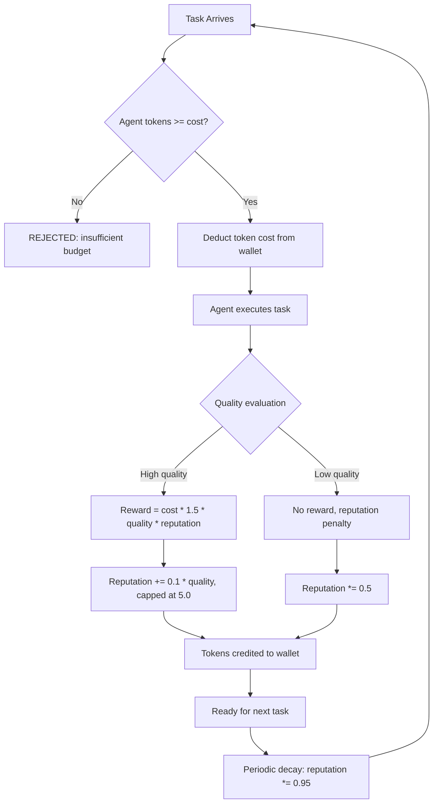

# Agent Economies, Token Incentives, Reputation

## Learning Objectives

- Implement a token-bounded agent economy with reputation-weighted task rewards using Python stdlib
- Compute Shapley-value credit attribution for a multi-agent coalition and verify marginal contributions sum to total value
- Run a second-price (Vickrey) token auction and confirm the winner pays the second-highest bid
- Configure reputation decay and evaluate how decay rate affects agent influence over time
- Map token budget allocation and reputation scoring to an enrichment waterfall's rate-limit and provider-reliability constraints

## The Problem

Multi-agent systems without economic constraints produce garbage at scale. When agents face no cost for sending messages, duplicating work, or hallucinating outputs, the system degenerates into noise. Every agent acts as if its actions are free — because, structurally, they are. You get spam cascades, circular delegation, and an emergent behavior where the loudest agent wins rather than the most useful one.

The fix is not just "add a scoring function." A reputation score alone, without scarcity, produces a popularity contest — agents collude, trade endorsements, or inflate each other's ratings. A token budget alone, without reputation, produces hoarding — agents refuse to spend tokens on risky or complex tasks because the expected payoff is uncertain. You need both: a finite resource that creates opportunity cost, and a quality-weighted signal that compounds rewards for agents that consistently deliver.

The deeper problem is credit attribution. When three agents collaborate on a research pipeline — one finds sources, one synthesizes, one writes the summary — splitting the reward equally penalizes the agent that contributed the most marginal value. Classical game theory solved this with Shapley values, which average each agent's marginal contribution across all possible coalition orderings. The 2025 AAMAS workshop on decentralized language-agent multi-agent systems (LaMAS) formalized this for LLM agents, using Shapley sampling to make the computation tractable for large coalitions [CITATION NEEDED — concept: AAMAS 2025 LaMAS Shapley-value credit attribution for LLM agents]. Google Research's "Mechanism design for large language models" proposed token auctions with second-price payment under monotone aggregation — meaning agents bid tokens for the right to answer a query, the highest bidder wins, but pays only the second-highest bid price [CITATION NEEDED — concept: Google Research mechanism design for LLMs, second-price token auctions].

## The Concept

An agent economy has three structural components: a finite resource (tokens), a distribution mechanism (how tokens enter and leave the system), and a ledger (who holds what, and who did what). Tokens create opportunity cost — every action an agent takes is an action it cannot take later. The distribution mechanism controls the money supply: if you mint too many tokens, inflation destroys the incentive signal; if you mint too few, productive agents run out of budget and stall.

Reputation is the secondary signal layered on top. It is a decay-weighted score of task completion quality that determines the multiplier on future token rewards. An agent with high reputation earns more tokens per task because its past behavior predicts reliable output. Critically, reputation must be non-transferable — agents cannot sell or trade it — and must decay over time so that influence tracks recent performance, not historical dominance.



The feedback loop above is the core mechanism. Token deduction creates the gate (can the agent afford the task?). Quality evaluation creates the signal (did the agent do good work?). Reputation scaling creates the amplifier (good agents get richer faster). Decay creates the reset (stale expertise loses influence). Without any one of these four elements, the system breaks: no gate means spam, no signal means no learning, no amplifier means no incentive to improve, no decay means permanent incumbency.

Production agent-incentive networks implement this pattern at scale. Bittensor's TAO subnets reward miners for fine-tuning task-specific models — subnet validators score model outputs and emit token rewards proportional to quality [CITATION NEEDED — concept: Bittensor TAO subnet reward mechanism]. Fetch.ai's ASI Alliance uses the FET token to settle agent-to-agent service payments, where agents bid for compute and data access [CITATION NEEDED — concept: Fetch.ai FET token settlement for agent services]. Gonka redirects transformer proof-of-work toward productive AI tasks rather than arbitrary hashing [CITATION NEEDED — concept: Gonka transformer PoW reallocation]. These are not metaphors — they are live economic systems where the mechanism design determines whether the network produces useful computation or collapses into gaming.

## Build It

We build a minimal agent economy in four stages: the core token-and-reputation ledger, Shapley-value credit attribution for coalitions, a second-price auction for task allocation, and a decay scheduler that prevents reputation stagnation. Each stage is runnable independently.

```python
import time
import itertools
import random
from dataclasses import dataclass, field
from typing import Dict, List, Tuple, Optional

@dataclass
class Agent:
    agent_id: str
    tokens: float = 100.0
    reputation: float = 1.0
    completed_tasks: List[dict] = field(default_factory=list)

@dataclass
class TaskResult:
    task_name: str
    agent_id: str
    cost: float
    quality: float
    reward: float
    reputation_after: float
    timestamp: float

class AgentEconomy:
    def __init__(self, max_reputation: float = 5.0, min_reputation: float = 0.1, decay_factor: float = 0.95):
        self.agents: Dict[str, Agent] = {}
        self.task_log: List[TaskResult] = []
        self.max_reputation = max_reputation
        self.min_reputation = min_reputation
        self.decay_factor = decay_factor

    def register(self, agent_id: str, initial_tokens: float = 100.0):
        self.agents[agent_id] = Agent(agent_id=agent_id, tokens=initial_tokens)
        print(f"Registered {agent_id} | tokens={initial_tokens:.1f} | rep=1.00")

    def execute_task(self, agent_id: str, task_name: str, cost: float = 10.0, quality: float = 1.0) -> bool:
        agent = self.agents[agent_id]
        if agent.tokens < cost:
            print(f"REJECTED: {agent_id} needs {cost:.1f} tokens, has {agent.tokens:.1f}")
            return False

        agent.tokens -= cost

        reward = cost * 1.5 * quality * agent.reputation
        agent.tokens += reward

        rep_delta = 0.1 * quality
        agent.reputation = min(self.max_reputation, agent.reputation + rep_delta)

        agent.completed_tasks.append({"task": task_name, "quality": quality, "ts": time.time()})

        result = TaskResult(
            task_name=task_name,
            agent_id=agent_id,
            cost=cost,
            quality=quality,
            reward=reward,
            reputation_after=agent.reputation,
            timestamp=time.time()
        )
        self.task_log.append(result)

        print(f"{agent_id} → {task_name} | cost={cost:.1f} | reward={reward:.1f} | rep={agent.reputation:.2f} | tokens={agent.tokens:.1f}")
        return True

    def penalize(self, agent_id: str, penalty: float = 0.5):
        agent = self.agents[agent_id]
        old = agent.reputation
        agent.reputation = max(self.min_reputation, agent.reputation * penalty)
        print(f"PENALTY: {agent_id} reputation {old:.2f} → {agent.reputation:.2f}")

    def decay_all(self):
        print("Decay cycle:")
        for agent in self.agents.values():
            old = agent.reputation
            agent.reputation = max(self.min_reputation, agent.reputation * self.decay_factor)
            print(f"  {agent.agent_id}: {old:.2f} → {agent.reputation:.2f}")

    def status(self):
        print("\n=== Economy Status ===")
        for agent in self.agents.values():
            print(f"  {agent.agent_id:15s} | tokens={agent.tokens:7.1f} | rep={agent.reputation:.2f} | tasks={len(agent.completed_tasks)}")
        print()

economy = AgentEconomy()
economy.register("researcher_01")
economy.register("writer_01")
economy.register("verifier_01")
economy.status()

economy.execute_task("researcher_01", "find_sources", cost=10.0, quality=1.2)
economy.execute_task("writer_01", "draft_summary", cost=15.0, quality=0.8)
economy.execute_task("verifier_01", "fact_check", cost=8.0, quality=1.5)
economy.execute_task("researcher_01", "deep_dive", cost=50.0, quality=1.0)

economy.penalize("writer_01", penalty=0.5)
economy.decay_all()
economy.status()
```

Run this and you will observe: the researcher accumulates tokens faster than the writer because its quality scores are higher and its reputation compounds. The verifier, starting with lower costs but high quality, earns efficiently. After the penalty and decay cycle, the writer's reputation drops, reducing its future reward multiplier. The researcher cannot afford the 50-token task after its first two tasks — the token gate blocks it. This is the economy working as designed: scarcity forces prioritization.

Now add Shapley-value credit attribution for coalition tasks. When three agents jointly produce a deliverable, we need to split the reward proportionally to marginal contribution, not equally.

```python
def coalition_value(contributors: Tuple[str, ...], contributions: Dict[str, float]) -> float:
    if not contributors:
        return 0.0
    return sum(contributions.get(c, 0.0) for c in contributors)

def exact_shapley(players: List[str], contributions: Dict[str, float]) -> Dict[str, float]:
    n = len(players)
    shapley = {p: 0.0 for p in players}
    perms = list(itertools.permutations(players))
    
    for perm in perms:
        for i, player in enumerate(perm):
            coalition_before = perm[:i]
            coalition_with = perm[:i + 1]
            
            v_without = coalition_value(coalition_before, contributions)
            v_with = coalition_value(coalition_with, contributions)
            marginal = v_with - v_without
            shapley[player] += marginal

    factorial = 1
    for i in range(1, n + 1):
        factorial *= i
    
    for p in players:
        shapley[p] /= factorial
    
    return shapley

contributions = {
    "researcher_01": 40.0,
    "writer_01": 25.0,
    "verifier_01": 35.0
}

total_value = sum(contributions.values())
shapley = exact_shapley(list(contributions.keys()), contributions)

print(f"Total coalition value: {total_value:.1f}")
print(f"Equal split would be: {total_value / 3:.1f} each")
print("Shapley values:")
for agent, value in sorted(shapley.items(), key=lambda x: -x[1]):
    pct = (value / total_value) * 100
    print(f"  {agent:15s}: {value:6.1f} ({pct:.1f}%)")

shapley_sum = sum(shapley.values())
print(f"\nShapley values sum: {shapley_sum:.1f} (should equal {total_value:.1f})")
print(f"Budget balanced: {abs(shapley_sum - total_value) < 0.001}")
```

When you run this, the Shapley values will equal each agent's standalone contribution because the value function is additive (no synergy between agents). That is correct — Shapley values reduce to individual contributions when there are no coalition effects. The interesting case is when coalition value is superadditive: two agents working together produce more than the sum of their solo work. Let's test that.

```python
synergy_contributions = {
    "researcher_01": 30.0,
    "writer_01": 20.0,
    "verifier_01": 25.0
}

def synergy_coalition_value(contributors, base_contributions, synergy_bonus=1.3):
    if not contributors:
        return 0.0
    base = sum(base_contributions.get(c, 0.0) for c in contributors)
    if len(contributors) >= 2:
        base *= synergy_bonus ** (len(contributors) - 1)
    return base

def exact_shapley_synergy(players, base_contributions, synergy_bonus=1.3):
    n = len(players)
    shapley = {p: 0.0 for p in players}
    perms = list(itertools.permutations(players))
    
    for perm in perms:
        for i, player in enumerate(perm):
            v_without = synergy_coalition_value(perm[:i], base_contributions, synergy_bonus)
            v_with = synergy_coalition_value(perm[:i + 1], base_contributions, synergy_bonus)
            shapley[player] += v_with - v_without
    
    factorial = 1
    for i in range(1, n + 1):
        factorial *= i
    
    for p in players:
        shapley[p] /= factorial
    return shapley

total_synergy = synergy_coalition_value(tuple(synergy_contributions.keys()), synergy_contributions)
shapley_synergy = exact_shapley_synergy(list(synergy_contributions.keys()), synergy_contributions)

print(f"Total coalition value (with synergy): {total_synergy:.1f}")
print("Shapley values (synergy-adjusted):")
for agent, value in sorted(shapley_synergy.items(), key=lambda x: -x[1]):
    pct = (value / total_synergy) * 100
    print(f"  {agent:15s}: {value:6.1f} ({pct:.1f}%)")

print(f"\nSum check: {sum(shapley_synergy.values()):.1f} == {total_synergy:.1f}")
```

Now the Shapley values exceed individual contributions because synergy bonus accrues to agents who enable larger coalitions. The researcher gets the largest share because its high base contribution amplifies the synergy multiplier for every coalition it joins.

Now the second-price auction. Google Research's mechanism design work proposes that agents bid tokens for task rights, the highest bidder wins, but pays the second-highest price. This is a Vickrey auction — it is strategy-proof, meaning the dominant strategy is to bid your true valuation.

```python
def vickrey_auction(bids: Dict[str, float]) -> Tuple[Optional[str], float]:
    if not bids:
        return None, 0.0
    
    sorted_bids = sorted(bids.items(), key=lambda x: x[1], reverse=True)
    winner = sorted_bids[0][0]
    winning_bid = sorted_bids[0][1]
    
    if len(sorted_bids) > 1:
        payment = sorted_bids[1][1]
    else:
        payment = winning_bid
    
    print(f"Bids: {dict(sorted(bids.items(), key=lambda x: -x[1]))}")
    print(f"Winner: {winner} (bid {winning_bid:.1f}, pays {payment:.1f})")
    print(f"Surplus: {winning_bid - payment:.1f} tokens")
    return winner, payment

task_bids = {
    "researcher_01": 35.0,
    "writer_01": 20.0,
    "verifier_01": 28.0
}

print("=== Vickrey Auction: lead_enrichment task ===")
winner, payment = vickrey_auction(task_bids)

if winner and winner in economy.agents:
    agent = economy.agents[winner]
    if agent.tokens >= payment:
        agent.tokens -= payment
        print(f"{winner} charged {payment:.1f} tokens (second-price). Remaining: {agent.tokens:.1f}")
    else:
        print(f"{winner} cannot afford payment {payment:.1f}")
```

The researcher wins with a bid of 35.0 but pays only 28.0 — the verifier's bid. The 7.0 token surplus is the researcher's profit for having a higher private valuation. In a first-price auction, the researcher would have incentive to underbid (guess the second-highest bid and bid just above it). The Vickrey mechanism eliminates that gaming — bidding your true value is always optimal.

## Use It

Your enrichment waterfall is a distributed system — parallel requests, rate limit backpressure, idempotent retries [CITATION NEEDED — concept: Zone 16 enrichment waterfall as distributed system]. Token incentive design maps directly onto this. Every API provider in your waterfall is an "agent" with a finite budget: your monthly Apollo credits, your Clay credits, your Clearbit credits. The token gate in the economy is the same mechanism as the cost check before you fire an enrichment request. The reputation score is the provider reliability weight — if Apollo returns 40% valid emails and Clearbit returns 85%, you allocate more requests (tokens) to Clearbit.

```python
class EnrichmentWaterfallEconomy:
    def __init__(self):
        self.providers: Dict[str, Agent] = {}
        self.results: List[dict] = []
    
    def add_provider(self, name: str, tokens: float, reputation: float = 1.0):
        self.providers[name] = Agent(agent_id=name, tokens=tokens, reputation=reputation)
        print(f"Provider {name} | budget={tokens:.0f} credits | reliability={reputation:.2f}")
    
    def enrich(self, provider: str, field_name: str, cost: float, success: bool):
        agent = self.providers[provider]
        if agent.tokens < cost:
            print(f"SKIP: {provider} out of budget for {field_name} (needs {cost}, has {agent.tokens:.0f})")
            return None
        
        agent.tokens -= cost
        
        if success:
            reward = cost * 2.0 * agent.reputation
            agent.tokens += reward
            agent.reputation = min(5.0, agent.reputation + 0.15)
            quality = 1.0
        else:
            agent.reputation = max(0.1, agent.reputation * 0.7)
            reward = 0.0
            quality = 0.0
        
        result = {
            "provider": provider,
            "field": field_name,
            "cost": cost,
            "success": success,
            "reward": reward,
            "rep_after": agent.reputation
        }
        self.results.append(result)
        
        status = "FOUND" if success else "MISS"
        print(f"  {provider:12s} → {field_name:15s} | {status} | cost={cost:.1f} reward={reward:.1f} rep={agent.reputation:.2f}")
        return result
    
    def waterfall(self, field_name: str, cost: float = 2.0):
        print(f"\n--- Waterfall: {field_name} ---")
        ordered = sorted(self.providers.values(), key=lambda a: -a.reputation)
        for provider in ordered:
            success = random.random() < (provider.reputation / 5.0)
            result = self.enrich(provider.agent_id, field_name, cost, success)
            if result and success:
                break

waterfall = EnrichmentWaterfallEconomy()
waterfall.add_provider("clearbit", tokens=500, reputation=3.5)
waterfall.add_provider("apollo", tokens=500, reputation=2.0)
waterfall.add_provider("hunter", tokens=200, reputation=1.5)

random.seed(42)
for record in range(5):
    waterfall.waterfall(f"email_record_{record}")

print("\n=== Provider Status After Waterfall ===")
for provider in waterfall.providers.values():
    print(f"  {provider.agent_id:12s} | credits={provider.tokens:6.0f} | reliability={provider.reputation:.2f}")
```

When you run this, the waterfall queries providers in reputation order — Clearbit first (highest reliability), then Apollo, then Hunter. Each successful enrichment increases that provider's reputation; each failure decays it. Over five records, providers that deliver results consistently get prioritized in subsequent rounds. This is the same Shapley-adjacent logic from the coalition code: marginal contribution determines future allocation. The difference is that in a GTM enrichment pipeline, the "coalition" is your provider stack, and the "value function" is the fill rate for each data field.

The second-price auction maps to provider selection under budget constraints. If you have $500/month split across three providers and need to decide which one gets the next high-value record, a Vickrey auction ensures you pay the market-clearing price rather than overpaying. Provider A bids $0.10 per enrichment, Provider B bids $0.05, Provider C bids $0.08 — Provider A wins the record but pays $0.08 (Provider C's bid). You never overpay, and providers have no incentive to misrepresent their costs.

## Ship It

Deploying an agent economy to production requires three things the prototype does not handle: persistent ledger state, decay scheduling, and anomaly detection on token flows. The economy's ledger must survive process restarts — if a container crashes mid-task, the token deduction must be atomic (deducted or not, never half-deducted). Reputation decay must run on a schedule, not inline — a cron job or background task that multiplies all reputations by 0.95 every hour, every day, or at whatever interval matches your agent activity volume.

```python
import json
import os

class PersistentEconomy(AgentEconomy):
    LEDGER_FILE = "agent_ledger.json"
    
    def __init__(self, *args, **kwargs):
        super().__init__(*args, **kwargs)
        self._load()
    
    def _load(self):
        if os.path.exists(self.LEDGER_FILE):
            with open(self.LEDGER_FILE, 'r') as f:
                data = json.load(f)
            for agent_data in data.get("agents", []):
                agent = Agent(
                    agent_id=agent_data["agent_id"],
                    tokens=agent_data["tokens"],
                    reputation=agent_data["reputation"],
                    completed_tasks=agent_data.get("completed_tasks", [])
                )
                self.agents[agent.agent_id] = agent
            print(f"Loaded {len(self.agents)} agents from {self.LEDGER_FILE}")
    
    def checkpoint(self):
        data = {
            "agents": [
                {
                    "agent_id": a.agent_id,
                    "tokens": a.tokens,
                    "reputation": a.reputation,
                    "completed_tasks": a.completed_tasks[-100:]
                }
                for a in self.agents.values()
            ],
            "task_count": len(self.task_log),
            "timestamp": time.time()
        }
        tmp = self.LEDGER_FILE + ".tmp"
        with open(tmp, 'w') as f:
            json.dump(data, f, indent=2)
        os.replace(tmp, self.LEDGER_FILE)
        print(f"Checkpoint saved: {len(self.agents)} agents, {len(self.task_log)} tasks logged")
    
    def detect_anomalies(self) -> List[str]:
        anomalies = []
        for agent in self.agents.values():
            if agent