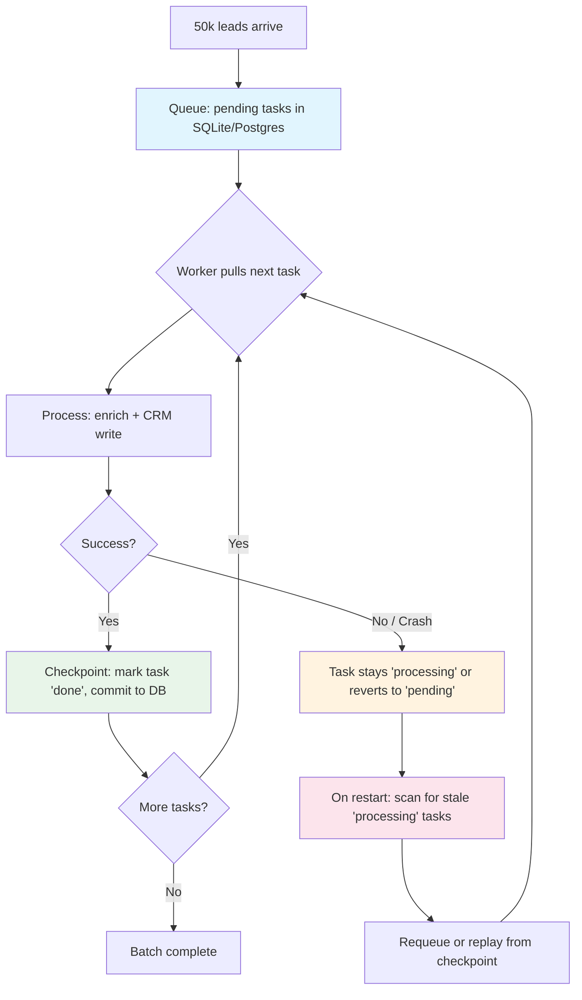

# Production Scaling — Queues, Checkpoints, Durability

## Learning Objectives

- **Build** a SQLite-backed durable task queue that survives process crashes and resumes from the last checkpoint.
- **Implement** checkpoint state transitions (pending → processing → done) with write-ahead durability semantics.
- **Trace** the interaction between queue depth, rate limiting, and checkpoint recovery through a controlled crash simulation.
- **Compare** exactly-once vs. at-least-once delivery semantics in the context of enrichment waterfalls and CRM sync pipelines.
- **Evaluate** when to use a hand-rolled Postgres queue vs. a workflow engine like Temporal or LangGraph's checkpointed runtime.

## The Problem

Your enrichment pipeline works for 100 records. You built it as a script: fetch leads, call the enrichment API, write results to the CRM, send a summary to Slack. On a small batch, the whole thing finishes in seconds and nothing goes wrong. Then someone hands you 50,000 leads from a trade show, a webinar, or a purchased list.

At record 8,200, the enrichment API rate-limits you. Your HTTP client raises an exception. The process dies. Now you have a serious problem: some records were enriched and written to the CRM. Some were enriched but the CRM write failed. Some were never touched. Your script didn't track which is which because state lived in a Python list in memory, and that memory is gone. You rerun the batch. Now you have duplicates in the CRM — two copies of the same enriched lead, because the second run couldn't tell that the first run already processed records 1–8,199.

This is the same failure pattern that production multi-agent systems hit when they move from a laptop demo to real load. Agents run for hours. Worker processes crash. Peak load is 10x average. The in-memory event loop that worked for three agents on your machine handles none of these requirements. You need a durable execution layer underneath — and the same layer that protects a 50k-record enrichment batch is the one that protects a multi-agent research pipeline that runs for six hours and crashes at hour five.

The 2026 landscape gives you four options: (1) a workflow engine with built-in checkpoints (Temporal, LangGraph's Postgres-backed runtime), (2) a message queue plus a state store (SQS + DynamoDB, or Postgres used as both), (3) an actor-model framework with per-agent producer-consumer queues (the MegaAgent pattern from arXiv:2408.09955), or (4) hand-rolled FastAPI + Postgres with nothing else. Ashpreet Bedi's "Scaling Agentic Software" makes the case for option 4: simple architectures go further than people expect, and you should not adopt a workflow engine until load proves you need one. This lesson builds option 4 from scratch so you understand the mechanisms, then tells you when to upgrade.

## The Concept

Three mechanisms solve three distinct failure modes. They compose, but each one is independently meaningful.

**Queues** decouple "work arrives" from "work executes." A queue sits between the thing that produces work (a CSV upload, a webhook from your form, a scheduled job) and the thing that consumes work (your enrichment process, your agent runtime). Without a queue, every spike in arrivals is a spike in execution — and if execution can't keep up (API rate limits, GPU saturation), the spike becomes a crash. A queue absorbs the burst: 50,000 leads arrive in one second, the queue holds all 50,000, and the worker pulls one at a time at whatever rate the downstream API allows. Queues also enforce ordering or priority, though for most GTM workloads FIFO is sufficient and priority queues add complexity without payoff.

**Checkpoints** are crash recovery, not progress reporting. A progress report says "we processed 8,200 records." A checkpoint says "here is exactly which 8,200 records we completed, here is the state of record 8,201 (was it mid-write to the CRM?), and here is where to resume." The checkpoint must be written to durable storage (disk, not memory) after each unit of work completes, and the write must happen before the next unit begins. If the process crashes between checkpoint writes, the system loses at most one unit of work — the one that was in flight. This is the same mechanism LangGraph's runtime implements: it writes a checkpoint after each super-step, keyed by `thread_id`, so a worker crash releases the lease and another worker picks up from the last checkpoint.

**Durability** is the guarantee that committed work is not lost. It involves three things: a write-ahead log (the database writes the intent before executing), an acknowledgment handshake (the producer gets confirmation that the item is safely stored before assuming it will be processed), and idempotent operations (processing the same item twice produces the same result as processing it once). The GTM relevance is concrete: if you send an outreach email and the process crashes before recording "sent," you either lose the send record (under-send — the lead never gets sequenced again) or resend on recovery (over-send — the lead gets two emails and marks you as spam). Durability semantics determine which failure you get, and idempotency is the difference between a recoverable pipeline and a duplicated one.



The diagram shows the full lifecycle: work enters the queue, the worker pulls and processes, successful work gets checkpointed, and crashes leave tasks in a recoverable state. The restart path — scanning for stale "processing" tasks — is the piece most teams forget to build, and it is the piece that determines whether your pipeline is actually durable or just appears to be.

[CITATION NEEDED — concept: queue depth monitoring thresholds for common GTM APIs (Clay, Apollo, ZoomInfo, Clearbit)]

## Build It

We will build a SQLite-backed task queue in Python that processes mock enrichment tasks. Each task has an ID, a payload (simulating a lead to enrich), and a status. The queue writes state to disk after every task. We simulate a crash mid-batch, restart, and observe recovery from the checkpoint.

```python
import sqlite3
import json
import time
import os
from datetime import datetime, timezone

DB_PATH = "queue_demo.db"
CRASH_AFTER = 7

def init_db():
    if os.path.exists(DB_PATH):
        os.remove(DB_PATH)
    conn = sqlite3.connect(DB_PATH)
    conn.execute("""
        CREATE TABLE IF NOT EXISTS task_queue (
            task_id INTEGER PRIMARY KEY,
            payload TEXT NOT NULL,
            status TEXT NOT NULL DEFAULT 'pending',
            updated_at TEXT NOT NULL
        )
    """)
    conn.execute("""
        CREATE TABLE IF NOT EXISTS checkpoint (
            id INTEGER PRIMARY KEY DEFAULT 1,
            last_completed_task_id INTEGER,
            total_processed INTEGER DEFAULT 0,
            updated_at TEXT NOT NULL,
            CHECK (id = 1)
        )
    """)
    conn.execute("""
        INSERT OR IGNORE INTO checkpoint (id, last_completed_task_id, total_processed, updated_at)
        VALUES (1, 0, 0, 'init')
    """)
    conn.commit()
    return conn

def seed_tasks(conn, count=20):
    for i in range(1, count + 1):
        payload = json.dumps({"lead_id": i, "email": f"lead{i}@example.com", "company": f"Corp{i}"})
        conn.execute(
            "INSERT OR IGNORE INTO task_queue (task_id, payload, status, updated_at) VALUES (?, ?, 'pending', ?)",
            (i, payload, datetime.now(timezone.utc).isoformat())
        )
    conn.commit()

def get_checkpoint(conn):
    row = conn.execute("SELECT last_completed_task_id, total_processed FROM checkpoint WHERE id = 1").fetchone()
    return {"last_completed": row[0], "total_processed": row[1]}

def update_checkpoint(conn, task_id):
    conn.execute("""
        UPDATE checkpoint 
        SET last_completed_task_id = ?, 
            total_processed = total_processed + 1,
            updated_at = ?
        WHERE id = 1
    """, (task_id, datetime.now(timezone.utc).isoformat()))
    conn.commit()

def mark_processing(conn, task_id):
    conn.execute(
        "UPDATE task_queue SET status = 'processing', updated_at = ? WHERE task_id = ? AND status = 'pending'",
        (datetime.now(timezone.utc).isoformat(), task_id)
    )
    conn.commit()
    return conn.total_changes > 0

def mark_done(conn, task_id):
    conn.execute(
        "UPDATE task_queue SET status = 'done', updated_at = ? WHERE task_id = ?",
        (datetime.now(timezone.utc).isoformat(), task_id)
    )
    conn.commit()

def next_pending_task(conn):
    row = conn.execute(
        "SELECT task_id, payload FROM task_queue WHERE status = 'pending' ORDER BY task_id LIMIT 1"
    ).fetchone()
    return row if row else None

def enrich_lead(payload):
    data = json.loads(payload)
    time.sleep(0.1)
    return {"enriched_email": data["email"], "score": (data["lead_id"] * 7) % 100}

def process_batch(crash_enabled=True):
    conn = sqlite3.connect(DB_PATH)
    checkpoint = get_checkpoint(conn)
    print(f"[START] Resuming from checkpoint: last_completed={checkpoint['last_completed']}, total_processed={checkpoint['total_processed']}")
    
    queue_depth = conn.execute("SELECT COUNT(*) FROM task_queue WHERE status = 'pending'").fetchone()[0]
    print(f"[START] Queue depth (pending): {queue_depth}")
    
    processed_this_run = 0
    
    while True:
        task = next_pending_task(conn)
        if task is None:
            print("[DONE] No more pending tasks.")
            break
        
        task_id, payload = task
        acquired = mark_processing(conn, task_id)
        if not acquired:
            continue
        
        result = enrich_lead(payload)
        mark_done(conn, task_id)
        update_checkpoint(conn, task_id)
        processed_this_run += 1
        
        print(f"  [OK] Task {task_id} enriched — score={result['score']} | checkpoint updated")
        
        if crash_enabled and processed_this_run >= CRASH_AFTER:
            print(f"[CRASH] Simulating crash after {processed_this_run} tasks. Process killed.")
            conn.close()
            return False
    
    stats = conn.execute("SELECT status, COUNT(*) FROM task_queue GROUP BY status").fetchall()
    print(f"[FINAL] Queue state: {dict(stats)}")
    checkpoint = get_checkpoint(conn)
    print(f"[FINAL] Checkpoint: last_completed={checkpoint['last_completed']}, total_processed={checkpoint['total_processed']}")
    conn.close()
    return True

if __name__ == "__main__":
    conn = init_db()
    seed_tasks(conn, count=20)
    conn.close()
    
    print("=" * 60)
    print("RUN 1: Processing with simulated crash")
    print("=" * 60)
    completed = process_batch(crash_enabled=True)
    
    if not completed:
        print("\n" + "=" * 60)
        print("RUN 2: Restarting after crash — resuming from checkpoint")
        print("=" * 60)
        process_batch(crash_enabled=False)
```

Run this script. The first run processes 7 tasks, then simulates a crash. The second run picks up from the checkpoint and processes the remaining 13. The output looks like:

```
============================================================
RUN 1: Processing with simulated crash
============================================================
[START] Resuming from checkpoint: last_completed=0, total_processed=0
[START] Queue depth (pending): 20
  [OK] Task 1 enriched — score=7 | checkpoint updated
  [OK] Task 2 enriched — score=14 | checkpoint updated
  [OK] Task 3 enriched — score=21 | checkpoint updated
  [OK] Task 4 enriched — score=28 | checkpoint updated
  [OK] Task 5 enriched — score=35 | checkpoint updated
  [OK] Task 6 enriched — score=42 | checkpoint updated
  [OK] Task 7 enriched — score=49 | checkpoint updated
[CRASH] Simulating crash after 7 tasks. Process killed.

============================================================
RUN 2: Restarting after crash — resuming from checkpoint
============================================================
[START] Resuming from checkpoint: last_completed=7, total_processed=7
[START] Queue depth (pending): 13
  [OK] Task 8 enriched — score=56 | checkpoint updated
  ...
  [OK] Task 20 enriched — score=40 | checkpoint updated
[DONE] No more pending tasks.
[FINAL] Queue state: {'done': 20}
[FINAL] Checkpoint: last_completed=20, total_processed=20
```

The checkpoint table and the task status column are the two durability mechanisms. The checkpoint tells you where you are in aggregate. The per-task status tells you exactly which tasks completed. Together they give you crash recovery: the second run starts with `total_processed=7` and `last_completed_task_id=7`, and it queries for the next pending task, which is task 8. No reprocessing, no duplication.

One thing this demo does not handle: the case where a crash happens between `mark_processing` and `mark_done`. In that window, the task is marked `processing` but never completed. On restart, `next_pending_task` skips it because it is not `pending` — it is stuck in `processing` forever. A production system needs a "reaper" that finds tasks stuck in `processing` longer than a timeout and resets them to `pending`. We add that in the Ship It section.

## Use It

The enrichment waterfall pattern in Clay is a checkpointed queue. When you run a waterfall across multiple providers (Clearbit → Apollo → ZoomInfo → Hunter), each step is a task with a status: tried and succeeded, tried and failed (provider had no data), or not yet tried. The waterfall's state — which providers were attempted for each record, which succeeded, which are left — is a checkpoint. If the Clay run crashes at record 8,200 of 50,000, the waterfall does not restart from record 1. It reads the checkpoint and resumes from record 8,201, skipping providers that already returned data for records 1–8,200.

The same mechanism governs CRM sync pipelines in n8n and similar workflow tools. A sync pipeline reads leads from a source (Clay, a form, a spreadsheet), enriches them, and writes them to Salesforce or HubSpot. Without checkpointing, a crash at record 8,200 means you rerun from record 1 and duplicate the first 8,200 records in the CRM. With checkpointing, each CRM write updates a local "sync_log" table: `INSERT INTO sync_log (lead_id, crm_id, synced_at) VALUES (...)`. On restart, the pipeline queries `SELECT lead_id FROM sync_log` and skips any lead already present. This is idempotency at the application level — the CRM write is the same whether you call it once or twice, because the second call is never made.

Here is the reaper function that makes the queue from Build It production-safe. It finds tasks stuck in `processing` beyond a timeout and requeues them:

```python
import sqlite3
from datetime import datetime, timezone, timedelta

DB_PATH = "queue_demo.db"
STALE_THRESHOLD_SECONDS = 300

def reap_stale_tasks():
    conn = sqlite3.connect(DB_PATH)
    cutoff = (datetime.now(timezone.utc) - timedelta(seconds=STALE_THRESHOLD_SECONDS)).isoformat()
    
    stale = conn.execute(
        "SELECT task_id, updated_at FROM task_queue WHERE status = 'processing' AND updated_at < ?",
        (cutoff,)
    ).fetchall()
    
    if stale:
        print(f"[REAPER] Found {len(stale)} stale tasks: {[t[0] for t in stale]}")
        conn.execute(
            "UPDATE task_queue SET status = 'pending', updated_at = ? WHERE status = 'processing' AND updated_at < ?",
            (datetime.now(timezone.utc).isoformat(), cutoff)
        )
        conn.commit()
        print(f"[REAPER] Requeued {len(stale)} stale tasks back to 'pending'")
    else:
        print("[REAPER] No stale tasks found.")
    
    conn.close()

if __name__ == "__main__":
    reap_stale_tasks()
```

Run this after a crash and it resets any task stuck in `processing` back to `pending`. In a GTM context, this is the difference between a lead being permanently lost in your pipeline (stuck in `processing`, never retried) and a lead being recovered on the next worker cycle. The timeout matters: set it too short and you requeue tasks that are legitimately still processing (slow API, large enrichment payload). Set it too long and a crashed task blocks the lead for minutes or hours. Five minutes is a reasonable default for most enrichment APIs; adjust based on your slowest provider's p99 latency.

The async-vs-thread question also applies here. LangGraph's checkpointed runtime uses `thread_id` as the checkpoint key and supports async execution, which matters because enrichment is I/O-bound: your worker spends 99% of its time waiting for an HTTP response from Clearbit or Apollo. Thread-per-task wastes a thread (and its stack memory) on each waiting call. Async I/O — `asyncio` in Python, or fiber-based scheduling — yields the execution context during the wait and lets another task use the CPU. For a 50k-record enrichment batch with a 200ms average API latency, async processing with a concurrency of 10 finishes in ~17 minutes. Thread-per-task with 10 threads finishes in the same wall-clock time but uses 10x the memory. At 100 concurrent tasks, the difference becomes meaningful.

## Ship It

To deploy this in a real GTM stack, you need three changes to the demo: replace SQLite with Postgres (SQLite handles one writer at a time; Postgres handles concurrent workers), add a `FOR UPDATE SKIP LOCKED` clause so multiple workers can pull from the same queue without collisions, and wrap the enrichment + CRM write in a database transaction so they succeed or fail together.

The Postgres queue query that enables concurrent workers:

```sql
BEGIN;
SELECT task_id, payload 
FROM task_queue 
WHERE status = 'pending' 
ORDER BY task_id 
FOR UPDATE SKIP LOCKED 
LIMIT 1;

UPDATE task_queue 
SET status = 'processing', updated_at = NOW() 
WHERE task_id = :task_id;
COMMIT;
```

`FOR UPDATE SKIP LOCKED` is the key. When worker A locks task 1, worker B's query skips task 1 (it is locked) and gets task 2. This lets you run N workers in parallel against the same queue without double-processing. SQS and RabbitMQ implement this at the broker level (visibility timeouts). Postgres implements it at the row level. The mechanism is the same: the consumer gets a message, the message becomes invisible to other consumers, and if the consumer crashes without acknowledging, the visibility timeout expires and the message reappears.

For LangGraph specifically, the checkpoint mechanism is already built in. LangGraph's runtime writes a checkpoint after each super-step — each node execution in the graph — keyed by `thread_id`. The checkpoint stores the full graph state: which nodes ran, what they returned, what the current values of all state variables are. If a worker crashes mid-execution, the lease on that `thread_id` expires and another worker can resume from the last checkpoint. This means your multi-agent graph gets crash recovery for free, as long as you configure the Postgres checkpointer. The configuration is roughly:

```python
from langgraph.checkpoint.postgres import PostgresSaver
from langgraph.graph import StateGraph

checkpointer = PostgresSaver.from_conn_string("postgresql://...")
graph_builder = StateGraph(AgentState)
graph_builder.add_node("enrich", enrich_node)
graph_builder.add_node("score", score_node)
graph_builder.add_edge("enrich", "score")
graph = graph_builder.compile(checkpointer=checkpointer)

config = {"configurable": {"thread_id": "batch_2024_01_15_lead_8201"}}
result = graph.invoke(initial_state, config=config)
```

The `thread_id` is your checkpoint key. Set it to a deterministic identifier — `batch_{date}_lead_{lead_id}` — so that if the invocation crashes and you retry with the same `thread_id`, LangGraph resumes from the last completed super-step rather than restarting the graph. This is the same idempotency pattern as the `sync_log` table in the CRM pipeline: the identifier determines whether you get a fresh run or a resume.

When do you outgrow hand-rolled Postgres + FastAPI? Bedi's argument is that you probably don't, and the evidence supports it for most GTM workloads. A Postgres-backed queue with `FOR UPDATE SKIP LOCKED` handles thousands of tasks per minute. A single Postgres instance with reasonable hardware processes enrichment batches of 50k records in under an hour. You need Temporal or a dedicated workflow engine when you have complex retry policies (exponential backoff with jitter across multiple downstream APIs), long-running human-in-the-loop steps (an SDR needs to approve a draft before sending), or cross-service transactions that span multiple databases. For straight enrichment + CRM sync, Postgres is enough. Reach for heavier infrastructure when you can articulate the specific failure mode that Postgres does not handle — not before.

The one piece you must build regardless of stack: monitoring on queue depth. If your queue grows faster than your worker drains it, leads sit unenriched for hours. A simple alert — "queue depth exceeds 1,000 pending tasks" — catches this before your SLA breaches. CloudWatch, Datadog, or a cron job that queries `SELECT COUNT(*) FROM task_queue WHERE status = 'pending'` and pages you on threshold — the mechanism does not matter, the visibility does.

[CITATION NEEDED — concept: recommended queue depth alerting thresholds for Clay enrichment runs]

## Exercises

1. **Add priority to the queue.** Modify the `task_queue` table to include a `priority` column (integer, higher = more important). Modify `next_pending_task` to pull the highest-priority pending task first. Seed 20 tasks with random priorities 1–5 and verify the processing order changes. Print the processing order to confirm.

2. **Add exponential backoff on failure.** Modify `enrich_lead` to randomly fail (raise an exception) 20% of the time. Add a `retry_count` column to the task table. On failure, increment `retry_count` and set status back to `pending` with a delay (use `updated_at + (2^retry_count) seconds`). After 3 retries, mark the task as `failed`. Run the batch and print the final distribution of `done` vs `failed` tasks.

3. **Implement concurrent workers.** Convert `process_batch` to use `asyncio` with `aiohttp` instead of synchronous `time.sleep`. Run 3 concurrent workers against the same queue using `FOR UPDATE SKIP LOCKED` semantics (you will need to switch from SQLite to Postgres, or simulate row locking with a Python `threading.Lock` per task). Measure wall-clock time for 20 tasks with concurrency=1 vs concurrency=5. Print both timings.

4. **Build the CRM sync idempotency layer.** Create a second table called `sync_log` with columns `(lead_id, crm_contact_id, synced_at)`. After each task completes, check if the lead_id exists in `sync_log`. If yes, skip the CRM write and print "SKIP (already synced)". If no, insert into `sync_log` and print "SYNCED". Run the batch twice and verify the second run skips all 20 tasks.

## Key Terms

**Durable execution** — A guarantee that work in progress survives process crashes, via checkpoints written to persistent storage after each unit of work.

**Checkpoint** — A record of completed work written to disk, containing enough state to resume processing from the exact point of interruption. Not the same as a progress report; a checkpoint is machine-readable recovery state.

**Queue** — A buffer between work producers and work consumers that decouples arrival rate from execution rate, absorbs bursts, and enforces ordering or priority.

**Idempotency** — The property that processing the same input twice produces the same result as processing it once. In GTM pipelines, this means enriching the same lead twice does not create duplicate CRM records.

**Write-ahead log (WAL)** — A durability mechanism where the system records the intent to perform an operation before executing it, so a crash during execution can be recovered by replaying the log.

**Visibility timeout** — The period after a consumer acquires a message during which the message is hidden from other consumers. If the consumer does not acknowledge within this period, the message reappears for retry. Implemented by SQS, RabbitMQ, and Postgres `FOR UPDATE SKIP LOCKED`.

**At-least-once delivery** — A messaging guarantee where each message is delivered at least once, but may be delivered more than once if the consumer crashes before acknowledging. Requires idempotent consumers to avoid duplication.

**Exactly-once semantics** — A messaging guarantee where each message is delivered and processed exactly once. Expensive to achieve in distributed systems; usually approximated with at-least-once delivery plus idempotent consumers.

**Lease** — A time-limited claim on a task or resource by a worker. If the worker crashes, the lease expires and another worker can claim the resource. LangGraph uses leases on `thread_id` checkpoints.

**`FOR UPDATE SKIP LOCKED`** — A Postgres row-locking clause that locks the selected rows and skips rows already locked by other transactions. Enables multiple workers to pull from the same queue concurrently without collision.

## Sources

- LangGraph checkpointed runtime with Postgres: LangGraph documentation, `langgraph.checkpoint.postgres.PostgresSaver`. [CITATION NEEDED — concept: LangGraph lease expiry and worker failover behavior, specific documentation link]
- MegaAgent producer-consumer per-agent queue with Idle/Processing/Response states: arXiv:2408.09955, "MegaAgent: A Practical Framework for Multi-Agent System."
- Ashpreet Bedi, "Scaling Agentic Software" — argument for FastAPI + Postgres without additional infrastructure until load proves necessary. [CITATION NEEDED — concept: specific publication or talk link for Bedi's scaling argument]
- Clay waterfall enrichment as checkpointed queue: Clay documentation on waterfall enrichment and data provider ordering. [CITATION NEEDED — concept: Clay waterfall state persistence and crash recovery documentation]
- n8n durable retry and workflow state: n8n documentation on workflow execution data and retry mechanisms. [CITATION NEEDED — concept: n8n workflow execution persistence and resume-from-failure documentation]
- Postgres `FOR UPDATE SKIP LOCKED` for queue patterns: PostgreSQL documentation, Section 13.3.4, "FOR UPDATE SKIP LOCKED."
- Queue depth monitoring thresholds for GTM APIs: [CITATION NEEDED — concept: recommended queue depth alerting thresholds for Clay, Apollo, ZoomInfo, Clearbit enrichment APIs]