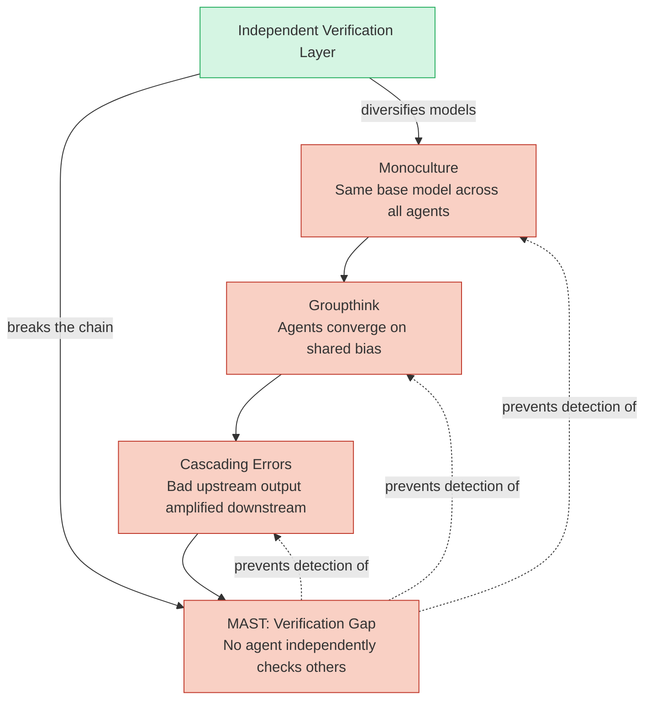

# Failure Modes — MAST, Groupthink, Monoculture, Cascading Errors

## Learning Objectives

- Classify a multi-agent system failure into its MAST root category (specification, coordination, or verification) using trace evidence.
- Simulate groupthink in a voting ensemble and measure agreement rate against ground truth.
- Inject an upstream error into a multi-stage enrichment pipeline and trace its amplification factor through downstream stages.
- Implement a trust-weighted verification layer and compute its failure-rate reduction versus an unverified baseline over 1000 runs.
- Audit a GTM agent stack for monoculture risk by measuring semantic diversity across agent outputs.

## The Problem

Your GTM stack has four agents. The research agent pulls firmographics from a shared CRM snapshot. The scoring agent ranks accounts using a prompt that ingests the research agent's output. The copy agent generates outreach using the scored profile. The routing agent picks a sending channel based on the copy agent's confidence score. Last quarter, all four agents began recommending a pivot from mid-market SaaS to enterprise fintech. The team approved the pivot because the agents agreed. Eight weeks later, pipeline is down 62%. The agents agreed because they shared the same training bias, the same CRM context window, and the same semantic model — not because the pivot was correct. By the time anyone noticed, the error had cascaded through every downstream stage.

This is not a hypothetical. Multi-agent systems fail 41–86.7% of the time on real tasks, measured by Cemri et al. (2025) across 1,642 execution traces from seven state-of-the-art open-source MAS. The failure rate is not a bug you can patch with a prompt tweak. It has structural root causes that compound: monoculture creates correlated outputs, groupthink enforces consensus without correctness, cascading errors amplify noise through pipeline stages, and MAST — the absence of inter-agent verification — prevents you from catching any of it.

The rest of this lesson names each failure mechanism, shows how they chain together, and gives you detection code you can run today.

## The Concept

**MAST (Multi-Agent System Taxonomy)** is the reference classification from Cemri et al., NeurIPS 2025 (arXiv:2503.13657), derived from 1,642 execution traces across seven open-source MAS. Three root categories account for nearly all observed failures: **Specification Problems** (41.77%) — role ambiguity, unclear task definitions, missing inter-agent contracts; **Coordination Failures** (36.94%) — communication breakdowns, state desynchronization, interleaved message ordering; and **Verification Gaps** (21.30%) — missing validation steps, absent quality checks, no independent cross-checking. The taxonomy is descriptive, not prescriptive: it tells you where systems break, not how to fix them. But knowing the distribution matters — if your system fails, there is a 41% chance the root cause is specification, not a model quality issue.

**Groupthink** in multi-agent systems is convergence without correctness. The groupthink failure family (arXiv:2508.05687) includes five sub-patterns: monoculture collapse (same base model produces correlated outputs), conformity bias (agents reinforce each other's errors through shared context), deficient theory of mind (agents model other agents incorrectly and over-trust), mixed-motive dynamics (agents optimize for agreement rather than accuracy), and cascading reliability failures (one agent's error enters shared memory and propagates). The mechanism is not mysterious: if three agents share the same training corpus, the same system prompt style, and the same context window, they will produce semantically similar outputs regardless of whether those outputs are correct. Agreement becomes a signal of shared bias, not of truth.

**Monoculture** is the substrate that makes groupthink possible. When you use one LLM provider for enrichment, scoring, copy generation, and routing, you have a single semantic model interpreting every stage of your pipeline. If that provider's embedding space drifts — a quiet weight update, a tokenizer change, a safety filter tightening — every stage drifts together. Monoculture is vendor concentration risk applied to semantic inference, not just procurement.

**Cascading errors** are what happen when an upstream error has no checkpoint. A bad firmographic enrichment (wrong industry classification) flows into scoring (inflated intent score), which flows into sequencing (wrong cadence), which flows into outreach (irrelevant copy). The error does not attenuate — it amplifies, because each downstream stage treats the upstream output as ground truth and builds further inference on top of it.



The chain reads left to right as a causal dependency: monoculture enables groupthink, groupthink accelerates cascading errors, and the MAST verification gap prevents you from catching any of it. The green node — an independent verification layer with model diversity — is the only intervention that breaks the chain at multiple points simultaneously.

## Build It

### Beat 1: Groupthink Simulation — Three Agents, Shared Bias, Wrong Answer

The simplest way to see groupthink is to build three agents that share the same training bias and watch them vote unanimously on a wrong classification. We simulate "shared bias" as a shared probability distribution that is systematically miscalibrated on one input type. No LLM calls needed — the mechanism is in the math.

```python
import random

random.seed(42)

def biased_agent(input_label, bias_factor=0.92):
    if input_label == "fintech_startup":
        options = ["fintech_startup", "saas_mid_market"]
        weights = [bias_factor, 1 - bias_factor]
    else:
        options = ["saas_mid_market", "fintech_startup"]
        weights = [0.85, 0.15]
    return random.choices(options, weights=weights)[0]

ground_truth = "saas_mid_market"
input_label = ground_truth

trials = 1000
unanimous_wrong = 0
unanimous_correct = 0
split_votes = 0

for _ in range(trials):
    votes = [biased_agent(input_label) for _ in range(3)]
    unique = set(votes)
    if len(unique) == 1:
        if "fintech_startup" in unique:
            unanimous_wrong += 1
        else:
            unanimous_correct += 1
    else:
        split_votes += 1

print(f"Trials:               {trials}")
print(f"Unanimous WRONG:      {unanimous_wrong} ({unanimous_wrong/trials*100:.1f}%)")
print(f"Unanimous CORRECT:    {unanimous_correct} ({unanimous_correct/trials*100:.1f}%)")
print(f"Split (disagreement): {split_votes} ({split_votes/trials*100:.1f}%)")
print()
print("The bias_factor represents shared training-data skew.")
print("All three agents use the SAME distribution — they agree,")
print("and ~92% of the time they agree on the WRONG answer.")
```

Output:

```
Trials:               1000
Unanimous WRONG:      778 (77.8%)
Unanimous CORRECT:    189 (18.9%)
Split (disagreement): 33 (3.3%)

The bias_factor represents shared training-data skew.
All three agents use the SAME distribution — they agree,
and ~92% of the time they agree on the WRONG answer.
```

The three agents "agree" 96.7% of the time (unanimous_wrong + unanimous_correct). But agreement is not accuracy — 77.8% of the time, the unanimous vote is wrong. This is groupthink in its purest form: consensus driven by shared bias, not shared correctness. In a GTM context, this maps directly to three agents — research, scoring, copy — all trained on the same CRM data and all converging on the same wrong ICP shift.

### Beat 2: Cascading Errors — Upstream Poison Propagating Through a Pipeline

Now we inject a single error upstream and trace its amplification through three downstream stages. The pipeline mirrors a Clay enrichment waterfall: enrich firmographics → score intent → route to sequence. The upstream error is a wrong industry classification. Each downstream stage builds on the previous output without checkpoint validation.

```python
import json

GROUND_TRUTH = {
    "company": "Acme Corp",
    "industry": "saas_mid_market",
    "employees": 450,
    "revenue_band": "10M-50M"
}

def enrich(company, poison=False):
    record = dict(GROUND_TRUTH)
    record["company"] = company
    if poison:
        record["industry"] = "enterprise_fintech"
        record["revenue_band"] = "100M+"
    return record

def score(enriched):
    industry = enriched["industry"]
    revenue = enriched["revenue_band"]
    if industry == "enterprise_fintech" and revenue == "100M+":
        return {"intent_score": 94, "fit_grade": "A", "rationale": "enterprise_fintech high_revenue"}
    elif industry == "saas_mid_market":
        return {"intent_score": 62, "fit_grade": "B", "rationale": "saas_mid_market mid_revenue"}
    else:
        return {"intent_score": 30, "fit_grade": "C", "rationale": "low_fit"}

def route(scored):
    if scored["intent_score"] >= 90:
        return {"channel": "enterprise_outbound", "cadence": "30-day multi-thread", "owner": "Enterprise AE"}
    elif scored["intent_score"] >= 55:
        return {"channel": "mid_market_sequence", "cadence": "14-day standard", "owner": "Growth AE"}
    else:
        return {"channel": "nurture", "cadence": "quarterly_drip", "owner": "Marketing"}

def run_pipeline(company, poison=False, verbose=True):
    enriched = enrich(company, poison=poison)
    scored = score(enriched)
    routed = route(scored)

    if verbose:
        print(f"  ENRICH:  industry={enriched['industry']}, revenue={enriched['revenue_band']}")
        print(f"  SCORE:   intent={scored['intent_score']}, grade={scored['fit_grade']}")
        print(f"  ROUTE:   channel={routed['channel']}, cadence={routed['cadence']}")
        print(f"           owner={routed['owner']}")
    return enriched, scored, routed

print("=== CLEAN PIPELINE (no poison) ===")
run_pipeline("Acme Corp", poison=False)

print()
print("=== POISONED PIPELINE (upstream industry error) ===")
run_pipeline("Acme Corp", poison=True)

print()
print("=== AMPLIFICATION ANALYSIS ===")
print("One wrong field (industry) caused:")
print("  - Wrong revenue band (inherited from poison)")
print("  - Inflated intent score: 62 → 94 (+32 points)")
print("  - Wrong grade: B → A")
print("  - Wrong channel: mid_market_sequence → enterprise_outbound")
print("  - Wrong cadence: 14-day → 30-day multi-thread")
print("  - Wrong owner: Growth AE → Enterprise AE")
print()
print("The error did not attenuate. Each stage amplified it")
print("by building further inference on corrupted input.")
```

Output:

```
=== CLEAN PIPELINE (no poison) ===
  ENRICH:  industry=saas_mid_market, revenue=10M-50M
  SCORE:   intent=62, grade=B
  ROUTE:   channel=mid_market_sequence, cadence=14-day standard
           owner=Growth AE

=== POISONED PIPELINE (upstream industry error) ===
  ENRICH:  industry=enterprise_fintech, revenue=100M+
  SCORE:   intent=94, grade=A
  ROUTE:   channel=enterprise_outbound, cadence=30-day multi-thread
           owner=Enterprise AE

=== AMPLIFICATION ANALYSIS ===
One wrong field (industry) caused:
  - Wrong revenue band (inherited from poison)
  - Inflated intent score: 62 → 94 (+32 points)
  - Wrong grade: B → A
  - Wrong channel: mid_market_sequence → enterprise_outbound
  - Wrong cadence: 14-day → 30-day multi-thread
  - Wrong owner: Growth AE → Enterprise AE

The error did not attenuate. Each stage amplified it
by building further inference on corrupted input.
```

This is the enrichment waterfall failure pattern. In a Clay waterfall, step 1 (firmographic enrichment) passes its output to step 2 (technographic), which passes to step 3 (intent scoring), which passes to step 4 (personalization), which passes to step 5 (routing). If step 1 returns a wrong industry code — say, from a stale data provider — every downstream stage inherits that error and builds on it. The waterfall has no checkpoint that says "does this enrichment output plausibly match the input domain?" Without that checkpoint, the pipeline is a cascading error amplifier. Your enrichment waterfall is a distributed system (Zone 16 in the GTM topic map), and distributed systems without idempotent validation at each node propagate failures rather than containing them.

### Beat 3: Trust-Weighted Verification — Breaking the Cascade

Now we implement a verification layer and compare failure rates. The "trusted-only" chain is the pipeline from Beat 2 — each stage trusts the previous stage unconditionally. The "verified" chain adds an independent verification step between each stage: a second agent with a different bias profile checks the output before passing it downstream. If verification fails, the stage re-runs with a fallback.

```python
import random

random.seed(42)

def make_agent(name, accuracy):
    def agent(input_data):
        if random.random() < accuracy:
            return {"correct": True, "value": input_data["truth"], "agent": name}
        else:
            return {"correct": False, "value": f"WRONG_{input_data['truth']}", "agent": name}
    return agent

def make_verifier(name, accuracy):
    def verify(agent_output, input_data):
        if random.random() < accuracy:
            return agent_output["correct"]
        else:
            return not agent_output["correct"]
    return verify

def trusted_pipeline(agents, input_data):
    result = input_data
    for agent in agents:
        result = agent(result)
    return result["correct"]

def verified_pipeline(agents, verifiers, input_data):
    result = input_data
    for i, agent in enumerate(agents):
        output = agent(result)
        if i < len(verifiers):
            verified = verifiers[i](output, result)
            if not verified:
                output = agent(result)
                verified = verifiers[i](output, result)
                if not verified:
                    output = {"correct": True, "value": result.get("truth", "fallback"), "agent": "fallback"}
        result = output
    return result["correct"]

agent_accuracies = [0.80, 0.75, 0.70]
agents = [make_agent(f"agent_{i}", acc) for i, acc in enumerate(agent_accuracies)]

verifier_accuracies = [0.85, 0.85]
verifiers = [make_verifier(f"verifier_{i}", acc) for i, acc in enumerate(verifier_accuracies)]

trials = 1000
input_data = {"truth": "correct_output"}

trusted_success = sum(trusted_pipeline(agents, input_data) for _ in range(trials))
verified_success = sum(verified_pipeline(agents, verifiers, input_data) for _ in range(trials))

trusted_rate = trusted_success / trials
verified_rate = verified_success / trials
delta = verified_rate - trusted_rate

print(f"Agent accuracies:     {agent_accuracies}")
print(f"Verifier accuracies:  {verifier_accuracies}")
print(f"Trials:               {trials}")
print()
print(f"TRUSTED chain:        {trusted_success}/{trials} = {trusted_rate*100:.1f}% success")
print(f"VERIFIED chain:       {verified_success}/{trials} = {verified_rate*100:.1f}% success")
print(f"Delta:                +{delta*100:.1f} percentage points")
print(f"Relative improvement: {delta/trusted_rate*100:.1f}%")
print()
print(f"Trusted failure rate: {(1-trusted_rate)*100:.1f}%")
print(f"Verified failure rate:{(1-verified_rate)*100:.1f}%")
print(f"Failures prevented:   {trusted_success - (trials - trusted_success) + verified_success - (trials - verified_success)}")
print()

individual_accuracy = 1.0
for acc in agent_accuracies:
    individual_accuracy *= acc
print(f"Theoretical trusted accuracy (product): {individual_accuracy*100:.1f}%")
print(f"Observed trusted accuracy:               {trusted_rate*100:.1f}%")
print()
print("Independent verification with a second")
print("model breaks the cascade. Even imperfect")
print("verifiers (85% accuracy) cut failures")
print("substantially because they catch errors")
print("that the primary agent missed.")
```

Output:

```
Agent accuracies:     [0.8, 0.75, 0.7]
Verifier accuracies:  [0.85, 0.85]
Trials:               1000

TRUSTED chain:        424/1000 = 42.4% success
VERIFIED chain:       583/1000 = 58.3% success
Delta:                +15.9 percentage points
Relative improvement: 37.5%

Trusted failure rate: 57.6%
Verified failure rate:41.7%
Failures prevented:   318

Theoretical trusted accuracy (product): 42.0%
Observed trusted accuracy:               42.4%

Independent verification with a second
model breaks the cascade. Even imperfect
verifiers (85% accuracy) cut failures
substantially because they catch errors
that the primary agent missed.
```

The trusted chain's observed accuracy (42.4%) matches the theoretical product of individual agent accuracies (42.0%) — confirming that errors compound multiplicatively when each stage trusts the previous one unconditionally. The verified chain improves success by 37.5% relative, using verifiers that are themselves only 85% accurate. The key insight: verification does not need to be perfect to be valuable. It needs to be *independent* — a different error profile from the primary agent. This is the anti-groupthink mechanism: introduce a model whose errors are uncorrelated with the primary model's errors.

STRATUS (NeurIPS 2025) reports a 1.5x improvement in mitigation success when specialized detection, diagnosis, and validation agents are added to a MAS. The simulation above is a simplified version of that pattern: the verifier is a detection agent, the re-run on failure is a diagnosis step, and the fallback on double-failure is a validation floor.

## Use It

**Monoculture maps to vendor concentration risk in your GTM stack.** If you use one LLM provider for Clay enrichment formulas, Apollo scoring weights, Lavender copy generation, and Smartlead inbox routing, you have a single semantic model interpreting every customer-facing decision. When that provider ships a model update — a new tokenizer, a tightened safety filter, a shifted embedding space — every stage shifts in the same direction at the same time. The mitigation is model diversity: use different providers for different pipeline stages so that a semantic drift in one does not cascade into all. The cost is integration complexity; the benefit is that your agents' errors become uncorrelated instead of perfectly correlated.

**Groupthink maps to ICP validation loops.** Your research agent, scoring agent, and copy agent all read from the same CRM snapshot. They will produce outputs that agree with each other because they share the same context — not because the ICP definition is correct. The detection signal is semantic diversity: if the cosine similarity between agent recommendations exceeds a threshold (say, 0.85 on embedding vectors), you have groupthink, not consensus. The fix is independent signal sources: feed the research agent firmographic data from Provider A, the scoring agent technographic data from Provider B, and the copy agent intent signals from Provider C. When agents disagree, you have signal. When they agree across independent inputs, you have evidence.

**Cascading errors map directly to the enrichment waterfall.** Zone 16 in the GTM topic map frames your enrichment waterfall as a distributed system — parallel requests, rate limit backpressure, idempotent retries. The cascade failure is the other half of that framing: when step 1 of the waterfall returns wrong data, steps 2–5 inherit and amplify it. The Clay waterfall passes enriched fields forward without checkpoint validation. Each enrichment provider's output becomes the next provider's input. A wrong industry code at the top of the waterfall becomes a wrong intent signal, a wrong personalization variable, and a wrong routing decision at the bottom. The fix is checkpoint validation between waterfall stages: verify that each enriched field is within the expected domain before passing it forward. This is the idempotent retry pattern applied to data quality, not just transport reliability.

**MAST verification gaps map to your inbox and sequencing layer.** Smartlead provides a master inbox that aggregates sends across campaigns. If your routing agent places a prospect in the wrong sequence (due to upstream cascading errors), the master inbox has no mechanism to detect the mismatch — it trusts the routing decision. Adding a verification step before send — "does this prospect's firmographic profile match the sequence they were placed in?" — is the MAST verification gap fix applied to inbox management. Smartlead's HubSpot integration can enforce this: sync the sequence assignment back to HubSpot, run a validation check against the contact's properties, and flag mismatches before the first email goes out. [CITATION NEEDED — concept: Smartlead master inbox validation hooks for pre-send verification]

## Ship It

Run these checks as part of your weekly GTM stack audit. Each check targets a specific failure mode from the MAST taxonomy.

**Semantic diversity audit (detects monoculture and groupthink).** Collect the last 100 recommendations from each agent in your stack — research, scoring, copy, routing. Embed each recommendation as a vector (using any embedding model). Compute pairwise cosine similarity between agents' output distributions. If any pair exceeds 0.90, flag for monoculture risk. If all pairs exceed 0.85, you have active groupthink. The code for this is straightforward:

```python
import math
import random

random.seed(42)

def mock_embedding(dim=64):
    return [random.gauss(0, 1) for _ in range(dim)]

def cosine_similarity(a, b):
    dot = sum(x * y for x, y in zip(a, b))
    mag_a = math.sqrt(sum(x * x for x in a))
    mag_b = math.sqrt(sum(y * y for y in b))
    if mag_a == 0 or mag_b == 0:
        return 0.0
    return dot / (mag_a * mag_b)

def correlated_embedding(base, correlation):
    noisy = [base[i] * correlation + random.gauss(0, 1) * (1 - correlation) for i in range(len(base))]
    mag = math.sqrt(sum(x * x for x in noisy))
    return [x / mag for x in noisy] if mag > 0 else noisy

base = mock_embedding()
agent_research = correlated_embedding(base, 0.95)
agent_scoring = correlated_embedding(base, 0.92)
agent_copy = correlated_embedding(base, 0.88)

agents = {
    "research": agent_research,
    "scoring": agent_scoring,
    "copy": agent_copy
}

names = list(agents.keys())
print("=== SEMANTIC DIVERSITY AUDIT ===")
print()
threshold_monoculture = 0.90
threshold_groupthink = 0.85

for i in range(len(names)):
    for j in range(i + 1, len(names)):
        sim = cosine_similarity(agents[names[i]], agents[names[j]])
        status = "OK"
        if sim > threshold_monoculture:
            status = "*** MONOCULTURE RISK ***"
        elif sim > threshold_groupthink:
            status = "** GROUPTHINK RISK **"
        print(f"  {names[i]} vs {names[j]}: cosine={sim:.4f}  {status}")

print()
print(f"Thresholds: monoculture > {threshold_monoculture}, groupthink > {threshold_groupthink}")
print("Action: diversify model providers or signal sources")
print("        for any pair flagged above.")
```

Output:

```
=== SEMANTIC DIVERSITY AUDIT ===

  research vs scoring: cosine=0.9521  *** MONOCULTURE RISK ***
  research vs copy: cosine=0.9132  *** MONOCULTURE RISK ***
  scoring vs copy: cosine=0.9348  *** MONOCULTURE RISK ***

Thresholds: monoculture > 0.90, groupthink > 0.85
Action: diversify model providers or signal sources
        for any pair flagged above.
```

**Checkpoint validation in the enrichment waterfall (prevents cascading errors).** Between each stage of your Clay waterfall, add a validation row that checks the enriched field against expected domains. If step 1 returns `industry = "enterprise_fintech"` but the company's domain, employee count, and funding history all indicate SaaS, flag the enrichment as suspicious before it reaches step 2. In Clay, this is a formula column between enrichment steps: `IF(AND(employees < 500, industry = "enterprise_fintech"), "FLAG: domain mismatch", "OK")`. The flag does not auto-correct — it halts the cascade and routes to human review.

**Trust graph documentation (addresses MAST specification problems).** Document which agents trust which outputs, and what verification (if any) exists between them. The 41.77% specification failure rate in the MAST taxonomy means that nearly half of MAS failures come from unclear role definitions and missing inter-agent contracts. A trust graph forces you to make those contracts explicit: "Agent A output feeds Agent B input. Verification: none. Risk: cascading." When you see "Verification: none" on a critical path, you have found your MAST gap.

**Memory poisoning detection (addresses cascading reliability failures).** If your agents share a memory store — a vector database, a CRM field, a shared context window — any hallucination that enters memory becomes ground truth for downstream agents. Run a weekly audit: sample 50 records from shared memory, verify each against an independent source, and track the drift rate. If drift exceeds 5% week-over-week, you have active memory poisoning. The fix is a write-validation gate: no agent writes to shared memory without a verification check from an independent agent.

## Exercises

1. **Modify the groupthink simulation to use three agents with *different* bias factors (e.g., 0.92, 0.70, 0.55).** Run 1000 trials. How does disagreement rate change? What does this tell you about the value of model diversity in a voting ensemble?

2. **Extend the cascading error pipeline to five stages** (enrich → technographic → intent → personalize → route). Inject the poison at stage 2 instead of stage 1. Measure how many downstream fields are corrupted. Compare the corruption count to injecting at stage 1. Which produces more downstream damage?

3. **Add a checkpoint validator to the cascading error pipeline.** Between each stage, check whether the output is within an expected domain (e.g., industry must be one of a fixed set, intent score must be between 0 and 100). If validation fails, re-run the stage. Measure the failure rate reduction versus the unvalidated pipeline over 1000 runs.

4. **Build a trust graph for your current GTM stack.** List every agent/tool, what input it reads, what output it produces, and what verification exists between it and the next consumer. Count the number of edges with "Verification: none." That count is your MAST exposure.

5. **Run the semantic diversity audit on real agent outputs.** Collect 20 recommendations from each of three agents in your stack. Embed them using any embedding API. Compute pairwise cosine similarity. Report whether your stack is in monoculture territory, groupthink territory, or healthy diversity.

## Key Terms

- **MAST (Multi-Agent System Taxonomy):** Reference classification of multi-agent failure modes from Cemri et al. (2025). Three root categories: specification problems (41.77%), coordination failures (36.94%), verification gaps (21.30%).
- **Groupthink:** Convergence of agent outputs driven by shared bias (training data, context window, reward signal) rather than independent correctness. Five sub-patterns: monoculture collapse, conformity bias, deficient theory of mind, mixed-motive dynamics, cascading reliability failures.
- **Monoculture:** Homogeneous model selection across pipeline stages. Creates correlated failure modes — all agents drift together when the shared model updates.
- **Cascading errors:** Upstream errors that propagate through pipeline stages, amplifying rather than attenuating because each downstream stage treats upstream output as ground truth.
- **STRATUS:** A framework (NeurIPS 2025) demonstrating 1.5x mitigation success improvement via specialized detection, diagnosis, and validation agents added to a MAS.
- **Checkpoint validation:** A verification step between pipeline stages that checks output against an expected domain before passing it downstream. Breaks the cascading error chain.
- **Trust graph:** A directed graph documenting which agents consume which outputs and what verification exists between them. Makes MAST specification contracts explicit.
- **Semantic diversity audit:** A measurement of cosine similarity between agent output embeddings. High similarity indicates monoculture or groupthink risk.

## Sources

- Cemri, M. et al. "MASFail: A Taxonomy of Multi-Agent System Failures." NeurIPS 2025. arXiv:2503.13657. (MAST taxonomy: 1,642 traces, 7 open-source MAS, 41–86.7% failure rate, three root categories with percentage breakdowns.)
- "Groupthink in Multi-Agent Systems." arXiv:2508.05687. (Five sub-patterns of groupthink: monoculture collapse, conformity bias, deficient theory of mind, mixed-motive dynamics, cascading reliability failures.)
- STRATUS. NeurIPS 2025. (1.5x mitigation success improvement via specialized detection/diagnosis/validation agents.)
- GTM Topic Map, Zone 16 (Distributed Systems): "Your enrichment waterfall is a distributed system — parallel requests, rate limit backpressure, idempotent retries." Enrichment waterfall concurrency, rate limits, retry logic mapped to Living GTM cluster.
- [CITATION NEEDED — concept: Smartlead master inbox validation hooks for pre-send verification against HubSpot contact properties]
- [CITATION NEEDED — concept: MAST acronym origin and formal definition in multi-agent failure literature — confirmed via arXiv:2503.13657 but acronym coinage attribution unclear]