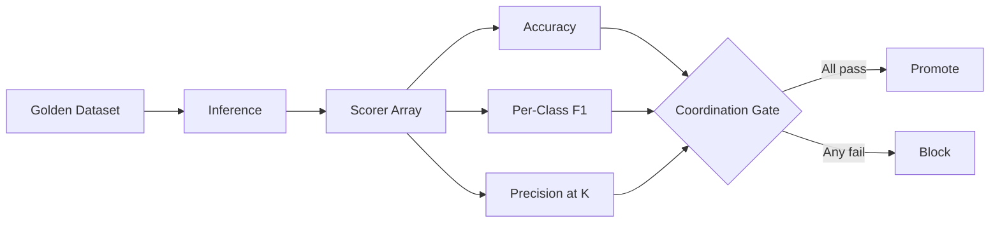

# Evaluation and Coordination Benchmarks

## Learning Objectives

- Build a golden dataset with ground-truth labels and a scorer function that produces a numeric signal per prediction.
- Compute per-class precision, recall, and F1 from raw classifier output and identify which class fails first.
- Implement a coordination gate that requires multi-metric agreement before a model or prompt change can be promoted.
- Compare static benchmarks (MMLU, HumanEval, SWE-bench Pro) against operational benchmarks built from your own production data.
- Detect class-specific failure modes that aggregate accuracy hides and explain why a single metric is insufficient for promotion decisions.

## The Problem

You shipped a reply classifier. It works on your five test emails — you hand-picked them, they're clean, and the model gets all five right. Then production traffic arrives, and "interested" gets tagged on out-of-office auto-replies, calendar declines, and one spam message selling logo design services. Your CRM now routes garbage to your SDR team's queue, and nobody notices for two weeks because nobody was measuring anything.

This is the evaluation gap. Without a benchmark — a fixed dataset, a scorer, and a decision rule — you have no signal on whether a model swap, a prompt change, or a temperature tweak made things better or worse. You're comparing against your memory of how things used to feel, which is not a metric. Every change becomes a coin flip disguised as engineering.

The problem compounds when you coordinate multiple agents or multiple scoring dimensions. MARBLE (ACL 2025, arXiv:2503.01935) showed that graph topology beats chain topology on multi-agent tasks, but only when you measure milestone KPIs — aggregate task completion rate alone masked where the coordination was actually helping. SWE-bench Pro (arXiv:2509.16941) demonstrated the opposite failure: models scoring 70%+ on SWE-bench Verified drop to ~23% on Pro, because Verified was contaminated and the "passing" score was measuring memorization, not capability. Without the right benchmark, you don't know which story you're in.

## The Concept

An evaluation benchmark is three things: a fixed dataset with known labels, a scorer that compares predictions against those labels, and an aggregation method that reduces scores to a decision metric. Strip away the frameworks and that's the entire mechanism. The dataset locks the ground truth so you can compare changes fairly. The scorer converts a prediction into a number. The aggregation reduces a list of numbers into something you can act on.

Static benchmarks — MMLU, HumanEval, SWE-bench — are published datasets designed to compare models across the field. They're useful for tracking frontier progress, but they have a shelf life. SWE-bench Verified hit 70%+ on frontier models, and SWE-bench Pro revealed that much of that score was contamination: the training data included the test repos. Operational benchmarks are different. You build them from your own data, your own edge cases, your own distribution. They don't generalize across companies, and that's the point — they measure your specific failure modes.

Coordination is the principle that you never trust a single metric. Aggregate accuracy of 85% tells you nothing about whether the "interested" class has 60% precision while "referral" has 95%. Precision-at-k, per-class F1, and confusion matrices each reveal different failure modes. The practice is to run multiple scorers in parallel and require agreement — or at minimum, require that no individual metric crosses a failure threshold — before promoting a change.



## Build It

The eval pipeline is: golden dataset → inference → scorer → metric → decision threshold. The scorer is the atom of the whole system. It takes a prediction and a ground-truth label and returns a numeric signal. That signal could be binary (correct or not), graded (a score from 0 to 1), or ranked (position of the correct answer in a list). The metric then aggregates across all records — mean accuracy, per-class precision, F1 — and the threshold turns that aggregate into a ship-or-block decision.

Here is a scorer function and a minimal eval loop. No frameworks, no abstractions — the mechanism is the loop:

```python
def exact_match_scorer(prediction, ground_truth):
    return 1.0 if prediction == ground_truth else 0.0

def run_eval(dataset, predict_fn, scorer_fn):
    scores = []
    for record in dataset:
        pred = predict_fn(record["text"])
        score = scorer_fn(pred, record["label"])
        scores.append((record["text"], record["label"], pred, score))
    return scores

golden = [
    {"text": "let's schedule a call", "label": "interested"},
    {"text": "out of office until tuesday", "label": "out_of_office"},
    {"text": "not interested, please remove me", "label": "not_interested"},
    {"text": "talk to my colleague sarah about this", "label": "referral"},
]

def toy_classifier(text):
    t = text.lower()
    if "out of office" in t:
        return "out_of_office"
    if "not interested" in t or "remove" in t:
        return "not_interested"
    if "colleague" in t or "talk to" in t:
        return "referral"
    return "interested"

results = run_eval(golden, toy_classifier, exact_match_scorer)

for text, truth, pred, score in results:
    status = "PASS" if score == 1.0 else "FAIL"
    print(f"{status} | truth={truth:20s} pred={pred:20s} | {text}")

accuracy = sum(r[3] for r in results) / len(results)
print(f"\nAccuracy: {accuracy:.2%} ({int(accuracy * len(results))}/{len(results)})")
```

Run this and you'll see every record scored individually, then the aggregate. The scorer is trivially simple here — exact match — but it's the same interface whether you're doing exact match, LLM-as-judge scoring, or semantic similarity. Swap the scorer function, keep the loop.

The coordination question is what happens when you add a second scorer. Suppose you also want precision specifically on the "interested" class because false positives there route bad leads to your SDR queue. You run both scorers in parallel on the same predictions, and the promotion rule requires both to pass. This is the pattern structured evaluation frameworks implement: multiple independent signals, a conjunction gate. [CITATION NEEDED — concept: coordination protocols for multi-metric evaluation in production LLM systems]

## Use It

Coordination benchmarks — multiple scorers running in parallel with a conjunction gate — map directly to Cluster 11 (Evaluations, LLM testing) in a Living GTM stack. Your reply classifier is an eval feedback loop: every classified reply either routes correctly or pollutes a downstream queue. The benchmark you build around it determines whether you catch degradation before your SDRs do.

Build a golden dataset of 50 real sales replies with ground-truth labels: interested, not_interested, out_of_office, referral. Pull them from your actual CRM — the ones where you know what happened next. Label them by hand. This is your operational benchmark, and it's worth more than any published dataset because it measures your distribution.

The metric that matters for GTM pipeline handoffs is precision per class, not aggregate accuracy. If the "interested" class has 60% precision, four out of ten leads routed to your SDRs are junk, and your SDRs stop trusting the classifier. That trust erosion is more expensive than the engineering cost of fixing the classifier. Track precision per class on every prompt or model change:

```python
from collections import defaultdict

golden_replies = [
    {"text": "this looks relevant, send a calendar link", "label": "interested"},
    {"text": "ooo until friday", "label": "out_of_office"},
    {"text": "we use a competitor, not interested", "label": "not_interested"},
    {"text": "forward this to sarah on my team", "label": "referral"},
    {"text": "sure let's do 30 min next week", "label": "interested"},
    {"text": "i'm the wrong person, try mike", "label": "referral"},
    {"text": "out of office, returning monday", "label": "out_of_office"},
    {"text": "not now maybe next quarter", "label": "not_interested"},
]

predictions = [toy_classifier(r["text"]) for r in golden_replies]
truths = [r["label"] for r in golden_replies]

classes = sorted(set(truths))
stats = defaultdict(lambda: {"tp": 0, "fp": 0, "fn": 0})

for truth, pred in zip(truths, predictions):
    if pred == truth:
        stats[truth]["tp"] += 1
    else:
        stats[pred]["fp"] += 1
        stats[truth]["fn"] += 1

print(f"{'Class':<20} {'Precision':<12} {'Recall':<12} {'F1':<12}")
print("-" * 56)
for cls in classes:
    s = stats[cls]
    precision = s["tp"] / (s["tp"] + s["fp"]) if (s["tp"] + s["fp"]) > 0 else 0.0
    recall = s["tp"] / (s["tp"] + s["fn"]) if (s["tp"] + s["fn"]) > 0 else 0.0
    f1 = 2 * precision * recall / (precision + recall) if (precision + recall) > 0 else 0.0
    print(f"{cls:<20} {precision:<12.2%} {recall:<12.2%} {f1:<12.2%}")
```

This is the mechanism that tools like Gong and similar conversational intelligence platforms use internally to justify model updates — they hold a golden set of labeled conversations and measure whether a model change improves or degrades classification on the categories that matter to revenue teams. [CITATION NEEDED — concept: Gong's internal model evaluation methodology for conversation classification] The principle transfers to any GTM system that routes based on model output: email triage, intent scoring, ICP matching, churn prediction.

## Ship It

A coordination benchmark gate in production means: no model or prompt ships without passing the benchmark. Here's a self-contained evaluation harness that creates a golden dataset, runs inference, computes accuracy and per-class precision/recall/F1, and enforces a coordination gate — if any class F1 drops below 0.7, the script exits with code 1. Wire this into CI as a pre-merge check on any change to the classifier or its prompt.

```python
import sys
import json
from collections import defaultdict

GOLDEN_DATASET = [
    {"text": "this looks great, let's talk next week", "label": "interested"},
    {"text": "send me a calendar invite", "label": "interested"},
    {"text": "very interested, what are next steps", "label": "interested"},
    {"text": "let's get this done", "label": "interested"},
    {"text": "out of office until monday", "label": "out_of_office"},
    {"text": "ooo, returning wednesday", "label": "out_of_office"},
    {"text": "i'm away from the office", "label": "out_of_office"},
    {"text": "currently out of office", "label": "out_of_office"},
    {"text": "not interested, remove me from your list", "label": "not_interested"},
    {"text": "we already have a vendor", "label": "not_interested"},
    {"text": "no budget this year", "label": "not_interested"},
    {"text": "stop emailing me", "label": "not_interested"},
    {"text": "talk to my colleague sarah about this", "label": "referral"},
    {"text": "mike on my team handles this", "label": "referral"},
    {"text": "forward this to jennifer", "label": "referral"},
    {"text": "you should reach out to david", "label": "referral"},
]

def classify(text):
    t = text.lower()
    if any(p in t for p in ["out of office", "ooo", "away from the office"]):
        return "out_of_office"
    if any(p in t for p in ["not interested", "remove me", "no budget", "stop emailing", "already have a vendor"]):
        return "not_interested"
    if any(p in t for p in ["colleague", "talk to", "forward this", "reach out to", "handles this"]):
        return "referral"
    return "interested"

def compute_metrics(records, predictions):
    truths = [r["label"] for r in records]
    classes = sorted(set(truths))
    stats = defaultdict(lambda: {"tp": 0, "fp": 0, "fn": 0})
    correct = 0
    for truth, pred in zip(truths, predictions):
        if pred == truth:
            stats[truth]["tp"] += 1
            correct += 1
        else:
            stats[pred]["fp"] += 1
            stats[truth]["fn"] += 1
    accuracy = correct / len(records)
    per_class = {}
    for cls in classes:
        s = stats[cls]
        p = s["tp"] / (s["tp"] + s["fp"]) if (s["tp"] + s["fp"]) > 0 else 0.0
        r = s["tp"] / (s["tp"] + s["fn"]) if (s["tp"] + s["fn"]) > 0 else 0.0
        f1 = 2 * p * r / (p + r) if (p + r) > 0 else 0.0
        per_class[cls] = {"precision": p, "recall": r, "f1": f1}
    return accuracy, per_class

predictions = [classify(r["text"]) for r in GOLDEN_DATASET]
accuracy, per_class = compute_metrics(GOLDEN_DATASET, predictions)

F1_THRESHOLD = 0.7
print("=" * 60)
print("EVALUATION RESULTS")
print("=" * 60)
print(f"Records: {len(GOLDEN_DATASET)}")
print(f"Overall accuracy: {accuracy:.2%}")
print()
print(f"{'Class':<20} {'Precision':<12} {'Recall':<12} {'F1':<12} {'Status'}")
print("-" * 72)

all_pass = True
for cls, m in per_class.items():
    status = "PASS" if m["f1"] >= F1_THRESHOLD else "FAIL"
    if m["f1"] < F1_THRESHOLD:
        all_pass = False
    print(f"{cls:<20} {m['precision']:<12.2%} {m['recall']:<12.2%} {m['f1']:<12.2%} {status}")

print()
if all_pass:
    print(f"COORDINATION GATE: PASS (all class F1 >= {F1_THRESHOLD})")
    sys.exit(0)
else:
    print(f"COORDINATION GATE: FAIL (one or more class F1 < {F1_THRESHOLD})")
    sys.exit(1)
```

Run this and you'll see a per-class breakdown with pass/fail per metric and a coordination gate decision at the end. The exit code is what your CI pipeline checks: `exit 0` means the change is safe to merge, `exit 1` means it's not. To wire this into CI, save the script as `eval_gate.py`, add a golden dataset JSONL loader if your dataset outgrows inline, and add a step to your GitHub Actions or GitLab CI config that runs `python eval_gate.py` on every PR touching the classifier.

The distributed systems analogy holds here just as it does for enrichment waterfalls: multiple independent scorers running in parallel, each producing a signal, with a coordination protocol (the conjunction gate) that requires agreement before proceeding. The same pattern — parallel workers, independent failure modes, a join barrier — appears whether you're coordinating enrichment API calls or coordinating evaluation metrics across model classes.

## Exercises

**Easy.** Build a golden dataset of 20 items across three classes of your choice. Write a toy classifier with keyword rules. Compute raw accuracy using the `exact_match_scorer` from the Build It section. Print which records failed.

**Medium.** Take the Ship It harness and add two new classes (e.g., `meeting_booked` and `demo_request`) with at least four examples each. Run the harness and identify which class fails the F1 threshold first. Adjust the classifier rules until all classes pass, then deliberately break one rule and confirm the gate catches it.

**Hard.** Implement a coordination gate that compares two prompt variants (or two classifier configurations) across three metrics — per-class F1, precision-at-3, and a custom scorer of your choice — and only promotes the challenger if it wins or ties on all three. Print a comparison table showing both variants side by side. The gate should output `CHALLENGER_PROMOTED`, `CHALLENGER_REJECTED`, or `TIE` based on the results.

## Key Terms

**Golden dataset** — A fixed set of input-label pairs that serves as ground truth for evaluation. Locked at a specific version so changes to the model or prompt can be compared fairly.

**Scorer** — A function that takes a prediction and a ground-truth label and returns a numeric signal. The atomic unit of any evaluation system.

**Aggregation method** — The function that reduces a list of per-record scores into a decision metric: mean accuracy, per-class F1, precision-at-k, or a weighted combination.

**Static benchmark** — A published, standardized dataset (MMLU, HumanEval, SWE-bench) used to compare models across the field. Subject to contamination and distribution shift as the field advances.

**Operational benchmark** — A benchmark built from your own production data, measuring your specific failure modes. Does not generalize across organizations; that is the feature, not the bug.

**Coordination gate** — A promotion rule that requires multiple metrics to pass independently before a model or prompt change ships. The conjunction of independent scorers, analogous to a distributed systems barrier.

**Per-class F1** — The harmonic mean of precision and recall for a single label class. Reveals failure modes that aggregate accuracy masks, such as a classifier that's accurate overall but unusable for one critical category.

**Precision-at-k** — The fraction of the top-k predictions that are correct, measuring ranking quality rather than binary correctness.

The rule to leave with: no model or prompt ships without passing the benchmark gate. Next lesson covers continuous evaluation in production — drift detection, golden dataset refresh cadence, and what to do when your operational benchmark starts rotting because your production distribution shifted underneath it.

## Sources

- **MARBLE / MultiAgentBench** (ACL 2025, arXiv:2503.01935) — multi-agent evaluation across star/chain/tree/graph topologies with milestone KPIs; graph topology performs best on research tasks. Used as evidence that aggregate task completion masks topology-specific coordination effects.
- **SWE-bench Pro** (arXiv:2509.16941) — 1865 problems across 41 repos; frontier models score ~23% on Pro vs 70%+ on Verified, demonstrating benchmark contamination. Used as evidence that static benchmarks have a contamination shelf life.
- **Verdent technical report** (verdent.ai/blog/swe-bench-verified-technical-report) — Verdent agent scaffold hits 76.1% pass@1 on SWE-bench Verified. Referenced for the Verified vs Pro gap context.
- **Zone 16 (Distributed Systems)** — The 80/20 GTM Engineer Handbook by Michael Saruggia (Growth Lead LLC). Enrichment waterfall concurrency, rate limits, retry logic. Used as the distributed systems analogy for parallel scorers with a coordination barrier.
- [CITATION NEEDED — concept: coordination protocols for multi-metric evaluation in production LLM systems]
- [CITATION NEEDED — concept: Gong's internal model evaluation methodology for conversation classification]