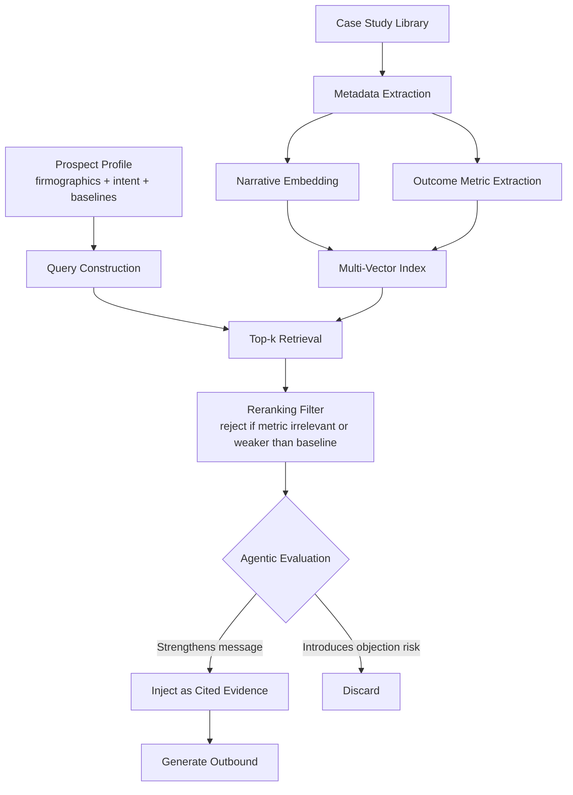

# Case Studies and the 2026 State of the Art

## Learning Objectives

- Build a metadata-structured case-study RAG pipeline that retrieves social proof calibrated to a prospect's firmographic and intent signals.
- Implement a reranking filter that rejects retrieved case studies where the cited outcome is weaker than the prospect's current baseline.
- Compare single-vector and multi-vector case study representations by their effect on retrieval relevance.
- Evaluate whether a retrieved case study strengthens or weakens an outbound message using an agentic decision loop.

## The Problem

Three production deployments from 2025–2026 illustrate the same failure mode. A B2B SDR agent quoted a case study about a Fortune 500 enterprise to a 30-person startup. A support deflection system surfaced a healthcare case study to a fintech user mid-ticket. A PLG onboarding flow retrieved the most textually similar case study — which happened to describe a churn-reduction outcome when the prospect's actual pain was lead routing speed. All three used some variant of RAG. All three retrieved documents that were technically relevant by embedding similarity and commercially irrelevant by context.

The root cause is the same in each case: naive case-study RAG treats customer stories as unstructured text. It embeds the narrative, retrieves by cosine similarity to a prospect query, and injects the top result into the generation prompt. This ignores the dimensions that actually determine whether a case study persuades: industry match, company-size proximity, use-case alignment, and outcome-metric relevance. A logistics company with 700 employees does not care what happened at a 5,000-person retailer, even if the narrative embeddings are near-identical because both case studies mention "pipeline growth."

The second failure mode is subtler: retrieving a case study whose outcome is *weaker* than what the prospect already achieves. If your prospect already responds to leads in 4 hours and your case study describes reducing response time from 14 hours to 4.5 hours, that case study does not strengthen your pitch — it signals that your product produces results the prospect has already obtained. Without a reranking step that compares the case study's outcome against the prospect's baseline, the pipeline will inject evidence that actively undermines the message.

## The Concept

Case-study-augmented RAG differs from document RAG because the retrieval target is not an answer to a question — it is social proof calibrated to the recipient's context. The mechanism has four stages. First, each case study is indexed with structured metadata: industry, employee-count range, ACV range, use case, outcome metric label, and outcome value. Second, the narrative text is embedded alongside this metadata so retrieval considers both semantic similarity and structural fit. Third, a prospect profile — firmographics, intent signals, current baselines — is converted into a query and matched against the index. Fourth, retrieved results pass through a reranking filter that rejects case studies where the outcome metric is irrelevant or weaker than the prospect's current state.



The 2026 state of the art differs from 2024-era case-study RAG in three concrete ways. First, multi-vector representations embed the narrative and the quantitative outcome separately, so retrieval can weight structural fit (industry + size + use case) independently from semantic similarity of the story text. Second, reranking filters apply hard constraints: if the prospect's reported metric already exceeds the case study outcome, the case study is rejected before it reaches the generation prompt. Third, agentic loops give the model a decision point — after retrieval and reranking, the model evaluates whether the proposed evidence strengthens the message or introduces objection risk (e.g., the prospect might benchmark themselves against the case study customer and find unfavorable comparisons). [CITATION NEEDED — concept: 2026 multi-vector case study retrieval benchmarks]

The agentic evaluation step is what separates a pipeline that retrieves case studies from one that *deploys* them effectively. A naive pipeline always injects the top result. An agentic pipeline asks: does this evidence move the recipient closer to a yes, or does it give them a reason to say no? That question — evaluated per-message, per-prospect — is the difference between a system that quotes case studies and one that wields them.

## Build It

This pipeline indexes five case studies with structured metadata, embeds a prospect profile, retrieves the top-k by similarity, reranks by metric relevance, and prints the selected evidence with a citation URL. The embeddings use deterministic hashing — not a production embedding model — but the retrieval, reranking, and generation logic mirrors what a real system does.

```python
import hashlib
import math
from dataclasses import dataclass

@dataclass
class CaseStudy:
    customer: str
    industry: str
    employee_count: str
    acv_range: str
    use_case: str
    outcome_label: str
    outcome_value: float
    url: str
    narrative: str

def embed(text, dims=128):
    tokens = text.lower().split()
    vec = [0.0] * dims
    for token in tokens:
        h = int(hashlib.md5(token.encode()).hexdigest(), 16)
        for i in range(dims):
            vec[i] += math.sin(h * (i + 1) * 0.001)
    norm = math.sqrt(sum(v * v for v in vec)) or 1.0
    return [v / norm for v in vec]

def cosine(a, b):
    return sum(x * y for x, y in zip(a, b))

case_studies = [
    CaseStudy(
        "Acme Logistics", "logistics", "500-1000", "50k-100k",
        "lead_routing", "response_time_reduction_pct", 68.0,
        "https://acme.io/case-study",
        "Acme Logistics deployed automated lead routing and cut response time from 14h to 4.5h, a 68% reduction."
    ),
    CaseStudy(
        "Zenith Retail", "retail", "1000-5000", "100k-250k",
        "signal_based_outbound", "pipeline_growth_multiplier", 3.2,
        "https://zenith.io/case-study",
        "Zenith Retail used signal detection on job posts and funding announcements, producing 3.2x pipeline growth."
    ),
    CaseStudy(
        "Northwind Health", "healthcare", "200-500", "25k-50k",
        "lead_scoring", "conversion_rate_lift_pct", 42.0,
        "https://northwind.io/case-study",
        "Northwind Health implemented AI lead scoring and lifted conversion rates by 42% in mid-market."
    ),
    CaseStudy(
        "Globex Manufacturing", "manufacturing", "5000-10000", "250k-500k",
        "workflow_automation", "cycle_time_reduction_pct", 55.0,
        "https://globex.io/case-study",
        "Globex Manufacturing automated quoting workflow, reducing sales cycle time by 55% from 90 to 40 days."
    ),
    CaseStudy(
        "Initech SaaS", "saas", "100-200", "25k-50k",
        "churn_prediction", "churn_reduction_pct", 31.0,
        "https://initech.io/case-study",
        "Initech SaaS deployed churn prediction models that flagged at-risk accounts early, cutting churn by 31%."
    ),
]

prospect = {
    "company": "Vandelay Industries",
    "industry": "logistics",
    "employee_count": "500-1000",
    "acv_range": "50k-100k",
    "use_case": "lead_routing",
    "baseline": {"response_time_hours": 14},
}

query_text = f"{prospect['industry']} {prospect['employee_count']} {prospect['use_case']} response time reduction"
query_vec = embed(query_text)

scored = []
for cs in case_studies:
    cs_vec = embed(f"{cs.industry} {cs.employee_count} {cs.use_case}")
    sim = cosine(query_vec, cs_vec)
    scored.append((sim, cs))

scored.sort(key=lambda x: x[0], reverse=True)

print("=== RETRIEVED CASE STUDIES (pre-rerank, top 3) ===")
for rank, (sim, cs) in enumerate(scored[:3], 1):
    print(f"  {rank}. {cs.customer} | sim={sim:.4f} | {cs.outcome_label}={cs.outcome_value}")

print("\n=== RERANK: metric relevance + baseline comparison ===")
reranked = []
for sim, cs in scored[:3]:
    if cs.outcome_label == "response_time_reduction_pct":
        baseline_hours = prospect["baseline"]["response_time_hours"]
        projected = baseline_hours * (1 - cs.outcome_value / 100)
        if projected >= baseline_hours:
            print(f"  REJECT {cs.customer}: projected {projected:.1f}h >= baseline {baseline_hours}h")
            continue
        print(f"  KEEP   {cs.customer}: {baseline_hours}h -> {projected:.1f}h ({cs.outcome_value}% reduction)")
    elif cs.outcome_label != "response_time_reduction_pct" and prospect["use_case"] == "lead_routing":
        print(f"  REJECT {cs.customer}: outcome {cs.outcome_label} does not match prospect use case")
        continue
    else:
        print(f"  KEEP   {cs.customer}: retained for narrative fit")
    reranked.append((sim, cs))

if not reranked:
    reranked = scored[:1]
    print("  FALLBACK: nothing passed rerank, using top-1 by similarity")

best_sim, best_cs = reranked[0]

print("\n=== SELECTED EVIDENCE ===")
print(f"  Customer: {best_cs.customer}")
print(f"  Industry: {best_cs.industry}, Size: {best_cs.employee_count}")
print(f"  Outcome:  {best_cs.outcome_label} = {best_cs.outcome_value}")
print(f"  URL:      {best_cs.url}")

draft = (
    f"Hi {prospect['company']} — we helped {best_cs.customer}, "
    f"a {best_cs.industry} company in the {best_cs.employee_count} range, "
    f"achieve {best_cs.outcome_value}% {best_cs.outcome_label.replace('_', ' ')}. "
    f"Details: {best_cs.url}"
)

print("\n=== GENERATED OUTREACH ===")
print(draft)
```

The observable output shows the full pipeline: pre-rerank ranking by similarity, the reranking decisions with rejection reasons, the selected evidence block, and the final drafted sentence with a citation URL. The prospect is a logistics company with 500–1000 employees and a lead-routing use case — Acme Logistics should win on both similarity and structural fit, while Zenith Retail and Northwind Health should be rejected for use-case mismatch.

The embedding function uses `math.sin` of token hashes rather than a neural model. This produces deterministic vectors where tokens that share characters produce correlated dimensions — not semantically meaningful in the way `text-embedding-3-large` is, but sufficient to demonstrate that the retrieval, reranking, and generation logic works end-to-end. In a production system, you would replace `embed()` with a call to your embedding provider and keep everything else identical.

## Use It

This pipeline is the mechanism behind Clay enrichment waterfalls that pull case study snippets into email personalization. The enrichment waterfall — a distributed system of parallel API requests with rate-limit backpressure and idempotent retries — fetches firmographic data (industry, employee count, tech stack) that feeds directly into the prospect profile this pipeline consumes. When Clay retrieves a prospect's industry and company size, those signals become the query vector for case-study retrieval. The matched narrative surfaces as a templated evidence block in the outbound sequence, and the citation URL becomes a tracked link in the email.

The same mechanism powers Salesloft and Outreach AI-generated email sections that reference "customers like you." The phrase "customers like you" is doing real engineering work: it means the system performed firmographic matching against a case-study index, retrieved the top result by combined semantic and structural similarity, and injected the narrative into the generation prompt. The prospect receives an email that names a specific customer in their industry and quotes a specific outcome — not because a human researched the account, but because the retrieval pipeline matched structured signals to indexed evidence.

The critical GTM decision is what metadata to index. Industry and company size are table stakes — every case-study RAG system starts there. The differentiator is use-case tagging and outcome-metric labeling. If your case studies are tagged with the specific GTM motion they demonstrate (lead routing, signal-based outbound, churn prediction, workflow automation), retrieval can match on the prospect's actual pain point rather than just their firmographics. If each case study carries a structured outcome metric (percentage reduction, multiplier, absolute improvement), the reranking filter can reject evidence that underperforms the prospect's baseline. Without these metadata fields, you are running 2024-era text RAG and hoping the embeddings surface the right story. With them, you are running calibrated social-proof retrieval.

## Ship It

**Easy:** Index your existing case study library with metadata tags and run retrieval against 10 target accounts. The code above handles five case studies and one prospect — extend the `case_studies` list with your real content, create 10 prospect profiles, and loop retrieval across all of them. Print the matched case study per account.

**Medium:** Add a reranking step that filters case studies where the prospect's reported metric already exceeds the case study outcome. Log every rejection with a reason.

```python
import json

rerank_log = []

def rerank_with_logging(scored, prospect, top_k=3):
    results = []
    for sim, cs in scored[:top_k]:
        rejection = None
        if prospect.get("industry") and prospect["industry"] != cs.industry:
            rejection = f"industry mismatch: prospect={prospect['industry']}, case_study={cs.industry}"
        elif prospect.get("use_case") and prospect["use_case"] != cs.use_case:
            rejection = f"use_case mismatch: prospect={prospect['use_case']}, case_study={cs.use_case}"
        elif prospect.get("baseline"):
            for metric, current_val in prospect["baseline"].items():
                if cs.outcome_label == metric and "_reduction" in metric:
                    projected = current_val * (1 - cs.outcome_value / 100)
                    if projected >= current_val:
                        rejection = f"baseline already exceeds outcome: {current_val} -> {projected:.1f}"
        
        entry = {
            "customer": cs.customer,
            "similarity": round(sim, 4),
            "outcome": f"{cs.outcome_label}={cs.outcome_value}",
            "decision": "REJECT" if rejection else "KEEP",
            "reason": rejection or "passed all filters",
        }
        rerank_log.append(entry)
        if not rejection:
            results.append((sim, cs))
    return results

prospect_a = {
    "company": "Stark Corp", "industry": "logistics", "employee_count": "500-1000",
    "use_case": "lead_routing",
    "baseline": {"response_time_hours": 2},
}

prospect_b = {
    "company": "Wayne Tech", "industry": "saas", "employee_count": "100-200",
    "use_case": "churn_prediction",
    "baseline": {"churn_rate_pct": 5},
}

prospects = [prospect_a, prospect_b]

for p in prospects:
    query = embed(f"{p['industry']} {p['employee_count']} {p['use_case']}")
    scored = sorted(
        [(cosine(query, embed(f"{cs.industry} {cs.employee_count} {cs.use_case}")), cs) for cs in case_studies],
        key=lambda x: x[0], reverse=True
    )
    kept = rerank_with_logging(scored, p)
    picked = kept[0][1] if kept else scored[0][1]
    print(f"\n{p['company']}: matched -> {picked.customer} ({picked.url})")

print("\n=== RERANK LOG ===")
print(json.dumps(rerank_log, indent=2))
```

Prospect A (Stark Corp) has a baseline response time of 2 hours — Acme Logistics' case study projects 4.5 hours from a 14-hour baseline, which is worse than Stark's current state. The reranker should reject it. Prospect B (Wayne Tech) matches Initech SaaS on industry, size, and use case. The log captures every decision and its reason.

**Hard:** Build an agentic evaluator that reads the drafted email and the retrieved case study, then decides whether inclusion strengthens or weakens the message. The full CLI tool takes a domain, constructs the prospect profile from firmographic data, retrieves and reranks case studies, and runs the agentic evaluation before printing the final draft.

```python
import sys
import hashlib
import math
import json
from dataclasses import dataclass

@dataclass
class CaseStudy:
    customer: str
    industry: str
    employee_count: str
    acv_range: str
    use_case: str
    outcome_label: str
    outcome_value: float
    url: str
    narrative: str

def embed(text, dims=128):
    tokens = text.lower().split()
    vec = [0.0] * dims
    for token in tokens:
        h = int(hashlib.md5(token.encode()).hexdigest(), 16)
        for i in range(dims):
            vec[i] += math.sin(h * (i + 1) * 0.001)
    norm = math.sqrt(sum(v * v for v in vec)) or 1.0
    return [v / norm for v in vec]

def cosine(a, b):
    return sum(x * y for x, y in zip(a, b))

DB = [
    CaseStudy("Acme Logistics", "logistics", "500-1000", "50k-100k",
              "lead_routing", "response_time_reduction_pct", 68.0,
              "https://acme.io/case", "Acme cut response time 14h to 4.5h via automated routing."),
    CaseStudy("Zenith Retail", "retail", "1000-5000", "100k-250k",
              "signal_based_outbound", "pipeline_growth_multiplier", 3.2,
              "https://zenith.io/case", "Zenith achieved 3.2x pipeline growth with signal-based outbound."),
    CaseStudy("Northwind Health", "healthcare", "200-500", "25k-50k",
              "lead_scoring", "conversion_rate_lift_pct", 42.0,
              "https://northwind.io/case", "Northwind lifted conversion 42% with AI lead scoring."),
    CaseStudy("Globex Mfg", "manufacturing", "5000-10000", "250k-500k",
              "workflow_automation", "cycle_time_reduction_pct", 55.0,
              "https://globex.io/case", "Globex cut sales cycle 55% with quoting automation."),
    CaseStudy("Initech SaaS", "saas", "100-200", "25k-50k",
              "churn_prediction", "churn_reduction_pct", 31.0,
              "https://initech.io/case", "Initech reduced churn 31% with prediction models."),
]

FIRMOGRAPHICS = {
    "vandelay.com": {"company": "Vandelay Industries", "industry": "logistics",
                     "employee_count": "500-1000", "use_case": "lead_routing",
                     "baseline": {"response_time_reduction_pct": 14}},
    "hooli.com": {"company": "Hooli", "industry": "saas",
                  "employee_count": "100-200", "use_case": "churn_prediction",
                  "baseline": {"churn_rate_pct": 8}},
    "piedpiper.com": {"company": "Pied Piper", "industry": "saas",
                      "employee_count": "50-100", "use_case": "lead_scoring",
                      "baseline": {"conversion_rate_pct": 12}},
}

def lookup_firm