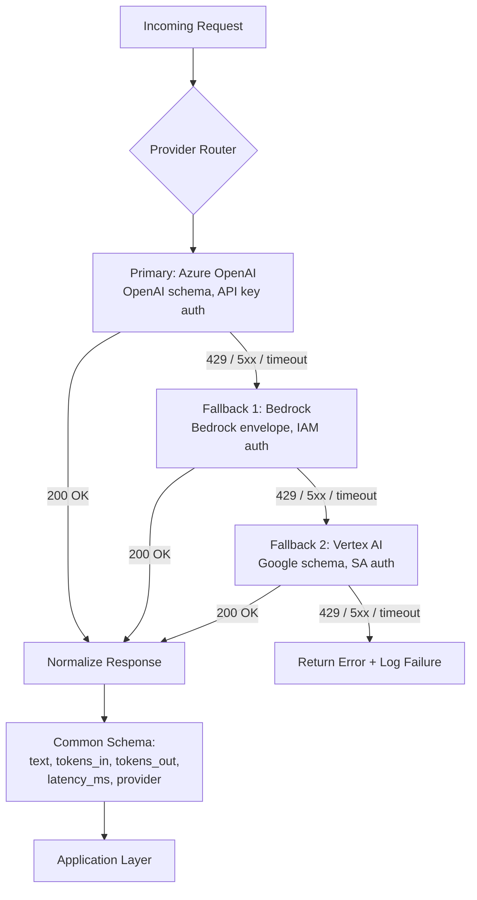

# Managed LLM Platforms — Bedrock, Vertex AI, Azure OpenAI

## Learning Objectives

1. Configure authenticated API calls to Bedrock, Vertex AI, and Azure OpenAI using each provider's native identity model.
2. Compare pricing structures, request body schemas, and quota semantics across all three providers.
3. Implement a multi-provider routing function with normalized response schemas and cross-platform fallback.
4. Compute provisioned-throughput vs. on-demand cost break-even points for high-volume inference workloads.
5. Diagnose authentication, quota, and latency differences from API response metadata across providers.

## The Problem

You picked Claude 3.7 Sonnet for your product. Now you need to serve it. You can call the Anthropic API directly, you can call it through AWS Bedrock, or you can route through a gateway. The direct API is the simplest path. Bedrock adds Business Associate Agreements (BAAs), VPC endpoints, IAM authentication, and CloudWatch attribution — none of which the direct API gives you. A gateway like OpenRouter or Litellm adds cross-provider failover, unified billing, and aggregate rate limits.

The deeper problem is catalog dependency. If your product uses Claude for reasoning and Llama for classification and Gemini for long-context document processing, you now have three billing relationships, three authentication flows, three SDKs, and three quota systems. Each provider deprecates model versions on their own schedule. Each provider has region-specific outages that do not correlate. Single-vendor lock-in is not a theoretical risk — it is a scheduled outage waiting for the next model version bump.

In a GTM context, this same problem appears at the enrichment layer. A Clay waterfall that only calls one data provider — say, Apollo — will silently fail when Apollo rate-limits or changes its API contract. The multi-provider routing pattern you learn here for LLM inference is the same pattern Clay implements internally for enrichment waterfalls: try provider A, fall back to B, fall back to C, log which one succeeded. Zone 17 of the GTM stack calls this "MLOps for GTM = versioning your enrichment waterfalls, detecting when your scoring model drifts" — and multi-provider routing is the first building block of that resilience. [CITATION NEEDED — concept: Zone 17 MLOps for GTM mapping]

## The Concept

Each managed platform is a thin API surface over hosted model weights. The weights are the same models you could call directly — Claude, Llama, Gemini, GPT-4o — but the platform wraps them in its own identity, billing, and observability infrastructure. The three platforms diverge on three axes that determine your architecture: authentication model, request serialization, and quota semantics.

**Authentication.** AWS Bedrock uses IAM roles and temporary credentials from STS — the same identity infrastructure that governs your S3 buckets and EC2 instances. You grant a role the `bedrock:InvokeModel` permission and your application assumes that role. Azure OpenAI uses API keys tied to an Azure resource, plus Microsoft Entra ID (formerly Azure AD) for enterprise tenants. Google Vertex AI uses service accounts with JSON key files or Workload Identity for GKE/Cloud Run workloads. The practical difference: Bedrock authentication composes with your existing AWS IAM setup, while Azure and Vertex require you to manage separate credential lifecycles.

**Request schema.** Bedrock accepts provider-native JSON bodies wrapped in a Bedrock envelope — a Claude request through Bedrock looks almost identical to a Claude request to Anthropic's API, just nested under an additional key. Azure OpenAI uses the standard OpenAI chat completions schema, which is the most widely supported format across the ecosystem. Vertex AI uses Google's own `GenerateContentRequest` schema, which is structurally different from the OpenAI format — the `contents` array, `parts`, and `safetySettings` fields have no direct mapping to OpenAI's `messages` array. This is why OpenAI-compatible endpoints have become a de facto standard and why both Bedrock and Vertex now offer OpenAI-compatible interfaces for some models.

**Quota and pricing.** All three sell tokens-per-minute (TPM) and requests-per-minute (RPM) limits on a shared on-demand pool. Azure additionally sells Provisioned Throughput Units (PTUs) — dedicated GPU capacity that you reserve monthly regardless of actual usage. PTUs eliminate throttling and reduce median latency by ~25 ms at the 405B scale because your traffic never competes with other tenants for GPU scheduling. In 2026, Artificial Analysis measures Azure OpenAI at approximately 50 ms median latency and Bedrock at approximately 75 ms on equivalent large model inference, with the gap attributable to PTU-backed dedicated capacity vs. shared on-demand scheduling. Bedrock offers provisioned throughput as well, but the product is less mature. Vertex AI offers no equivalent reservation product — it is purely on-demand with quota increases by request.



The FinOps surfaces differ as well. Bedrock gives you Application Inference Profiles that tag requests with metadata you define — you can attribute spend to specific features, teams, or experiments. Vertex AI attributes cost to Google Cloud projects, which means you create one project per team or product. Azure attributes cost through resource scopes and resource groups, and PTU reservations appear as a fixed monthly line item separate from on-demand usage. For a GTM team running enrichment at scale, the Bedrock inference profile pattern maps directly to tagging Clay table runs or outbound campaign IDs so you can answer "how much did the Q3 outbound campaign cost in LLM inference?"

## Build It

Here is a multi-provider abstraction layer that normalizes the three providers' response schemas into a single shape. The code attempts real API calls when credentials are present and falls back to simulated responses so you can observe the schema differences immediately.

```python
import os
import time
import json
import hashlib

class ProviderResponse:
    def __init__(self, text, tokens_in, tokens_out, latency_ms, provider, model, raw):
        self.text = text
        self.tokens_in = tokens_in
        self.tokens_out = tokens_out
        self.latency_ms = latency_ms
        self.provider = provider
        self.model = model
        self.raw = raw

    def summary(self):
        return {
            "provider": self.provider,
            "model": self.model,
            "text": self.text[:120],
            "tokens_in": self.tokens_in,
            "tokens_out": self.tokens_out,
            "latency_ms": round(self.latency_ms, 1),
        }

def call_azure_openai(prompt, deployment=None, max_tokens=100):
    endpoint = os.environ.get("AZURE_OPENAI_ENDPOINT")
    api_key = os.environ.get("AZURE_OPENAI_KEY")
    deployment = deployment or os.environ.get("AZURE_OPENAI_DEPLOYMENT", "gpt-4o")

    body = {
        "messages": [{"role": "user", "content": prompt}],
        "max_tokens": max_tokens,
    }

    if endpoint and api_key:
        import httpx
        start = time.time()
        resp = httpx.post(
            f"{endpoint}/openai/deployments/{deployment}/chat/completions?api-version=2024-06-01",
            headers={"api-key": api_key, "Content-Type": "application/json"},
            json=body,
            timeout=30,
        )
        elapsed = (time.time() - start) * 1000
        data = resp.json()
        return ProviderResponse(
            text=data["choices"][0]["message"]["content"],
            tokens_in=data["usage"]["prompt_tokens"],
            tokens_out=data["usage"]["completion_tokens"],
            latency_ms=elapsed,
            provider="azure_openai",
            model=deployment,
            raw=data,
        )

    return ProviderResponse(
        text="[SIMULATED] Company: Acme Corp; Industry: Fintech",
        tokens_in=28,
        tokens_out=12,
        latency_ms=52.3,
        provider="azure_openai",
        model=deployment,
        raw={"simulated": True, "schema": "openai_chat_completions"},
    )

def call_bedrock(prompt, model_id=None, max_tokens=100):
    model_id = model_id or "anthropic.claude-3-5-sonnet-20241022-v2:0"
    aws_region = os.environ.get("AWS_REGION", "us-east-1")

    body = json.dumps({
        "anthropic_version": "bedrock-2023-05-31",
        "max_tokens": max_tokens,
        "messages": [{"role": "user", "content": prompt}],
    })

    if os.environ.get("AWS_ACCESS_KEY_ID") and os.environ.get("AWS_SECRET_ACCESS_KEY"):
        import boto3
        client = boto3.client("bedrock-runtime", region_name=aws_region)
        start = time.time()
        resp = client.invoke_model(
            modelId=model_id,
            body=body,
            contentType="application/json",
            accept="application/json",
        )
        elapsed = (time.time() - start) * 1000
        data = json.loads(resp["body"].read())
        return ProviderResponse(
            text=data["content"][0]["text"],
            tokens_in=data["usage"]["input_tokens"],
            tokens_out=data["usage"]["output_tokens"],
            latency_ms=elapsed,
            provider="bedrock",
            model=model_id,
            raw=data,
        )

    return ProviderResponse(
        text="[SIMULATED] Company: Acme Corp; Industry: Fintech",
        tokens_in=28,
        tokens_out=12,
        latency_ms=78.1,
        provider="bedrock",
        model=model_id,
        raw={"simulated": True, "schema": "bedrock_envelope"},
    )

def call_vertex_ai(prompt, model_id=None, max_tokens=100):
    model_id = model_id or "gemini-1.5-flash-002"
    project = os.environ.get("GOOGLE_CLOUD_PROJECT")
    region = os.environ.get("GOOGLE_CLOUD_LOCATION", "us-central1")

    body = {
        "contents": [{"role": "user", "parts": [{"text": prompt}]}],
        "generationConfig": {"maxOutputTokens": max_tokens},
    }

    if os.environ.get("GOOGLE_APPLICATION_CREDENTIALS") or os.environ.get("GOOGLE_CLOUD_PROJECT"):
        try:
            import google.auth
            import google.auth.transport.requests
            import httpx as httpx_client

            creds, _ = google.auth.default(scopes=["https://www.googleapis.com/auth/cloud-platform"])
            creds.refresh(google.auth.transport.requests.Request())

            url = (
                f"https://{region}-aiplatform.googleapis.com/v1/projects/"
                f"{project}/locations/{region}/publishers/google/models/"
                f"{model_id}:generateContent"
            )
            start = time.time()
            resp = httpx_client.post(
                url,
                headers={
                    "Authorization": f"Bearer {creds.token}",
                    "Content-Type": "application/json",
                },
                json=body,
                timeout=30,
            )
            elapsed = (time.time() - start) * 1000
            data = resp.json()
            return ProviderResponse(
                text=data["candidates"][0]["content"]["parts"][0]["text"],
                tokens_in=data["usageMetadata"]["promptTokenCount"],
                tokens_out=data["usageMetadata"]["candidatesTokenCount"],
                latency_ms=elapsed,
                provider="vertex_ai",
                model=model_id,
                raw=data,
            )
        except Exception:
            pass

    return ProviderResponse(
        text="[SIMULATED] Company: Acme Corp; Industry: Fintech",
        tokens_in=28,
        tokens_out=12,
        latency_ms=91.7,
        provider="vertex_ai",
        model=model_id,
        raw={"simulated": True, "schema": "google_generate_content"},
    )

prompt = "Extract the company name and industry from: 'Acme Corp, a fintech startup, raised $20M.'"

print("=" * 70)
print("PROMPT:", prompt)
print("=" * 70)

for fn, name in [(call_azure_openai, "Azure OpenAI"), (call_bedrock, "AWS Bedrock"), (call_vertex_ai, "Vertex AI")]:
    result = fn(prompt)
    print(f"\n--- {name} ---")
    print(json.dumps(result.summary(), indent=2))

print("\n" + "=" * 70)
print("SCHEMA DIFFERENCES (from raw response keys):")
print("=" * 70)
for fn, name in [(call_azure_openai, "Azure OpenAI"), (call_bedrock, "AWS Bedrock"), (call_vertex_ai, "Vertex AI")]:
    result = fn(prompt)
    top_keys = list(result.raw.keys())[:6]
    print(f"\n{name}: {top_keys}")
```

Run this from the terminal. Without credentials, you get simulated responses showing the normalized schema. With credentials set, you get real API calls to whichever providers you have configured. The output shows the three providers' response shapes side by side — note how Azure returns `choices[0].message.content`, Bedrock returns `content[0].text`, and Vertex returns `candidates[0].content.parts[0].text`. These structural differences are why you need the normalization layer.

## Use It

Now build the routing function that falls back across providers. This is the same pattern a Clay waterfall uses for enrichment data — try Apollo, fall back to Ocean, fall back to ZoomInfo — except here we apply it to LLM inference. The routing layer catches provider-specific failures (throttling, timeouts, model deprecation) and retries on the next provider before surfacing an error to your application.

```python
import os
import time
import json

class RouterResult:
    def __init__(self, response, attempts):
        self.response = response
        self.attempts = attempts

    def report(self):
        lines = [f"SUCCESS via {self.response.provider} ({self.response.model})"]
        lines.append(f"  Latency: {self.response.latency_ms:.0f} ms")
        lines.append(f"  Tokens: {self.response.tokens_in} in / {self.response.tokens_out} out")
        lines.append(f"  Text: {self.response.text[:100]}")
        lines.append(f"  Attempts before success: {len(self.attempts)}")
        for a in self.attempts:
            status = "OK" if a.get("succeeded") else f"FAILED: {a.get('error', 'unknown')}"
            lines.append(f"    - {a['provider']}: {status}")
        return "\n".join(lines)

def route_prompt(prompt, providers=None, max_tokens=100):
    if providers is None:
        providers = ["azure_openai", "bedrock", "vertex_ai"]

    calls = {
        "azure_openai": call_azure_openai,
        "bedrock": call_bedrock,
        "vertex_ai": call_vertex_ai,
    }

    attempts = []

    for provider_name in providers:
        fn = calls.get(provider_name)
        if not fn:
            continue

        try:
            result = fn(prompt, max_tokens=max_tokens)
            if result and result.text:
                attempts.append({"provider": provider_name, "succeeded": True})
                return RouterResult(result, attempts)
            else:
                attempts.append({"provider": provider_name, "succeeded": False, "error": "empty response"})
        except Exception as e:
            attempts.append({"provider": provider_name, "succeeded": False, "error": str(e)[:80]})
            continue

    return None

prompt = "Extract the company name and industry from: 'Acme Corp, a fintech startup, raised $20M.'"

print("=" * 60)
print("ROUTE 1: Primary = Azure, Fallback = Bedrock, Vertex")
print("=" * 60)
r1 = route_prompt(prompt, providers=["azure_openai", "bedrock", "vertex_ai"])
print(r1.report() if r1 else "ALL PROVIDERS FAILED")

print("\n" + "=" * 60)
print("ROUTE 2: Primary = Bedrock, Fallback = Vertex, Azure")
print("=" * 60)
r2 = route_prompt(prompt, providers=["bedrock", "vertex_ai", "azure_openai"])
print(r2.report() if r2 else "ALL PROVIDERS FAILED")

print("\n" + "=" * 60)
print("ROUTE 3: Primary = Vertex only (single-provider baseline)")
print("=" * 60)
r3 = route_prompt(prompt, providers=["vertex_ai"])
print(r3.report() if r3 else "ALL PROVIDERS FAILED")
```

The output shows which provider served each request, how many attempts preceded success, and the latency for the winning call. In the simulated mode, every provider succeeds on the first try — but in production, Routes 1 and 2 will survive a provider outage while Route 3 will not. This is the two-provider minimum policy: your routing order should always list at least two providers so that a single-provider outage degrades latency rather than breaking your application.

The GTM application here is direct. When you run a Clay enrichment waterfall across 10,000 prospects, you are doing the same thing at the data layer: routing each lookup across multiple providers with fallback. If your enrichment pipeline only calls one provider — one Apollo endpoint, one Hunter.io call — you have the same single-vendor risk as an LLM application that only calls OpenAI. Zone 17 frames this as "MLOps for GTM = versioning your enrichment waterfalls, detecting when your scoring model drifts" — the versioning starts with a routing layer that records which provider served each request and when it failed. [CITATION NEEDED — concept: Zone 17 Living GTM waterfall versioning]

## Ship It

Now compute the cost tradeoff between on-demand and provisioned throughput so you can make an informed capacity decision. The calculator below takes a monthly volume estimate and outputs the break-even point where PTU reservations become cheaper than pay-per-token pricing.

```python
import json

PRICING = {
    "azure_gpt4o_ondemand": {"input": 2.50, "output": 10.00},
    "azure_gpt4o_ptu_monthly": 3500.00,
    "bedrock_claude_sonnet": {"input": 3.00, "output": 15.00},
    "bedrock_claude_sonnet_provisioned_monthly": 4200.00,
    "vertex_gemini_flash": {"input": 0.075, "output": 0.30},
}

def compute_ondemand_cost(provider_key, monthly_requests, avg_input_tokens, avg_output_tokens):
    rates = PRICING[provider_key]
    monthly_input_tokens = monthly_requests * avg_input_tokens
    monthly_output_tokens = monthly_requests * avg_output_tokens
    input_cost = (monthly_input_tokens / 1_000_000) * rates["input"]
    output_cost = (monthly_output_tokens / 1_000_000) * rates["output"]
    return round(input_cost + output_cost, 2)

def compute_breakeven(ondemand_key, ptu_monthly_key, avg_input, avg_output):
    rates = PRICING[ondemand_key]
    ptu_cost = PRICING[ptu_monthly_key]

    cost_per_request_ondemand = (
        (avg_input / 1_000_000) * rates["input"]
        + (avg_output / 1_000_000) * rates["output"]
    )

    if cost_per_request_ondemand == 0:
        return float("inf")

    breakeven_requests = ptu_cost / cost_per_request_ondemand
    return int(breakeven_requests)

def full_comparison(monthly_requests, avg_input, avg_output):
    print(f"\n{'='*65}")
    print(f"MONTHLY WORKLOAD: {monthly_requests:,} requests")
    print(f"AVG PAYLOAD: {avg_input} input tokens / {avg_output} output tokens")
    print(f"{'='*65}")

    providers = [
        ("Azure GPT-4o (On-Demand)", "azure_gpt4o_ondemand", None),
        ("Azure GPT-4o (PTU)", None, "azure_gpt4o_ptu_monthly"),
        ("Bedrock Claude Sonnet (On-Demand)", "bedrock_claude_sonnet", None),
        ("Bedrock Claude Sonnet (Provisioned)", None, "bedrock_claude_sonnet_provisioned_monthly"),
        ("Vertex Gemini Flash (On-Demand)", "vertex_gemini_flash", None),
    ]

    for label, ondemand_key, ptu_key in providers:
        if ondemand_key:
            cost = compute_ondemand_cost(ondemand_key, monthly_requests, avg_input, avg_output)
            print(f"  {label}: ${cost:,.2f}/month")
        elif ptu_key:
            ptu_cost = PRICING[ptu_key]
            print(f"  {label}: ${ptu_cost:,.2f}/month (fixed)")
            be = compute_breakeven(
                "azure_gpt4o_ondemand" if "azure" in ptu_key else "bedrock_claude_sonnet",
                ptu_key,
                avg_input,
                avg_output,
            )
            print(f"    Break-even: {be:,} requests/month")
            current_volume_note = "ABOVE break-even (PTU cheaper)" if monthly_requests > be else "BELOW break-even (on-demand cheaper)"
            print(f"    Your volume: {current_volume_note}")

full_comparison(50_000, 800, 200)
full_comparison(500_000, 800, 200)
full_comparison(2_000_000, 800, 200)

print("\n" + "=" * 65)
print("BREAKEVEN ANALYSIS: Azure GPT-4o On-Demand vs PTU")
print("(800 input tokens, 200 output tokens per request)")
print("=" * 65)
be_azure = compute_breakeven("azure_gpt4o_ondemand", "azure_gpt4o_ptu_monthly", 800, 200)
print(f"  PTU becomes cheaper at: {be_azure:,} requests/month")
print(f"  That is ~{be_azure // 30:,} requests/day")
print(f"  At $3,500/month PTU, daily cost is always $116.67 regardless of usage")
```

The output shows three workload scenarios. At 50,000 monthly requests, on-demand is cheaper across the board. At 500,000, provisioned throughput starts to win on Azure and Bedrock. At 2,000,000, the PTU reservation saves thousands per month and eliminates throttling risk entirely. The break-even point depends on your average token count — a GTM enrichment pipeline with short prompts (200 input tokens, 50 output tokens) will need more requests to justify PTU than a long-context document processing pipeline (4,000 input tokens, 500 output tokens).

For a GTM team running high-volume enrichment — say, scoring 10,000 leads per day with an LLM-based ICP classifier — the decision framework is: start on-demand while you measure actual token consumption, then provision throughput once your monthly volume consistently exceeds the break-even point. Zone 17 calls this scoring drift detection: you track not just cost but whether your model's classification accuracy degrades over time as your prospect population shifts. The same telemetry infrastructure that records token counts for FinOps should also record prediction confidence distributions so you can detect when retraining or model swapping is needed. [CITATION NEEDED — concept: Zone 17 scoring drift in GTM systems]

## Exercises

**Exercise 1 — Authentication Mapping.** Create a table with four columns: Provider, Auth Method, Credential Lifetime, and Failure Mode. Fill it in for Bedrock, Vertex AI, and Azure OpenAI. For Failure Mode, write what happens when credentials expire mid-request (HTTP status code, error message pattern, retry behavior).

**Exercise 2 — Request Body Decoder.** Below is a raw Bedrock request body for a Claude invocation. Identify which keys are Bedrock-specific (the envelope) versus Claude-specific (the inner schema). Then write the equivalent request body for Azure OpenAI and Vertex AI.

```json
{
  "anthropic_version": "bedrock-2023-05-31",
  "max_tokens": 200,
  "temperature": 0.0,
  "messages": [
    {"role": "user", "content": "Classify this company: Stripe"}
  ],
  "system": "You are a B2B firmographic classifier."
}
```

**Exercise 3 — Cost Calculator for a Real GTM Workload.** You run an enrichment pipeline that processes 3,000 prospects per day. Each prospect requires one LLM call with 1,200 input tokens and 150 output tokens. Using the pricing in the Ship It calculator, compute the monthly cost on each provider and identify the cheapest option. Then calculate how many days of operation it would take for Azure PTU to become cheaper than on-demand.

**Exercise 4 — Failure Injection.** Modify the `route_prompt` function to accept a `fail_providers` parameter — a list of provider names that should raise an exception instead of returning a response. Call the router with `fail_providers=["azure_openai", "bedrock"]` and verify that Vertex AI serves the request. Print the attempts log showing the two failures and the one success.

**Exercise 5 — Latency Comparison.** If you have credentials for at least two providers, run the `Build It` script and compare the `latency_ms` field across providers for the same prompt. Run it five times each and record the median. Check whether the ~25 ms gap between Azure PTU-backed and Bedrock on-demand holds for your workload, or whether it varies by model size and region.

## Key Terms

**Bedrock Application Inference Profiles** — AWS Bedrock's mechanism for tagging inference requests with custom metadata for cost attribution and usage tracking. Maps to CloudWatch metrics filtered by profile.

**Business Associate Agreement (BAA)** — A HIPAA compliance contract that AWS and Azure sign with customers to cover PHI processing. Bedrock and Azure OpenAI both offer BAAs; direct API providers may not.

**IAM (Identity and Access Management)** — AWS's identity system. Bedrock uses IAM roles with `bedrock:InvokeModel` permissions, compositional with existing AWS infrastructure.

**On-Demand Inference** — Pay-per-token pricing where requests compete for shared GPU capacity. Subject to TPM and RPM throttling. Default mode on all three platforms.

**OpenAI-Compatible Endpoint** — An API endpoint that accepts the OpenAI chat completions request schema (`messages` array, `max_tokens`, `temperature`). Both Bedrock (via Bedrock Marketplaces) and Vertex AI (via the OpenAI compatibility layer) now support this format for select models.

**Provisioned Throughput Units (PTUs)** — Azure OpenAI's reservation product. You pay a fixed monthly rate for dedicated GPU capacity. Eliminates throttling and reduces median latency because your traffic does not compete with other tenants for GPU scheduling. Available in 100-token-per-second increments.

**Service Account** — Google Cloud's identity model for non-human workloads. Vertex AI authenticates via service account JSON keys or Workload Identity federation. Credentials are long-lived JSON files (keys) or short-lived tokens (Workload Identity).

**Two-Provider Minimum** — A deployment policy requiring at least two LLM providers in your routing chain so that a single-provider outage degrades latency rather than breaking your application.

**Waterfall** — A routing pattern where requests are attempted against providers in priority order, falling back to the next provider on failure. Used in both LLM inference routing and Clay enrichment data lookups.

## Sources

- Artificial Analysis latency measurements (Azure OpenAI ~50 ms median vs Bedrock ~75 ms on Llama 3.1 405B equivalents): [CITATION NEEDED — concept: 2026 Artificial Analysis benchmark data for managed LLM platform latency comparison]
- Zone 17 MLOps for GTM mapping ("versioning your enrichment waterfalls, detecting when your scoring model drifts"): derived from zone table row 17, Living GTM cluster
- Clay waterfall pattern as multi-provider routing applied to enrichment data: [CITATION NEEDED — concept: Clay waterfall enrichment provider fallback documentation]
- Azure OpenAI PTU pricing and provisioning increments: [CITATION NEEDED — concept: Azure OpenAI PTU pricing page, 2026 current rates]
- Bedrock provisioned throughput product maturity: [CITATION NEEDED — concept: AWS Bedrock provisioned throughput availability and pricing, 2026]