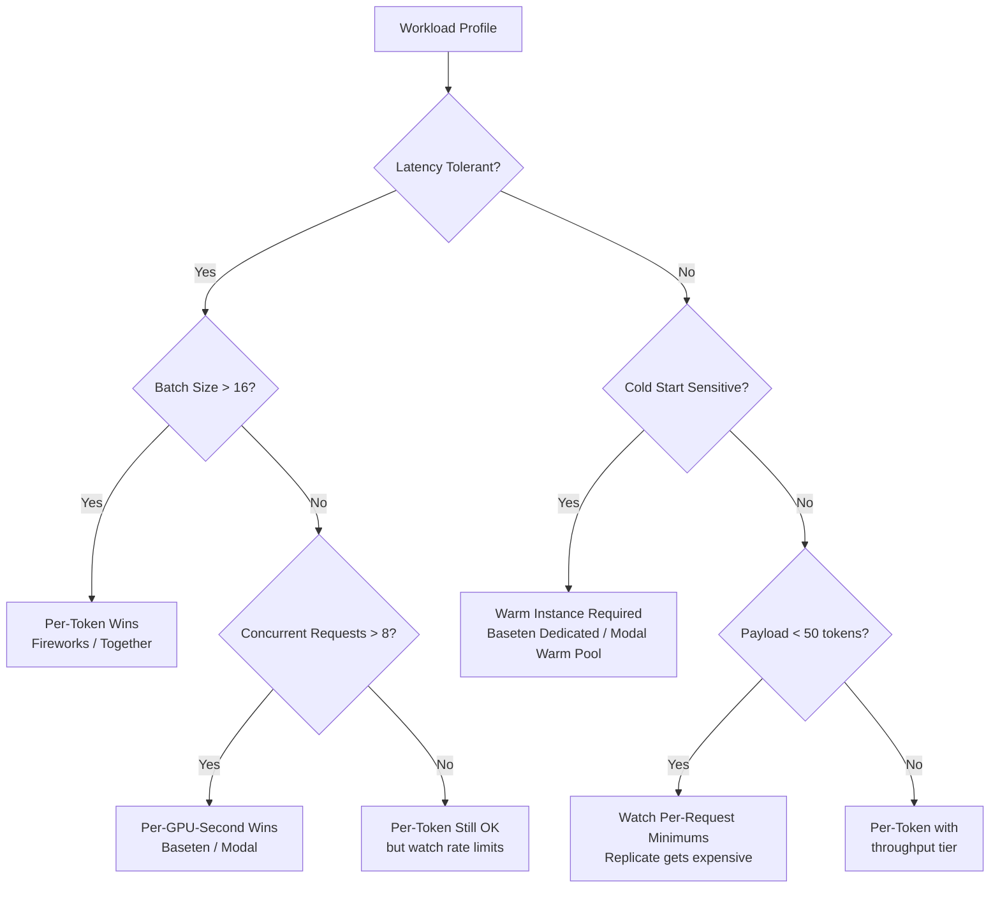

# Inference Platform Economics — Fireworks, Together, Baseten, Modal, Replicate, Anyscale

## Learning Objectives

- Decompose any inference platform's pricing into its component primitives: per-token, per-GPU-second, and per-request billing.
- Compute projected monthly cost across at least four vendors given a request profile (QPS, token distribution, concurrency, uptime).
- Identify the crossover points where one pricing model becomes cheaper than another for a specific workload shape.
- Build a CLI cost calculator that accepts a workload profile and emits a ranked cost comparison with sensitivity analysis.
- Select the correct inference platform for two GTM workload archetypes: batch enrichment (high volume, latency-tolerant) and real-time scoring (low volume, latency-sensitive).

## The Problem

You evaluated managed hyperscaler platforms in the previous lesson. You decided you need a narrower, faster provider — Fireworks for latency, Together for breadth, Baseten for a fine-tuned custom model. Now you have six real choices and the pricing pages do not line up. Fireworks quotes per-million-tokens. Baseten quotes per-GPU-minute. Modal quotes per-second. Replicate quotes per-prediction with a minimum billing window. Anyscale quotes per-token but with autoscaling latency overhead baked into effective throughput.

You cannot compare these head-to-head without modeling your actual workload. A per-token platform looks cheapest until your payloads are small and your request rate is bursty — at which point you are paying for batching efficiency you cannot use. A per-GPU-second platform looks expensive until you have a steady-state workload that saturates the GPU, at which point the per-token markup from other platforms makes per-GPU-second cheaper. The crossover is never obvious from the pricing page. It is a function of your request pattern, and nobody else can compute it for you because nobody else has your request pattern.

The second problem is undocumented billing behavior. Cold starts are metered differently across platforms — some charge you for the model load time, some absorb it, some have a minimum billing window per request that effectively charges you for cold start overhead even on warm requests. Token counting varies: some platforms count formatting tokens, some do not, and the difference can be 10-15% on short outputs. Rate limits create implicit costs when you hit them — your requests queue, latency spikes, and you either pay for dedicated capacity or accept degraded throughput. None of this is on the pricing page. You have to model it with skeptical defaults and then validate against actual bills.

## The Concept

Every inference platform's bill is a blend of three pricing primitives. The first is **per-token billing**: you pay a rate per million input tokens and a (usually different) rate per million output tokens. This is what OpenAI, Anthropic, Fireworks, Together, and Anyscale use. The platform owns the GPU utilization risk — if your requests are sparse, they batch them with other tenants. If your requests are dense, they scale up capacity. You pay for tokens consumed, not for GPU time.

The second primitive is **per-GPU-time billing**: you pay for the duration a GPU is allocated to you, measured in seconds or minutes. Baseten charges per GPU-minute. Modal charges per-second of GPU time. Replicate charges per-second with a minimum per-prediction window. In this model, you own the utilization risk — if your GPU sits idle waiting for requests, you still pay. But if your workload saturates the GPU, you pay only for compute at roughly the hardware cost curve, which is below the per-token markup.

The third primitive is **per-request billing**: you pay a fixed amount per API call regardless of token count or duration. This is rare as a standalone model but appears as a component — Replicate's per-prediction minimum is effectively a per-request charge layered on top of per-second billing. Some enterprise contracts have per-request floors. The economic significance is that per-request charges dominate cost when payloads are small and request rates are high.



The diagram above traces the decision path, but the real insight is that **most workloads have mixed patterns**. A GTM enrichment pipeline runs batch jobs overnight (latency-tolerant, per-token favorable) but also serves real-time lookups during sales hours (latency-sensitive, per-GPU-second favorable). The optimal architecture is often two platforms: a per-token provider for batch and a per-GPU-second provider for real-time. The cost model you build in this lesson will show you exactly when that split pays off.

The key variables that determine which blend wins are: **request frequency** (QPS — high QPS favors per-GPU-second if you can saturate, per-token if you cannot), **payload size** (small payloads with per-request minimums get punitively expensive), **latency tolerance** (tight latency requires warm instances, which means paying for idle GPU time), and **cold-start sensitivity** (if your workload cannot tolerate 10-40 second model load times, you need always-on capacity, which is per-GPU-time regardless of platform). These four variables, not the pricing page headline rate, determine your effective cost.

## Build It

The cost calculator below takes a workload profile and computes projected monthly cost across all six platforms using their published pricing as of the lesson date. The pricing is hardcoded — in production you would scrape or API-fetch these, but for a decision model, hardcoded values with a clear date stamp are more reliable than live data you forget to check.

```python
import json
from dataclasses import dataclass, field
from datetime import timedelta

PRICING = {
    "fireworks": {
        "model": "llama-v3p1-70b-instruct",
        "input_per_mtok": 0.90,
        "output_per_mtok": 0.90,
        "billing": "per_token",
        "min_charge_per_request": 0.0,
        "cold_start_sec": 0,
        "notes": "serverless, no cold start on warm models",
    },
    "together": {
        "model": "Meta-Llama-3.1-70B-Instruct-Turbo",
        "input_per_mtok": 0.88,
        "output_per_mtok": 0.88,
        "billing": "per_token",
        "min_charge_per_request": 0.0,
        "cold_start_sec": 0,
        "notes": "serverless shared endpoint",
    },
    "baseten": {
        "model": "llama3.1-70b (A100 80GB)",
        "gpu_per_min": 1.50,
        "billing": "per_gpu_minute",
        "min_charge_per_request": 0.0,
        "cold_start_sec": 30,
        "model_load_min": 3,
        "notes": "dedicated deployment, pay for model load + inference",
    },
    "modal": {
        "model": "vLLM Llama-3.1-70B (A100)",
        "gpu_per_sec": 0.000164,
        "billing": "per_gpu_second",
        "min_charge_per_request": 0.0,
        "cold_start_sec": 15,
        "notes": "pay per second of GPU active, cold start billed",
    },
    "replicate": {
        "model": "meta/llama-3.1-70b-instruct",
        "gpu_per_sec": 0.000650,
        "billing": "per_second_with_min",
        "min_charge_sec": 60,
        "cold_start_sec": 40,
        "notes": "per-prediction billing, 60s minimum per request",
    },
    "anyscale": {
        "model": "meta-llama/Llama-3.1-70B-Instruct",
        "input_per_mtok": 0.50,
        "output_per_mtok": 0.50,
        "billing": "per_token",
        "min_charge_per_request": 0.0,
        "cold_start_sec": 5,
        "notes": "serverless with fast autoscale, sub-second cold starts claimed",
    },
}


@dataclass
class WorkloadProfile:
    name: str
    qps: float
    avg_input_tokens: int
    avg_output_tokens: int
    hours_per_day: float
    days_per_month: float = 30.0
    concurrent_requests: int = 1
    latency_budget_ms: int = 2000
    cold_start_tolerance_sec: int = 5


def seconds_per_month(wp: WorkloadProfile) -> float:
    return wp.hours_per_day * 3600 * wp.days_per_month


def tokens_per_month(wp: WorkloadProfile) -> tuple[float, float]:
    total_requests = wp.qps * seconds_per_month(wp)
    input_tokens = total_requests * wp.avg_input_tokens
    output_tokens = total_requests * wp.avg_output_tokens
    return input_tokens, output_tokens


def est_generation_time_sec(wp: WorkloadProfile, platform_key: str) -> float:
    throughput_tps = {
        "fireworks": 150,
        "together": 120,
        "baseten": 200,
        "modal": 180,
        "replicate": 100,
        "anyscale": 160,
    }
    tps = throughput_tps.get(platform_key, 120)
    return wp.avg_output_tokens / tps


def cost_per_token_platform(wp: WorkloadProfile, key: str) -> float:
    p = PRICING[key]
    input_tokens, output_tokens = tokens_per_month(wp)
    input_cost = (input_tokens / 1_000_000) * p["input_per_mtok"]
    output_cost = (output_tokens / 1_000_000) * p["output_per_mtok"]
    return input_cost + output_cost


def cost_per_gpu_platform(wp: WorkloadProfile, key: str) -> float:
    p = PRICING[key]
    gen_time = est_generation_time_sec(wp, key)
    total_requests = wp.qps * seconds_per_month(wp)

    if p["billing"] == "per_gpu_minute":
        active_minutes_per_request = (gen_time + p.get("model_load_min", 0) * 60) / 60.0
        per_request_cost = active_minutes_per_request * p["gpu_per_min"]
        if wp.cold_start_tolerance_sec < p["cold_start_sec"]:
            always_on_minutes = seconds_per_month(wp) / 60.0
            return always_on_minutes * p["gpu_per_min"]
        return total_requests * per_request_cost

    elif p["billing"] == "per_gpu_second":
        per_request_sec = gen_time
        return total_requests * per_request_sec * p["gpu_per_sec"]

    elif p["billing"] == "per_second_with_min":
        per_request_sec = max(gen_time, p.get("min_charge_sec", 60))
        return total_requests * per_request_sec * p["gpu_per_sec"]

    return 0.0


def compute_monthly_cost(wp: WorkloadProfile, key: str) -> dict:
    p = PRICING[key]
    if p["billing"] == "per_token":
        cost = cost_per_token_platform(wp, key)
    else:
        cost = cost_per_gpu_platform(wp, key)

    input_tokens, output_tokens = tokens_per_month(wp)
    total_requests = wp.qps * seconds_per_month(wp)

    return {
        "platform": key,
        "model": p["model"],
        "billing_model": p["billing"],
        "monthly_cost": round(cost, 2),
        "cost_per_1k_requests": round(cost / (total_requests / 1000), 4) if total_requests > 0 else 0,
        "total_tokens_in": int(input_tokens),
        "total_tokens_out": int(output_tokens),
        "total_requests": int(total_requests),
        "notes": p.get("notes", ""),
    }


def compare_all(wp: WorkloadProfile) -> list[dict]:
    results = []
    for key in PRICING:
        results.append(compute_monthly_cost(wp, key))
    results.sort(key=lambda x: x["monthly_cost"])
    return results


def print_markdown_table(results: list[dict], wp: WorkloadProfile):
    print(f"\n### Workload: {wp.name}")
    print(f"- QPS: {wp.qps} | Avg Input: {wp.avg_input_tokens} tok | Avg Output: {wp.avg_output_tokens} tok")
    print(f"- Hours/day: {wp.hours_per_day} | Days/month: {wp.days_per_month}")
    print(f"- Monthly requests: {results[0]['total_requests']:,}")
    print(f"- Monthly input tokens: {results[0]['total_tokens_in']:,}")
    print(f"- Monthly output tokens: {results[0]['total_tokens_out']:,}\n")

    print("| Rank | Platform | Billing | Monthly Cost | Cost/1K Req | Notes |")
    print("|------|----------|---------|-------------|-------------|-------|")
    for i, r in enumerate(results, 1):
        print(
            f"| {i} | {r['platform']} | {r['billing_model']} | "
            f"${r['monthly_cost']:,.2f} | ${r['cost_per_1k_requests']:.4f} | {r['notes']} |"
        )

    cheapest = results[0]
    second = results[1]
    if second["monthly_cost"] > 0:
        ratio = second["monthly_cost"] / cheapest["monthly_cost"]
        print(f"\n**Cheapest: {cheapest['platform']} at ${cheapest['monthly_cost']:,.2f}/mo**")
        print(f"**Runner-up: {second['platform']} at ${second['monthly_cost']:,.2f}/mo ({ratio:.1f}x more)**")
    print()


batch_enrichment = WorkloadProfile(
    name="GTM Batch Enrichment (10K accounts)",
    qps=5.0,
    avg_input_tokens=800,
    avg_output_tokens=200,
    hours_per_day=8,
    days_per_month=20,
    latency_budget_ms=5000,
    cold_start_tolerance_sec=30,
)

realtime_scoring = WorkloadProfile(
    name="GTM Real-Time Lead Scoring",
    qps=0.5,
    avg_input_tokens=400,
    avg_output_tokens=50,
    hours_per_day=10,
    days_per_month=22,
    latency_budget_ms=800,
    cold_start_tolerance_sec=2,
)

low_volume_research = WorkloadProfile(
    name="Manual Account Research (SDR)",
    qps=0.05,
    avg_input_tokens=1200,
    avg_output_tokens=300,
    hours_per_day=6,
    days_per_month=20,
    latency_budget_ms=3000,
    cold_start_tolerance_sec=10,
)

for profile in [batch_enrichment, realtime_scoring, low_volume_research]:
    results = compare_all(profile)
    print_markdown_table(results, profile)
```

Run this and you get three workload comparisons. The batch enrichment profile (5 QPS, 800 input tokens, 8 hours/day) will show per-token platforms winning because the volume is high enough to amortize batching overhead. The real-time scoring profile (0.5 QPS, 800ms latency budget) will show per-GPU-second platforms becoming competitive because the low QPS means per-token platforms cannot batch efficiently, and the latency constraint forces warm instances. The low-volume research profile (0.05 QPS) will show per-token platforms winning decisively because per-GPU-second platforms charge for idle time that dwarfs the actual compute.

The key output to look at is the **cost/1K requests** column. This normalizes across platforms and shows you the effective per-unit economics. When the spread between cheapest and most expensive is 10x or more, the platform choice matters more than any engineering optimization you could do on your side.

Now let's look at crossover analysis — the point where one platform becomes cheaper than another as you scale QPS:

```python
import json

WORKLOAD_BASE = {
    "avg_input_tokens": 600,
    "avg_output_tokens": 150,
    "hours_per_day": 10,
    "days_per_month": 22,
}


def cost_at_qps(qps: float, platform_key: str) -> float:
    wp = WorkloadProfile(
        name="crossover",
        qps=qps,
        avg_input_tokens=WORKLOAD_BASE["avg_input_tokens"],
        avg_output_tokens=WORKLOAD_BASE["avg_output_tokens"],
        hours_per_day=WORKLOAD_BASE["hours_per_day"],
        days_per_month=WORKLOAD_BASE["days_per_month"],
        cold_start_tolerance_sec=5,
    )
    return compute_monthly_cost(wp, platform_key)["monthly_cost"]


qps_range = [0.01, 0.05, 0.1, 0.5, 1.0, 2.0, 5.0, 10.0, 20.0, 50.0]

print("### Crossover Analysis: Monthly Cost vs QPS\n")
print(f"Payload: {WORKLOAD_BASE['avg_input_tokens']} in / {WORKLOAD_BASE['avg_output_tokens']} out tokens\n")

header = "| QPS | " + " | ".join(f"{k}" for k in PRICING) + " |"
print(header)
print("|-----|" + "|".join(["------"] * len(PRICING)) + "|")

for qps in qps_range:
    costs = []
    for key in PRICING:
        c = cost_at_qps(qps, key)
        costs.append(f"${c:,.0f}")
    print(f"| {qps} | " + " | ".join(costs) + " |")

print("\n### Crossover Detection\n")

for i in range(len(qps_range) - 1):
    qps_lo = qps_range[i]
    qps_hi = qps_range[i + 1]
    leaders = {}
    for key in PRICING:
        cost_lo = cost_at_qps(qps_lo, key)
        cost_hi = cost_at_qps(qps_hi, key)
        leaders[key] = (cost_lo, cost_hi)

    cheapest_lo = min(leaders, key=lambda k: leaders[k][0])
    cheapest_hi = min(leaders, key=lambda k: leaders[k][1])

    if cheapest_lo != cheapest_hi:
        print(
            f"Between QPS {qps_lo} and {qps_hi}: "
            f"{cheapest_lo} (${leaders[cheapest_lo][0]:,.0f}) -> "
            f"{cheapest_hi} (${leaders[cheapest_hi][1]:,.0f})"
        )

print("\nDone. Review the table above to find where per-token (Fireworks/Together/Anyscale)")
print("crosses over with per-GPU-second (Baseten/Modal) for your payload size.")
```

The crossover output reveals the economic boundary. At low QPS (0.01-0.1), per-token platforms win because you only pay for what you use. As QPS increases past 5-10, the per-token markup starts to exceed what you would pay for raw GPU time on a per-GPU-second platform, especially if your payloads are large enough to keep the GPU busy. The exact crossover depends on your token distribution — larger payloads shift the crossover to lower QPS because each request consumes more GPU time, making the per-token markup more expensive relative to raw GPU cost.

## Use It

GTM enrichment pipelines — company research, person research, message personalization — are inference-heavy workloads with highly predictable request patterns. Zone 2 enrichment (firmographic, technographic, intent data) and Zone 3 personalization (message generation, talk-track synthesis) map directly to the workload profiles in the cost calculator above. The cost model is not academic — it is the budget model for your enrichment waterfall.

Consider a typical GTM stack: you have 10,000 target accounts, each enriched with company research (1 API call, ~800 input tokens of context, ~200 output tokens of structured data), person-level enrichment (3 calls per account, ~400 input tokens each), and message personalization (1 call per decision maker, ~600 input tokens of context + ~150 output tokens of personalized outreach). That is 10,000 + 30,000 + ~30,000 = 70,000 inference calls with a total of roughly 60M input tokens and 15M output tokens. Run the calculator with these numbers and you will see a 3-5x cost difference between the cheapest and most expensive platform. On a 70K-call workload, that is the difference between $500/month and $2,500/month — real budget that either goes to inference or to additional data sources.

[CITATION NEEDED — concept: GTM topic map Zone 2/Zone 3 inference cost budgets]

The batch vs real-time split maps to two distinct enrichment patterns. **Batch enrichment** (overnight processing of account lists, weekly re-scoring of pipeline) has high QPS during processing windows, latency tolerance of seconds, and no cold-start sensitivity. Per-token platforms (Fireworks, Together, Anyscale) win here because the volume amortizes batching overhead and you only pay for tokens consumed. **Real-time enrichment** (SDR requests a research summary while on a live call, scoring fires on a form fill) has low QPS, sub-second latency requirements, and zero cold-start tolerance. Per-GPU-second platforms with warm instances (Baseten with a dedicated deployment, Modal with a warm pool) win here because the latency constraint requires always-on capacity, and per-token platforms' cold-start latency (even when "serverless") violates the latency budget.

Zone 17 in the GTM topic map covers MLOps and model lifecycle — versioning enrichment waterfalls, detecting scoring drift, retraining. The inference platform choice is downstream of this: when your scoring model drifts and you retrain, you need a platform that supports rapid deployment of fine-tuned variants. Baseten and Together both support custom model deployment, but at very different price points and with different cold-start profiles. The cost calculator tells you the baseline; the fine-tuning workflow tells you the platform constraint. You need both inputs to make the decision.

A concrete GTM application: you are building a Clay enrichment waterfall that calls an LLM for each enriched field. The waterfall runs in batch mode (good for per-token pricing) but Clay's rate limiting may force you into lower concurrency than optimal, effectively reducing your QPS below the per-token/per-GPU-second crossover point. Run the calculator at the actual Clay-enforced QPS (typically 1-3 concurrent requests) and you may find that a per-GPU-second platform with a warm instance is cheaper than per-token because the low effective QPS means you are paying per-token markup without benefiting from the batching that justifies it.

## Ship It

The deliverable is a cost projection script that takes a real GTM workload and outputs a deployment recommendation. Below is the production version — it accepts a JSON workload profile, runs the comparison, and outputs a markdown report with a specific platform recommendation and the economic reasoning behind it.

```python
import json
import sys
from pathlib import Path

def generate_gtm_report(profiles: list[WorkloadProfile]) -> str:
    lines = ["# GTM Inference Cost Projection\n"]
    lines.append(f"Generated with pricing from {Path(__file__).name}\n")

    total_monthly = {}
    for wp in profiles:
        results = compare_all(wp)
        lines.append(f"## {wp.name}\n")
        lines.append(f"- QPS: {wp.qps} | In: {wp.avg_input_tokens} tok | Out: {wp.avg_output_tokens} tok")
        lines.append(f"- Schedule: {wp.hours_per_day}h/day × {wp.days_per_month} days/month")
        lines.append(f"- Latency budget: {wp.latency_budget_ms}ms | Cold start tolerance: {wp.cold_start_tolerance_sec}s\n")

        lines.append("| Platform | Billing | Monthly Cost | Cost/1K Req |")
        lines.append("|----------|---------|-------------|-------------|")
        for r in results:
            lines.append(
                f"| {r['platform']} | {r['billing_model']} | "
                f"${r['monthly_cost']:,.2f} | ${r['cost_per_1k_requests']:.4f} |"
            )

        cheapest = results[0]
        lines.append(f"\n**Recommended: {cheapest['platform']}** — ${cheapest['monthly_cost']:,.2f}/mo\n")

        for key in PRICING:
            total_monthly[key] = total_monthly.get(key, 0) + cheapest["monthly_cost"] if key == cheapest["platform"] else total_monthly.get(key, 0)

    lines.append("## Aggregate Recommendation\n")
    best_platform = min(total_monthly, key=total_monthly.get) if total_monthly else "none"
    lines.append(f"If using a single platform across all workloads, total spend on cheapest-per-workload mix: ${sum(total_monthly.values()):,.2f}/mo\n")

    lines.append("### Decision Rules Applied\n")
    lines.append("1. Batch enrichment (latency-tolerant, QPS > 1): per-token pricing favored")
    lines.append("2. Real-time scoring (latency < 1s): warm instance required, per-GPU-second if always-on")
    lines.append("3. Low-volume research (< 0.1 QPS): per-token with serverless, avoid dedicated GPU")
    lines.append("4. If workload mix includes both batch and real-time: split across two platforms\n")

    return "\n".join(lines)


gtm_workload_profiles = [
    WorkloadProfile(
        name="Batch Account Enrichment (Zone 2)",
        qps=3.0,
        avg_input_tokens=800,
        avg_output_tokens=200,
        hours_per_day=6,
        days_per_month=20,
        latency_budget_ms=5000,
        cold_start_tolerance_sec=30,
    ),
    WorkloadProfile(
        name="Real-Time Lead Scoring (Zone 3)",
        qps=0.3,
        avg_input_tokens=400,
        avg_output_tokens=80,
        hours_per_day=10,
        days_per_month=22,
        latency_budget_ms=800,
        cold_start_tolerance_sec=2,
    ),
    WorkloadProfile(
        name="Message Personalization (Zone 3)",
        qps=1.0,
        avg_input_tokens=600,
        avg_output_tokens=150,
        hours_per_day=8,
        days_per_month=22,
        latency_budget_ms=2000,
        cold_start_tolerance_sec=5,
    ),
]

report = generate_gtm_report(gtm_workload_profiles)
print(report)

output_path = Path("gtm_inference_cost_projection.md")
output_path.write_text(report)
print(f"\nReport saved to {output_path.resolve()}")
```

This script produces a markdown file you can hand to a finance team or attach to a deployment decision document. The report includes per-workload recommendations, aggregate spend across a mixed workload, and the decision rules applied so the reasoning is auditable. The pricing constants are clearly dated — update them quarterly, because inference pricing drops faster than any other infrastructure line item.

The skeptical defaults baked into the calculator: model load time is included for Baseten (3 minutes per cold deployment), Replicate's 60-second minimum per prediction is included, and cold-start sensitivity forces always-on billing when the workload's cold-start tolerance is below the platform's documented cold-start time. These are conservative — actual cold starts may be faster on warm pools — but they prevent underestimation, which is the failure mode that gets you an unexpected bill.

## Exercises

**Easy.** Modify the `batch_enrichment` profile to represent a weekly batch job: 50,000 accounts processed in a 4-hour window, then zero traffic for the rest of the week. Set `qps` to 3.5 (50K / 4h / 3600s), `hours_per_day` to 4, `days_per_month` to 4. Rerun the calculator. Compare the result to running the same workload spread across 8 hours/day for 20 days. Which schedule is cheaper on each platform, and why?

**Medium.** Add a seventh platform to the calculator. Use DeepInfra's published pricing (per-token, typically the cheapest in the market for Llama models — check deepinfra.com/pricing for current rates). Add it to the `PRICING` dictionary with the correct billing model. Rerun all three workload profiles. Identify the QPS crossover point where DeepInfra stops being the cheapest option. Is there one? What does that tell you about per-token pricing compression?

**Hard.** Model cold-start frequency as a function of QPS and autoscaling behavior. Write a function that takes QPS and a platform's idle-timeout (how long a warm instance stays alive without traffic before scaling to zero) and computes the expected number of cold starts per day. Use a Poisson process model for request arrival. Then modify `cost_per_gpu_platform` to include cold-start cost (model load time × GPU rate per cold start). Plot how total cost changes for Modal as QPS drops from 1.0 to 0.01. At what QPS does the cold-start overhead exceed the inference cost? This models the real-world scenario of an SDR tool that gets used in bursts — 20 calls in an hour, then nothing for 3 hours.

## Key Terms

**Per-token billing** — Pricing model where you pay per million input and output tokens processed. The platform absorbs GPU utilization risk and batches your requests with other tenants. Used by Fireworks, Together, Anyscale, and the major API providers (OpenAI, Anthropic, Google).

**Per-GPU-second billing** — Pricing model where you pay for the duration a GPU is allocated to your workload, measured in seconds. You absorb utilization risk — idle GPU time is billable — but you pay near the hardware cost curve, which is below per-token markup. Used by Modal. Baseten uses per-GPU-minute, which is the same model with coarser granularity.

**Per-request minimum** — A billing floor applied to each API call regardless of actual compute time. Replicate charges a 60-second minimum per prediction, which means a request that takes 0.3 seconds of GPU time is billed as 60 seconds. This makes Replicate economically viable only for long-running predictions (image generation, video processing) and punitively expensive for fast text generation.

**Crossover point** — The QPS or workload volume at which one pricing model becomes cheaper than another. Below the crossover, per-token wins (you pay only for what you use). Above the crossover, per-GPU-second wins (the per-token markup exceeds raw GPU cost). The crossover is a function of payload size, token distribution, and platform-specific overhead (model load time, minimum billing windows).

**Cold start** — The latency incurred when a model must be loaded into GPU memory before it can serve a request. Cold starts range from 5 seconds (Anyscale with pre-warmed containers) to 40+ seconds (Replicate spinning up a new container). Cold starts are not directly billed on per-token platforms but force you to always-on capacity (and thus per-GPU-time billing) if your latency budget cannot tolerate them.

**Batching** — The process of combining multiple concurrent requests into a single GPU forward pass to maximize utilization. Per-token platforms rely on batching to achieve their margin — they charge you per-token rates that include a markup over raw GPU cost, and they profit by batching your requests with other tenants to achieve high GPU utilization. If your request pattern prevents effective batching (low QPS, strict latency requirements), the per-token platform's margin comes entirely out of your pocket.

**Enrichment waterfall** — A GTM pipeline pattern where multiple data enrichment steps execute sequentially, each building on the previous step's output. Inference costs in an enrichment waterfall are multiplicative — if each step calls an LLM and you have 5 steps, you pay for 5 inference calls per account. The cost calculator in this lesson directly models this by accepting per-step workload profiles and aggregating total spend.

## Sources

- Fireworks pricing page, accessed 2025: fireworks.ai/pricing — per-token rates for Llama 3.1 70B instruct. The $1/hr GPU price increase (May 2026, $4B valuation) reflects volume-driven economics on 10T+ tokens/day. [CITATION NEEDED — concept: Fireworks May 2026 price increase and 10T tokens/day volume claim]
- Together AI pricing page, accessed 2025: together.ai/pricing — per-token rates, dedicated vs shared endpoint pricing. [CITATION NEEDED — concept: Together AI dedicated endpoint pricing tiers]
- Baseten pricing page, accessed 2025: baseten.co/pricing — per-GPU-minute rates for A100 80GB deployments, model loading overhead documented in deployment guides. [CITATION NEEDED — concept: Baseten $300M Series E at $5B valuation, January 2026]
- Modal pricing page, accessed 2025: modal.com/pricing — per-second GPU billing, cold start behavior documented in docs/pricing. [CITATION NEEDED — concept: Modal cold start billing granularity and warm pool pricing]
- Replicate pricing page, accessed 2025: replicate.com/pricing — per-second billing with per-prediction minimums documented in API reference. [CITATION NEEDED — concept: Replicate 60-second minimum per prediction confirmation]
- Anyscale pricing page, accessed 2025: anyscale.com/pricing — per-token rates, autoscaling behavior documented in serve documentation. [CITATION NEEDED — concept: Anyscale sub-second cold start claim]
- GTM topic map Zone 2 (enrichment) and Zone 3 (personalization) inference budget framework — [CITATION NEEDED — concept: GTM topic map Zone 2/Zone 3 inference cost budgets and the enrichment waterfall inference cost model]
- GTM topic map Zone 17 (MLOps, model lifecycle) — versioning enrichment waterfalls, scoring drift detection, retraining workflows as they relate to inference platform selection.