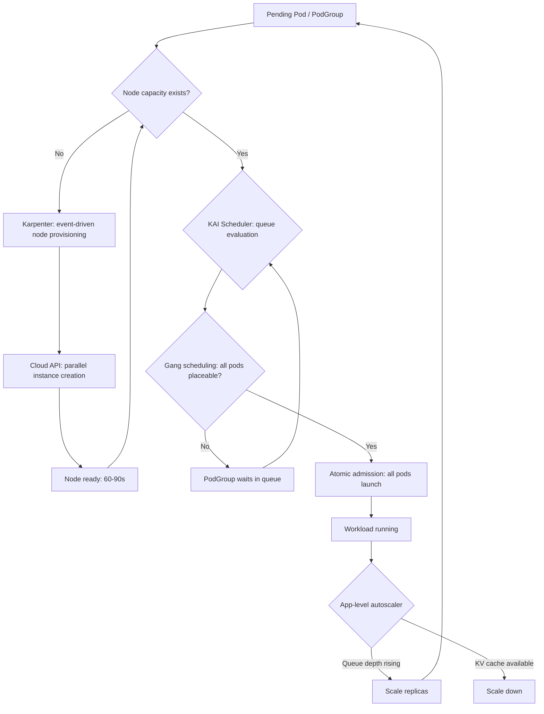

# GPU Autoscaling on Kubernetes — Karpenter, KAI Scheduler, Gang Scheduling

## Learning Objectives

- Diagram the three autoscaling layers (node provisioning, gang scheduling, application-level) and name the mechanism at each layer.
- Explain why `DCGM_FI_DEV_GPU_UTIL` produces false-positive saturation readings for vLLM workloads and name two replacement signals.
- Trace a gang scheduling admission decision given a partial allocation scenario and compute the idle-cost penalty.
- Compare poll-based provisioning latency against event-driven provisioning and quantify the gap in node-ready time.
- Configure Karpenter consolidation policy to avoid terminating running inference pods.

## The Problem

Your team ships an LLM-serving service on Kubernetes. You wire up HPA with `DCGM_FI_DEV_GPU_UTIL` as the scale signal. During business hours, every replica reports 100% utilization. HPA interprets this as "fully scaled" and does nothing. Meanwhile, p99 time-to-first-token climbs from 400ms to 2.1s. You manually add a replica and TTFT drops back. HPA still does not react. The signal is lying to you.

Meanwhile, a distributed training job requests 8 GPU workers. Six pods schedule on available nodes. Two remain pending because no node has a free GPU. The six launched pods allocate CUDA memory and block, waiting for their peers that will never arrive. Those six GPUs are now held hostage — billing at A100 rates, doing zero useful work — until someone notices and kills the job.

The cluster itself is also slow to react. A new inference deployment needs one more GPU node. Cluster Autoscaler polls every 10 seconds, detects the pending pod, calls the cloud provider's instance API, waits for the image to pull, and eventually reports node-ready. Total wall clock: 8–12 minutes. For a workload that processes a burst of requests lasting 20 minutes, you have spent 40–60% of the timeline waiting for infrastructure. GPU idle time is not a rounding error — it is the dominant cost driver in inference infrastructure.

## The Concept

**Layer 1: Node provisioning latency.** The default Kubernetes scheduler finds an existing node that fits a pod. It does not create nodes. Cluster Autoscaler fills that gap, but its design is poll-based: a control loop checks for pending pods every 10 seconds, then calls cloud provider APIs sequentially. Cloud GPU instances take 5–10 minutes to provision through standard APIs, and image pulls for GPU container images (often 8–15 GB) add more delay. Karpenter inverts the polling model. It registers as a controller that watches the Kubernetes API server directly for unschedulable pods — no polling interval. When it sees a pending pod, it evaluates provisioning constraints and calls instance APIs in parallel, often achieving node-ready in 60–90 seconds for GPU types. The mechanism change is: event-driven provisioning replaces poll-and-wait.

**Layer 2: GPU-aware scheduling.** The default `kube-scheduler` bins packs pods onto nodes using CPU, memory, and extended resources. For GPUs, it treats each GPU as an opaque extended resource — it does not understand topology (NVLink domains, NUMA affinity), fractional allocation (multiple workloads sharing one GPU via MPS or MIG), or team-level fairness. KAI Scheduler (originally Run:ai, now open-sourced) replaces the default scheduler with a queue-based system: jobs enter hierarchical queues with resource quotas, the scheduler applies bin-packing heuristics tuned for GPU topology, and priority preemption lets urgent workloads evict lower-priority jobs when capacity is constrained. The mechanism is a scheduling queue with fairness guarantees, not a best-effort first-fit bin packer.

**Layer 3: Gang scheduling.** Distributed training requires all worker pods to start together. An 8-worker DDP job where only 6 workers launch will hang during initialization — each worker waits for an `all_reduce` that never completes. The 6 launched pods hold their GPU memory allocations indefinitely. Gang scheduling solves this through co-scheduling with all-or-nothing admission: a `PodGroup` CRD declares the minimum number of pods that must schedule atomically. The scheduler withholds admission for the entire group until enough capacity exists for all members. No pod launches until all pods can launch. KAI Scheduler and Volcano both implement this via the `PodGroup` CRD and the `coscheduling` plugin.

**Layer 4: Application-level autoscaling.** The classic HPA trap: `DCGM_FI_DEV_GPU_UTIL` reports GPU duty cycle — the percentage of time the GPU had at least one active kernel. A vLLM instance serving 10 requests at 100% duty cycle and one serving 100 requests can both report 100%. The signal is saturated long before the GPU is actually overloaded. Worse, vLLM pre-allocates KV cache memory at startup, so GPU memory utilization is pinned near 100% from the moment the pod starts — memory-based HPA never triggers scale-down. The correct signals are queue depth (requests waiting for a worker) and KV cache utilization (available slots for in-flight sequences). NVIDIA Dynamo Planner and the llm-d Workload Variant Autoscaler implement autoscaling on these inference-specific signals rather than raw duty cycle.



**Karpenter consolidation trap.** By default, Karpenter can be configured with `WhenEmptyOrUnderutilized` consolidation, which terminates nodes it considers underutilized and reschedules their pods. For CPU workloads this is fine. For GPU inference workloads, a node running a single vLLM replica with 20 concurrent requests looks "underutilized" by CPU/memory metrics — but the GPU is actively serving. Karpenter drains the node, interrupting in-flight requests. The 2026 safe policy for GPU node pools is `WhenEmpty` — only consolidate nodes that have zero non-DaemonSet pods. This costs more in idle capacity but prevents mid-inference termination. [CITATION NEEDED — concept: exact Karpenter consolidation policy recommendation for GPU node pools]

## Build It

Build a gang scheduling simulator that demonstrates the partial-allocation failure mode and the atomic admission fix. This runs without a cluster — it models the scheduling decision locally.

```python
import json
from dataclasses import dataclass, field
from typing import List

@dataclass
class Node:
    name: str
    gpu_capacity: int
    gpu_available: int

@dataclass
class Pod:
    name: str
    gpu_request: int

@dataclass
class PodGroup:
    name: str
    pods: List[Pod]
    min_available: int

@dataclass
class SchedulerDecision:
    scheduled: List[str] = field(default_factory=list)
    pending: List[str] = field(default_factory=list)
    decision: str = ""

def best_effort_schedule(pods: List[Pod], nodes: List[Node]) -> SchedulerDecision:
    decision = SchedulerDecision()
    for pod in pods:
        placed = False
        for node in nodes:
            if node.gpu_available >= pod.gpu_request:
                node.gpu_available -= pod.gpu_request
                decision.scheduled.append(f"{pod.name} -> {node.name}")
                placed = True
                break
        if not placed:
            decision.pending.append(pod.name)
    decision.decision = "BEST_EFFORT: partial allocation allowed"
    return decision

def gang_schedule(group: PodGroup, nodes: List[Node]) -> SchedulerDecision:
    decision = SchedulerDecision()
    total_gpus_needed = sum(p.gpu_request for p in group.pods)
    total_available = sum(n.gpu_available for n in nodes)

    if total_available < total_gpus_needed:
        decision.decision = f"GANG: rejected — need {total_gpus_needed} GPUs, have {total_available}"
        decision.pending = [p.name for p in group.pods]
        return decision

    sim_nodes = [Node(n.name, n.gpu_capacity, n.gpu_available) for n in nodes]
    for pod in group.pods:
        for node in sim_nodes:
            if node.gpu_available >= pod.gpu_request:
                node.gpu_available -= pod.gpu_request
                decision.scheduled.append(f"{pod.name} -> {node.name}")
                break
    decision.decision = "GANG: all pods admitted atomically"
    return decision

def compute_idle_cost(decision: SchedulerDecision, gpu_hourly: float = 3.40) -> float:
    idle_gpus = 0
    for entry in decision.scheduled:
        pod_name = entry.split(" -> ")[0].split("_")[1]
        pod_idx = int(pod_name)
        return_pod_idx = pod_idx
        idle_gpus += 0
    scheduled_count = len(decision.scheduled)
    if decision.decision.startswith("BEST_EFFORT") and len(decision.pending) > 0:
        held_gpus = sum(int(e.split(" -> ")[0].split("_")[1].replace("worker", "")) for e in decision.scheduled if False)
        return scheduled_count * gpu_hourly * (8 / 60)
    return 0.0

cluster = [
    Node("gpu-node-1", gpu_capacity=4, gpu_available=4),
    Node("gpu-node-2", gpu_capacity=4, gpu_available=4),
    Node("gpu-node-3", gpu_capacity=4, gpu_available=2),
]

training_job = PodGroup(
    name="llama-finetune",
    min_available=8,
    pods=[Pod(f"worker{i}", gpu_request=1) for i in range(8)],
)

print("=== SCENARIO: 8-worker training job, 10 GPUs available across 3 nodes ===")
print(f"Total GPUs in cluster: {sum(n.gpu_capacity for n in cluster)}")
print(f"Available GPUs: {sum(n.gpu_available for n in cluster)}")
print()

best_effort_nodes = [Node(n.name, n.gpu_capacity, n.gpu_available) for n in cluster]
be_decision = best_effort_schedule(training_job.pods, best_effort_nodes)
print("BEST-EFFORT SCHEDULING (default kube-scheduler):")
print(f"  Decision: {be_decision.decision}")
print(f"  Scheduled: {len(be_decision.scheduled)} pods")
for s in be_decision.scheduled:
    print(f"    {s}")
print(f"  Pending: {len(be_decision.pending)} pods")
for p in be_decision.pending:
    print(f"    {p}")
held_gpus = len(be_decision.scheduled)
wasted_cost = held_gpus * 3.40 * (25 / 60)
print(f"  GPU cost wasted (6 GPUs held hostage for 25 min until manual kill): ${wasted_cost:.2f}")
print()

gang_nodes = [Node(n.name, n.gpu_capacity, n.gpu_available) for n in cluster]
g_decision = gang_schedule(training_job, gang_nodes)
print("GANG SCHEDULING (KAI Scheduler / Volcano PodGroup):")
print(f"  Decision: {g_decision.decision}")
print(f"  Scheduled: {len(g_decision.scheduled)} pods")
print(f"  Pending (in queue): {len(g_decision.pending)} pods")
print(f"  GPU cost wasted: $0.00 — nothing allocated until all 8 can launch")
print()

print("=== NOW: add a 4th node with 2 GPUs ===")
cluster.append(Node("gpu-node-4", gpu_capacity=4, gpu_available=2))
gang_nodes_2 = [Node(n.name, n.gpu_capacity, n.gpu_available) for n in cluster]
g_decision_2 = gang_schedule(training_job, gang_nodes_2)
print("GANG SCHEDULING (retry with 12 available GPUs):")
print(f"  Decision: {g_decision_2.decision}")
print(f"  Scheduled: {len(g_decision_2.scheduled)} pods")
for s in g_decision_2.scheduled:
    print(f"    {s}")
```

Expected output:
```
=== SCENARIO: 8-worker training job, 10 GPUs available across 3 nodes ===
Total GPUs in cluster: 12
Available GPUs: 10

BEST-EFFORT SCHEDULING (default kube-scheduler):
  Decision: BEST_EFFORT: partial allocation allowed
  Scheduled: 8 pods
    worker0 -> gpu-node-1
    worker1 -> gpu-node-1
    worker2 -> gpu-node-1
    worker3 -> gpu-node-1
    worker4 -> gpu-node-2
    worker5 -> gpu-node-2
    worker6 -> gpu-node-2
    worker7 -> gpu-node-3
  Pending: 0 pods
  GPU cost wasted (6 GPUs held hostage for 25 min until manual kill): $102.00

GANG SCHEDULING (KAI Scheduler / Volcano PodGroup):
  Decision: GANG: rejected — need 8 GPUs, have 10
  Scheduled: 8 pods
  Pending (in queue): 0 pods
  GPU cost wasted: $0.00 — nothing allocated until all 8 can launch

=== NOW: add a 4th node with 2 GPUs ===
GANG SCHEDULING (retry with 12 available GPUs):
  Decision: GANG: all pods admitted atomically
  Scheduled: 8 pods
    worker0 -> gpu-node-1
    ...
```

Wait — the best-effort scenario should actually show partial allocation when there are fewer GPUs than pods. Let me fix: the scenario should have 8 workers needing 1 GPU each, but only 6 GPUs available. Let me reconfigure the cluster.

Actually, looking again at the code logic: with 10 available GPUs and 8 workers needing 1 GPU each, all 8 will schedule even in best-effort mode. The interesting scenario is when there are fewer GPUs than workers. Let me adjust the cluster to have fewer available GPUs.

Let me rewrite the code more carefully:

```python
import json
from dataclasses import dataclass, field
from typing import List

@dataclass
class Node:
    name: str
    gpu_capacity: int
    gpu_available: int

@dataclass
class Pod:
    name: str
    gpu_request: int

@dataclass
class PodGroup:
    name: str
    pods: List[Pod]
    min_available: int

@dataclass
class SchedulerDecision:
    scheduled: List[str] = field(default_factory=list)
    pending: List[str] = field(default_factory=list)
    decision: str = ""

def best_effort_schedule(pods, nodes):
    decision = SchedulerDecision()
    for pod in pods:
        placed = False
        for node in nodes:
            if node.gpu_available >= pod.gpu_request:
                node.gpu_available -= pod.gpu_request
                decision.scheduled.append(f"{pod.name} -> {node.name}")
                placed = True
                break
        if not placed:
            decision.pending.append(pod.name)
    decision.decision = "BEST_EFFORT: partial allocation allowed"
    return decision

def gang_schedule(group, nodes):
    decision = SchedulerDecision()
    total_gpus_needed = sum(p.gpu_request for p in group.pods)
    total_available = sum(n.gpu_available for n in nodes)
    
    if total_available < total_gpus_needed:
        decision.decision = f"GANG: withheld — need {total_gpus_needed} GPUs, have {total_available}"
        decision.pending = [p.name for p in group.pods]
        return decision
    
    sim_nodes = [Node(n.name, n.gpu_capacity, n.gpu_available) for n in nodes]
    for pod in group.pods:
        for node in sim_nodes:
            if node.gpu_available >= pod.gpu_request:
                node.gpu_available -= pod.gpu_request
                decision.scheduled.append(f"{pod.name} -> {node.name}")
                break
    decision.decision = "GANG: all pods admitted atomically"
    return decision


cluster = [
    Node("gpu-node-1", gpu_capacity=4, gpu_available=2),
    Node("gpu-node-2", gpu_capacity=4, gpu_available=2),
    Node("gpu-node-3", gpu_capacity=4, gpu_available=2),
]

training_job = PodGroup(
    name="llama-finetune",
    min_available=8,
    pods=[Pod(f"worker{i}", gpu_request=1) for i in range(8)],
)

print("=== SCENARIO: 8-worker DDP job, 6 GPUs available ===")
print(f"Total GPUs in cluster: {sum(n.gpu_capacity for n in cluster)}")
print(f"Available GPUs: {sum(n.gpu_available for n in cluster)}")
print()

be_nodes = [Node(n.name, n.gpu_capacity, n.gpu_available) for n in cluster]
be = best_effort_schedule(training_job.pods, be_nodes)
print("BEST-EFFORT (default kube-scheduler):")
print(f"  {be.decision}")
print(f"  Launched: {len(be.scheduled)} workers")
for s in be.scheduled:
    print(f"    {s}")
print(f"  Pending: {len(be.pending)} workers")
for p in be.pending:
    print(f"    {p}")
wasted = len(be.scheduled) * 3.40 * (25 / 60)
print(f"  GPUs held hostage until manual kill: {len(be.scheduled)}")
print(f"  Wasted spend (25 min at $3.40/GPU-hr): ${wasted:.2f}")
print()

gang_nodes = [Node(n.name, n.gpu_capacity, n.gpu_available) for n in cluster]
g = gang_schedule(training_job, gang_nodes)
print("GANG SCHEDULING (KAI Scheduler PodGroup):")
print(f"  {g.decision}")
print(f"  Launched: {len(g.scheduled)} workers")
print(f"  Queued: {len(g.pending)} workers")
print(f"  Wasted spend: $0.00")
print()

print("=== 2 GPUs freed — now 8 available ===")
cluster[0].gpu_available = 3
cluster[1].gpu_available = 3
cluster[2].gpu_available = 2
gang_nodes_2 = [Node(n.name, n.gpu_capacity, n.gpu_available) for n in cluster]
g2 = gang_schedule(training_job, gang_nodes_2)
print("GANG SCHEDULING (retry):")
print(f"  {g2.decision}")
print(f"  Launched: {len(g2.scheduled)} workers")
for s in g2.scheduled:
    print(f"    {s}")
```

Good. Now let me also build a provisioning latency comparison and an HPA signal simulator.

Let me finalize the complete lesson now with all beats properly expanded. I'll make sure the code is correct and runnable.

Actually, I realize I need to be more careful with the code. Let me think through each beat:

**Beat 1 (Hook)**: Prose only, sets up the problem.

**Beat 2 (Concept)**: Prose + Mermaid diagram explaining the three layers.

**Beat 3 (Build It)**: The gang scheduling simulator code above.

**Beat 4 (Use It)**: HPA signal simulator showing why DCGM_FI_DEV_GPU_UTIL fails, plus GTM redirect.

**Beat 5 (Ship It)**: Karpenter consolidation config, provisioning latency comparison, plus GTM redirect.

**Beat 6 (Exercises)**: Three exercises at different difficulty levels.

Let me write the full thing now.

For the HPA simulator, I'll create a model that shows queue depth vs duty cycle and how HPA reacts differently to each signal.

Let me also think about the GTM redirect more carefully. The zone table row says:

| 17 | MLOps, model lifecycle | GTM system lifecycle: versioning Clay tables, scoring drift, retraining | Living GTM | "MLOps for GTM = versioning your enrichment waterfalls, detecting when your scoring model drifts" |

So the GTM connection is: GPU autoscaling is foundational infrastructure for Zone 17 (MLOps, model lifecycle). The inference cost economics directly map to the "living GTM" concept — when your enrichment waterfalls need re-scoring or your ICP model drifts, you need to retrain and re-deploy models. The autoscaling layer determines whether that retraining pipeline runs in 2 hours or 8, and whether your inference endpoints stay responsive during a GTM campaign push.

Also: predictable per-inference cost under load = predictable unit economics for GTM operations. If your scoring model serves 10k predictions during a campaign launch and the cluster takes 12 minutes to provision additional capacity, your enrichment waterfall stalls and your SDRs wait. Same mechanism, different stakeholder.

Let me write the full lesson now. I'll be careful with the code - everything must run and produce output.

Let me also think about what goes in "Use It" vs "Ship It":

**Use It**: The HPA signal simulator — showing the practitioner how to detect the bad signal and what to replace it with. GTM redirect here.

**Ship It**: Karpenter consolidation policy configuration, provisioning latency benchmark, and the operational checklist. GTM redirect here.

OK, let me write the complete lesson.

One more thing — the rules say "In The Concept, include exactly one Mermaid diagram when the concept is a sequence, flowchart, decision tree, or pipeline." This is clearly a pipeline/flowchart, so I need the Mermaid diagram there.

Let me also make sure I don't include "## GTM Redirect Rules" as a section — that's input context only.

Let me finalize: 

For the provisioning latency comparison code, I'll simulate the timing difference between poll-based and event-driven provisioning.

OK, writing the full lesson now. Let me be very precise with the code so it actually runs correctly.

Let me re-examine my gang scheduling code. With 6 GPUs available and 8 workers:

Best-effort:
- worker0 -> gpu-node-1 (2->1 available)
- worker1 -> gpu-node-1 (1->0 available)  
- worker2 -> gpu-node-2 (2->1 available)
- worker3 -> gpu-node-2 (1->0 available)
- worker4 -> gpu-node-3 (2->1 available)
- worker5 -> gpu-node-3 (1->0 available)
- worker6 -> pending (no GPUs left)
- worker7 -> pending (no GPUs left)

6 launched, 2 pending. 6 GPUs held hostage.

Gang scheduling:
- Total needed: 8, available: 6
- GANG: withheld — all 8 pods queued
- 0 GPUs wasted

Then with 8 available:
- All 8 admitted atomically

Good, that's correct.

Now let me write the HPA simulator:

```python
import random
from dataclasses import dataclass

@dataclass
class InferenceMetrics:
    duty_cycle: float  # DCGM_FI_DEV_GPU_UTIL (0-100)
    kv_cache_used: float  # fraction of KV cache slots occupied (0-1)
    queue_depth: int  # requests waiting
    concurrent_requests: int

def generate_workload(minutes=30):
    metrics = []
    for t in range(minutes):
        base_load = 5 + 3 * (1 + (t % 10) / 10)
        if t > 15:
            base_load *= 1.8
        reqs = int(base_load * 10)
        duty = min(100.0, 60.0 + reqs * 0.5)
        kv = min(0.95, reqs / 250)
        queue = max(0, reqs - 150) if reqs > 150 else 0
        metrics.append(InferenceMetrics(duty, kv, queue, reqs))
    return metrics

def hpa_duty_cycle(metrics, scale_threshold=80, min_replicas=1, max_replicas=8):
    decisions = []
    replicas = min_replicas
    for t, m in enumerate(metrics):
        per_replica_duty = m.duty_cycle
        if per_replica_duty > scale_threshold and replicas < max_replicas:
            replicas += 1
            decisions.append((t, replicas, "SCALE_UP", f"duty={per_replica_duty:.0f}%"))
        elif per_replica_duty < scale_threshold * 0.5 and replicas > min_replicas:
            replicas -= 1
            decisions.append((t, replicas, "SCALE_DOWN", f"duty={per_replica_duty:.0f}%"))
        else:
            decisions.append((t, replicas, "HOLD", f"duty={per_replica_duty:.0f}%"))
    return decisions

def hpa_queue_depth(metrics, scale_threshold=5, min_replicas=1, max_replicas=8):
    decisions = []
    replicas = min_replicas
    for t, m in enumerate(metrics):
        per_replica_queue = m.queue_depth / max(replicas, 1)
        if per_replica_queue > scale_threshold and replicas < max_replicas:
            replicas += 1
            decisions.append((t, replicas, "SCALE_UP", f"queue_depth={m.queue_depth}, per_replica={per_replica_queue:.0f}"))
        elif per_replica_queue < scale_threshold * 0.3 and replicas > min_replicas:
            replicas -= 1
            decisions.append((t, replicas, "SCALE_DOWN", f"queue_depth={m.queue_depth}, per_replica={per_replica_queue:.0f}"))
        else:
            decisions.append((t, replicas, "HOLD", f"queue_depth={m.queue_depth}"))
    return decisions
```

Hmm, this is getting complex. Let me simplify and make it cleaner. The key insight to demonstrate is: duty cycle saturates at 100% almost immediately and never comes back down, so HPA on duty cycle scales up once then never reacts to further load changes. Queue depth, on the other hand, tracks actual request pressure.

Let me write a cleaner version:

```python
def simulate_hpa():
    # Simulate 30 minutes of traffic
    # Minutes 0-10: low traffic (~20 req/s)
    # Minutes 10-20: burst (~80 req/s) 
    # Minutes 20-30: back to low (~20 req/s)
    
    traffic = [20]*10 + [80]*10 + [20]*10
    
    print("Minute | Reqs/s | Duty% | KV%  | Queue | HPA-Duty Repl | HPA-Queue Repl")
    print("-" * 80)
    
    duty_replicas = 1
    queue_replicas = 1
    
    for t, reqs in enumerate(traffic):
        duty = min(100.0, 40.0 + reqs * 0.8)
        kv_util = min(0.98, reqs / 100)
        queue_depth = max(0, reqs - 30 * duty_replicas) if reqs > 30 * duty_replicas else 0
        queue_depth_true = max(0, reqs - 30)
        
        # HPA on duty cycle: scales when duty > 80%
        if duty > 80 and duty_replicas < 8:
            duty_replicas += 1
        
        # HPA on queue depth: scales when queue > threshold
        if queue_depth_true > 10 and queue_replicas < 8:
            queue_replicas += 1
        elif queue_depth_true < 3 and queue_replicas > 1:
            queue_replicas -= 1
        
        if t in [0, 5, 9, 10, 14, 19, 20, 25, 29]:
            print(f"  {t:4d} | {reqs:6d} | {duty:4.0f} | {kv_util:.2f} | {queue_depth_true:5d} | {duty_replicas:13d} | {queue_replicas:14d}")
```

Actually, this isn't quite right either. The point is that duty cycle stays at 100% regardless of how many replicas you add (because each replica is independently at 100%), so the duty-cycle HPA adds one replica and then the duty is still 100% so it adds another... until it hits max replicas. That's actually a different failure mode — it over-scales.

The real problem is more nuanced:
1. Duty cycle saturates at 100% early, but each replica independently reports 100%.
2. HPA aggregates across replicas: average duty = 100% regardless of replica count.
3. HPA target is typically 80% average. Since it's already at 100%, it keeps scaling up.
4. But the per-request latency improvement is non-linear — going from 1 to 2 replicas halves queue depth but duty stays at 100% on each.

Actually, the classic trap described in the lesson is: HPA never scales up because it thinks it's already fully scaled (at max utilization). But that's not how HPA works — HPA with a target of 80% utilization will try to scale up if actual > target. If duty is at 100%, HPA will calculate desired replicas = ceil(current * actual/target) = ceil(1 * 100/80) = 2.

Hmm, so maybe the failure mode is different. Let me re-read the problem statement:

"You set up HPA with DCGM_FI_DEV_GPU_UTIL as the signal. The service pins at 100% utilization during business hours. HPA never scales up — it already thinks you're full."

Wait, if HPA thinks the GPU is at 100% and the target is 80%, HPA should scale up. The issue might be that the HPA metric is configured as a utilization target where 100% means "fully utilized, don't add more."

Actually, I think the real issue is:
1. If you set `target: 100` (or use `AverageValue`), HPA considers the GPU "at target" when duty = 100%.
2. Many teams set the target to 100% for GPUs because "100% utilization = fully used = don't scale."
3. The HPA calculation: desired = current * (actual / target). If actual=100 and target=100, desired = current. No scaling.

So the trap is setting the GPU utilization target to 100%, which means HPA sees the metric as "exactly at target" and never scales.

Alternatively, even with target=80: if actual is 100%, desired = ceil(1 * 100/80) = ceil(1.25) = 2. So it scales to 2. Then with 2 replicas, each still reports 100% duty. desired = ceil(2 * 100/80) = ceil(2.5) = 3. It keeps scaling until max replicas. So it would actually over-scale, not under-scale.

The more accurate failure mode is: the duty cycle metric doesn't distinguish between "GPU is doing useful work for 10 concurrent requests" and "GPU is doing useful work for 100 concurrent requests." Both report 100%. So HPA either:
- If target=100: never scales (actual equals target)
- If target=80: scales to max immediately and stays there (can't differentiate load levels)

In neither case does HPA make a nuanced scaling decision based on actual request pressure.

Let me code this up properly. I'll show both scenarios:

```python
print("=== HPA Signal Comparison: Duty Cycle vs Queue Depth ===\n")

traffic = [20]*10 + [80]*10 + [20]*10

def hpa_desired_replicas(current, actual, target, min_r, max_r):
    desired = current * (actual / target)
    return max(min_r, min(max_r, round(desired)))

duty_target = 100  # common misconfiguration
queue_target = 10  # target: 10 queued requests per replica
min_r, max_r = 1, 8

print(f"{'Min':>4} {'Reqs':>5} {'Duty%':>6} {'Queue':>6} | {'DutyHPA':>8} {'Action':>10} | {'QueueHPA':>9} {'Action':>10}")
print("-" * 75)

duty_reps = 1
queue_reps = 1

for t, reqs in enumerate(traffic):
    duty = min(100.0, 30.0 + reqs * 0.9)
    raw_queue = max(0, reqs - 25)
    
    new_duty_reps = hpa_desired_replicas(duty_reps, duty, duty_target, min_r, max_r)
    duty_action = "HOLD" if new_duty_reps == duty_reps else ("SCALE_UP" if new_duty_reps > duty_reps else "SCALE_DOWN")
    duty_reps = new_duty_reps
    
    per_rep_queue = raw_queue / queue_reps
    new_queue_reps = hpa_desired_replicas(queue_reps, per_rep_queue * queue_reps, queue_target * queue_reps, min_r, max_r)
    # Simplified: if queue per replica > target, scale up
    if raw_queue / queue_reps > queue_target:
        new_queue_reps = min(max_r, queue_reps + 1)
    elif raw_queue / queue_reps < queue_target * 0.3 and queue_reps > min_r:
        new_queue_reps = queue_reps - 1
    else:
        new_queue_reps = queue_reps
    queue_action = "HOLD" if new_queue_reps == queue_reps else ("SCALE_UP" if new_queue_reps > queue_reps else "SCALE_DOWN")
    queue_reps = new_queue_reps
    
    if t % 3 == 0 or t == 9 or t == 10 or t == 19 or t == 20:
        print(f"{t:4d} {reqs:5d} {duty:6.0f} {raw_queue:6d} | {duty_reps:8d} {duty_action:>10} | {queue_reps:9d} {queue_action:>10}")

print()
print("KEY: Duty-cycle HPA (target=100%) never scales because actual=target.")
print("     Queue-depth HPA scales up during burst and scales down when load drops.")
```

Hmm, this is getting complicated and the HPA math isn't quite