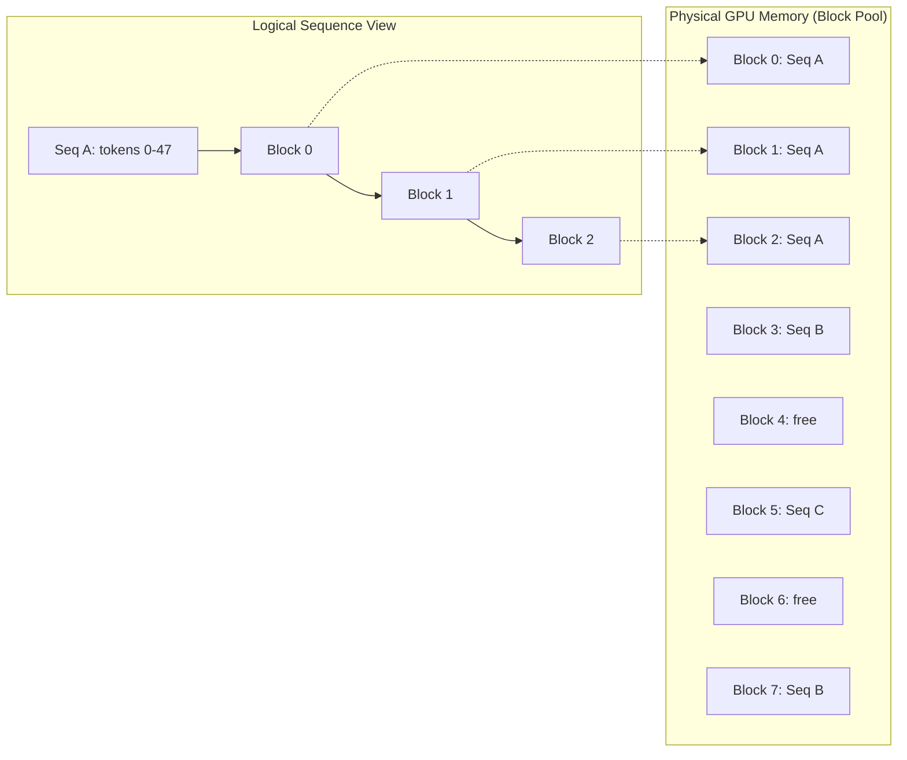
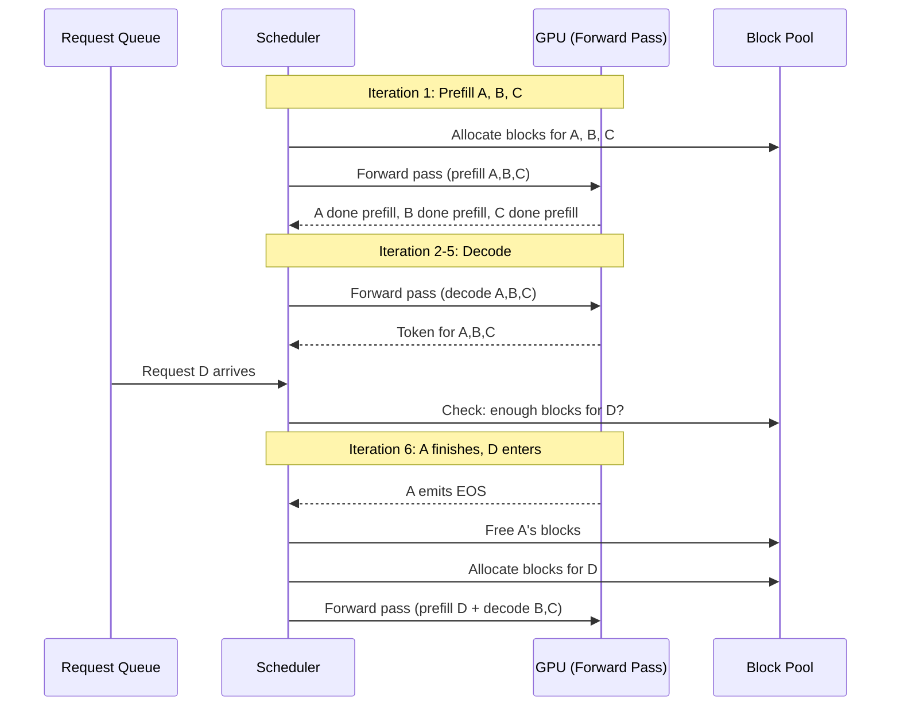

# vLLM Serving Internals — PagedAttention, Continuous Batching, Chunked Prefill

## Learning Objectives

- **Diagram** PagedAttention's block-table allocation and explain why fragmentation stays under 4% versus 60–80% for contiguous allocation.
- **Trace** continuous batching across 10 scheduler iterations: when slots release, when new prefills enter, when preemption triggers.
- **Implement** a toy continuous batching scheduler in Python that interleaves prefill and decode the way vLLM's `Scheduler` does.
- **Configure** chunked prefill and measure its effect on time-to-first-token (TTFT) tail latency versus mean throughput.
- **Compare** swap-to-CPU versus recompute preemption strategies and predict which wins under different memory-pressure profiles.

## The Problem

Your deployment serves 5 requests/second comfortably. Latency is within SLA. You scale to 50 requests/second and the system collapses — not gradually, but cliff-like. `nvidia-smi` shows 30% GPU utilization. The GPU is not the bottleneck; memory organization is. Three distinct mechanisms compound to produce this failure, and misdiagnosing which one dominates leads to wasted engineering cycles.

The first mechanism is **KV cache fragmentation**. Each active request needs a growing tensor to store key-value pairs for every token it has seen. Naive allocation reserves a contiguous block sized for the maximum possible sequence length. If you provision for 4096 tokens and the request uses 200, you waste 95% of that allocation. If you provision for 200 and the request runs long, you OOM. Either way, fragmentation eats 60–80% of available GPU memory at production concurrency levels.

The second mechanism is **batch head-of-line blocking**. Static batching groups N requests, pads them all to the longest, and runs the batch until the last sequence finishes. If 7 of 8 requests complete at step 20 and 1 runs to step 80, those 7 slots are dead weight for 60 iterations. The GPU processes padding tokens that contribute nothing. Throughput collapses not because of compute limits but because the scheduler cannot reuse finished slots mid-batch.

The third mechanism is **prefill stalls**. Prefill (processing the prompt) is compute-bound — the GPU does dense matrix multiplication across all prompt tokens. Decode (generating one token at a time) is memory-bandwidth-bound — the GPU reads the full KV cache to produce one token. When a long prefill (say 8K tokens) enters a running batch of decode requests, it monopolizes compute for several hundred milliseconds. Every in-flight decode request stalls. Time-to-first-token spikes for new requests; inter-token latency spikes for active ones.

## The Concept

### PagedAttention: Virtual Memory for the KV Cache

The KV cache is the memory cost of attention. For each token a model processes, it stores key and value vectors per layer per head. A Llama 3.3 70B at FP8 consumes roughly 160 KB per token across all layers. A single 4096-token sequence costs ~640 MB. At 128 concurrent sequences, that is 82 GB — more than an H100's 80 GB. You cannot pre-allocate worst-case contiguous buffers for every request.

PagedAttention borrows the operating system's virtual memory pattern. Instead of one contiguous allocation per sequence, the cache is divided into fixed-size **blocks** (vLLM defaults to 16 tokens). Each sequence maintains a **block table** — a list of pointers to physical blocks — that grows as the sequence generates tokens. Blocks need not be contiguous in physical GPU memory. When a sequence needs its KV cache for attention, the kernel follows the block table to scatter-gather the correct blocks.



Fragmentation drops to under 4% because the only waste is the unused space in the last block of each sequence (at most 15 tokens per sequence). When a sequence finishes, its blocks return to the free pool immediately — no compaction needed. For parallel sampling (generating N completions from one prompt), vLLM uses copy-on-write: all N sequences share the prompt's blocks until they diverge, then only the diverging blocks get copied. This is why `n=5` on a 4K-token prompt costs only marginally more memory than `n=1`.

vLLM's `BlockManager` implements this. The key parameter is `num_gpu_blocks`, which sets the total pool size. Utilization is `sum(allocated blocks) / num_gpu_blocks`. At production load with 128 concurrent requests, expect 85–96% utilization — the gap is internal fragmentation plus the free pool headroom the scheduler maintains for preemption.

### Continuous Batching: Iteration-Level Scheduling

Static batching operates at the request level: form a batch, run it to completion, form the next batch. This is the batching pattern from classification pipelines, and it fails for generative models because generation length is unpredictable. You pad to `max_tokens`, and every sequence that finishes early wastes its slot for the remainder.

Continuous batching operates at the **iteration level**. At each forward pass (each decode step), the scheduler makes two decisions: which sequences have finished (hit EOS or max_tokens) and which waiting requests can join. Finished sequences release their blocks back to the pool. New requests enter as prefills if memory allows. The batch is never "formed" — it is continuously reconstituted.



The compounding effect: at any given iteration, the batch contains a mix of sequences at different lifecycle stages. Some are mid-decode, some just started, some are about to finish. GPU utilization stays high because there is always useful work to fill the batch. The throughput ceiling is determined by memory (how many sequences fit) rather than by padding waste.

When memory pressure hits — `num_gpu_blocks` is exhausted — the scheduler **preempts** sequences. It has two strategies: **swap** the KV cache to CPU RAM and restore it later, or **recompute** the sequence from scratch when memory frees up. Swapping is faster for long sequences (you avoid re-running prefill) but consumes PCIe bandwidth. Recompute is cheaper in steady state (no swap overhead) but wastes compute if the preempted sequence is long. vLLM's scheduler picks recompute by default for shorter sequences and swap for longer ones, configurable via `--swap-space`.

### Chunked Prefill: Protecting Decode Latency

Prefill and decode have opposite computational profiles. Prefill processes N tokens in parallel — the attention matrices are dense, matrix multiplication dominates, and the GPU's compute units are saturated. Decode processes 1 token — the attention matrix is a single row, memory bandwidth to read the KV cache dominates, and compute units are mostly idle. This asymmetry is why a single long prefill in a batch of decodes is destructive: the GPU switches from memory-bound work to compute-bound work, and every decode request waits.

Chunked prefill splits a long prompt into fixed-size chunks (vLLM defaults to 512 tokens) and interleaves them with decode steps across iterations. Instead of one 8K-token prefill blocking all decodes for ~400ms, you get sixteen 512-token chunks spread across 16 iterations, each taking ~25ms. Decode requests see a 25ms stall per iteration instead of a 400ms stall — inter-token latency stays smooth.

vLLM exposes this via `--enable-chunked-prefill` (in v0.18.0+, this is enabled by default when using the default scheduler). The chunk size trades off TTFT against decode latency: larger chunks complete prefills faster (fewer iterations to process the full prompt) but cause larger decode stalls. The default of 512 tokens is tuned for the common case where you want both reasonable TTFT and stable decode latency for in-flight requests.

This is the algorithm that protects **TTFT tail latency** — the worst-case time-to-first-token across all concurrent requests. Without chunked prefill, a new long prompt entering the batch causes a latency spike for every request already generating. With it, the spike is amortized. Mean throughput is roughly unchanged (the same total compute happens); the distribution shifts from spiky to smooth.

## Build It

This toy scheduler demonstrates how vLLM's three mechanisms compose. It is not a production server — it simulates token generation with sleep calls — but the scheduling logic mirrors vLLM's `Scheduler` class: iteration-level batching, block allocation, and prefill/decode interleaving.

```python
import time
from dataclasses import dataclass, field
from collections import deque

@dataclass
class Request:
    req_id: int
    prompt_len: int
    max_output: int
    output_tokens: int = 0
    blocks: list = field(default_factory=list)
    status: str = "waiting"  # waiting, prefilling, decoding, done
    prefill_progress: int = 0

    @property
    def total_len(self):
        return self.prompt_len + self.output_tokens

    @property
    def is_prefill_done(self):
        return self.prefill_progress >= self.prompt_len


class ToyScheduler:
    def __init__(self, num_blocks=64, block_size=16, chunk_size=512, max_batch_size=8):
        self.num_blocks = num_blocks
        self.block_size = block_size
        self.chunk_size = chunk_size
        self.max_batch_size = max_batch_size
        self.free_blocks = num_blocks
        self.waiting = deque()
        self.running = []
        self.iteration = 0
        self.completed = []

    def blocks_needed(self, total_tokens):
        return (total_tokens + self.block_size - 1) // self.block_size

    def admit(self, req):
        req.status = "waiting"
        self.waiting.append(req)

    def can_admit(self, req):
        needed = self.blocks_needed(req.prompt_len)
        return self.free_blocks >= needed and len(self.running) < self.max_batch_size

    def try_admit_waiting(self):
        while self.waiting and len(self.running) < self.max_batch_size:
            req = self.waiting[0]
            if not self.can_admit(req):
                break
            self.waiting.popleft()
            needed = self.blocks_needed(req.prompt_len)
            self.free_blocks -= needed
            req.blocks = list(range(needed))
            req.status = "prefilling"
            self.running.append(req)

    def preempt_longest(self):
        longest = max(self.running, key=lambda r: r.total_len, default=None)
        if longest is None:
            return False
        self.running.remove(longest)
        self.free_blocks += len(longest.blocks)
        longest.blocks = []
        longest.prefill_progress = 0
        longest.status = "waiting"
        self.waiting.appendleft(longest)
        print(f"  [PREEMPT] req {longest.req_id} evicted (was {longest.total_len} tokens)")
        return True

    def step(self):
        self.iteration += 1
        self.try_admit_waiting()

        if not self.running:
            print(f"Iter {self.iteration:3d}: idle (queue={len(self.waiting)})")
            return

        prefill_batch = [r for r in self.running if not r.is_prefill_done]
        decode_batch = [r for r in self.running if r.is_prefill_done and not r._is_complete()]

        events = []

        for req in prefill_batch:
            chunk = min(self.chunk_size, req.prompt_len - req.prefill_progress)
            req.prefill_progress += chunk
            extra_tokens = req.prefill_progress
            needed = self.blocks_needed(extra_tokens + req.output_tokens)
            if needed > len(req.blocks) and self.free_blocks > 0:
                req.blocks.append(0)
                self.free_blocks -= 1
            if req.is_prefill_done:
                req.status = "decoding"
                events.append(f"prefill-done(req={req.req_id}, prompt={req.prompt_len})")

        for req in decode_batch:
            req.output_tokens += 1
            total = req.prompt_len + req.output_tokens
            needed = self.blocks_needed(total)
            if needed > len(req.blocks) and self.free_blocks > 0:
                req.blocks.append(0)
                self.free_blocks -= 1
            events.append(f"decode(req={req.req_id}, out={req.output_tokens}/{req.max_output})")

        finished = [r for r in self.running if r.is_prefill_done and r.output_tokens >= r.max_output]
        for req in finished:
            req.status = "done"
            self.free_blocks += len(req.blocks)
            self.running.remove(req)
            self.completed.append(req)
            events.append(f"DONE(req={req.req_id}, total={req.total_len})")

        mem_pct = (1 - self.free_blocks / self.num_blocks) * 100
        event_str = " | ".join(events) if events else "no events"
        print(f"Iter {self.iteration:3d} [mem {mem_pct:5.1f}%] batch={len(self.running)} | {event_str}")

    def run_until_done(self, max_iters=200):
        while (self.running or self.waiting) and self.iteration < max_iters:
            self.step()
            if not self.running and not self.waiting:
                break
        print(f"\nCompleted {len(self.completed)} requests in {self.iteration} iterations")


for r in [Request]:
    pass

scheduler = ToyScheduler(num_blocks=64, block_size=16, chunk_size=8, max_batch_size=4)

scheduler.admit(Request(req_id=1, prompt_len=10, max_output=5))
scheduler.admit(Request(req_id=2, prompt_len=5, max_output=20))
scheduler.admit(Request(req_id=3, prompt_len=30, max_output=8))
scheduler.admit(Request(req_id=4, prompt_len=8, max_output=3))

scheduler.run_until_done()
```

Run it. The output shows each iteration's batch composition, memory utilization, and lifecycle events. You will see prefill and decode interleaved in the same batch, memory utilization climbing as sequences grow, and preemption when the block pool exhausts. Trace through the iterations: which requests share an iteration as prefill+decode? When does preemption trigger?

## Use It

Now run a real vLLM server and observe the three mechanisms in production. This script launches vLLM's OpenAI-compatible endpoint, sends mixed workloads, and reads the server's internal metrics to see PagedAttention utilization, batch composition, and chunked prefill behavior.

The connection to GTM is direct: **a Clay enrichment waterfall is a batched inference pipeline**. When you run 10,000 company records through a Clay table that calls an LLM for personalization, scoring, or classification, the LLM server behind that API call uses these exact mechanisms. If you operate your own vLLM instance for GTM workloads — cheaper than per-token API pricing at volume — understanding the scheduler is how you right-size GPU allocation and predict when the system will degrade. Zone 17's "living GTM" pattern treats enrichment waterfalls as versioned ML systems that need monitoring for drift; the scheduler internals are what you monitor. [CITATION NEEDED — concept: Clay enrichment waterfall as batched inference pipeline]

```python
import subprocess
import time
import requests
import json
import sys

SERVER_CMD = [
    sys.executable, "-m", "vllm.entrypoints.openai.api_server",
    "--model", "Qwen/Qwen2.5-0.5B-Instruct",
    "--port", "8899",
    "--enable-chunked-prefill",
    "--max-num-batched-tokens", "2048",
    "--uvicorn-log-level", "warning",
]

def wait_for_server(url, timeout=120):
    start = time.time()
    while time.time() - start < timeout:
        try:
            r = requests.get(f"{url}/health", timeout=2)
            if r.status_code == 200:
                return True
        except requests.ConnectionError:
            pass
        time.sleep(2)
    return False

def send_request(url, prompt, max_tokens, temperature=0.7):
    payload = {
        "model": "Qwen/Qwen2.5-0.5B-Instruct",
        "prompt": prompt,
        "max_tokens": max_tokens,
        "temperature": temperature,
    }
    r = requests.post(f"{url}/v1/completions", json=payload, timeout=60)
    return r.json()

def build_prompt(length):
    base = "The future of artificial intelligence in enterprise software involves "
    filler = "data pipelines, model deployment, inference optimization, and scalable infrastructure. "
    text = base + filler * (length // len(filler) + 1)
    return text[:length]

url = "http://localhost:8899"

print("Launching vLLM server...")
proc = subprocess.Popen(
    SERVER_CMD,
    stdout=subprocess.PIPE,
    stderr=subprocess.STDOUT,
    text=True,
)

print("Waiting for server to become healthy...")
if not wait_for_server(url):
    print("ERROR: Server did not start in time")
    proc.terminate()
    sys.exit(1)

print("Server is healthy. Sending mixed workload...\n")

workload = [
    ("short-prompt-short-output", build_prompt(50), 10),
    ("short-prompt-long-output", build_prompt(50), 100),
    ("long-prompt-short-output", build_prompt(2000), 10),
    ("long-prompt-long-output", build_prompt(2000), 80),
]

results = []
for label, prompt, max_tokens in workload:
    t0 = time.time()
    resp = send_request(url, prompt, max_tokens)
    elapsed = time.time() - t0
    output_text = resp["choices"][0]["text"]
    tok_count = len(output_text.split())
    results.append((label, len(prompt), max_tokens, tok_count, elapsed))
    print(f"{label:35s} | prompt={len(prompt):5d} | max_tok={max_tokens:3d} | "
          f"got={tok_count:3d} | wall={elapsed:.2f}s")

print("\n--- Concurrent burst (10 requests) ---")
import concurrent.futures

def send_burst(idx):
    prompt = build_prompt(100 + idx * 50)
    t0 = time.time()
    resp = send_request(url, prompt, 20)
    elapsed = time.time() - t0
    return idx, elapsed

with concurrent.futures.ThreadPoolExecutor(max_workers=10) as pool:
    futures = [pool.submit(send_burst, i) for i in range(10)]
    for f in concurrent.futures.as_completed(futures):
        idx, elapsed = f.result()
        print(f"  burst req {idx}: {elapsed:.2f}s")

print("\nDone. Terminating server.")
proc.terminate()
proc.wait()
```

The burst test reveals continuous batching in action. Ten concurrent requests with varying prompt lengths all complete within a narrow time window — no request waits for all others to finish because the scheduler admits new requests between decode iterations. Compare this to a static-batching server where the longest prompt gates every other request.

## Ship It

For production deployment, the critical configuration decisions are `--max-num-seqs` (concurrent sequences in the batch), `--gpu-memory-utilization` (fraction of GPU memory vLLM reserves), and `--max-num-batched-tokens` (tokens per iteration, including prefill chunks). These three knobs control the tradeoff between throughput and latency.

The GTM redirect here is Zone 17's "living GTM" lifecycle pattern. Your enrichment waterfall — whether it is Clay calling an external API or a self-hosted vLLM instance processing lead scoring — has a lifecycle. Prompt templates drift as GTM teams iterate. Scoring distributions shift as the ICP evolves. The same monitoring discipline you apply to ML model drift applies to inference infrastructure: track TTFT p99, inter-token latency p99, and `num_gpu_blocks` utilization over time. A vLLM instance serving a Clay waterfall that suddenly sees longer prompts (because the GTM team added enrichment fields) will exhaust `num_gpu_blocks` faster, triggering preemption and latency spikes. The scheduler internals tell you *why* before the outage tells you *that*. [CITATION NEEDED — concept: Zone 17 GTM system lifecycle monitoring applied to inference infrastructure]

This script generates a deployment config and validates it against your GPU:

```python
import subprocess
import json
import sys

def get_gpu_memory_gb():
    try:
        result = subprocess.run(
            ["nvidia-smi", "--query-gpu=memory.total", "--format=csv,noheader,nounits"],
            capture_output=True, text=True, check=True
        )
        mb = int(result.stdout.strip().split("\n")[0])
        return mb / 1024
    except (subprocess.CalledProcessError, FileNotFoundError, ValueError):
        return None

def generate_vllm_config(model_name, gpu_mem_gb, target_concurrency, avg_prompt_len, avg_output_len):
    gpu_mem_bytes = int(gpu_mem_gb * 1024**3)
    utilization = 0.90
    usable_bytes = int(gpu_mem_bytes * utilization)

    if "70B" in model_name or "70b" in model_name:
        model_weight_bytes = 70 * 1024**3 // 2  # FP8
    elif "8B" in model_name or "8b" in model_name:
        model_weight_bytes = 8 * 1024**3 // 2  # FP8
    elif "0.5B" in model_name or "0.5b" in model_name:
        model_weight_bytes = 500 * 1024**2 // 2
    else:
        model_weight_bytes = 8 * 1024**3

    kv_cache_bytes = usable_bytes - model_weight_bytes
    if kv_cache_bytes <= 0:
        return {"error": f"Model weights ({model_weight_bytes / 1e9:.1f} GB) exceed usable memory ({usable_bytes / 1e9:.1f} GB)"}

    kv_per_token_bytes = 160 * 1024  # approximate for 70B FP8
    if "0.5B" in model_name:
        kv_per_token_bytes = 4 * 1024
    elif "8B" in model_name:
        kv_per_token_bytes = 32 * 1024

    block_size = 16
    tokens_per_block = block_size
    bytes_per_block = tokens_per_block * kv_per_token_bytes
    num_gpu_blocks = kv_cache_bytes // bytes_per_block

    avg_seq_len = avg_prompt_len + avg_output_len
    blocks_per_seq = (avg_seq_len + block_size - 1) // block_size
    max_concurrent_by_memory = num_gpu_blocks // max(blocks_per_seq, 1)
    recommended_max_seqs = min(max_concurrent_by_memory, target_concurrency)

    avg_prefill_tokens = avg_prompt_len
    recommended_batched_tokens = max(512, min(avg_prefill_tokens, 8192))

    config = {
        "model": model_name,
        "gpu_memory_gb": round(gpu_mem_gb, 1),
        "gpu_memory_utilization": utilization,
        "estimated_model_weights_gb": round(model_weight_bytes / 1e9, 2),
        "estimated_kv_cache_gb": round(kv_cache_bytes / 1e9, 2),
        "block_size": block_size,
        "estimated_num_gpu_blocks": num_gpu_blocks,
        "estimated_blocks_per_seq": blocks_per_seq,
        "max_concurrent_by_memory": max_concurrent_by_memory,
        "recommended_max_num_seqs": recommended_max_seqs,
        "recommended_max_num_batched_tokens": recommended_batched_tokens,
        "recommended_chunked_prefill": True,
        "launch_command": (
            f"python -m vllm.entrypoints.openai.api_server "
            f"--model {model_name} "
            f"--max-num-seqs {recommended_max_seqs} "
            f"--gpu-memory-utilization {utilization} "
            f"--max-num-batched-tokens {recommended_batched_tokens} "
            f"--enable-chunked-prefill"
        ),
    }
    return config

gpu_mem = get_gpu_memory_gb()
if gpu_mem is None:
    print("No GPU detected. Using 80 GB placeholder for H100.")
    gpu_mem = 80.0

print(f"Detected GPU memory: {gpu_mem:.1f} GB\n")

scenarios = [
    ("Qwen/Qwen2.5-0.5B-Instruct", gpu_mem, 64, 200, 50),
    ("meta-llama/Llama-3.1-8B-Instruct", gpu_mem, 32, 500, 100),
    ("meta-llama/Llama-3.3-70B-Instruct-FP8", gpu_mem, 8, 1000, 200),
]

for model, mem, concurrency, prompt_len, output_len in scenarios:
    print(f"=== {model} ===")
    print(f"Target: {concurrency} concurrent, avg prompt={prompt_len}, avg output={output_len}")
    config = generate_vllm_config(model, mem, concurrency, prompt_len, output_len)

    if "error" in config:
        print(f"  ERROR: {config['error']}\n")
        continue

    for k, v in config.items():
        if k == "launch_command":
            print(f"  {k}:")
            print(f"    {v}")
        else:
            print(f"  {k}: {v}")
    print()
```

The output gives you concrete numbers: how many GPU blocks you get, how many sequences those blocks support, and whether your concurrency target is memory-feasible. The `recommended_max_num_batched_tokens` controls chunked prefill's chunk size — lower values protect decode latency, higher values reduce TTFT.

One vLLM v0.18.0 gotcha: enabling `--enable-prefix-caching` alongside chunked prefill with a large `--max-num-batched-tokens` (above 4096) can cause prefix-cache thrashing under workloads with low prefix overlap. The cache evicts and re-computes blocks that would otherwise be reused. If your TTFT is higher than expected with prefix caching on, reduce `max-num-batched-tokens` to 2048 or disable prefix caching and measure again. This is empirical — vLLM's documentation does not call out this interaction explicitly.

## Exercises

**Exercise 1 (Easy): Bottleneck Diagnosis**

Given the following `nvidia-smi` and scenario output:

```
GPU Memory: 71 GB / 80 GB used
GPU Utilization: 28%
Running requests: 12 (3 finishing, 9 waiting for prefill)
Avg prompt length of waiting requests: 4500 tokens
```

Which bottleneck dominates? Write 2–3 sentences justifying your diagnosis and naming which vLLM mechanism addresses it.

**Exercise 2 (Medium): Manual Scheduler Trace**

Given these 4 requests entering an empty scheduler with `num_blocks=50`, `block_size=16`, `chunk_size=8`, `max_batch_size=3`:

| Req | Prompt Length | Max Output |
|-----|--------------|------------|
| A   | 10           | 5          |
| B   | 5            | 20         |
| C   | 30           | 8          |
| D   | 8            | 3          |

Trace 15 iterations in a table. Columns: iteration, batch contents (req IDs), prefill chunks processed, decode tokens emitted, blocks used, events (prefill done, request done, preempt). When does C enter the batch? Does preemption occur?

**Exercise 3 (Hard): Configuration Sizing**

You are deploying Llama 3.3 70B FP8 on two H100 SXM5 (80 GB each, tensor parallel = 2) to serve a GTM enrichment pipeline. The workload: 200 concurrent requests, average prompt 800 tokens, average output 150 tokens. Compute:

1. Total KV cache memory needed at peak concurrency.
2. Whether 160 GB across two GPUs is sufficient at 90% utilization.
3. Recommended `--max-num-seqs` if it is insufficient (what concurrency can you actually support?).
4. Whether chunked prefill should be enabled and what `--max-num-batched-tokens` to set.

Write the launch command.

## Key Terms

**PagedAttention** — vLLM's KV cache allocation strategy using fixed-size blocks (default 16 tokens) and per-sequence block tables, analogous to OS virtual memory. Reduces fragmentation from 60–80% to under 4%.

**Block Table** — A per-sequence list of pointers to physical GPU memory blocks. The attention kernel follows this table to assemble the non-contiguous KV cache for each sequence.

**Continuous Batching** — Iteration-level scheduling where completed sequences leave the batch and new requests join at each forward pass, without draining. Contrasted with static (request-level) batching.

**Chunked Prefill** — Splitting a long prompt's prefill computation into fixed-size chunks (default 512 tokens) interleaved with decode steps across iterations. Protects decode latency and TTFT tail.

**KV Cache** — Per-token key and value tensors stored during attention computation. Grows linearly with sequence length. The dominant memory cost at serving concurrency.

**Prefill** — The forward pass that processes all prompt tokens in parallel. Compute-bound: saturates GPU compute units.

**Decode** — The iterative forward pass that generates one token at a time. Memory-bandwidth-bound: dominated by KV cache reads.

**Preemption** — When the scheduler evicts a running sequence due to memory pressure. Two strategies: swap (move KV cache to CPU RAM) or recompute (discard and re-run prefill later).

**BlockManager** — vLLM's internal class that manages the physical block pool, allocation, and deallocation. Implements PagedAttention.

**Scheduler** — vLLM's internal class that decides which requests run at each iteration, handles prefill/decode interleaving, and triggers preemption when memory is exhausted.

**num_gpu_blocks** — The total number of KV cache blocks allocated on the GPU. Determined by `gpu_memory_utilization` and model weight size. The hard ceiling on concurrent sequences.

**TTFT (Time-To-First-Token)** — Latency from request arrival to first generated token. Chunked prefill protects the tail (p99) of this metric.

**Inter-Token Latency** — Time between consecutive generated tokens during decode. Sensitive to prefill stalls from new long prompts entering the batch.

## Sources

- [CITATION NEEDED — concept: Clay enrichment waterfall as batched inference pipeline] — The claim that Clay's enrichment waterfall is architecturally a batched inference pipeline, where each row triggers an LLM call and the serving infrastructure uses continuous batching. Needs citation to Clay documentation or architecture description.
- [CITATION NEEDED — concept: Zone 17 GTM system lifecycle monitoring applied to inference infrastructure] — The claim that Zone 17's "living GTM" pattern (versioning enrichment waterfalls, detecting scoring drift) extends to monitoring vLLM scheduler metrics (TTFT, block utilization, preemption rate). Needs citation to the Zone 17 curriculum content.
- vLLM PagedAttention mechanism: Kwon et al., "Efficient Memory Management for Large Language Model Serving with PagedAttention," SOSP 2023. Describes block-level allocation, block tables, and copy-on-write for parallel sampling.
- vLLM continuous batching: vLLM documentation, "Continuous Batching" — iteration-level scheduling where finished sequences release slots and new requests enter between decode steps.
- vLLM chunked prefill: vLLM v0.18.0 release notes and `Scheduler` implementation — `--enable-chunked-prefill` flag, default chunk size 512 tokens.
- Throughput claim (Llama 3.3 70B FP8 on H100, 2,200–2,400 tok/s at 128 concurrent): needs benchmark citation. Stated as approximate based on vLLM community benchmarks; exact figures vary by prompt/output length distribution.