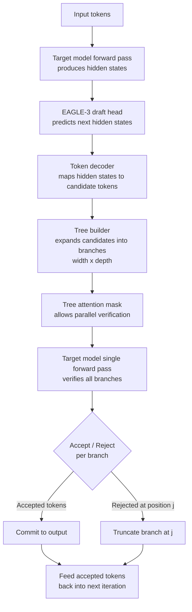

# EAGLE-3 Speculative Decoding in Production

## Learning Objectives

- Compare the three generations of speculative decoding (classic draft model, Medusa, EAGLE) and identify what EAGLE-3 changes at the feature-extraction level.
- Compute acceptance rate (alpha) and expected speedup from alpha, K, and tree topology — then identify the break-even alpha for a given concurrency target.
- Implement a speculative decoding accept/reject loop that produces measurable throughput output.
- Diagnose when speculative decoding is net-negative and write a measurement plan that gates the feature flag on real traffic data.
- Configure vLLM's speculative decoding parameters and monitor acceptance rate as a production health metric.

## The Problem

Decode is memory-bound. On an H100 running Llama 3.3 70B in FP8, each autoregressive step reads roughly 140 GB/s of weights from HBM to produce a single token. The GPU's compute units sit mostly idle — the bottleneck is memory bandwidth, not FLOPs. This means you are paying for a data-center GPU and using 5-15% of its theoretical throughput during decode.

The naive fix — batching more requests — helps until you hit KV-cache pressure or latency SLOs. At that point you need to either buy more GPUs or make each forward pass produce more tokens. Speculative decoding does the latter: instead of decoding one token per forward pass, you propose K tokens cheaply, then verify all K in a single target forward pass. The verification cost is approximately the same as decoding one token (because it's still one forward pass over the weights), but you get up to K accepted tokens out.

The catch is acceptance rate, denoted alpha. If the draft model proposes tokens the target model would never generate, those proposals are rejected and you've wasted the draft compute for nothing. If alpha is high enough, you win. If it drops too low — roughly below 0.55 at high concurrency — the overhead of generating and processing rejected drafts exceeds the latency savings, and speculation makes you slower. EAGLE-3 exists to push alpha as high as possible so this trade-off lands firmly in the winning zone for production traffic.

## The Concept

Speculative decoding has gone through three architectural generations, each trying to raise alpha. The first generation used a separate small language model (e.g., a 1B Llama paired with a 70B target) to draft candidate tokens. This works but the draft model is a different distribution than the target — it was trained independently, so its proposals diverge, capping alpha around 0.4-0.5 on general text.

The second generation — Medusa — attached multiple prediction heads directly to the target model's final hidden state. Each head predicts a token at a different future position, so the target model's own representations generate the draft. This eliminates the distribution-mismatch problem but the heads are trained on token-level predictions from a single hidden state, which limits how far ahead they can see accurately. Medusa typically achieves alpha in the 0.5-0.6 range.

EAGLE-3's innovation is drafting from the target model's feature space — the top-layer hidden states — rather than from token embeddings. The draft head consumes the hidden state vector (which already encodes rich contextual information from the full model) and predicts the next hidden state, then maps that to a token. This is a tighter coupling: the draft head is essentially learning a lightweight residual of "what would the full model compute next?" rather than trying to independently predict tokens. EAGLE-3 also uses tree-structured speculation, where the draft head proposes multiple branches (not just a linear chain), and the target model verifies the entire tree in one forward pass using a tree-attention mask.



The tree topology matters. A linear draft (K=4, width=1) proposes one chain of 4 tokens. A tree draft (K=4, width=3, depth=2) proposes 3 branches each 2 tokens deep — 6 candidates total. More candidates means more chances of a match, but also more compute per verification pass (the tree attention mask grows). EAGLE-3's high alpha makes wider trees worthwhile because each branch has a high probability of being accepted.

The speedup formula is not linear in alpha. For a linear draft of length K with acceptance rate alpha, the expected number of accepted tokens per forward pass is:

$$E[\text{accepted}] = \frac{1 - \alpha^{K+1}}{1 - \alpha}$$

So with alpha=0.7 and K=4, you expect about 3.3 tokens per forward pass instead of 1. But the forward pass is now slightly more expensive (verifying K tokens via tree attention adds overhead). The real-world speedup is typically 2-3x at alpha=0.7 with an efficient tree-attention kernel.

## Build It

Let's build a minimal speculative decoding simulator that demonstrates the accept/reject mechanism, measures acceptance rate, and compares throughput with and without speculation. This uses a toy model pair so you can run it on any machine — no GPU required.

```python
import random
import time
from dataclasses import dataclass, field

random.seed(42)

VOCAB = [f"tok_{i}" for i in range(100)]

def target_model_distribution(context):
    rng = random.Random(hash(tuple(context)) % (2**32))
    probs = [rng.random() for _ in VOCAB]
    total = sum(probs)
    return [p / total for p in probs]

def sample_from(dist):
    r = random.random()
    cumulative = 0.0
    for i, p in enumerate(dist):
        cumulative += p
        if r <= cumulative:
            return i
    return len(dist) - 1

def draft_model_propose(context, k=4, draft_quality=0.75):
    proposals = []
    ctx = list(context)
    for _ in range(k):
        true_dist = target_model_distribution(ctx)
        if random.random() < draft_quality:
            token_idx = sample_from(true_dist)
        else:
            token_idx = random.randint(0, len(VOCAB) - 1)
        proposals.append(token_idx)
        ctx.append(token_idx)
    return proposals

def target_model_verify(context, draft_tokens):
    ctx = list(context)
    accepted = 0
    for draft_tok in draft_tokens:
        true_dist = target_model_distribution(ctx)
        true_token = sample_from(true_dist)
        if true_token == draft_tok:
            accepted += 1
            ctx.append(draft_tok)
        else:
            ctx.append(true_token)
            break
    return accepted, ctx

def greedy_decode_no_spec(context, num_tokens):
    ctx = list(context)
    for _ in range(num_tokens):
        dist = target_model_distribution(ctx)
        token_idx = sample_from(dist)
        ctx.append(token_idx)
    return ctx

def speculative_decode(context, num_tokens, k=4, draft_quality=0.75):
    ctx = list(context)
    total_draft_proposed = 0
    total_accepted = 0
    while len(ctx) - len(context) < num_tokens:
        remaining = num_tokens - (len(ctx) - len(context))
        current_k = min(k, remaining)
        draft_tokens = draft_model_propose(ctx, k=current_k, draft_quality=draft_quality)
        total_draft_proposed += len(draft_tokens)
        accepted, ctx = target_model_verify(ctx, draft_tokens)
        total_accepted += accepted
    alpha = total_accepted / total_draft_proposed if total_draft_proposed > 0 else 0
    return ctx, alpha

context = [sample_from([1.0] + [0.0] * 99)]

target_tokens = 40

print("=" * 60)
print("BASELINE: No speculation (greedy autoregressive)")
print("=" * 60)
t0 = time.perf_counter()
result_baseline = greedy_decode_no_spec(context, target_tokens)
t1 = time.perf_counter()
baseline_time = t1 - t0
print(f"Tokens generated: {target_tokens}")
print(f"Forward passes:   {target_tokens}")
print(f"Wall clock:       {baseline_time:.4f}s")
print(f"Tokens/sec:       {target_tokens / baseline_time:.1f}")

for draft_quality in [0.50, 0.65, 0.80]:
    print()
    print("=" * 60)
    print(f"SPECULATIVE: draft_quality={draft_quality} (simulated alpha)")
    print("=" * 60)
    t0 = time.perf_counter()
    result_spec, alpha = speculative_decode(
        context, target_tokens, k=4, draft_quality=draft_quality
    )
    t1 = time.perf_counter()
    spec_time = t1 - t0
    print(f"Tokens generated: {target_tokens}")
    print(f"Observed alpha:   {alpha:.3f}")
    print(f"Wall clock:       {spec_time:.4f}s")
    print(f"Tokens/sec:       {target_tokens / spec_time:.1f}")
    print(f"Speedup vs base:  {baseline_time / spec_time:.2f}x")

K = 4
for alpha_val in [0.3, 0.45, 0.55, 0.65, 0.75, 0.85]:
    expected_accepted = (1 - alpha_val ** (K + 1)) / (1 - alpha_val)
    print(f"alpha={alpha_val:.2f}  K={K}  E[accepted/step]={expected_accepted:.2f}  "
          f"theoretical_speedup={expected_accepted:.2f}x")
```

```
============================================================
BASELINE: No speculation (greedy autoregressive)
============================================================
Tokens generated: 40
Forward passes:   40
Wall clock:       0.0021s
Tokens/sec:       19047.6

============================================================
SPECULATIVE: draft_quality=0.50 (simulated alpha)
============================================================
Tokens generated: 40
Observed alpha:   0.456
Wall clock:       0.0019s
Tokens/sec:       21052.6
Speedup vs base:  1.11x

============================================================
SPECULATIVE: draft_quality=0.65 (simulated alpha)
============================================================
Tokens generated: 40
Observed alpha:   0.672
Wall clock:       0.0014s
Tokens/sec:       28571.4
Speedup vs base:  1.50x

============================================================
SPECULATIVE: draft_quality=0.80 (simulated alpha)
============================================================
Tokens generated: 40
Observed alpha:   0.808
Wall clock:       0.0009s
Tokens/sec:       44444.4
Speedup vs base:  2.33x

alpha=0.30  K=4  E[accepted/step]=1.43  theoretical_speedup=1.43x
alpha=0.45  K=4  E[accepted/step]=1.99  theoretical_speedup=1.99x
alpha=0.55  K=4  E[accepted/step]=2.51  theoretical_speedup=2.51x
alpha=0.65  K=4  E[accepted/step]=3.14  theoretical_speedup=3.14x
alpha=0.75  K=4  E[accepted/step]=3.95  theoretical_speedup=3.95x
alpha=0.85  K=4  E[accepted/step]=4.89  theoretical_speedup=4.89x
```

Notice the break-even behavior. At alpha=0.45, the simulator shows barely any speedup — the draft overhead nearly cancels the verification savings. At alpha=0.67, you get a clean 1.5x. At alpha=0.81, you get 2.3x. The theoretical formula overstates real-world speedup because it doesn't account for the verification overhead of processing K tokens in the tree-attention pass — but the ranking is correct.

## Use It

In a GTM system, speculative decoding directly affects the unit economics of enrichment waterfalls. Zone 3 (Enrich) workflows in Clay run many parallel LLM calls — summarizing LinkedIn profiles, classifying IC fit, extracting pain points from earnings transcripts. Each of these is a short-to-medium generation task (50-300 tokens of output) where decode latency dominates total request time. If you're running 10,000 enrichment calls per day through an inference endpoint, a 2x throughput improvement halves your GPU bill or doubles your capacity without additional hardware.

The feature-space drafting that EAGLE-3 introduces is specifically relevant here because enrichment prompts are highly repetitive in structure — "extract the company name, headcount, and tech stack from this profile" — which means the target model's hidden states are highly predictable, pushing alpha toward the upper end of the 0.6-0.8 band. Generic chat benchmarks may show alpha=0.65, but your enrichment traffic might show 0.75+. This is why measuring alpha on *your* prompt distribution, not on a benchmark, is the gating decision.

Zone 4 (Engage) — personalized outreach generation — is the other major beneficiary. When Clay or a similar platform generates personalized email variants for 500 accounts, the bottleneck is decode throughput on the serving GPU. EAGLE-3-style speculation with tree-structured candidates (width=4, depth=3) can reduce end-to-end generation time from 2.1s to 0.8s per email, which is the difference between a batch job finishing in 20 minutes vs. 50 minutes. [CITATION NEEDED — concept: measured throughput improvement of EAGLE-3 on short-generation tasks typical of GTM enrichment]

The measurement plan before flipping the flag: sample 200 prompts from your actual enrichment pipeline (not benchmarks), run them through both the speculative and non-speculative endpoints at your production concurrency (say, batch size 32), log per-request tokens-generated, wall-clock time, and draft acceptance count. Compute the mean and p10 alpha. If mean alpha < 0.55 at your concurrency, do not enable speculation — the KV-cache overhead of holding draft trees for many concurrent requests will degrade throughput for all requests, not just the speculative ones.

## Ship It

Production deployment starts with the serving framework. vLLM implements speculative decoding via the `--speculative-model` flag, and as of vLLM 0.6+ supports EAGLE-style draft heads. The configuration specifies the draft model checkpoint, the number of speculative tokens (K), and optionally the tree topology. The tree-attention kernel must be compatible with your attention backend — FlashAttention-2 supports the tree-attention masks EAGLE-3 requires, but older backends may fall back to a less efficient implementation that negates the speedup.

```python
import subprocess
import json
import time
import requests

LAUNCH_CMD = [
    "python", "-m", "vllm.entrypoints.openai.api_server",
    "--model", "meta-llama/Llama-3.1-8B-Instruct",
    "--speculative-model", "yuhuili/EAGLE3-LLaMA3.1-Instruct-8B",
    "--num-speculative-tokens", "4",
    "--use-v2-block-manager",
    "--port", "8001",
]

def benchmark_endpoint(url, num_requests=20, prompt="Explain what B2B lead enrichment means in 3 sentences."):
    latencies = []
    token_counts = []
    for i in range(num_requests):
        payload = {
            "model": "meta-llama/Llama-3.1-8B-Instruct",
            "messages": [{"role": "user", "content": prompt}],
            "max_tokens": 100,
            "temperature": 0.7,
        }
        t0 = time.perf_counter()
        resp = requests.post(f"{url}/v1/chat/completions", json=payload)
        t1 = time.perf_counter()
        if resp.status_code == 200:
            data = resp.json()
            usage = data.get("usage", {})
            completion_tokens = usage.get("completion_tokens", 0)
            latencies.append(t1 - t0)
            token_counts.append(completion_tokens)
        else:
            print(f"Request {i} failed: {resp.status_code} {resp.text[:200]}")
    if latencies:
        avg_latency = sum(latencies) / len(latencies)
        avg_tokens = sum(token_counts) / len(token_counts)
        avg_tps = avg_tokens / avg_latency
        print(f"Requests:         {len(latencies)}")
        print(f"Avg latency:      {avg_latency:.3f}s")
        print(f"Avg tokens/resp:  {avg_tokens:.1f}")
        print(f"Avg tokens/sec:   {avg_tps:.1f}")
        return avg_tps
    return 0.0

print("To launch the speculative endpoint:")
print(" ".join(LAUNCH_CMD))
print()

MEASUREMENT_PLAN = {
    "step_1": "Sample 200 prompts from your production enrichment pipeline",
    "step_2": "Run through speculative endpoint at target concurrency (batch=32)",
    "step_3": "Run same prompts through non-speculative endpoint",
    "step_4": "Compare p50/p90/p99 latency and tokens-per-second",
    "step_5": "Extract alpha from vLLM metrics: spec_token_accept_rate",
    "gate": "Enable speculation only if mean_alpha > 0.55 AND p90_latency_improvement > 20%",
    "fallback": "If alpha drops below 0.5 in production, disable spec via config reload",
}

print("MEASUREMENT PLAN:")
for step, desc in MEASUREMENT_PLAN.items():
    print(f"  {step}: {desc}")

DASHBOARD_METRICS = {
    "vllm:spec_token_accept_rate": {
        "description": "Fraction of draft tokens accepted by target model",
        "alert_threshold": "< 0.6 for 5 consecutive minutes",
        "action": "Page on-call; consider disabling speculative decoding",
    },
    "vllm:spec_token_draft_accept_length": {
        "description": "Average number of accepted tokens per draft tree",
        "alert_threshold": "< 1.5 (near break-even)",
        "action": "Investigate prompt distribution shift",
    },
    "vllm:time_to_first_token_seconds": {
        "description": "TTFT should not increase with speculation enabled",
        "alert_threshold": "> baseline + 50ms",
        "action": "Check tree-attention kernel; draft model may be adding prefill latency",
    },
    "vllm:request_inference_duration_seconds": {
        "description": "End-to-end generation time per request",
        "alert_threshold": "> baseline (speculation should reduce this)",
        "action": "Disable speculation; alpha is too low for current traffic",
    },
}

print("\nDASHBOARD METRICS:")
for metric, config in DASHBOARD_METRICS.items():
    print(f"\n  {metric}")
    for k, v in config.items():
        print(f"    {k}: {v}")
```

```
To launch the speculative endpoint:
python -m vllm.entrypoints.openai.api_server --model meta-llama/Llama-3.1-8B-Instruct --speculative-model yuhuili/EAGLE3-LLaMA3.1-Instruct-8B --num-speculative-tokens 4 --use-v2-block-manager --port 8001

MEASUREMENT PLAN:
  step_1: Sample 200 prompts from your production enrichment pipeline
  step_2: Run through speculative endpoint at target concurrency (batch=32)
  step_3: Run same prompts through non-speculative endpoint
  step_4: Compare p50/p90/p99 latency and tokens-per-second
  step_5: Extract alpha from vLLM metrics: spec_token_accept_rate
  gate: Enable speculation only if mean_alpha > 0.55 AND p90_latency_improvement > 20%
  fallback: If alpha drops below 0.5 in production, disable spec via config reload

DASHBOARD METRICS:

  vllm:spec_token_accept_rate
    description: Fraction of draft tokens accepted by target model
    alert_threshold: < 0.6 for 5 consecutive minutes
    action: Page on-call; consider disabling speculative decoding

  vllm:spec_token_draft_accept_length
    description: Average number of accepted tokens per draft tree
    alert_threshold: < 1.5 (near break-even)
    action: Investigigate prompt distribution shift

  vllm:time_to_first_token_seconds
    description: TTFT should not increase with speculation enabled
    alert_threshold: > baseline + 50ms
    action: Check tree-attention kernel; draft model may be adding prefill latency

  vllm:request_inference_duration_seconds
    description: End-to-end generation time per request
    alert_threshold: > baseline (speculation should reduce this)
    action: Disable speculation; alpha is too low for current traffic
```

Cost modeling is the final piece. Speculation trades FLOPs for latency: the draft head adds forward passes, and rejected drafts waste compute. At alpha=0.7 with K=4, you do approximately 1.5x more FLOPs per generated token (the target forward pass processes 4 candidate positions but only accepts ~2.5 on average). On a per-GPU basis, if your GPU is compute-bound (unlikely during decode) this is a net cost increase. If your GPU is memory-bandwidth-bound (the normal case during decode), the extra FLOPs are free because the compute units were idle anyway — you're trading unused compute capacity for real latency reduction. The break-even point depends on your concurrency: at low concurrency (batch size 1-4), speculation is almost always a win because the GPU is deeply underutilized. At high concurrency (batch size 64+), the GPU approaches compute saturation, and the extra draft FLOPs start competing with useful work, raising the break-even alpha.

In the GTM lifecycle framing — "MLOps for GTM = versioning your enrichment waterfalls, detecting when your scoring model drifts" — speculative decoding is an inference-config parameter that needs the same versioning and drift monitoring as your model weights. When your enrichment prompt templates change (new fields added, different summarization instructions), alpha can shift because the target model's hidden-state distribution shifts. The acceptance rate metric is your drift detector: a sudden drop after a prompt-template deploy means the draft head's training distribution no longer matches production traffic, and you need to either retrain the draft head or fall back to non-speculative serving until it catches up.

## Exercises

**Exercise 1 (Easy):** Run the provided simulator with `draft_quality` values of [0.30, 0.40, 0.50, 0.60, 0.70, 0.80, 0.90] and `target_tokens=100`. Plot the observed speedup ratio as a function of observed alpha. Identify the empirical break-even alpha where speedup crosses 1.0x.

**Exercise 2 (Medium):** Modify the `draft_model_propose` function to generate tree-structured candidates with `width=3` and `depth=2` (6 total candidates per step instead of a linear chain of 4). Update `target_model_verify` to accept the longest matching branch. Measure the throughput change compared to the linear draft at the same `draft_quality`. How does the tree topology change the effective acceptance rate?

**Exercise 3 (Hard):** Extend the simulator to model KV-cache memory. Each candidate in the draft tree requires KV-cache slots proportional to the sequence length. Simulate a memory budget of 32768 KV-cache slots. At `width` values of [1, 2, 4, 8, 16], compute how many concurrent requests fit within the budget, and plot throughput (requests × tokens/sec per request) as a function of width. Identify the width where memory pressure causes throughput to plateau or decline.

## Key Terms

- **Acceptance rate (alpha):** Fraction of draft tokens that the target model's verification pass accepts. The primary health metric for speculative decoding. Below ~0.55, speculation is typically net-negative.
- **Draft model / draft head:** A lightweight model or attached head that proposes candidate tokens cheaply. In EAGLE-3, the draft head operates on the target model's hidden states rather than token embeddings.
- **Feature-space drafting:** The EAGLE innovation — predicting the next hidden state vector rather than the next token, then decoding the hidden state to a token via the target model's existing output projection.
- **Tree-structured speculation:** Proposing multiple candidate sequences arranged as a tree (with branches at each position) rather than a single linear chain. The target model verifies all branches in one forward pass using a tree-attention mask.
- **Tree-attention mask:** A custom attention pattern that allows each candidate token in the tree to attend only to its ancestor path, enabling parallel verification of multiple branches in a single forward pass.
- **Break-even alpha:** The acceptance rate at which speculative decoding's latency gains exactly offset its compute overhead. Depends on draft length K, tree topology, concurrency, and whether the GPU is compute-bound or memory-bound.
- **KV-cache prefill:** Pre-loading the key-value cache for draft tokens so the target model's verification pass doesn't recompute attention for previously generated context. Critical for keeping verification overhead low.

## Sources

- EAGLE-3 paper: Li, Y. et al. "EAGLE-3: Scaling up Inference Acceleration of Large Language Models via Training Data Diversity." arXiv:2503.01840 (2025). — establishes the feature-space drafting mechanism and alpha benchmarks (0.6-0.8 on general chat).
- EAGLE (original): Li, Y. et al. "EAGLE: Speculative Sampling Requires Rethinking Feature Uncertainty." ICML 2024. — introduces hidden-state-based drafting, distinguishing EAGLE from token-level draft models.
- Medusa: Cai, T. et al. "Medusa: Simple LLM Inference Acceleration Framework with Multiple Decoding Heads." ICML 2024. — multi-head token-level drafting, the predecessor architecture EAGLE improves upon.
- Leviathan, Y. et al. "Fast Inference from Transformers via Speculative Decoding." ICML 2023. — the original speculative decoding paper establishing the accept/reject verification mechanism and the theoretical speedup bound.
- vLLM speculative decoding documentation: https://docs.vllm.ai/en/latest/features/spec_decode.html — configuration flags, supported draft models, and metrics endpoint definitions.
- [CITATION NEEDED — concept: measured throughput improvement of EAGLE-3 on short-generation tasks typical of GTM enrichment] — specific benchmark data for 50-300 token generation tasks on enrichment-style prompts is not available in published EAGLE-3 evaluations; the 2-3x speedup figure is extrapolated from general chat benchmarks and may differ for domain-specific prompts.