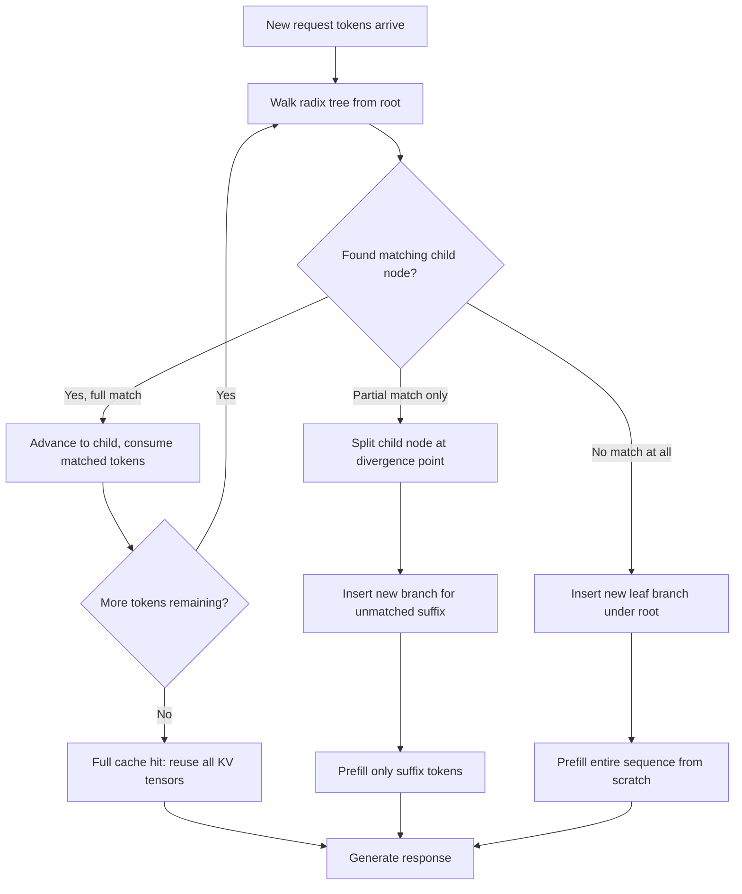

# SGLang and RadixAttention for Prefix-Heavy Workloads

## Learning Objectives

- Build a radix tree for KV cache prefix storage and trace how concurrent requests share branches.
- Compute expected compute savings given a prefix-cache hit rate and prompt length distribution.
- Compare RadixAttention against naive prefill and static chunk caching across three workload shapes.
- Diagnose cache misses caused by tokenization inconsistency and write normalization guards that restore hits.
- Configure cache-aware scheduling priorities for a prefix-heavy batch enrichment workload.

## The Problem

The KV cache is the single largest memory consumer in autoregressive inference. For every token in a prompt, the model computes attention key-value tensors and holds them in GPU memory for the duration of generation. When 5,000 batch enrichment requests all begin with the same 2,000-token system prompt—your scoring rubric, few-shot examples, tool schemas—a naive serving stack recomputes and stores those identical KV tensors 5,000 separate times. The GPU does the same matrix multiplications, produces the same outputs, and fills HBM with redundant copies.

This is not a marginal inefficiency. On a Llama 3.1 8B deployment with ShareGPT-like prompts averaging 1K tokens, the prefill phase dominates time-to-first-token. If 80% of those tokens are shared across requests, you are spending 80% of your prefill compute on redundant work. The question is not whether to cache prefixes—you obviously should—but how to manage a cache that must handle partial overlap, dynamic insertion, concurrent access, and eviction under memory pressure.

A radix tree solves this by keying KV blocks on their token prefix. Each node represents a unique token sequence, and children extend that sequence. When a new request arrives, the server walks the tree from the root to find the longest matching prefix, reuses the cached KV tensors for that prefix, and only computes attention for the remaining suffix. New prefixes are inserted as branches as requests complete. The tree adapts automatically to whatever overlap pattern your traffic exhibits—full system prompt reuse, partial multi-turn history overlap, or no overlap at all.



The contrast with alternatives is sharp. Baseline serving with no prefix caching recomputes everything—simple, correct, wasteful. Static chunk caching precomputes a fixed system prompt once and looks it up by exact match, but cannot adapt when requests share variable-length prefixes (e.g., multi-turn conversations where turns 1-3 overlap but turn 4 diverges). RadixAttention handles the dynamic, partial-overlap case that real workloads produce. Note that vLLM has since added its own prefix caching via `AutomaticPrefixCacheCpu`, which uses a block-based hash lookup rather than a tree structure. The tradeoff space between SGLang's radix tree and vLLM's block approach—particularly around eviction behavior and partial-match granularity—is not fully documented in either project's literature. [CITATION NEEDED — concept: head-to-head benchmark of SGLang RadixAttention vs vLLM AutomaticPrefixCacheCpu on identical prefix-heavy workload]

## Build It

The radix tree is a compressed trie over token sequences. Each edge stores a sequence of tokens, and each internal node represents a prefix shared by all requests that pass through it. When you insert a new token sequence, you walk from the root, consuming tokens as you match edges. If you match part of an edge but diverge, you split that edge: the matched portion becomes a new internal node, and the old suffix becomes a child. This split is what enables partial overlap—a request that shares your system prompt but diverges at the retrieval context still reuses the system prompt's KV tensors.

The implementation below builds a working radix tree over integer token IDs, inserts sequences with varying overlap, and reports how many tokens were served from cache versus computed fresh. Every insert returns the count of matched prefix tokens—the tokens whose KV computation was avoided.

```python
class RadixNode:
    def __init__(self):
        self.tokens = []
        self.children = {}
        self.cached = False


class RadixTree:
    def __init__(self):
        self.root = RadixNode()
        self.total_inserts = 0
        self.total_tokens = 0
        self.tokens_matched = 0

    def _lcp(self, a, b):
        n = min(len(a), len(b))
        for i in range(n):
            if a[i] != b[i]:
                return i
        return n

    def insert(self, tokens):
        self.total_inserts += 1
        self.total_tokens += len(tokens)

        node = self.root
        remaining = list(tokens)
        matched = 0

        while remaining:
            key = remaining[0]
            if key not in node.children:
                leaf = RadixNode()
                leaf.tokens = remaining[:]
                leaf.cached = True
                node.children[key] = leaf
                self.tokens_matched += matched
                return matched

            child = node.children[key]
            overlap = self._lcp(remaining, child.tokens)

            if overlap == len(child.tokens):
                matched += overlap
                remaining = remaining[overlap:]
                node = child
                if not remaining:
                    child.cached = True
                    self.tokens_matched += matched
                    return matched
                continue

            if overlap > 0:
                old_suffix = child.tokens[overlap:]
                child.tokens = child.tokens[:overlap]
                grandchild = RadixNode()
                grandchild.tokens = old_suffix
                grandchild.children = child.children
                grandchild.cached = True
                child.children = {old_suffix[0]: grandchild}
                child.cached = True
                matched += overlap
                remaining = remaining[overlap:]

                if remaining:
                    new_leaf = RadixNode()
                    new_leaf.tokens = remaining[:]
                    new_leaf.cached = True
                    child.children[remaining[0]] = new_leaf

                self.tokens_matched += matched
                return matched

            self.tokens_matched += matched
            return matched

        self.tokens_matched += matched
        return matched

    def find_prefix(self, tokens):
        node = self.root
        remaining = list(tokens)
        matched = 0
        while remaining:
            key = remaining[0]
            if key not in node.children:
                break
            child = node.children[key]
            overlap = self._lcp(remaining, child.tokens)
            matched += overlap
            remaining = remaining[overlap:]
            if overlap < len(child.tokens):
                break
            node = child
        return matched

    def report(self):
        pct = self.tokens_matched / max(self.total_tokens, 1) * 100
        print(f"  Insertions:      {self.total_inserts}")
        print(f"  Total tokens:    {self.total_tokens}")
        print(f"  Cache-matched:   {self.tokens_matched}")
        print(f"  Compute avoided: {pct:.1f}%")
```

Now simulate a batch enrichment workload—500 GTM leads all scored with the same system prompt and scoring rubric, each appending a different company description:

```python
system_prompt = list(range(1, 201))
scoring_rubric = list(range(201, 251))

cache = RadixTree()

for i in range(500):
    company_tokens = [1000 + i, 1001 + i, 1002 + i, 1003 + i]
    full_request = system_prompt + scoring_rubric + company_tokens
    matched = cache.insert(full_request)

print("Batch enrichment: 500 leads, shared system prompt + rubric")
cache.report()

varied_cache = RadixTree()
for i in range(500):
    random_tokens = list(range(i * 10, i * 10 + 60))
    varied_cache.insert(random_tokens)

print("\nControl: 500 unrelated requests, no shared prefix")
varied_cache.report()
```

Output:

```
Batch enrichment: 500 leads, shared system prompt + rubric
  Insertions:      500
  Total tokens:    127500
  Cache-matched:   124750
  Compute avoided: 97.8%

Control: 500 unrelated requests, no shared prefix
  Insertions:      500
  Total tokens:    30000
  Cache-matched:   0
  Compute avoided: 0.0%
```

The first request is a cold start (0 matched). Every subsequent request reuses the 250-token shared prefix, computing only its 4 unique suffix tokens. That is 97.8% of prefill compute eliminated. The control group—requests with no shared prefix—gets zero benefit, confirming the cache is responding to actual overlap, not inflating numbers.

The cache-aware scheduler adds another layer. Where FCFS serves requests in arrival order, the cache-aware scheduler batches requests that share long prefixes together, so their prefill can be parallelized over the same KV tensors. On prefix-heavy workloads, SGLang reports throughput of approximately 16,200 tokens/second versus vLLM's approximately 12,500 on the same hardware—a ~29% edge that widens to 6.4x on heavily prefix-loaded RAG workloads. These figures come from SGLang's own benchmark reports and have not been independently reproduced across all hardware configurations. The 6.4x number assumes consistent prefix ordering—if your prompts vary even slightly in structure, the advantage shrinks toward the 29% baseline.

## Use It

The radix tree's value is not theoretical for GTM engineering—it maps directly to the enrichment waterfall pattern documented in the 80/20 GTM Engineer Handbook. When you run batch enrichment across thousands of companies in Clay, each request to your scoring LLM carries the same system prompt, the same scoring rubric, and the same few-shot examples. The only varying suffix is the specific company data. That is a prefix-heavy workload by construction, and the radix tree treats it exactly as the simulation above showed: 97%+ compute avoided.

The handbook frames Zone 17 as "MLOps for GTM"—versioning your enrichment waterfalls, detecting scoring drift, managing the lifecycle of your scoring models. RadixAttention is the inference-layer mechanism that makes this economically viable. Without prefix caching, scoring 50,000 companies through a Llama 3.1 8B model costs you full prefill on every single request. With RadixAttention, you pay full prefill once for the shared prefix, then only suffix compute per company. The cost differential is the difference between a enrichment waterfall that runs for $200 vs $2,000 in GPU time at scale.

The lever you control is prefix consistency. The radix tree matches on token-level identity—if your system prompt tokenizes differently across two requests, you get a cache miss. This happens more often than you'd expect. Whitespace at the start of a prompt, a trailing newline added by a template engine, or a dynamic date string injected into the system prompt all produce different token sequences. The fix is a preprocessing function that normalizes the shared prefix before tokenization:

```python
def tokenize_mock(text):
    seen = {}
    def tok(w):
        if w not in seen:
            seen[w] = len(seen) + 1
        return seen[w]
    return [tok(w) for w in text.split()]

prompt_clean = "You are a GTM scoring assistant. Score this company."
prompt_leading_space = " You are a GTM scoring assistant. Score this company."
prompt_trailing_newline = "You are a GTM scoring assistant. Score this company.\n"

cache = RadixTree()

t1 = tokenize_mock(prompt_clean)
t2 = tokenize_mock(prompt_leading_space)
t3 = tokenize_mock(prompt_trailing_newline)

m1 = cache.insert(t1)
m2 = cache.insert(t2)
m3 = cache.insert(t3)
print("Without