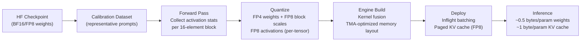

# TensorRT-LLM on Blackwell with FP8 and NVFP4

## Learning Objectives

1. Compute the HBM footprint of a frontier-scale model under BF16, FP8, and NVFP4 and identify where memory savings originate.
2. Trace the TensorRT-LLM compilation pipeline from HuggingFace checkpoint through calibration, quantization, and engine build.
3. Build a calibration configuration for NVFP4 quantization specifying dataset path, sequence length, and sample count.
4. Compare FP8 and NVFP4 serving economics — tokens/second, VRAM, cost-per-million-tokens — using benchmark output.
5. Evaluate when TRT-LLM's NVIDIA lock-in is justified by the throughput gap versus portable alternatives on Hopper.

## The Problem

The frontier of inference economics in 2026 is tokens-per-dollar. Four stacked choices determine the answer: hardware generation (Hopper H100/H200 versus Blackwell B200/GB200), precision regime (BF16 → FP8 → NVFP4), serving engine (vLLM versus SGLang versus TensorRT-LLM), and orchestration strategy (plain batching versus disaggregated prefill/decode versus Dynamo). Each layer multiplies the others. You cannot pick NVFP4 without Blackwell, and disaggregated serving delivers diminishing returns if memory bandwidth is already saturated by FP8 weights.

On Hopper with vLLM, a 120B-parameter MoE model runs at roughly $0.09 per million tokens. On Blackwell with TensorRT-LLM and Dynamo orchestration, the same model runs at roughly $0.012 per million tokens — a 7× economic gap. SemiAnalysis InferenceX measured these numbers in Q1–Q2 2026 benchmark cycles. Roughly half of that gap comes from the precision regime shift: NVFP4 stores each weight parameter in 4 bits instead of FP8's 8 bits, halving the memory bandwidth consumed per decoded token. The other half comes from kernel fusion, multi-token prediction, and disaggregated serving — all of which TensorRT-LLM orchestrates on Blackwell's hardware units.

The mechanical difference between FP8 and NVFP4 is compact. FP8 uses E4M3 or E5M2 encoding — 1 sign bit, 4 or 5 exponent bits, 3 or 2 mantissa bits — at 1 byte per parameter. NVFP4 uses E2M1 encoding — 1 sign bit, 2 exponent bits, 1 mantissa bit — at 0.5 bytes per parameter, plus a shared block-scale factor stored in FP8. Same floating-point lineage, half the bits, a new scaling mechanism bolted on. If you deploy LLMs at any scale, this changes your cost-per-token arithmetic because memory bandwidth, not compute, is the binding constraint on autoregressive decode.

## The Concept

NVFP4 is a block-scaled floating-point format. Standard integer quantization (INT4) maps weights to a uniform grid with a single global scale factor. This works adequately for weights with narrow dynamic range but destroys accuracy when outlier values stretch the grid. Block-scaled FP4 takes a different approach: it divides weights into blocks of 16 elements, computes a shared FP8 scale factor per block, and stores each element as a 4-bit E2M1 value relative to that block's scale. The per-block scale preserves local dynamic range that a single global scale cannot. The trade-off is storage overhead — one FP8 scale per 16 elements adds 0.5 bytes per block, or 0.03125 bytes per element — bringing effective storage to 0.53125 bytes per parameter rather than the theoretical 0.5.

The precision landscape on Blackwell has three regimes that matter for inference. BF16 at 2 bytes per parameter is the accuracy baseline — models trained and evaluated in BF16 represent the reference quality. FP8 (E4M3) at 1 byte per parameter introduces roughly 1% perplexity degradation and was the production standard on Hopper. NVFP4 (E2M1 with block scaling) at 0.53125 bytes per parameter introduces 2–5% perplexity degradation depending on the model and calibration quality, and requires Blackwell hardware. There is no free lunch at lower precision — the question is whether the perplexity cost is acceptable for your downstream task.

A critical constraint: NVFP4 requires calibration data. You cannot cast weights to FP4 and expect usable output. The block-scale factors are not stored in the model checkpoint — they are computed by running representative data through the model during a calibration step and collecting per-block activation statistics. The quality of your calibration dataset directly determines output quality. If your calibration data does not match your production distribution, perplexity degradation will exceed the 2–5% range and output coherence can collapse on out-of-distribution inputs.



The diagram above traces the full compilation path. Notice that FP8 does not disappear when you adopt NVFP4. The KV cache and attention computations stay in FP8 because they require more dynamic range than E2M1 provides. A 4-bit exponent-mantissa pair with only 1 mantissa bit can represent values at magnitudes {0, 0.5, 1, 1.5, 2, 3, 4, 6} (and their negatives) — that is 15 levels total including zero. Attention scores and KV cache values have distributions that need finer granularity than 15 levels provide, so they remain in FP8's 256-level E4M3 representation. The Blackwell architecture is designed to mix precisions within the same kernel: NVFP4 for the matrix multiplies, FP8 for the attention path.

The following code demonstrates the quantization mechanism at toy scale. It shows how per-tensor FP8 quantization differs from per-block NVFP4 quantization on the same input tensor, and prints the quantization error for each:

```python
import math

def quantize_per_tensor_fp8(values, num_levels=256):
    max_abs = max(abs(v) for v in values) or 1.0
    scale = max_abs / (num_levels // 2 - 1)
    result = [round(v / scale) * scale for v in values]
    return result

def quantize_block_scaled_fp4(values, block_size=16, num_levels=16):
    result = []
    block_scales = []
    for i in range(0, len(values), block_size):
        block = values[i:i + block_size]
        block_max = max(abs(v) for v in block) or 1.0
        scale = block_max / (num_levels // 2 - 1)
        block_scales.append(scale)
        for v in block:
            result.append(round(v / scale) * scale)
    return result, block_scales

original = []
for i in range(32):
    segment = i // 16
    base = 0.01 if segment == 0 else 10.0
    original.append(base * (1 + 0.3 * ((i % 16) / 15.0 - 0.5)))

fp8_result = quantize_per_tensor_fp8(original)
fp4_result, scales = quantize_block_scaled_fp4(original)

def mean_abs_error(orig, quant):
    return sum(abs(a - b) for a, b in zip(orig, quant)) / len(orig)

def max_abs_error(orig, quant):
    return max(abs(a - b) for a, b in zip(orig, quant))

print(f"{'Metric':<30} {'FP8 (per-tensor)':<20} {'NVFP4 (per-block)':<20}")
print("-" * 70)
print(f"{'Mean absolute error':<30} {mean_abs_error(original, fp8_result):<20.6f} {mean_abs_error(original, fp4_result):<20.6f}")
print(f"{'Max absolute error':<30} {max_abs_error(original, fp8_result):<20.6f} {max_abs_error(original, fp4_result):<20.6f}")
print(f"{'Bytes per element':<30} {'1.0':<20} {'0.53125':<20}")
print(f"{'Block scale factors':<30} {'1 (global)':<20} {f'{len(scales)} (per-16-block)':<20}")
print()

small_block = original[:16]
large_block = original[16:32]
print(f"Block 0 range: [{min(small_block):.4f}, {max(small_block):.4f}]  scale={scales[0]:.6f}")
print(f"Block 1 range: [{min(large_block):.4f}, {max(large_block):.4f}]  scale={scales[1]:.6f}")
print(f"Global FP8 scale would be: {max(abs(v) for v in original) / 127:.6f}")
print()
print("Block scaling lets each block use its own dynamic range.")
print("Block 0 values are ~100x smaller than Block 1, so block 0 gets")
print("a scale ~100x smaller, preserving precision for small values.")
```

## Build It

The TensorRT-LLM compilation pipeline has five stages. First, it loads a HuggingFace checkpoint — weights in BF16, FP8, or any format the `transformers` library can parse. Second, it runs a calibration pass: forward inference on representative data to collect per-block activation statistics. Third, it quantizes — applying per-block FP4 scaling to weights and per-tensor FP8 scaling to activations. Fourth, it builds a TensorRT engine: this is where kernel fusion, memory layout optimization for Blackwell's Tensor Memory Accelerator (TMA) units, and graph-level optimizations happen. Fifth, you deploy the engine with inflight batching and paged KV cache.

The engine configuration has four categories of knobs that determine behavior. The `quant_mode` flag selects between FP8 and FP4 precision regimes. The `calib_dataset` path points to representative samples used for scale computation — this is where you control calibration quality. The `max_batch_size` and `max_seq_len` parameters pre-allocate KV cache memory — setting these too high wastes VRAM, too low causes OOM errors at runtime under concurrent load. The `world_size` and `tp_size` parameters control tensor parallelism across GPUs — the engine is compiled for a specific GPU topology and cannot be reconfigured without rebuilding.

Here is a memory footprint calculator that computes HBM requirements across precision regimes. This is the arithmetic you need before touching any tooling — if a model does not fit in VRAM at a given precision, no amount of kernel optimization will save you:

```python
def compute_footprint(num_params_b, bytes_per_param, num_gpus=8, kv_cache_gb=0):
    weight_bytes = num_params_b * 1e9 * bytes_per_param
    weight_gb = weight_bytes / 1e9
    total_gb = weight_gb + kv_cache_gb
    per_gpu_gb = total_gb / num_gpus
    return total_gb, per_gpu_gb

models = {
    "70B Dense": 70e9,
    "120B MoE (12B active)": 120e9,
    "405B MoE (45B active)": 405e9,
}

precisions = {
    "BF16 (2.0 B/param)": 2.0,
    "FP8 E4M3 (1.0 B/param)": 1.0,
    "NVFP4 E2M1 (0.53125 B/param)": 0.53125,
}

gpu_mem = {"H100": 80, "H200": 141, "B200": 192}

print("=" * 100)
print("WEIGHT FOOTPRINT (excluding KV cache)")
print("=" * 100)
print(f"{'Model':<28} {'Precision':<32} {'Total GB':<10} {'8×H100':<10} {'8×H200':<10} {'8×B200':<10}")
print("-" * 100)
for model_name, num_params in models.items():
    for prec_name, bpp in precisions.items():
        total, per_gpu = compute_footprint(num_params, bpp, 8)
        fits = lambda gpu: f"{per_gpu:.1f} {'✓' if per_gpu < gpu_mem[gpu] else '✗'}"
        print(f"{model_name:<28} {prec_name:<32} {total:<10.1f} {fits('H100'):<10} {fits('H200'):<10} {fits('B200'):<10}")
    print()

kv_overhead_fp8 = 40
print("=" * 100)
print(f"WITH FP8 KV CACHE (+{kv_overhead_fp8} GB) — 120B MoE model")
print("=" * 100)
num_params = models["120B MoE (12B active)"]
for prec_name, bpp in precisions.items():
    total, per_gpu = compute_footprint(num_params, bpp, 8, kv_overhead_fp8)
    print(f"  {prec_name:<32} Total: {total:.1f} GB  Per-GPU (8×B200): {per_gpu:.1f} GB  Fits: {'✓' if per_gpu < 192 else '✗'}")
```

Run this and observe which model/precision combinations fit on 8×H100 (640 GB total) versus 8×B200 (1536 GB total). The 405B model in BF16 does not fit on either — you need NVFP4 on Blackwell to serve it on 8 GPUs. That is the entire argument for NVFP4 in one table.

Next, the calibration configuration. This JSON structure mirrors what TensorRT-LLM's Python API expects. The key fields are `quant_mode` (controls FP8 vs FP4), `calib_dataset` (path to representative prompts), and the build parameters that determine engine shape:

```python
import json

calibration_config = {
    "model": {
        "checkpoint_dir": "/models/Meta-Llama-3-70B",
        "architecture": "llama",
        "dtype": "bfloat16",
    },
    "calibration": {
        "dataset_path": "./data/calibration_prompts.jsonl",
        "num_samples": 512,
        "max_seq_length": 4096,
        "data_type": "fp8",
    },
    "quantization": {
        "quant_mode": "nvfp4",
        "kv_cache_quant_mode": "fp8",
        "calibrate_kv_cache": True,
    },
    "build": {
        "max_batch_size": 256,
        "max_seq_len": 8192,
        "max_num_tokens": 8192,
        "tp_size": 8,
        "pp_size": 1,
        "world_size": 8,
        "gpus_per_node": 8,
    },
    "runtime": {
        "inflight_batching": True,
        "paged_kv_cache": True,
        "kv_cache_pool_size_gb": 40,
    },
}

print(json