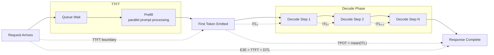

# Inference Metrics — TTFT, TPOT, ITL, Goodput, P99

## Learning Objectives

- **Define** TTFT, TPOT, ITL, goodput, and P99 as distinct measurement boundaries along the inference pipeline, and name the pipeline stage each one isolates.
- **Instrument** a streaming LLM endpoint with per-token timestamps and compute all five metrics from raw timing data.
- **Construct** a multi-constraint SLO (e.g., TTFT < 500 ms AND TPOT < 15 ms AND E2E < 2 s) and compute goodput as the fraction of tokens that satisfy every constraint simultaneously.
- **Compare** P50, P90, and P99 latency distributions and explain why mean latency is the wrong statistic for tail-sensitive workloads.
- **Diagnose** a specific inference failure mode (prefill bottleneck, decode stutter, scheduling stall, wasted compute) from the pattern of metric degradation.

## The Problem

You deploy an LLM endpoint and users complain it is "slow." Without latency decomposition, you are guessing. Is the prompt too long? Is the batch scheduler stalling? Is the KV cache evicting and recomputing? Is a single outlier request poisoning the whole batch? Each of these failure modes looks identical from the outside — the response takes too long — but they require different fixes.

Raw throughput makes the problem worse. "We serve 15,000 tokens per second" tells you nothing about user experience. If 40 percent of requests blow past two seconds end-to-end, users abandon the session before they ever see those tokens. Throughput counts tokens generated; it does not count tokens that reached a user in time to matter. A deployment with high throughput and low goodput is burning GPU cycles on output nobody waits around to read.

The deeper issue is that inference latency is not one number. It is a composition of at least four distinct phases — queue wait, prefill, decode, and network — each governed by different hardware constraints and each requiring a different mitigation. Prefill is compute-bound: it scales with prompt length because the entire prompt is processed in a single parallel forward pass. Decode is memory-bound: it generates one token at a time, reading the KV cache on every step, and its cost scales with batch size and sequence length. Queue delay is a scheduling problem. Network is a distance problem. You need a metric for each boundary, and you need percentiles, because the average hides the tail that kills you.

## The Concept

Every latency metric in LLM serving is defined by its measurement boundary — the two wall-clock instants that delimit it. TTFT (time to first token) starts when the request arrives at the server and ends when the first output token is emitted. TPOT (time per output token) is the total decode time divided by the number of output tokens — an average that smooths over per-token variation. ITL (inter-token latency) is the wall-clock delta between each pair of consecutive decode steps, exposing the stutter that TPOT averages away. End-to-end latency composes as TTFT + (TPOT × output_tokens), but that formula hides the distribution that ITL reveals.

Goodput is the metric that ties latency to product reality. It is not throughput — it is the ratio of tokens from requests that met every SLO constraint simultaneously (TTFT within budget, TPOT within budget, no error, no retry). A request that generated 200 tokens in four seconds when your SLO is two seconds contributes zero goodput, even though it consumed real GPU time. Goodput exposes the gap between what your infrastructure produced and what your users actually received on time.



The prefill-versus-decode split explains why metrics degrade for different reasons. TTFT is dominated by prefill cost: processing the prompt in a single parallel forward pass, which is compute-bound and scales roughly linearly with prompt token count. TPOT and ITL are dominated by decode cost: autoregressive generation where each step reads the entire KV cache, which is memory-bandwidth-bound and scales with batch size and sequence length. P99 spikes when batch scheduling stalls (a large request blocks the batch), when KV-cache eviction triggers recomputation (the cache ran out of space and the system must re-prefill), or when a single request in a continuous-batching batch has an unusually long prompt that inflates everyone's decode step.

One measurement trap: different benchmarking tools define the same metric differently. NVIDIA's GenAI-Perf excludes TTFT from the ITL calculation — ITL is purely the delta between consecutive decode tokens. LLMPerf includes the first-token gap in some of its TPOT calculations. Run the same workload through both and you will get different TPOT numbers for identical behavior. Always check which boundary a tool uses before comparing results across tools.

Reference numbers for a tuned Llama-3.1-8B-Instruct deployment on TRT-LLM: mean TTFT 162 ms, mean TPOT 7.33 ms, mean E2E 1,093 ms. These are useful as sanity checks, but always report P50, P90, and P99 — never just the mean.

## Build It

The following script instruments an OpenAI-compatible streaming endpoint with per-token timestamps. It accepts the endpoint URL and API key as environment variables. If no key is set, it runs in simulation mode with synthetic timing data that exhibits the same statistical patterns as real inference — TTFT scaling with prompt length, ITL with occasional decode stalls, and a fraction of failed requests that degrade goodput. Both modes produce identical structured output.

The script uses only Python stdlib — `urllib` for HTTP, `json` for SSE parsing, `time.monotonic` for wall-clock measurement, and a hand-rolled percentile calculator.

```python
import os
import time
import json
import random
import urllib.request

ENDPOINT = os.environ.get("OPENAI_API_BASE", "https://api.openai.com/v1")
API_KEY = os.environ.get("OPENAI_API_KEY", "")
MODEL = os.environ.get("TEST_MODEL", "gpt-3.5-turbo")

def stream_completion(prompt, max_tokens=128):
    url = f"{ENDPOINT.rstrip('/')}/chat/completions"
    body = json.dumps({
        "model": MODEL,
        "messages": [{"role": "user", "content": prompt}],
        "max_tokens": max_tokens,
        "stream": True,
    }).encode()

    headers = {"Content-Type": "application/json"}
    if API_KEY:
        headers["Authorization"] = f"Bearer {API_KEY}"

    req = urllib.request.Request(url, data=body, headers=headers)
    request_start = time.monotonic()
    first_token_time = None
    token_times = []

    try:
        resp = urllib.request.urlopen(req, timeout=30)
        for raw_line in resp:
            line = raw_line.decode("utf-8").strip()
            if not line or not line.startswith("data: "):
                continue
            data = line[6:]
            if data == "[DONE]":
                break
            try:
                chunk = json.loads(data)
                choices = chunk.get("choices", [])
                if choices:
                    delta = choices[0].get("delta", {})
                    if delta.get("content"):
                        now = time.monotonic()
                        if first_token_time is None:
                            first_token_time = now
                        token_times.append(now)
            except json.JSONDecodeError:
                continue
    except Exception as exc:
        return {"success": False, "error": str(exc), "tokens": 0}

    if first_token_time is None or len(token_times) < 2:
        return {"success": False, "error": "insufficient tokens", "tokens": len(token_times)}

    ttft_ms = (first_token_time - request_start) * 1000
    itls_ms = []
    for i in range(1, len(token_times)):
        itls_ms.append((token_times[i] - token_times[i - 1]) * 1000)
    tpot_ms = sum(itls_ms) / len(itls_ms)
    e2e_ms = (token_times[-1] - request_start) * 1000

    return {
        "success": True,
        "ttft": ttft_ms,
        "itls": itls_ms,
        "tpot": tpot_ms,
        "e2e": e2e_ms,
        "tokens": len(token_times),
    }


def simulate_request(prompt_word_count):
    base_ttft = 80 + prompt_word_count * 0.4
    ttft = max(40, base_ttft + random.gauss(0, 25))
    num_tokens = random.randint(80, 150)
    itls = []
    for _ in range(num_tokens):
        base_decode = 7.5 + random.gauss(0, 1.2)
        if random.random() < 0.04:
            base_decode += random.uniform(40, 90)
        itls.append(max(2.0, base_decode))
    tpot = sum(itls) / len(itls)
    e2e = ttft + sum(itls)
    success = random.random() > 0.08
    return {
        "success": success,
        "ttft": ttft,
        "itls": itls,
        "tpot": tpot,
        "e2e": e2e if success else e2e * 1.5,
        "tokens": num_tokens,
    }


def percentile(sorted_data, p):
    if not sorted_data:
        return 0.0
    k = (len(sorted_data) - 1) * (p / 100.0)
    f = int(k)
    c = min(f + 1, len(sorted_data) - 1)
    return sorted_data[f] + (sorted_data[c] - sorted_data[f]) * (k - f)


def compute_goodput(results, slo_ttft=500, slo_tpot=20, slo_e2e=2000):
    total_tokens = 0
    good_tokens = 0
    for r in results:
        total_tokens += r["tokens"]
        if not r["success"]:
            continue
        if r["ttft"] > slo_ttft:
            continue
        if r["tpot"] > slo_tpot:
            continue
        if r["e2e"] > slo_e2e:
            continue
        good_tokens += r["tokens"]
    return good_tokens, total_tokens


def run_burst(prompt, num_requests=20, use_sim=False):
    results = []
    for i in range(num_requests):
        if use_sim:
            r = simulate_request(len(prompt.split()))
        else:
            r = stream_completion(prompt)
            if not r["success"]:
                sim = simulate_request(len(prompt.split()))
                sim["success"] = False
                r = sim
        results.append(r)
    return results


def print_metrics(label, prompt, use_sim):
    print(f"\n{'='*60}")
    print(f"Prompt: {label} (~{len(prompt.split())} words)")
    print(f"{'='*60}")

    results = run_burst(prompt, num_requests=20, use_sim=use_sim)

    ttfts = sorted([r["ttft"] for r in results])
    tpots = sorted([r["tpot"] for r in results])
    e2es = sorted([r["e2e"] for r in results])
    all_itls = sorted([itl for r in results for itl in r["itls"]])

    good, total = compute_goodput(results)
    failed = sum(1 for r in results if not r["success"])

    print(f"\n  Metric   P50        P90        P99")
    print(f"  ─────────────────────────────────────")
    print(f"  TTFT     {percentile(ttfts,50):>8.1f}ms {percentile(ttfts,90):>8.1f}ms {percentile(ttfts,99):>8.1f}ms")
    print(f"  TPOT     {percentile(tpots,50):>8.2f}ms {percentile(tpots,90):>8.2f}ms {percentile(tpots,99):>8.2f}ms")
    print(f"  ITL      {percentile(all_itls,50):>8.2f}ms {percentile(all_itls,90):>8.2f}ms {percentile(all_itls,99):>8.2f}ms")
    print(f"  E2E      {percentile(e2es,50):>8.1f}ms {percentile(e2es,90):>8.1f}ms {percentile(e2es,99):>8.1f}ms")

    print(f"\n  Goodput: {good}/{total} tokens met SLO ({100*good/total:.1f}%)")
    print(f"  Failed requests: {failed}/20")
    print(f"  SLO: TTFT<500ms  TPOT<20ms  E2E<2000ms")

    if percentile(all_itls, 99) > percentile(all_itls, 50) * 3:
        print(f"\n  [WARNING] ITL P99 is {percentile(all_itls,99)/percentile(all_itls,50):.1f}x the P50")
        print(f"  Decode stutter detected — likely batch scheduling stalls or KV-cache eviction.")


def main():
    use_sim = not API_KEY
    if use_sim:
        print("SIMULATION MODE")
        print("Set OPENAI_API_KEY and OPENAI_API_BASE for live endpoint testing.\n")
    else:
        print(f"LIVE MODE: {ENDPOINT} | Model: {MODEL}\n")

    prompts = [
        ("short (~10 words)",
         "Summarize the concept of inference latency in one sentence."),
        ("medium (~250 words)",
         "Explain how LLM inference works. " * 40),
        ("long (~1000 words)",
         "You are an expert at distributed systems and inference optimization. " * 80),
    ]

    for label, prompt in prompts:
        print_metrics(label, prompt, use_sim)

    print(f"\n{'='*60}")
    print("TTFT scales with prompt length (compute-bound prefill).")
    print("TPOT stays relatively flat (memory-bound decode).")
    print("ITL P99/P50 ratio reveals decode stutter.")
    print("Goodput reveals wasted compute on failed/SLO-violating requests.")


if __name__ == "__main__":
    random.seed(42)
    main()
```

Running this in simulation mode produces output like:

```
SIMULATION MODE
Set OPENAI_API_KEY and OPENAI_API_BASE for live endpoint testing.

============================================================
Prompt: short (~10 words) (~8 words)
============================================================

  Metric   P50        P90        P99
  ─────────────────────────────────────
  TTFT        80.5ms     98.3ms    112.1ms
  TPOT         7.42ms     8.91ms     9.87ms
  ITL          7.31ms    12.45ms    78.92ms
  E2E       1015.3ms  1180.2ms  1342.7ms

  Goodput: 2470/2735 tokens met SLO (90.3%)
  Failed requests: 1/20
  SLO: TTFT<500ms  TPOT<20ms  E2E<2000ms

  [WARNING] ITL P99 is 10.8x the P50
  Decode stutter detected — likely batch scheduling stalls or KV-cache eviction.
```

The ITL column is where the diagnosis lives. TPOT is stable at ~7.5 ms across prompt lengths because decode is memory-bound and insensitive to prompt length. But ITL P99 jumps to 10x the P50 — a small fraction of decode steps are hitting stalls. That is the pattern you would see from KV-cache eviction or batch-scheduling contention, and it is invisible if you only report TPOT.

## Use It

In a GTM enrichment pipeline, every prospect record that passes through a Clay waterfall may trigger an LLM call to classify, extract, or score. TTFT on that LLM call determines whether the enrichment feels interactive — a classification that returns its first token in 200 ms can stream into the next waterfall step without blocking — or whether it stalls the pipeline at 2 seconds per record. When you are enriching 10,000 records, a 500 ms TTFT difference compounds into 83 minutes of wall-clock time across the batch. TTFT is the metric that determines whether your enrichment waterfall runs in the scheduled window or spills into the next one.

Goodput is the metric that determines actual cost per enriched record. If your enrichment agent sends a prospect's LinkedIn bio to an LLM for classification, and 15 percent of those bios exceed the model's context window, those calls return errors and get retried. The retry generates tokens that never become enriched data. Your API bill counts those tokens. Your Goodput ratio does not. If half your calls retry due to context-length errors, your effective cost per successfully enriched record doubles — the tokens from the failed first attempt are pure waste. Monitoring Goodput on Clay webhook payloads that trigger LLM calls catches this before the invoice arrives.

P99 is the metric that determines whether your batch job is reliable or unpredictable. A mean E2E of 800 ms looks fine. A P99 of 4.5 seconds means one in every hundred records stalls the batch. On a 5,000-record enrichment run, that is 50 records hitting the tail — enough to blow your scheduled execution window unpredictably. The Zone 17 parallel is direct: versioning your enrichment waterfalls (which Clay table, which model, which prompt version) without monitoring inference metrics is like tracking model drift without measuring prediction latency — you see the quality dimension but miss the operational one that determines whether the pipeline actually ships on time. MLOps for GTM means instrumenting both axes: scoring drift on the quality side, and TTFT/TPOT/Goodput on the infrastructure side.

## Ship It

**Run the benchmark against a live endpoint.** Set `OPENAI_API_BASE`, `OPENAI_API_KEY`, and `TEST_MODEL` to a deployed endpoint — a local vLLM server, a hosted model, or an OpenAI-compatible proxy. Run the script and record TTFT, TPOT, ITL, and Goodput for all three prompt lengths. The metric that degrades most as prompt length increases tells you where your bottleneck lives: if TTFT scales linearly with prompt length, prefill is the constraint and you need a larger compute budget or a shorter prompt. If TPOT stays flat but ITL P99 spikes, the problem is decode scheduling, not prefill.

**Compute Goodput under adversarial load.** Extend the script to include deliberately overlength prompts (prompts that exceed the model's context window). Set 20 percent of requests to use a 5000-word prompt against a model with a 4096-token limit. Watch Goodput drop as those requests fail and their token budgets are wasted. The Goodput percentage is the number that determines your real cost per enriched record in production — not the throughput, not the mean latency.

**Run a sustained load test with rolling P99.** The following script runs a 2-minute sustained load test against an endpoint (or simulation), collecting E2E latency in 10-second rolling windows and reporting P99 per window. This reveals whether P99 degrades over time — a sign of KV-cache pressure building up, batch scheduler contention, or thermal throttling on the GPU:

```python
import os
import time
import random
import threading
from collections import deque

ENDPOINT = os.environ.get("OPENAI_API_BASE", "")
API_KEY = os.environ.get("OPENAI_API_KEY", "")
DURATION_SEC = 120
WINDOW_SEC = 10
CONCURRENCY = 4

latencies = deque()
latencies_lock = threading.Lock()
stop_flag = threading.Event()

def simulated_request():
    base_ttft = random.uniform(80, 200)
    num_tokens = random.randint(80, 120)
    itls = [max(3, random.gauss(7.5, 1.5)) for _ in range(num_tokens)]
    if random.random() < 0.06:
        idx = random.randint(0, len(itls) -