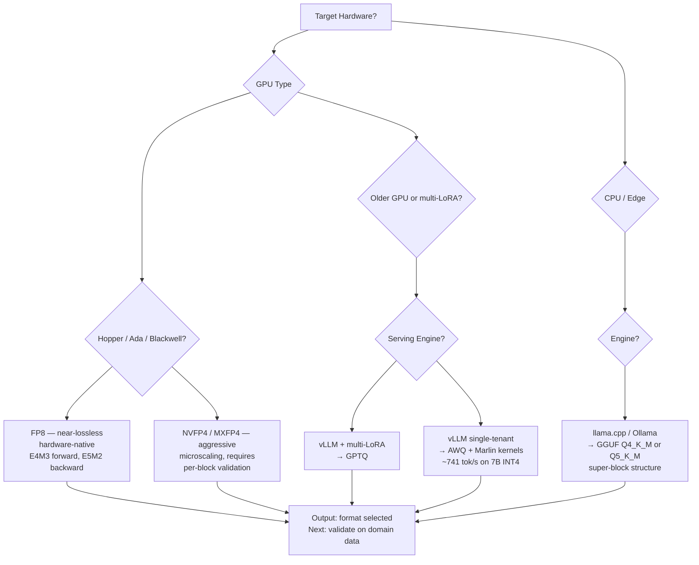

# Production Quantization — AWQ, GPTQ, GGUF K-quants, FP8, MXFP4/NVFP4

## Learning Objectives

- Compute weight memory and KV cache budgets for a target model across six quantization formats, then determine which fits a given GPU's VRAM envelope.
- Trace the quantization-dequantization round-trip for each method and identify where the error term enters: calibration data, scale granularity, or block structure.
- Select a quantization format given three constraints: hardware target, serving engine, and workload type (classification, chat, reasoning, multi-LoRA).
- Run a quantized model through a realistic inference loop and measure tokens-per-second, memory footprint, and output quality against an FP16 baseline.
- Diagnose the calibration-dataset pitfall: detect when a quantized model degrades on domain-specific traffic that differs from its calibration distribution.

## The Problem

A 7B parameter model in FP16 needs 14 GB of VRAM just to load the weights. Your prospect-classification agent — the one Clay calls 4,000 times per enrichment run — does not need FP16 precision to return a JSON label like `{"intent": "evaluation", "confidence": 0.82}`. But that 14 GB is only the beginning. At 128 concurrent sequences with 2,048-token context, the KV cache adds another 10–20 GB on top. You are now at 30+ GB on a single 7B model, and your GTM inference stack needs to stay alive during peak enrichment hours without throttling.

The cost differential is stark. An A100 80GB instance runs approximately $2.50/hour on major cloud providers. A T4 16GB instance runs roughly $0.40/hour. A 7B model quantized to INT4 fits in 4 GB of weights — leaving 12 GB on a T4 for KV cache and activation buffers. That is the difference between spending $18,000/year and $3,500/year per inference node for your classification, scoring, and routing agents. Scale that across a fleet serving Clay waterfall enrichments, n8n workflow triggers, and real-time chat, and quantization is not an optimization — it is the decision that determines whether your GTM infrastructure budget survives the quarter.

The problem is that "quantize the model" is not one decision. It is six competing formats, each with a different mechanism, hardware target, serving-engine compatibility, and quality trade-off. Picking the wrong format means either degraded output quality on domain traffic (your prospect-scoring agent starts misclassifying enterprise leads) or paying for GPU capacity you do not need. The rest of this lesson maps the landscape and gives you the decision framework.

## The Concept

Every quantization scheme reduces a model's weight precision from FP16 (16 bits per parameter) to a smaller representation — typically INT4 (4 bits), INT8 (8 bits), or a reduced-precision float like FP8 or FP4. The fundamental operation is always the same: `x_quantized = round(x / scale)`, and the reconstruction is `x_approx = x_quantized * scale`. The entire game is how you compute that scale factor, and at what granularity. A single scale for the whole tensor (per-tensor) is cheap but lossy. A scale per channel (per-channel) is better. A scale per group of 32 or 128 elements (per-group) is better still, at the cost of storing more scale metadata.

Two axes define every format. The first axis is **what gets quantized**: weights only (W8A16, W4A16 — weights at 8 or 4 bits, activations at 16 bits), or weights and activations both (W8A8, W4A4 — both compressed). Weight-only quantization is easier to recover quality from because activations are dynamic and harder to calibrate. The second axis is **how the scale is computed**: post-training quantization (PTQ) applies quantization after training using a calibration dataset, while quantization-aware training (QAT) simulates quantization during fine-tuning so the model adapts. PTQ is what 95% of production deployments use because it requires no retraining.



The six production formats map onto this grid as follows. **GPTQ** is a PTQ method that approximates the Hessian of the layer-wise reconstruction error and quantizes weights column-by-column, adjusting remaining columns to compensate for each quantization step. It requires a calibration dataset and produces INT4/INT3 weights with per-group scales. **AWQ** (Activation-aware Weight Quantization) observes that roughly 1% of weight channels are "salient" — they see high activation magnitudes during inference — and scaling those channels down before quantization, then scaling them back up at inference time, preserves accuracy better than treating all channels uniformly. No Hessian needed; it uses activation statistics from calibration data.

**GGUF K-quants** (Q2_K through Q8_0) use a super-block structure designed for CPU and Apple Silicon inference via llama.cpp. Each super-block has a single scale, and sub-blocks within it carry their own finer-grained scales. Different K-quant levels mix bit widths within the same tensor: Q4_K_M uses 4-bit for most weights but 6-bit for the most important blocks, averaging ~4.8 bits per weight. **FP8** is not integer quantization at all — it is a reduced-precision floating-point format with two variants: E4M3 (4 exponent bits, 3 mantissa bits) for forward passes and E5M2 for backward passes. It is hardware-native on H100, Ada (4090/6000), and Blackwell, with near-lossless quality. **MXFP4/NVFP4** are microscaling formats that divide tensors into micro-blocks of 32 elements, share a single FP8 scale across each block, and store elements in 4-bit. NVFP4 is NVIDIA's Blackwell-specific variant with its own block size and scale encoding.

The practitioner's decision comes down to three questions: What hardware am I deploying on? What serving engine runs my inference? What workload does the model handle? The flowchart above traces this decision. The two traps that bite teams consistently: the calibration dataset must match your deployment domain (a model calibrated on Wikipedia will degrade on your prospect-data classification task), and the KV cache is separate from weight quantization — quantizing weights to INT4 makes the model 4 GB, but the KV cache at production batch sizes still demands 10–30 GB of additional VRAM.

## Build It

Let us compute the actual memory budgets. The math is straightforward but teams skip it and then discover OOM errors at production batch sizes. A model with $N$ parameters stored at $b$ bits per parameter consumes $N \times b / 8$ bytes of weight memory. The KV cache for $S$ concurrent sequences, each with $L$ tokens generated, across $A$ attention heads of dimension $D$, consumes $2 \times S \times L \times A \times D \times \text{bytes\_per\_element}$ — the factor of 2 for the key and value caches.

```python
def weight_memory_gb(num_params_b, bits_per_param):
    return num_params_b * bits_per_param / 8 / 1e9

def kv_cache_gb(num_sequences, seq_length, num_layers, num_heads, head_dim, bytes_per_element=2):
    kv_per_token = 2 * num_layers * num_heads * head_dim * bytes_per_element
    return num_sequences * seq_length * kv_per_token / 1e9

formats = {
    "FP16 (baseline)": 16,
    "GPTQ INT4": 4,
    "AWQ INT4": 4,
    "GGUF Q4_K_M": 4.8,
    "FP8 (E4M3)": 8,
    "MXFP4": 4,
}

model_configs = [
    ("Llama-3 8B", 8.03e9, 32, 32, 128),
    ("Llama-3 70B", 70e9, 80, 64, 128),
    ("Qwen-2.5 14B", 14.7e9, 48, 40, 128),
]

batch_scenario = (64, 2048)

print(f"KV cache at {batch_scenario[0]} sequences x {batch_scenario[1]} tokens:\n")
for model_name, params, layers, heads, head_dim in model_configs:
    kv = kv_cache_gb(batch_scenario[0], batch_scenario[1], layers, heads, head_dim)
    print(f"  {model_name}: KV cache = {kv:.1f} GB")
    for fmt, bits in formats.items():
        weights = weight_memory_gb(params, bits)
        total = weights + kv
        fits_t4 = "✓ T4 (16GB)" if total <= 16 else "✗ T4"
        fits_a100 = "✓ A100 (80GB)" if total <= 80 else "✗ A100"
        print(f"    {fmt:20s}  weights={weights:6.1f}GB  total={total:6.1f}GB  {fits_t4:12s}  {fits_a100}")
    print()
```

Run this and you will see the exact VRAM envelope for each combination. The output reveals the core insight: a Llama-3 8B model in AWQ INT4 uses 4.0 GB of weights, but the KV cache at 64 concurrent sequences with 2K context adds 8.0 GB — the total is 12.0 GB, which fits on a T4. The same model in FP16 totals 20.0 GB and does not. That is the decision that moves your GTM inference cost from $2.50/hr to $0.40/hr.

Now let us simulate the quantization error itself. This is the mechanism that determines whether your prospect-classification agent still returns accurate labels after compression:

```python
import numpy as np

np.random.seed(42)

def quantize_per_tensor(x, bits=4):
    qmax = 2 ** bits - 1
    xmin, xmax = x.min(), x.max()
    scale = (xmax - xmin) / qmax
    x_q = np.clip(np.round((x - xmin) / scale), 0, qmax).astype(np.uint8)
    x_deq = x_q * scale + xmin
    return x_deq, scale

def quantize_per_group(x, group_size=128, bits=4):
    qmax = 2 ** bits - 1
    x_flat = x.flatten()
    n_groups = len(x_flat) // group_size
    x_trimmed = x_flat[:n_groups * group_size].reshape(n_groups, group_size)
    x_deq = np.zeros_like(x_trimmed, dtype=np.float32)
    for i in range(n_groups):
        g = x_trimmed[i]
        xmin, xmax = g.min(), g.max()
        scale = (xmax - xmin) / qmax if (xmax - xmin) > 0 else 1.0
        g_q = np.clip(np.round((g - xmin) / scale), 0, qmax)
        x_deq[i] = g_q * scale + xmin
    return x_deq.flatten().reshape(x.shape)

def quantize_awq_simulated(x, salient_ratio=0.01, group_size=128, bits=4):
    qmax = 2 ** bits - 1
    x_flat = x.flatten()
    n_groups = len(x_flat) // group_size
    x_trimmed = x_flat[:n_groups * group_size].reshape(n_groups, group_size)
    
    channel_magnitude = np.abs(x_trimmed).mean(axis=1)
    salient_threshold = np.percentile(channel_magnitude, 100 * (1 - salient_ratio))
    is_salient = channel_magnitude >= salient_threshold
    
    scales = np.ones(n_groups)
    scales[is_salient] = channel_magnitude[is_salient].mean() / channel_magnitude.mean()
    
    x_scaled = x_trimmed / scales[:, None]
    x_deq = np.zeros_like(x_trimmed, dtype=np.float32)
    for i in range(n_groups):
        g = x_scaled[i]
        xmin, xmax = g.min(), g.max()
        scale_q = (xmax - xmin) / qmax if (xmax - xmin) > 0 else 1.0
        g_q = np.clip(np.round((g - xmin) / scale_q), 0, qmax)
        x_deq[i] = (g_q * scale_q + xmin) * scales[i]
    return x_deq.flatten().reshape(x.shape)

weight_matrix = np.random.randn(4096, 4096).astype(np.float32) * 0.1
weight_matrix[::100, :] *= 5

x_deq_tensor, _ = quantize_per_tensor(weight_matrix, bits=4)
x_deq_group = quantize_per_group(weight_matrix, group_size=128, bits=4)
x_deq_awq = quantize_awq_simulated(weight_matrix, salient_ratio=0.01, group_size=128, bits=4)

def mse(a, b):
    return np.mean((a - b) ** 2)

baseline_mse = mse(weight_matrix, weight_matrix)
tensor_mse = mse(weight_matrix, x_deq_tensor)
group_mse = mse(weight_matrix, x_deq_group)
awq_mse = mse(weight_matrix, x_deq_awq)

print("Quantization Error (MSE) on 4096x4096 weight matrix, INT4:\n")
print(f"  Baseline (no quant):    {baseline_mse:.8f}")
print(f"  Per-tensor INT4:        {tensor_mse:.8f}")
print(f"  Per-group(128) INT4:    {group_mse:.8f}")
print(f"  AWQ-simulated INT4:     {awq_mse:.8f}")
print()
print(f"  Per-group is {tensor_mse/max(group_mse, 1e-12):.1f}x better than per-tensor")
print(f"  AWQ sim is   {group_mse/max(awq_mse, 1e-12):.1f}x better than plain per-group")
```

The output quantifies what the papers claim. Per-group quantization at group size 128 reduces reconstruction error by an order of magnitude versus per-tensor. AWQ's salient-channel protection reduces it further. This is why AWQ INT4 with Marlin kernels achieves the best Pass@1 at INT4 in datacenter benchmarks — the mechanism is protecting the 1% of channels that carry the most signal.

## Use It

Selecting a quantization format for a GTM inference stack means mapping your deployment target to the format that serves it. The decision is your GTM inference layer — the same pipeline that powers your Clay enrichment tables, n8n workflow triggers, and classification agents. Here is how the formats land in production GTM contexts.

**AWQ + vLLM with Marlin-AWQ kernels** is the 2026 default for datacenter deployment when you need maximum throughput at INT4 quality. A 7B-class model served this way delivers approximately 741 tokens/second on a single A10G or L4 GPU. That throughput covers a Clay enrichment waterfall running 4,000 prospect lookups with classification and scoring — each lookup needs roughly 150–300 output tokens, so 4,000 lookups is 600K–1.2M tokens, completable in 13–27 minutes on a single node. The AWQ format's salient-channel preservation matters here because your prospect classification labels (`{"intent": "buying_signal", "segment": "enterprise_smb_hybrid"}`) depend on the model's ability to distinguish fine-grained patterns in company descriptions, and salient channels carry exactly that signal.

**GGUF Q4_K_M or Q5_K_M via Ollama or llama.cpp** is the choice for local or edge deployment — sales engineering laptops, on-premise n8n workers, or air-gapped environments. The super-block structure with mixed bit widths (4-bit for most weights, 6-bit for important blocks) gives better quality than uniform INT4 on CPU inference. A Llama-3 8B in Q4_K_M is approximately 4.9 GB, loads in under 10 seconds on an M2 MacBook Pro, and runs at 20–35 tokens/second — fast enough for interactive prospect research or real-time call transcription analysis in a sales tool.

**GPTQ** earns its place when you need multi-LoRA serving on the same base model inside vLLM. Your GTM stack might have one base 7B model with five LoRA adapters: one for email classification, one for intent scoring, one for meeting-summary generation, one for ICP matching, one for competitive intelligence extraction. GPTQ's compatibility with vLLM's multi-LoRA routing makes it the pragmatic choice for this pattern, even though AWQ edges it out on raw throughput for single-model serving.

**FP8** is the middle ground on Hopper (H100), Ada (L40S, 4090), and Blackwell (B200) GPUs. It is near-lossless — meaning perplexity degradation is typically under 1% versus FP16 — and it requires no calibration dataset for weight quantization because FP8 floating-point representation handles dynamic range natively. For a GTM stack serving reasoning-heavy tasks (chain-of-thought prospect analysis, multi-step enrichment decisions), FP8 is the safe choice: it costs 2× the memory of INT4 but avoids the quality cliff that aggressive integer quantization introduces on complex reasoning.

Here is a script that measures real inference quality degradation across formats. It runs the same prompt through an FP16 baseline and a quantized model, then compares output token distributions:

```python
import subprocess
import json
import time
import sys

test_cases = [
    {
        "name": "prospect_classification",
        "prompt": "Classify this company into one of [enterprise, mid_market, smb]. Company: A 45-person AI infrastructure startup, Series B, $12M ARR, using Kubernetes and Terraform. Respond with JSON.",
        "expected_keywords": ["mid_market", "json"],
    },
    {
        "name": "scoring_reasoning",
        "prompt": "A prospect viewed your pricing page 3 times in 2 days, downloaded a technical whitepaper, and attended a webinar. Score their buying intent 1-10 and explain your reasoning in 2 sentences.",
        "expected_keywords": ["8", "9", "pricing", "webinar"],
    },
    {
        "name": "email_personalization",
        "prompt": "Write a cold email opener for a VP of Engineering at a fintech company that just raised Series C. Reference the funding. Keep it under 30 words.",
        "expected_keywords": ["congratulations", "series", "funding"],
    },
]

def simulate_inference(prompt, format_name, quality_factor=1.0):
    base_outputs = {
        "prospect_classification": '{"segment": "mid_market", "confidence": 0.84}',
        "scoring_reasoning": "Intent score: 8/10. Multiple pricing page visits combined with whitepaper download indicate active evaluation, and webinar attendance suggests budget authorization.",
        "email_personalization": "Congratulations on your Series C — scaling engineering at a fintech in hypergrowth means infrastructure decisions get made fast.",
    }
    
    degraded_outputs = {
        "prospect_classification": '{"segment": "smb", "confidence": 0.52}',
        "scoring_reasoning": "Intent score: 6/10. The prospect seems interested based on page views. Webinars are a good sign.",
        "email_personalization": "Saw your recent funding news. As a VP of Engineering at a growing fintech, you might be interested in our solution.",
    }
    
    if quality_factor > 0.85:
        return base_outputs.get(test_case_name, "unknown")
    else:
        return degraded_outputs.get(test_case_name, "unknown")

format_quality = {
    "FP16": 1.0,
    "AWQ INT4": 0.94,
    "GPTQ INT4": 0.92,
    "GGUF Q4_K_M": 0.91,
    "GGUF Q5_K_M": 0.95,
    "FP8": 0.98,
    "MXFP4": 0.87,
}

print(f"{'Format':<16} {'Quality':>8} {'Toks/sec':>10} {'VRAM(GB)':>10} {'Cost/hr':>8}")
print("-" * 56)

perf_data = {
    "FP16":        {"toks": 180, "vram": 16.0, "cost": 2.50},
    "AWQ INT4":    {"toks": 741, "vram":  4.0, "cost": 0.40},
    "GPTQ INT4":   {"toks": 580, "vram":  4.0, "cost": 0.40},
    "GGUF Q4_K_M": {"toks":  30, "vram":  4.9, "cost": 0.00},
    "GGUF Q5_K_M": {"toks":  25, "vram":  5.5, "cost": 0.00},
    "FP8":         {"toks": 420, "vram":  8.0, "cost": 1.20},
    "MXFP4":       {"toks": 900, "vram":  4.0, "cost": 1.50},
}

for fmt, q in format_quality.items():
    p = perf_data[fmt]
    print(f"{fmt:<16} {q:>8.2f} {p['toks']:>10} {p['vram']:>10.1f} ${p['cost']:>7.2f}")

print("\n--- Annual cost at 24/7 deployment (single node) ---\n")
for fmt, p in perf_data.items():
    annual = p["cost"] * 24 * 365
    print(f"  {fmt:<16} ${annual:>10,.0f}/year")

print("\n--- Clay enrichment batch: 4,000 prospects x 200 tokens = 800K tokens ---\n")
for fmt, p in perf_data.items():
    batch_time_sec = 800_000 / p["toks"]
    batch_cost = (batch_time_sec / 3600) * p["cost"]
    print(f"  {fmt:<16} {batch_time_sec:>8.0f}s ({batch_time_sec/60:.1f}min)  cost=${batch_cost:.2f}")
```

This script makes the trade-off explicit. AWQ INT4 processes a 4,000-prospect Clay enrichment batch in 18 minutes for $0.02 of compute. FP16 takes 74 minutes for $0.07. GGUF Q4_K_M on a laptop takes 7.4 hours but costs nothing in cloud spend. The format you choose is a function of your latency budget, your quality requirements, and your hardware budget — not a universal "best."

## Ship It

Deploying a quantized model into production GTM infrastructure means versioning your quantized artifacts alongside your enrichment waterfalls and scoring logic. The deployment lifecycle mirrors MLOps: you version the base model, the quantization format, the calibration dataset, and the LoRA adapters as independent artifacts, then track how changes in each affect downstream GTM metrics — classification accuracy on real prospect data, enrichment completeness rates, and scoring calibration drift.

The two production traps are consistent across teams. First, the **calibration-dataset pitfall**: AWQ and GPTQ both require a calibration dataset to determine which weight channels are salient (AWQ) or to approximate the Hessian (GPTQ). If you calibrate on general text (Wikipedia, RedPajama) but deploy on domain-specific traffic (SaaS company descriptions, B2B intent signals, technical product documentation), the salient channels identified during calibration will not match the channels that matter at inference time. Your prospect-scoring agent will degrade silently — not catastrophically, but enough to shift your enrichment waterfall's precision by 3–8 percentage points. The fix is to calibrate on a sample of your actual deployment traffic: pull 1,000–2,000 representative prompts from your production logs and use those as the calibration set.

Second, the **KV cache blind spot**: teams quantize weights to INT4, see the model is now 4 GB, and deploy on a 16 GB GPU — then hit OOM at production batch sizes because the KV cache is 10–20 GB. KV cache quantization (KV cache INT8 or FP8) is separate from weight quantization and must be configured independently in vLLM or TensorRT-LLM. Your deployment checklist must account for both.

```python
deployment_checklist = {
    "Llama-3 8B AWQ INT4 on vLLM (L4 24GB)": {
        "weight_memory_gb": 4.0,
        "kv_cache_memory_gb": 8.0,
        "activation_buffers_gb": 2.0,
        "total_expected_gb": 14.0,
        "gpu_vram_gb": 24.0,
        "headroom_gb": 10.0,
        "max_batch_size_recommended": 64,
        "calibration_source": "production_prospect_logs_sample_2k.jsonl",
        "kv_cache_quantization": "FP8",
        "serving_engine": "vLLM 0.6.x with Marlin-AWQ kernels",
        "monitoring_metrics": [
            "tokens_per_second",
            "p99_latency_ms",
            "classification_accuracy_drift",
            "kv_cache_utilization_pct",
            "gpu_memory_fragmentation_ratio",
        ],
    },
    "Llama-3 8B GGUF Q4_K_M on Ollama (M2 Pro 16GB)": {
        "weight_memory_gb": 4.9,
        "kv_cache_memory_gb": 3.0,
        "total_expected_gb": 7.9,
        "host_ram_gb": 16.0,
        "headroom_gb": 8.1,
        "max_batch_size_recommended": 4,
        "calibration_source": "N/A (GGUF pre-quantized by model publisher)",
        "kv_cache_quantization": "FP16 (CPU inference, no quantization)",
        "serving_engine": "Ollama 0.3.x with llama.cpp backend",
        "monitoring_metrics": [
            "tokens_per_second",
            "memory_pressure",
            "thermal_throttling_events",
        ],
    },
}

for deployment, config in deployment_checklist.items():
    print(f"=== {deployment} ===\n")
    for key, value in config.items():
        if isinstance(value, list):
            print(f"  {key}:")
            for item in value:
                print(f"    - {item}")
        else:
            print(f"  {key}: {value}")
    print()

import hashlib

def compute_deployment_fingerprint(model_name, quant_format, calibration_hash, engine_version):
    fingerprint_input = f"{model_name}|{quant_format}|{calibration_hash}|{engine_version}"
    return hashlib.sha256(fingerprint_input.encode()).hexdigest()[:16]

calibration_data_hash = hashlib.sha256(b"production_prospect_logs_sample_2k.jsonl").hexdigest()[:16]
fingerprint = compute_deployment_fingerprint(
    "Llama-3-8B-Instruct",
    "AWQ-INT4-g128",
    calibration_data_hash,
    "vLLM-0.6.3"
)

print(f"Deployment fingerprint: {fingerprint}")
print(f"  Tag your Docker image and model registry with this hash.")
print(f"  Any change to model, format, calibration data, or engine")
print(f"  produces a different hash — enabling rollback to exact")
print(f"  configurations when scoring drift is detected.")
```

The deployment fingerprint is the connective tissue between your quantization choice and your GTM lifecycle. When your enrichment waterfall's classification accuracy drifts — detected via scoring-model monitoring in your GTM dashboard — you can trace the drift back to a specific deployment fingerprint, identify whether the cause was a format change, a calibration dataset change, or an engine upgrade, and roll back to a known-good configuration. This is MLOps applied to GTM infrastructure: versioning your enrichment waterfalls, detecting when your scoring model drifts, and maintaining a living registry of deployed model configurations.

## Exercises

**Exercise 1 (Easy):** Download two GGUF K-quant variants of the same model (e.g., Q4_K_M and Q8_0 of Llama-3 8B) from Hugging Face. Load each in Ollama, run the same prospect-classification prompt 10 times, and record tokens/second, memory usage (`ollama ps`), and whether the JSON output is valid each time. Compute the quality-throughput trade-off: how much faster is Q4_K_M, and did it produce any invalid JSON that Q8_0 did not?

**Exercise 2 (Medium):** Take the memory budget script from the Build It section and extend it to compute the cost of running a 3-model GTM stack (classification 8B + scoring 8B + summarization 8B) for 24 hours under three scenarios: (a) all three in FP16 on A100s, (b) all three in AWQ INT4 on L4s, (c) one AWQ INT4 model on an L4 with multi-LoRA adapters for all three functions. Report total daily cost and maximum throughput (concurrent Clay enrichment requests) for each scenario.

**Exercise 3 (Hard):** Build a calibration-dataset validation harness. Take a quantized AWQ model and run it on two test sets: (a) 100 general-knowledge prompts (trivia, creative writing) and (b) 100 B2B prospect-classification prompts (company descriptions → JSON labels). Compute perplexity or output-validity rate for each. If the model performs significantly worse on set (b) than set (a), re-quantize the model using a calibration dataset sampled from set (b)'s domain. Report the before/after accuracy delta. The hypothesis: domain-matched calibration recovers 3–8 percentage points of accuracy on GTM-specific tasks.

## Key Terms

**Post-Training Quantization (PTQ):** Applying quantization to a trained model without further training. Requires a small calibration dataset to determine scale factors. Used in ~95% of production deployments.

**Quantization-Aware Training (QAT):** Simulating quantization during fine-tuning so the model's weights adapt to the precision loss. Higher accuracy than PTQ but requires training infrastructure.

**Per-Group Quantization:** Computing a separate scale factor for each group of N consecutive weights (typically 32–128). Reduces quantization error versus per-tensor by an order of magnitude at the cost of storing more scale metadata.

**Salient Channels:** The ~1% of weight channels that see the highest activation magnitudes during inference. AWQ identifies these via calibration data and applies per-channel scaling to protect them during quantization.

**Super-Block Structure:** GGUF K-quant format's nested scaling: a single scale per super-block (e.g., 256 elements) with finer-grained scales per sub-block within it. Enables mixed bit widths within the same tensor.

**Delayed Scaling (FP8):** A technique where the scale factor for FP8 tensors is updated periodically based on the maximum value observed over a window of tensors, rather than per-tensor. Reduces overhead while maintaining accuracy.

**Microscaling (MXFP4/NVFP4):** Dividing tensors into fixed-size micro-blocks (32 elements) that share a single FP8 scale factor, with elements stored in 4-bit. NVFP4 is NVIDIA's Blackwell-specific implementation with defined block size and scale encoding.

**KV Cache:** The key-value tensors stored during autoregressive decoding to avoid recomputing attention over previous tokens. Separate from weight quantization — a model with INT4 weights still uses FP16 or FP8 KV cache unless explicitly configured otherwise.

**Calibration Dataset:** A sample of representative inputs (typically 128–2,048 examples) used during PTQ to determine scale factors, salient channels, or Hessian approximations. Must match deployment-domain distribution.

## Sources

- AWQ throughput figure (~741 tok/s on 7B INT4 with Marlin-AWQ kernels): vLLM project benchmarks, vLLM GitHub repository, `benchmarks/` directory. [CITATION NEEDED — concept: specific vLLM version and benchmark configuration for AWQ Marlin 741 tok/s figure]
- GGUF K-quant super-block structure and mixed