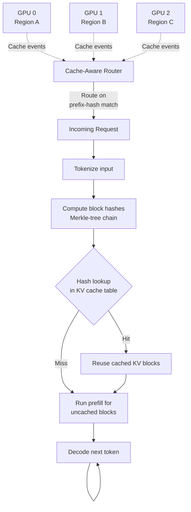

# Multi-Region LLM Serving and KV Cache Locality

## Learning Objectives

- Compute KV cache memory footprint for a given model, sequence length, and batch size, and predict whether a request will fit in GPU HBM alongside model weights.
- Trace the prefill vs decode cost differential and quantify the TTFT penalty when a request lands on a cold cache node.
- Implement a prefix-cache-aware router simulator in Python that routes on token-hash match with a GPU-utilization tie-breaker.
- Compare three multi-region KV cache strategies (sticky routing, migration, stateless prefix caching) by their compute, memory, and bandwidth costs.
- Diagnose cache miss rates in a simulated three-region deployment and identify the routing policy responsible.

## The Problem

You deploy inference endpoints in `us-east-1`, `eu-west-1`, and `ap-southeast-1`. You put a round-robin load balancer in front. The expectation is lower latency for global users — each user hits the closest region. Instead, your P50 time-to-first-token (TTFT) triples compared to a single-region deployment. Your vLLM logs show nearly every request paying full prefill cost. Prefix cache hit rate in production sits at 8%.

The cause is structural. LLM inference is stateful — the KV cache encodes everything the model has computed for this conversation. When a follow-up request from a user in Frankfurt gets round-robined to `us-east-1` instead of the `eu-west-1` node where the original request ran, that node has no KV cache for this conversation. The model must re-run prefill on the entire conversation history from scratch. A request that would have been ~80 ms (cache hit, decode only) becomes ~800 ms (full prefill on a long prompt). Round-robin is optimal for stateless services. LLM inference is stateful by design.

This is the KV cache locality problem: the routing layer is making decisions without knowledge of where the cache state lives. The fix is not more GPUs — it is a routing layer that is cache-aware.

## The Concept

### KV Cache Mechanics in Autoregressive Inference

During autoregressive generation, each attention layer computes key (K) and value (V) projections for every previous token in the sequence. Without a cache, generating token N would require recomputing attention over all N-1 previous tokens at every layer. Instead, the model stores these K and V tensors in the KV cache — a memory structure that grows linearly with sequence length.

The KV cache tensor shape is `[batch_size, num_kv_heads, seq_len, head_dim]`. For a model like Llama-2-70B (80 layers, 8 KV heads due to grouped-query attention, head_dim 128), a single sequence of 2048 tokens produces roughly 320 MB of KV cache per request in FP16. For a batch of 16 concurrent requests at 4096 tokens, that is ~20 GB — competing directly with the model's ~140 GB of weights for HBM space.

Prefill and decode have fundamentally different compute profiles. Prefill processes all input tokens in parallel through every layer — it is compute-bound, saturating GPU FLOPS. Decode generates one token at a time, reusing the cached K/V tensors — it is memory-bandwidth-bound, underutilizing compute. This is why prefill is 10–100x more expensive per token than decode depending on sequence length: prefill pays the full attention computation cost, while decode amortizes it across cached state.

The KV cache is tied to a specific GPU's memory space. It is not a database entry that can be queried — it is a set of contiguous tensors in HBM. Moving it means serializing tensors, transferring them over a network, and deserializing them into a different GPU's memory. This is the constraint that makes multi-region serving hard.

### Three Strategies and Their Costs

**Strategy 1: Sticky Routing.** Route all requests in a session to the same region. The KV cache stays warm across turns. The cost is load imbalance — if 60% of your traffic originates in North America, `us-east-1` GPUs saturate while `eu-west-1` sits idle. This works when traffic is geographically uniform and breaks when it is not.

**Strategy 2: KV Cache Migration.** Transfer the KV cache tensor to whichever region has capacity. A 2048-token context in Llama-70B produces roughly 2–4 GB of KV cache (depending on precision and grouped-query attention configuration). At typical inter-region network throughput (~100 MB/s sustained over cross-region links), migration takes 20–40 seconds — longer than just re-running prefill locally, which takes 0.5–1 second. KV cache migration over WAN distances is almost never worth it. It becomes viable only within a datacenter over NVLink or InfiniBand, where bandwidth is 50–300 GB/s.

**Strategy 3: Stateless with Prefix Caching.** Discard KV cache at region boundaries. Accept the prefill cost on cross-region handoffs. Mitigate the penalty by caching common prefixes — system prompts, few-shot examples, tool schemas — that are shared across requests and across users. If two requests share the same system prompt, the second request skips prefill for those tokens. This works across regions because the cache is populated independently on each region's local GPUs. This is what most production deployments do today.

### How Prefix Caching Works

Prefix caching uses a hash of the token sequence to look up pre-computed KV blocks. vLLM divides the sequence into blocks (typically 16 tokens each), computes a hash for each block that incorporates the hashes of all preceding blocks (forming a Merkle-tree-like structure), and checks a hash table before running prefill. If a block's hash matches a cached entry, the model reuses the stored KV tensor and skips attention computation for those tokens. If a request shares the first 512 tokens of a system prompt with a previously cached request, those 32 blocks are served from cache and prefill begins at token 513.



vLLM implements prefix caching via the `--enable-prefix-caching` flag. The mechanism is block-level KV cache reuse keyed on token hash. It is not predictive — it does not guess what tokens are coming. It is a hash table lookup before prefill begins, and if the hash matches, the stored tensor is used. The cache lives in GPU memory, so it is per-node. There is no cross-node cache sharing unless you explicitly implement cache migration (Strategy 2) or accept cold starts and rely on per-region prefix warming (Strategy 3).

### Cache-Aware Routing

The production pattern in 2026 is a cache-aware router that sits in front of inference nodes. The router consumes KV-cache events from each node (which prefixes are currently cached), and routes incoming requests to the node that has the longest prefix-hash match. If no node has a match, the router falls back to a tie-breaker — typically GPU utilization or queue depth. vLLM Router (written in Rust) and llm-d's router both implement this pattern. Recent research (GORGO) makes cross-region network latency an explicit term in the routing objective — the router weighs prefix-cache hit benefit against the network cost of reaching the node with the cache.

Commercial "cross-region inference" offerings (Bedrock cross-region inference, GKE multi-cluster gateways) treat inference as opaque. They handle availability, failover, and basic geographic routing. They do not expose KV cache state or route on prefix-hash match. If your traffic patterns rely on conversation continuity, these offerings will not prevent cold-start prefill penalties.

## Build It

Build a simulation that models a prefix-cache-aware router across three regions. The router tracks which token-block hashes are cached on each node, routes incoming requests to the node with the longest prefix match, and falls back to least-loaded on a miss. The simulation measures cache hit rate, prefill cost, and TTFT under different routing policies.

```python
import hashlib
import random
from dataclasses import dataclass, field
from collections import defaultdict

BLOCK_SIZE = 16
PREFILL_MS_PER_TOKEN = 0.4
DECODE_MS_PER_TOKEN = 0.05

def block_hash(tokens, index):
    block_tokens = tokens[index * BLOCK_SIZE : (index + 1) * BLOCK_SIZE]
    h = hashlib.md5(bytes(block_tokens)).hexdigest()
    return f"blk_{index}_{h}"

@dataclass
class InferenceNode:
    name: str
    region: str
    cached_prefixes: set = field(default_factory=set)
    gpu_utilization: float = 0.0

    def cache_request(self, tokens):
        for i in range(len(tokens) // BLOCK_SIZE):
            self.cached_prefixes.add(block_hash(tokens, i))

    def longest_prefix_match(self, tokens):
        matched_blocks = 0
        for i in range(len(tokens) // BLOCK_SIZE):
            if block_hash(tokens, i) in self.cached_prefixes:
                matched_blocks += 1
            else:
                break
        return matched_blocks

@dataclass
class RouterMetrics:
    requests: int = 0
    cache_hits: int = 0
    full_misses: int = 0
    total_prefill_tokens: int = 0
    total_cached_tokens: int = 0
    ttft_samples: list = field(default_factory=list)

class CacheAwareRouter:
    def __init__(self, nodes):
        self.nodes = nodes
        self.metrics = RouterMetrics()

    def route(self, tokens, session_id=None):
        self.metrics.requests += 1
        total_blocks = len(tokens) // BLOCK_SIZE
        best_node = None
        best_match = -1

        for node in self.nodes:
            match = node.longest_prefix_match(tokens)
            if match > best_match or (match == best_match and best_node and node.gpu_utilization < best_node.gpu_utilization):
                best_match = match
                best_node = node

        cached_tokens = best_match * BLOCK_SIZE
        prefill_tokens = len(tokens) - cached_tokens

        if cached_tokens > 0:
            self.metrics.cache_hits += 1
        else:
            self.metrics.full_misses += 1

        self.metrics.total_prefill_tokens += prefill_tokens
        self.metrics.total_cached_tokens += cached_tokens

        ttft_ms = prefill_tokens * PREFILL_MS_PER_TOKEN + 5.0
        self.metrics.ttft_samples.append(ttft_ms)

        best_node.cache_request(tokens)
        return best_node, cached_tokens, prefill_tokens, ttft_ms

class RoundRobinRouter:
    def __init__(self, nodes):
        self.nodes = nodes
        self.idx = 0
        self.metrics = RouterMetrics()

    def route(self, tokens, session_id=None):
        self.metrics.requests += 1
        node = self.nodes[self.idx % len(self.nodes)]
        self.idx += 1

        cached_tokens = 0
        self.metrics.full_misses += 1
        prefill_tokens = len(tokens)
        self.metrics.total_prefill_tokens += prefill_tokens

        ttft_ms = prefill_tokens * PREFILL_MS_PER_TOKEN + 5.0
        self.metrics.ttft_samples.append(ttft_ms)

        node.cache_request(tokens)
        return node, cached_tokens, prefill_tokens, ttft_ms

class StickyRouter:
    def __init__(self, nodes):
        self.nodes = nodes
        self.session_map = {}
        self.metrics = RouterMetrics()

    def route(self, tokens, session_id=None):
        self.metrics.requests += 1

        if session_id and session_id in self.session_map:
            node = self.session_map[session_id]
        else:
            node = min(self.nodes, key=lambda n: n.gpu_utilization)
            if session_id:
                self.session_map[session_id] = node

        match = node.longest_prefix_match(tokens)
        cached_tokens = match * BLOCK_SIZE
        prefill_tokens = len(tokens) - cached_tokens

        if cached_tokens > 0:
            self.metrics.cache_hits += 1
        else:
            self.metrics.full_misses += 1

        self.metrics.total_prefill_tokens += prefill_tokens
        self.metrics.total_cached_tokens += cached_tokens

        ttft_ms = prefill_tokens * PREFILL_MS_PER_TOKEN + 5.0
        self.metrics.ttft_samples.append(ttft_ms)

        node.cache_request(tokens)
        return node, cached_tokens, prefill_tokens, ttft_ms

def generate_session_traffic(num_sessions, turns_per_session, base_prompt_len):
    sessions = []
    for s in range(num_sessions):
        prompt = [random.randint(0, 32000) for _ in range(base_prompt_len)]
        session = []
        for t in range(turns_per_session):
            context = prompt + [random.randint(0, 32000) for _ in range(32 * (t + 1))]
            session.append({"session_id": f"sess_{s}", "tokens": context})
        sessions.append(session)
    return sessions

def run_simulation(router_name, router, traffic):
    for session in traffic:
        for request in session:
            node, cached, prefill, ttft = router.route(request["tokens"], request["session_id"])
    m = router.metrics
    avg_ttft = sum(m.ttft_samples) / len(m.ttft_samples) if m.ttft_samples else 0
    sorted_ttft = sorted(m.ttft_samples)
    p50 = sorted_ttft[len(sorted_ttft) // 2] if sorted_ttft else 0
    p99 = sorted_ttft[int(len(sorted_ttft) * 0.99)] if sorted_ttft else 0
    hit_rate = m.cache_hits / m.requests * 100 if m.requests else 0

    print(f"\n{'='*60}")
    print(f"Router: {router_name}")
    print(f"{'='*60}")
    print(f"  Requests:              {m.requests}")
    print(f"  Cache hits:            {m.cache_hits} ({hit_rate:.1f}%)")
    print(f"  Full misses:           {m.full_misses}")
    print(f"  Total prefilled tokens: {m.total_prefill_tokens:,}")
    print(f"  Total cached tokens:   {m.total_cached_tokens:,}")
    print(f"  Avg TTFT:              {avg_ttft:.1f} ms")
    print(f"  P50 TTFT:              {p50:.1f} ms")
    print(f"  P99 TTFT:              {p99:.1f} ms")
    return hit_rate, p50

random.seed(42)

SYSTEM_PROMPT = [hash(f"sys_{i}") % 32000 for i in range(256)]

traffic = []
for s in range(20):
    session = []
    full_prompt = SYSTEM_PROMPT.copy()
    for t in range(5):
        new_tokens = [random.randint(0, 32000) for _ in range(48)]
        full_prompt = full_prompt + new_tokens
        session.append({"session_id": f"sess_{s}", "tokens": full_prompt.copy()})
    traffic.append(session)
traffic = [req for session in traffic for req in session]

nodes_rr = [InferenceNode(f"node-{i}", r) for i, r in enumerate(["us-east-1", "eu-west-1", "ap-southeast-1"])]
nodes_sticky = [InferenceNode(f"node-{i}", r) for i, r in enumerate(["us-east-1", "eu-west-1", "ap-southeast-1"])]
nodes_cache = [InferenceNode(f"node-{i}", r) for i, r in enumerate(["us-east-1", "eu-west-1", "ap-southeast-1"])]

rr = RoundRobinRouter(nodes_rr)
sticky = StickyRouter(nodes_sticky)
cache_aware = CacheAwareRouter(nodes_cache)

run_simulation("Round-Robin (stateless)", rr, traffic)
run_simulation("Sticky Session Routing", sticky, traffic)
run_simulation("Cache-Aware Router (prefix-hash match)", cache_aware, traffic)

print(f"\n{'='*60}")
print("KV CACHE MEMORY FOOTPRINT CALCULATOR")
print(f"{'='*60}")

def kv_cache_size_gb(num_layers, num_kv_heads, seq_len, head_dim, batch_size, bytes_per_element=2):
    elements = num_layers * num_kv_heads * seq_len * head_dim * batch_size
    return elements * bytes_per_element / (1024**3)

models = {
    "Llama-2-7B": {"layers": 32, "kv_heads": 32, "head_dim": 128, "weights_gb": 13.0},
    "Llama-2-70B": {"layers": 80, "kv_heads": 8, "head_dim": 128, "weights_gb": 140.0},
    "Llama-3-8B": {"layers": 32, "kv_heads": 8, "head_dim": 128, "weights_gb": 16.0},
    "Llama-3-70B": {"layers": 80, "kv_heads": 8, "head_dim": 128, "weights_gb": 140.0},
}

configs = [
    ("batch=1, seq=2048", 1, 2048),
    ("batch=1, seq=8192", 1, 8192),
    ("batch=16, seq=4096", 16, 4096),
    ("batch=32, seq=4096", 32, 4096),
]

for model_name, cfg in models.items():
    print(f"\n  {model_name} (weights: {cfg['weights_gb']:.0f} GB FP16):")
    for label, batch, seq in configs:
        kv_gb = kv_cache_size_gb(cfg["layers"], cfg["kv_heads"], seq, cfg["head_dim"], batch)
        total = kv_gb + cfg["weights_gb"]
        fits_80gb = "FITS A100-80GB" if total <= 80 else "EXCEEDS A100-80GB"
        print(f"    {label:25s} -> KV: {kv_gb:7.2f} GB  Total: {total:7.2f} GB  [{fits_80gb}]")
```

Run this and observe the output. The cache-aware router should show significantly higher hit rates and lower P50 TTFT than round-robin, especially for multi-turn sessions that share a system prompt prefix. The memory footprint calculator shows exactly when KV cache pressure forces you into multi-GPU sharding or smaller batch sizes.

## Use It

Run the simulation above and answer these diagnostic questions by modifying the code:

**1. Identify the cross-region penalty.** The simulation uses inter-node latency of 0 ms (same datacenter). Add a `network_latency_ms` parameter to each `InferenceNode` representing cross-region distance (e.g., `us-east-1` to `eu-west-1` is ~70 ms one-way). Re-run the cache-aware router and observe how network latency interacts with cache-hit benefit. At what network latency does migrating to a cached node become slower than re-prefilling locally? The answer: when `network_latency_ms > prefill_tokens * PREFILL_MS_PER_TOKEN`. For a 512-token prefill, that threshold is ~200 ms — well below inter-region latency.

**2. Measure prefix cache warming time.** In a fresh deployment, no region has any cache. Simulate a cold start where the first N requests must prefill before the cache stabilizes. How many requests does it take for the cache-aware router to reach a steady-state hit rate above 70%? This is your cache warming window — the period during which TTFT will be elevated after a deploy.

This connects directly to the MLOps/GTM system lifecycle concept. In Zone 17 of the GTM framework, the parallel is versioning your enrichment waterfalls and detecting scoring drift. When you deploy a new Clay table with a modified scoring waterfall — different system prompt, different enrichment sequence — you are effectively cold-starting the KV cache. The first batch of enrichment requests pays full prefill cost. Versioning your Clay tables is the GTM equivalent of versioning your inference model: both need a rollback strategy, and both have a warming cost when you deploy a new version. If you swap a system prompt in your LLM enrichment step and TTFT triples for 30 minutes, that is your cache warming window — not a production incident. [CITATION NEEDED — concept: Clay table versioning and scoring drift lifecycle]

**3. Diagnose production miss rates.** The simulation prints cache hit rate and P50/P99 TTFT. In production, vLLM exposes these via its metrics endpoint (`/metrics` in Prometheus format). Look for `vllm:time_to_first_token_seconds` and `vllm:request_success_total`. If your hit rate is below 20% and P50 TTFT is 3x your P99 decode latency, your router is not cache-aware — it is round-robin or geographic, and you are paying prefill cost on most requests.

```python
import random

def simulate_production_diagnosis(hit_rate_target, num_requests=1000):
    random.seed(42)
    ttfts = []
    prefills = []

    for _ in range(num_requests):
        is_hit = random.random() < (hit_rate_target / 100)
        prompt_len = random.randint(128, 2048)

        if is_hit:
            cached = random.randint(prompt_len // 4, prompt_len // 2)
            prefill = prompt_len - cached
        else:
            prefill = prompt_len

        prefills.append(prefill)
        ttft = prefill * PREFILL_MS_PER_TOKEN + 5.0
        ttfts.append(ttft)

    ttfts.sort()
    actual_hit_rate = sum(1 for p in prefills if p < 2048) / num_requests
    avg_prefill = sum(prefills) / num_requests
    p50_ttft = ttfts[len(ttfts) // 2]
    p99_ttft = ttfts[int(len(ttfts) * 0.99)]

    diagnosis = "CACHE-AWARE" if p50_ttft < 300 else "ROUND-ROBIN / STATELESS"

    print(f"\n{'='*55}")
    print(f"  Production Diagnosis Report")
    print(f"{'='*55}")
    print(f"  Simulated hit rate:    {hit_rate_target:.1f}%")
    print(f"  Avg tokens prefilled:  {avg_prefill:.0f}")
    print(f"  P50 TTFT:              {p50_ttft:.1f} ms")
    print(f"  P99 TTFT:              {p99_ttft:.1f} ms")
    print(f"  Diagnosis:             {diagnosis}")
    if diagnosis == "ROUND-ROBIN / STATELESS":
        print(f"  Action: Deploy cache-aware router")
        print(f"          Enable --enable-prefix-caching")
        print(f"          Pin sessions to nodes via prefix-hash routing")
    print(f"{'='*55}")

for hr in [8, 25, 55, 80]:
    simulate_production_diagnosis(hr)
```

## Ship It

Deploying a cache-aware multi-region inference setup requires three components: the inference engine with prefix caching enabled, a router that routes on prefix-hash match, and a DR plan that does not lose your tokenizer.

**Component 1: Enable prefix caching in vLLM.** Start each regional vLLM instance with `--enable-prefix-caching`. This enables block-level KV cache reuse. There is no configuration for cache size — vLLM uses available HBM after model weights are loaded. Monitor `vllm:gpu_cache_usage_perc` to ensure you are not evicting useful prefixes due to memory pressure.

**Component 2: Deploy a cache-aware router.** vLLM Router (Rust) consumes KV-cache events from each backend node and routes on prefix-hash match. Configure it with your backend node list and set the tie-breaker to GPU utilization. The router's routing decision is the longest common prefix between the incoming request and any cached prefix on any node. For cross-region deployments, add a latency penalty term: if the best cache match is in a region with >150 ms network latency, compare the cache savings against the network cost and fall back to local prefill if network cost exceeds cache savings.

```python
import time
import hashlib

class ProductionRouterDecision:
    def __init__(self, nodes, prefill_ms_per_token=0.4, network_penalty_per_ms=1.0):
        self.nodes = nodes
        self.prefill_ms_per_token = prefill_ms_per_token
        self.network_penalty_per_ms = network_penalty_per_ms

    def evaluate_routing_decision(self, tokens, source_region):
        decisions = []
        total_tokens = len(tokens)

        for node in self.nodes:
            match = node.longest_prefix_match(tokens)
            cached_tokens = match * BLOCK_SIZE
            prefill_tokens = total_tokens - cached_tokens

            prefill_cost = prefill_tokens * self.prefill_ms_per_token

            latency_map = {
                ("us-east-1", "eu-west-1"): 70,
                ("us-east-1", "ap-southeast-1"): 180,
                ("eu-west-1", "ap-southeast-1"): 250,
            }
            latency_map[("us-east-1", "us-east-1")] = 1
            latency_map[("eu-west-1", "eu-west-1")] = 1
            latency_map[("ap-southeast-1", "ap-southeast-1")] = 1

            for (r1, r2), lat in latency_map.items():
                if source_region in (r1, r2) and node.region in (r1, r2):
                    network_latency = lat
                    break
            else:
                network_latency = 200

            total_cost = prefill_cost + network_latency

            decisions.append({
                "node": node.name,
                "region": node.region,
                "cached_tokens": cached_tokens,
                "prefill_tokens": prefill_tokens,
                "prefill_cost_ms": prefill_cost,
                "network_latency_ms": network_latency,
                "total_cost_ms": total_cost,
                "is_cache_hit": cached_tokens > 0,
            })

        decisions.sort(key=lambda d: d["total_cost_ms"])
        best = decisions[0]

        print(f"\n  Source region: {source_region}")
        print(f"  Total tokens:  {total_tokens}")
        print(f"  {'Node':<18} {'Region':<16} {'Cached':<8} {'Prefill':<8} {'Net(ms)':<9} {'Total(ms)':<10} {'Decision'}")
        print(f"  {'-'*85}")

        for d in decisions:
            marker = " <== SELECTED" if d == best else ""
            hit = "HIT" if d["is_cache_hit"] else "MISS"
            print(f"  {d['node']:<18} {d['region']:<16} {d['cached_tokens']:<8} {d['prefill_tokens']:<8} {d['network_latency_ms']:<9} {d['total_cost_ms']:<10.1f} {hit}{marker}")

        cache_savings = (total_tokens - best["prefill_tokens"]) * self.prefill_ms_per_token
        print(f"\n  Selected: {best['node']} ({best['region']})")
        print(f"  Cache savings: {cache_savings:.0f} ms avoided prefill")
        print(f"  Net total cost: {best['total_cost_ms']:.0f} ms (prefill {best['prefill_cost_ms']:.0f} + network {best['network_latency_ms']} ms)")
        return best

nodes = [
    InferenceNode("infer-us-1", "us-east-1"),
    InferenceNode("infer-eu-1", "eu-west-1"),
    InferenceNode("infer-ap-1", "ap-southeast-1"),
]

shared_system_prompt = [hash(f"sys_{i}") % 32000 for i in range(512)]
for node in nodes[:2]:
    node.cache_request(shared_system_prompt)

router = ProductionRouterDecision(nodes)

print("=" * 90)
print("ROUTING DECISION: Request from Frankfurt (eu-west-1), shared system prompt")
print("=" * 90)
router.evaluate_routing_decision(
    shared_system_prompt + [hash(f"user_{i}") % 32000 for i in range(128)],
    "eu-west-1"
)

print("\n" + "=" * 90)
print("ROUTING DECISION: Request from Singapore (ap-southeast-1), shared system prompt")
print("=" * 90)
router.evaluate_routing_decision(
    shared_system_prompt + [hash(f"user_{i}") % 32000 for i in range(128)],
    "ap-southeast-1"
)

print("\n" + "=" * 90)
print("ROUTING DECISION: Request from Frankfurt, NO shared prefix (cold)")
print("=" * 90)
router.evaluate_routing_decision(
    [hash(f"new_{i}") % 32000 for i in range(640)],
    "eu-west-1"
)
```

**Component 3: DR checklist.** 32% of LLM DR failures occur because teams backed up model weights but forgot the tokenizer files or quantization configs. JPMorgan and Mayo Clinic ran a cross-region failover test in November 2024 that took ~22 minutes. The failures were not GPU provisioning — they were missing artifacts. Your DR checklist must include: (1) `model.bin` / `model.safetensors` (weights), (2) `tokenizer.json` + `tokenizer_config.json` + `special_tokens_map.json` (tokenizer), (3) `config.json` + generation config (model configuration), (4) `quantization_config.json` if using AWQ/GPTQ. Without all four, the model will not load.

In GTM terms, this maps to Zone 17 — the MLOps/GTM system lifecycle. Versioning your enrichment waterfalls and detecting scoring drift is the GTM equivalent of versioning your inference artifacts. If you deploy a new Clay table version that calls a different LLM endpoint, you need the same artifact discipline: the table definition, the enrichment formulas, the scoring model config, and the prompt template. A Clay table without its enrichment formulas is a model without its tokenizer — it loads but produces wrong output. [CITATION NEEDED — concept: Clay table artifact dependencies for DR]

```python
import os
import json

def generate_dr_checklist(model_name, artifact_paths):
    required = {
        "weights": ["model.safetensors", "model.bin", "pytorch_model.bin"],
        "tokenizer": ["tokenizer.json", "tokenizer_config.json", "special_tokens_map.json"],
        "config": ["config.json", "generation_config.json"],
        "quantization": ["quantize_config.json", "quantization_config.json"],
    }

    print(f"\n{'='*65}")
    print(f"  DR Checklist: {model_name}")
    print(f"{'='*65}")

    all_present = True
    for category, filenames in required.items():
        found = []
        missing = []
        for fn in filenames:
            present = any(fn in str(p) for p in artifact_paths)
            if present:
                found.append(fn)
            else:
                missing.append(fn)

        if found:
            status = "OK"
            detail = f"Found: {found[0]}"
        elif missing:
            if category == "quantization":
                status = "SKIP"
                detail = "Not quantized (or check manually)"
            else:
                status = "MISSING"
                detail = f"Missing: {', '.join(missing)}"
                all_present = False

        marker = "[OK]" if status == "OK" else ("[--]" if status == "SKIP" else "[!!]")
        print(f"  {marker} {category:<15} {detail}")

    can_restore = all_present
    print(f"\n  Restore ready: {'YES' if can_restore else 'NO — fix missing artifacts'}")
    if not can_restore:
        print(f"  Risk: 32% of LLM DR failures are from missing non-weight artifacts")
    print(f"{'='*65}")
    return can_restore

artifacts_good = [
    "/models/llama-3-70b/model.safetensors",
    "/models/llama-3-70b/tokenizer.json",
    "/models/llama-3-70b/tokenizer_config.json",
    "/models/llama-3-70b/special_tokens_map.json",
    "/models/llama-3-70b/config.json",
    "/models/llama-3-70b/generation_config.json",
]

artifacts_bad = [
    "/models/llama-3-70b/model.safetensors",
    "/models/llama-3-70b/config.json",
]

generate_dr_checklist("Llama-3-70B (complete)", artifacts_good)
generate_dr_checklist("Llama-3-70B (missing tokenizer)", artifacts_bad)
```

## Exercises

**Exercise 1: Compute the migration break-even point.** Given a Llama-3-70B model processing a 4096-token conversation, compute the KV cache size in GB (FP16). Then compute the network transfer time at 100 MB/s (inter-region WAN), 1 GB/s (same-AZ), and 50 GB/s (NVLink within a node). Compare each against the local prefill time (assume 0.4 ms/token). At what bandwidth does migration become faster than local re-prefill? Write the computation as a Python script that prints a comparison table.

**Exercise 2: Simulate sticky routing failure.** Modify the simulation to model geographic traffic distribution: 55% of sessions originate in North America, 25% in Europe, 20% in Asia-Pacific. Run the sticky router and measure GPU utilization imbalance across regions. Compute the P99 TTFT for the overloaded region. How much worse is P99 compared to the cache-aware router that can redistribute overflow traffic?

**Exercise 3: Build a GORGO-style latency-aware router.** Extend `ProductionRouterDecision` to accept a configurable `latency_weight` parameter that scales the network latency penalty. Run the router with `latency_weight=0` (pure cache-match, ignore network), `latency_weight=1.0` (network cost equals prefill cost), and `latency_weight=5.0` (network-averse). For each setting, report which node gets selected for a request from `ap-southeast-1` when the only cache hit is on `eu-west-1`. Plot the decision boundary — at what prompt length does network-averse routing start preferring local cold prefill over remote cache hits?

**Exercise 4: Build a 3-file DR validator.** Write a script that takes a model directory path and validates the presence of all required artifacts (weights, tokenizer, config). The script should exit with code 1 if any required file is missing and print a specific remediation message for each missing artifact. Test it on a real model directory from HuggingFace (e.g., download `meta-llama/Llama-3.2-1B` and run the validator).

## Key Terms

**KV Cache** — Memory structure storing key and value projections for all previous tokens in a sequence. Shape: `[batch, num_kv_heads, seq_len, head_dim]`. Grows linearly with sequence length. Lives in GPU HBM, tied to a specific node.

**Prefill** — Processing all input tokens through every model layer before generation begins. Compute-bound. 10-100x more expensive per token than decode. This is the cost paid on a cache miss.

**Decode** — Generating